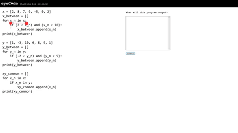

第三章：真正搞定至少一本教科书
========================================

1. 学校让大多数人变成了学渣……
----------------------------------------

.. sidebar:: 自学的基础

    能够做到反复通读教科书的人，基本上没有学不会的东西…… 所谓高超自学能力的基础，也只不过如此。有些人一辈子学不好什么，而另外一些人却可以需要什么就能学会什么？其中的差异，亦只不过如此。

学会任何东西，最有效率的方法只有一个：

	**反复通读一本教科书。**

其实，从小到大我们都是这么干的。在学校里，在每个学期里，我们所做的事情无非是反复通读几本教科书而已。通读教科书好像没多难，但也挺难的 —— 你看，有老师带着，有同学陪着，中间还有每天的作业以及时不时小测验监督着，结果，竟然绝大多数人并没有彻底掌握那几本教科书的知识……

不知道为什么，学校里的学习过程、练习方法、考核方法都实际在起着反作用，原本是想让人们通过学校里的教育进步的，但最终的结果却是让大多数人变成了学渣。为什么呢？

许多年后，有一个特别坑人思维定势左右者所有人：

	**好像没有什么东西学过之后是可以打满分的！**

这个想法带来的衍生思维定势是这样的：

	**既然不能满分（甚至哪怕不能优秀），那么学到的东西就是没用的……**

可问题在于，这些想法完全是错的！错得离谱。因为，首先，在现实世界里，没有人有能力或者配得上为现实生活设计有效的考试去衡量一个人的方方面面。然而更为重要的是，现实生活的原则本质上是很现实的：

	**无论什么技能，“够用就行” —— 总比完全不会强！**

况且，还有另外一个重要的事实：

	只要够用，就能用起来，只要用起来，就只能越做越好…… 没有人从一开始就能做好，都是慢慢练出来的，慢慢积累出来的。

小学六年，高中六年，本科四年，一晃十六年过去，给绝大多数人留下的印迹是，只要没有人带，只要没有人陪，只要没有人逼着做作业，没有人逼着参加考试，就完全不知道怎么学了，虽然心里也知道这明显是不仅自己也能做，其实自己也能做好的事情……

2. 只选一本书肯定是错的……
----------------------------------------

小时候，学习能力差，理解能力不成熟，所以，我们在任何技能上，都是靠“统一的教科书”、“统一的教学方法”、“统一的考核方法”去搞定。另外一个原因是，整个社会也确实没有能力为每个人“定制教科书、定制教学方法、定制考核方法”，于是只能统一。然而，随着年龄的增加，学习经验的丰富，学习能力的积累，二十岁之后我们还用过去的方法，就明显是“**失误**”。

改进的方法倒也简单：

	**筛选一本以上的教科书，对比、参照着反复通读。**

.. sidebar::  当学霸其实不难……

    学霸们并不觉得自己把一本教科书看一遍就能彻底学会，也不会指望自己只读一本教科书就能彻底学会……

这看起来好像没有多大的改动，实际上是一种“**革命**”。于是，那些自学经验丰富的人、已经给自己革过命的人，通常不会跑到各种论坛上发问，也很少请别人给他们推荐“最好的教科书” —— 挑书从来都是应该自己去做的事情；也更因为对他们来说，没有什么教科书是“最好的”，各有各的优势，各有各的缺陷。

筛选 Python “教科书”，排名第一的，当然是 Python 的 `官方文档 <https://docs.python.org>`_ —— **官方文档永远是首选**。而它里面的 `Tutorial <https://docs.python.org/3/tutorial/index.html>`_  当然是通读的首选。没有耐心的人有没有耐心的方法 —— 那就是找一本简短的书。 `A Byte of Python <https://python.swaroopch.com/>`_  就是很简短的一本书，它也有中译版 `简明 Python 教程 <https://www.gitbook.com/book/lenkimo/byte-of-python-chinese-edition/discussions>`_。还有另外两本书值得选，第一本是因为它的主旨很好，它并不是要关注如何学会 Python 这个特定的编程语言，而是学会编程思维 —— `Think Python 2e <greenteapress.com/wp/think-python/>`_ ，它也有 `中译版 <https://www.gitbook.com/book/cycleuser/think-python/details>`_ 第二本是因为它那切合标题的内容： `The Self-Taught Programmer: The Definitive Guide to Programming Professionally <https://theselftaughtprogrammer.io/>`_ —— 这本书暂时没有免费版，也没有中译版，买罢！

3. 处理一本教科书的方法
----------------------------------------

注意我的措辞，“处理”一本教科书的方法。我们不把“精通”当作起步时的负担 —— 因为那是长期反复研读之后的境界。我们也无需保证或者强求自己在最快的时间里以最高的效率完成消化或者达成成就。“处理”的意思是说，该做什么就做什么，做完为止。做得好不好并无关系，因为反复做过之后，必然一遍比一遍更好 —— 所有的技能获得，最终都是卖油翁说出来的那条真理：“无他，手熟儿。”

学习任何一项技能，其实抽象到最后，都是一样的：

	* 在大脑中构建新的、清晰、准确、必要的 **概念**；
	* 然后，把大脑中清晰准确必要的概念之间建立清晰、准确、必要的 **关联**。

在此之前，你就学了一个新的概念：

	在编程语言中，``=`` 与它在代数中的作用不同。在编程语言里，它是个操作符，功用是“赋值” —— 它会让 ``=`` 左边的变量值变成 ``=`` 右边的计算结果，而 ``=`` 右边出现的变量的值，都是该变量在此之前所保存的值。

它与之前你脑子里的那个在代数里所使用的符号，有什么关联呢？

	长得一样，但作用不一样。

至此，你在新的领域卖出了一小步。

.. sidebar:: 如何偷懒？

    偷懒的唯一办法就是坚决不偷懒。被你偷掉的懒，早晚会在你不知不觉之中投光你的时间 —— 不仅如此，等你发现的时候，它早已投光你的所有选择。

由此看来，学霸们喜欢做笔记、做总结，喜欢做脑图（其实就是关联图），都是有原因的 —— 因为那就是学习的最基本方式。学渣什么特点呢？这些最基本的东西他们都不喜欢做，他们抄别人的笔记，看别人的总结，收集很多别人做的脑图…… 美其名曰：直接看精华。殊不知，那些看起来是精华的东西，其实只不过是学霸们消化（处理）之后排（输出）出来的东西而已 —— 其实，**那消化（处理）的过程才是真正重要的部分**，那才是真正的精华。

任何一本教科书，都是一样的，尽量循序渐进地在每一个章节里讲解一个重要的概念（它可能由很多个子概念组成），然后说清楚：

	* 它是什么？
	* 它不是什么？
	* 如何用它？
	* 什么时候不能用它？
	* 用它的时候还需要注意什么？
	* 它和类似的某个概念之间的区别？
	* 必要的练习
	* ……
	  
你仔细看看、想想就知道了，以上的结构，基本上是你这辈子读过的所有教科书都采用的一模一样的结构。这也是一种“**总结**”。于是，有经验的你，在拿起任何一本教科书的时候，脑子里早已经有所期待，于是，处理起来比那些从未总结过的人来说，相对更加得心应手。

之前让你搜索过 `Python Cheatsheet`，我也建议以后你也要养成无论学什么都先去搜索一下 `xx Cheatsheet` 的习惯…… 通过上面的讲解，你也明白了，那些 `Cheatsheet` 实际上就是那些学霸自己消化过后的“排泄物”，你的任务不是把那“排泄物”吃下去，而是，通过模仿、通过摸索，解决一个问题：**我如何才能‘排’出这种东西？**

至于到底应该“如何”，其实是需要你去摸索的事儿，到最后能‘排’出来的东西没准只有你自己一个人看得懂呢！不过，方法倒是确定了：

	在处理教科书的时候，读完每个章节，**都一定要做一个 `Cheatsheet` 给自己。**

当然，别人想要的话，就给他们，否则他们会生气，或者觉得你很小气！只不过，你可能没时间把那个 `Cheatsheet` 做得那么漂亮，那么工整，你也可能没兴趣拿到大庭广众之下显摆…… 然而，确定的是，不做却是绝对不可以的！

4. 从某一本书开始罢
----------------------------------------

TODO
----------------------------------------

随便

----------------------------------------

先从读一本小书开始：

https://www.gitbook.com/book/lenkimo/byte-of-python-chinese-edition/details

以后你就知道了，编程语言其实都差不多，都由差不多相同的组成部分 —— 因为程序干的事儿抽象到最后，其实最终都一样：

	* 运算
	* 判断
	* 重复

所以，不管是 C，还是 C++，抑或 Python、Java、Javascript、Go，都一样，最终都是要做运算、判断、重复的…… 你不妨到网上书店里翻翻不同编程语言的教程，看看它们的目录，你会发现的，其实都一样，都有诸如以下的章节：

	* 变量和数据类型
	* 操作符（或称运算符）
	* 条件判断
	* 循环
	* ……
	  
所以，这些概念并不是哪一种编程语言特有的，所有编程语言都得用，只不过，最终，各个编程语言的语法规则定义略有不同，比如，很多语言用大括号 ``{}`` 定义程序块，Python 用一个冒号 ``:`` 以及随后语句之前的缩进定义程序块；再比如，有些语言需要明确地使用分号 ``;`` 作为一个语句的结束，Python 却不一定用…… 当然，各个编程语言有各自的特色，各自擅长的领域 —— 所以，绝大多数程序员会不止一种语言；也正因如此，学会一个编程语言之后，再学其它的编程语言就很简单，基本上是一周，甚至一天的事情。

上一段最后一句话的意思是说：

	* 学第一个编程语言的时候，可以 **刻意** 慢一点，反正是越扎实越好 —— 反正以后就越来越简单了……
	* 更重要的是，无论什么技能都一样，学会之后就很简单，虽然刚开始的时候有很难很难的错觉……
	  
如何输入？键盘、文件
如何输出？键盘、文件
如何判断？
如何循环？
如何遍历数组？

.. centered:: `Watch "Eye-Tracking Code Experiment" on youtube <https://www.youtube.com/watch?v=VtuO9un2Vyg&t=70s>`_ 

Good Python code to read:

https://news.ycombinator.com/item?id=9896369

http://docs.python-guide.org/en/latest/writing/reading/

