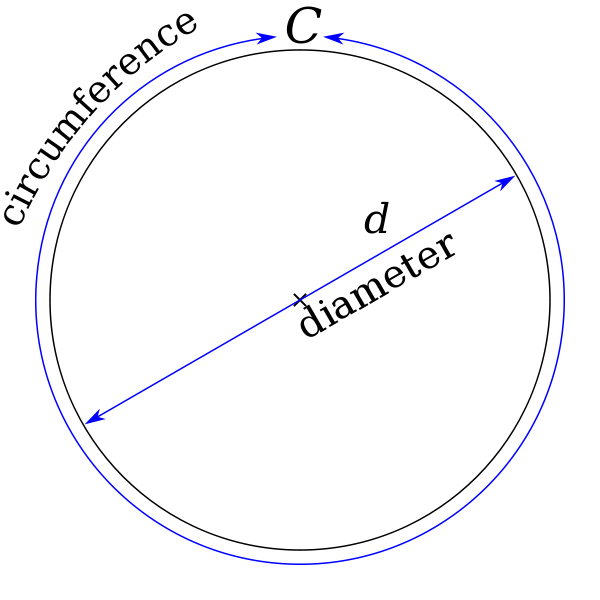
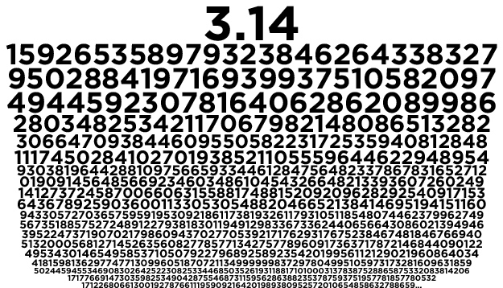

第二章：你的第一个程序
========================================

放心，你的第一个程序肯定不是那个著名的“Hello World!”…… 那个实在是太不好玩了。

1. π 这个数字很好玩
----------------------------------------

π 被定义为标准圆的周长和直径的比例： :math:`\pi = \frac{C}{d}` ……

可问题它的数值究竟是什么呢？人类为此努力了几千年呢！公元 480 年前后，中国的祖冲之给出一个估算： :math:`\frac{22}{7} < \pi < \frac{355}{113}`，即， `3.1415926` < π < `3.1415927`。有人觉得祖冲之没什么了不起，因为他相当于是用在他大约两百年前的刘徽得出 :math:`π ≈ \frac{157}{50}` 的方法接着“死算”出来的…… 可说实话，在没有计算机、计算器的年代，死算绝对是功夫啊！

你可以在 Python 命令行里输入试试：

.. code-block:: none

	$ python
	>>> 355/113
	3.1415929203539825
	>>> 22/7
	3.142857142857143

.. sidebar:: 如何在键盘上敲出 π ？

    有快捷键： ⌥ + p ；你还可以按着 ⌥ 把其它 26 个字母都试一下？

有空的话可以到 Google 一下 `history of π <https://www.google.com/search?q=history+of+π>`_ （哈，必须有空！）—— 挺有意思的。十八世纪，德国数学家戈特弗里德·莱布尼茨（ `Gottfried Wilhelm Leibniz，1646.7.1－1716.11.14 <https://baike.baidu.com/item/戈特弗里德·威廉·莱布尼茨/5028927>`_ ） 提出一个另外一个可以通过“死算”去无限接近 π 的算法，倒是很适合拿来作为编程教学的例子：

.. math::
	\frac{\pi}{4} = \frac{1}{1} - \frac{1}{3} + \frac{1}{5}- \frac{1}{7} ... 

按照这个算法，大抵上要算上 10,000 项，才有小数点后 3 位精确（``3.141\49...``）…… 于是，想要更精确的结果，是绝对没办法通过手工计算完成的，而且中间若是出错，甚至都难以想象应该如何检查。而这样的时候，就是我们需要计算机的时候：告诉它怎么做，然后重复甚至无数次，直至得到我们满意的结果 —— 某种意义上，计算机从一开始就是被设计来做这种事情的 —— 并且，最好的是：它不会出错！

2. 编辑并运行一个程序
----------------------------------------

现在开始动手，尝试编辑一下你的第一个程序罢 —— 虽然你有可能完全看不懂……

用 Terminal 给自己创建一个工作目录：

.. code:: bash

	mkdir ~/code/python
	cd ~/code/python

然后用 PyCharm 打开这个目录（注意末尾的那个点`.`）：

.. code:: bash

	$ charm .

在 PyCharm 中通过快捷键 ``⌘n`` 创建一个新文件，`computing_pi.py` 并保存，输入以下内容，注意，不许拷贝粘贴！

.. code-block:: python

	# Computing π with Leibniz's formula 
	pi, sign = 0, 1
	n = int(input("We'll caculate 10**n terms...\nPlease specify n:"))
	terms = 10 ** n
	for i in range(terms * 2):
	    if i/2 != int(i/2):
	        pi = pi + 4 * sign / i
	        print(pi)
	        sign = sign * -1
	        
这只是一个“演示”程序，所以它很“初级”，比如，程序执行之后，当你被要求输入数字的时候，若是你输入了一个字母，它没有错误处理，直接报错；再比如，我们没用 `pi += 4 * sign / i` 这样用 ``+=`` 的“高级用法”。现在，这并不重要，重要的是，你大概知道程序这东西究竟是怎么回事儿了。

如果你的输入没有任何错误的话（第一次通常不太可能），那么就可以通过快捷键 ``⌃ ⌥ r`` 运行这个程序了。它会要求你输入一个数字（你就输入 1~6 之间的整数就行），而后给你一个运算结果 —— 比如，你输入的数字是 `6`，那么，程序总计大约运算了 1,000,000 个项（10 :sup:`6`），而你会看到的结果大概是：

.. program-output:: python code/computing_pi_1.py
    :ellipsis: 3, -6

3. 程序员的编辑器都是很智能的……
----------------------------------------

在计算机上输入各种字符，事实上是很不容易的。并且，写程序又不是写文章，有几个错别字无所谓，反正读文章的是人，他们看得懂，猜的出…… 写程序不行，错一个字符都不行。并且，还有那么多的规矩，比如，在 Python 里，行首的“缩进”是有意义的，再比如，有些语句末尾要加上冒号 ``:``，否则就会报错…… 所以，程序员所使用的编辑器（无论是哪一种，Vi、Emacs、SublimeText 等等），包括 PyCharm，都有很多帮助程序员方便输入编辑程序的功能。

比如，比如，当你用选中 `We'll caculate 10**n terms...\nPlease specify n:` 这样一串支付之后，按一次 ``"``，你就会发现，在字符串两端都加上了引号。

再比如，你可能已经注意到了，在 PyCharm 编辑器里，当你输入左括号 ``(`` 的时候，它会自动补足对应的右括号，而后变成 ``()``。等你在括号里输入了一些字符之后，如果你觉得把手移开而后去按 ``→`` 键很麻烦的话（因为右手离开了键盘的主位，一会儿还要重新移过来），那么你可以使用快捷键 ``⌃ f``，这个快捷键相当于 ``→``……（这个快捷键可以在 `Preference > Keymap` 里通过搜索 'Right' 找到。）

又比如，当你输入 `for i in range(terms * 2)` 之后，按一下 ``⇧ ⏎`` 组合键，你会发现行末自动加上了一个冒号 ``:``；如果是在一个不需要末尾添加冒号的语句中按 ``⇧ ⏎``，光标就挪到下一行，且不添加冒号……

再试试这个：你把光标移动到 `for` 这个词之中，而后按 ``F1`` （根据你的系统设置，很可能你需要按的键是 ``fn F1`` ），你会看到关于 `for` 的帮助文档：

.. image:: images/for-help-fn-f1.png

.. sidebar:: Google 一下？

    你真应该去 Google 一下 "`pycharm cheatsheet <https://www.google.com/search?q=pycharm+cheatsheet>`_ "……

也许你想去 Google 一下“Pycharm Tutorial”，这当然是对的，不过，在任何时候，最值得先去通读的，肯定是官方文档。Jetbrains 当然会提供 `官方帮助文档 <https://www.jetbrains.com/help/pycharm/quick-start-guide.html>`_ ，去看看好了。送你两个字：**通读**。只要养成了“**闲着没事儿就通读官方文档**”的好习惯，你已经打败 90% 的人了 —— 绝不夸张。若是再养成“张嘴问之前先去 Google”一下，你绝对已经打败了 99% 的人 —— 真是太夸张了！

4. 有个拦路虎叫“英语”
----------------------------------------

这个拦路虎拦住了绝大多数人，可是它不应该能够拦住你 —— 你要是被他拦住了，你就亏死了。当然，那些被拦住的人，从来都没有机会知道他们其实根本就不应该被拦住的，更不会有机会知道自己究竟吃了多大的亏？

其实，送你一句话就可以了：``硬着头皮读下去…… 早晚会适应。``

就这么简单？就这么简单！

许多年前，我想明白一个道理，“只学不用”是绝大多数人终生学渣的根本原因，天天“学”，却从来不用！真的很诡异，不是吗？我还专门写过一本书来说明这个道理，叫做《人人都能用英语》，免费放在网上。再后来，又过了许多年，我又想明白另外一个重要的道理 —— 那些能学会的，没人教也能学会，那些学不会的，无论上过多少课都依然不会，为什么呢？

.. sidebar::  会与不会差在那里？

    那些会的人，做的不好也接着做，慢慢就好起来了……

道理很简单：

	**那些学会的人从来没觉得自己学不会……**

以上这句话，可能需要你反复揣摩，不断反思自己在学习过程中的细微闪念。

我们其实习得过很多非常复杂的技能。比如，中文。平心而论，中文比英文复杂太多了，并且相对格外含混，可你学会了啊！为什么中文都能学会，英文却死活不能？根本原因就是你从一开始就觉得英文是“很难的！”是“我根本学不会的！” —— 完了，因此你是绝对学不会、学不好的。

不管你想学什么，你都要像是小孩子学自行车、小孩子学说话一样，从来不去想“自己能不能学会？”“自己做的好不好？” 而是，不管三七二十一就开始弄，骑自行车摔了，就摔了呗？爬起来接着骑！说话没说对，被别人嘲笑了，那又如何？接着说呗！

不就是读个英文文档么？读不懂又怎样？查查词典接着读呗！哦，对了，在 Mac 上，选中一个词之后，用三个指头点一下触摸板，就可以呼出字典的解释。也可以在系统设置里，为查找词典设置自定义快捷键：

.. image:: images/system-preference-dictionary-shortcut.png

再说，读懂计算机类的文档，其实很简单的，所用词汇量也并不多，只不过刚开始的时候不适应而已。另外，绝对不要相信“语言天分”那一说，这东西就算有，影响的也不是通读计算机类英文文档这种活动，放心好了。

5. 好像突然间就读懂了……
----------------------------------------

别说英语，程序语言也是一样的。你把上面的那段程序反复输入很多次试试看？一次性输入正确，运行无误，之后，删掉，重新来过，重复很多遍…… 

感觉上，这么做挺傻的。那怎么办？可以在阅读 Pycharm `官方帮助文档 <https://www.jetbrains.com/help/pycharm/quick-start-guide.html>`_ 的时候，不断把自己学到的编辑器使用技巧应用起来，拿以上的那段程序当作用来练手的材料。可以先把注意力放在“学会使用 Pycharm 编辑器”之上，虽然你还是不得不被动地反复阅读那一段代码。

几遍之后，你好像能自动明白了 ``sign = sign * -1`` 究竟是什么意思？不妨实验一下么：写个程序验证一下自己的想法

.. code-block:: python
	:linenos:

	sign = 1
	print(sign)
	sign = sign * -1
	print(sign)
	sign = sign * -1
	print(sign)

.. program-output:: python code/test_sign.py

.. sidebar:: 不适应才是正常的！

    这就是在学习新东西的过程。在一个新的领域里，正因为原有的“知识”或者“理解”并不适用，所以才要学“新”的知识……

当你第一次看到 ``sign = sign * -1`` 的时候，你脑子里调用的是你已有的知识（代数），然后就觉得这事儿不合理，因为它用你脑子里已有的理解来看，不合理，因为 ``sign = sign * -1`` 就相当于是 ``0 = 1``，这怎么回事儿嘛！

在编程语言里，``=`` 是个操作符，功用是“**赋值**”，你可以这样理解它：

	它会让 ``=`` 左边的变量值变成 ``=`` 右边的计算结果，而 ``=`` 右边出现的变量的值，都是该变量在此之前所保存的值。

所以，第 3 行相当于: ``sign = 1 * -1``，因为在此之前，``sign = 1``，于是第 3 行执行过后，``sign = -1``；而第 5 行相当于 ``sign = -1 * -1``，因为再次之前，``sign = -1``，于是，在此之后，``sign = 1``。

你想知道 ``for .. in range(...)`` 是怎么回事儿？

自己写段代码试试呗？

.. code-block:: python
    :linenos:

    for i in range(10):
        print(i)

再试试：

.. code-block:: python
    :linenos:

    for i in range(1, 10):
        print(i)

再试试：

.. code-block:: python
    :linenos:

    for i in range(1, 10, 2):
        print(i)

若是你已经能看懂了的话，估计你会尝试着把程序改成这个样子：

.. code-block:: python
    :emphasize-lines: 5

    # Computing π with Leibniz's formula
    pi, sign = 0, 1
    n = int(input("We'll caculate 10**n terms...\nPlease specify n:"))
    terms = 10 ** n
    for i in range(1, terms * 2, 2):
        pi = pi + 4 * sign / i
        print(pi)
        sign = sign * -1

6. 换个方法估算 π ？
----------------------------------------

还有个估算 π 的算法，叫做 **The Wallis Product**:

.. math::
	\frac{\pi}{2} = \prod_{n=1}^{\infty}(\frac{2n}{2n - 1} \dot\ \frac{2n}{2n + 1}) = \frac{2}{1} \times \frac{2}{3} \times \frac{4}{3} \times \frac{4}{5} \times \frac{6}{5} \times ...

估计下面这个程序你很容易看懂了：

.. literalinclude:: code/computing_pi_2.py
	:linenos:

有疑问也不要怕，反正你刚刚开始…… 在看到前一小节的标题“好像突然之间就懂了”的时候，若是你真的还没有懂，也不要“自卑”，这很正常，真的是因为你重复的次数不够多的缘故而已。“读书千遍其义自见” —— 这真不是说着玩儿的！

