##  TOEFL iBT 高分作文

##  前 言

准备托福考试的过程中，最为头痛的可能就是作文的准备了。大多数考生明明知道作文成绩非常重要，也每天为此焦急万分，可是看着考试日期慢慢逼近，却偏偏不知所措，到了考试那天才发现自己竟然连一篇作文都没有准备过！

然而，作文部分是最没有理由拿不到高分的。因为，这是一个事先知道考题的作文考试！目前ETS官方发布的题库中有185道题目，而每次的考题都来自于题库，并且保证原封不动！（注意：2006年8月之后，TOEFL® iBT 中的写作分为两部分，综合写作测试以及独立写作测试；而其中的独立写作测试部分依然使用这套题库。）换言之，这是一个几乎可以做到考前百分之百准备的考试，有什么理由不得满分呢?

有些考生并不知道题库的存在，准备考试时犹如无头苍蝇，终日乱打乱撞，最终惨败于考场，这并不奇怪。奇怪的是，很多考生明明清楚题库的存在，却在考场上依然惨败。究其原因，无非是方法不得当、做了很多无用功的缘故。凡事都要讲究方法，方法得当可以事半功倍，方法不当往往事倍功半，更可能付出了很多努力却落得竹篮打水一场空。

最重要的是：获得写作高分**不能依靠临场发挥**。

有些人这样计划考试时间：考场上一共有30分钟写作文，其中5分钟审题，10分钟打草稿，10分钟誊写，5分钟检查语法错误。这看起来是个不错的计划，然而彻头彻尾地行不通，因为30分钟时间根本不够。不用说让一个普通考生用30分钟写一篇英文作文，就是让他用30分钟抄写一篇300～350词的英语文章都可能时间不够！真正考过一次就知道了，30分钟有多么紧张。所以，在考场上审题是很不现实的。实际上，ETS的题库是完全公开的，为什么不在考前完成所有的审题工作呢？不仅审题工作可以在考前完成，甚至进一步说，事实上，所有的工作都可以在考前完成。

有些考生是非常凶悍的——干脆把题库中的题目全都写了一遍，这样的人有什么理由得不了高分呢？然而不是所有的人都如此凶悍，也不是所有凶悍的人都有那么多的时间和精力。毕竟大多数考生希望能够在3～6个月之间搞定托福考试，因为还有很多其他的事等着他们呢。不要以为时间不够用，只要方法得当，时间还是非常充裕的。

首先，要明白只列大纲是没有意义的。很多考生所谓的准备方法不过是列列大纲，背背模板，然后冲进考场才发现自己的无力和无助。列出来的大纲往往只不过三五句话，只占整个篇幅的1/5不到，其他的4/5实际上也可以事先准备啊！所以，我的建议是：不仅列大纲，还要落实到具体细节，然后去查词典！我很奇怪有些人上考场之前从来没有查过词典，凭什么奢望自己可以获得高分呢？

第二，最初练习的时候不要限定时间。没有人从一开始就可以在30分钟之内轻松地用第二语言写出漂亮的文章。有些考生不明就里，一上来就随机抽取一道题目，然后限时30分钟写一篇作文，并且强迫自己不查词典。于是写出来的文章必然惨不忍睹。其实，第一篇可以用很长时间完成。正常人总会通过练习不断进步的。如果第一篇用N个小时完成，我相信第二篇一定会快一点的，比如用N-1个小时。据观察，一个普通的考生，不限时练习20～30篇之后，都可以做到30分钟内写出比较不错的文章。

第三，如果基础稍微薄弱一些的话，最初的时候不应该创作文章，而是改写文章。正如在练字和学画的时候，我们第一步要临摹一样，我们可以从改写文章开始。一般情况下，改写10～20篇，就能体会到巨大的进步。这个时候已经初步把握一些思维套路，一定数量的表达句型以及相当数量的针对性很强的常用词汇。打下这样的基础，再开始练习独立创作就相对容易了。改写文章，可以从以下几个方面入手：

* 尝试替换某个词汇
* 尝试替换某个句型
* 尝试替换某个例子
* 尝试替换某个理由
* 尝试换一种说法
* 尝试表述对立的观点

方法说起来很简单，操作起来没那么容易。很多时候，我们会发现即便是一个粗略的计划也要比没有计划有效得多。以下是一个简单的6周高分写作准备计划，读者可以酌情修改，而后贯彻实施。

* 第一阶段(1周)：随机阅读10～15篇范文，每天2～3篇。做笔记，背诵其中有用的词汇以及句型。
* 第二阶段(2周)：改写10～20篇范文。每天1～2篇。每天睡觉前背诵当天改写过的作文。这个阶段没必要限定每篇完成的时间。
* 第三阶段(1周)：不限时练习5～10篇，每天1～2篇。一定要不限时，这样才能保证质量。多查词典，反复修改。如果时间充裕，应*该多练5～10篇。
* 第四阶段(2周)：限时练习10篇，每天练习一次，每次限时25分钟完成——只有这样才能在考场上游刃有余。注意：完成之后，有时间的话可以反复修改。最重要的是，睡觉之前，把当天的作文背诵下来，并且在第二天做默写练习。

最后说明一点，为了方便读者检索，编者为英文范文和中文译文一一加上了标题，在实际考试中考生是不需要给出文章标题的。

> 注：音频文件打包下载链接：

> [twe-185-mp3.zip](https://github.com/xiaolai/xiaolai.github.io/blob/master/twe185/twe-185-mp3.zip)，文件大小为 87 M。

**李笑来**

## 1. Why people attend college?

After graduating from high school many young people have the option to directly enter the work force. Most students who have the opportunity, however, decide to go to college before finding jobs. They attend college to obtain more choices, higher salaries, and more opportunities for advancement in an increasingly competitive job market.

Before attending college, students have a limited opportunity to specialize. After obtaining a specific college degree a job applicant can be competitive for previously unavailable jobs. For instance, applicants with Computer Science degrees would not only be qualified for jobs in high-tech companies, they would also be well prepared for any job with computer skills as a prerequisite. With a larger range of potential jobs to choose from, degree holders are more likely to find a job that suits their particular needs and interests.

Additionally, employers are willing to pay a premium for highly qualified applicants. For example, many companies desire employees who are competent in more than one language and offer higher salaries to attract them. Even if a job applicant without a college degree has high standardized test scores, employers may still place a higher value on an applicant with similar test scores who also possesses credentials from a well-known university. Because of the extent to which a college degree is accepted by employers as proof of competence in a given field, college graduates are not only more likely to receive more job offers, they can also command higher salaries than applicants who lack college diplomas.

Finally, in addition to offering more choices and higher salaries, a college degree offers access to jobs with a clear path towards professional advancement. A B.S. in biology, for example, could allow a student to find a job in a lab after graduation, a first step on the road towards a career in scientific research. The same major could also be used to apply to medical school, and a career as a doctor. Both of these avenues would be unavailable without taking the first step of an undergraduate degree in biology.

> ###  译文

> **1. 人们为什么要上大学?**

> 高中毕业后，很多年轻人选择了直接参加工作。可是大多数有择业机会的学生还是决定在找工作前上大学。他们上大学是为了在竞争日趋激烈的劳动力市场上获得更多的选择、更高的工资和更多晋升的机会。

> 上大学前，学生们很少有机会专攻某一科目。获得了大学的某个学位之后，求职者就在先前不可能得到的工作上有了竞争力。例如，拥有计算机科学学位的求职者不仅适合高科技公司的职位，而且可以胜任任何以计算机技能为先决条件的职位。学位持有者由于拥有更多的潜在职位可供选择，所以就更容易找到适合自己需要和兴趣的工作。

> 另外，雇主们也愿意为高素质的求职者多支付费用。例如，很多公司想要那些精通不止一门语言的雇员，所以就出高薪来吸引他们。即使一位没有学位的求职者标准化考试的分数很高，雇主们也会认为那些持有名牌大学证书且考得相同成绩者更有价值。正因为大学学位被雇主看成是在某一领域内能力很高的证明，那些大学毕业生不仅比缺乏大学文凭的人拥有更多的求职机会，而且还可以要求更高的薪水。

> 最后，除了能获得更多的机会和更高的薪水，大学毕业文凭还能使人得到前途光明的职位。例如，一个生物学的学位可以让一个学生毕业后找到一份实验室的工作，为以后的科学研究之路迈出第一步。同样的专业也可以申请上医学院，以后成为医生。如果第一步没有获得生物学的本科学位，这两种途径都将是不可能的。

###  Word List

 * competitive ［kəmˈpetitiv］ adj. 竞争的
 * standardized ［ˈstændəˌdaizd］ adj. 标准的
 * specialize ［ˈspeʃəˌlaiz］ vi. 专攻，专门研究
 * credential ［kriˈdenʃəl］ n. 证明书
 * unavailable ［ˌʌnəˈveiləbl］ adj. 难以获得的
 * diploma ［diˈpləumə］ n. 文凭，毕业证书
 * high-tech ［ˌhaiˈ'tek］ n. 高科技
 * competence ［ˈkɔmpətəns］ n. 能力
 * prerequisite ［pri:ˈrekwizit］ n. 先决条件
 * access to 取得，获得
 * premium ［ˈprimjəm］ n. 额外费用
 * career ［kəˈriə］ n. 事业，生涯
 * applicant ［ˈæplikənt］ n. 申请者
 * B.S. n. 学士学位 (Bachelor of Science) 

## 2. Are parents the best teachers?

Obviously, in most cases the earliest teachers people have are their parents, and parents are generally most concerned about the development of their children. However, it is not completely true to say that parents are the best teachers.

First of all, not all parents are good teachers. As normal individuals, some parents more or less have some bad habits. Even though parents almost instinctively devote themselves to cultivating their offspring, the outcome might turn out to be disappointment, for all children tend to unconsciously or subconsciously copy everything including bad ones from their parents. Another deficiency of parents as teachers is the fact that most parents are lack of common senses of education. All too often we observe some parents tend to pursue their cherished but failed dream by forcing their children to develop in a prearranged direction. Ironically, when their children do not follow the instructions, the children will be regarded as disobedient or allegedly rebellious. In fact, it is parents rather than their children that virtually disobey common senses.

Moreover, some parents are qualified as good teachers, but not all of them are the best ones. When children are in the preliminary school, it is not surprising that parents are perhaps capable of teaching their children almost every subject even better than professional teachers in the school. But the situation will not last long. We live in a world where knowledge is accumulated by multiplying and at the same time becomes more and more specialized. Therefore, to be a professional in a certain field today takes much longer time than has ever been before. No parent is able to be professional in all fields, though they might be experts in one or more fields. Wise parents often release rather than charge their children as early as possible. They are aware of the possibility outside the family.

Parents may, nevertheless, help their children much more than do good teachers. Most parts of children education are virtually beyond teachers' reaches. It is parents that supplement. Psychology studies have shown us that parents' love sometimes has astonishingly magic power to their children. Albert Einstein' s mother and that of Forest Gump are both good examples. On the other hand, parents might do their children harm more than do bad teachers as well. The natures of those children whose parents have divorced are often severely distorted. In a word, it is rather superficial to simply say that parents are the best teachers.

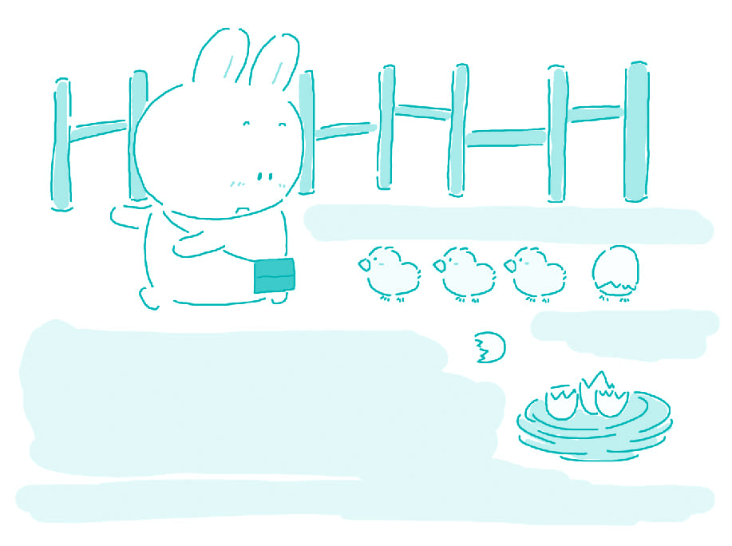

> ###  译文

> **2. 父母是最好的老师吗？**

> 显而易见，很多时候人们最早的老师是他们的父母，父母通常是最关心孩子的发展的。然而，说父母是最好的老师并不完全正确。

> 首先，并不是所有的父母都是好老师。作为常人，有些父母或多或少会有些坏习惯。甚至尽管父母本能地献身于子女的教育，结果也可能是让人失望的。因为所有的孩子都会无意识地或下意识地从父母身上模仿一切，其中也包括坏习惯。父母作为教师的另一个缺陷就是大多数父母缺乏教育的常识。我们经常会看到父母通过让孩子按照预先安排好的方向发展来实现自己怀有却未能实现的梦想。讽刺的是，当他们的孩子不遵守他们的指令时，孩子就会被认为是不听话或所谓的反叛。实际上，是父母而不是他们的孩子违背了常识。

> 此外，有些父母有资格作为好老师，但并不是他们中的所有人都是最好的。当孩子们上初级学校的时候，家长可能会在所有科目上比学校里的专业教师教得都要好，这毫不令人感到惊讶。但这种情况不会持续很久。我们生活在一个知识以几何速度增加并在同时变得更加专业化的世界里。所以今天想在某一领域成为专业人员要比以前花费更长的时间。没有家长能在所有领域都成为专业人员，尽管他们可能在一个或更多的领域是专家。明智的父母常常是尽早地释放而不是控制他们的孩子。他们知道家庭之外空间广阔。

> 然而，家长可能会比好老师更多地帮助孩子。实际上教育孩子的大多部分都超出了教师的能力范围。家长就是补充。心理学研究告诉我们，有时父母的爱会对孩子产生令人惊讶的魔力。阿尔伯特·爱因斯坦的妈妈和阿甘的妈妈都是很好的例子。另一方面，家长可能会给孩子带来比坏老师更多的坏处。那些父母离异的孩子的天性常常是严重扭曲的。用一句话说，简单地认为父母是最好的老师是相当肤浅的。

###  Word List

 * instinctively ［inˈstiŋktivli］ adv. 本能地
 * deficiency ［diˈfiʃənsi］ n. 缺陷
 * devote to 献身于
 * cherished ［ˈtʃeriʃt］ adj. 怀有的，珍爱的
 * cultivate ［ˈkʌltəˌveit］ vt. 培养；耕作
 * disobedient［ ˌdisəˈbi:diənt］ adj.不服从的
 * offspring ［ˈɔ:fˌspriŋ］ n. 子女，后代
 * common sense 常识
 * subconsciously ［sʌbˈka:nʃəsli］adv. 下意识地
 * virtually ［ˈvə:tʃuəli］ adv. 实际上
 * psychology ［saiˈka:lədʒi］ n. 心理学

## 3. Does easier-prepared food improve the way people live?

People today can prepare their meal much easier than has ever been before. To prepare a single dinner, provident housewives usually had to work for hours in the past: they had to buy home dirty vegetables which had to wash, meat which had to slice, and so on so forth. Each and every step of preparation was a time-consuming task. But now, things are entirely different. Supermarkets provide vegetables and meat clean and neat, some of them even have relevant ingredients and need only a few minutes to be made into delicious meals. And this change has indeed greatly improved the way people live.

In a sense, food preparation is no longer a tedious task, at least much easier to tolerate. Such a change has liberated many women and given them chance to do more meaningful things, for example, a higher pay job or a more respectful one. On the other hand, more men are becoming willing to do the thing that they once hated so much, and in some cases such transformation of men brought dramatic positive impact on the family. Today, it's not hard to imagine a wife comes home after a day's hard work and how delightful she is to find out his husband has already prepared her several her favorite dishes! Children can more easily become independent—at least they can make themselves breakfasts or dinners when parents are occasionally not present.

But such a change has also brought some unexpected consequences. Girls nowadays are becoming more and more reluctant to deem household work as their responsibility. The reason is quite straightforward: it was once really ridiculous to insist men do trivial household work rather than go work and earn money to support family, but conditions have altered now, girls might think: "I can work as well, or maybe I can earn a higher salary than you do, dear boy friend, if you want to marry me, answer me one question first, will you prepare me breakfast and dinner every day?" And some boys, on the other hand, are becoming hesitant to get married, or simply remain solitary, among miscellaneous reasons they do so is one thing: "I can take care of myself, at least I don't really need someone prepare me dinner!"

Anyway, such a change is positive and it did improve the quality of people's life. At least it has brought girls, boys, husbands, wives, children and everyone else who has to prepare food an opportunity, no matter what kind of opportunity it is.

> ###  译文

> **3. 更易准备的食物改进了人们的生活方式吗？**

> 人们现在准备饭菜比以前容易多了。过去为了准备一顿正餐，有远见的家庭主妇们也需要准备几个小时：她们不得不买回那些必须要洗的脏蔬菜、必须要切的肉等等诸如此类。每一步准备工作都是耗费时间的任务。但是现在，事情变得完全不同了。超级市场供应干净整洁的蔬菜和肉类，有些还带有相关的配料，只需几分钟就可以做成美餐。这种改变在很大程度上改进了人们的生活方式。

> 在某种意义上来说，准备食物已经不再是一项单调乏味的工作，至少更容易忍受些。这种变化解放了很多妇女，使她们有机会做一些更有意义的事，例如一份薪水更高或更体面的工作。另一方面，很多男性变得愿意去做这项他们一度十分厌恶的事。在有些情况下，男性的这种转变为家庭带来了戏剧性的积极影响。今天，不难想像当一位妻子在一天的劳累工作之后回到家里，发现丈夫已经为她准备好了好几道她爱吃的菜，她该有多高兴。孩子也更容易变得独立——至少在家长偶尔不在的时候他们可以自己做早餐或正餐。

> 但是这种变化也带来了一些意想不到的后果。现在的女孩们变得越来越不愿意将家务活看成自己的责任。原因很简单：坚持让男人做一些琐碎的家务活儿而不是出去挣钱养家曾被一度认为是很荒谬的，但情况现在已经改变了。女孩们会想：“我也同样可以工作，或许我拿的工资可以比你挣的更高，亲爱的男友，假如想娶我就先回答一个问题，你愿意每天给我准备早饭和正餐吗？”另一方面，有些男孩子在结婚还是保持单身上犹豫不决，众多原因中有一：“我可以照顾自己，至少我并不需要有人给我准备正餐！”

> 总之，这种改变是积极的，它确实提高了人们的生活质量。它至少为女孩、男孩、丈夫、妻子、孩子或其他需要准备食物的人提供了机会，无论它是什么样的机会。

###  Word List

 * provident ［ˈpra:vidənt］ adj. 有远见的
 * straightforward ［streitˈfɔ:wəd］adj. 简单的，易懂的
 * ingredient ［inˈgri:diənt］ n. 配方
 * slice ［slais］ v.切（片）
 * ridiculous ［riˈdikjələs］ adj. 荒谬的
 * delicious ［diˈliʃəs］ adj. 美味的
 * consequence ［ˈka:nsiˌkwens］ n. 结果
 * tedious ［ˈti:diəs］ adj. 单调乏味的
 * solitary ［ˈsa:ləteri］ adj. 孤独的，单身的
 * transformation ［ˌtrænsfəˈmeiʃən］n. 变化，转化
 * positive ［ˈpa:zitiv］ adj. 积极的

## 4. Which is more important, book knowledge or experience?

In general, knowledge gained from books has a wider range than that gained from experience. We now live in a world that typophile is no longer exorbitant, and that printed matters are readily available. In libraries, we can learn nearly everything only if we have already acquired basic reading skills, philosophy, history, literature, physics, mathematics, chemicals, biology, geography, anthropology, and the list will go on. Unlike the experience of an individual that is limited by the range of that individual, books seem to have almost no limitation. Sitting in the local library, we virtually can travel everywhere through an interesting geographic encyclopedia, and certainly, with nearly no expense at all.

On the other hand, it can be argued that sometimes knowledge gained from experience is much deeper and more comprehensive than that gained from books. It is quite true that not every thing is contained in books. How to deal with personal finance, how to cope with current social trends, even how to most effectively organize our own mind, and numerous other things can seldom be found thoroughly and comprehensively discussed in books, we have to gain the knowledge by our own experience. And the sad news is that even some knowledge that is contained in books usually needs further comprehension, mainly through experience.

As to which source is more important, the answers vary. Some knowledge can be acquired only through books. It's hard to imagine we can have a good understanding of history without reading books. On the other hand, some knowledge can be obtained only through experience. When we try to learn to swim, merely a detailed manual of swimming skills, even abundantly filled with illustrations, is at most useless. We have to jump into the water and then gain the knowledge with experience. We have to use books and experience as source simultaneously to get what we want to know. Take learning physics for example, both books and experiences are equally important sources, and examples as such are numerous. Therefore, I think whether one source is more important than the other depends on circumstances.

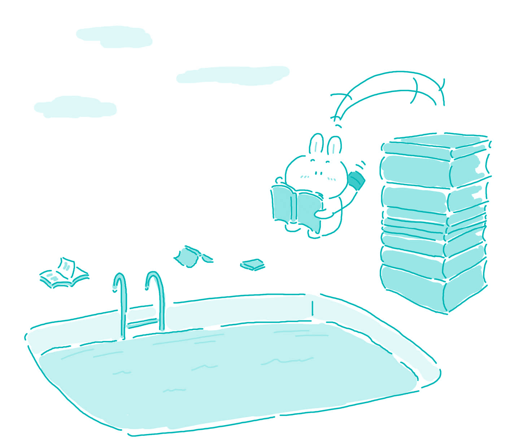

> ###  译文

> **4. 书本知识与经验哪个更重要？**

> 总地说来，从书本上获得的知识要比从经验中获得的范围广。我们生活在一个印刷不再昂贵的时代，印刷品唾手可得。在图书馆里，只要我们掌握了基本的阅读技巧我们就可以学到几乎任何东西，哲学、历史、文学、物理、数学、化学、生物、地理、人类学等不胜枚举。不像某个人的经验只限定在那个人的范围之内，书本几乎没有限制。坐在当地的图书馆里，我们实际上可以通过一本有趣的地理百科全书游览任何地方而无须支付任何费用。

> 另一方面，也有人说，有时候从经验学来的知识比从书本上学来的更深刻和更易理解。确实，书里并不包含所有的事情。如何处理个人的财务问题、如何应对当今的社会潮流、甚至如何更有效地组织我们的思维，还有数不清的其他事是书本所无法透彻和全面地讨论的，我们不得不靠自己的经验去获得这些知识。不好的消息是，即使书本里包含一些知识通常也需要进一步理解，主要是通过经验。

> 至于哪一种来源更重要，有很多不同的答案。有些知识只有通过书本才可以获得。很难想像我们不读书就能很好地理解历史。另一方面，有一些知识只能通过经验获得。当我们试着学习游泳时，仅仅靠一本详细的游泳技术指南是毫无用处的，即使里面充满了插图。我们不得不跳入水中靠经验获得知识。我们必须同时使用书本和经验来作为获取知识的来源。以学习物理为例，书本和经验是同等重要的资源，这样的例子数不胜数。因此我认为，一种资源是否比另一种更重要要依情况而定。

###  Word List

 * range ［rendʒ］ n. 范围
 * comprehensive ［ˌka:mpriˈhensiv］ adj. 全面的，综合的
 * typophile ［ˈtaipəˌfail］ n. 印刷品
 * exorbitant ［igˈzɔ:bitənt］ adj. 昂贵的
 * numerous ［ˈnu:mərəs］ adj. 许多的，难以计数的
 * philosophy ［fiˈla:səfi］ n. 哲学
 * literature ［ˈlitərətʃə］ n. 文学
 * simultaneously ［saiməlˈteinjəsly］ adv. 同时地
 * mathematics ［ˌmæθəˈmætiks］ n. 数学
 * anthropology ［ˌænθrəˈpa:lədʒi］n. 人类学
 * circumstance ［ˈsə:kəmstæns］ n. 情况，环境
 * encyclopedia ［enˌsaikləˈpi:diə］ n. 百科全书 

## 5. The advantages and disadvantages of a new factory near your community

I live in a primarily agricultural community, and most of the population lives hand to mouth. Parents keep children home from school to work in the fields. If there is a flood or a drought, people starve. A new factory would mean regular monthly salaries as well as protection against natural disasters or a sudden drop in the price of our main agricultural product, say, corn.

Regular salaries would allow families the confidence to make investments in their futures. The locals would be able to plan their finances accurately and free themselves from debt. This in turn would encourage entrepreneurship and further develop the local economy. People could begin to open shops, restaurants, dormitories, and entertainment facilities to serve the factory workers with their savings. Profits from these small enterprises would further enrich the local community and turn our relatively poor farmland into a truly profitable development zone. Perhaps more parents could then afford to send all of their children to high school and maybe even college.

There would certainly be negative effects as well. If the area becomes prosperous, immigrants from poorer regions will come here looking for work. Because of their relative poverty they will work harder for less money than the locals and drive wages down. There might be more immigrants than factory jobs available, leading to an unemployment crisis with a rising crime rate as a potential negative side effect.

On the other hand, the proposed factory would almost certainly have adverse effects on the local environment, particularly in regards to polluting the water. This is perhaps the most serious concern, because without clean water the area cannot sustain life of any kind, corn, livestock, or human.

However, because of the relatively desperate economic situation of my hometown, I believe the potential benefits of opening a new factory would outweigh the risks. If we take the proper precautions, such as imposing strict environmental standards and providing adequate social services for immigrants, the whole area stands to benefit.

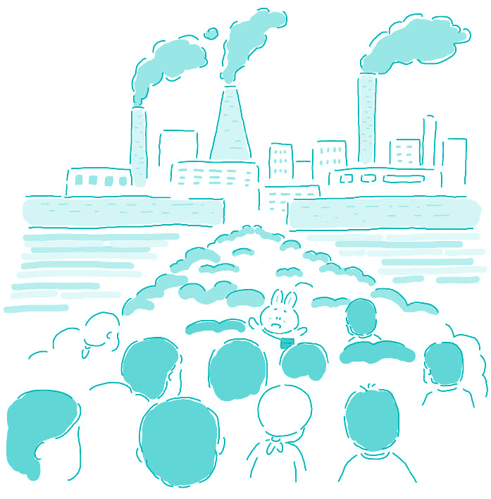

> ###  译文

> **5. 社区附近建新工厂的利与弊**

> 我生活在一个以农业为主业的地区，大多数人口勉强维持生计。家长们不让孩子们去上学而让他们去田里干活。如果闹水灾或旱灾，人们就会挨饿。一座新的工厂就意味着每月有固定的收入，意味着保护我们免受自然灾害和主要的农产品如谷物价格骤降的影响。

> 固定的薪水将会给家庭以信心去为将来而投资。地方居民将可以精确地计划他们的财务问题而避免陷入债务。这种情况反过来将会鼓舞当地居民开创自己的生意，从而进一步发展当地经济。人们可以开始用自己的积蓄经营商店、餐馆、宿舍和娱乐设施来服务那些工厂的工人。这些小生意的赢利会进一步使当地富裕起来，从而将我们相对贫穷的农田变为真正有利可图的开发区。或许更多的家长会有能力送他们所有的孩子上高中甚至大学。

> 当然同样也会有负面的影响。如果该地区变得繁荣起来，其他更贫穷地区的移民就会来这里找工作。因为他们相对来说更为贫穷，所以他们比当地人干得更努力，要求的工资也更低，这就会将工资水平拉低。移民的数量还可能超过工厂招工的数量，就会导致失业危机带来犯罪率上升的潜在负面影响。

> 另外一方面，提议新建的工厂几乎一定会给当地的环境带来负面影响，特别是在对水的污染方面。这可能是最严重的问题，因为没有清洁的水，这一地区就不能维持任何生命的生存，谷物、牲畜和人都是如此。

> 然而由于我的家乡经济状况相当让人绝望，我相信开一座新工厂的潜在利益一定会超过其风险。如果我们采取正确的预防措施，例如实施严格的环境标准和为移民提供适当的社会服务，整个地区将会受益。

###  Word List

 * primarily ［praiˈmerəli］adv.首要地，主要地
 * immigrant ［ˈimigrənt］ n. 移民
 * drought ［draut］ n. 干旱
 * potential ［pəˈtenʃəl］ adj. 潜在的
 * entrepreneurship ［ˌa:ntrəprəˈnə:ʃip］n. 企业家的身份（地位）
 * livestock ［ˌlaivˈsta:k］ n. 家畜，牲畜
 * outweigh ［autˈwei］v. 在重量
 * (或价值) 上超过
 * facility ［fəˈsiliti］ n. 设施
 * profitable ［ˈpra:fitəbl］ adj. 有利可图的
 * precaution ［priˈkɔ:ʃən］ n.预防，预防措施</li>

## 6. The most important thing you want to change about your hometown

I was born in a small town named Hailin, located in the North-East of China. The most serious problems in my hometown are the backward ideas about a woman's place in the family, school, workplace, and society. These negative stereotypes hurt not only women, but all of society as well. If possible, I would change the attitudes of the people in my hometown so they would view men and women equally.

Discrimination against women in my hometown begins before they are even born. Because people here believe that only a man can carry on the family line, every family wants to have at least one son. Each family is only supposed to have one child because of the overpopulation problem. This means that if a family can find out a fetus is female before it is born they might abort it. Or in other cases, people will have many female babies before they have a son, which only makes the population problem worse. If female babies were considered as important as male babies, then these two problems probably would not exist.

Discrimination against girls continues as they go to school and work. The prevalent stereotype is that women are not as smart as men and we shouldn't waste time and money educating them. Families often insist that their daughters stay at home and help with housework while sending their sons to school. Girls are born every bit as smart as boys and equally deserve to reap the benefits of education. Many of the world's famous scientists and leaders are women, from Marie Curie to Margaret Thatcher. We need to eliminate the stereotype that women are less intelligent than men so that our community can benefit from the achievements that women are capable of making when armed with education. In fact, women need to be respected enough to hold professional and leadership jobs in our community. This would mean that in the classified section of newspapers, there would no longer be jobs for "men only.` We will never know how many women could have done those jobs better than a man could have until the parents of every baby girl decide that their daughter is worth as much as their son. This is probably the most important thing that I want to change about my hometown.

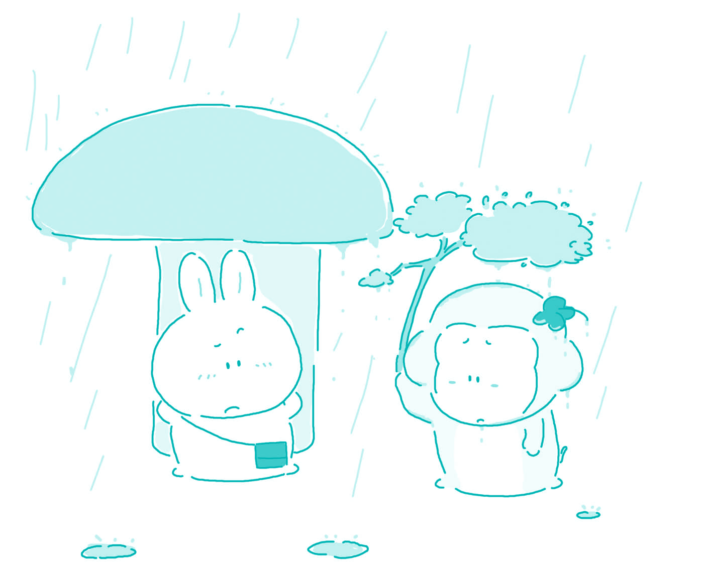

> ###  译文

> **6. 最想使家乡发生的一种改变**

> 我出生在中国东北一个名叫海林的小镇。我家乡最为严重的问题就是关于妇女在家庭、学校、工厂和社会中地位方面的落后思想。这种消极的老套思想不仅伤害妇女们，同样对社会也是一种伤害。如果可能的话，我愿意改变我家乡人的看法，让他们可以平等地看待男性与女性。

> 在我的家乡，对妇女的歧视在她们出生之前就已经开始了。因为这里的人们认为只有男人可以延续家庭的香火，每一个家庭都应该至少有一个男孩。因为人口太多所以每个家庭只能有一个孩子。这就意味着如果一个家庭能在孩子出生前发现胎儿是女性，他们就可能堕胎。另外的情况是，人们会在生儿子之前生下很多女儿，这会使人口问题更糟。如果女婴被视作与男婴同等重要，这两个问题或许就不存在了。

> 对女孩的歧视在她们上学和参加工作时依然存在。目前流行的陈腐观念是女性不像男性那样聪明，所以不应该浪费时间和金钱去教育她们。家里常常会坚持让女孩留在家里帮忙做家务，而送男孩去上学。女孩生来就和男孩一样聪明，也值得去收获教育所带来的好处。从居里夫人到撒切尔夫人，许多世界著名的科学家和领袖都是女性。我们需要去除那些认为女性不如男性聪明的陈腐观念，这样我们的社会就可以享受到用知识武装起来的女性所能实现的成就。

> 事实上，女性需要获得足够的尊重以在社会中从事专业或领导工作。这可能就意味着在报纸上的分类广告里就不应该有“仅招男性”的工作职位。在每一个女婴的家长都认为他们的女儿与儿子有相同的价值之前，我们永远无法知道有多少女性能比男性在那些工作中做的更好。这大概就是我想改变我家乡的最重要的事了。 

###  Word List

 * backward ［ˈbækwəd］ adj. 落后的
 * intelligent ［inˈtelidʒənt］ adj. 聪明的
 * stereotype ［ˈsteriəˌtaip］ n.陈词滥调，老套
 * achievement ［əˈtʃi:vmənt］ n. 成就
 * abort ［əˈbɔ:t］ vt. 堕胎
 * professional ［prəˈfeʃənəl］adj. 职业的，专业的
 * discrimination ［diˌskriməˈneiʃən］ n. 歧视
 * reap ［ri:p］ vt. 收获
 * classified section of newspapers eliminate ［iˈliməneit］ vt. 消除报纸上的分类广告

## 7. The influence of movies or television on people's behavior

The impact that movies or television has had on our daily life, and society in general, is undeniable. No doubt it will become even greater as the scope of which continues to grow, and as the relevant technologies become more and more sophisticated, and so fascinating that virtually nobody will be able to escape. Already, it can be seen how western movies are exercising influence on our youth generation: they grow long-hair regardless of their gender, commonly part of which is dyed in gold; they wear jeans in each and every season, usually the knees of which are deliberately tattered; boys are fond of earrings or other odd pendants; and girls are keen on Marlboros and weird bad words.

The major means that movies and television influence the public is by creating topics of discussion in the society. Movies offer people (the consumers) issues to talk and think about. Titanic had brought a worldwide uproar by its extolling of fascinating immortal love; Prime Color and Wag the Dog met the national debate on right and duty of the president of the United States. Antiwar movies such as Tears of the Sun and All Quiet on the Western Front among numerous others have been raising the question that is any war really to uphold justice or is it really worthy that an individual makes sacrifices to his country and at the same time ignores his own family or his personal values? Television also shapes our understanding of what is important and what is not important (to know). The"important" issues are being discussed over and over or in the beginning of a program. The "not important" stories are the ones that are not being told at all. The"not very important" stories are probably very short and hidden in the last part. By prearranging public issue, movies and television make decisions for us. Even though there are critical thinking individuals in any society, they are definitely in minority; the public in whole indeed lack skills of critical thinking, and therefore they are often led by the movies and television.

In brief, movies and television, by offering topics and affecting the ways in which we discuss"the important issues", has a strong influence on our perception of the truth, of the world or of the structure of our society. We have to admit that it has a role in our lives as a source of information, experiences, entertainment, amusement and relaxation.

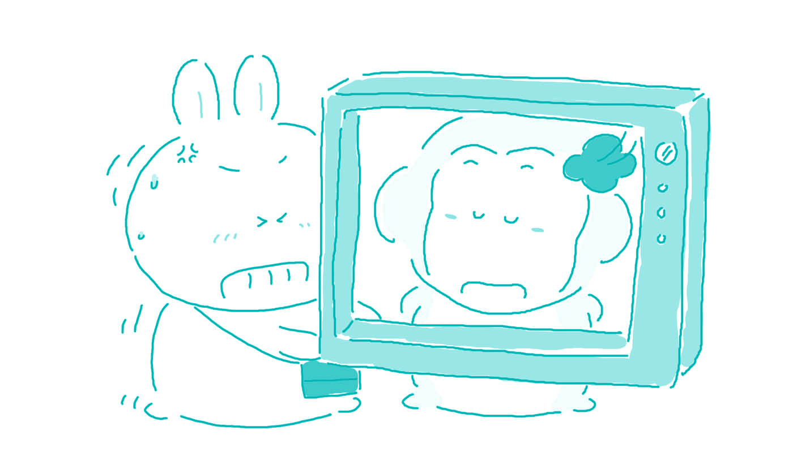

> ###  译文

> **7. 电影和电视对人们行为的影响**

> 电影和电视，对我们的日常生活和总体而言的社会产生的冲击是不可否认的。毫无疑问，随着其范围继续扩展，这一冲击可能会更剧烈，而且随着相关技术变得越来越复杂，越来越令人着迷，没有人能逃脱。现在已经可以看到西方的电影对我们的年轻一代产生了怎样的影响：他们不分性别地蓄起长发，通常还把一部分染成金色；他们不分季节地穿牛仔裤，通常膝盖都弄得破破烂烂；男孩们喜欢耳环或其他奇怪的饰物；女孩们对万宝路香烟和奇怪的脏话青睐有加。

> 电影和电视影响公众的主要途径就是制造社会上交谈的话题。电影提供给人（消费者）话题去谈论和思考。《泰坦尼克》用值得赞美和令人迷醉的永恒爱情使世界喧嚣； 《原色》和《摇尾巴的狗》使整个国家都在争论美国总统的权利和责任；像《太阳的眼泪》和《西线无战事》之类无数的反战电影，提出了战争是否真正维持正义或个人为国家牺牲同时忽略他的家庭和他的个人价值是否真正值得的问题。

> 电视也在引导我们思考什么是重要的和什么是不重要的。“重要的”问题会多次被讨论或出现在电视节目的开始。“不重要的”故事则根本不说。“不太重要的”故事可能很短或隐藏在最后部分。通过预先安排公众问题，电影和电视替我们做了决定。尽管每个社会都会有持批判思想的个人，但他们肯定是少数；公众整体上确实缺乏批判思维的技巧，于是他们就受电影和电视的引导。

> 简而言之，电影和电视通过提供话题和影响我们讨论“重要问题” 的方法，在我们对真相、世界和我们的社会结构的看法上产生强烈的影响。我们不得不承认它们在我们生活中的作用，为我们带来了信息、经验、娱乐、消遣和放松。 

###  Word List

 * mass media n. 大众媒体
 * justice ［ˈdʒʌstis］ n. 正义
 * relevant ［ˈreləvənt］ adj. 相关的
 * issue ［ˈisju:］ n. 问题
 * sophisticated ［səˈfistikeitid］ adj. 复杂的
 * prearrange ［ˌpri:əˈreindʒ］ vt. 预先安排
 * gender ［ˈdʒendə］ n. 性别
 * minority ［məˈnɔriti］ n. 少数
 * pendant ［ˈpendənt］ n. 垂饰物
 * entertainment ［ˌentəˈteinmənt］ n. 娱乐
 * tattered ［ˈtætəd］ adj. 破旧的
 * amusement ［əˈmju:zmənt］ n. 消遣
 * censorship ［ˈsensəʃip］ n. 审查制度

## 8. Has television destroyed communication among people?

While television has been somewhat harmful in its effects, it has hardly"destroyed" communication among friends and family, although for some people, the assertion that television has destroyed communication among friends and family seems pretty plausible.

Television, invented in last century, with its wide availability, increasingly prosperous programs, becomes one of the most powerful means of communication in the history, and is more and more difficult to ignore. Television is as much a part of our lives as are our meals, work, or school; studies consistently show that the average American child spends almost as much time watching television as does he or she in school. We all have only 24 hours a day and it is clear that the more time one spends on watching television, the less time one does with his or her family and friends. Hence the passage printed in the newspaper or magazine titled "Television took my husband away."

Tempting as such claim might be, it is hardly true. Instead of television, it is the increasing pressure of modern life that took her husband away. We have no definite evidence to say people nowadays endure more pressures than did their counterparts in the past, but it is absolutely true that people nowadays undergo great pressures that come from various directions, including work, school, economy, and so forth. Investigations show that people who earn more than RMB 50, 000 annually spend at least 60 hours on work per week, much more than those who earn RMB 20,000 annually. Today a bachelor's degree may no longer guarantee a decent pay, more and more companies post their want ads claiming that applicants must have at least master's degrees, which take two or three years longer.

People nowadays have very little time for anything; television is merely among many other factors that affect communication, and is definitely not the main cause of degradation. It seems that the more one is educated, the more one is aware of the deleterious effects that excessive television causes, and either deliberately avoid it or actually do not enjoy it. On the other hand, there really are many people addictive to television. But the fact is, were television not existent, surely these people would have found other escapes, such as alcohol or gambling for example. In other words, people always find a way to do what they want to do. Therefore, I can hardly agree that television has destroyed communication among friends and family.

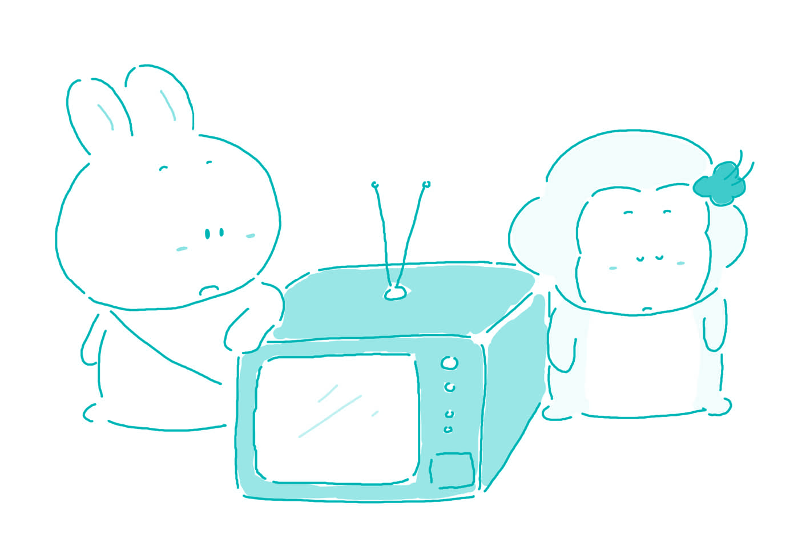

> ###  译文

> **8. 电视是否破坏了人们之间的交流？**

> 虽然电视有一些坏的影响，但它还不会“破坏”与朋友和家人的交流，尽管对有些人来说，电视会破坏与朋友和家人的交流这种断言听起来似乎是很正确的。

> 电视发明于上个世纪，以其能被大众接受的价位和日益丰富的节目成为历史上最有力的交流工具之一，而且越来越难以让人忽略。电视是我们生活的一部分，就像吃饭、工作、上学一样；研究一贯表明，普通的美国孩子看电视的时间和上学的时间一样长。我们每天都只有24小时，显而易见，在看电视上花的时间越多，与家人或朋友交流的时间就越少。因此，报纸或杂志上刊登过以“电视抢走了我的丈夫”为题的文章。

> 尽管那种说法是如此诱人，可它不是真的。不是电视，而是现代生活日益增长的压力带走了她的丈夫。我们没有确切的证据说现代人比以前的人承受更大的压力，但是今天的人们承受着来自各个方面的巨大压力确是事实，其中包括工作、学习、经济等各方面的压力。调查显示，年收入人民币5万元以上的人每周至少要花60小时工作，远远超过那些年收入2万元人民币的人。今天，学士学位并不能保证得到一份可观的薪水，越来越多的公司在招聘广告上要求求职者至少要有硕士学位。那比学士学位要多花两到三年的时间。

> 现在的人们几乎没有时间做任何事；电视只是许多影响交流的因素中的一种，而且肯定不是恶化的主因。似乎人接受的教育越多，就越能认识到过多地看电视所导致的有害影响，所以要么有意避开它，要么根本就不去看它。另一方面，确实有很多人沉迷于电视之中。事实上，如果没有电视，这些人肯定会找到其他的逃避方法，例如酗酒或赌博。换句话说，人们总会想办法做他们想做的事。因此，我不同意是电视破坏了与朋友和家人的交流这种说法。

###  Word List

 * assertion ［əˈsə:ʃən］ n. 宣称，断言
 * guarantee ［ˌgærənˈti:］ vt. 保证
 * prosperous ［ˈpra:spərəs］ adj. 繁荣的
 * bachelor degree 学士学位
 * availability ［əˌveiləˈbiləti］n. 可获得性，有效性
 * master degree 硕士学位
 * degradation ［ˌdegrəˈdeiʃən］n. 恶化，退化
 * consistently ［kənˈsistəntli］ adv. 一直地
 * tempting ［ˈtemptiŋ］ adj. 有诱惑力的
 * addictive ［əˈdiktiv］ adj. 上瘾的
 * endure ［enˈdjuə］ vt. 忍受

## 9. Live in a small town or in a big city?

People seldom agree with each other even in such trivial issues as preference between a big city and a small town. It's a little bit haste to say that it is better to live in a big city than in a small town, or vice versa.

Living in a big city has several benefits. First, there're more job opportunities readily available in big cities than in a small town. Moreover, not merely are there more job positions in big cities and the qualities of the position are much higher as well. In addition, the pay is more decent. Second, children are supposed to be able to receive an education with a higher quality compared with their counterparts who live in a small town. For families, children's education is always put in the first place. Finally, living in a big city usually has a superior living standard to that in a small town. There are more commodities and services in city markets; there are more public utilities available in big cities; there are even much more television channels in big cities.

However, living in a small town also has some advantages. People who live in a small town often have a much comfortable life style. Most of them do not have to suffer high working stress. Although the average pay is much less than that of big cities, the price of daily necessities, such as vegetables or meat, is usually less expensive. Instead of suffering loneliness which is prevalent in big cities, children might grow up more healthily because of harmonious relationship among residents in small town. People in a small town do not have to get up so early in the morning because there has been no traffic jam, and nobody drive so fast in a small town as to cause car accidents. They might have fewer channels in television, but they have more friends readily available to chat or entertain with.

According to my current situation, although I am longing for the cozy atmosphere and relationship among neighbors and friends which almost only exist in small cities, I have chosen to live in one of the biggest cities in my country—Beijing, since I have found a pretty good job here, and a decent pay. I think I would prefer living in a small town when I get retired one day.

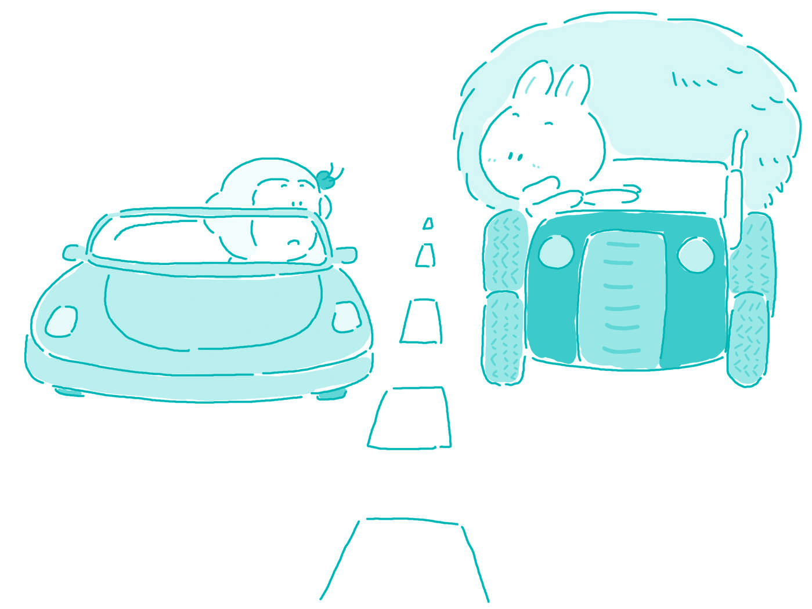

> ###  译文

> **9. 住在小城镇还是大城市？**

> 人们很难达成一致，即使是在更喜欢大城市还是小城镇这样无足轻重的问题上亦如此。要是说生活在大城市里比生活在小城镇里好显得有点武断，反之亦然。

> 生活在大城市里有几种好处。首先，大城市比小城镇有更多容易得到的工作机会。而且，大城市里不仅工作的岗位多，职位的质量也比小城镇里的高。另外，薪水也更高。第二，与小城镇的儿童相比，大城市的儿童能接受更高质量的教育。对于家庭来说，孩子的教育总是放在第一位的。最后，大城市里比小城市有着更高的生活水平。在大城市的市场里有更多的日用品和服务；还有更多的公共设施以及更多的电视频道。

> 然而，生活在小城镇里也有好处。生活在小城镇里的人通常会有一种更舒适的生活方式。他们中的大多数人不必受工作压力的折磨。尽管平均工资比大城市里少得多，可是日常必需品，如蔬菜和肉，也要便宜得多。没有大城市里普遍流行的孤独症，孩子们可以更健康地成长，因为小城镇居民之间的关系更融洽。小城镇的居民不需要起那么早，因为没有交通堵塞，也没有人开车快得会导致交通事故。他们能看到的电视频道可能不多，但是他们身边随时可以一起聊天或是娱乐的朋友却更多。

> 根据我现在的情况，尽管我渴望几乎只存在于小城镇中的温暖舒适的气氛和和睦的邻里朋友关系，我还是选择了生活在我们国家最大的城市之一——北京，因为我在这里找到了一份不错的工作，还有可观的工资。但我想退休之后我还是愿意生活在小城镇中。

###  Word List

 * trivial ［ˈtriviəl］ adj. 琐细的，微不足道的
 * vice versa 反之亦然
 * counterpart ［ˈkauntəpa:t］ n. 对应物
 * superior ［səˈpiriə］ adj. 较高的，较好的
 * public utility 公用设施
 * harmonious ［ha:ˈməuniəs］adj. 和谐的，和睦的
 * traffic jam 交通堵塞
 * long for 渴望

## 10. Does luck have anything to do with success?

Here is a true story, a story about an African man called Cinque who slew a most terrifying beast that any one has ever seen, a lion. His siblings in the village who know about this anecdote gave him great respect and call him the big man.

However, he told the truth later.

"It had killed several people, even hunters among us. Everyone including me was afraid. "

"I was lying down with my family, when out of nowhere it appeared."

"As it came for me, I picked up a big rock and I threw it. And that wasn't bravery, because any man would do the same to protect his family. "

"But by some miracle, you see, I hit it. I don't know how that killed it, but it did. A rock, you see, a rock. "

"I received the gratitude of everyone in the village. I was given respect. They treated me as if I was a prince. They gave me the finest country cloth. All these things they gave me, I took them all. But I knew I didn't deserve it, for when I threw that rock at that beast, if I missed it, I wouldn't be sitting here today trying to explain these things to you or somebody else, I'd just be dead. I'm not a big man, just a lucky one."

You see, luck does exist. When it appears, mathematicians describe in such a way that something has an extremely small probability but it does happen. People often say, one has to have an opportunity to succeed. In this case, luck is the opportunity, and to some extent is an indispensable factor to achieve success.

When people say luck has nothing to do with success, I wonder it is not their intention to deny existence of luck, but to encourage. Because luck in fact is a factor that one can not and should not count on, even though we know people who have succeeded have their own luck. It is somewhere, but nobody knows where. It happens sometime, but we don't know when. By contrast, hard work is something that everyone can count on, and as is often the case, hard work might bring luck. Therefore, luck itself is of no hope, and lack of luck should not be an excuse to failure.

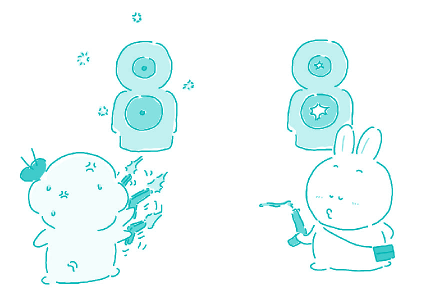

> ###  译文

> **10. 运气与成功有关吗？**

> 这是一个真实的故事，讲的是一个叫辛克的非洲人杀死了一头最令人害怕的野兽——

> 狮子的故事。村子里知道这段故事的亲属对他抱有极大的尊敬并称他为大人物。然而后来他说出了真相。“它咬死了好几个人，甚至我们中间的猎人。所有人包括我都很害怕。”“我正和我的家人一起躺着，这时它突然出现了。”“正当它向我冲过来的时候，我拾起一块大石头向它扔去。那不算勇敢，因为任何一

> 个男人在保护他的家人时都会那样做的。”“但是奇迹发生了，你看，我打中它了。我不知道是怎么杀了它的，可是确实杀了它。一块石头，你看，一块石头。”

> “我接受了全村人的感激。我受到了尊敬。他们把我当一位王子对待。他们给我村里最精美的布料。这些我全接受了。但我知道我不值得这些，因为当我向那只野兽掷石头的时候，如果我没打中，我今天就不会坐在这里向你或其他人解释这些事了，我早就死了。我不是个大人物，我只是个幸运的人。”

> 你看，运气确实存在。当它出现的时候，数学家将其描述为具有极小可能性发生的事情确实发生了。人们常说，人必须有机会才能成功。在这个例子中运气就是机会，在某种程度上来说是实现成功的不可缺少的因素。

> 当人们说成功与运气无关时，我怀疑他们并不是想否认运气的存在，而是想鼓励别人。因为运气确实是人不能也不该指望的一个因素，尽管我们知道那些成功的人都有自己的运气。它在某个地方，但没人知道在哪儿。它在某个时候发生，但没人知道是什么时候。比较而言，努力是每个人都可以指望得上的东西，而且经常是努力可以带来运气。所以，运气本身并没有什么可指望的，缺少运气不应该成为失败的借口。

###  Word List

 * sibling ［ˈsibliŋ］ n. 兄弟，姐妹，同胞
 * anecdote ［ˈænikˌdəut］ n. 轶事，奇闻
 * gratitude ［ˈgrætitu:d］ n. 感激
 * indispensable ［ˌindiˈspensəbl］adj. 不可缺少的
 * count on 指望

## 11. Should universities finance students' sports activities equally as libraries?

The main responsibility of a university is to develop a student's academic ability. While physical health is an important prerequisite for mental health and academic achievement, sports should play a comparatively small role in college student's lives.

Since a student's main activity outside of the classroom is studying, occupying from four to eight hours of their day, a peaceful studying environment plays an important role in a student's academic development. College dorm rooms can have up to eight students sleeping in one small room and are not good environments for students to study in. To provide excellent studying environments for their students, universities must build large libraries designed to accommodate students as well as books. Since sports should occupy a much smaller part of the student's time, perhaps only an hour a day, sports facilities need not be as extensive or well-equipped as libraries.

In addition to the costs of building adequate library faculties, a university must also pay every year to keep its collection well organized and up-to-date.

The goal of every university library should be to have the most current books and materials its students need in order to study and do cutting edge research. The larger the student body, the more comprehensive a library's collection must be. A well-trained staff must also care for the materials and help the students.

Continuing costs for sports, on the other hand, are relatively low, requiring only a few part-time staff and maintenance routines. For the most part, students are happy to organize their own sporting events and exercise routines quite independently of the school.

Although a student's health is critical to their academic success, the investment that a school needs to make to ensure a physically fit student body is relatively small. Considering that the main mission of the school is to develop a student's mind and not their body, the school should put more of its resources into its libraries and not its sports activities.

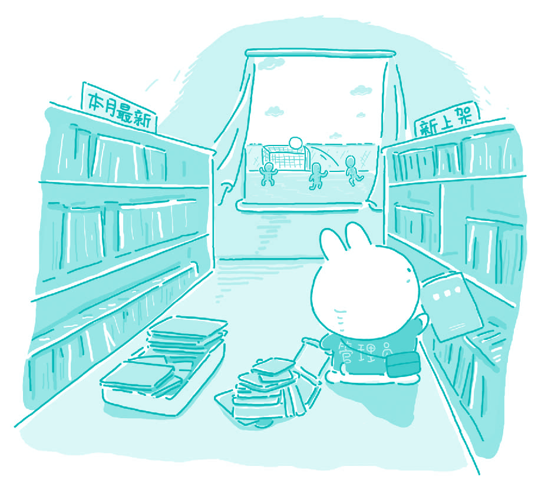

> ###  译文

> **11. 大学拨给图书馆和用于学生体育活动的经费是否应等同？**

> 大学的主要责任是发展学生的学术能力。虽然身体健康是精神健康和学术成绩的重要先决条件，但是体育应该在大学生的生活中起到较小的作用。

> 既然学生的主要课外活动是学习，每天要占去他们4到8小时的时间，那么一个安静的学习环境对学生的学术发展就是十分重要的。大学学生宿舍的一个小房间最多可住满8个人，对学生来说不是一个良好的学习环境。为了给学生提供优秀的学习环境，大学必须修建能容纳学生和书籍的大型图书馆。既然体育在学生的时间中要占很少的部分，可能每天只会占1小时，体育设施就不必像图书馆那样用途广泛且设备精良。

> 除了建造适当的图书馆设施的费用，大学必须每年花钱使其馆藏安排有序且不断更新。每个大学图书馆的目的都应是拥有学生需要的最新书籍和材料，以供学习及进行前沿的研究之用。学生的总体数量越大，图书馆的藏书就需更加综合化。还需要有训练有素的馆员来管理资料和帮助学生。而在另一方面，在体育方面的后续花费是比较少的，只需一些兼职员工和日常维修工作。对于大部分学生来说，他们乐于组织自己的体育活动和日常锻炼而不依赖学校。

> 虽然学生的健康对于他们的学术成功极为重要，但是学校需要为确保学生身体健康的投资是相对较少的。鉴于学校的主要任务是发展学生的心智而不是体魄，学校应当将其资源更多地投入图书馆而不是体育活动中去。 

###  Word List

 * academic ［ˌækəˈdemik］ adj. 学术的，理论的
 * up-to-date ［ˌuptəˈdeit］ adj. 跟上时代的，最新的
 * prerequisite ［pri:ˈrekwizit］ n. 先决条件
 * comprehensive ［ˌka:mpriˈhensiv］ adj. 综合的
 * comparatively ［kəmˈpærətivli］ adv. 比较地，相对地
 * staff ［stæf］ n. 全体职工
 * accommodate ［əˈka:məˌdeit］ vt. 容纳
 * maintenance ［ˈmeintənəns］ n. 维护
 * adequate［ ˈædikwit］ adj.合适的，恰当的
 * routine ［ru:ˈti:n］ n. 日常事务
 * collection ［kəˈlekʃən］ n. 收藏，藏书

## 12. Why people visit museums?

People travel to new places for many different reasons. One of the most common reasons is to see a new place, culture, or way of life. For a total outsider with only a short amount of time, museums offer a glimpse into these ways of life through specially designed education, cultural insights, and entertainment.

People come to museums to learn about the world. The educational experience in a museum is quite different than that of reading or studying. In a museum, learning experiences are direct and thrilling. Reading books about primitive history might seem boring, but seeing the huge skeleton of a terrifying dinosaur in person is a thrilling experience. Reading history books about the Nanjing Massacre are horrifying, sad, and yet abstract, but a trip to the Memorial Museum in Nanjing is an experience that has moved many students to tears. Museums can make otherwise distant and mundane educational experiences come to life.

The museums of a place tell an outsider much about what the people of that place value culturally. A trip to the New York Metropolitan Museum of Art would tell the visitor that Americans are interested in art from all over the world, but by comparing the size of the European Art collection with that of the Asian Art collection, one might conclude that Americans feel a strong cultural affinity with European Art. Similarly, a tourist to a place like San Francisco, where there is a large museum devoted solely to Asian Art, might conclude that people from San Francisco have a stronger affinity to Asian culture.

Meanwhile, many people who travel simply want to relax and be entertained, and museums also provide an excellent venue for leisure. Even most nominally educational museums provide exciting attractions like movie theaters and special cultural performances such as dances, gourmet dinners, lectures, and musical performances from jazz to rock and roll. Many museums in the United States hold special nights once a week where young people can drink and socialize. Museums are not only spaces for education and culture, but have also become important entertainment and social venues.

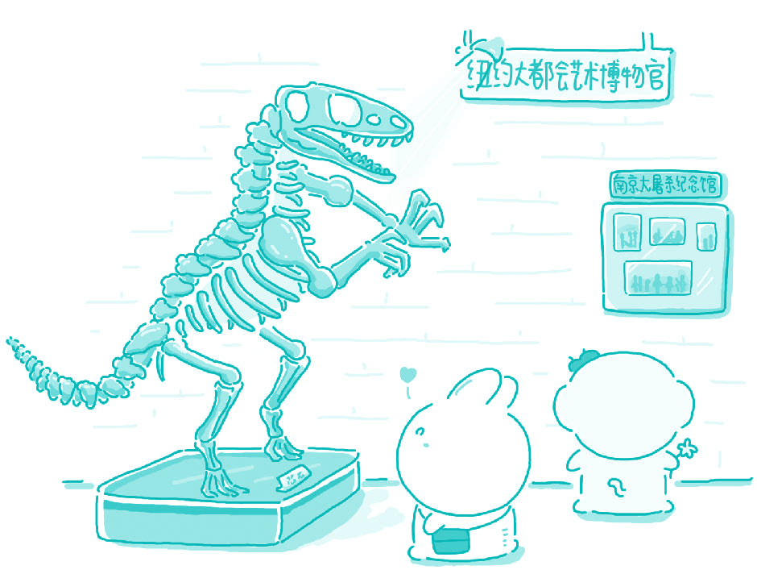

> ###  译文

> **12. 人们为什么要参观博物馆？**

> 人们因为不同的原因去新的地方旅行。最普遍的原因之一就是想看看新的地方、文化和生活方式。对于一个只有很短时间的完全陌生的外地人来说，博物馆通过专门设计的教育、文化视角和娱乐来提供对这些生活方式的一瞥。

> 人们参观博物馆是为了了解世界。参观博物馆的教育经历与读书或是学习的经历完全不同。在博物馆中，学习经历是直接且引人入胜的。阅读史前历史的书籍可能是枯燥的，但是亲自到博物馆去看巨大骇人的恐龙骨架却是一种刺激的经历。阅读有关南京大屠杀的史书是令人恐惧、难过但抽象的，而去参观南京大屠杀纪念馆是一次使许多学生感动得落泪的经历。博物馆可以使原本遥远且平凡的教育经历生动起来。

> 一个地方的博物馆展示给外地人很多当地的人文价值观。参观一次纽约大都会艺术博物馆可以告诉参观者美国人喜欢来自世界各地的艺术品，但是比较一下欧洲艺术品与亚洲艺术品的收藏规模，你就可以得出欧洲艺术品对美国人有着强烈的文化吸引力。同样地，游览一个像旧金山那样的地方，那里有一个纯为亚洲艺术修建的大型博物馆，你就会感觉旧金山更受亚洲文化的吸引。

> 与此同时，很多人旅行仅仅是为了放松和娱乐，博物馆也可以为休闲提供不错的场所。甚至很多名义上是教育性的博物馆也提供比如影院和特色文化表演，包括舞会、美食晚宴、报告会、从爵士乐到摇滚乐的演出等。美国的很多博物馆每周都举行特色晚会，年轻人可以去那里喝酒和进行社交活动。博物馆不仅是进行教育和文化活动的场所，而且已经成为重要的娱乐和社交场所。

###  Word List

 * outsider ［ˌautˈsaidə］ n. 外人
 * massacre ［ˈmæsəkə］ n. 大屠杀
 * glimpse ［glimps］ n. 一瞥
 * mundane ［mʌnˈdein］ adj. 尘世的，平凡的
 * thrilling ［θriliŋ］ adj. 令人激动的
 * New York Metropolitan Museum of Art纽约大都会艺术博物馆
 * primitive ［ˈprimitiv］ adj. 原始的，上古的
 * skeleton ［ˈskelitin］ n. 骨架
 * affinity ［əˈfiniti］ n. 喜爱，吸引力
 * terrifying ［ˈterəfaiiŋ］ adj. 可怕的
 * venue ［ˈvenju:］ n. 场所，地点
 * dinosaur ［ˈdainəˌsɔ:］ n. 恐龙

## 13. Eat at home or out?

After a hard day of work or study, many people feel like cooking for themselves is too much trouble. They prefer to grab a quick bite to eat at a restaurant and go home for rest as quickly as possible. But for me cooking at home is worth the time and trouble because it is cheaper, healthier, and more enjoyable.

Buying my own groceries and cooking for myself is much less expensive than eating in a restaurant. I find that a meal that I cook myself on average costs half to two-thirds less than a comparable meal in a restaurant. Restaurants have to rent space, hire chefs, waiters, and managers, as well as buy food and make a profit. When I cook I have no overhead. The only extra expense I have to pay is the time it takes for me to cook the food.

In addition to being less expensive, when I buy my own groceries I can be sure I am buying the freshest and cleanest meats and vegetables available. Restaurants might think it's more important to buy the cheapest food possible in large quantities to make a higher profit. I also try and buy the healthiest food possible. For instance, when I buy meat, I try and buy the meat with the least fat on it. In a restaurant they add more fat and oil to dishes to make them taste better, but for me, health is more important.

Finally, cooking food with my friends and family brings me a special kind of joy. In a world that has increasingly focused on turning everyone into consumers, I enjoy being creative and producing something good. I enjoy learning and inventing new recipes and sharing them with friends. Even though it takes more time to shop, cook, and clean up when I cook for myself, at the end I have a sense that I did not waste the time so much as I truly enjoyed life for an hour at the end of the day.

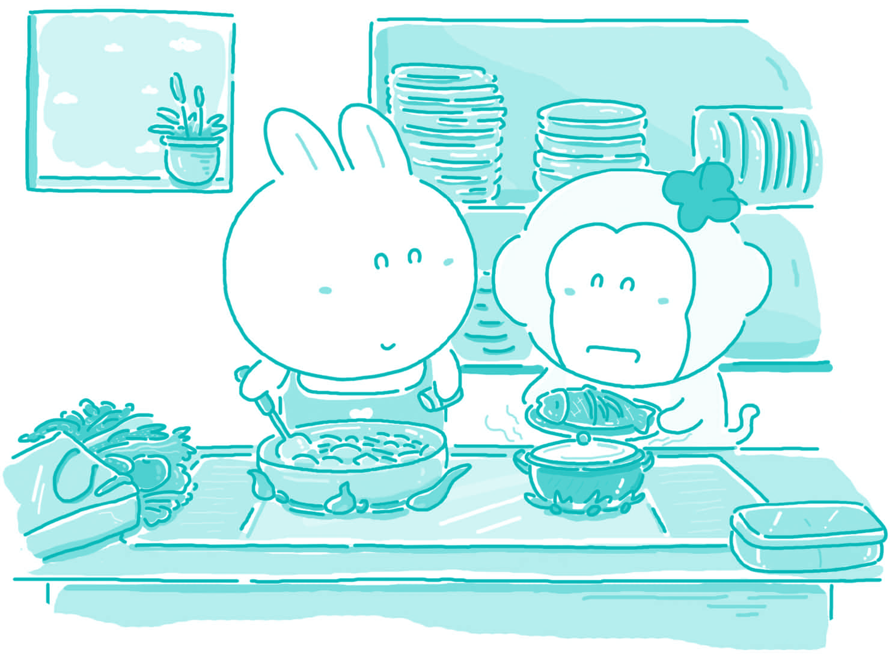

> ###  译文

> **13. 在家吃饭还是外出就餐？**

> 经过一天辛苦的工作或学习，很多人觉得亲自下厨过于麻烦。他们更愿意在餐馆里匆匆吃点东西然后尽快回家休息。但是对我来说，花时间费劲在家做饭是值得的，因为这样更便宜、健康、有乐趣。

> 自己买菜做饭吃要比在餐馆吃便宜得多。我发现自己做饭平均比餐馆里与之相当的饭菜便宜一半到三分之二。餐馆要租场地，雇厨师、侍者和管理人员，还要购买食品、赢得利润。我做饭就没有那些支出。唯一需要付出的额外代价是做饭所需的时间。

> 除了少花钱，我亲自买菜可以确保买到最新鲜干净的肉与菜。餐馆则认为大量买进最便宜的食品赚取更高利润更重要。我也尽量买最有助健康的食物。举例来说，我买肉时尽量挑肥肉最少的肉。而餐馆则在菜中添加更多的肥肉与油以使其风味更佳，可对我来说健康更重要。

> 最后，与朋友和家人一起做饭为我带来了特别的快乐。在一个越来越专注于将所有人都变成消费者的世界里，我喜欢创造性地做出一些好东西。我喜欢学习并发明些新的配方与朋友们分享。尽管自己做饭会花更多的时间去购物、烹调和清扫，到最后，在一天的结束之际真正享受了一小时的生活使我感觉自己并没有浪费时间。

###  Word List

 * grab a quick bite to eat 匆忙地吃点什么
 * groceries ［ˈgrəusəriz］ n. 食品杂货
 * chef ［ʃef］ n. 厨师
 * overhead ［ˈəuvəˌhed］ n. 管理费用
 * focused on 集中注意力于
 * recipe ［ˈresəˌpi］ n. 配方
 * consumer ［kənˈsu:mə］ n. 消费者

## 14. Attending classes: required or optional?

The most important responsibility of college students is to pursue their course of study to the best of their ability. In most cases, this would mean attending every class. In reality, however, not every student is the same, and not every class is the same. If a student can study more effectively in another way, then that student should be allowed to pursue his/her studies to the best of his/ her abilities, and not be required to attend classes that are not helpful to him/her.

Some students find it difficult to concentrate in large lecture classes and find reading quietly a more effective way of studying. If a student can achieve more by reading in the library and meeting with a professor during office hours than students who attend every class, he/she should not be prevented from studying in the most effective way for him/her.

The most important measures of a college student's academic progress are tests. In the weeks before exams, college student's need to arrange their own schedules becomes critical. For instance, if a student is very good at math but very poor at English, it might make more sense for that student to skip math class and spend the extra time preparing for an English test. If students are required to attend classes whose content they are already familiar with, at best they will be bored by redundant material, at worst they will fail tests in subjects they are less proficient in.

The argument might be made that it is the school's responsibility to organize its curriculum so that students are always challenged and therefore truly need to be at every class. I contend that it is impossible to tailor an entire school's curriculum to the individual needs of every single student. The best that can be hoped for is a well thought out curriculum with enough flexibility to handle the differences between individual students. Schools should trust the students to make choices that are in their own best interests, and use testing as the final arbiter of academic excellence.

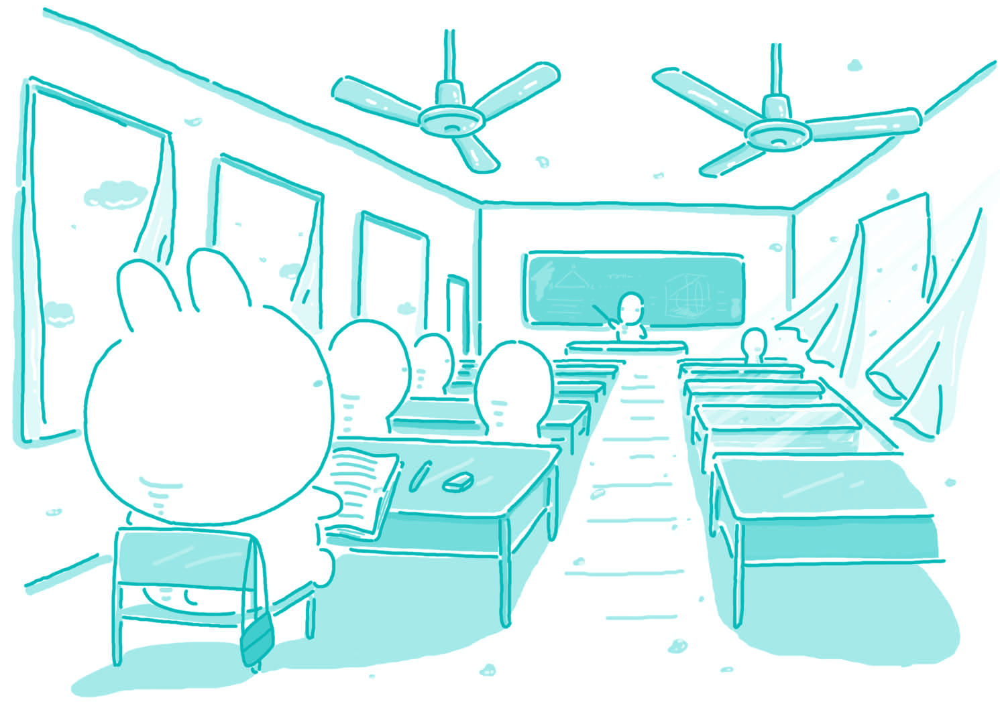

> ###  译文

> **14. 出席课堂：必须还是可选？**

> 大学生最重要的责任就是尽全力学好他们的课程。在大多数情况下，这就意味着要去上每一节课。事实上，不是每个学生都相同，也不是每堂课都相同。如果一个学生能以另一种更高效的方式学习，那么他或她就应该被允许以他或她自己的方式去学习，而不是被要求去上那些对他或她毫无帮助的课。

> 一些学生发现很难在大班授课时集中精力，安静地读书是更有效的学习方法。如果一个学生通过在图书馆中阅读和在办公时间与教授会面，学到的知识比每节课必上的学生还多，那就不应该阻止他或她使用最有效的学习方法。

> 衡量大学生学术进步最重要的检测方法就是考试。在考试前几周，大学生们自主安排时间表的需要变得极其重要。例如，一个学生数学很好但英语很差，那么逃几节数学课并利用额外的时间准备英语考试就更有意义。如果要求学生参加那些内容已经熟悉的课程，最好的情况是他们会对多余的材料感到厌烦，最糟的情况是他们会在不太精通的科目中考试不及格。

> 可能有人会争论学校有责任安排好课程，使学生不断面对挑战因而真正需要上每一堂课。但我认为不可能让整个学校的课程表去适合每个学生的个人需要。最好能有一份考虑周密的课程表并有足够的灵活性以应对学生个体之间的差异。学校应该信任学生能够作出有利于他们自己的选择，并使用考试作为评判学术成绩优劣的最终标准。

###  Word List

 * pursue ［pəˈsu:］ vt. 从事
 * concentrate ［ˈka:nsənˌtreit］vi. 集中精力于
 * lecture ［ˈlektʃə］ n. 讲座，演讲
 * schedule ［ˈskedʒu:l］ n. 时间表，进度表
 * critical ［ˈkritikəl］ adj. 关键的，重要的
 * make sense 有意义
 * proficient ［prəˈfiʃənt］ vi. 精通
 * curriculum ［kəˈrikjələm］ n. 课程表
 * tailor ［ˈteilə］ vt. 度身订制
 * flexibility ［ˌfleksəˈbiliti］ n.适应性，灵活性
 * redundant ［riˈdʌndənt］ adj. 多余的
 * arbiter ［ˈa:bitə］ n. 仲裁者，判优器

## 15. What makes a good neighbor?

Neighbors are extraordinarily important people in our lives. Many people make a decision about what place they want to live in based on their future neighbors. People most want to live near neighbors who are respectful, vigilant, and community-minded.

The foundation of any relationship, whether among neighbors or friends, colleagues or family members, is mutual respect. Respect between neighbors means that when they see each other they will be warm and polite. Neighbors don't have to be friends, but they need not be strangers either. Because neighbors live close together, sometimes it is unavoidable that they will learn personal details about their neighbors. A respectful person will not intrude upon their neighbor's privacy, or share these private details with anyone else.

Another important aspect of being a good neighbor is to be vigilant. If people see a robber trying to break into their neighbor's house, then they should call the police. If they see a neighbor's young child in a dangerous situation, they should help the child, or at least give the alarm. If the government posts new regulations, they will help inform their neighbors of the new laws. If everyone in a neighborhood watches out for each other's safety, then the neighborhood will be a safer and more pleasant place.

Moreover, good neighbors are community-minded. They care about their local environment. Good neighbors will not throw trash on the ground, and if they see trash on the ground they will pick it up. They will make decisions based with consideration to their neighbors. They won't play loud music late at night or get drunk and fight in public. They want to live in a happy, peaceful community and they believe that their personal actions have a direct effect on the happiness of all of their neighbors. If all the people in the community think about the good of the community when they make decisions, the whole community will benefit.

> ###  译文

> **15. 好邻居需具备哪些品质？**

> 邻居在我们的生活中格外重要。许多人会根据未来邻居如何来决定居住何地。人们大多愿意住在懂礼貌、警惕性高并有社区意识的邻居周围。

> 任何关系的基础，无论是邻居还是朋友，同事还是家人，都是互相尊重。邻里间的尊重意味着他们见面时会热情礼貌。邻居不一定要成为朋友，但是也不必是陌生人。因为在同一个地方比邻而住，有时难免会对邻居的个人情况有所了解。一个有礼貌的人是不会干涉邻居的隐私的，也不会将这些个人情况向他人讲述。

> 要成为好邻居，另外一个重要的方面就是有警惕心。如果看到盗贼试图闯入邻居家，人们应当去报警。 如果看到邻居的小孩处于危险情况之中，人们应当给与帮助，至少也要警告一下。 如果政府发布了新规定，人们应该将这新法规告诉邻居。如果社区里的每一个人都互相注意安全，那么这里会成为一个更安全、更宜人的地方。

> 而且，好邻居具备社区意识。他们关心当地环境。好邻居不会随地扔垃圾，看到地上有废物也会捡起来。他们做决定时会将邻居考虑在内。他们不会深夜大声放音乐，或者在公共场合酗酒斗殴。他们想在一个快乐平静的社区里居住，相信个人行为会对所有邻居的幸福产生直接影响。如果社区的所有人做决定时都为社区的好处着想，整个社区将受益匪浅。

###  Word List

 * extraordinarily ［ekˈstrɔ:rdˌnerili］adv. 格外地
 * vigilant [ˈvidʒələnt] adj. 警惕着的，警醒的
 * foundation [faunˈdeiʃən] n. 基础，根本
 * unavoidable [ˌʌnəˈvɔidəbl] adj. 不能避免的，不可避免的，不能取消的
 * intrude ［inˈtrud］ vi. 闯入，侵入
 * alarm ［əˈla:m］ n. 警报
 * aspect ［ˈæspekt］ n. (问题等的) 方面

## 16. What's your opinion on a new restaurant built in your neighborhood?

Until recently our neighborhood hasn't had any restaurants. We have a local food market and several small convenience stores, and even several street side food stands, but no real restaurants. I'm personally in favor of opening a new restaurant in our neighborhood, and I believe it will make people's lives more convenient, support the local economy, and create a healthier community spirit.

Cooking at home every night is time-consuming and tiring for local families. After a long day at work, local people have to spend at least one hour to shop for groceries, and even more for cooking dinner, and cleaning up after the meal. By the time all is finished, they almost have no time to enjoy the company of their families. Eating out would save time if there were a restaurant nearby, but the closest restaurant is a 30-minute walk away. If a restaurant opened in our neighborhood it would allow local people to relax for a night or two every week and enjoy more time with their families.

A new restaurant would also help the local economy. Building the restaurant would require the labor of local carpenters, plumbers, and electricians. The new restaurant would need to buy a great deal of food and produce from local markets and supplies like furniture, cooking utensils, and everyday items from local merchants. It would also create jobs for waiters, managers, and chefs. Perhaps most importantly, a new restaurant could also potentially attract business from the surrounding neighborhoods, bringing more investment into our community.

Finally, a new restaurant would give local people a public space to gather and talk in. Our community has few suitable open spaces for people to meet and have conversations. The streets and markets are too noisy, and the shops have no place to sit down. People who were once strangers could meet in this restaurant and become better acquainted with one another; new friendships could be forged while old friendships could be strengthened. The benefits of a restaurant to community life are harder to measure than are its economic benefits, but in my opinion are sorely needed in our community.

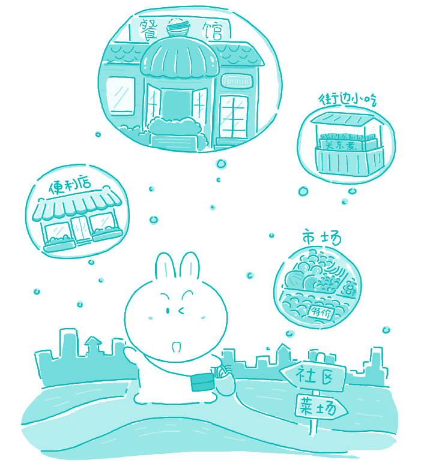

> ###  译文

> **16. 你对在社区新建一家餐馆有何看法？**

> 到目前为止，我们社区附近还没有任何餐馆。我们有个当地的食品市场、几家便利店，甚至还有几个街边的食品摊，但是没有真正的餐馆。我个人赞成在附近开一家新餐馆，并且相信这会令人们的生活更方便，也会支持地方经济和创造更健康的社区精神。

> 对于本地的家庭来说，每天晚上在家做饭是既费时间又令人厌烦的。经过一天长时间的工作，本地人要花至少一个小时去购买食品杂货，甚至还要花更长的时间来做晚饭以及进行饭后的清理。所有这些都完成之后，他们就几乎没有时间去享受天伦之乐了。如果附近有餐馆的话，出去吃饭将会节省时间，但是去最近的餐馆也要走上30分钟。如果我们附近开一家餐馆的话就会让本地人每周放松一两个晚上，并有更多的时间与家人在一起。

> 一家新餐馆也会有助于本地的经济。建造餐馆会需要本地木工、管道工和电工的劳动。新餐馆会需要从本地的市场购买大量的食物和产品，也要向本地的商人购买家具、厨房用具及每天所需的杂项。它还会提供侍者、经理及厨师的工作职位。或许最重要的是，一家餐馆会潜在地吸引周边地区来做生意，为我们的社区带来更多的投资。

> 最后，一家新餐馆会为本地人提供一个聚会和谈天的公共场所。我们的社区几乎没有适合大家聚会和聊天的公共场所。大街上和市场里太吵了，商店里又没有地方可坐。曾经陌生的人们可以在这家餐馆里见面并彼此变得更加熟稔。新的友谊可以建立，旧的友谊可以巩固。一家餐馆为社区生活带来的好处与其经济收益相比更加难以衡量，但是我的观点是我们的社区急需这些好处。 

###  Word List

 * convenience store 便利店
 * electrician [ilekˈtriʃən] n. 电工
 * time-consuming [ˈtaimkənˌsu:miŋ] adj. 费时间的
 * utensil [juˈtensəl] n. 器具
 * potentially [pəˈtenʃəli] adv. 潜在地
 * groceries [ˈgrəusəriz] n. 食品杂货
 * investment [inˈvestmənt] n. 投资
 * carpenter [ˈka:pəntə] n. 木匠
 * acquainted with 与…熟悉
 * plumber [plʌmə] n. 管道工
 * sorely [ˈsɔ:li] adv. 强烈地，非常

## 17. Learn by yourself or with a teacher?

Whether we need a teacher or not depends on circumstances. The relationship between a teacher and a new subject is somewhat similar to that between a tour guide and an unknown city.

When we come to an unknown city for the first time, we definitely need a tour guide. We might have a detailed map, but it is unlikely functional—it isn't surprised that we can hardly interpret those mysterious symbols. Likewise, when we are beginners, it is wise to learn with teachers. They can tell us where to begin with, what we should do, and which reference we should choose. When we confront difficulties, we can ask them for help, and their advices will always be tremendously helpful. With teachers' assistance, we might learn easier, faster, and more interestingly.

After a period of time, we have learned a lot. We now know the city pretty well, even though there are still many places we haven't been to. It doesn't matter. Now that we are able to recognize those mysterious symbols on the map, what we need perhaps is not a tour guide but a more detailed map. Similarly, we need richer references for learning. Yes, there are still many fields unexplored; they are, nevertheless, no longer puzzling. The task is simple: we will explore them one by one, little by little. If we are working on a certain skill, practice more; if we are preparing a test, practice more; whatever we are learning, what is always to bear in mind is that, like people always say, practice makes perfect.

After another period of time, we might have become others' tour guide, but we still want to make out more. We want to know which restaurant is the most decent, which bookstore is the most professional, which coffee shop is the most classical. Even the most comprehensive map doesn't have adequate information. We again need experts. In learning, it's much the same. We need experts to consult for specific problems. Furthermore, the most beneficial merit of consulting experts is that we can not merely refer to them but even discuss with them in depth. As is often the case, a solution for a complex matter is not waiting for us right there and then, sometimes it comes out of inspirations of discussion.

In short, having a good teacher is always better than having none, but the importance of a teacher varies from period to period, and more often than not depends on different stage in which we are learning.

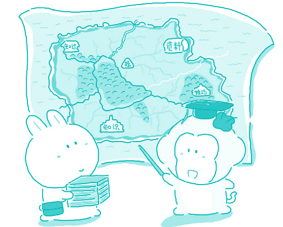

> ###  译文

> **17. 自学还是从师？**

> 我们是否需要一位老师要依情况而定。老师与新的科目之间的关系有点像导游与未知城市之间的关系。

> 当我们第一次到一座未知的城市时，我们当然需要一位导游。我们可能会有一幅详细的地图，但它好像不太起作用——我们几乎很难理解那些神秘的符号，这一点也不令人惊奇。同样地，当我们是初学者时跟随老师学习是很明智的。他们可以告诉我们从哪里开始、该做什么、该选哪些参考书。当我们遇到困难时，可以向他们求助，他们的建议总是会对我们极有帮助。有了老师的协助，我们可以学习得更轻松、更快速、更有趣。

> 过了一段时间，我们已经学了很多了。我们现在已经很了解这座城市了，尽管有很多地方我们还没去过，但这没关系。既然我们已经能够认识地图上那些神秘的符号了，我们需要的可能就不是导游而是一张更详细的地图了。同样地，我们需要更丰富的参考资料来学习。是的，还有很多没有探索过的领域，然而它们已经不再让人迷惑了。任务很简单：我们要一个一个、一点一点地探索它们。如果我们是在学习某种技巧，那就勤加练习；如果我们是在准备考试，那就多做练习。不论我们正在学习什么，需要永远记住的就是人们常说的：熟能生巧。

> 又过了一段时间，我们可以做别人的导游了，但是我们还想学得更深。我们想知道哪家餐馆是最体面的，哪家书店是最专业的，哪家咖啡店是最经典的。即便最全面的地图也没有恰当的答案。我们又一次需要专家了。在学习上也大体相同。我们需要专家来请教特定的问题。此外，咨询专家最大的好处就在于我们不仅可以求助于他们，还可以与他们进行深入探讨。通常的情况就是，一件复杂事物的解决方案不会在那里等着我们，有时候它来自讨论时的灵感。

> 简而言之，有一位好老师总比没有要好，老师的重要性在每个时期都会不同，更多地是取决于我们处在学习的哪个阶段。

###  Word List

 * circumstance ［ˈsə:kəmˌstæns］ n. 环境，详情，境况
 * comprehensive ［ˌka:mpriˈhensiv］adj. 全面的，广泛的
 * interpret ［inˈtə:prit］ v. 把…理解为
 * specific ［spiˈsifik］ adj. 特定的
 * mysterious ［miˈstiriəs］ adj. 神秘的
 * consult ［kənˈsʌlt］ v. 请教
 * reference ［ˈrefərəns］ n. 参考书目
 * complex ［kəmˈpleks］ adj. 复杂的
 * functional ［ˈfʌŋkʃənəl］ adj. 起作用的
 * beneficial ［ˌbenəˈfiʃəl］ adj. 有益的，受益的
 * puzzling ［ˈpʌzəliŋ］ adj. 令人迷惑的，使莫名其妙的
 * merit ［ˈmerit］ n. 优点，价值
 * confront ［kənˈfrʌnt］ vt. 面临，对抗
 * inspiration ［ˌinspəˈreiʃən］ n. 灵感
 * decent ［ˈdi:sənt］ adj. 相当好的，像样的

## 18. What makes a good boss?

A good boss is imperative to a successful workplace. The best bosses are serious, creative, and flexible. If a boss lacks any of these qualities, problems are certain to arise in the workplace. While humor and kindness are important characteristics for bosses to have, work is a serious business, and must be approached with a serious attitude. A boss must be able to keep his/her employees working hard and on schedule. He/ She must set down rules, enforce them, and also personally adhere to them. If the boss comes in late to work, leaves early, or spends all day joking with the co

workers, then the employees will neither respect nor work hard for him/her. A boss must have a serious and professional attitude that sets an example for all of the employees in the workplace.

To confront the countless problems that arise every day in the workplace, a boss must be extremely creative. If a client needs the company to meet a deadline earlier than expected, a boss must find ways to motivate employees to work faster and harder. A boss who lacks creativity might force his/her employees to work overtime. In this case, the employees might be very tired and upset; they might work slower or produce lower quality work as a result. A creative boss might spend a small amount of money, and treat everyone to dinner at the office to encourage employees to stay late. In this way the company might meet the deadline, preserve quality, and keep employee morale high. Finally, the most important quality that a good boss must possess is flexibility. While needing to set serious, strict rules, he/she must also recognize that at times the rules need to be bent or broken. For instance, a boss should strictly enforce attendance policies in the workplace. But if an employee with an excellent attendance record needs to take a day off for personal reasons, the boss should let him/her do it. In this way employees' loyalty to the company will be strengthened, and they will be more happy and productive in the workplace.

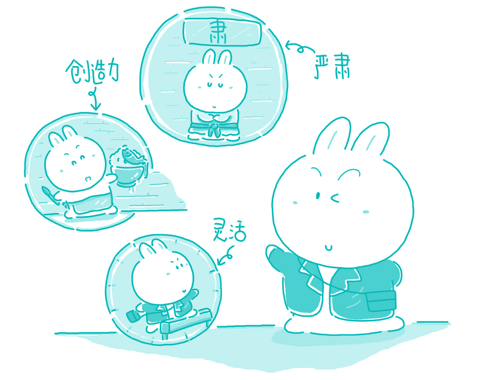

> ###  译文

> **18. 好老板需具备哪些品质？**

> 一位好的老板对于一家成功的公司来说是十分重要的。最优秀的老板是严肃、有创造力和灵活的。如果缺少其中任何一样，公司就肯定会出某些问题。

> 虽然幽默和和蔼是老板需要具备的重要特点，可工作是一件严肃的事，必须以严肃的态度去处理。一位老板必须能让他或她的雇员努力工作并按进度表进行。他或她必须制定规章制度并执行，自己也严格遵守。如果老板上班迟到早退，并且整天与同事开玩笑，那雇员们既不会尊敬他或她也不会努力工作。老板必须持有严肃且职业的态度，为公司里的所有雇员作出榜样。

> 为了应对公司每天出现的数不清的问题，老板必须极具创造性。如果客户提出将最后期限提前，那老板就必须想办法激发员工，以使他们工作得更快、更努力。缺乏创造性的老板可能会强迫雇员超时工作。这种情况下，雇员会十分劳累和心烦，结果他们可能会干的更慢或工作质量低下。有创造性的老板可能会花一小笔钱请所有人在办公室吃晚饭以鼓励员工晚些走。用这种方法可能公司就会按期完成任务并且保证质量，员工的士气也很高涨。

> 最后，好老板所必须拥有的最重要特质就是灵活性。需要制定严肃、严格的规章时，他或她必须知道这些规章有时需要通融或是打破。例如，老板应该在公司中严格执行出勤制度，但是假如一位有着优秀出勤记录的员工因个人原因需要离开一天时，应该让他或她去。通过这种方法，员工对公司的忠诚度将会加强，他们工作时会更高兴，生产效率也会更高。

###  Word List

 * schedule ［ˈskedʒu:l］ n. 时间表，进度表
 * adhere ［ædˈhiə］ vi. 坚持
 * employee ［emˈplɔii］ n. 职工，雇员
 * workplace ［ˈwə:kˌpleis］ n. 工作场所
 * deadline ［ˈdedˌlain］ n. 最终期限
 * treat ［tri:t］ vt. 对待，款待
 * preserve ［priˈzə:v］ vt. 保护，保持
 * morale ［məˈræl］ n. 士气
 * attendance ［əˈtendəns］ n. 出勤
 * loyalty ［ˈlɔiəlti］ n. 忠诚，忠心
 * productive ［prəˈdʌktiv］ adj. 生产性的，多产的

## 19. Highways or public transportation, which should be given preferential financing?

As China continues along the road of economic development, new demands are being put on the transportation infrastructure of the country. This is particularly evident in the cities, where daily traffic jams are unavoidable facts of life. Faced with a mounting traffic crisis, I believe the government should focus on improving public transportation instead of improving roads and highways. Public transportation is cheaper, better for the environment, and a better longterm solution for meeting the transportation demands of the future.

The traffic crisis in large cities is mainly due to the increase in the number of private cars on the road. If 30 people each drive their own private cars to work in the morning, polluting emissions from these 30 cars pollute the air. Having 30 extra cars on the road not only means more traffic, it also means that all cars on the road will run their engines longer to produce more pollution while they idle in traffic jams. On the contrary, if those same 30 people take the bus to work, there would be less traffic, and even less pollution. More bus and subway lines would also save much space now wasted on parking lots, which makes sense from both environmental and city-planning perspectives.

Investment in public transportation also makes sense for the customer. The most expensive public transportation in the city costs about 5 Yuan. Two trips across the city every day for a whole year would still be less than a fifth of the cost of a new car, not to mention the inevitable expenditure of maintaining a good performance of the car. Taking into account the considerable upkeep expenses of a car, gas, insurance, and repairs, owning a car is much less economic and convenient than is taking the bus or the subway.

While some people would argue that investing money on highways is imperative for holistic benefits of our country, I personally believe the need for solving current traffic disasters that are prevalent in most such major cities as Beijing, Shanghai, and Guangzhou is more urgent. The problem has already become the biggest headache of local governments and their residents, and would cost even more if not handled promptly.

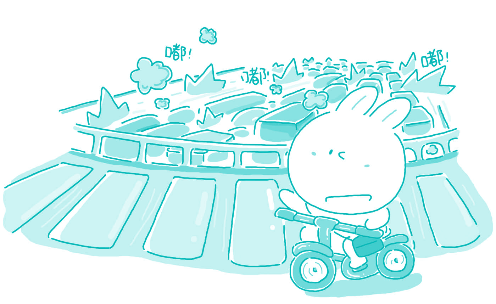

> ###  译文

> **19. 公路与公共交通哪个应获得优先资助？**

> 中国经济的发展，对交通运输基础设施提出了新的要求。这在城市中尤其明显，那里每天的交通堵塞是生活中无法避免的事实。面对逐步增加的交通危机，我相信政府应集中精力改进公共交通设施而不是改进公路。公共交通是适应未来交通要求的更廉价、更环保也是更好的长期解决方案。

> 大城市里的交通危机应主要归因于路上行驶的私家车数量的不断增加。如果30个人都驾驶着自己的私家车上班，那么排出的污染性气体就会污染空气。路上多了30辆车并不仅仅意味着交通量的增加，还意味着路上的所有汽车在交通堵塞时发动机要开动更久从而排放更多的污染物。相反地，如果同样的30个人乘公交车上班，交通量就会减少，甚至污染也会减少。更多的公共汽车和地铁线也会节省现在浪费在停车场上的空间，这不仅对环境而且对城市远景规划也有意义。

> 在公共交通上的投资也对消费者有利。城市里最昂贵的公共交通会花费5元。每天穿过城市两次，这样一整年下来的花费也会比一辆新车的五分之一要少，更不用提维护车辆性能良好的花费了。算上数量可观的汽车维护费用、汽油、保险和修理费用，拥有汽车远不如乘公共汽车和地铁经济方便。

> 有人会争论说投资修建公路对我国的整体利益来说是势在必行的，但我个人认为，解决大城市，如北京、上海、广州，目前普遍存在的交通事故问题更为紧急。这个问题已经变成了地方政府和居民最为头疼的问题，如果处理不及时将会造成更大损失。 

###  Word List

 * infrastructure ［ˈinfrəˌstrʌktʃə］ n. 基础设施
 * mounting ［ˈmauntiŋ］ adj. 逐渐增长的
 * emission ［iˈmiʃən］ n. (光、热等的)散发，喷射
 * expenditure ［ikˈspendətʃə］ n. 支出，花费
 * parking lot 停车场
 * perspective ［pəˈspektiv］ n. 远景
 * imperative ［imˈperətiv］ adj. 紧急的，势在必行的
 * prevalent ［ˈprevələnt］ adj. 普遍的，流行的
 * promptly ［ˈpra:mptli］ adv. 迅速地

## 20. Big city or countryside,which is better for children to grow up in?

Having grown up in the country myself, I can say without a doubt that I want my own children to grow up in the city. Life in the city is incomparably better for children than life in the country. The city has better schools, health care, jobs, and more exposure to the outside world.

The two most important things in any child's life are health and education. In the country, if children get sick, there are no good hospitals to take them to. Families are often so poor that they can't afford to send all of their children to school, and the schools are usually of low quality anyway. In the cities, on the other hand, health care facilities and schools are of excellent quality.

Children from cities also have a much higher chance of getting into excellent universities. City universities have large numbers of spaces reserved for local residents while they have relatively fewer spaces for students from the countryside. If I want my child to have a good chance of getting into a good university, I would raise them in a city.

City salaries are significantly higher than salaries in the country. Jobs in the city are also much easier, on average, than jobs in the country. A worker in the country might spend 14 hours a day laboring outdoors in the fields and make much less money per month than the city worker who typically works only eight hours a day. I want my child to grow up and get a good, high-paying job. A better place to find those is in a city.

Finally, I want my children to grow up into a world that is larger than just their immediate surroundings. In a city they will have a chance to meet people from all over the country and all over the world. They will have chances to absorb history and culture from the cities parks, theatres, and museums. Only in the city will they have the chance to be truly global citizens.

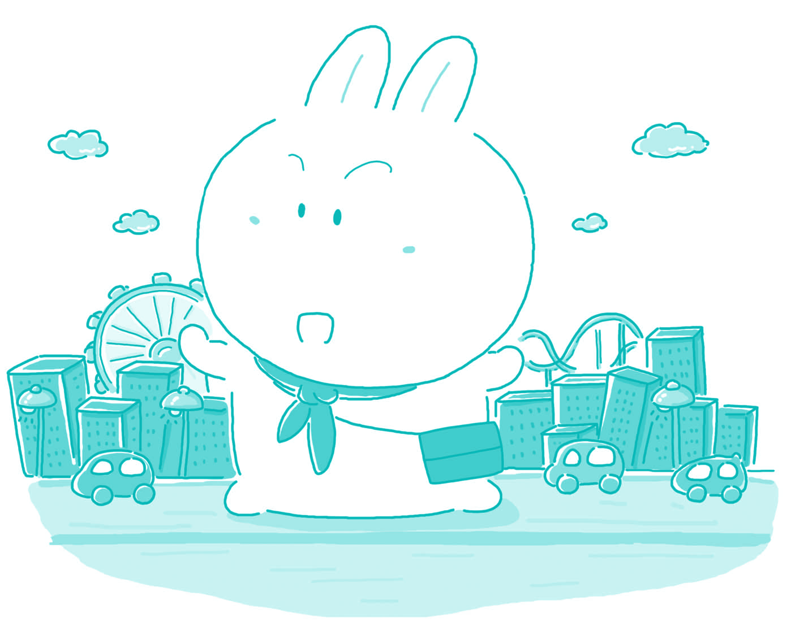

> ###  译文

> **20. 大城市和农村：哪里更适宜孩子成长?**

> 因为我自己是在农村长大的，所以我毫无疑问地希望我的孩子能在城市长大。对孩子来说，城市里的生活要比农村里的生活好得多。城市里有更好的学校、医疗保健和工作，也能更多地接触到外面的世界。

> 任何孩子生活中最重要的两件事就是健康和教育。在农村，如果孩子病了，没有好医院可以带他们去。家里常常是穷得连送所有的孩子上学都负担不起，而且学校也通常是质量很低。相反，在城市里医疗设施和学校的质量都很高。

> 城市里的孩子上好大学的机会也要多得多。城市里的大学为本地居民留了很多名额，而给农村来的学生的名额却相当少。如果我想让我的孩子有更多的机会上更好的大学，那我会在城市里将他们养大。

> 城市里的工资明显比农村里的高。平均来说，城市里的工作也要比农村的工作容易得多。而农村里的劳动者可能会每天在户外农田里劳动14小时，且每月挣的远不如城市里典型的每天工作8小时的工人。我想让我的孩子长大后找到一份很好的高薪工作，而更容易找到这种工作的地方是城市。

> 最后，我希望我的孩子长大后不只是生活在他们身边的小圈子里。在城市里他们有机会见到来自全国和全世界的人。他们有机会在城市的公园、剧场和博物馆中吸取历史和文化营养。只有在城市中他们才有可能成为真正的世界公民。

###  Word List

 * incomparably ［inˈka:mpərəbli］ adv. 无比地
 * exposure ［iksˈpəuʒə］ n. 暴露，揭露，暴光
 * facility ［fəˈsiliti］ n. 设备，工具
 * significantly ［sigˈnifikəntli］ adv. 值得注意地
 * immediate ［iˈmi:diit］ adj. 紧靠的
 * surroundings ［səˈraundiŋz］ n. 环境
 * absorb ［əbˈsɔ:b］ vt. 吸收，吸引

## 21. The causes of people's longevity today

Among various factors that contribute to today's longevity of people are three most obvious ones: the improvement of food conditions, the development of modern medical technology, and finally current stability of economy in our country.

Food conditions are better than before and are still being developed with a rapid pace. First of all, foods are more hygienic. People today drink untainted mineral water, sterilized skim milk, which are cheaply supplied in supermarkets. Furthermore, foods are more nutrient. Not to mention various carefully designed nutrient products. People can just ignore the possibility of being dystrophic, since they can keep nutrient balance by simply taking a cheap pill of vitamin compound every day.

Another essential improvement that contributes to people's longevity is swiftly developing medical technology. Development of modern medical technology has always been amazing. Certain diseases such as tuberculosis, pneumonia, and dysentery are now easy to remedy with low expenses, but in the past, they are all probably lethal ones. The dental technology seems developed little except its exorbitantly charged bill, yet the simplest technology contributes to people's longevity most. It is not difficult to imagine that if an individual who lived in the past got a toothache, without certain dental care which is common today, he was certainly in an awful prospect: he might even die of a toothache!

Current societal and economic stabilization is also a very indispensable factor. People have less pressure in a more stable society, the less pressure they suffer, the healthier they are. Today's ideal stabilization even provides people an opportunity to secure their future—buy insurances. Various types of insurances are readily available, which make people feel safe, and have to a large extent reduced people' anxieties, and therefore indirectly contribute significantly to the longevity of people.

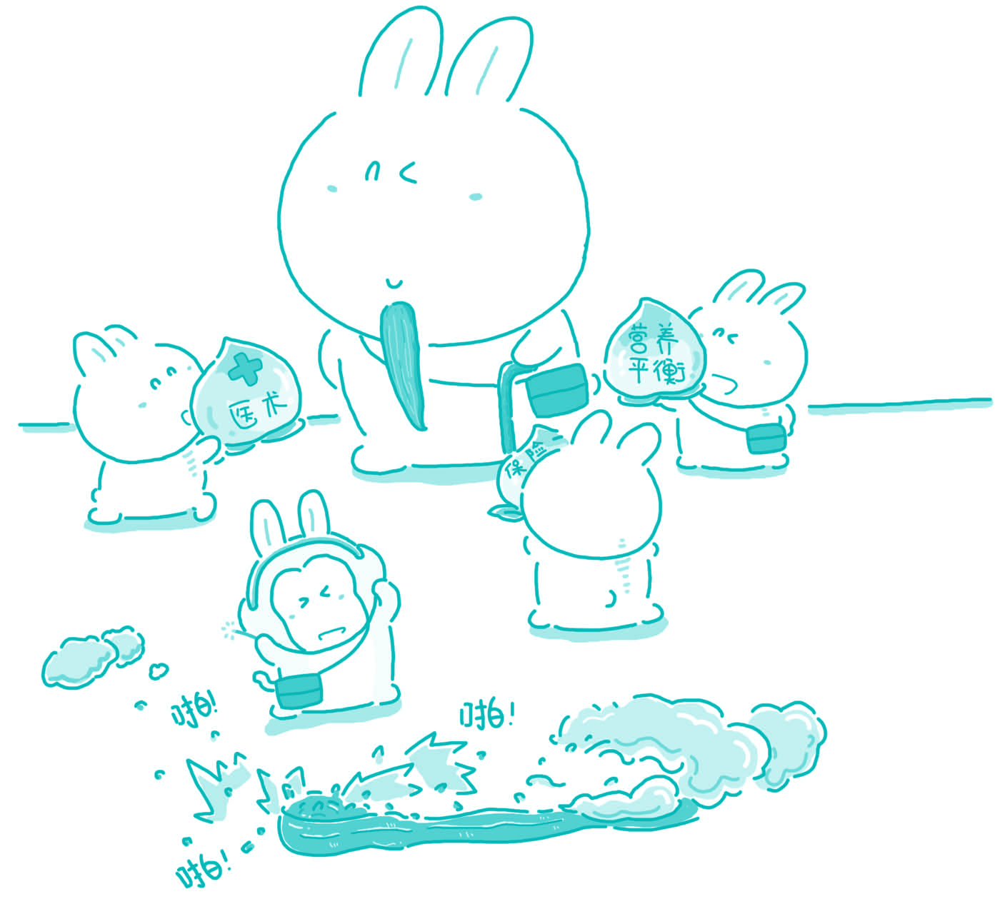

> ###  译文

> **21. 现代人长寿的原因**

> 现代人长寿的原因有很多，其中有3个最为明显：食品状况的改善、现代医疗技术的发展和当前我国经济的稳定。

> 食品状况比以前有所改善，而且还在以高速继续发展。首先是食物更加卫生了。人们现在喝的是无污染的矿泉水，高温灭菌的脱脂牛奶，这些都在超市里低价供应。此外，食物也更加有营养了，更不用说各种精心设计的营养食品。人们完全可以忽略患上营养不良的可能性，因为他们每天只需吃一片便宜的复合维生素片就可以保持营养平衡。

> 另一种使人们长寿的进步就是飞速发展的医疗技术。现代医疗技术的发展总是让人惊异。某些疾病，例如肺结核、肺炎、痢疾，只需很低的花费就能轻松治愈，但是在过去它们全都几乎是致命的。牙科技术似乎除了过分昂贵的帐单之外没什么发展，但最简单的技术却会对人类的长寿贡献最大。不难想像如果过去有人牙疼，没有今天很平常的牙科护理，那他可就肯定倒霉透了：他甚至可能死于牙疼！

> 目前的社会和经济稳定也是一个不可或缺的因素。在一个更稳定的社会里，人们的压力会较小，他们的压力越小，也就会越健康。今天理想化的稳定局面甚至为人们提供保证未来的机会——买保险。各种不同种类的保险随时提供，这使人们感到安全，也在很大程度上减轻了人们的忧虑，所以也就间接地为人们的长寿做出了重大的贡献。

###  Word List

 * longevity ［la:nˈdʒeviti］ n. 长命，寿命
 * stability ［stəˈbiliti］ n. 稳定性
 * hygienic ［ˌhaidʒiˈenik］ adj. 卫生学的；卫生的
 * nutrient ［ˈnu:triənt］ adj. 有营养的
 * dystrophic ［diˈstra:fik］ adj.营养不良的
 * tuberculosis ［tuˌbə:kjəˈləusis］ n. 肺结核
 * pneumonia ［nu:ˈməunjə］ n. 肺炎
 * dysentery ［ˈdisənˌteri］ n. 痢疾
 * lethal ［ˈli:θəl］ adj. 致命的

## 22. What makes a good co-worker?

Healthy co-workers relations are crucial for the success of business. Since average workers spend at least 8 hours a day with their co-workers, their relationships with their co-workers are among the most important relationships in their lives. The best kinds of co-workers will possess team spirit, be hard working, and have a sense of humor.

Co-workers with team spirit will put the needs of the company and their co-workers before their own needs. For instance, an employee with team spirit might put in uncompensated overtime to help a co-worker finish a project before a big deadline. If the worker who needs help does not meet the deadline, the whole company might lose an important client. If co-workers help each other, even though the rewards might not be immediately apparent, each individual will gain more than if they worked separately.

A good co-worker needs to be hard working. This is the responsibility of every worker in any company. Just as the failure of employees to cooperate will hurt each member of a company, failure of each worker to perform to the best of his/her ability will hurt the company. It will not only lower that particular worker's productivity, it will also damage the co-workers' morale. If I see a coworker of mine slacking off, I might begin to think to myself, "Why should I work hard? I can slack off like my co-worker and still make the same amount of money!" Hard work is not only important for productivity; it is also a crucial prerequisite of team spirit.

Finally, good co-workers need to have a sense of humor. Working at any company can be very stressful. Even though it is necessary for everyone to work hard, that does not mean that work cannot be fun. Since co-workers spend so much time together, being able to joke and laugh each other is also important.

If an employee is perceived by his/her co-workers as a humorless workaholic, then they might not want to go along with him/her. His/her lack of humor hurts team spirit, and not only irritates the people around him/her, but also damages the whole company.

> ###  译文

> **22. 好同事需具备哪些品质？**

> 同事之间的健康关系对商业的成功是至关紧要的。因为一般上班的人每天都要花至少8小时与同事呆在一起，他们与同事之间的关系就属于生活中最重要的关系之一。最好的同事要具备团队精神，工作努力并且有幽默感。

> 有团队精神的同事会把公司和其他同事的需要放在自己的需要之前。比如有团队精神的雇员会无偿地加班帮助同事在最后的期限前完成项目。如果需要帮助的雇员没有按期限完成，那整个公司就可能会失去一位重要客户。如果同事们互相帮助，虽然可能不会马上得到回报，但肯定要比每个人单独工作得到更多的东西。

> 好的同事需要有努力工作的精神。这是任何公司里每个职员的责任。就像员工之间不能合作会伤害公司里的每个员工一样，任何员工无法最大限度地发挥他或她的能力都会给整个公司造成损失。那不仅会降低那个员工的生产能力，还会破坏同事们的士气。如果我看到一位同事闲闲散散，那我自己就会想：“我为什么要努力工作？我也可以闲闲散散而挣同样多的钱。”努力工作不仅对生产能力来说十分重要，对团队精神来说也是至关重要的先决条件。

> 最后，好的同事需要有幽默感。在任何公司工作都可能会很有压力。即使每个人都必须努力工作，也不意味着工作就不会有乐趣。因为同事们每天花那么多时间在一起，能互相开玩笑取乐也是很重要的。如果一位雇员被同事看作是毫无幽默感的工作狂，那他们就不会愿意和他或她在一起。他的缺少幽默感伤害了团队精神，不仅惹恼了周围的人，而且破坏了整个公司。

###  Word List

 * co-worker ［ˈkəuˌwə:kə］ n. 同事
 * slack ［slæk］ vi. 松懈，松驰
 * uncompensated ［ʌnˈka:mpenseitid］adj. 未得补偿的
 * productivity ［ˌprəudʌkˈtiviti］ n. 生产力
 * crucial ［ˈkru:ʃəl］ adj. 至关紧要的
 * deadline ［ˈdedˌlain］ n. 最终期限
 * prerequisite ［pri:ˈrekwizit］ n. 先决条件
 * client ［ˈklaiənt］ n. 顾客，客户，委托人
 * workaholic ［ˌwə:kəˈhɔlik］ n. 工作第一的人，工作狂
 * reward ［riˈwɔ:d］ n. 报酬，奖金
 * cooperate ［kəuˈa:pəˌreit］ vi. 合作，协作
 * irritate ［ˈiriteit］ vt. 激怒
 * morale ［ma:ˈræl］ n. 士气

## 23. Is it advisable for a teenage student to have a part-time job?

People who oppose the idea of students taking part time jobs say that students should use their time to focus on exclusively on studying. I would argue instead that part-time jobs helps students focus on their studies, provides valuable practical experience, and allows them a feeling of success and independence that is a perfect complement to their academic pursuits.

A popular criticism of schools is that they are"ivory towers," or places where study and research are divorced from the "real world". A part-time job related to their major gives students an exciting chance to apply the theories they have learned in school. Chemistry is a notoriously abstract, boring, difficult subject. When a student takes a part-time job in a medical research lab, however, he/she might discover how important studying Chemistry is for saving people's lives. This student might then return to his/her Chemistry studies with renewed vigor. What was an abstract academic pursuit becomes a concrete and interesting goal with a real relationship to the student's life.

Part-time jobs also help students strengthen their resumes, build important contacts with companies, and familiarize them with the contemporary state of their respective fields. No matter how hard they try, Computer Science textbook publishers cannot keep up with the rapid development of new computer hardware, software, and programming languages. C. S. students who wish to maintain a competitive edge in the job market should find part-time positions where they can learn state-of-the-art techniques. After they graduate from college, they might then return to their part-time employer to look for a full-time position, or approach other employers with good references and cutting-edge work experience.

Finally, the feeling of success that comes from holding a part-time job can build students' confidence. Knowing that they can do a job well and be paid for it is an important character-building experience that many students put off for too long. Learning to manage the money that they make will be a critical part of their future lives. If they make mistakes handling their money in college, the results will probably not be disastrous, but will teach them valuable lessons that they will be sure to remember in the future, when they will be truly independent.

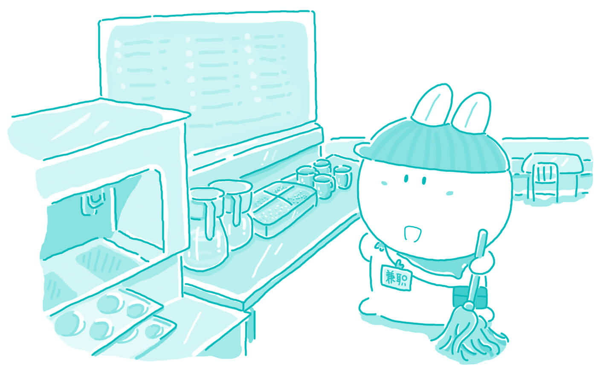

> ###  译文

> **23. 学生兼职可取吗？**

> 那些反对学生做兼职工作的人认为学生应该集中所有的时间专心学习。我却认为兼职工作帮助学生集中注意力进行学习，提供宝贵的实践经验，并给他们一种成功和独立的感觉，这对他们的学业是一种完美的补充。

> 关于学校的流行看法是它们是“象牙塔”，或是学习与研究同“真实世界”相分离的地方。一份与学生的专业相关的兼职工作给他们一个令人激动的机会去实践他们在学校中学到的理论。化学是一门众人皆知的抽象、烦人且难学的课程，可当一个学生做医学研究实验室的兼职工作时，他/她就会了解学习化学对挽救人的生命有多重要。这个学生可能会以更大的活力投入到化学学习中去。它从一项抽象的学术研究变成了一个与该学生切实相关的具体且有趣的目标。

> 兼职工作也可以帮助学生们充实他们的履历，与公司建立重要的联系，并使他们熟悉各自领域的最新动态。计算机教材出版商无论怎么努力都无法跟上计算机新的硬件、软件和编程语言的发展。想在人才市场上取得竞争优势的计算机专业的学生应该找那些可以学到最新技术的兼职工作。他们大学毕业后可以回到兼职雇主那里找一份全职工作，也可以带着评价良好的推荐信及前沿的工作经验去找新的雇主。

> 最后，从事兼职工作所获得的成就感能树立学生的信心。知道自己能做好一份工作并因此获得报酬是一种重要的性格塑造经历，而很多学生的这种经历都来得太晚。学会管理挣来的钱将会是学生未来生活的重要部分。上大学时如果他们在管理钱财上犯了错误，结果不会很严重，却会让他们吸取宝贵的教训，当他们在未来真正独立的时候，肯定记住这些。

###  Word List

 * focus ［ˈfəukəs］ vt. 使集中在焦点上，集中
 * complement ［ˈka:mpləmənt］ n. 补足物
 * pursuit ［pəˈsu:t］ n. 追求
 * notoriously ［nəuˈtɔ:riəsli］ adv. 众所周知地
 * reference ［ˈrefərəns］ n. 介绍信(人)
 * cutting-edge ［ˌkʌtiŋˈedʒ］ adj. 先锋的，前沿的

## 24. The advantages and disadvantages of my city

If my friend Joey wants to move to Beijing, I think even though she might find something she dislikes, she will ultimately like this greatest city in our country. The weather might be one thing that she dislikes. The weather in Beijing is characterized by dry climate and it is much windy and dusty than that of Guangzhou city. Joey is very sensitive about her skin, so she will definitely hate dusty winds in Beijing. Moreover, Beijing's winter is far too much colder than that of Guangzhou, it might take Joey, as many other people came from the South, a very long time to get accustomed to. Nevertheless, she might well enjoy winter in the North, since she has never seen snowflakes in reality before. I remembered the shining of yearning and eager in her eyes when I once told her what the winter in the North looks like.

She might be always irritated by heavy traffic in Beijing, though taxis in Beijing cost much less than in Guangzhou. When I was in Guangzhou, seldom was I trapped by traffic jams. It must be ridiculous for her to have spent more than two hours and still didn't arrive at the destination which is merely 10 kilometers away. And the most ludicrous thing is, even if you possess a private car, it is more likely to be useless, for parking lots are always crowded, which means more time is to be wasted. Good news for her is that the bus system and that of subway in Beijing are well developed and more convenient, and she won't have to bear that odor of bromhidrosis owing to burning weather as she once experienced in buses of Guangzhou.

What she will definitely love is the cultural ethos of the city. Beijing has a history probably longer than any other big city in China. To visit all historical landscapes in Beijing, she will need at least three years, no kidding! Beijing has the most famous and excellent universities, the largest libraries, the richest museums, yet most important of all, her best friend! Amazingly, in this aged city, people are sometimes more international. Joey is especially fond of art, and Beijing is the right place for her, in which concerts of international singers or other musicians are much frequent, and she will even be able to attend Cui Jian's casual private concert in a coffee shop on a rainy autumn weekend.

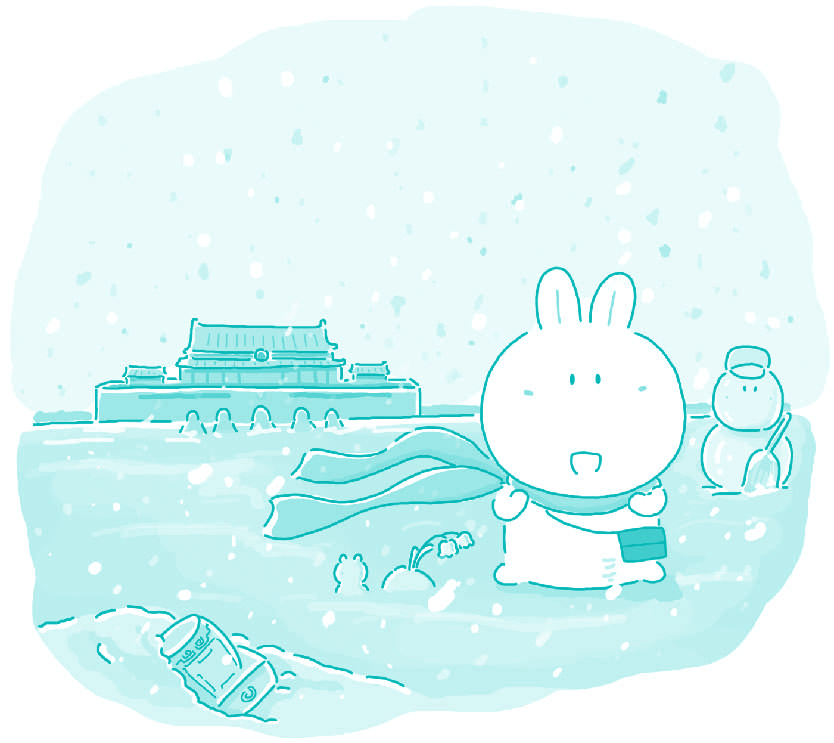

> ###  译文

> **24. 我的城市的优点与缺点**

> 如果我的朋友乔伊想搬到北京来，我认为即使她有一些不喜欢的地方，最后她还是会喜欢上这个中国最伟大的城市。

> 天气可能会是她不喜欢的一件事。北京的气候干燥，比广州要多风和沙尘。乔伊的皮肤很敏感，所以她肯定会不喜欢北京的沙尘暴。此外，北京的冬天要比广州冷得多得多，所以乔伊肯定要像很多南方人一样花很长时间才能适应。然而，她可能会很喜欢北方的冬天，因为她以前还从来没有见过真正的雪花。我还记得有一次我给她讲北方的冬天是什么样子时她那向往而又渴望的眼神。

> 尽管北京的出租车要比广州的便宜得多，她可能永远不会喜欢北京拥挤的交通。我在广州时很少被交通阻塞所困。两个多小时走了不到十公里对于她来说肯定是荒唐可笑的。而最滑稽的是即使你拥有一辆私家车也是无用之举，因为停车场总是拥挤不堪，这意味着浪费更多时间。对她的好消息则是北京的公交与地铁系统十分发达、更加便利，这样她就不必忍受酷热天气中臭汗的味道了，而她在广州的公车中就遇到过。

> 她一定会喜欢的是这座城市的文化气息。北京的历史可能比任何其他中国的大城市都要长。要想参观完北京所有的历史古迹，她至少需要花3年的时间，绝不开玩笑！北京拥有最著名和最优秀的大学、最大的图书馆、藏品最丰富的博物馆，最重要的是有她最好的朋友！令人惊讶的是，在这座古城里人们有时却更加国际化。乔伊特别喜欢艺术，北京对她来说正合适，这里各国歌唱家或音乐家的音乐会十分频繁，她甚至可以在秋天阴雨的周末参加咖啡馆里崔健的歌友会。

###  Word List

 * get accustomed to 适应
 * bromhidrosis ［ˌbrəumhaiˈdrəusis］n. 臭汗，腋臭
 * snowflake ［ˈsnəufleik］n. 雪花
 * yearning ［ˈjə:niŋ］ n. 向往
 * landscape ［ˈlændˌskeip］ n. 风景
 * traffic jam 堵车
 * frequent ［ˈfri:kwənt］adj. 时常发生的，频繁的
 * ludicrous ［ˈlu:dikrəs］adj. 滑稽的，愚蠢的
 * odor ［ˈəudə］ n. 气味

## 25. Do you like a large shopping center being built in your neighborhood?

While the proponents of the plan to build a large shopping center in my community believe that it will aid economic development, I think that it will possibly do irreparable harm to our neighborhood. The proposed shopping center will damage existing businesses, provide inferior products, and destroy the environment of our peaceful community.

Research indicates that companies with less than 50 workers employ more people and generate more revenue as a percentage of a nation's GDP than large-scale corporations. This is true in America, where small businesses are considered the engine of the economy, as it is in our community where many people own and operate small shops. Large stores can buy large quantities of goods at wholesale prices. While local grocery, that cannot buy products in bulk, will be unable to compete. Once the competition is gone, the large store can raise its prices and lower its employee's wages. This classic example of exploitative monopoly capitalism impoverishes a community while enriching a small number of people.

The goods sold at the shopping center would be mass produced and necessarily of inferior quality to the handcrafted local goods and freshly grown local produce. Cheap products like plastic furniture would lack the character and local flavor of traditional wooden furniture made right here in our town. Cheaply mass-produced food, laden with pesticides and chemical preservatives, would crowd out the healthier, fresher, and tastier local produce on the shelves of the large shopping center. Low prices from the large store might tempt local consumers to eat less healthy food, endangering the health of local people as well as harming the incomes of local farmers and shopkeepers.

Lastly, I must point out that a large shopping center might bring unwelcome development to our small community. Ugly and noisy roads and parking lots would need to be constructed. The volume of people wanting to buy things at the new shopping center would worsen the traffic situation, which is already bad. Pollution from cars and trucks already has a notably degrading effect on the local air-quality and this is also bound to become worse as the traffic to and from the shopping center increases.

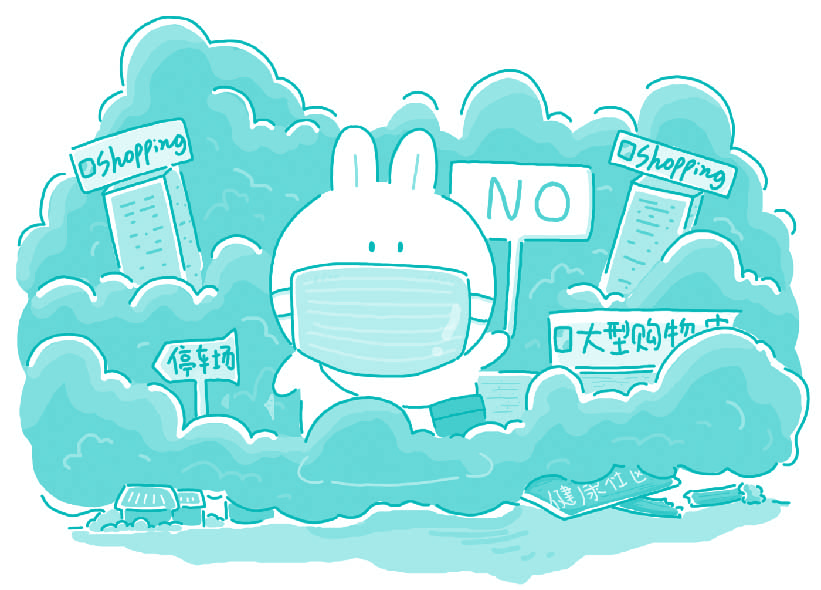

> ###  译文

> **25. 你赞同在你家周围建一个大型购物中心吗？**

> 那些支持在我们社区建立一个大购物中心的人认为它会有助于经济的发展，我却认为它可能会对我们的周围产生难以挽回的危害。提议中的购物中心会破坏现有的商业、提供低质量的商品，并且会破坏我们社区安静的环境。

> 研究指出，50人以下的公司雇用的人数和产生的计入国家国民生产总值的收入都比那些大企业高。这一点在美国是事实，在我们的社区里也同样是事实。美国的小企业被认为是经济的发动机，而我们社区有很多人拥有并经营着小商店。大商店能以批发价格购买大量商品，而地方的小商店无力大规模购买商品，将会无法与之竞争。一但没有了竞争，大商店就会提高商品的价格并降低员工的工资。这种典型的剥削性垄断资本的例子榨干一个社区的同时让一小拨人发财。

> 购物中心出售的商品一定是大批量生产的，质量上肯定不如手工生产的本地货和本地种植的新鲜作物。廉价制品如塑料家具没有我们镇上出产的传统木制家具的特点和本地风味。大量生产的充满了杀虫剂和化学防腐剂的廉价食品，将会把更健康、更新鲜、更美味的本地产品挤出购物中心的货架。低价会诱使本地消费者吃那些不够健康的食品，危害本地人的健康，并且会减少本地农民和商店主的收入。

> 最后，我必须指出，大型购物中心可能会给我们的小社区带来令人厌恶的发展势态。难看、喧闹的道路与停车场将被修建。在新的购物中心，购物者的数量会使本来就很差的交通更加恶化。来自轿车与卡车的污染已经给当地的空气质量造成了明显的恶化，随着购物中心来往交通的增加，这一切势必变得更加糟糕。

###  Word List

 * proponent ［prəˈpəunənt］ n. 建议者，支持者
 * monopoly ［məˈna:pəli］ n. 垄断，垄断者
 * impoverish ［imˈpa:vəriʃ］vt. 使贫穷；使枯竭
 * irreparable ［iˈrepərəbl］ adj. 不能挽回的
 * inferior ［inˈfiriə］ adj. 下等的，下级的；差的，次的；自卑的
 * handcrafted ［ˌhændˈkræftid］adj. 手工的，手工艺的
 * generate ［ˈdʒenəˌreit］ vt. 产生，发生
 * pesticide ［ˈpestiˌsaid］ n. 杀虫剂
 * revenue ［ˈrevənju:］ n. 收入，国家的收入，税收
 * preservative ［priˈzə:vətiv］ n. 防腐剂
 * endanger ［enˈdeindʒə］ vt. 危及
 * wholesale ［ˈhəulˌseil］ adj. 批发的
 * degrading ［diˈgreidiŋ］adj. 可耻的，不名誉的
 * bulk ［bʌlk］ n. 大批，大多数
 * exploitative ［iksˈplɔitətiv］ adj. 剥削的 

## 26. Do you like a new movie theater being built in your neighborhood?

Many people consider our town a small provincial backwater, lacking both culture and the amenities of modern life. Building the recently proposed movie theater would be a step in the right direction, away from our backwards past, and towards participation in the larger world. It will create jobs, spark economic activity, and provide entertainment and culture for our young people.

Movie theaters are necessarily large-scale affairs, attract a large amount of customers, and accordingly need to employ a fairly large number of people as ushers, concession stand chefs and attendants, ticket sellers, and janitorial staff, as well as projection technicians, managers, accountants, and other higher-level professionals. The employees would be drawn from the local population, and considering the tight job market in the area, the movie theatre would provide much needed full or supplement incomes for at least thirty families in the area.

Going to the movies is usually an evening experience that either precedes or comes directly after eating dinner. For this reason many restaurants, cafes, bars, music shops, and other leisure and entertainment venues spring up around movie theatres. People who are going to the movies have disposable incomes and have already left their houses in search of a good time. This is an ideal market, and local entrepreneurs are certain to capitalize on the opportunity to open up new business ventures and develop the lucrative area around the movie theater, further invigorating the local economy.

In addition to providing jobs and developing the local economy, a movie theater will bring us a little bit closer to the outside world. We will be able to participate in popular culture. A movie theater is one step in this direction, and if we can successfully transform our sleepy little hamlet into a regional cultural hot spot, we will be able to keep our young people from migrating to larger cities that they consider more developed and sophisticated. Our young people are our most precious resource and we should do everything to keep them here.

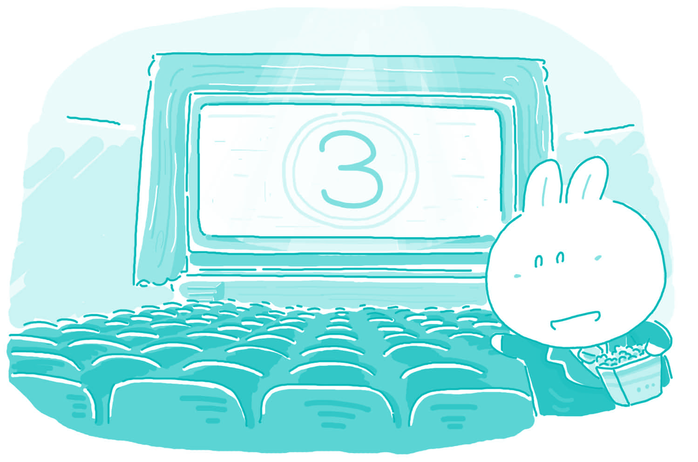

> ###  译文

> **26. 你赞同在你家附近建一个电影院吗？**

> 很多人认为我们镇是地方的一小潭死水，既缺少文化又没有现代生活的便利。建造最近提议的电影院便是向正确方向迈出的一步，它使我们远离落后的过去并迈向更广阔的世界。它将会创造工作岗位、鼓舞经济活动并为年轻人提供文化与娱乐。

> 电影院肯定是一项大规模工程，会吸引大量的顾客，因此也需要雇用相当多的人来充当引座员、小食品摊的厨师和服务员、售票员、门房里的人员，同样也需要放映技术员、经理、会计和其他高层管理人员。雇员将会来自本地人口，考虑到本地紧张的劳动力市场，电影院可以提供至少30个家庭需要的全部收入或补充收入。

> 看电影通常是晚间的活动，要么是在晚饭前要么是在刚吃完晚饭后。出于这个原因，在电影院周围可以建立餐馆、咖啡馆、酒吧、唱片店和其他很多休闲娱乐场所。去看电影的人是那些手里有闲钱的出来玩的人。这是一个理想的市场，当地的企业家肯定会利用这个机会投资建立新的公司来发展电影院周围的有利区域，进一步为本地经济注入活力。

> 最后一点，除了提供工作岗位和发展本地经济，电影院可以让我们与外面的世界更近一步。我们可以参与到流行文化之中。电影院是朝这个方向迈的一步，如果我们成功地将毫无生气的小村落转变成地区性文化热点，我们将能够阻止年轻人流向他们认为更发达更五光十色的大城市。年轻人是我们最宝贵的资源，我们必须尽全力把他们留住。 

###  Word List

 * backwater ［ˈbækˌwɔ:tə］n. 死水，停滞的状态或地方
 * accountant ［əˈkauntənt］ n. 会计（员），会计师
 * amenities ［əˈmenətiiz］n. 令人愉快之事物
 * entrepreneur ［ˌa:ntrəprəˈnə:］n. 企业家，主办人
 * usher ［ˈʌʃə］ n. 引座员
 * invigorate ［inˈvigəˌreit］ v. 鼓舞
 * concession stand 剧场中的食品摊
 * transform ［trænsˈfɔ:m］vt. 转换，改变，改造，使…变形
 * venue ［ˈvenju:］ n. 地点，场所
 * janitorial ［ˌdʒænəˈtɔ:riəl］ adj. 门房的
 * hamlet ［ˈhæmlit］ n. 小村, 部落
 * disposable ［diˈspəuzəbəl］ adj. 可任意使用的 

## 27. Should people sometimes do things that they do not enjoy doing?

We live in a world in which every one wants to be successful. Nothing is wrong about the desire to be No. 1, and there is no doubt that being successful is enjoyable. Nevertheless, it is somewhat childish to think we can be finally successful by only doing what we enjoy doing. People often are amazed by the glorious appearance of a skyscraper, however they at the same time forget the fact that the skyscraper had taken a long time to construct, maybe much longer time to design, and possibly even cost people's lives during the constructing process!

We may categorize things into two groups, the enjoyable and the unenjoyable; at the same time, another category can be made: the necessary and the unnecessary. The point is, things that are necessary are not always enjoyable and things that are enjoyable sometimes may be unnecessary. Doing things that are necessary rather than those that are merely enjoyable is not only helpful, but might also be indispensable for individual success. We all admire even envy those who now have attained great achievements, such those famous stars as Jacky Chen, Jet Li. We should, however, be aware of the exorbitant prices they have paid for their present glories. Jacky Chen once told that when he was still a teenager, he and his partners were required to practice more than 12 hours a day; and it was said that Jet Li was sent to be an apprentice when he was hardly four years old! Apparently, those seemingly cruel hardships have turned out to be the best gifts later. But for yesterday's struggle, today's glories could not exist.

Things that are both enjoyable and necessary or both unenjoyable and unnecessary virtually seldom exist. We may dislike some curriculums in university, such as mathematics or history, but they are necessary; we may prefer leisure times to work days, but the latter are indispensable. Pursuing a successful life is nothing more than making wise decisions, and by"wise"we mean the choice of doing the necessary first.

> ###  译文

> **27. 人们有时应该做自己不喜欢的事吗？**

> 我们生活在一个人人都想获得成功的世界里。想成为第一名的愿望并没什么错，但是如果认为只做自己喜欢做的事就能在最后获得成功，那就未免有点幼稚了。人们经常对摩天大楼那辉煌的外表感到惊诧，但是同时他们忘了摩天大楼是花了很长时间才建起来的，或许设计时间花得更长。而且在建造过程中甚至可能有人会献出生命。

> 我们可以把事情分为两类：令人愉快的和不令人愉快的；同时还有另外一种分法：必要的和不必要的。问题在于，必要的东西并不总是令人愉快的，而令人愉快的东西有时却是不必要的。做必要的事而不是仅仅令人愉快的事不仅会有所帮助，而且也对个人的成功是不可或缺的。我们都羡慕甚至嫉妒那些现在取得重大成就的人，如成龙、李连杰那些明星。然而我们必须认识到，他们为现在的辉煌所付出的过度代价。成龙说当他们还是十几岁的孩子的时候，他和他的伙伴要每天训练超过12小时；据说李连杰在不到4岁的时候就被送去当学徒了。显然，那些看似残酷的艰苦努力多年之后转变成了最好的才能。要不是昨天的奋斗，今天的辉煌就不会存在。

> 实际上既令人愉快又必要的事和既不令人愉快又不必要的事几乎都不存在。我们会不喜欢大学里的一些课程，比如数学或历史，但它们是必要的；我们可能更喜欢休闲的时光而不是工作日，但后者是不可或缺的。实现成功的生活不外乎作出明智的选择，“明智”是指首先选择做那些必要的事。 

###  Word List

 * glorious ［ˈglɔ:riəs］ adj. 光荣的，显赫的
 * skyscraper ［ˈskaiˌskreipə］ n. 摩天楼
 * construct ［kənˈstrʌkt］ vt. 建造
 * categorize ［ˈkætigəˌraiz］ v. 分类
 * indispensable ［ˌindiˈspensəbl］adj. 不可缺少的，绝对必要的
 * exorbitant ［igˈzɔ:bitənt］adj. 过度的，过高的，昂贵的
 * apprentice ［əˈprentis］ n. 学徒
 * apparently ［əˈpærəntli］ adv. 显然地
 * virtually ［ˈvə:tuəli］ adv. 事实上，实质上

## 28. Is it true that media pay too much attention to the personal lives of famous people?

It is true that television programs concerning personal lives of celebrities always receive the highest audience rating. It is also true that newspapers and magazines are constantly reporting stories, which are usually beyond confirmation, about famous people, and that autobiographies written by public figures are always on the top 10 best-sellers' list. It seems that we live in a world where a few individuals are drawing nearly all attentions. Nevertheless, it is not exactly precise to criticize the mass media, including television, newspapers, magazines and so forth, for paying too much focus on the personal lives of famous people such as public figures and celebrities.

In fact, it is the public, to a large extent, rather than mass media, that is paying too much attention on personal lives of celebrities. Most organizations of mass media industry, being inherently commercial, are driven by business motivations. Television program producers, as well as columnists and writers, are always aware of what the public want to see, therefore tend to pander to tastes of the public. To put in another way, the mass media is audience-oriented, and the pheno-menon is well interpreted and manipulated that when famous people such as actors, athletes and rock stars give their opinions, many people listen. It is the nature of the public, who are curious enough about personal lives of famous people, since they can never be famous.

On the other hand, it is holistically detrimental for the society if the mass media pay too much focus on famous few so as to ignore the rest of the individuals. After all, the mission of the mass media is not merely to cater to the needs of customers, but has a much wider scope, such as to tell the truth, to define what is good and what is bad; to promote cultural values, and the list could be endless. More popular science programs should be produced by television, more reports on poor rural lives should be publicized, more books concerning not famous but respectable people such as, nurses who are fighting SARS fearlessly, teachers who are performing their duties regardless of poverty of remote villages, journalists who publicize their pieces under political menace, and this is another endless list should be written.

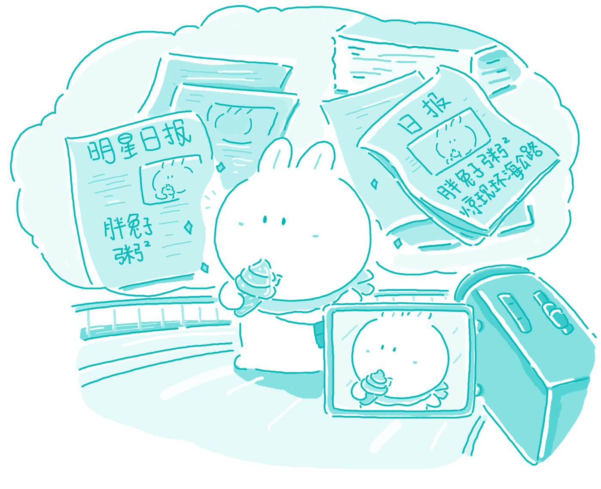

> ###  译文

> **28. 传媒是否过于关注名人的私生活？**

> 有关名人私生活的电视节目的确总能获得高收视率。而那些不断报道名人轶事的报纸和杂志以及公众人物所撰写的自传经常能排到畅销书排行榜的前10名。看来在我们生活的世界里，少数人吸引了几乎所有的注意力。然而，批评电视、报纸、杂志等大众传媒过多地关注公众人物和名人的私生活是不准确的。

> 事实上，在很大程度上是大众而不是媒体过分关注名人的生活。很多大众传媒界的组织由于其固有的商业性而为商业目的所驱动。电视节目制片人和专栏作者以及作家，对观众想看什么总是十分敏感，因此就有迎合大众品位的倾向。换一种说法，大众媒体是受大众导向的，这种现象可以很好地解释，名人如演员、运动员、摇滚明星等发表意见时，很多人都在听。这是公众的一种本性，他们对名人的私生活十分好奇，因为他们永远也无法成名。

> 另一方面，如果大众媒体过于关注出名的少数人而忽略其他人，对社会整体将是一种损害。毕竟大众媒体的任务不仅仅是迎合顾客的需要，还应涵盖更广，比如讲出事实，定义好坏，提升文化价值等，不胜枚举。电视里应该播放更多的科普节目；应该公开报道贫困农村地区的生活；应该写更多关于不出名但值得尊敬的人的书，例如无畏地与非典作斗争的护士们、那些在偏远农村不计贫穷履行自己职责的教师们、还有在政治威胁下仍然发表他们的文章的记者们，这种例子还有很多。 

###  Word List

 * celebrity ［səˈlebriti］ n. 名人
 * constantly ［ˈka:nstəntli］ adv. 经常地
 * autobiography ［ˌɔ:təubaiˈa:grəfi］ n. 自传
 * best-sellers’ list 畅销书排行榜
 * oriented ［ˈɔ:rientid］ adj. 导向的
 * manipulate ［məˈnipjəˌleit］ vt. 巧妙地处理
 * ignore ［igˈnɔ:］ vt. 不理睬，忽视
 * promote ［prəˈməut］ vt. 促进，发扬，提升
 * respectable ［riˈspektəbəl］ adj. 可敬的，有名望的
 * journalist ［ˈdʒə:nəlist］ n. 新闻记者

## 29. Does human activity improve or damage the earth?

The environment is usually changed to benefit human life. Cars and roads make transportation fast and easy, factories make products that make our lives more comfortable, public services in cities like water treatment, electricity, and waste disposal make our lives more convenient. All of these advances, however, come with a significant environmental cost. Human activity does significant damage to the Earth.

One of the main effects of human activity on an area is water pollution. Dumping waste materials from human activity into rivers and streams is popular because the waste seems to disappear downstream. The main sources of water pollution are factory waste, oil and gas runoff from highways, and untreated human waste. When this waste dumped into rivers, the water downstream becomes undrinkable and unusable for agriculture, and also kills plant and animal life in the rivers.

Clean air and water is a prerequisite not only for human life, but also for all life on the planet. But air is now being polluted by modern transportation, notably gas-powered automobiles, as well as electrical generators that burn fossil fuels and pour polluting chemical waste into the air. This makes the air much less healthy to breathe. The air-borne pollution also falls back to the earth in the form of acid rain, which destroys plant life and human buildings.

Another serious long-term effect of air pollution is global warming. For the past several decades scientists have noted a disturbing rise in the average temperature of the earth that caused by the rise of greenhouse gases, air pollutants created by burning fossil fuels, in the atmosphere. Scientists believe that if humans continue to increase the amount of greenhouse gases in the atmosphere, the temperature of the earth will continue to rise. Eventually, this could melt the polar ice caps and cause devastating costal flooding all over the world. Major cities like Hong Kong, Shanghai, and Dalian might be totally destroyed.

Therefore, I believe human activity has caused serious problems while it has improved the world in which we live. It is time to realize this hazard and take action to prevent further disaster while making progress.

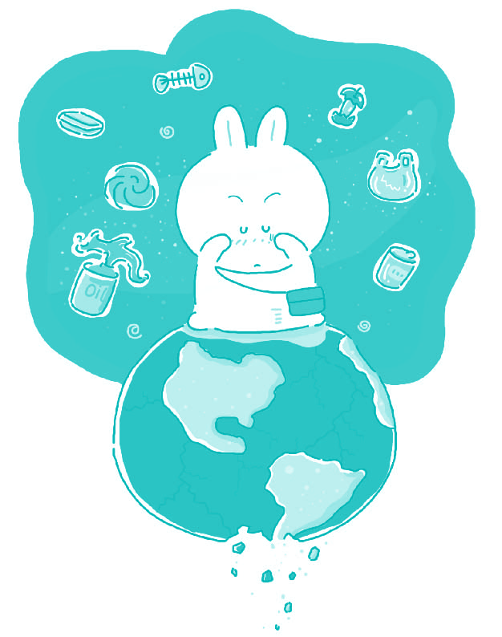

> ###  译文

> **29. 人类活动是改善还是破坏了地球？**

> 人们通常是改变环境来为生活带来好处。汽车和公路使运输轻松快捷，工厂生产的产品使我们的生活更加舒适，城市里的公共服务如供水、供电、废物处理使我们的生活更方便。可是所有这些进步都伴随着巨大的环境损失。人类活动确实严重地破坏了地球。

> 人类活动对地区造成的主要影响之一是对水资源的污染。将人类活动中的垃圾排放到河流中之所以十分普遍，是因为这些垃圾看上去到了下游就消失了。水污染的主要来源之一是工厂废物、石油、公路上的汽油和未经处理的人类垃圾。当这些废物倾入水中后，下游的河水就变得无法饮用，也无法用来灌溉，还会杀死河中的动植物。

> 清洁的空气和水不仅是人类生存的先决条件，也是地球上所有生命存在的先决条件。但是空气现在已经被现代交通所污染，特别是以汽油为动力的汽车。同样，燃烧化石燃料的发电厂也向空气中排放污染性的化学废物。这使空气呼吸起来更加不健康。空气所受的污染也会以酸雨的形式落回到地球上，它会杀死植物并破坏人类建筑。

> 空气污染带来的另一个长期严重影响就是全球变暖。在过去的几十年里，科学家们注意到地球的平均气温令人不安地升高，这是由空气中不断增加的温室气体导致的，它是燃烧化石燃料而产生的污染物。科学家们相信，如果人们继续增加空气中温室气体的数量，地球的气温将会继续上升。最后，这会融化两极的冰帽并导致全球性的沿海地区破坏性洪灾。像香港、上海、大连等大城市可能会被完全摧毁。

> 所以我认为人类的活动在改善我们生活的世界的同时也导致了严重的问题。现在是该在发展的同时认识到这种危险并采取行动阻止更大的灾难发生的时候了。

###  Word List

 * transportation ［ˌtrænspə:ˈteiʃən］ n. 运输，运送
 * disposal ［diˈspəuzəl］ n. 处理，处置，布置，安排
 * downstream ［ˈdaunstri:m］ adj. 下游的
 * dump ［dʌmp］ vt. 倾倒（垃圾），倾卸
 * fossil ［ˈfa:səl］ adj. 化石的
 * notably ［ˈnəutəbli］ adv. 显著地，特别地
 * prerequisite ［ˈpri:ˈrekwizit］ n. 先决条件
 * greenhouse ［ˈgri:nhaus］ n. 温室，花房
 * devastating ［ˈdevəsteitiŋ］ adj. 破坏性的，强有力的
 * hazard ［ˈhæzəd］ n. 危险，冒险的事

## 30. Do you like a new high school being built in your community?

The basic prerequisite of success for any community is the education of its citizens. Because the advantages of a high school education in my town are presently available to only a limited number of students every year, I wholeheartedly support the construction of a new school facility to serve our community.

The competition to get into high school in my town is fierce. There are three middle schools in town, but only one high school. Because the number of applicants to the single high school far exceeds the available spaces in the high school, only the richest and most qualified students are able to go to school. The skills taught in high school including advanced math, analysis, and high-level reading and writing are important to every citizen, no matter what profession they later choose. Even if they are manual laborers, the ability to critically analyze problems taught in high school will make them better and more highly skilled workers.

Beyond teaching practical skills to more local children, another high school will give children more opportunity to attend college. Holding a college degree is almost the only way a person can be assured of getting a stable, high paying job. Even a degree from a two or three year junior college can mean the ability to make a salary thousands of yuan annually higher than a high school diploma.

Because our current high school is so small, many bright children with promising college careers ahead of them have no way of even obtaining the high school diploma! We must make sure the road to higher education remains open for as many young people as possible.

Finally, if we cannot afford to open this high school, our town will have a serious problem with the number of unemployed youths who graduate from middle school with nothing to do. If they cannot find good jobs, they might be tempted to commit crimes, use drugs, or, if they are girls, engage in prostitution. Giving these children another option would both save them and help society.

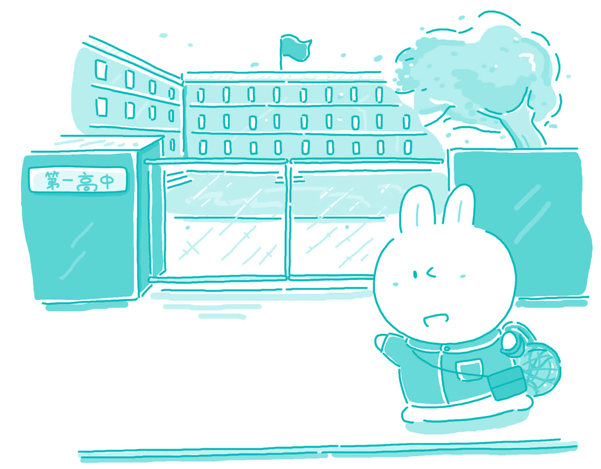

> ###  译文

> **30. 你赞成在你的社区建一所新的高中吗？**

> 任何社区取得成功的先决条件就是对其公民的教育。因为在我们镇里，高中教育的益处目前每年只有有限学生才能享受到，所以我完全支持建立新的学校设施为我们的社区服务。

> 在我们镇上进入高中的竞争很激烈。镇里有三所中学，但只有一所高中。因为申请上这所惟一的高中的人数远远超过该校所能容纳的学生数量，所以只有最富裕和成绩最好的学生才能上学。高中里教授的技巧包括高等数学、分析、高等阅读和写作，对任何公民来说，无论他以后选择什么行业，这些技巧都很重要。甚至假如他们是手工业工人，高中里教的批判地分析问题的能力也能使他们成为技术更高超的工人。

> 除了向更多的本地孩子传授实用技术，另一所高中还会给孩子们提供更多上大学的机会。持有大学文凭几乎是惟一能保证一个人得到一份稳定的高薪工作的办法。甚至两到三年的大专文凭也意味着能比高中文凭每年多挣几千元。

> 因为现在我们的高中太小了，所以很多聪明并有可能考上大学的孩子甚至都无法得到高中文凭！我们必须保证通向高等教育的路向尽可能多的孩子敞开着。

> 最后，如果我们花不起钱开办这所学校，我们镇将会有一个严重的问题，那就是大量初中毕业、没有工作的年轻人无事可做。如果他们找不到好的工作，他们就可能受诱惑去犯罪、吸毒，如果是女孩，还可能去卖淫。给这些孩子另外一个选择不仅会救了他们，而且也有益于社会。 

###  Word List

 * prerequisite ［ˈpri:ˈrekwizit］ n. 先决条件
 * wholeheartedly ［ˈhəulˈha:tidli］ adv. 全心全意地
 * facility ［fəˈsiliti］ n. 设备，工具
 * competition ［ka:mpiˈtiʃən］ n. 竞争，竞赛
 * applicant ［ˈæplikənt］ n. 申请者，请求者
 * exceed ［ikˈsi:d］ vt. 超越，胜过
 * qualified ［ˈkwa:lifaid］ adj. 有资格的
 * manual ［ˈmænjuəl］ adj. 手工的，体力的
 * diploma ［diˈpləumə］ n. 文凭，毕业证书
 * promising ［ˈpra:misiŋ］ adj. 有希望的，有前途的
 * unemployed ［ˌʌnemˈplɔid］ adj. 失业的
 * prostitution ［ˌpra:stiˈtu:ʃən］ n. 卖淫

## 31. Staying in one place or moving in search of another place?

While moving to a new place can be a traumatic experience, especially for children, I believe that in the end its benefits outweigh its drawbacks. Moving to a new place to live increases a person's understanding of the world, offers new challenges and opportunities, and does not preclude putting down deep roots at some point in the future.

One of the greatest benefits of traveling is learning about a new and different place. Traveling to a new place to live deepens and enriches the sense of newness and learning that a visitor might feel. A new place means a new, perhaps different job, and new and different friends. Learning the diverse viewpoints of a new place not only presents totally new information; it also casts a new light on old viewpoints. Often moving to a new place teaches people more about the place that they are from. Old, seemingly mundane foods, customs, and language are suddenly new again viewed in the context of a radically different environment. Through comparisons of old and new places, friends, and ideas, people become more knowledgeable about the world and about themselves.

A new place offers interesting possibilities for personal and professional development. Even though in a new place people lacks deep connections, they also lack prejudices and rivalries. Often people move to new places to escape uncomfortable situations that have hampered their personal growth. If I have a long-standing feud with my neighbor, I might eventually move to a new place to start over in peace. New places naturally have their own local politics, but learning about them and finding a way to prosper is like starting life with a clean slate. Every opportunity is available to newcomers to pursue because the local people do not have preconceived ideas about them.

Some people would say that truly settling down in one place and making deep and lasting connections is preferable to moving every few years. I say that true friendships can be maintained over distance, and that people will be happiest when they discover a place that is truly the best for them. How can people really know what place is best for them if they have only lived in one place and have no basis for comparison? Moving once, or even several times does not mean that a person can never settle down in one, but it does ensure that he/she truly like and understand the place that he/she does settle down in.

> ###  译文

> **31. 留守一地还是远走他方?**

> 虽然搬到一个新地方对人们尤其是小孩子来说会是一段痛苦难忘的经历，但我认为最终它还是利大于弊。搬到新地方居住能够增加对世界的理解，带来新的挑战和机遇，也并不妨碍将来在某地扎根。

> 旅行的最大好处之一就是可以对一个新的不同的地方有所了解。行至一个新地方居住深化丰富了游客可能感到的新奇与见识。新地方意味着全新的、可能是不同的工作和朋友。了解新地方的不同观念不仅展现了全新的情况，也对旧观点有所启发。经常搬到新的地方使人们对原来居住的地方会更加了解。在完全不同的环境下看来，旧的、似乎是普通的食品、习惯和语言突然间又一次变成了新的。通过对新旧地方、朋友和观念的比较，人们会加深对世界和自身的认识。

> 在个人和职业发展方面，新的地方提供了有趣的可能。尽管在新的地方一个人缺少深厚的关系，他们同样也不会有偏见和竞争。人们搬到新的地方经常是为了逃避阻碍他们个人成长的困境。如果我与我的邻居有夙仇，我最后很可能会搬到一个新的地方平静地重新开始。新的地方自然会有他们自己的地方政治，学习它们并找到成功的办法就像从清白的历史上重新开始生活一样。对于新来者每个机会都是可以去把握的，因为当地人对他们没有任何先入为主的看法。

> 有人会说真正在一个地方安顿下来并建立深厚持久的关系比没几年就搬一次家要好。我认为真正的友谊可以跨越距离，当人们发现一个地方真正最适合他们时他们才会最快乐。如果一个人只是住在一个地方而没有比较的根据，那他如何知道什么样的地方最适合他呢？搬一次或几次家并不意味着永远不在一个地方安顿下来，但这确实可以保证他或她安顿下来的地方是他或她真正喜欢并理解的地方。

###  Word List

 * traumatic ［trɔ:ˈmætik］ adj. 痛苦难忘的
 * knowledgeable ［ˈna:lidʒəbəl］ adj. 知识渊博的
 * outweigh ［autˈwei］ v. 在重量或价值等上超过
 * prejudice ［ˈpredʒədis］ n. 偏见，成见
 * preclude ［priˈklu:d］ n. 排除
 * hamper ［ˈhæmpə］ v. 妨碍，牵制
 * put down roots（人）扎根（某地）
 * prosper ［ˈpra:spə］ v. 成功，兴隆
 * cast a light on 使有新认识
 * clean slate 清白的历史
 * mundane ［ˈmʌndein］ adj. 世俗的，平凡的
 * feud ［fju:d］n. 不和， (部落或家族间的) 世仇
 * context ［ˈka:ntekst］ n. 上下文；背景
 * preconceived ［ˌpri:kənˈsi:vd］adj. 先入为主的
 * radically ［ˈrædikəli］ adv. 根本上

## 32. Spend your earned money immediately or save it for future?

My mom used to tell me:"You can only spend money once." What she meant is that if you spent money frivolously, you might really need it later and regret your earlier careless spending. After several years of managing a small amount of my own money, I have come to the conclusion that my mom was right, saving is better than spending.

No one knows what tomorrow will bring, the only thing we can do is to try to be prepared. When disaster strikes, perhaps a sudden illness in the family, having money on hand can mean the difference between life and death. When opportunity knocks, a surprise acceptance to a top university for instance, money is needed for tuition, board, and books. This is not to say that one should not spend any money because they have to prepare for every possible contingency. It simply means that one should not spend recklessly without having a substantial amount of money to guard against an unpredictable future.

The importance of saving money when young cannot be overstressed. This is because young people can tolerate higher-risk, higher return investments, and can let their investments mature longer, allowing interest on savings to compound. If invested well, $5,000 today could become $20,000 in 15 years. This concept is so powerful because the investor does not have to work for the money, the money works for the investor. Saving is not only a bulwark against an unpredictable future, it is also a way to generate future wealth.

At last, while it is true that spending money can be enjoyable, it is not the only way to have fun. The idea that we must always be consuming things in order to have a good time is a lie told to us by advertisers. These companies tell us that only when we drive the right car, wear the right clothes, and drink the right beverages will we be truly happy. In reality, each person determines the standard of his/her own happiness. For my part, I have decided that creating things, writing, painting, making music, is what truly makes me happy. The amount of money I need to spend doing these things is almost nothing, but the happiness they bring me is immeasurable. I would prefer to save money for unavoidable expenses and enjoy life by being a producer, not a consumer.

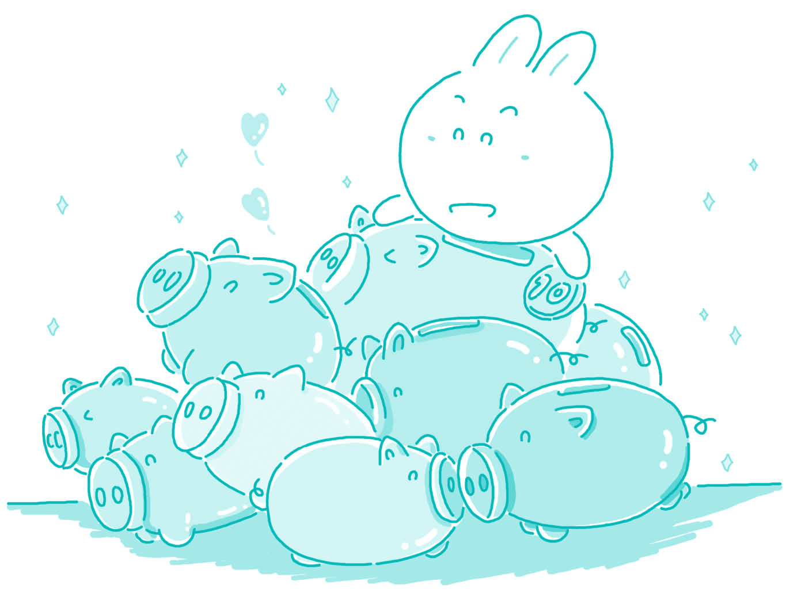

> ###  译文

> **32. 马上花掉挣来的钱好还是为将来攒钱好？**

> 我妈妈曾经告诉我：“你只能花一次钱。”她的意思是，如果你无节制地花钱，以后你可能会真正需要它，而且会为你先前随手花钱感到后悔。管理了几年我自己的一小笔钱后，我得出结论：妈妈的话没错，存钱要比花钱好。

> 没人知道明天会发生什么，我们惟一能做的事就是试着做好准备。当灾难来临时，例如是家人一场突然的大病，有钱在手可能就意味着生存与死亡之间的差别。当机会来敲门时，例如意外地被一所顶级的大学所录取，就需要钱来支付学费、伙食费和书本费。这并不是说因为人要准备应对未来的意外事件而一点钱都不花。这仅仅意味着一个人不该鲁莽地花钱而不留下一笔数量充足的钱来绸缪不可预知的未来。

> 在年轻时存钱的重要性怎么强调都不过分。这是因为年轻人可以承担高风险、高回报的投资，并且可以让他们的投资期限更长，使他们的利息能以复利计算。如果投资合理，今天的5000美元15年后就可以变成2万美元。这个概念如此有力是因为投资者无需为钱去工作，而是钱为投资者工作。存钱不仅是预防不可知的未来的防波堤，而且是财富增值的一种办法。

> 最后，尽管花钱确实会很有乐趣，但那不是惟一取乐的方法。我们必须一直消费来获得快乐时光的观点是广告商对我们撒的谎。这些公司告诉我们，只有我们开上够派头的汽车、穿上够靓丽的衣服、喝上够档次的饮料才是真正的快乐。实际上，每个人都可以定义她或他自己的快乐标准。对我来说，我觉得制作东西、写作、画画、创作音乐是真正使我高兴的东西。做这些事我需要的花费很少但是它们带来的快乐却是不可估量的。我喜欢为不可避免的花费攒钱并作为一个制造者而不是消费者来享受生活。 

###  Word List

 * frivolously ［ˈfrivələsli］ adv. 轻浮地，愚昧地
 * tuition ［tu:ˈiʃən］ n. 学费
 * board ［bɔ:d］ n. 膳食费用
 * recklessly ［ˈreklisli］ adv. 鲁莽地，不顾一切地
 * substantial ［səbˈstænʃəl］ adj. 坚固的，充实的
 * bulwark ［ˈbulwək］ n. 壁垒，防波堤
 * immeasurable ［iˈmeʒərəbl］ adj. 不可估量的
 * compound ［ˈka:mpaund］ v. 以复利计算
 * mature ［məˈtuə］ vi. 到期

## 33. How to deal with a gift of money?

It seems not a difficult decision for me. But if I was given the gift of money in different time, I would have different answers.

If I was given the money when I was in my high school, I would buy a ticket to a concert. I had been longing for attending concerts of famous artists to enjoy those transcendent pieces such as saxophone of Kenny G. , rock and roll of Cuijian, and romantic songs of Luo Dayou. Unfortunately I just was not able to afford those exorbitant prices. The given amount should be better if it is enough for several tickets so that I could take along my best friends, whose situations were much similar to mine.

If I was given the money when I was in the university, I would buy a fine piece of jewelry, and give it to my girl friend as a casual present, for we might enjoy a certain concert, but hardly could it be permanently impressive. Memories are always not reliable. We tend to simply forget anything— at best, memories are somewhat distorted—if time past long enough. But if I bought my girl friend a piece of jewelry, not costly though it might be, it would be a perfect reminder, being never changed.

If I was given the money recently, it would only make me feel funny. I don't want to go to concerts anymore, because I became more and more reluctant to present in crowd public places, and besides, I have bought a super Hi-Fi which always brings me identical pleasure. And I don't want to buy any jewelry either, for it is meaningless for a man who is now solitary. Nevertheless, if I was forced to accept some money as a gift—it hardly happens—I might buy some books, after all, reading always makes me relaxed and amazed.

> ###  译文

> **33. 如何处理作为礼物的一笔钱？**

> 这对我来说似乎不是个困难的决定。但是假如有人在不同的时间送钱给我做礼物，我会有不同的答案。

> 如果我上高中的时候有人送给我钱，我将会去买一张音乐会的票。我一直渴望去听一场著名音乐家的音乐会，去欣赏那些杰出的曲目，比如肯尼基的萨克斯管、崔健的摇滚、罗大佑的浪漫歌曲。不幸的是我负担不起那昂贵的票价。赠送的钱数如果能买得起几张票那就更好了，这样我就可以带着我最好的朋友们去，他们的情况和我的类似。

> 如果我上大学的时候有人送给我钱，我会买一件漂亮的珠宝首饰，然后把它作为一件普通的礼物送给我的女友，因为我们可以一起欣赏一场音乐会，但是这不太可能留下永久的印象。记忆不总是可靠的。我们倾向于忘掉任何事——起码记忆会有些扭曲——如果经过的时间很长的话。但是，如果我给我的女友买一件珠宝首饰，尽管它不是很贵，但它将是个永远的回忆，永远都不会变。

> 如果最近送给我钱，那只会让我觉得滑稽。我再也不想去听音乐会了，因为我越来越不愿意去那些拥挤的公众场所，此外，我已经买了一套非常棒的立体声音响，可以一直带给我同等的快乐。我也不想买任何的珠宝了，因为这对一个现在单身的男人来说毫无意义。然而，如果我被迫接受一些钱作为礼物——那几乎不会发生——我可能会买些书，毕竟读书总是能让我放松和感到惊叹。

###  Word List

 * longing for 渴望
 * transcendent ［trænˈsendənt］ adj. 卓越的，出众的
 * saxophone ［ˈsæksəˌfəun］ n.萨克斯管（铜管类乐器）
 * exorbitant price 过高的价格
 * reliable ［riˈlaiəbəl］ adj. 可靠的，可信赖的
 * at best 至多
 * identical ［aiˈdentikəl］ adj. 同一的，同样的
 * solitary ［ˈsa:litəri］ adj. 孤独的，单身的

## 34. Should businesses hire employees for their entire lives?

The decision to hire an employee for life is a serious commitment on the part of both parties. For the employee, such an arrangement means lifetime job security. From the perspective of an employer, however, the deal is not so sweet. Guaranteed lifetime employment, or tenure, at a company, can promote bad work habits, prevent innovation, and lead to potentially disastrous personnel problems.

When a workers' employment is contingent upon their job performance, they will tend to work diligently. On the other hand, if workers know that no matter how hard they work, they will receive the same amount of money and have no chance of being fired, there are no incentives for them to work. For people to be model workers they need compelling reasons to work hard and produce work of the highest quality. A tenure-system promotes laziness, inefficiency and lowquality work because it fails to offer incentives for good work, and fails to offer compelling deterrents against bad work.

Secondly, companies that offer lifetime positions to employees cannot adapt to a rapidly changing world. For instance, if an employee who was hired by a company twenty years ago might be too old to effectively learn new computer

related skills. In today’s modern office environment, companies that cannot make effective use of new technology are at a severe disadvantage to those that can. In this case, a company that does not have the freedom to restructure, hiring and firing employees, in accordance with shifting demands is likely to fail. A company that provides its employees with tenure effectively locks out new blood and runs the risk of being paralyzed by a staff unable to change with the times.

Finally, offering tenure to employees is a major risk because of unforeseeable personnel problems. Every office, no matter how well managed, is bound to have personality conflicts. In many cases, personality conflicts can lead to one of the feuding parties leaving the company. But if the conflict involves two tenured employees, the business might be seriously affected, even destroyed. Despite the uncertainty it brings to workers lives, the company must look out for its own best interests first and not allow this disastrous situation to occur by not instituting a tenure policy.

> ###  译文

> **34. 公司应该终生雇用职员吗？**

> 终生雇用一名雇员的决定对双方来说都是一项严肃的承诺。对于雇员来说，这样的安排意味着终生的工作保障。然而从雇主的角度来看，这笔买卖就不那么美好了。在一家公司里保证终生雇用或任职会助长坏的工作习惯、阻碍革新并导致人事方面潜在的灾难性问题。

> 当对一位工人的雇用是暂时的并取决于他们的工作表现时，他们倾向于努力工作。相反，如果工人知道无论他们工作得多努力，他们都会得到相同数量的钱且不会遭解雇时，他们就不会有工作的积极性。要是想成为模范工人，他们就需要有强迫性的理由去努力工作并最高质量地完成工作。终身制系统助长懒惰、低效和低质量工作，这是因为它没有提供做好工作的动力，也没有提供对工作不力的强制性震慑。

> 第二，那些向员工提供终身职位的公司无法适应飞速变化的世界。比方说，如果一位员工20年前就受雇于一家公司，那他就可能太老了以至于无法高效地学习与计算机相关的技能。在今天的现代办公环境下，无法有效运用新科技的公司与那些能利用的公司相比处于严重劣势。在这种情况下，一家无法自由重组并根据不断变化的需求雇用或解雇员工的公司将会失败。向员工提供终身职位的公司实际上将会阻止新血液的进入，并有因员工无法与时俱进而陷于瘫痪的危险。

> 最后，向员工提供终身职位是一项很大的冒险，因为这会出现无法预知的人事问题。每一个办公室，无论管理得多好，都会有人员方面的冲突。在很多情况下，人员之间的冲突可能导致敌对的一方离开公司。但是如果冲突涉及两位拥有终身职位的雇员，那么业务可能就会受到严重影响，甚至遭到破坏。尽管会给工人的生活带来不确定的因素，公司还是应该把追求自己的最大利益放在首位，通过不设立终身职位政策来阻止以上提及的灾难性情况的发生。

###  Word List

 * commitment ［kəˈmitmənt］n. 委托事项，承担义务
 * compelling ［kəmˈpeliŋ］ adj. 强制的，强迫的
 * perspective ［pəˈspektiv］n. 远景，前途，观点，看法
 * laziness ［ˈleizinis］ n. 怠惰, 无精打采
 * tenure ［ˈtenjə］ n. 终身任职权
 * promote ［prəˈməut］ vt. 促进
 * deterrent ［diˈterənt］ n. 威慑
 * contingent ［kənˈtindʒənt］adj. 暂时的
 * adapt to 适应
 * paralyze ［ˈpærəˌlaiz］ vt. 使瘫痪，使麻痹
 * diligently ［ˈdilədʒəntli］adv. 勤勉地，坚持不懈地
 * disastrous ［diˈzæstrəs］ adj. 损失惨重的

## 35. Live performance or television broadcast,which is more enjoyable?

While watching live performances on television is convenient, it cannot compare to attending a live performance in person. Live performances, whether artistic, sporting, or entertainment, offer unique sensations apart from the performance itself, and encourage a greater level of participation as well as a better understanding of the event than a television broadcast could.

The wonderful sensory experience of a soccer match begins before the game starts. The smell of popcorn and street food wafting through the air, the crowd roaring and waving like an ocean, and the excited songs of the fans are all part of the experience that adds to the enjoyment of watching the game in person. A rock concert is not just hearing the music; it is the feeling of standing in a crowd that is moving together like one living body to the beat of the drums. These experiences are all important parts of the experience of an event, and cannot be felt when watching the same event on television.

When watching a performance in person, a viewer feels a closer sense of connection to the event. Every fan in the stadium will always leap to their feet when they see their favorite team score a goal in a soccer match, while only a few people might jump up watching the same goal at home. Watching a music performance on television wouldn't necessarily make people want to start dancing, but hearing a jazz band play live would start every foot in the room tapping, just itching to dance. Live events seem to invite the active participation of the viewing audience, while television is a medium that encourages passivity on the part of the viewer.

The understanding of a performance viewed on television is usually limited. A rock performance viewed live has ear-shatteringly loud music. While some people might not enjoy this, it is a part of the experience that television filters out. At any given time during a sporting event there are many different things going on at once. Because television cameras can only focus on one event at a time, a live viewer can take in a larger field of vision, and potentially understand more about the events. Finally, live viewers' understanding of live performances is increased because live performances are not interrupted with commercial breaks every 12 minutes.

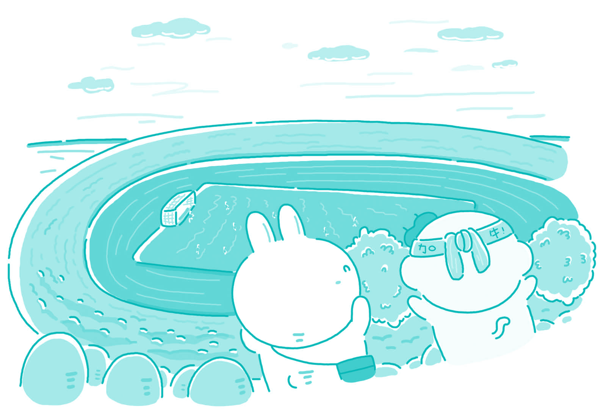

> ###  译文

> **35. 现场表演和电视转播哪个更精彩？**

> 尽管在电视上看现场表演十分方便，但这与亲临现场观看演出还是无法相比。无论是艺术表演、体育比赛还是娱乐演出，现场表演相对电视转播，除了展现表演本身独一无二的气氛外，还能激发观众更深入的参与并使其加深对该表演的了解。

> 一场足球比赛精彩的感官经历在比赛之前就已经开始了。空气中飘荡着爆米花和街头食品的味道，人群呼喊着、起伏着，像海洋一样，还有球迷们兴奋的歌声都是只有亲临现场观看比赛才能体会到的欢乐。摇滚音乐会并不仅仅是听音乐，它是一种在人群中随着鼓点大家整齐划一一起移动的感觉。这些经历全是现场表演中的重要组成部分，是看电视转播所无法感受到的。

> 当现场看一场表演时，观看者感觉到演出与他们更接近。足球比赛中，体育场里的每一个球迷在看到他们心爱的球队得分时都会从椅子上跳起来，可是在家里看到同一个进球的人却很少会跳起来。看电视里的音乐表演未必会让观众想跳舞，但是现场听爵士乐队的演奏却会使在场的每个人都脚打节拍、心痒得想跳舞。现场演出似乎在邀请现场观众主动参与，而电视则是一种鼓励观众被动享受的媒体。

> 看电视时对演出的理解通常都是有限的。现场的摇滚演出有震耳欲聋的音乐。可能有的人会享受不到这些，这是电视过滤掉的东西。在体育比赛中的任何时间都可能有很多事情同时发生。因为电视摄像机一次只能聚焦于一个事件，而现场观看者可以有更宽的视野，从而可能更多地理解比赛。最后，现场观众能更多地理解比赛是因为不会每12分钟就被商业广告打断。

###  Word List

 * live ［laiv］ adj. 现场的，实况的
 * unique ［ju:ˈni:k］ adj. 惟一的，独特的
 * participation ［pa:ˌtisəˈpeiʃən］ n. 分享，参与
 * popcorn ［ˈpa:pkɔ:n］ n. 爆米花
 * itch ［itʃ］ vi. 痒，渴望
 * ear-shattering ［ˈiəˌʃætəriŋ］ adj. 震耳欲聋的
 * filter ［ˈfiltə］ vi. 滤过，用过滤法除去
 * commercial ［kəˈmə:ʃəl］ n. 商业广告

## 36. A transportation vehicle that has changed people's lives

Automobiles, as the exponent of modern transportation vehicles, virtually have contributed to modern life more than most people have imagined, even though automobiles, as is true of all other technologies, have also created many problems.

The advancement of modern transportation, certainly including that of automobiles, has made more goods available in local markets. For example, in China, some fruits are only cultivated in the southern part of the country and not in the northern, such as litchi, sugarcane, pineapple—partly due to sheer gradient of temperature. Thanks to the advancement of modern transportation system, people in the northern part of the country can now get those southern cultivated fruits readily available in almost every local market. In the far past when such system didn't exist, when goods could be transported only by primitive tools such as carts, some fruits such as litchi were the privilege of imperial household.

At the same time, the development of modern transportation has also made goods in local markets much less expensive. Take litchi for example again. Two decades ago, litchi was pretty expensive, and was a luxury. But the development has made the transportation easier and the cost lower and lower. On the other hand, due to previous factors, more merchants are engaged in the business that simultaneously intensified the competition, which certainly affected the prices.

Thus, the price of litchi subsequently dropped. The same goes for other goods as well. Today, people are able to buy almost any goods they want no matter where the origin of the goods is, and to make choice among more counterparts, and the best of all, to take the goods home with less expenditure.

Moreover, advanced transportation vehicles such as automobiles have to some extent made people more independent than before. It is not hard to imagine that 50 years ago a young widow who lived in a small village and whose husband had died when she was 23 had little chance to get married again, for the sake of the tradition or culture, or whatever. But if that happened in the present day, things would be entirely different. Advanced transportation vehicles being readily available, she could easily get to another city within at most 2 days and by lower expenses, say from the small village located in the north east of China to the far southern city, Guangzhou—several thousands of miles away. That's a big city, that's a new city, and nobody knows her there; she has a brand new start, and she is entirely independent.

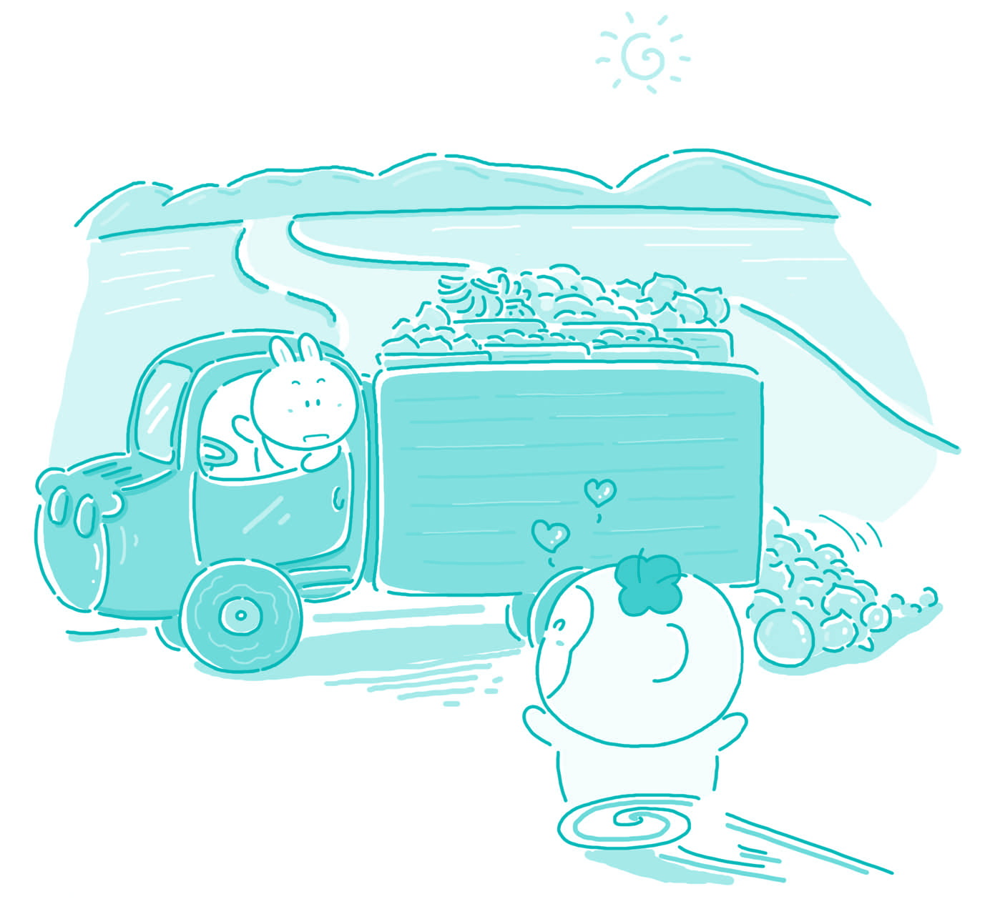

> ###  译文

> **36. 改变人类生活的一种交通工具**

> 汽车，作为现代交通工具的代表，对现代生活的贡献远比大多数人能想象到的多。尽管汽车，像其他技术一样，也都带来了一些问题。

> 现代交通的进步，当然包括汽车，使地方市场里有更多的商品可供出售。例如在中国，很多水果只在南方种植而北方没有，像荔枝、甘蔗、菠萝——大部分是因为气温的强烈变化。幸亏有了现代交通系统的进步，在北方几乎所有的地方市场都随时拥有南方出产的水果以供销售。很久以前没有这种系统，货物只能通过原始的工具例如大车等来运输，像荔枝这些水果就只能是皇家的特别待遇。

> 同时，现代交通的进步也使地方市场里的货物变得更便宜。再次举荔枝作为例子。20年前，荔枝相当贵，而且是一种奢侈品。但是发展使运输变得更简单，花费也越来越低。另一方面，出于前面的原因，更多的商贩同时投身于此行业加剧了竞争，当然也影响了价格。结果，荔枝的价格降了下来。其他的货物也出现了同样的情况。今天，人们几乎可以买到任何他们想要的东西，无论产地是哪里，还可以在更多的竞争者中间挑选，可以更便宜地把东西买回家。

###  Word List

 * exponent ［ekˈspəunənt］ n. 代表者，典型
 * sugarcane ［ˈʃugəkein］ n. 甘蔗，糖蔗
 * gradient ［ˈgreidiənt］ adj. 倾斜的
 * cultivated ［ˈkʌltəˌveitid］ v. 耕耘，栽植
 * previous ［ˈpri:viəs］ adj. 在前的，早先的
 * subsequently ［ˈsʌbsiˌkwəntli］ adv. 后来，随后
 * counterpart ［ˈkauntəpa:t］ n. 对应物 

## 37. Is progress always good?

Progress can be measured in many ways, but one very tangible way to measure progress is by looking at economic development. In these terms, progress can be seen as a very positive force, helping many people rise up from poverty. But history shows that progress, even as measured by economic progress, always has its cost.

Take Germany in the 1930's for example. Humiliated by unequal treaties after World War I, the German people were suffering from a terrible economy and massive inflation. Then Hitler took power and mobilized the German economy, in several years the Germans economy had recovered and was actually becoming among the most powerful in Europe. But Hitler's economic miracle came at a terrible price. His plan was to use Germany's economic power to finance its military power. Germany's aggression sparked World War II, a catastrophe that killed tens of millions of people all over the whole world, including countless millions of civilians. When progress serves evil, the result hurts.

Likewise the progress of America, arguably the most advanced of all nations, has come at a heavy price. America used to be the land of native Americans. America's current"progress" would probably not have been achieved if most of the land in America still belonged to the Native Americans. From their perspective, America's current progress is their profound loss.

Finally, China's economic growth over the past 25 years has been truly remarkable. Standards of living have gone up dramatically, but the progress has negative aspects as well as the obvious positive ones. As income gaps between the rich and the poor widen, social problems like crime and poverty become more pronounced. The damage done to the environment by factories and "progressive" human activity might not be undone for hundreds of years, affecting the lives of Chinese people for generations to come. If these problems are not addressed, our grandchildren might truly come to regret current alleged "progress."

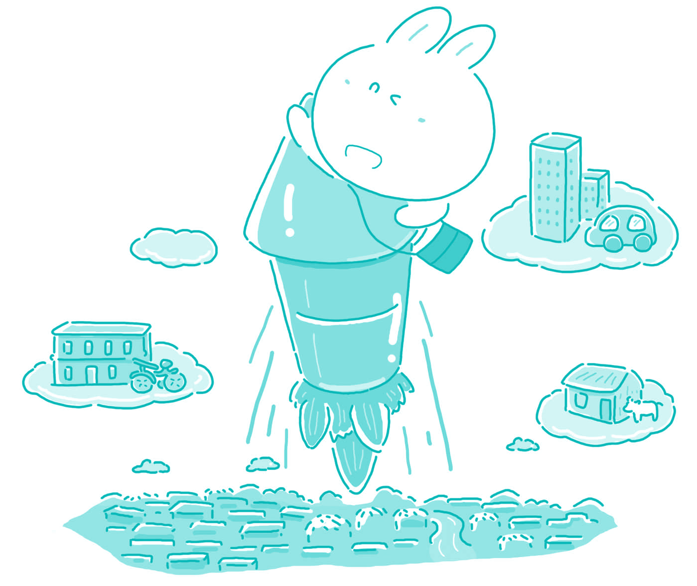

> ###  译文

> **37. 进步总是好事吗？**

> 进步可以从很多方面来衡量，其中衡量进步的一个切实方法就是看经济发展情况。在这方面来看，进步可以看作是一种非常积极的力量，帮助很多人从贫困中摆脱出来。但是历史显示，即使以经济发展来衡量进步也总是有其代价的。

> 以1930年的德国为例。在一战后不平等条约的耻辱中，德国人备受糟糕的经济状况和严重通货膨胀的折磨。然后希特勒掌权并动员发展德国经济，几年内德国的经济就得到了恢复并实际上跻身于欧洲最强的几个国家之列。但是希特勒的经济奇迹代价是骇人的。他的计划是用德国的经济力量来支援其军事力量。德国的侵略引发了二战，这场灾难在全世界范围内杀死了几千万人，其中包括数不清的平民。当进步为邪恶服务时，结果就是伤害。

> 同样地，美国的进步，可以说是所有国家中最巨大的，但也是代价惨重的。美国曾经是美洲土著人的领土。如果大多数美国领土仍然属于美洲土著人，那美国现在的“进步”可能就不会实现。从土著人的立场来看，美国现在的进步是他们重大的损失。

###  Word List

 * tangible ［ˈtændʒəbəl］ adj. 切实的，可以触摸到的
 * humiliate ［hjuˈmiliˌeit］ v. 羞辱，使丢脸，耻辱
 * massive ［ˈmæsiv］ adj. 厚重的，大块的
 * inflation ［inˈfleiʃən］ n. 通货膨胀，(物价) 暴涨
 * mobilize ［ ˈməubəˌlaiz］ v. 动员
 * military ［ ˈmiliˌteri］ adj. 军事的，军用的
 * catastrophe ［kəˈtæstrəfi］ n. 大灾难，大祸
 * aggression ［əˈgreʃən］ n. 进攻，侵略
 * spark ［spa:k］ vt. 发动
 * perspective ［pəˈspektiv］ n. 观点， 看法
 * alleged ［əˈledʒd］ adj. 声称的，所谓的

## 38. Does history have any value for people living in the present?

People live in the present. They plan for and worry about the future. History, however, is the study of the past. Some people might ask,"Given all the demands that press in from living in the present and anticipating what is yet to come, why bother with what has been? Given all the desirable and available branches of knowledge, why insist—as most American educational programs do—on a good bit of history? And why urge many students to study even more history than they are required to?" However, it's undeniable that learning about past has its value, it will help us understand people and societies, and it will help us understand change and how the society we live in came to be.

History helps us understand people and societies. In the first place, history offers a storehouse of information about how people and societies behave. Understanding the operations of people and societies is difficult, though a number of disciplines make the attempt. An exclusive reliance on current data would needlessly handicap our efforts. For example, how can we evaluate war if the nation is at peace—unless we use historical materials? How can we understand genius, the influence of technological innovation, or the role that beliefs play in shaping family life, if we don't use what we know about experiences in the past? Consequently, history must serve, however imperfectly, as our laboratory, and data from the past must serve as our most vital evidence in the unavoidable quest to figure out why our complex species behaves as it does in societal settings. This, fundamentally, is why we cannot stay away from history: it offers the only extensive evidential base for the contemplation and analysis of how societies function, and people need to have some sense of how societies function simply to run their own lives.

History also helps us understand change and how the society we live in came to be. The second reason history is inescapable as a subject of serious study follows closely on the first. The past causes the present, and so the future. Any time we try to know why something happened—whether a shift in political party dominance in the American Congress, a major change in the teenage suicide rate, or a war in the Balkans or the Middle East—we have to look for factors that took shape earlier. Sometimes fairly recent history will suffice to explain a major development, but we often need to look further back to identify the causes of change. Only through studying history can we grasp how things change; only through history can we begin to comprehend the factors that cause change; and only through history can we understand what elements of an institution or a society persist despite change.

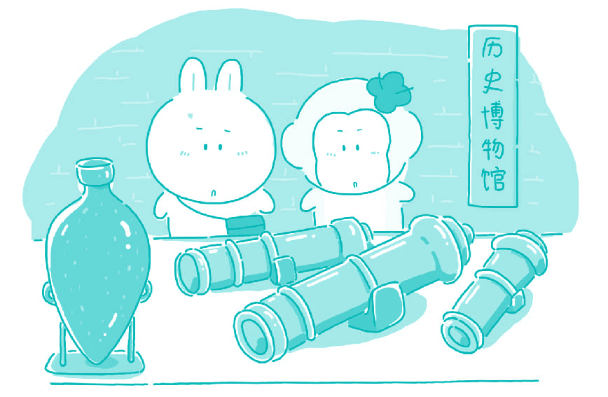

> ###  译文

> **38. 历史对现代人有价值吗？**

> 人们生活在现在。他们计划并担心着未来。然而，历史是对过去的研究。有些人可能会问：“目前生活和将来的预期有太多的需求压力，为什么还要管已经发生过的事呢？想要的和已有的知识有太多分支，为什么还要像大多数美国教育项目那样坚持要学那么多历史呢？为什么要敦促很多学生学习比课程要求还要多的历史呢？”然而，不可否认学习过去的东西有它的价值，它将帮助我们理解人类和社会，它将帮助我们理解变化和我们生活的社会是怎样形成的。

> 历史帮助我们理解人类和社会。首先，历史提供了数额庞大的有关人类和社会行为的信息。尽管一些学科做出了努力，但理解人类和社会的运作是困难的。单纯依靠现有的资料将会阻碍我们的努力。例如，国家在和平时期时我们如何去评估战争——如果不用历史材料的话？如果不使用过去已知的经验我们如何去理解天才人物、技术革新的影响或信仰在塑造家庭生活中的作用？因此，历史无论多么不完美都必须充当我们的实验室，过去的数据也必须充当我们探求为什么复杂的个体会在社会情况下有如此行为的重要证据。从根本上来说，这一点就是为什么我们不能抛开历史的原因：这为思考和分析社会的功用提供了惟一广泛的可作为证据的基础。人们需要知道一些有关社会如何运作的知识以进行自己的生活。

###  Word List

 * anticipate ［ænˈtisəˌpeit］ v. 预见，预料
 * innovation ［ˌinəˈveiʃən］ n. 改革，创新
 * undeniable［ˌʌndiˈnaiəbəl］adj.不可否认的
 * consequently ［ˈka:nsiˌkwentli］adv. 从而，因此
 * discipline ［ˈdisəplin］ n. 纪律，学科
 * settings ［ˈsetiŋs］ n. 设置
 * handicap ［ˈhændiˌkæp］v. 妨碍，使不利，阻碍
 * contemplation ［ˌka:ntəmˈpleiʃən］ n. 沉思
 * comprehend［ˌka:mpriˈhend］vt.领会，理解
 * genius ［ˈdʒi:njəs］n. 天才，天赋，天才人物
 * persist ［pəˈsist］ vi. 坚持，持续

## 39. Technology, students' helper or not?

It is undeniable that continuously developing technologies have brought tremendous benefits, especially in learning area. Learning has in many ways become easier than has ever been before. Take learning English for example. In the past, few students owned tape recorders, and learning materials were scarce as well. But today, tape recorders get more and more inexpensive, and diversified learning materials are readily available. On the other hand, new devices, such as MP3 or MD players, are offered in market, and relevant learning materials(MP3 files) are easily and freely downloadable from the Internet.

However, it is a little bit haste to assert students can learn more information and learn it more quickly simply because technology helps, since technologies, as always, contribute both benefits and detriments. For example, computers, as have been mentioned, help students a lot in various ways, but at the same time have many negative even harmful impacts on the users. Most students nowadays play computer games, sitting before the table, staring at the screen, clicking mouse button, and the outcomes are cerebrum fatigue, visual deterioration and another day of waste. Chatting on the Internet is another great way to kill precious time, and one of negative side-effects of key-board dependence is that students nowadays can seldom spell correctly. Worst of all, investigations have shown that more than half of time that students have spent online was exhausted on browsing porn movies, pulp fictions or erotic photos and so on.

Students certainly want to learn more and to learn more quickly. But merely technology itself is not the solution. Learning itself is a skill and it only develops by practice. Computers and other devices can certainly help, but they won't make study any less painful, and technologies in fact provide no solution to overcome indolence that everyone has. Learning has never been easy, and will not be easier merely because of technologies. It always requires tremendous efforts and determination to learn something well. Too much advocacy on the fancy benefits of technologies will mislead much more than virtually help.

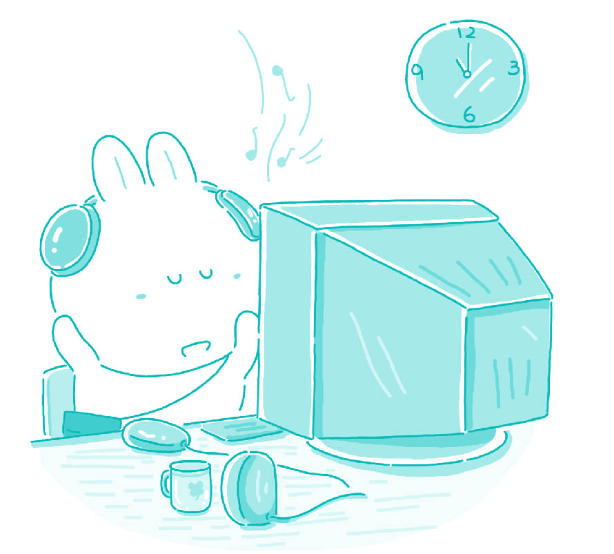

> ###  译文

> **39. 技术是学生的帮手吗？**

> 不可否认，不断发展的技术带来了巨大的好处，尤其是在学习领域。学习在很多方面变得比以前更容易。以学习英语为例。过去，很少有学生拥有卡带式录音机，而且学习材料也同样缺少。而今天，卡带式录音机越来越便宜，种类多样的学习材料随手可得。另一方面，市场上出现了一些新的器材，如MP3和MD机，而相应的学习材料（MP3文件） 很容易就可以从互联网上免费下载。

> 然而，宣称仅仅依靠技术的帮助就可以使学生学到更多信息和学得更快有点过于匆忙。因为技术像以往一样，不仅提供便利，也产生危害。例如电脑，像前面提到的一样，在很多方面对学生帮助不小，但是同时对使用者有一些负面甚至有害的影响。今天的大多数学生都玩电脑游戏，坐在桌前盯着屏幕并敲击着鼠标，结果就是大脑疲惫、视力减退又浪费了一天的时间。在互联网上聊天是另一种消耗宝贵时间的事情，另一种键盘依赖的负面影响是学生几乎无法正确拼写。最糟的是，调查显示学生们上网的一半多的时间消耗在看色情电影、淫秽书籍以及色情图片上。

> 学生们当然想学得更多并学得更快。但是单靠技术并不能解决问题。学习本身是一门技巧，并且只能靠练习来取得进步。计算机和其他器材当然有帮助，但是它们不会使学习变得更加好受，技术实际上并不能提供一种方法来克服每个人都有的懒惰。学习从来都不简单，也不会因技术变得更简单。要想学好某事总是需要巨大的努力和决心。过多地提倡技术带来的虚幻的好处将会误导而不是确实有所助益。

###  Word List

 * undeniable ［ˌʌndiˈnaiəbəl］ adj. 不可否认的
 * fatigue ［fəˈti:g］ n. 疲乏，疲劳
 * deprivation ［ˌdeprəˈveiʃən］ n. 剥夺
 * diversified ［daiˈvə:səfaid］ adj. 多变化的，各种的
 * browse ［brauz］ v. 浏览
 * porn［pɔ:n］ n. (=pornography)色情文学，色情描写
 * downloadable ［ˌdaunˈləudəbəl］ adj. 可下载的
 * pulp ［pʌlp］ adj. 低级的
 * detriment ［ˈdetrəmənt］ n. 损害，损害物
 * erotic ［iˈra:tik］ adj. 性爱的，性欲的，色情的
 * impact ［ˈimˌpækt］ n. 影响，效果
 * click ［klik］ v. 发出滴答声，敲击
 * solution ［səˈlu:ʃən］ n. 解答，解决办法
 * cerebrum ［ˈserəbrəm］ n. 大脑

## 40. Do we need 'Never, never give up'?

Near the end of the Second World War, Churchill delivered his most famous and the shortest speech: Never, Never Give Up. The British and people in many other countries were tremendously encouraged, and finally went through the hardest period in human history.

"Never give up" represents a strong and positive life attitude. Some people are ready to quit when they feel they cannot endure the difficulties of some work or they think they cannot find a way to finish the required task. Such people usually become upset and disappointed and lose their self-confidence, although they virtually can do every thing well simply by trying once more. In cases such as acquiring second language, most people failed simply because they had given up. Acquiring second language might be the easiest task among diverse academic curriculums, because one can be successful only by plain repetition, though it is painstaking and time-consuming.

Never give up. Such strong belief often gives us the second chance. The fact that we failed somewhere does not mean we are going to fail everywhere, and especially it does not necessarily mean that we are deprived of opportunities to win there. There probably is a second chance. Many successful people did fail before. Yu Minhong, the founder of New Oriental School, was able to study in Peking University only after three attempts. He wasn't reckoned as successful after graduation, among many signs is the fact that almost all his classmates went abroad while he was each and every time refused by officials in visa-granting office for unexplained reasons. Yet he never gave up, which makes his later success inevitable.

Psychology teaches us that we do get what we want, if we know exactly what we want and want the right thing. First of all, we must make sure that our clearly defined goals are achievable, and that our carefully designed means are practicable. A superficial claim like I wanna be a millionaire brings nothing. And an unrealistic goal like inventing a perpetual motion machine is absolutely meaningless. But if we want to acquire a second language, it is both realistic and meaningful. By careful planning, and relevant persistence we have no reason to fail. And numerous examples tell us that even if the methods are problematic, many still finally attain great achievements. Therefore, in most cases, the belief"Never, never give up" is really something that we should always bear in mind.

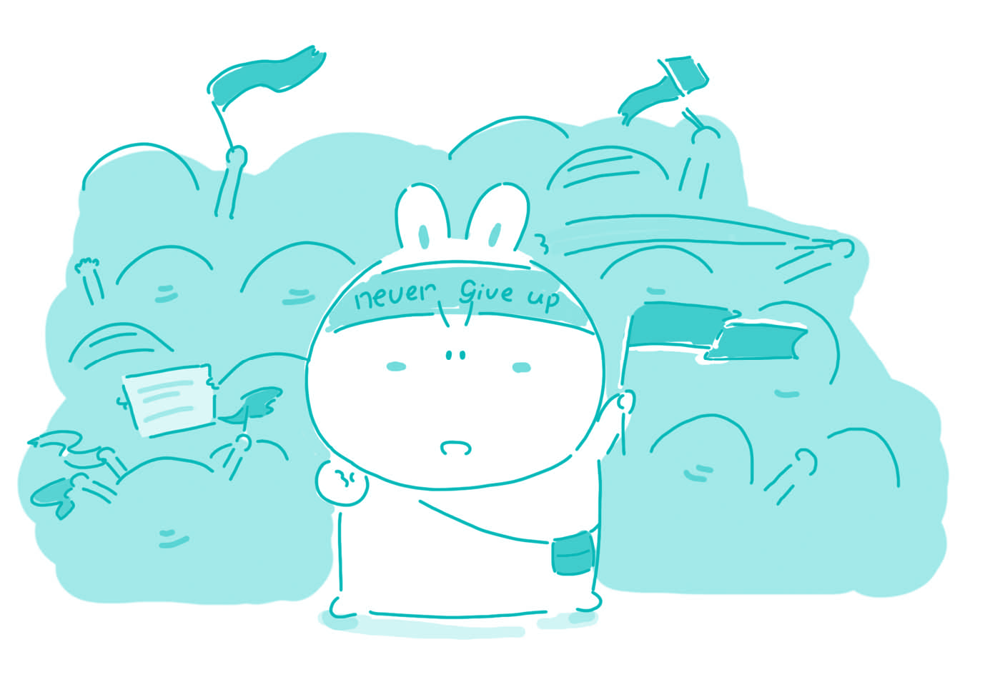

> ###  译文

> **40. 我们是否需要“永不，永不放弃”？**

> 接近二战结束时，丘吉尔发表了他最著名也是最简短的演讲：永不，永不放弃。英国和很多其他国家的人民受到了巨大的鼓舞，并最后度过了人类历史上最艰难的时期。

> 永不放弃，代表了坚强和积极的生活态度。有些人觉得自己无法忍受某些工作中的困难或认为自己找不到完成任务的方法时很快就退却了。这种人通常会变得沮丧和失望并失去自信心，尽管实际上他们只需再试一次就可以做好每一件事。在学习第二语言的例子中，大多数人失败仅仅是因为放弃了。学习第二语言在各种学术课程中可以算是最简单的任务了，因为尽管很痛苦并且很费时间，可是你只需简单重复就可以学成。

> 永不放弃。如此强烈的信念常会给我们第二次机会。我们在某处失败的事实并不意味着我们在所有的地方都会失败，尤其它并不一定意味着我们被剥夺了在那里获取胜利的机会，那里还有第二次机会。很多成功的人确实以前都失败过。俞敏洪，新东方学校的创始人，经过了3次尝试才能就读于北京大学。他毕业后并不被认为是成功的，因为几乎他的全部同学都出国了，而他却被签证处的官员以莫名其妙的原因一次又一次地拒绝了。然而他永不放弃，这使他日后的成功成为了必然。

> 心理学告诉我们如果我们确切地知道想要什么且要的是正确的东西，那我们就会得到它。首先我们必须确定我们清楚认定的目标是可以达到的，而且我们仔细设计的方法是切实可行的。像“我想当个百万富翁”这样肤浅的宣言将什么也得不到。而像“发明永动机”这样不切实际的目标则毫无意义。但是假如我们想学习第二门语言，那它是既实际又有意义的。经过精心计划和相应的坚持，我们没有理由失败。无数的例子告诉我们，即使方法有问题很多人最后仍旧取得了巨大成就。因此，在很多情况下，我们应该永远铭记在脑中“永不，永不放弃”的信念。

###  Word List

 * tremendously ［triˈmendəsli］adv. 可怕地，非常地
 * reckon ［ˈrekən］ vt. 估计，猜想
 * abroad ［əˈbrɔ:d］ adv. 往国外
 * endure ［enˈdjuə］ v. 耐久，忍耐
 * unexplained ［ˌʌnikˈspleind］adj. 使人莫名其妙的
 * acquire ［əˈkwaiə］ vt. 获得，学到
 * curriculum ［kəˈrikjələm］ n. 课程
 * practicable ［ˈpræktikəbəl］ adj. 行得通的
 * consume ［kənˈsu:m］ vt. 消费，花费
 * persistence ［pəˈsistəns］ n. 坚持，持续
 * deprive ［diˈpraiv］ v. 剥夺

## 41. Land for human needs or endangered animals

When making decisions about land use, some say that human needs should come before animal needs in every case. While I agree that human needs should have primary consideration, humans have a special responsibility to protect the land that endangered animals call home.

Animals adapt very slowly to sudden changes in their environments. Many endangered animals can only live in one place, or in a specific type of place. Humans, on the other hand, have a special ability to adapt quickly to changing and hostile environments. For instance, if humans need to live in a very dry environment they can use technology to locate and drill for water, or build pipelines to bring in water from outside. Thousands of years ago the residents of Xinjiang province dug underground tunnels hundreds of kilometers long to carry water to oasis towns like Turpan. Because humans are thus flexible while many animals are not, humans should make an effort to use up all available space before encroaching upon the habitats of endangered animals.

One of the important reasons to protect endangered animals is that the delicate ecological balance of an area might be irreparably harmed by their extinction. For example, if humans chop down forests and use the land to grow corn, they might simultaneously destroy the habitats of a kind of bird that eats locusts. The next year because the locust population can grow unchecked, locusts might destroy the entire nearby corn crop. Not only do the birds lose their homes, but humans are also harmed. The ecological balance of many natural habitats is still not well understood and humans interfere in it at their peril.

Finally, humans have much to learn from endangered species. One example is in the field of medicine. By observing a particular species of endangered monkeys in South America, scientists have discovered that monkeys eat a certain kind of plant when they get sick. Through research the scientists discovered that this plant also has medicinal value for humans. If the monkey's habitat had been destroyed to create more farmland, not only would we lose the plants and the monkeys, we would also lose life-saving medicines and the potential for medical research.

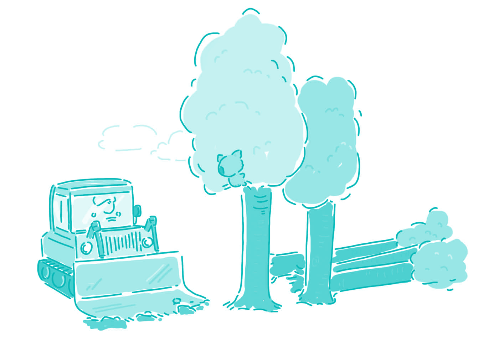

> ###  译文

> **41. 土地用于人类需求还是濒危动物**

> 在我们做用地决定的时候，有些人认为在所有情况下人类的需求都应该置于动物的需求之上。我同意人类的需求应该首先得到考虑，但是人类有保护濒危动物的家园特殊的责任。

> 动物对于环境的突然变化适应得非常慢。很多濒危动物只能生活在一个地方或某一类地方。另一方面，人类有特殊的能力很快适应变化和敌对的环境。例如，如果人类需要住在十分干燥的环境中，他们就会利用技术定位并钻探取水，或建设管道从外边引水。几千年前新疆的居民就会挖长达几百公里的地下坑道，把水引到绿洲城镇如吐鲁番。因为人类是十分灵活的而许多动物却不是，所以人类在占据濒危动物的栖居地之前应该先用完所有可用之地。

> 另一个保护濒危动物的重要原因就是脆弱的生态平衡会因它们的灭绝而受到无法修复的破坏。例如，如果人类砍倒森林并用之来种植谷物，他们就可能同时破坏了一种吃蝗虫的鸟的栖息地。下一年因为蝗虫的数量可以无限制地增长，蝗虫就可以破坏掉所有临近的谷地。不仅鸟类失去了它们的家，而且人类也受到了伤害。人们还没有很好地理解很多自然栖息地的生态平衡，人类对其的干扰将有损于人类自身。

> 最后，人类有很多可以从濒危物种中学到的东西。医学领域就是一个例子。通过观察南美洲一种濒危的猴子，科学家们发现当猴子得病的时候它们会去吃某一种植物。通过研究，科学家们发现这种植物对人类也有医学价值。如果为了扩大农田而破坏猴子的栖息地，不仅我们会失去这种植物和猴子，我们也会失去救命的药物和医学研究的潜力。

###  Word List

 * primary ［ˈpraiˌmeri］ adj. 第一位的，主要的
 * endangered ［enˈdeindʒəd］ adj. 濒临灭绝的
 * hostile ［ˈha:stəl］ adj. 敌对的，敌方的
 * pipeline ［ˈpaipˌlain］ n. 管道
 * locate ［ləuˈkeit］ v. 定位，位于
 * flexible ［ˈfleksəbəl］ adj. 灵活的
 * encroach ［enˈkrəutʃ］ vi. (逐步或暗中) 侵占，蚕食
 * delicate ［ˈdelikit］ adj. 脆弱的，微妙的
 * ecological ［ˌekəˈla:dʒikəl］ adj. 生态的
 * irreparably ［iˈrepərəbəli］ adv. 不能挽回地
 * habitat［ ˈhæbiˌtæt］ n. (动植物的)生活环境，栖息地

## 42. One skill needed to be successful in the world today

People succeed not merely because they have one or more certain skills. However, if I have to choose one skill which is supposed to be useful to success, I think it should be the ability to convince or persuade others.

By convincing or persuading we get what we want from others. When we were children, we always managed to persuade our parents to buy us candies; when we were in the high school, we had to persuade our classmates to play with us; when we applied for a job after graduation, we had better be able to successfully convince the employer that we are qualified employees. Besides, some day, we will all have to convince a person whom we love that we are in deed outstanding husbands or excellent wives.

By convincing or persuading we become more and more sturdy and powerful. Nobody is capable of doing every thing perfect. By persuading others to cooperate with us, we can achieve much more than we could only by ourselves. Mr. Yu Minhong, CEO of Beijing New Oriental Education & Technology Group, had successfully convinced his alumni including Mr. Wang Qiang and Mr. Xu Xiaoping to strive after an ideal—to build a most influential private university in China, and today, they have been so close. Mr. Yu, while answering a journalist, said that he once persuaded Chinese students to go abroad, his current work is to convince those students to return to their homeland with their enhanced intelligences.

Ironically, it is ourselves who need us to persuade and convince most. We by nature are weak, yet have to be stronger to face up to tough surroundings. All too often we need encouraging. Amazingly enough, it is ourselves who can in deed encourage. When we are in trouble, we need convince ourselves not to give up; when we are in plain sailing, we need persuade ourselves no to be negligent. By convincing ourselves, we become more and more independent, and more and more robust, both of which are characteristics essential to success.

> ###  译文

> **42. 在当今世界获得成功所需的一种技巧**

> 人们成功不仅仅是因为他们有一种或几种技能。但如果让我选一种对成功有用的技能，我想那就应该是使别人信服或说服别人的能力。

> 通过使别人信服或说服别人，我们可以从别人那里得到想要的东西。当我们还是孩子的时候，我们总会想办法劝说父母给我们买糖果；当我们上高中的时候，我们必须劝说同学与我们玩耍；当我们毕业后求职的时候，我们最好能成功地使雇主信服我们是合格的雇员。除此之外，有一天我们所有人还必须使一个我们爱慕的人认为我们是一个杰出的丈夫或优秀的妻子。

> 通过使别人信服或说服别人我们变得越来越坚强和有力。没人能把每一件事都做得很完美。通过劝说别人与我们合作，我们可以获得比仅仅依靠自己大得多的成就。俞敏洪，北京新东方教育科技集团总裁，成功地说服他的校友（其中包括王强和徐小平）来为一个目标奋斗——在中国建立一所最有影响力的私立大学，而现在，他们已经十分接近了。俞先生在答记者问时说他一度劝说中国学生出国，他现在的工作是劝说他们带着所学回到祖国。

> 具有讽刺意味的是，我们自己才是最需要说服的。我们天生脆弱，而必须变得坚强起来以面对困境。我们特别需要鼓励。令人惊异的是，能给与真正鼓励的却是我们自己。当我们陷于困境的时候，我们说服自己不要放弃；当我们一帆风顺的时候，我们需要提醒自己不要大意。通过说服自己，我们变得越来越独立、越来越坚定，这两点都是成功的基本特征。

###  Word List

 * merely ［ˈmiəli］ adv. 仅仅，只，不过
 * convince ［kənˈvins］ vt. 使确信，使信服
 * outstanding ［autˈstændiŋ］ adj. 突出的，显著的
 * cooperate ［kəuˈa:pəreit］ vi. 合作，协作
 * journalist ［ˈdʒə:nəlist］ n. 新闻记者
 * enhanced ［enˈhænst］ adj. 增强的，放大的
 * ironically ［aiˈra:nikəli］ adv. 有讽刺意味地
 * amazingly ［əˈmeiziŋli］adv.令人惊讶地
 * essential ［iˈsenʃəl］ adj. 本质的，基本的

## 43. The attractions of dangerous activities

People engage themselves in dangerous activities for various reasons, which probably includes money, pleasure, and perhaps ironically, nescience.

Perhaps the most direct drive might come from money, which is needed for everyone, any time and everywhere. People have enough wit to balance their certain choices, especially when they face danger and money. Those stunt men or women in Hollywood movies, photographers who shoot sharks or crocodiles, or those who participate in stock car racing, are always sophisticated enough to calculate whether the outcome outweigh the risk. If they are willing to take the risk, they must have evaluated well. They know exactly the rule: the more risks they take, the more they might get.

There also is another kind of people in this world. Money is of almost no importance to them. They perform dangerous activities just for their own pleasure. Perhaps the most appropriate example involves sports. Actually every kind of sports is dangerous, and even can be deadly. Danger always exists, but people tend to simply ignore it. Take parachuting for example, who can refuse the fascination of flying in the sky like a bird? On the other hand, it seems that danger itself makes the activity so fascinating as too hard to refuse. To conquer is the very nature of human being from the very beginning. Pheidippides said seconds before dropping dead two thousand years ago, "Rejoice, we conquer!" And it seems perfectly logical for some people that celebration follows conquer.

Ironically, sometimes blind brave comes out of nescience. Sometimes people simply don't know the activity is hazardous or how perilous it exactly is. It can be exemplified by a recent incident. Five students(three of them have a master's degree) lost their lives in a mountaineering expedition. Those students reportedly didn't, and it seems highly probable, make an adequate preparation before expedition, which made the tragedy ineluctable. People always praise alpinists with words such as strong, brave, courageous, but in this case none of these words is appropriate. Those young students traded their springtime with blind brave, and died in vain.

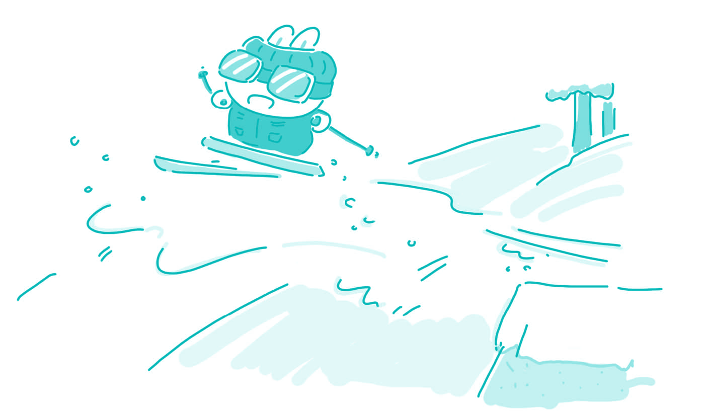

> ###  译文

> **43. 危险活动的吸引力**

> 人们出于各种原因从事危险的活动，其中有可能包括金钱、乐趣，或许有讽刺意味地是出于无知。

> 可能最直接的动力来自金钱，它是每个人在任何时间和任何地点都需要的东西。人们有足够的智力去权衡他们的某些选择，尤其是他们面对危险和金钱的时候。好莱坞电影中那些演特技的男女、拍摄鲨鱼或鳄鱼的摄影师或是那些参加改装车比赛的人都聪明得足以算出所冒的险是否值得，如果他们愿意冒险，他们肯定已经做好了评估。他们很清楚规则：冒的险越大，得到的也就越多。

> 这个世界上还有另一种人，钱对他们来说几乎不重要，他们只是为自己的乐趣才从事危险的活动。或许最恰当的例子就是体育。实际上每种体育都是危险的，甚至可能是致命的。危险一直存在，但人们趋向于完全忽略它。以跳伞为例，谁能拒绝像鸟儿一样在天空翱翔的吸引？另一方面，似乎是危险本身使这项活动变得如此迷人而令人难以拒绝。征服从一开始就是人类的本性。两千年前费迪皮迪兹(公元前5世纪的雅典长跑运动员)在猝死前几秒钟说道“我们因征服而欢乐！” 这对那些征服后进行庆祝的人来说实在是再合理不过了。

> 有讽刺意味的是，有时盲目的勇敢出自无知。有时人们仅仅是不知道这项活动的危险或不知它到底有多危险。这可以以最近的一场事故为例。五位学生（其中三位是硕士） 在登山探险中丧命。据说，事实上看来也极为可能，这些学生在探险前没有做恰当的准备，从而使这场悲剧变得不可避免。人们经常用强壮、勇敢、有勇气等词语来形容登山家，但在这里这些词都不合适。那些学生因为盲目的勇敢而青春消逝，白白死去。

###  Word List

 * engage ［enˈgeidʒ］ vt. 使从事于，使参加
 * stunt man 特技演员
 * stock car racing 改装车比赛
 * sophisticated ［səˈfistikeitid］ adj. 久经世故的
 * evaluate ［iˈvæljueit］ vt. 评价，估计
 * involve ［inˈva:lv］ vt. 包括
 * nescience ［ˈneʃəns］ n. 无知
 * hazardous ［ˈhæzədəs］ adj. 危险的，冒险的
 * mountaineering ［ˌmauntnˈiəriŋ］ n. 登山
 * expedition ［ˌekspiˈdiʃən］ n. 远征, 探险
 * ineluctable ［ˌiniˈlʌktəbəl］ adj. 不可避免的，无法逃避的
 * vain ［vein］ adj. 徒然的，无益的

## 44. Do you travel alone or with a companion?

The biggest inconveniences of traveling are high expenses and safety concerns. Traveling with a companion may solve both of these problems and at the same time adds to the enjoyment of the trip.

Part of the joy of traveling is the sense of discovery felt when seeing a completely new place. Traveling with someone else compounds that sense of wonder. When you see or experience something new you can share it with your travel companion. Likewise, when you are traveling with someone else you get the benefit of another pair of eyes and ears, and you are more likely to notice interesting things when you are not traveling alone. When I was hiking in Yunnan province with a friend, she spied a frog sitting by the edge of the trail. Had my friend not been there, I would not have seen it, and missed part of the natural beauty of Yunnan.

Traveling companions not only enrich the experience of travel, but also make it safer. According to police statistics, thieves, rapists, and murderers are all much more likely to target a single person walking alone than to target a group of two or more people. To save money, a person traveling alone might sleep in a dorm room. Apart from the noise and inconvenience of sharing a room with a large number of strangers, travelers also have to be constantly vigilant to prevent other people from stealing your belongings. When traveling with a companion you can take turns watching each other's valuables on trains, restaurants, parks, and other public places frequented by tourists.

Finally, traveling with a companion is also cheaper than traveling alone. A hotel room for one person might cost 100 yuan, while a room for two at the same hotel might cost 120 yuan. If you have a companion you can each spend 60 yuan per night, rather than both spending 100 yuan if you traveled separately. It is also cheaper to eat in restaurants and you get to sample more kinds of food when two people order. When bargaining for souvenirs, each person can save a little money if you offer to buy more than one. Traveling with a companion can easily cut your travel expenses in half, while doubling the fun of trip.

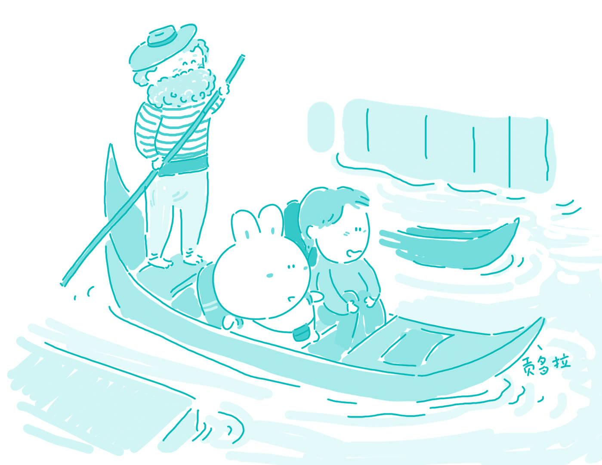

> ###  译文

> **44. 你独自旅行或结伴而行？**

> 旅行的最大麻烦是高额费用和安全问题。与人结伴旅行就会解决这两个问题，同时为旅行增添乐趣。

> 旅行的一部分乐趣来自于看到一个全新的地方时有所发现的感觉。与他人同游使这种惊奇更强烈。看到或经历新事物时你会与游伴一起分享。同样，与他人同游你也会得益于他的眼见耳闻， 你比独自旅行更有可能注意到有趣的事物。我与一个朋友在云南徒步游玩时，她突然看见一只坐在小路边上的青蛙。如果我朋友没在那儿，我就不会看见，也就会错过云南的一些自然美景。

> 游伴不仅丰富旅游阅历，也会让游程更安全。根据警方资料，小偷、强奸犯和杀人犯锁定单人独行比锁定两人或更多人的团体为作案目标的可能性要大得多。为了省钱，独自出游的人可能在宿舍里睡觉。除了噪音和同很多陌生人共住一间屋的不方便，游客还要保持警惕，防止别人偷窃财物。与人同游，你们就可以在火车、餐馆、公园和其他游人常到的公共场所轮流看管双方的贵重物品。

###  Word List

 * inconvenience ［ˌinkənˈvi:njəns］ n. 麻烦，不方便之处
 * companion ［kəmˈpænjən］ n. 同伴；共事者
 * enrich ［enˈritʃ］ vt. 使富足，使肥沃
 * statistics ［stəˈtistiks］ n. 统计学；统计表
 * rapist ［ˈreipist］ n. 强奸者，强奸犯
 * vigilant ［ˈvidʒələnt］ adj. 警惕着的，警醒的
 * belongings ［biˈlɔ:ŋiŋz］ n. 财产
 * bargain ［ˈba:gin］ v. 议价，讨价
 * souvenir［ˈsu:vəniə］ n. 纪念品

## 45. Which kind of life do you like, get up early or get up late?

When I was a kid and didn't want to go to bed early, my father always used to say, "The early bird gets the worm." I certainly knew what he meant: people who stay up late at night aren't able to get up early and take full advantage of the new day's opportunities. I'm not sure how wise I am, but I can certainly feel that getting a good night's sleep and an early start helps me do a full days work.

However, every job or task always has unforeseen problems and complications. A trip to the post office seems simple enough, but could be complicated and lengthened by heavy traffic, forgetting to bring money or addresses, or long lines. When I need to do many things in a day, a delay at the post office can negatively affect all of my other tasks. To minimize these potential negative effects, I try and get an early start that leaves me plenty of time later in the day to finish my other tasks.

Another important reason to get up before 8:00 a.m. is that businesses usually start their workdays by 9:00 a.m. at the latest. A person who wakes up at 10:00 a.m. has already lost two precious business hours. This gives them less time to go to the bank, the post office, or deal with any company or government office that keeps regular business hours. People who get up early have the extra benefit of all of the hours of a full business day during which they can be more productive than they can during non-business hours.

Finally, getting up early and going to sleep early is a fairly standard schedule to which most of society adheres. If I adhere to it as well, I will have more time to spend with my family and friends. If I get up late and stay up late, I will not only lose opportunities to interact with others during business hours, I will also lose chances to interact with people because they are asleep! This would be all right if I were a hermit, but since I enjoy the company of others, I prefer to be an "early bird."

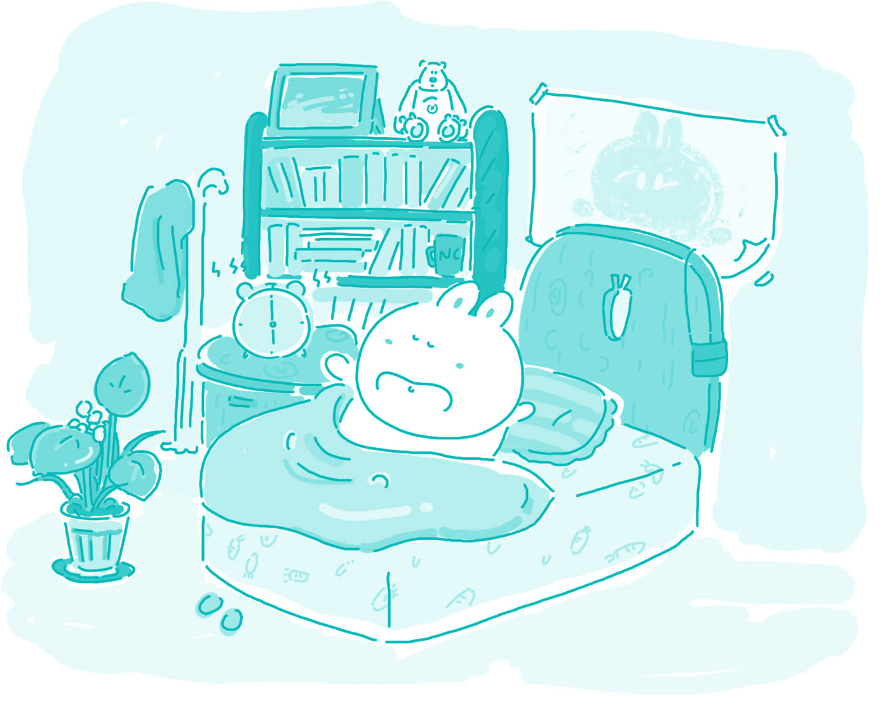

> ###  译文

> **45. 你喜欢早起还是晚起？**

> 当我还是个小孩子，不想早睡时，父亲经常说：“早起的鸟儿有虫吃。”我当然明白他的意思：熬夜的人们不能早起并充分利用新的一天的机遇。我不知道我有多聪明，但是我的确感到睡得好起得早能让我白天全力工作。

> 然而，每种工作或任务都有不可预料的问题与复杂情况。去一趟邮局看似十分简单，但是拥挤的交通、忘了带钱、不记得地址或者队伍排长龙都会使行程变得复杂费时。当我一天里有许多事情要处理时，在邮局一耽搁就会影响我的其他事情。为了降低这些可能的负面影响，我尽量早些开始以便一天内留有足够的时间来完成其他事情。

> 早晨八点以前起床的另外一个重要原因是公司通常最迟上午九点开始工作。十点醒来的人已失去了两个钟头宝贵的办公时间。这就使他们去银行、邮局、公司或政府部门这些按规定时间办公的地方办事的时间减少了。早起的人能在全天办公时间里额外受益，那时他们生产效率比在非工作时间更高。

> 最后，早起早睡是大多数社会遵守的标准时间表。如果严格坚持，我将有更多的时间与家人朋友共度。若是晚起晚睡，我不仅会失去在办公时间与别人相处的机会，也会在别的时间无缘与他人交流，因为那时他们正在睡觉！我若是个隐士这一切还好，但是既然我喜欢与人相处，我更愿意当一只“早起的鸟儿”。

###  Word List

 * unforeseen ［ˈʌnfəˈsi:n］ adj. 无法预料的
 * complication ［ˌka:mpliˈkeiʃən］ n. 复杂化
 * minimize ［ˈminəˌmaiz］ vt. 将…减到最少
 * potential ［pəˈtenʃəl］ adj. 潜在的
 * negative ［ˈnegətiv］ adj. 否定的，消极的
 * adhere ［ædˈhiə］ vi. 坚持
 * hermit ［ˈhə:mit］ n. 隐士，隐居者

## 46. What makes a good son or daughter?

In traditional Chinese society, a person's most important relationship was that between a parent and a child. The only measure of whether a child was good or bad was whether or not they were obedient to their parents' wishes.

Traditionally a Chinese family had many children. Boys were expected to go to school and, after they grew up, to have a son of their own, and to manage the family's affairs. When his parents grew old, a son was expected to live with them and care for them. A girl's parents would usually arrange her marriage to someone who she did not love and without consulting her. After she was married, she was no longer a part of her biological family; instead she became an adopted daughter of her husband's family and had to respect her husband's parents as she would her own parents. She was also expected to bear her husband a son. A child who broke these norms, defied or disrespected their parents was seen as worthless or immoral at best, and could legally be killed by their parents in extreme cases.

Today of course, China is very different. Chinese children are still expected to respect their parents, but society is not as conservative as it used to be. When a Chinese son gets married, he will often prefer not to live in the same house with his parents, although he might still feel quite obligated to care for them in their old age. The greatest strides have been made by Chinese women, who now hope that their daughters grow up to marry someone that they love, and who is able to take good care of them.

The major revolution in the Chinese family since 1980s has been introduction of the one-child policy. Since Chinese families are now usually only allowed to have one child, the roles of parent and child have almost been reversed! Today's children in China, while still expected to treat their parents with respect, have become the "little emperors and empresses" of their families. Many "little emperors" are so doted on by their immediate and extended families that they become very spoiled, demanding toys, candy, and attention all day long. Because of the changing structure of the Chinese family, the bonds between parent and child, while still of primary importance, are characterized less by rules and respect and more by love.

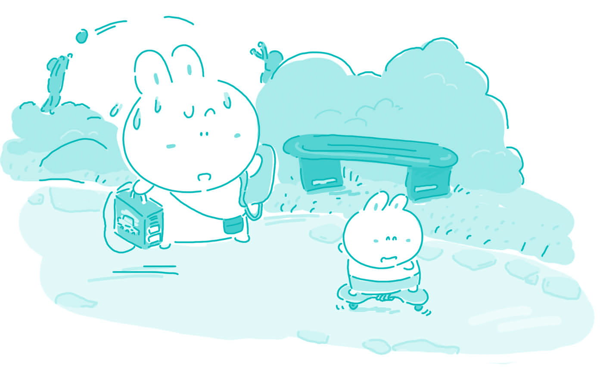

> ###  译文

> **46. 好儿子或好女儿需具备哪些重要品质？**

> 中国传统社会中，一个人最重要的亲属关系是父母与子女之间的关系。衡量孩子好坏的惟一准则是他们是否遵从父母的意愿。

> 传统上一个中国家庭有多个子女。男孩们都被要求上学，长大后有自己的儿子并管理家庭事宜。父母变老时，儿子要住在身边照顾他们。女孩子的父母经常不与她商量就把她嫁给某个她并不爱的人。婚后，她就不再是生身父母家里的一份子；而是她丈夫家的养女，必须像对自己的父母那样尊敬公婆。她还被期望能给丈夫生个儿子。一个孩子若打破了这些规矩、反抗或不尊敬父母，往好里说他会被视为无用或道德败坏，一些极端的情况下可能被父母依法处死。

> 当然，如今的中国已大不一样。中国的孩子仍被要求尊敬父母，但是社会已不像过去那样保守。一个中国儿子结婚时，他往往喜欢不与父母同住，尽管他仍感到完全有义务在父母年纪大时照顾他们。中国妇女取得了最大的进步，如今她们希望自己的女儿长大后能与所爱的、有能力好好照顾她们的人结婚。

> 自上世纪80年代后中国家庭的一大革命是计划生育政策的实施。由于现在的中国家庭通常只允许要一个孩子，父母与孩子的角色几乎颠倒了。今天的中国子女虽然仍被要求尊敬父母，却已成为家里的“小皇帝”、“小皇后”。许多“小皇帝”受到直系和非直系亲属的过分溺爱，成天要玩具、糖果，要人照顾。因为中国家庭结构的变化，父母与子女之间的关系虽然仍是至关重要的，但其中的规矩敬重已少了，而爱更多了。

###  Word List

 * obedient ［əˈbi:diənt］ adj. 服从的；孝顺的
 * obligated ［ˈa:bliˌgeit］ adj. 有责任的，有义务的
 * adopted ［əˈda:ptid］ adj. 被收养的
 * stride ［straid］ n. 改进，进步
 * norm ［nɔ:m］ n. 标准，规范
 * immediate family 直系亲属
 * immoral ［iˈmɔrəl］ adj. 不道德的，邪恶的
 * extended familylegally ［ˈli:gəli］ adv. 法律上，合法地（包括祖父母、外祖父母、姑姨等在内）大家庭
 * defy ［diˈfai］ vt. 不服从，公然反抗，违抗的
 * conservative ［kənˈsə:vətiv］ adj. 保守的，守旧的
 * dote ［dəut］ vi. 昏聩；溺爱
 * bond ［ba:nd］ n. 关系，纽带

## 47. A large company or a small one,which do you want to work for?

While some people enjoy the relative comfort, stability, and prestige of working at a large company, I prefer to live life on the edge. Given the choice, I would much prefer to work at small company where I could have more responsibility, more excitement, closer relationships with my coworkers, and a greater sense of accomplishment than I could have at a big company.

If I worked at a large company, my role at the company would be highly specialized and narrowly defined. At a smaller company everyone has to take on extra responsibilities to make the business work. For instance, if I worked at a small computer software company as a programmer, I might not only program, but also have to make trips to potential clients for sales. At a large company, the sales department would talk to clients, and I would be stuck in the same boring routine every day with less responsibility. I might less in touch with what the clients wanted if my responsibilities were limited to programming.

I crave excitement, so the idea of working for a small company particularly suits me. While working at a large company can offer more job security, workers don't usually get any of the annual profits. But if you work for a small company, profits are more likely to be shared at the end of the year. This means that the harder you work, the more potential there is to make a large amount of money. It is also especially gratifying when you can see how your hard work helped to build or save the company, a feeling of accomplishment that is difficult to attain when working in a large company.

Finally, working together in a small company creates a sense of special closeness between colleagues. You have to both trust and depend on each other for everything. This closeness is not only between people within the company but can also extend to your clients and suppliers, all of whom you can get to know on a first name basis. Business deals become less impersonal and more pleasurable when you work with people you trust and like. This trust is both deeper and easier to build when you work for a smaller company.

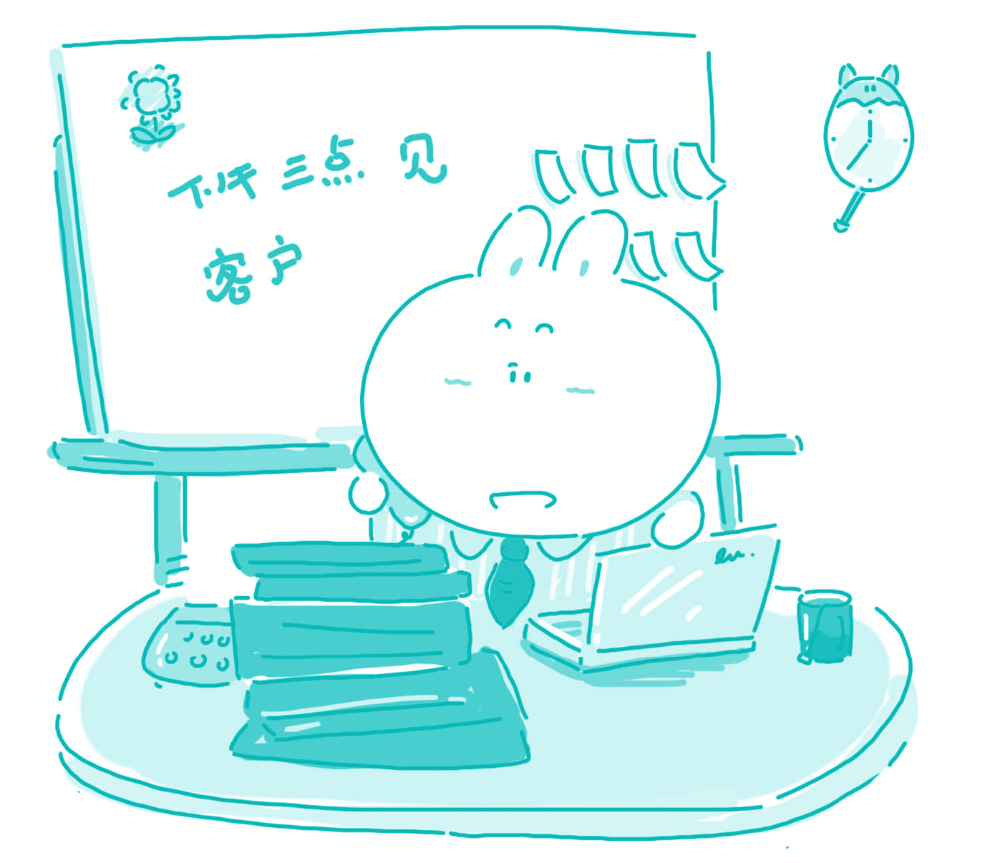

> ###  译文

> **47. 就职于大公司还是小公司？**

> 虽然有些人喜欢在大公司工作的舒适稳定与声誉，我却更喜爱边缘的生活。要是给我选择，我宁愿到小公司工作，在那里我可以有更多的责任与刺激、更亲密的同事关系和较之在大公司取得的更大的成就感。

> 如果我在大公司里工作，我在公司里的角色将会高度专业化，只有狭小的界定范围。在小公司里，每个人都必须承担起额外的责任使得事务运转。例如，如果我曾在一家小的电脑软件公司里担任程序设计员，我可能不止设计程序，还要为了销售而制定行程去拜访潜在客户。而大公司会有销售部与客户洽谈，我将每天墨守成规，责任变小。如果职责只限于编程，我与需求客户的接触就会减少。

> 我渴望刺激，因此在小公司工作的想法尤其适合我。虽然大公司能提供更多的职位保障，员工却通常得不到任何年度利润。但是如果为小公司工作，年终分红的可能性就大得多了。这意味着你越努力工作，你就越有可能挣一大笔钱。看到你的辛勤工作有助于建设或拯救公司尤其令人满足，这是在大公司工作难以获得的成就感。

###  Word List

 * prestige ［preˈsti:ʒ］ n. 声望，威望，威信
 * accomplishment ［əˈka:mpliʃmənt］n. 成就
 * specialized ［ˈspeʃəˌlaizd］ adj. 专门的
 * lay out 设计，布置
 * designer ［diˈzainə］ n. 设计者，设计师
 * programmer ［ˈprəuˌgræmə］ n. 程序师
 * annual ［ˈænjuəl］ adj. 一年一次的，每年的
 * gratifying ［ˈgrætəˌfaiiŋ］ adj. 悦人的，令人满足的
 * attain ［əˈtein］ vt. 达到，获得
 * supplier ［səˈplaiə］ n. 供应者，厂商
 * crave ［kreiv］ v. 恳求，渴望

## 48. Reasons why people work other than earning a living

One of the most overlooked reasons why people work is to help other people. Government officials, social and charity workers, and religious organizations, and others all work not only for their own salaries, but also work for the common good. They labor for others because of their moral convictions, for reasons of personal reciprocity, and because they want to make society more stable, thereby benefiting themselves and others. Some of the most famous charity workers in the world have been affiliated with religious groups. For instance, many of the foreigners living in the poor regions of Africa are doctors, teachers, and other professionals who are paid by religious organizations to help the poor, sick, and needy people there. These professionals could make much more money if they worked in rich countries. They have chosen to help poor people because they believe their religion tells them to help people who cannot help themselves. They are working for others for moral or religious reasons.

Some people work for other people because at some time in their lives, someone else has helped them. Many teachers can tell stories about a particular teacher who changed their lives. The gift a great teacher gave to them inspired them to become teachers themselves. Likewise, many people become doctors because a doctor saved one of their family member's life and they felt like they owed a debt of gratitude that money could not repay. To such people, the motivation for working is not the paycheck at the end of the month, but the smile on a child's face when they read their first book, or the look of joy on new parents' faces when they see their healthy newborn baby.

Finally, some people work for others because they believe that society is only safe and stable when all of its members are happy. These people include good government officials who try to make policies that benefit the poorer classes of society. They know that only by making policies that help poor people live richer, happier lives can they lower crime, sickness, and poverty rates, and make society safer and happier for all citizens.

> ###  译文

> **48. 除了生存人们工作的其他原因**

> 帮助他人是人们之所以工作的最容易被忽略的理由之一。政府官员、社会与慈善机构工作者、宗教组织以及其他人工作不仅是为了自己的薪水，也是为了公众利益。他们为他人劳作出于道德信仰，个体间的互利互惠，还因为他们想让社会更加稳定，这样才能对自己和他人都有益。

> 世界上一些著名的慈善工作者都从属于慈善团体。例如，许多在非洲贫困地区居住的外国人都是医生、教师和其他专业人员，他们从慈善机构那里领取报酬去帮助贫困、生病与物质匮乏的人。这些专业人员如果在富裕国家里工作挣的钱会多很多。但他们选择了帮助穷人，因为他们相信他们的宗教告诉自己要帮助那些不能自助的人。他们为别人工作是出于道德与宗教的原因。

> 有些人为他人工作是因为他们生活中的某些时候别人也帮助过他们。许多教师会讲述一位让他们的生命发生改变的很特别的老师的故事。好老师赐予他们的礼物促使他们自己也成为教师。同样，很多人成为了医生是因为曾有医生挽救了他们家人的生命，他们觉得欠下了一笔无法用金钱偿还的感激之债。对于这样的人，工作的动机不是月末的薪水支票，而是读到第一本书时孩子脸上的笑容，或者看到刚刚出生的健康宝宝时初为人父母的高兴的表情。

> 最后，一些人为他人工作是因为他们相信只有人人都幸福社会才会安定。这些人中有优秀的政府官员，他们尝试制定政策以使社会的较贫穷阶层受益。他们知道只有通过制定政策帮助穷人过上更加富裕幸福的日子才能减少犯罪、疾病和贫困率，才能使社会对于所有公民来说更加安定幸福。

###  Word List

 * conviction ［kənˈvikʃən］ n. 信仰；深信
 * reciprocity ［ˌresəˈpra:siti］ n. 互惠
 * affiliate ［əˈfiliˌeit］ v. 附属于
 * inspire ［inˈspaiə］ v. 鼓励，激励
 * gratitude ［ˈgrætiˌtu:d］ n. 感谢的心情
 * needy ［ˈni:di］ adj. 贫困的，非常贫穷的
 * motivation ［ˌməutəˈveiʃən］ n. 动机
 * paycheck ［ˈpeitʃek］ n. 付薪水的支票，薪水

## 49. Is face-to-face communication better than other types of communication?

While many modern forms of communication like phone calls, email, and letters, are extremely convenient, in my opinion, nothing beats speaking to another person face-to-face. Face-to-face conversation is the ultimate form of human communication because it is interactive, and allows a broader range of possibilities for communication in the intricacies of tone of voice, body language, and can add the intimacy of touch.

The first and most obvious advantage that face-to-face communication has over a letter and email is that there is the ability for an interactive conversation. If the sender of a letter or an email does not write clearly, or the recipient does not understand part of the correspondence, then much time must be spent to clear up the misunderstanding. In a face-to-face conversation, misunderstandings are easily dealt with because of the immediate and interactive nature of a face-to-face conversation.

The argument might be made that telephones and instant messaging services like MSN and ICQ are equally viable formats for interactive conversation, with the added benefit of being available over long distances. I would still argue that face-to-face conversation is better because you can see the other person. Not all communication is verbal; the meaning of much of what we say depends on our body language and tone of voice. Joking and irony are particularly difficult to express, identify, and enjoy without seeing the expression on someone's face, or watching the movements of their body.

Finally, if the goal of communication is to maintain or deepen a relationship with someone, business partners, friends, husbands and wives, or parents and children, face-to-face communication offers the option of communication by touch that is unavailable even if we could communicate by video. Trust and respect between businesses partners can be established with a firm handshake. No amount of body language can convey the excitement of a high-five between friends, and no number of words can communicate the comforting embrace of a loved one. Touch is the first foundation of our human relationships, before spoken language, and it is only available when people communicate face to face.

> ###  译文

> **49. 面对面的交流比其他交流方式都好吗？**

> 虽然像打电话、发电子邮件和写信这样的现代沟通方式非常方便，但在我看来，什么也比不上与别人面对面的交谈。面对面交谈是人类沟通的最终形式，因为它是互动的，在语音语调和肢体语言的错综复杂的细节中给沟通提供了更大范围的可能性，并且能增加接触的亲密感。

> 面对面沟通强于电子邮件与信件的第一点并且也是最明显的一点优势是能够互动交谈。如果信件与电子邮件的发送者写得不清楚，或者收信者不明白部分通信内容，就得花很多时间澄清误解。在面对面的沟通中，因为当面交谈的及时互动的特性，误解很容易解决。

> 可能有人会争论，电话和诸如MSN、ICQ的特快信息服务同样能够实现互动交谈，还有适用于长距离沟通的额外好处。我还是认为面对面的交谈是更好的，因为你能看到对方。不是所有的沟通都是文字形式的；很多我们说出的话的含义取决于我们的肢体语言与音调。看不到对方的面部表情或者肢体动作，开玩笑与讽刺就会格外难以表达、辨别和欣赏。

> 最后， 如果沟通的目的是要维持或加深与他人之间的联系，如工作伙伴、朋友、夫妻或父母与孩子，那么面对面的沟通会提供触摸交流的选择，即使我们能够视频沟通，这一点也是做不到的。一个有力的握手能够在工作伙伴中建立起信任与尊重。多少语言都不能表达朋友间高高击掌的兴奋，多少词句也传达不了爱人拥抱的欣慰。触摸是人类在有语言以前联系的第一基础，并且只有在人们面对面沟通时才能实现。 

###  Word List

 * beat ［bi:t］ v. 击败，打败
 * format ［ˈfɔ:ˌmæt］ n. 形式
 * ultimate ［ˈʌltəmit］ adj. 最终的，根本的
 * correspondence ［ˌkɔrisˈpa:ndəns］n. 通信，信件
 * interactive ［ˌintərˈæktiv］adj. 相互作用、影响的
 * recipient ［riˈsipiənt］ n. 接受者，领受者
 * intricacy ［ˈintrikəsi］ n. 复杂，错综
 * irony ［ˈaiərəni］n. 反话，讽刺，讽刺之事
 * intimacy ［ˈintəməsi］ n. 亲密
 * viable ［ˈvaiəbəl］ adj. 切实可行的
 * embrace ［emˈbreis］ n. 拥抱

## 50. Do what you already do well or try new things?

A defining characteristic of people is the degree to which they are willing to break out of their comfort zone. Old habits and well honed skills give great comfort to any individual, but new personal challenges build character and allow one to grow as a person. It was not until very recently that I fully comprehended this. Today, while I still enjoy doing the things I am already good at, I have become increasingly eager to try new things because I have learned the value of new experiences.

I have always been a talented athlete, and I still find great comfort on the basketball court and in the swimming pool. These are familiar places where I feel at home. They are also places where I continue to excel. However, not so long ago my older cousin, a person whom I have always looked up to and admired, reminded me that there is nothing wrong with discovering new talents or doing many different things very well. He introduced me to music.

For the past sixteen months I have been learning how to play the guitar, and this new experience has been extremely rewarding. Initially, I struggled. My inability to play even the simplest of notes frustrated me, and quite often I thought about giving up. Yet with my teacher's encouragement I continued to make progress. Now my appreciation for music is much more profound than ever before, and my appetite for new experiences is whetted.

Together with a couple of classmates I have formed a book club. Every week we get together and discuss a piece of literature. Of course, my friends were hesitant to give this new idea a try at first. Nevertheless, I have convinced them to be risk takers, and now all of us enjoy not only each others' company but also books and stories, which is a completely new experience for all of us. Together we are planning to learn how to dance and to purchase bicycles to explore the area around our hometown. We don't want to limit ourselves to what we know already.

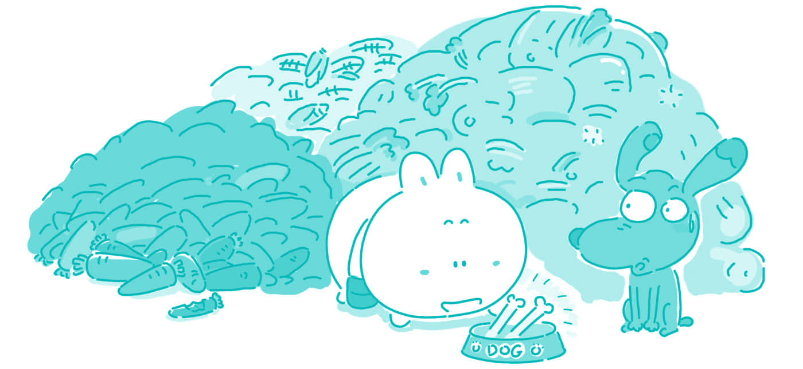

> ###  译文

> **50. 轻车熟路还是勇于创新？**

> 人的很重要的一个特征就是在多大程度上愿意打破他们的舒适区域。老习惯与高超的技能会让人十分舒适自在，但是新的对个人的挑战能够铸造性格，使人成长。我是直到最近才完全理解这一点的。今天，当我仍然乐于做那些已经十分擅长的事情时，我却变得越来越急于尝试新的事物，因为我已懂得新体验所带来的价值。

> 我一直是一名运动天才，在篮球场上和游泳池里仍能找到极大的舒适感。在这些熟悉的地方里我习惯自如，并且继续出色。然而，不久以前一位我一直尊敬的表哥提醒了我，发掘新的能力或者做好不同的事情是没什么不对的。他让我试试音乐。

> 在过去的16个月中，我一直学习弹吉他，这种新体验非常有益。起初我有过挣扎。连最简单的音调都弹不好让我十分沮丧，很多次我都想过放弃。然而在老师的鼓励下，我继续进步。现在我对音乐的欣赏水平要比从前高深得多，对新体验的兴趣也被激起来了。

> 我和几个同学一起组成了一个读书俱乐部。每周我们聚在一起讨论一篇文学作品。当然，我的朋友一开始曾经犹豫是否尝试这个新想法。不过我说服了他们成为敢于冒险的人，现在我们不仅非常高兴相伴在一起，也享受着书与故事带来的乐趣。我们正在一起计划着去学跳舞，还要买自行车在家乡的周围地区进行探险。我们不愿将自己局限在已知的领域中。 

###  Word List

 * zone ［zəun］ n. 地域，地带，地区；环带；圈
 * hone ［həun］ vt. 磨练
 * talented ［ˈtæləntid］ adj. 有才能的
 * rewarding ［riˈwɔ:diŋ］ adj. 有益的，值得的
 * initially ［iˈniʃəli］ adv. 最初，开头
 * profound ［prəˈfaund］ adj. 深刻的，意义深远的
 * hesitant ［ˈhezitənt］ adj. 犹豫的，吞吞吐吐的
 * explore ［ikˈsplɔ:］ v. 探险，探测，探究
 * company ［ˈkʌmpəni］ n. 同伴

## 51. What does success come from, taking risks or careful planning?

Magazines and newspapers never tire of telling stories about people who have come to success quickly by taking risks. However, the problem with taking chances is that, while one can win a fortune, one can also lose everything. Careful planning helps reduce that possibility, and it is a basic skill that all established business people have. Therefore, I believe that continued success in life will be the result of careful planning as well as taking risks.

Careful planning is a requisite part of life, especially when one's decisions can impact one's own life and the lives of others in a significant way. For example, the CEO of a company must weigh all of his options cautiously. After all, his decisions will impact not only his life and that of his family but also the lives of his workers and families. Due to a miscalculation on his part the company could incur significant losses. These losses might be so substantial that the company will be forced to cut jobs in order to save money or save the company itself. Therefore, the CEO's carelessness could cost him his job or, even worse, could cost the jobs of other workers in the company who might be less well-off than him. At the same time, taking chances is necessary on the way to success. People who get too caught-up in careful planning often find themselves unable to make decisions. They are looking for more and more information in order to make a well informed assessment, but they are taking too long. For example, the same CEO who plans the moves of his company carefully so as to minimize the possibility of failure faces tough competition in the business world. In order to stay ahead of his rivals he will have to make decisions on the fly to beat out competing companies who are trying to buy the same materials or sell similar products. Thus, depending on the situation, taking a risk could be necessary to save a company or to ensure its prosperity well into the future.

> ###  译文

> **51. 成功来自冒险还是周密计划？**

> 报纸杂志从来都是不厌其烦地告诉人们谁又通过冒险快速成功了。但是，投机这个问题在于，你可以凭运气得到一笔财产，你也可以失去你所拥有的全部。成功的商业人士所具备的认真做计划的本领可以减少这种可能性。因此，我认为生活中的不断成功是周密计划和冒险尝试共同作用的结果。

> 认真做计划是生活中必备的本领，特别是当要做的决定可以影响自己或者他人生活的时候。例如，公司的首席执行官必须仔细权衡每一个方面。毕竟，他的决定不仅将影响到他自己、他的家人，还将影响他的员工以及员工的家人。他的一个不审慎的决定可以给公司带来巨大损失。有时损失太大，公司不得不为节省开支或者自救而裁员。因此，首席执行官的不慎可能使自己失业，也可能使生活不如自己的下属失业。

###  Word List

 * establish ［iˈstæbliʃ］ v. 建立，设立
 * continue ［kənˈtinju:］ v. 继续做某事
 * requisite ［ˈrekwizit］ adj. 必不可少的
 * impact ［ˈimˌpækt］ v. 影响
 * significant ［sigˈnifikənt］ adj. 有意义的
 * cautiously ［ˈkɔ:ʃəsli］ adv. 小心地，谨慎地
 * incur ［inˈkə:］ v. 招致，惹气
 * substantial ［səbˈstænʃəl］ adj.实质的，真实的
 * assessment ［əˈsesmənt］ n. 估价，评价
 * competition ［ˌka:mpiˈtiʃən］ n. 竞争，比赛
 * prosperity ［pra:sˈperiti］ n. 繁荣，富足
 * on the fly 忙碌中进行地

## 52. How to make your hometown more appealing to people your age?

My hometown is a pretty good place to live. However, I still can think of at least three changes that would drastically increase the towns appeal to people my age, around 20. The construction of public sports facilities would give us the opportunity to exercise and spend our time constructively, the further development of the public parks would provide us with places to spend our leisure time in nice and cost free environments, and the lowering of the cost of public transportation would give us the opportunity to roam the city more freely.

Exercising is the most popular recreational activity amongst people my age, but unfortunately there is very little opportunity to pursue sports in my hometown. All of the gyms, basketball courts, and football fields are on school grounds, and most of the time they are occupied by other students or sports teams. When they are not occupied, the facilities are locked up or it is too dark to play sports. The construction of public sports facilities that are open to anybody would solve this problem.

My friends and I enjoy spending time together, but we cannot find a suitable place to hang out. Most of the time, we meet at the shopping mall around the corner, or play outside the convenience store across from school. We usually just spent what money we have and do nothing else but look at the stores or sit on the street. We want to go to a park or a nice green area, but most of them are not very well kept. Those that are nice are too far away.

Lowering the cost of bus and train tickets would not only allow us to go to those parks, but it would open up a whole new realm of possibilities. We would be able to go to other parts of the city and see our relatives more often. Right now, the only time we get to see our cousins is on holidays. Furthermore, we could actually afford to see a movie in the theater. At present the cost of transportation is almost as much as the ticket itself.

> ###  译文

> **52. 如何使家乡对你的同龄人更具吸引力？**

> 我的家乡是一个很适合生活的地方，但是我仍然能够找出三个可以改进的地方以吸引像我这样的二十来岁的年轻人。公共体育设施的建设将带给人们锻炼的机会，使人们更积极地利用时间；公园的修建给人们带来休闲的地方，让人们享受优美免费的环境；公共交通费用的降低能让我们更自由地徜徉在这个城市中。

> 锻炼是我这个年龄段的人最普遍的休闲方式。可是遗憾的是，在我所在的城市里很少有机会锻炼身体。所有的体育馆、篮球场、足球场都在校园里，而且大多数时间都被学生或者运动队占用。没人用的时候，它们会被锁起来，或是天太黑没法玩了。建设向公众开放的体育设施可以解决这个问题。

> 我和朋友喜欢在一起消磨时光，可是我们却找不到适合聚会的地方。大多数时间我们在街角的商场碰头，或者是在学校外面的便利店玩耍。我们往往是在花完了身上的钱后就无所事事了，只能逛逛商店或者干脆就坐在街边。我们希望能有个公园或者绿地让我们去，可是大多数公园或者绿地却管理不善，好的公园又往往很远。

> 降低公交车票或火车票的价钱不仅使我们可以到郊区的公园，还会给我们一片新的天地：我们可以到城市的其他地方去、经常到亲戚家去。现在我们去亲戚家的惟一机会就是过节的时候。而且，我们确实有钱到影院看电影，但现在，交通费几乎和电影票价差不多。

###  Word List

 * drastically ［ˈdræstikəli］ adv. 激烈地，猛烈地
 * construction ［kənˈstrʌkʃən］ n. 建筑，建筑物
 * facility ［fəˈsiliti］ n. 设备，工具
 * leisure ［ˈli:ʒə］ n. 空闲，闲暇
 * roam ［rəum］ v. 漫步，闲逛
 * recreational ［ˌrekriˈeiʃənəl］ adj. 修养的；娱乐的
 * pursue ［pəˈsu:］ v. 追赶，追求
 * gym ［dʒim］ n. 体育馆；体操
 * realm ［relm］ n. 领域

## 53. Is money the most important aspect of a job?

I understand that nowadays it is very important for people to earn a lot of money. As a matter of fact, many people equate money with success: the more money you earn, the more successful you are. However, the financial aspect is not the most important aspect of a job. The work environment and camaraderie with one's coworkers, the personal fulfillment from one's occupation, and the opportunity to balance professional and personal lives are much more important.

People who spend forty hours a week or more at their place of employment should enjoy their work environment, especially the company of their coworkers. After all, the prospect of having to spend any amount of time in a room or a building with people who one does not respect, who are unpleasant, or, even worse, hostile, will have a very negative effect on one's disposition and mental health. A few more dollars in the bank account cannot compensate for this.

Similarly, one should derive a special fulfillment or pleasure from doing one's job. Normally, a person will spend at least a third of his/her adult life at work (eight hours or more every day). One should not waste this time by doing work that is boring or tedious even if it is well paid. The money earned will only enrich the life away from work but not enhance the work experience.

Finally, the personal life can only be enjoyed adequately if there is enough time away from the professional life. Affluence affords many nice things, such as houses or cars or television sets, but a person who has to work night and day will not be able to derive any pleasure from them. Also, a father or a mother who makes a lot of money might be able to provide his or her family with a comfortable life, but how much good does that do if he or she never sees them? Time spent with family, especially children, is invaluable, and thus a job with long hours might cost a person more than it affords.

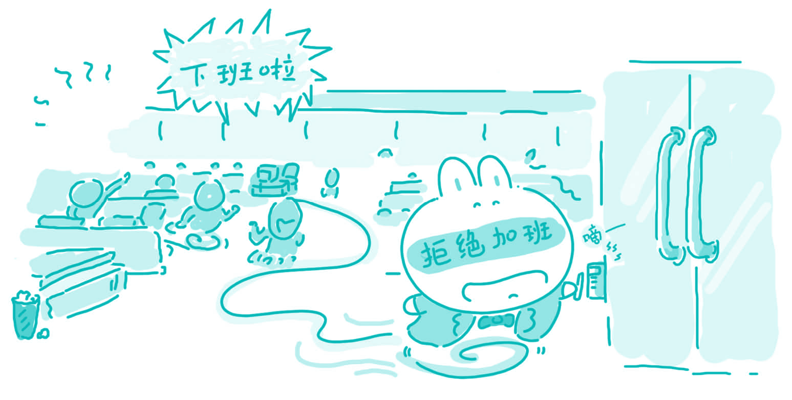

> ###  译文

> **53. 钱是工作中最应看重的吗？**

> 我知道现在这个社会挣钱多很重要。实际上，人们认为有钱的人就是成功的人。你挣得越多就越成功。但是，在找工作时金钱并不是最重要的。工作环境、同事关系、工作中能否获得成就感、工作时间与业余时间分配是否合理等比金钱更重要。

> 一般每周需要工作四十个小时甚至更多，所以人们应该满意自己的工作环境，特别是与同事之间的关系。毕竟，同不值得尊重的、令人不愉快的或者充满敌意的同事在同一房间或同一大厦里工作会影响你的心情、进而危害你的精神健康。这样的话即使账户里多几个美元也补偿不了你的损失。

> 同样，你也应从工作中获得成就感和乐趣。通常，一个成年人三分之一的时间都在工作（按每天工作八小时或更多计算）。所以即使报酬很高，你也不应把这部分时间浪费在单调的、令人厌烦的工作上。你挣的钱，只能使你的生活比较宽裕但是不能提高你的工作经验。

> 最后，只有有足够的业余时间才能享受生活。 有钱可以买到很多好东西，如房子、车子、电视机等。可是如果你从早干到晚，那就根本没有时间来享用它们。同样，挣很多钱的父母能给家庭带来舒适的生活，可是如果他们整天和家人不见面，挣那么多钱又有什么用呢？抽出时间和家人，特别是孩子在一起的价值是不可估量的。所以，长时间的工作可能使你失去的比得到的更多。

###  Word List

 * nowadays ［ˈnauəˌdeiz］ adv. 当今，现在
 * mental ［ˈmentl］ adj. 精神的，智力的
 * equate ［iˈkweit］ v. 相等，等同
 * account ［əˈkaunt］ n. 计算；账目
 * financial［fə ˈnænʃəl］ adj.金融的，财政的
 * compensate ［ˈkampənˌseit］v. 偿还，补偿；付报酬
 * camaraderie ［ˌka:məˈra:dəri:］ n. 同志之爱，友情
 * derive ［diˈraiv］v. 得自，起源
 * coworker ［ˈkəuˌwə:kə］ n. 同事，合作者
 * enhance ［enˈhæns］ v. 提高，增强
 * fulfillment ［fulˈfilmənt］ n. 履行，实行
 * adequately ［ˈædikwitli］ adv. 充分地
 * hostile ［ˈha:stəl］ adj. 敌对的，地方的
 * affluence ［ˈæfluəns］ n. 富裕，富足
 * disposition ［ˌdispəˈziʃən］ n. 部署
 * afford ［əˈfɔ:d］ v. 提供，给予；供应的起

## 54. Should one judge a person by external appearances?

People should look beyond superficial appearances. All too often we judge people quickly, and we do not take the time to get to know them. We draw conclusions based on prior experiences and stereotypes. Of course, there are situations in which judging a person based on appearance is necessary, but such quick conclusions can lead to serious misjudgments, and they often prevent progressive change within society.

As time is limited, we often don't have enough of it to get to know a person well, and thus we are forced to form an opinion hastily. During a job interview, for example, decisions have to be made very quickly. If the applicant for an office job does not dress in accordance with the standards of the employer, he will probably not get hired for the position, although he might be the best qualified candidate overall. Another applicant will take his place, because his qualifications, including his ability to dress and present himself professionally, appear to address the needs of the company better.

In most other cases, however, judging based on external appearance can lead to many misjudgments. An old person is not necessarily wiser than a young person, because wisdom is the result of experience and not age. A person dressed in old jeans and tennis shoes does not have to be poor or without means, she might merely prefer the comfort of her old clothes to the discomfort of high heels and business suits.

Judgments based on appearance will also prevent progressive change within society, because people will come to conclusions based on stereotypes. For example, a person with very dark skin might be from an African country, but he/she might also be from another continent altogether. Likewise, his/her skin color does not reveal anything about his/her likes or dislikes, his/her character traits or personality. Nevertheless, almost every person will invariably jump to conclusions on all of these, thereby precluding any contact or true understanding of the person and his/her background. As a result, common perceptions will persist and no progressive change will take place.

> ###  译文

> **54. 是否可以以貌取人？**

> 我们不应该仅仅以外表来判断一个人。可是我们经常很快对人做出判断，不再花时间来了解。我们根据以前的经验和老套的观点得出结论。当然，有时依靠外表判断人也是必需的，但是很快就做出结论会导致严重的判断错误，阻止社会的前进步伐。

> 由于时间关系，我们通常没有时间来了解一个人，所以我们被迫匆忙地形成自己的看法。例如，面试的时候就需要很快做出决定。如果求职者的穿着打扮不符合雇员身份的标准，即使他可能非常适合这个职位，那他也很有可能求职失败。而成功的求职者往往有着良好的着装技巧，使自己看起来非常职业化、更符合公司的要求。

> 但是，在其他情况下，凭外表判断一个人往往导致判断失误。年长的人不一定比年轻人更有智慧因为智慧是经验而不是年龄的结晶。一个穿着破旧牛仔裤、网球鞋的人并不一定没有钱，她也许只是觉得穿旧衣服很舒服，不喜欢穿高跟鞋和职业套装。

> 依靠外表判断人也会阻止社会前进的步伐，因为人们往往根据老套的观点做出结论。例如，黑皮肤的人可能是个非洲人。可是他或她也很有可能来自其他大洲。 同样，他或她的肤色并不能反映出他或她的喜好、特点、性格等。然而人们往往总是一眼就对以上几点做出结论，不再试着去了解他或她及他或她的背景。结果，普通的观点得以继续，社会不能进步。

###  Word List

 * superficial［ˌsu:pəˈfiʃəl］adj.表面的，肤浅的
 * applicant ［ˈæplikənt］ n. 申请者，请求者
 * appearance ［əˈpiərəns］n. 外貌，外观
 * accordance ［əˈkɔ:dəns］n. 一致，和谐，对应
 * prior ［ˈpraiə］ adj. 优先的，在前的
 * stereotype ［ˈsteriəˌtaip］n. 固定形式；老一套
 * candidate［ ˈkændideit］ n.候选人，投考者
 * qualification ［ˌkwa:ləfiˈkeiʃən］n. 资格，条件，限制
 * misjudgment［misˈdʒʌdʒmənt］ n. 判断错误
 * jeans ［dʒi:nz］ n. 牛仔裤
 * progressive ［prəˈgresiv］adj. 前进的，进步的
 * continent ［ˈka:ntənənt］ n. 大陆，陆地
 * likewise ［ˈlaikˌwaiz］adv. 同样的，照样的，又
 * hastily ［ˈheistili］adv.轻率的，慌忙的
 * interview ［ˈintəˌvju:］v. 接见，会见；面试
 * reveal ［riˈvi:l］ v. 展现，显示，揭示
 * trait ［treit］ n. 显著的特点，特性</li>

## 55. Should people make important decisions alone?

Important decisions are those that will have a significant or lasting impact on a person's life. Oftentimes such a decision is difficult to make because the consequences are considerable or because the decision's circumstances and implications are complex. As a result, people will consult friends and family for their opinions to get a better understanding of the situation. Seeking advice is helpful because it helps to avoid pitfalls and precludes carelessness, but in the end the person who has to live with the decision should make it by himself/ herself.

Discussing important decisions with others can be beneficial, especially if the person one is conferring with has experience with the problem at hand. For example, in order to be able to decide between continuing one's education after finishing four years of university studies and finding a job, it is helpful to talk to people who have made this decision. A person who decided to find gainful employment will probably give different advice than a person who decided to stay in school. Listening attentively to both will allow a person to make the best assessment of his/her own situation as he/she will be able to learn from others' experiences.

At the same time, one should consider the opinions and feelings of the people who will be impacted by his/her decision. For example, husband and wife should confer with each other before making up their mind to quit or change a job. After all, the change of a job can impact many aspects of their life together, such as the household income or the amount of time they can spend together.

However, one should not allow or even ask others to make an important decision on one's behalf. After all, he/she will be the one with all the information at his/her disposal, especially after seeking advice from others. Ultimately, the person who has to live with the decision (in so far as it is a personal decision that does not affect others directly in a significant way) should take complete responsibility and make it himself/herself.

> ###  译文

> **55. 人们是否应该独自做重要决定？**

> 重要的决定是指对人的一生产生重大或持久影响的决定。这类决定往往很难做出，因为它产生的结果很重要或者需要做出决定时的情况很复杂，牵涉到的事情很多。因此，人们向朋友家人咨询从而更好地了解情况。征询意见很有益处是因为能避免失误消除疏忽，但最终还是需要本人来做决定。

> 同他人讨论如何做出重要决定是有益的，特别是与你一起讨论事情的这个人对此类事情富有经验。例如，如果你不知道四年大学毕业后该考研究生还是该找工作，那么就找位曾经做出决定的人讨论这件事。已经找到丰厚报酬工作的人给的建议肯定与考取研究生的人给的建议不一样。注意倾听他们两方的建议，从他们的经验中对自己的情况做出评估。

> 同时，你应该考虑做出的决定能够影响到的他人的观点和感觉。例如，夫妻在辞职或者换工作之前应与对方协商。毕竟，工作的变化能够影响他们的共同生活，如家庭收入和他们在一起的时间等。

> 但是，你不能让别人代替你做出重要决定。毕竟，你自己拥有所有的信息，尤其是在咨询了很多人之后。最终，接受决定的人应负起全部责任，自己做出决定（我们谈论的决定是个人决定，并不会直接对他人产生重大影响）。

###  Word List

 * lasting ［ˈlæstiŋ］ adj. 持久的，永恒的
 * preclude ［priˈklu:d］ n. 避免；排除
 * oftentimes ［ˈɔfənˌtaimz］ adv. 时常
 * beneficial ［benəˈfiʃəl］ adj.有益的，受益的
 * consequence ［ˈka:nsiˌkwens］n. 结果，推论
 * gainful ［ˈgeinfəl］ adj. 有利益的
 * attentively ［əˈtentivli］ adv.注意的，留意的
 * considerable ［kənˈsidərəbəl］adj. 相当大的，值得考虑的
 * confer ［kənˈfə:］ v. 协商，交换意见
 * aspect ［ˈæspekt］ n. 方面；外表，面貌
 * consult ［kənˈsʌlt］ v. 商量，商议
 * household ［ˈhaushəuld］adj. 家庭的，家族的
 * pitfall ［ˈpitˌfɔ:l］n. 缺陷；未料到的危险或困难
 * disposal ［diˈspəuzəl］ n. 处理，处置；安排 

## 56. Support the arts or protect the environment?

Nowadays companies contribute money to many worthy causes. In fact many cultural events only become possible through corporate sponsorship and financial support. The choice between supporting the arts and protecting the environment is not an easy one. However, the company should give money to protect the environment because a healthy environment is necessary in order to produce and enjoy the arts and also because every company has an obligation to secure the environment which it pollutes either directly or indirectly.

A healthy environment has served as inspiration to artists over the centuries and millennia. On all continents creative people have drawn from the positive effects of natural beauty to produce landmark pieces of art, and painters, writers, and musicians alike talk about the stimulating effects that nature has on their work. Furthermore, nature is the focal point of many works of art, for example, landscape painting. Therefore, a healthy environment becomes a prerequisite for art.

Protecting the environment will also ensure that people will be able to enjoy the arts in the future. After all, environmental pollution causes and contributes to many diseases and illnesses. Naturally, sick people are not very concerned with high culture but are more worried about getting healthy or staying alive. Thus, money spend on environmental protection will make it possible for people to continue to enjoy art because they will live healthier lives.

Lastly, every company contributes in some way to environmental degradation. Even the companies that don't cause pollution by means of manufacturing or production still ship products or use great amounts of electricity in their line of work. Since air pollution is a serious problem, much of which is caused by industrial transport, and because electricity is a scarce commodity, the production of which also causes environmental damage, businesses should invest in this area. Not only will the company fulfill its ethical obligation but it will benefit from the investment.

> ###  译文

> **56. 赞助艺术还是支持环保？**

> 现在，企业常常向许多有意义的事业捐钱。实际上，正是因为有了企业的赞助或者财政支持，很多文化活动才得以举办。在支持文化活动还是支持环保两者之间做出选择并不是件容易的事。但是，企业应该拿出钱来保护环境，因为文化活动的产生和享用都需要一个健康的环境。同时还因为每个企业都有义务保护环境，因为它们直接或间接地污染了环境。

> 千百年来，健康的环境给艺术家带来灵感。在每一片土地上，受益于美丽的自然风光，富有创造力的人们创造出里程碑式的艺术品。同样，画家、诗人、音乐家也认为大自然能够激发他们创造作品。此外，大自然还是许多艺术品的表现重点，风景画就是一个很好的例子。因此，健康的环境是产生艺术的必备条件。

> 保护环境还保证了人们将来也能够欣赏艺术。毕竟，环境污染会引起许多疾病。很自然地，病人不会关心高雅的艺术，整天只会为自己能否好起来或者活下去而感到忧虑。因此，在环境保护上花钱能够保证人们更健康地生活，能够继续享受艺术。

> 最后，环境恶化每个企业都多少有责任。即使在生产过程中没有造成环境污染的企业也需要运输产品或者使用大量的电。空气污染是个非常严重的问题，很大一部分是工业运输造成的。电力是稀有商品，生产电同样也会破坏环境。所以企业应在这方面投资。这样不仅完成道义上的义务，同时也为自己带来了好处。

###  Word List

 * contribute ［kənˈtribju:t］ v. 贡献，捐献
 * prerequisite ［pri:ˈrekwizit］ n. 先决条件，首要条件
 * worthy ［ˈwə:ði］ adj. 有价值的，值得的
 * corporate ［ˈkɔ:pərit］ adj.共同的，全体的
 * degradation ［ˌdegrəˈdeiʃən］ n. 降级，降格，退化
 * obligation ［ˌa:bliˈgeiʃən］ n. 义务，职责，债务
 * manufacture ［ˌmænjəˈfæktʃə］ v. 制造，加工
 * inspiration ［ˌinspəˈreiʃən］ n. 灵感，启示，好主意
 * scarce ［skεəs］ adj. 缺乏的，不足的
 * millennia ［məˈleniə］ n. 千年
 * commodity［kəˈma:diti］ n.消费品，日用品
 * landmark ［ˈlændˌma:k］ n. 地界标，里程碑
 * ethical ［ˈeθikəl］ adj. 伦理的，伦理上的
 * investment ［inˈvestmənt］ n. 投资；可获利的东西
 * stimulate ［ˈstimjəleit］ v. 刺激，激励
 * focal ［ˈfəukəl］ adj. 焦点的，有焦点的
 * landscape ［ˈlændˌskeip］ n. 风景，山水画；前景

## 57. Movies: serious or entertaining?

The question of what kind of movie to watch is a familiar one in my home. While my father does not care for movies a great deal, my mother is very fond of this kind of entertainment. Unfortunately, her tastes are very different from mine, and she mostly likes movies that fall into the light entertainment category. I, on the other hand, do not enjoy watching movies that aim only to amuse. Generally, I derive a greater sense of enjoyment from movies that get me to think, because I can find better light entertainment elsewhere and I consider movies a serious art form. Sometimes, of course, I enjoy movies that amuse or entertain lightly in order to distract myself from the seriousness of everyday life. Humorous movies such as slapstick comedies are my favorites amongst the amusing ones, and every once in a while I even enjoy a romantic comedy. These movies offer a kind of escape. However, there are other ways of distraction that I prefer. For example, I enjoy taking long walks or listening to music much more than I enjoy watching a flick that means to accomplish nothing more than diversion. Movies, to me, are serious business.

I tend to look at movies as an art form that should engage its audience and also challenge them. Of course there are different ways to accomplish these two goals. A director might make creative use of stylistic means such as editing or lighting or camera movement. Together with the screenwriter he/she might find ways to present a relationship between classical or stereotypical characters in a complex and innovative way. Ideally, he/she will present an important social issue from a point of view that has not been thoroughly discussed. Thus, through his/her work, he/she will make his/her audience think about questions they had not considered before. Thereby, they will add to the discussion and make a contribution to culture and society. In my opinion, this is the goal of all art and thus it should be the goal of movie making.

> ###  译文

> **57. 电影：严肃还是娱乐？**

> 应该看何种类型的电影是我们家的一个老问题。爸爸对电影不大感兴趣，妈妈喜欢看娱乐类的。不巧的是，她的口味与我的很不同，她喜欢的是轻松娱乐性电影，而我恰恰相反，不喜欢看仅仅是搞笑的电影。一般说来，我更喜欢看能够引起我思考的影片，因为如果仅仅是想搞笑，我可以找到其他的娱乐方式，而电影，我认为，是严肃的艺术形式。

> 当然，有的时候，我也喜欢看轻松的搞笑剧，这样可以使我从紧张的日常生活中得到休息。滑稽剧是我最喜欢看的幽默影片。偶尔我也看看浪漫喜剧。这些影片让人可以暂时逃离现实。但是，我更喜欢其他逃离现实的方法，如长时间的散步或者是听音乐。看电影，对我而言，是件严肃的事情。

> 我认为电影是这样一种艺术形式：它应该引起观众的兴趣并对他们形成挑战。当然，要完成这两个目标可以有不同的方法。导演可能灵活地运用各种手法如剪辑、灯光或摄影角度。他或她可以同剧作家一起，通过复杂、创新的方式展现古典的或老套的人物性格。理想的状况是，导演通过一个尚未被广泛关注的角度来表现重要的社会问题。因此，观众可以从他或她的作品中思考以前没有思考过的问题，进而加入讨论，为文化、社会做出贡献。在我看来，这应是所有艺术的目标，电影制作当然也不例外。

###  Word List

 * category ［ˈkætiˌgɔ:ri］ n. 种类；范畴
 * escape ［iˈskeip］ n. 逃，逃往
 * amuse ［əˈmju:z］ v. 使发笑，使愉快
 * flick ［flik］ n. 电影
 * sense ［sens］ n. 感觉；意义
 * accomplish ［əˈka:mpliʃ］ v. 完成，达到，实现
 * distract ［disˈtrækt］ v. 转移，分散
 * humorous ［ˈhju:mərəs］ adj.滑稽的，诙谐的
 * diversion ［daiˈvə:ʒən］ n. 转移，转换
 * engage ［ənˈgeidʒ］ v. 从事，使参加
 * slapstick ［ˈslæpˌstik］ n.闹剧，搞笑的戏剧
 * stylistic ［staiˈlistik］ adj. 格式上的，体裁上的
 * comedy ［ˈka:midi］ n.喜剧；喜剧性的事情
 * amongst ［əˈmʌŋst］ prep. 在…之中
 * screenwriter ［ˈskri:nˌraitə］ n. 剧作家，编剧家
 * romantic ［rəuˈmæntik］ adj. 传奇式的，浪漫的
 * innovative ［ˈinəˌveitiv］ adj. 创新的</li>

## 58. Should businesses do anything they can to make a profit?

The ultimate goal of every business is to make a profit. Businesses that don't turn a profit go under and dissolve, and increasing competition on national and international markets makes it more and more difficult for companies to succeed or simply stay alive. Regardless, as members of society companies are subject to laws and regulations that they must abide by, and the people who run businesses have a personal responsibility to both their employees and the community in which they do business.

It is true that stiff competition will force companies to go to extreme measures to secure profits, but these must not include illegal means. In the recent past, the enormous sums of money involved in contemporary economics have led CEOs and managers of businesses to bend the rules of the trade. For example, companies have deliberately ignored government standards for environmental pollution limits or tried to bribe government officials to allow them to bypass these regulations. Such illegal means might be possible because of the sometimes tremendous social and political influences of businesses, but they are immoral, and the government should make a point of punishing violators.

Furthermore, the managers of companies must be aware that employees and their families depend on jobs for financial security. For many businesses cutting jobs or moving jobs to another country is a way to further increase profits. However, the same jobs that are being cut or moved often support entire communities. If, for example, a company closed down an entire manufacturing plant of 5,000 or 10,000 jobs in order to make even greater profits, then a community of the size of a small city would suddenly find itself out of job. The initial consequences would be mass unemployment and a sudden death for the entire local economy, and before long related social problems will surface, e.g. crime, homelessness, domestic violence, and drug abuse. These are all indirect yet devastating consequences of the business aim to increase profits. The owners and managers of the company have an ethical obligation not to ignore the consequences of their actions and should not try to maximize profits at all costs.

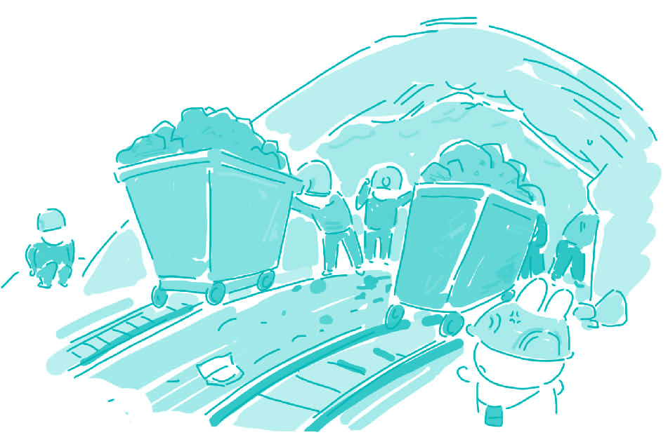

> ###  译文

> **58. 商业是否可以为谋利益不择手段？**

> 每桩生意的终极目的都是盈利。不能盈利的生意将使公司难以成功，甚至难以维继。无论如何，作为社会的一员，企业必须遵守法律法规，老板对自己的员工和自己的企业所在的社区负有责任。

> 虽然激烈的竞争往往让企业采取极端的方式以确保获取利润，但是企业一定不能违法。不久前，现代经济中大量金钱的流动导致首席执行官和经理违背贸易规则。例如，公司不仅故意无视政府制定的环保标准，有时公司甚至还试图贿赂政府官员以保证他们不用遵守规则。这样的违法行为是可能发生的，因为有些公司的社会和政治影响力非常大。但是这种行为是不道德的，政府应惩罚违规者。

> 此外，经理必须意识到员工和他们的家人靠工资获得财政安全感。对很多公司来说，裁员或把工厂设到别的国家是个很好的盈利方法。可是，被裁掉或者转移的工作往往是一个社区赖以生活的支柱。例如，如果一家公司为了赚取更多利润而关闭五千人甚至一万人的工厂，那么这个有着与小城镇一样多人口的社团突然发现自己失业了。最直接的后果就是大面积的失业和当地经济的突然休克，不久，其引起的社会问题，如犯罪、无家可归、打架斗殴、滥用毒品等问题就会显现。这些都是企业想获取更多利润而带来的间接后果，但却是毁灭性的。公司的老板和经理应具有道义上的责任感，不能忽视他们的行为所带来的后果，不能不惜任何代价地寻求利益最大化。

###  Word List

 * dissolve ［diˈza:lv］ v. 溶解；解散
 * illegal ［iˈli:gəl］ adj. 违法的，不合规定的
 * international ［ˌintə:ˈnæʃənəl］ adj. 国际的
 * tremendous ［triˈmendəs］adj. 极大的，巨大的
 * regulation ［regjəˈleiʃən］ n. 规则，规章
 * employee ［imˈplɔii:］ n. 职工，员工
 * immoral［i ˈmɔ:rəl］ adj.不道德的，邪恶的
 * community［kə ˈmju:niti］n.公社，团体，社团
 * punish ［ˈpʌniʃ］ v. 惩罚，处罚
 * extreme ［iksˈtri:m］ adj. 极端的
 * violator ［ˈvaiəˌleitə］ n. 违反者，亵渎者
 * enormous ［iˈnɔ:məs］ adj.巨大的，庞大的
 * entire［enˈtaiə］adj. 全部的，完整的，整个的
 * contemporary［kənˈtempəˌreri］adj. 当代的
 * surface ［ˈsə:fəs］ n. 表面，外表；水面
 * deliberately ［diˈlibəritli］ adv. 故意地；有意识地
 * domestic ［dəˈmestik］ adj. 家庭的； 国内的
 * bribe ［braib］ v. 贿赂，向…行贿
 * abuse ［əˈbju:z］ n. 滥用，虐待，辱骂
 * official ［əˈfiʃəl］ n. 官员，公务员
 * maximize ［ˈmæksəˌmaiz］ v. 最大化；取最大值
 * bypass ［ˈbaiˌpæs］ v. 设旁路；迂回

## 59. Live life in a hurry or at a slower pace?

I used to live at a frantic pace. My wristwatch dictated my life, and the hands of the clock pushed me forward to my next appointment, my next assignment, and my next social engagement. However, I have managed to relax. Now that I live my life at a slower pace I have become a better student, a more reliable friend, and a person who enjoys life much more than before.

Living life at a slower pace has allowed me to pay much more attention to detail and to work through my assignments at school more thoroughly. Before I was always rushing through my reading and my writing, and my concentration was not very strong. The clubs and sports teams I belonged to demanded a lot of attention. After I decided to get rid of some of the more involved activities I had more time to focus on my studies and the results have shown in my marks.

While I am still busy with school and extra curricular activities, I also make a point of slowing down and taking a step back in order to prioritize the things in my life. This allows me to evaluate how much time I should spend on one thing or another. For example, while I was hurrying through my schedule I often lost track of my friends. I forgot about dates that we made and things that I agreed to do for them. This will not happen now. By slowing down the tempo and realizing how important my pals are to me, I have once again become a reliable friend.

Lastly, living life at a slower pace allows me to appreciate the good things in my life. In the past I would only think about the things I would have to get accomplished next. This anticipation did not allow me to concentrate on the moment, but now I am able to enjoy a family dinner or an afternoon at the movies with my friends without worrying about what I am supposed to do next.

> ###  译文

> **59. 慢节奏生活还是快节奏生活？**

> 我过去经常快节奏地生活。手表指挥着我，时钟的指针催促我赶赴下一个约会、赶做下一个任务、赶往下一个场所。但是，我需要放松。现在我以较慢的节奏生活，而变成了一名好学生，一个更可靠的朋友，和一个比以前更会享受生活的人。

> 以更慢的速度生活使我开始注意细节，在学校里完成作业时更认真。以前我总是急着读、急着写，不能完全集中注意力。我所在的俱乐部和体育队需要我更多的参与。在我决定从活动很多的几个俱乐部中退出后，我有了更多的时间集中注意力学习，这样做的好处已经在我的分数上显现出来了。

> 虽然我的学业还是很忙，我开始慢下节奏来审视自己的生活中到底哪些应是优先考虑的。这使我考虑自己应该在一件事情上花多长时间。例如，当我忙于按照制定的日程表前行的时候，我往往就把朋友忘记了。我会忘掉我们的约会或者忘记自己曾许诺要为他们做的事。但是现在这种情况不会再出现了。我放慢生活的节奏、意识到朋友对我来说有多重要后，我重新成为一个可信赖的朋友。

> 最后，慢节奏生活使我有时间欣赏生命中的美好事物。在过去，我总是在想下一步要完成什么任务。这种想法使我不能把注意力集中在手头上的事情。但是现在，我可以享受家庭聚餐，或者一整个下午和朋友们一起看电影，而不再担心下一步要干什么。

###  Word List

 * frantic ［ˈfræntik］ adj. 狂乱的，疯狂的
 * wristwatch ［ˈristˌwa:tʃ］ n. 腕表，手表
 * dictate ［ˈdikˌteit］ v. 口述，口授；指令，指示
 * appointment ［əˈpɔintmənt］ n. 约会；指定
 * assignment ［əˈsainmənt］ n. 分配；任务
 * reliable ［riˈlaiəbəl］ adj. 可靠的，可信赖的
 * concentration ［ˌka:nsenˈtreiʃən］ n. 集中；集合；专心
 * extra ［ˈekstrə］ adj. 额外的
 * curricular ［kəˈrikjələ］ adj. 课程的
 * prioritize ［praiˈɔriˌtaiz］ v. 把…区分优先次序
 * evaluate ［iˈvæljuˌeit］ v. 评价，评估
 * schedule ［ˈskedʒu:l］ n. 时间表，进度表
 * tempo ［ˈtempəu］ n.（音乐的）速度，拍子
 * appreciate ［əˈpri:ʃiˌeit］ v. 欣赏；感激
 * anticipation ［ænˌtisəˈpeiʃən］ n. 预期，期待

## 60. Are games equally important for adults and children?

Games are fun. This is true for adults and children alike. However, games also teach a variety of skills and they further every domain of a person'development. This is particularly important during the early stages of life.

Through games children learn gross motor and fine motor skills, they practice and develop the ability to use language, and they learn important interpersonal and social skills. Adults can use games to strengthen these areas, but their abilities are already much more advanced, and therefore games are more important for children.

In play a child learns gross motor skills such as walking or jumping, which an adult has already mastered. Pushing a shopping cart, for example, teaches a toddler to balance his/her weight and to use his/her legs to support his/ her body. This activity is game and exercise at the same time, but it would be completely unnecessary for adults. Similarly, fine motor skills and hand-eye coordination are areas in which a child has much more to learn than an adult.

Thus playing catch with a baseball has a much greater benefit to the young and inexperienced person.

Language games allow children to practice and strengthen their language skills. Even simple singsong or rhyming games aid in this development. Needless to say, due to their advanced language ability, adults would not get much out of these simple ditties. In comparison, adult language games such as scrabble don't build but fine-tune vocabulary ability. Children are not able to compete here because they have not yet amassed enough knowledge.

Elementary interpersonal and social skills ranging from communication to cooperation are also developed in play. Children learn systems of social rules when engaging in simple activities like pick-up football games. For example, they learn how to control themselves and to tolerate their frustrations around others. They also learn how to work in a team. These, of course, are abilities that are extremely important for adults as well, but, once again, children have more to learn.

> ###  译文

> **60. 游戏对于成年人和孩童同样重要吗？**

> 无论是对孩子来说还是对大人来说，游戏都很好玩。但是，游戏还可以教给你很多技巧，并能推进你自身发展的方方面面。在年轻的时候这尤其重要。通过游戏孩子学习到或简单或精细的动手能力，他们练习和发展了运用语言的能力，同时也学会了重要的人际交往和社交技巧。成年人可以通过游戏来加强这方面的能力，但是他们的能力已经很强了，所以游戏对孩子更重要。

> 在游戏中，孩子们学到了基本运动的技巧，如行走、跳跃等，而这些是成年人已经掌握的了。例如，向前推购物车，教正在学步的孩子学会平衡自己的身体、学会用自己的腿来支撑整个身体。这种活动既是游戏也是锻炼，但是对于成年人来说就完全没必要了。同样，良好的动手能力和手眼协调能力也是孩子需要学习的领域。所以练习抓住垒球对年轻的而没有经验的人来说更有益处。

> 语言游戏使孩子可以练习和巩固自己的语言技能，即使是最简单的歌唱和韵律游戏都能帮助他们发展语言技能。不用说，由于成年人已经具有良好的语言能力，所以他们不可能从简单的游戏中获得什么。但恰恰相反，适合成年人玩的文字游戏，如拼字游戏，不是帮助他们建立语言能力，而是帮助他们调整其词汇能力。在这方面孩子是无法和成年人竞争的，因为他们还没有获得足够的知识。

###  Word List

 * variety ［vəˈraiəti］ n. 变化；多样性
 * ditty ［ˈditi］ n. 小调，小曲
 * domain［dəu ˈmein］ n.领土，领域；范围
 * scrabble ［ˈskræbəl］ v. 乱写，乱涂
 * particularly ［pəˈtikjələli］ adv. 独特地；显著地
 * amass ［əˈmæs］ v. 收集；积聚
 * elementary ［ˌeləˈmentəri］ adj. 初步的；基本的
 * motor skill 动手能力
 * toddler ［ˈta:dlə］ n. 初学走路的孩子
 * tolerate ［ˈta:ləˌreit］ v. 忍受，容忍
 * coordination ［kəuˌɔ:dˈneiʃən］ n. 同等；调和
 * frustration ［frʌˈstreiʃən］n. 挫败，挫折，受挫
 * rhyme ［raim］ n. / v. 韵；押韵

## 61. Should adults make important decisions for their older teenage children?

Parents or other adult relatives should not make decisions on behalf of their older teenage child. Nevertheless, they must take an active part in the decision

making process of their offspring. They can use their knowledge and experience to prevent their teenager from making costly mistakes while allowing him/her to gain confidence and learn from his/her smaller errors so that he/she will be able to make mature decisions of his own in the future.

Teenage children often lack the experience and knowledge to make sound decisions, and here their parents' input is valuable and necessary. Finding the right university or the right job after graduating from senior school is an example for this. A teenager has not worked before and never attended a university, and thus his knowledge in both areas is extremely limited. Here the parents should advise their child and ensure that he/she makes the right decision.

In order to be able to make sound decision in the future a young adult must gain confidence, and parents can help by engaging him/her in dialogue and providing him/her with all the necessary information. A child between the ages of 15 and 18 will be able to recognize the best arguments and reasons. Through the parents' guidance he/she will arrive at the correct decision and feel as though it was completely his/her own. Not only will he/she continue to seek the reliable advice of his/her parents, but the self-confidence gained from this experience will make it easier for him/her to make decisions in the future.

While parents should guide or direct their child, sometimes it is helpful to allow him/her to make a mistake. This will teach the child to live with the consequences of a wrong decision and also to ponder future choices more carefully. For example, a child might ignore his/her parents' advice and pick a summer job that sounds very interesting initially, but which he/she comes to loathe almost immediately. This experience will be invaluable when the child grows up and has to find a real job.

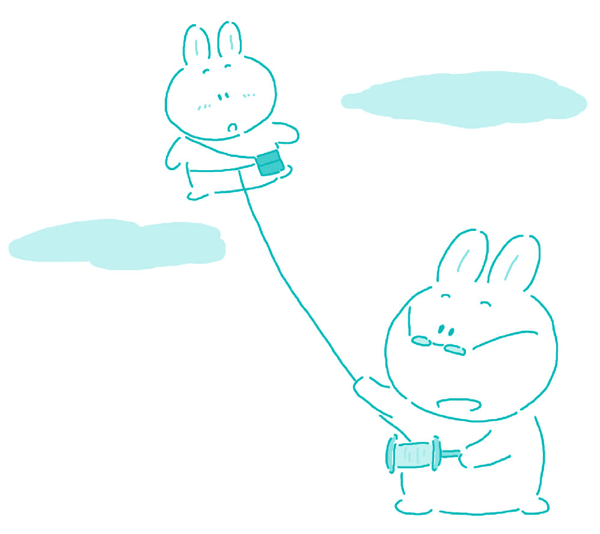

> ###  译文

> **61. 成人是否应该为接近成年的孩子做重要的决定？**

> 家长和成年亲属不应为年龄大的孩子做任何决定。但是，在孩子做决定的过程中，他们必须积极参与，给出建议。他们可以用自己的知识和经验阻止孩子做出将付出代价的错误决定，但是也不能打击孩子的自信心，应该允许孩子从小错误中学习，以培养他将来做出成熟决定的能力。

> 十几岁的孩子往往缺乏经验和知识，不能很好地做出决定。这时父母的建议就非常可贵和必需了。高中毕业后寻找一个合适的大学或工作就是这样的例子。十几岁的孩子以前没有工作过，也没有上过大学，所以在这两方面他的知识都非常匮乏。这时父母应该给出建议，保证孩子做出正确的选择。

> 如果想在将来能做出正确的决定，年轻人必须充满自信。父母可以通过和他谈话、提供必需的信息来建立他的自信心。15至18岁的孩子已经能够辨认出什么论据和论点更有说服力。通过父母的引导他可以做出正确的决定，并且还会觉得这个决定完全是自己做出的。这样他不仅会继续寻求父母的帮助，让他们给出可靠的建议，还能从做出决定的过程中获得自信，以后再做决定就不是件困难的事情了。

> 父母在引导孩子的时候，允许他们偶尔犯错误也是很有益处的。因为这会使孩子知道错误决定带来的后果，在以后做出决定时更加谨慎。例如，孩子可能不听父母的建议，找了个听起来很好听的假期工作。但是他很快就厌倦了这个工作。当孩子成年后真正找工作时这种经历就显得非常有意义了。 

###  Word List

 * on behalf of 代表…
 * teenage ［ˈti:nˌedʒ］ adj. 十几岁的
 * offspring ［ˈɔ:fˌspriŋ］ n.（单复同）儿女，后代
 * confidence ［ˈka:nfidəns］ n. 信心；信赖
 * senior ［ˈsi:njə］ adj. 年长的；高级的
 * recognize ［ˈrekəgˌnaiz］ v. 认可，承认；认出
 * self-confidence ［ˌselfˈka:nfidəns］ n. 自信
 * ponder ［ˈpa:ndə］ v. 沉思，考虑
 * initially ［iˈniʃəli］ adv. 最初地，开头地
 * loathe ［ləuð］ v. 厌恶，憎恶

## 62. What do you appreciate most in a friend?

I appreciate all three qualities in my friends. It is important to me that my friends are intelligent, because I value intellectually stimulating conversation on meaningful topics. On the other hand, a friend with a good sense of humor can entertain and understands how to ease my sorrows by making me laugh in difficult times. However, only the reliable friend, by virtue of his dependability and loyalty, is guaranteed to stand by me in difficult times, and thus reliability is the most important characteristic I look for in a friend.

In my last year of senior school my three friends and I decided that we would study together for the college entrance exam, but my smartest friend hardly ever showed. She was extremely intelligent and everybody, including our teachers, was certain that she would be admitted to one of the best universities in the country. As a result, she did not bother to study much. At our study sessions she would appear occasionally, but more often than not her visits would distract us rather than help us. We would end up talking about metaphysical concepts like the existence of god instead of studying our lessons.

My humorous friend attended most of our meetings, but usually he was unprepared and we had to spend a lot of time getting him to speed up. He made us laugh, and he joked about how much better we were learning now that we had to teach him. Maybe he was right, but his constant lack of preparation became a steady source of frustration to the other two of us.

However, my third friend and I were able to rely on each other. We overcame our common frustrations and fears by completing the tasks we set out to do. During those long evenings when the work seemed unbearable we cheered each other up and kept working hard. Meanwhile our intelligent friend was minding her own business and our humorous friend was making somebody else laugh.

> ###  译文

> **62. 你最看重朋友的何种品质？**

> 我对朋友的这三种品质都很欣赏。对我来说，聪明很重要，因为聪明可以激发我们就有意义的话题进行对话。从另一方面来说，具有良好幽默感的朋友可以使人愉悦，在我痛苦的时候可以逗我发笑、忘记痛苦。但是，只有忠诚可靠的朋友，在我困难的时候才能确保站在我身边，所以我认为朋友应具备的最重要的品质是忠诚可靠。

> 在我高中生活的最后一年，我和几个朋友决定一起复习，准备高考。但是，我们中最聪明的那位从没出现过。她非常聪明，每个人，就连我们的老师，都认为她会被国内最好的大学录取。结果是，她不怎么用功复习。在我们学习的时候，她只偶尔出现过几次。可是，她的每次出现几乎都打扰了我们，而不是给我们帮了什么忙。我们往往以谈论“上帝的存在”等形而上的概念结束一天的复习，而不是一直在复习功课。

> 我最有幽默感的朋友倒是经常和我们一起复习，可是他往往根本就不做任何准备，我们不得不花很多时间等待他赶上我们的进度。他能够使我们大笑，他开玩笑说我们学得太好了，不得不花时间教他。他的话也许是正确的。但是他经常不准备功课，使我和另外一个在一起学习的朋友感到很伤脑筋。 

> 但是，我和第三个朋友就能够彼此信赖。我们共同完成自己设定的任务来克服挫折和恐惧。在那些漫长的难以忍受的黑夜中，我们互相鼓励对方不要放弃，坚持努力学习。而那时我们那个聪明的朋友正在忙自己的事情，幽默的朋友正在逗某个人发笑。

###  Word List

 * intelligent ［inˈtelədʒənt］ adj. 聪明的；机智的
 * ease ［i:z］ v.（使）悠闲，（使）放松
 * sorrow ［ˈsa:rəu］ n. 悲哀，悲痛
 * dependability ［deˌpendəˈbiliti］ n. 可信任，可靠性
 * loyalty ［ˈlɔiəlti］ n. 忠诚，忠心
 * college entrance exam 高考
 * admit ［ədˈmit］ v. 容许；承认；接纳，录取
 * metaphysical ［ˌmetəˈfizikəl］ adj. 纯粹哲学的
 * constant ［ˈka:nstənt］ adj. 不变的，持续的
 * rely on 依赖，依靠
 * cheer up 使振奋，感到振奋

## 63. Can difficult experiences become valuable lessons?

Sometimes experiences that are supposed to be easy and enjoyable turn difficult because unforeseen troubles arise. At other times problems simply turn out to be more difficult than expected, and this, in turn, causes great frustration. However, most difficult experiences will become valuable lessons for the future. They help us anticipate and prevent future mistakes, they allow us to recognize and solve problems more quickly, and they also make it easier for us to endure hard times.

After our family car broke down in the middle of nowhere, my father realized that he had taken his toolbox out of the trunk earlier that day. He, my mother, and I spent nearly the whole afternoon in the sweltering summer heat of late July waiting for the car mechanic to arrive. It turned out that there was only a minor problem with the engine that my father could have easily fixed himself had he had the right tools. That evening he put the toolbox back into the car and vowed never to make the same mistake again.

Math used to be a very difficult subject for me, but once I learned how to identify and distinguish the individual equations it became a whole lot easier. While I used to sweat blood and tears of frustration over my textbook, because I could not figure out where to begin, I am now familiar with the problems. As a result, I solve them in less time and I am much less frustrated.

My mother once told me that I was a much more difficult and painful birth than my younger sister. She joked with me that, as a result, I should treat her better and I was supposed to do more chores around the house. However, when she saw how upset her off-hand comment made me, she hurriedly explained that, while the time of delivery and other circumstances were nearly identical, being pregnant with me had prepared her for my sister's birth. The birth of her second child was easier to endure.

> ###  译文

> **63. 艰难的经历可以转化为可贵的教训吗？**

> 有些时候，看起来轻松愉快的经历可能会因为不可预见的问题而变得困难重重。有时，问题比想象中更难，这也会引起失败。但是，遭遇困难的经历往往能够成为你今后生活中可贵的教训。这些经历帮助你预见并防止将来发生错误，使你更快地认识、解决问题，还使你今后能够从容应对困难。

> 当我们的车在一个前不着村后不着店的地方突然坏了后，父亲想起早晨出发的时候他把工具箱留在家里了。我和爸爸、妈妈三个人在七月下旬的烈日下整整等了一下午才等到救援车。检查的结果是，车的发动机出了点小毛病，如果爸爸有工具很容易就能修好。晚上回到家中他把工具箱放到车上后，发誓再也不犯同样的错误了。

> 数学对我来说一向很难。但是当我学会怎样识别和区别每个方程式后，数学就变得简单多了。以前我常常对着课本难受得要掉泪，因为我不知该如何下手。但是现在我已经对问题很熟悉了。结果就是我现在解题的速度快多了，也不那么痛苦了。

> 妈妈曾告诉我生我的时候比生妹妹的时候更困难、更疼痛。因此，妈妈和我开玩笑说我应该待她更好些、应该做更多家务。但是当她看到自己随口所说的话使我难受的时候，她急忙安慰我说，虽然生我和生妹妹的时间、环境都非常相似，但是因为怀我才让她更有经验应付妹妹的到来，所以生第二个孩子比第一个容易。

###  Word List

 * foresee ［fɔ:ˈsi:］ v. 预见，预知
 * arise ［əˈraiz］ v. 出现，发生，起因于
 * turn out to be 结果是
 * solve ［sa:lv］ v. 解决，解答
 * sweltering ［ˈsweltəriŋ］ adj. 闷热的，中暑的
 * mechanic ［miˈkænik］ n. 技工，机械师
 * minor ［ˈmainə］ adj. 较小的，次要的
 * distinguish ［diˈstiŋgwiʃ］ v. 区别，辨别
 * frustrated ［ˈfrʌsˌtreitid］ adj. 失败的，感到挫败的
 * chore ［tʃɔ:］ n. 家务杂事
 * pregnant ［ˈpregnənt］ adj. 怀孕的； 重要的

## 64. Be self-employed, work for someone else, or own a business?

There are advantages to all three kinds of employment. Owning one's own business might very well be the fastest way to fortune. Working for an employer, on the other hand, is often less risky and usually there are fewer responsibilities. However, I would like to be self-employed. Being self-employed would cater to my strength of working independently, it would give me a maximum of professional and personal freedom, and I would not have to take responsibility for the continued financial security of any employees and their families.

I am a perfectionist and enjoy working by myself. When I work in a team or together with a group of people, usually the others' quality standards are much lower than my own. Furthermore, I like to be involved in every step of the development process. For example, if I could become a journalist I would like to be self-employed because I would be responsible for researching, writing, and editing. At most major newspapers and magazines these are three different areas.

Another great benefit of being self-employed is the ability to balance personal life and career. When working for a major company I would have to work on assignments that don't interest me very much. Also, it would be difficult for me to take vacation time whenever I needed. However, as a self-employed person I can decide which jobs I want to take and which jobs to reject. Nobody would order me around. Also, I could design my own work schedule and adjust or change it if it interfered with my personal life.

Lastly, as a self-employed professional I would neither have to give orders nor take orders. After all, I don't work for anybody and nobody works for me. As I am not very fond of managing people and even less interested in being bossed around, the independent or self-employed work would suit me just fine.

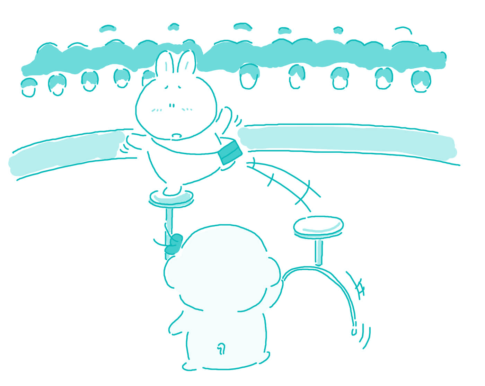

> ###  译文

> **64. 自己单干，受雇于人，还是拥有自己的公司？**

> 三种工作方式各有好处。拥有自己的公司也许是迅速致富的最佳途径。另一方面呢，受雇于他人比较保险，承担的责任也小。但是我还是喜欢自己单干。自己单干可以培养自己独立工作的能力，无论是工作时还是下班后都享有最大的自由，也不用为员工和他们家庭的财政安全承担责任。

> 我是个完美主义者，喜欢一个人工作。当我在一个团队或者小组里工作时，通常他们的工作标准比我的低。另外，我喜欢亲身经历事情发展的每一阶段。如果我能成为一名记者，我喜欢成为一名单干的记者，因为我喜欢为采访、写作和编辑全程负责。但是在大多数报社和杂志社里这三个程序是由不同的人完成的。

> 自己单干的另一大好处是可以平衡自己私人生活和工作之间的关系。如果受雇于一家大公司，你就不得不干自己毫不感兴趣的工作，同时，你不能在需要休假的时候就休假。但是，如果自己单干，自己可以决定该干什么、不该干什么，没有人在我周围发号施令。同时，我还可以安排自己的工作时间，如果工作干扰了我的个人生活，我还可以调整工作时间。

> 最后，自己单干，我不用听别人的命令也不用对别人发号施令。毕竟，我不为别人干活，也没有人为我效劳。既然我并不喜欢管理别人更不喜欢被别人管理，单干正适合我。

###  Word List

 * advantage ［ədˈvæntidʒ］ n. 优势
 * cater ［ˈkeitə］ v. 满足
 * perfectionist ［pəˈfekʃənist］ n. 完美主义者
 * journalist ［ˈdʒə:nəlist］ n. 新闻记者
 * vacation ［veiˈkeiʃən］ n. 假期，休假
 * adjust ［əˈdʒʌst］ v. 调整，调节
 * interfere ［ˌintəˈfiə］ v. 干涉，打扰
 * suit ［sju:t］ v. 合适，适合

## 65. Should historic buildings be preserved or be replaced with modern buildings?

Tall glass towers, whose shiny facades are as cool as their air-conditioned insides, are becoming part of cityscapes from South America to North East Asia. In the process, old buildings are making room for the seemingly unstoppable advancement of modernity. Thus the face of the global city is changing, and city planners are facing the difficult choice of either preserving historic building or replacing them with modern ones. As there are strong arguments for either option, the final decision will depend on a thorough analysis of the specific situation at hand.

It is important to preserve historic buildings and parts of cities because they are part of the cultural heritage that gives identity to a community. Old homes and living quarters are a part of history, and, once destroyed, leveled, and buried under thousands of tons of concrete and steel, they will be lost forever. The constructions erected in their places in too many cases lack any sort of connection to the place. These buildings are anonymous and cultureless edifices that could stand tall in any other part of the world. They lack the charm and character of their historic predecessors.

Yet the construction of new buildings is a sign of modernization. Not only will many people find work in the process of building these structures, but their existence will attract future investments and thus greatly benefit the economy of an area or country. In addition, these new buildings often have lower maintenance costs in comparison to the aged constructions. More importantly, newly development homes and office spaces include the comforts of modern life, e.g. air-conditioning and modern kitchens, are thus comfortable to live in.

Sweeping generalizations are impossible here. A city government should try its best to preserve the old, historic charm of a city and its people. Yet at the same time, they have to look forward and modernize old, rundown buildings in an effort to make their city a more comfortable place to live in and a more successful place to do business. Therefore, a city should think about its general interests and goals and then try to make specific decisions in individual situations.

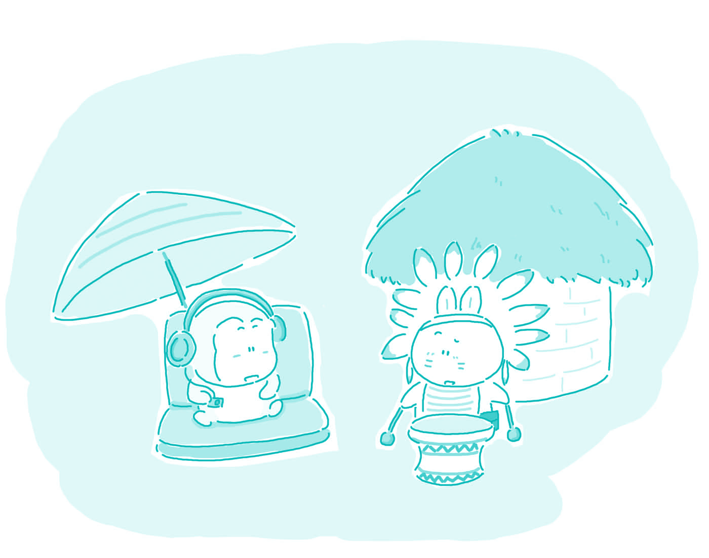

> ###  译文

> **65. 保护历史建筑还是该用现代化的建筑取而代之？**

> 现代潮流建筑外有高大的玻璃表面，内有空调。从南美到东北亚，这样的建筑正在变为城市一景。在这个过程中，旧建筑正在为似乎不断前进的现代化让出空间。因此，全球的城市面貌都在变化。城市规划者面临着一个两难境地：到底是该保护历史建筑还是该用现代化的建筑取而代之？两种观点都有很多支持者。最后的决定取决于对具体情况的全面分析。

> 保护历史建筑和城市中的历史遗迹非常重要，因为这些文化遗产使社区变得独特。古老的住宅、庭院是历史的一部分。一旦被破坏、铲平，或者被千万吨的水泥、钢筋埋在地下，它们就永远消失了。大多数情况取而代之的建筑往往与这个地方没有任何关系。这种建筑千篇一律，没有文化气息，可以矗立在世界上任何地方。它们没有古建筑所具有的韵味和特征。

> 然而，新建筑是现代化的一个标志。不仅是在兴建的时候可以提供大量的就业机会，单是它们的存在就可以吸引投资，为当地和国家的经济做出贡献。此外，与年岁久远的建筑物相比，新建筑物维修费用低。更重要的是，在新家或办公室里你可以享受现代生活的舒适，如空调、现代化的厨房等，所以这样的房子住着也舒服。

> 这个问题不可能有笼统的结论。政府应尽自己最大努力保护这个城市和人民的历史魅力。同时，他们也需要向前看，把破旧的建筑物现代化，使这个城市更适合居住、做生意。因此，一个城市应考虑自己的兴趣与目标然后再具体问题具体分析，最终做出决定。 

###  Word List

 * shiny ［ˈʃaini］ adj. 有光泽的，晴朗的
 * edifice ［ˈedəfis］ n. 大厦，大建筑物
 * facade ［fəˈsa:d］ n. 建筑物的正面，外表
 * charm ［tʃa:m］ n. 吸引力，魅力
 * cityscape ［ˈsitiˌskeip］ n. 都市风景
 * predecessor ［ˈprediˌsesə］n. 前任，前辈
 * modernity ［ma:ˈdə:niti］ n. 现代性
 * heritage ［ˈheritidʒ］n. 遗产，继承权；传统
 * comparison ［kəmˈpærisən］n. 比较，对照
 * concrete ［ka:nˈkri:t］ n. 水泥，混凝土
 * rundown ［ˈrʌnˌdaun］adj. 破败的，脏且失修的
 * erect ［iˈrekt］ v. 竖立，直立
 * anonymous ［əˈna:nəməs］ adj. 匿名的

## 66. Are classmates a more important influence than parents on a child's success in school?

It is extremely difficult, maybe even impossible, to generalize the relationships between parents and children. After all, personalities, temperaments, and values differ from person to person as does the ability to raise children. Furthermore, the relationship between parents and child changes over time, and the same is true for relationships between classmates. As a result, the question of who is a more important influence is difficult to answer, but what is undeniable is that parents should and classmates can have significant impact on a child's success in school.

Parents are responsible for raising a child, and they should instill the value of education on him. After all, a child who enjoys education and learning is more likely to do well in school. This success will open up all kinds of opportunities in his future, from studying at a reputable university to finding a good job. Therefore, parents should take an active interest in their child's education and help him through difficult times by encouraging and motivating him. Nevertheless, parents must be careful not to force their child to success, particularly in early adolescence. Many teenagers become temporarily alienated from their parents during this period of their life, and a parent's insistence on academic excellence against the child's will could further erode their relationship and also have a negative effect on the child's schooling.

Relationships to classmates have a significant effect on a child's academic performance, because it is in their company that most of a student's learning takes place. Since it is important for children of all ages to be accepted by their peers, much of a student's life is spent trying to fit in. Ideally, students will motivate and learn from each other, but often the opposite is the case. A student who shines in the classroom can become a social outcast, because his/ her classmates are jealous of his/her performance. This can then cause him/ her to become less inclined to study and work hard, because acceptance by the classmates is more important to him/her than high marks.

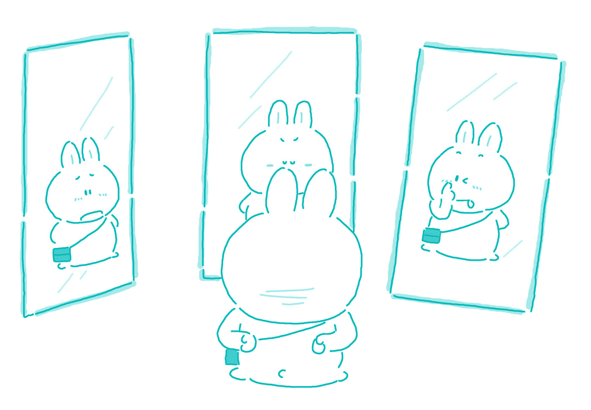

> ###  译文

> **66. 孩子学业上的成功，同学的影响比父母的更大吗？**

> 要想总结出父母和孩子的关系非常困难，甚至是不可能的。毕竟，每个人的性格、性情、价值观和培养孩子的能力都不一样。此外，父母和孩子的关系也是在不断发展变化的。同学之间的关系也是这样。因此，“谁对孩子的影响更大”这样一个问题就很难回答了。但是不可否认的是，父母“应该”，而同学“能够”对孩子的学业成功产生重要影响。

> 父母有责任抚养孩子，向他灌输教育观。毕竟，喜欢学习的孩子更有可能学习成绩好。这种学业上的成功可以为他将来的成功打开大门，如考入名牌大学、找个好工作等。因此，父母应对孩子的教育积极参与、鼓励、激发他们以助他们走出难关。但是，父母一定要注意不要逼孩子成功，特别是孩子在青春期时。在这个时期，很多青少年同父母的感情疏远，如果父母不顾他们的意愿一个劲地要求他们学习成绩要搞好的话，只能使他们的关系更加恶化，对孩子的学业反而产生不好的影响。

> 与同学的关系可以对孩子学习成绩产生很大影响，因为他们每天学习时都在一起。对任何年龄段的孩子来说，同伴的认可都是非常重要的，所以很多孩子的生活就是怎样融入同伴中去。理想的状况是同学们互相激励互相学习。可是事实往往恰恰相反。班级中的好学生可能最终被群体所抛弃，因为同学们妒忌他或她的出色表现。因而他就不再认真学习、工作，毕竟对他或她来说，被同伴接受比高分数更重要。 

###  Word List

 * generalize ［ˈdʒenərəˌlaiz］ v. 归纳，概括
 * insistence ［inˈsistəns］ n. 坚持，坚决主张
 * temperament ［ˈtempərəmənt］ n. 气质，性情
 * academic ［ˌækəˈdemik］ adj. 教学的；学术的
 * instill［in ˈstil］ v.慢慢地灌输，逐步的灌输
 * erode ［iˈrəud］ v. 侵蚀，腐蚀
 * reputable ［ˈrepjətəbəl］ adj. 著名的；有名声的
 * peer ［piə］ n. 同等的人，同辈；贵族
 * fit in 装配好
 * motivate［ ˈməutəˌveit］ v.引起动机；激发
 * outcast ［ˈautkæst］ n. 被驱逐者，流浪者
 * adolescence ［ˌædlˈesəns］ n. 青春期
 * jealous ［ˈdʒeləs］ n. 妒忌的，猜疑的
 * alienate ［ˈeiljəˌneit］ v. 离间；使疏远
 * incline ［inˈklain］ v.（使）倾向于

## 67. Hire an inexperienced worker with low salary or an experienced one with high salary?

A company's human capital might very well be its greatest asset. As a result, a lot of thinking has to go into hiring a new employee. Naturally, in order to maximize profits, a company will want to employ a well-qualified candidate who is willing to work for very little money. Depending on the position that is to be filled, experience is an important qualification for which a company will have to pay a high salary, but often other intangibles such aptitude, initiative, and creativity are just as important, and they might be compromised by prior experience.

There are positions for which extensive experience is absolutely necessary or at least extremely helpful. For example, an airline will not hire inexperienced pilots to fly their biggest passenger planes for good reason, and an investment firm will not allow a recent college graduate to manage the portfolios of their most important clients. In these areas specialized knowledge gained from experience is mandatory. Similarly, when it comes to managing or supervising other workers, knowledge of the subject matter is important but even more important is the ability to communicate effectively. This skill can only be developed through experience. Therefore, a company that wants to be successful immediately will have to pay for this kind of experience.

Sometimes a company will be better off hiring a candidate with less experience. Not only will this prospective employee command a lower salary, but his/her lack of prior experience will allow him/her to learn new procedures more quickly, as he/she will not have to unlearn old ones. Similarly, employers often complain that seasoned workers have become rusty in their established routines. They lack the initiative and drive of their youthful counterparts. Finally, creative positions are often filled with people who have little experience because these individuals are still open to new trends and movements, as opposed to being committed to old fads. Therefore, if I was an employer, I would try to make a decision based on the requirements of the position I have to fill and the qualities of the candidates applying for the job.

> ###  译文

> **67. 雇用无经验低薪酬的员工还是有经验高薪酬的？**

> 一个公司的最大财产可能是它的人力资源。因此，雇用新员工需要花很多心思。很自然地，为了把利益最大化，公司希望雇用素质好而又价低的员工为自己工作。根据职位的不同，具备经验可能是很重要的资格，公司愿意出高薪聘用有经验的人。但是另外一些看不见的品质，如天资、主动性、创造性等也非常重要，不过可以由经验弥补。

> 有些职位需要非常丰富的经验，譬如，我们都能理解航空公司不会雇用没有经验的飞行员驾驶最大的客机，投资公司也不会让新招聘的大学毕业生管理最重要的客户资料。同样，在管理员工的时候，虽然相关专业知识很重要，但是有效交流的能力更重要。这种能力只能靠以往的经验获得。因此，希望迅速成功的公司应聘用有经验的员工。

> 有时公司雇用没有经验的员工反而更好。像这样有光明前途的员工不仅索要的薪水低，而且由于没有相关经验，他或她能更快地学习新程序，而不用忘记脑中原有的东西。同样，雇主经常抱怨老员工墨守成规。与年轻同事相比，他们缺乏创新、缺少动力。最后，创造性的职位往往由没有经验的人担任，因为他们能够接受新趋势、新发展，而不是抱着旧事物不放。因此，如果我是个老板，我会根据职位的要求和应聘者的条件做出决定。 

###  Word List

 * capital ［ˈkæpitl］ n. 资本，资产
 * portfolio ［pɔ:tˈfəuliˌəu］ n. 部长
 * salary ［ˈsæləri］ v. 薪水，薪金
 * mandatory ［ˈmændəˌtɔ:ri］ adj. 命令的；强制的
 * intangible ［inˈtændʒəbəl］ adj. 难以明了的；无形的
 * prospective ［prəˈspektiv］ adj. 未来的；预期的
 * aptitude ［ˈæptiˌtu:d］ n. 智能，聪明
 * initiative ［iˈniʃətiv］ n. 主动权，主动
 * procedure ［prəˈsi:dʒə］ n. 程序，手续
 * compromise ［ˈka:mprəˌmaiz］ v. 妥协，折衷
 * rusty ［ˈrʌsti］ adj. 生锈的；迟钝的
 * fad ［fæd］ n. 时尚；一时流行的狂热
 * pilot ［ˈpailət］ n. 飞行员；领航员

## 68. Is daily homework necessary for students?

For students the only good homework is no homework. This has been a truism for as long as schools have existed. However, the practice of newly acquired knowledge and the preparation for new lessons are essential parts of the learning process. Teachers understand this and give assignments accordingly. Nevertheless, there is such thing as too much homework. Whether daily homework is useful or not depends on the age of the students and the subjects in which the work is assigned, and teachers also have to take into account the possible negative effects of overwork.

The age of a student or, better yet, the stage of the personal development of a student has to be considered when deciding on the amount of homework assigned. Elementary school students respond differently to daily homework than senior school students. They are more limited in their ability to concentrate on a subject and take in knowledge. These are skills that are developed over time. In addition, they will need to learn other important lessons, for example how to interact socially and behave in a group of their peers. Thus, instead of daily homework, these students need time to play with their friends.

The need for daily homework also differs from subject to subject. For example, in the areas of mathematics and languages continuous engagement with the subject matter is necessary, because it allows a student to internalize important concepts and mechanisms. In the field of history, on the other hand, it is more important that students grasp greater concepts. Memorizing dates and places is important, surely, but, if forgotten, these can always be looked up in the textbook. In these subjects daily homework is not only unnecessary but it might discourage students from taking an interest in the topic.

After all, learning is largely a voluntary activity, and teachers have to consider the possibility that too much homework will frustrate the students. As a result, students might become less interested in the subject or less willing to learn. Consequently, the good intentions of the teacher could very well have the opposite effect and a student will learn less.

> ###  译文

> **68. 日常家庭作业对于学生是否必要？**

> 对学生来说，最好的作业就是没有作业。这种说法从学校存在的那一天就有了。但是，练习新学到的知识、预习新课是学习过程中重要的组成部分。教师都知道这一点，并以此给学生们布置作业。但是，作业太多也是一个问题。家庭作业是否有用取决于学生的年龄和作业所属的课程。在布置作业时，教师应考虑作业太多带来的负面作用。

> 在给学生布置作业时，必须考虑学生的年龄，或者说是学生的发展阶段。低年级的学生对作业的反应与高年级学生不一样。他们把精力集中在一门课程上获取知识的能力还比较低。这些能力是随着年龄的增长而提高的。此外，他们需要时间学习其他事情，例如，怎样和社会打交道、怎样和同伴相处等。因此，这些学生需要时间和伙伴们玩耍，而不是写作业。

> 家庭作业的多少也应因学科的不同而不同。例如，数学和语言课程需要经常练习，只有这样，学生才能把重要的概念和技巧变成自己的。而历史课程中，学生需要更多地掌握重要的概念。背诵事件发生的时间和地点当然非常重要，但是如果忘记了，查阅书本就能找到。在这样的课程中，家庭作业不仅仅是没有必要的，它还可能让学生因此而丧失了对这门课程的兴趣。

> 毕竟，学习是个主动的活动，教师应考虑作业太多可能使学生厌烦。结果，学生可能变得对这门课不感兴趣或者不愿学习了。因此，教师的好意产生了相反的后果，学生反而学得更少了。

###  Word List

 * truism ［ˈtru:ˌizm］ n. 公认的真理
 * acquire ［əˈkwaiə］ v. 获得，学到
 * take into account 重视；考虑
 * overwork ［ˌəuvəˈwə:k］ n. 过度操劳；加班
 * in addition 另外
 * interact ［ˌintərˈækt］ v. 互相作用，互动
 * mathematics ［ˌmæθəˈmætiks］ n. 数学
 * continuous ［kənˈtinjuəs］ adj. 连续的，持续的
 * internalize ［inˈtə:nəˌlaiz］ v. 使内在化
 * mechanism ［ˈmekəˌnizəm］ n. 机构，机制

## 69. Choose a subject that you have never had the opportunity to study

Students graduating from colleges today are not fully prepared to deal with the "real world." It is my belief that college students need to be taught more skills and information about personal finance management to enable them to meet the challenges that face everyone in daily life, which includes playing the credit game, planning their personal financial strategy, and consumer awareness.

Learning how to obtain and use credit is probably the most valuable knowledge a young person can have. Credit is a dangerous tool that can be of tremendous help if it is handled with caution. Having credit can enable people to obtain material necessities before they have the money to purchase them outright. But unfortunately, many, many young people get carried away with their handy plastic credit cards and awake one day to find they are in serious financial debt. Learning how to use credit properly can be a very difficult and painful lesson indeed.

Of equal importance is learning how to plan a personal budget. People have to know how to control money; otherwise, it can control them. Students should leave college knowing how to allocate their money for living expenses, insurance, savings, and so forth in order to avoid the "Oh, no! I'm flat broke and I don't get paid again for two weeks!" anxiety syndrome.

Along with learning about credit and personal financial planning, graduating college students should be trained as consumers. The consumer market today is flooded with a variety of products and services of varying quality and prices.

A young person entering the"real world" is suddenly faced with difficult decisions about which product to buy or whose services to engage. He/ She is usually unaware of such things as return policies, guarantees, or repair procedures, information of this sort is vital knowledge to everyday living.

For a newly graduated college student, the"real world" can be a scary place to be when he or she is faced with such issues as handling credit, planning a budget, or knowing what to look for, when to make a purchase and whom to purchase it from. Entering this"real world" could be made less painful if people were educated in dealing with these areas of daily life. What better place to accomplish this than college?

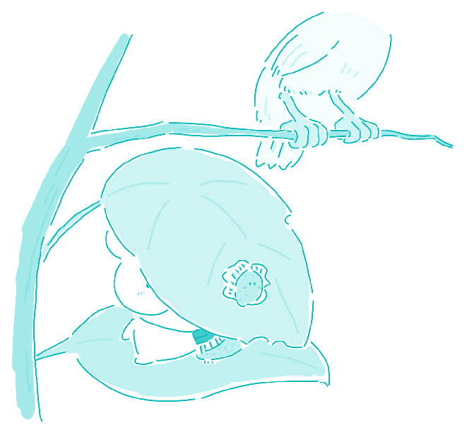

> ###  译文

> **69. 选择一门你从来没有机会学习的科目**

> 现在，从大学毕业的学生都没有为应对“现实的世界”做好准备。我认为，学校应该教给大学生更多技巧、提供给他们更多关于个人理财的信息来应对日常生活中每个人都将要面临的挑战，它包括：守信誉、个人理财和顾客意识。

> 学习怎样获得、使用信誉是年轻人将学到的最重要的知识。信誉是件危险的工具，但是如果小心使用则会帮很大的忙。有信誉的人可以在没有钱的时候购得所需的东西。但是不幸的是，太多太多的年轻人被手头的信用卡牵着鼻子走，当他们某天醒悟过来的时候，已经是债务缠身了。怎样正确使用信誉是个很难又很痛苦的课程。

> 同样重要的还有学习怎样理财。人们必须知道怎样控制自己的钱财，否则，将会被钱财控制。在毕业的时候，大学生应该知道怎样合理安排自己的生活费、保险费、储蓄等，避免以后出现“噢，不要！我简直破产了。还有两周才发薪，可是又没有钱了。”的窘迫局面。

> 在学习如何使用信誉和个人理财的同时，大学毕业生还应训练自己成为消费者。现在的消费者市场充斥着丰富的货品、服务，质量不一，价格不等。初入社会的年轻人会发现买什么牌子的东西、选谁的服务是件很困难的事情。他或她对退货、包修规定和修理程序等事情毫无意识。此类信息对每个人来说都很重要。

> 对于刚毕业的学生来说，现实世界可能是个可怕的地方，他或她需要处理信誉的问题、制定个人理财计划，买东西的时候需要知道该买哪一件，什么时候买，从哪里买。如果一个人受到过以上这些教育，他就能比较容易地进入这个现实的世界。除了大学，还有什么地方更适合教授这些知识呢？ 

###  Word List

 * challenge ［ˈtʃæləndʒ］ n. 挑战
 * budget ［ˈbʌdʒit］ n. 预算
 * credit ［ˈkredit］ n. 信任；信用
 * allocate ［ˈæləˌkeit］ v. 分派，分配
 * strategy ［ˈstrætədʒi］ n. 战略；策略
 * insurance ［inˈʃuərəns］ n. 保险；保险单
 * awareness ［əˈwεənis］ n. 知晓；意识
 * broke ［brəuk］ adj. 一文不名的
 * caution ［ˈkɔ:ʃən］ n. 小心，谨慎
 * syndrome ［ˈsindˌrəum］ n. 综合病症
 * purchase ［ˈpə:tʃəs］ v. 买，购买
 * be flooded with 溢满；覆满
 * outright ［ˈautˈrait］ adv. 直率地，痛快地
 * scary ［ˈskεəri］ adj. 吓人的，使人惊恐的
 * debt ［det］ n. 债，债务

## 70. Has automobile improved modern life or caused serious problems?

Over the course of the past one hundred years the automobile has become a staple of modern society, and its impact has been considerable. Yet the question of whether it has improved our lives or caused serious problems is irrelevant, because the automobile has done both. Consequently, we should develop its strengths and seek to correct the problems it continues to cause in order to reap greater benefits from this tool.

With the invention of the automobile the age of transportation shifted into another gear. Quickly it became possible for people to travel more comfortably and conveniently to destinations near and far, and the figurative world moved closer together. Trucks carried cargo across countries and soon became serious competition for trains and ships. As a result, food and other consumer goods have become available even in remote areas, overall living standards have improved, and the automobile industry, which has grown fantastically over the course of the past century, employs millions of workers worldwide.

However, as societal reliance and global economic dependence have grown together with the automobile industry, many significant problems have surfaced.

Car and truck exhausts pollute the air in metropolitan areas around the world and thus create serious health problems. The continued use of fossil fuel engines and the scarcity of oil have led to much political strife and even war, particularly in the oil rich region of the Middle East. As the powerful automobile industry remains reluctant and has yet to successfully promote an engine type that does not rely on gasoline power, the problem of fossil fuel shortage will become an even more serious problem.

Since the automobile is here to stay we must not only enjoy its conveniences, but we must also aim to reduce the problems it has caused, for example air pollution and over reliance on fossil fuel engines. In the same vein, we must encourage the usage of alternative fuel sources, which have been researched and developed successfully. Then the benefits of the automobile will outweigh the serious problems.

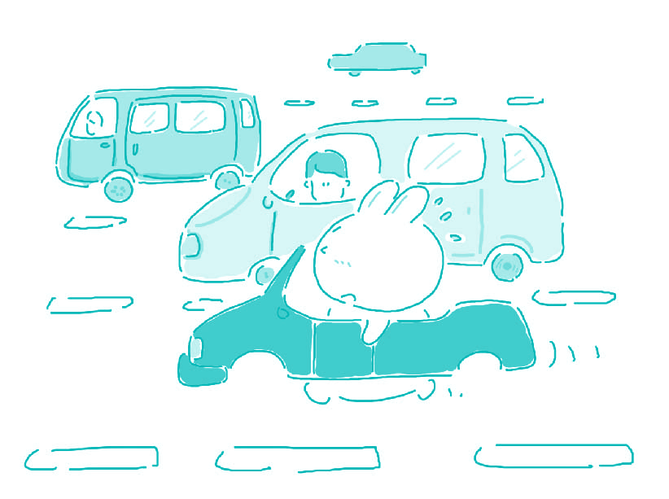

> ###  译文

> **70. 汽车改善了人们的生活，还是带来了严重的问题？**

> 在过去的一百年中，汽车成为现代社会的主要产品。汽车的影响越来越大。但是，“汽车到底是提高了人们的生活质量还是带来了严重的问题”这种问法并不正确，因为这两种情况都存在。因此，为了能够从汽车身上获得更多利益，我们应该发挥它的长处，纠正它所带来的问题。

> 随着汽车的发明，交通时代变换了。很快，不管目的地远近，人们都可以更舒适、更快地到达，世界似乎变小了。卡车可以跨国运货，很快就成为火车和船舶的重要竞争对手。因此，即使是边远地区，食物和其他各种商品也能买得到。人们的整体生活水平提高了。在过去一个世纪中，汽车产业飞速发展，百万名员工遍布世界各地。

> 然而，随着汽车产业的飞速发展，社会的依存性和世界经济的相互依靠性也在提高，很多严重的问题也显现出来。在世界各大城市，小汽车和卡车排放尾气，污染着空气，带来严重的健康问题。矿物燃料的持续使用和石油的缺乏导致了政治冲突甚至是战争，特别是在石油储藏量多的地方，如：中东地区。汽车产业持续强劲发展，而至今也没有研制出不依靠石油的发动机，石油短缺的问题将会成为一个严重的问题。

###  Word List

 * staple ［ˈsteipəl］ n. 主要成分；来源
 * overall ［ˈəuvərˌɔ:l］ adj. 全部的，全面的
 * irrelevant ［iˈreləvənt］ adj. 不相关的；不切题的
 * fantastically ［fænˈtæstikəlli］ adv. 空想地
 * societal ［səˈsaiitl］ adj. 社会的
 * reap ［ri:p］ v. 收割，收获
 * metropolitan ［ˌmetrəˈpa:litən］ adj. 大都市的
 * shift into 转移到…上
 * gear ［giə］ n. 齿轮，传动装置
 * fossil ［ˈfa:səl］ n. 化石；僵化的事物
 * conveniently ［kənˈvi:njəntli］ adv. 便利地，方便地
 * fuel ［fju:əl］ n. 燃料
 * strife ［straif］ n. 斗争，冲突，竞争
 * destination ［ˌdestəˈneiʃən］ n. 目的地；终点
 * promote ［prəˈməut］ v. 促进；发扬
 * gasoline ［ˈgæsəˌli:n］ n. 汽油
 * figurative ［ˈfigjərətiv］ adj. 比喻的
 * shortage ［ˈʃɔ:tidʒ］ n. 不足，缺乏
 * remote ［riˈməut］ adj. 遥远的，偏僻的

## 71. Choosing a job: high-paying with long working hours, or low-paying with short working hours?

I am optimistic that through my studies and continued hard work I will be able to find a job that will provide my future family and me with financial security. We should be able to afford the necessities of life, such as a modest home, enough food to nourish us and keep us in good health, as well as education for our children. Hopefully, I will find myself in the fortunate situation where I can decide between a high-paying job with long hours and a lowerpaying job with shorter hours. I would choose the job with the lower salary and greater personal time without hesitation, because my family and friends are the most important things in my life.

Time is the greatest investment I can make into the relationships with my wife and my children. A marriage is not just a decision one makes but a promise that one keeps. In order to do so one has to be there for the other person and share moments of joy as well as times of difficulty. Nowadays, too many relationships wither away as the partners are unable to work out their problems or bond through meaningful experiences. Personal careers become too important and family time becomes a rare occurrence.

The absence of one parent, due to professional career or divorce, can have a very negative effect on a child's development. The child might question his value to father or mother (depending on which one is continually absent) and develop low self-esteem. Without the presence of either or, worse, both parents, the child will be more likely to make bad decisions as he is lacking proper guidance. And there is one point should also be mentioned, i.e. neither expensive toys nor fancy clothes can compensate for this.

Lastly, I can derive more pleasure from spending time with my friends than I ever could from driving a sports car or taking luxury vacations. The inner peace and balance that I enjoy from their company are invaluable to me. Also, a million dollars in the bank would be worth nothing if I didn't have the time to enjoy these riches with my friends.

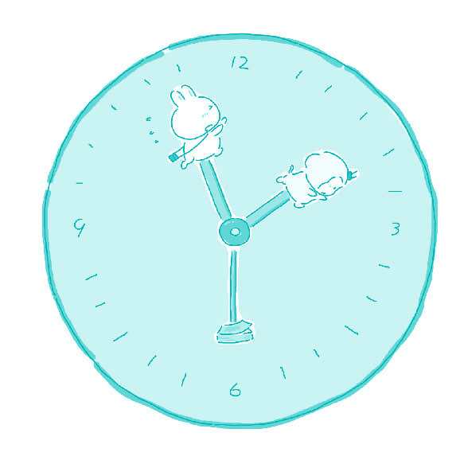

> ###  译文

> **71.选择何种工作：高薪但工作时间长，还是低薪但工作时间短？**

> 我乐观地相信，通过我的学业和一直努力的工作，我将能够找到一个可以为我将来的家庭和我自己提供经济保障的工作。我应该可以负担自己生活的必需品，诸如一所一般的房子，可以养活我们并能够使我们保持身体健康的足够的食物，还能为我们的孩子提供教育等等。我希望我能够非常幸运，可以在高薪而工作时间长的工作和低薪而工作时间短的工作之间做选择。那时，我将会毫不犹豫地选择那份虽然薪水少些但是拥有更多的、可以自由支配时间的工作，因为我的家庭和朋友们在我生命里是最为重要的。

> 时间是我能够为自己的妻子、孩子间的关系投入的最大投资。一场婚姻并不仅仅只是一个需要做出的决定，而是一个需要我们遵守的诺言。为了能够做到这一点，一个人必须要为了另一个人守在那里，并且共同分享快乐、分担困苦。现在，太多的关系随着伴侣不能有效地解决他们遇到的困难或束缚而渐渐淡化。工作变得过于重要，而留给家庭的时间变得非常稀少。

> 因为职业或离婚而失去双亲中的一方，这将会对孩子的发展产生负面的影响。孩子可能会对自己对于父亲或母亲（父亲还是母亲取决于哪一方的离去）的价值产生疑问，因此将会有自尊不足的倾向。没有父母中的一方，或者更糟的，父母双方都失去了，孩子将会更有可能做出错误的决定，这是因为他缺少正确的指导。并且，还有一点需要指出的是，即使是昂贵的玩具和华丽的服饰也不能弥补这一点。

###  Word List

 * optimistic ［ˌa:ptəˈmistik］ adj. 乐观的；有信心的
 * whither away 消失，不知去了哪里
 * have effect on 对…有影响
 * modest ［ˈma:dist］ adj. 谦虚的；适度的
 * self-esteem ［ˌselfiˈsti:m］ n.自尊，自尊心
 * nourish ［ˈnə:riʃ］ v. 滋养，使健壮
 * fancy ［ˈfænsi］ adj. 奇特的；华丽装饰的
 * hesitation ［ˌheziˈteiʃən］ n. 犹豫，踌躇
 * compensate ［ˈka:mpənˌseit］ v. 偿还，补偿
 * occurrence ［əˈkə:rəns］ n. 事件，发生的事情
 * derive from 得自，由来，衍生
 * absence［ ˈæbsəns］ n.不在，缺席，缺乏
 * luxury ［ˈlʌgʒəri］ adj. 奢侈，华贵，豪华
 * divorce ［diˈvɔ:s］ n. 离婚；脱离</li>

## 72. Do grades encourage students to learn?

Does grade really encourage students to learn, and guarantee a qualified education? Hardly. Given the opportunity, students spend time using their intelligence to figure out how to get a higher or top grade without doing the real work of the course and without thinking, rather than spending the same time thinking and exploring, regardless of what grade this may bring them. It isn't that these students are not motivated. It's just that they're not motivated to learn as much as they're motivated to get good grades. Once one became grade-oriented in your thinking, it is difficult for him/her to stop thinking that way.

Anybody who gets top grades is, in some sense, a winner of the system. But these seeming winners are, far too often, losers of a more important game. To win the grade competition in high school, most of these"winners" learned to ask what was expected of them and then do just that. They had to make sure they got high SAT scores by memorizing endless vocabulary words and by practicing a 1001 uses of the Pythagorean Theorem. They wanted to know from their high school teachers if the material being covered on a given day was going to be on the test, because they realized early on that the test is all that matters.

When these "successes" of the system arrive in college, they, of course, have not changed their attitudes. They fear open-ended assignments. They are impatient with discussions that are not going in any particular direction except where the interests of the discussants dictate, since they know that such discussions waste time that could have been better spent studying for a test. What these students have learned from school is the underlying message that the world is run by authorities who have definite points of view. The system has taught them that the way to get along in the world is to understand and to cater to those points of view espoused by the educational "authorities". Cleverness pays, but disagreement does not. Such students are in the process of becoming "yes men."

On the other hand, students who do less well in high school are often rebelling against curricula they see as irrelevant to their lives. This type of student judges what goes on in school according to how well it relates to his own day-to

day concerns. If algebra does not seem relevant to the problems such students face, then they see little need to pay attention to it. Under such circumstance, the school might have been able to embed algebra instruction inside a task they cared about, causing them to want to know algebra because it would help them do something they wanted to do. But schools generally don't like this, so the conclusion drawn by many students is that since so much is irrelevant, they might as well tune it out. These students learn to get by as well as they can, separating themselves from other kids who are willing to play the game.

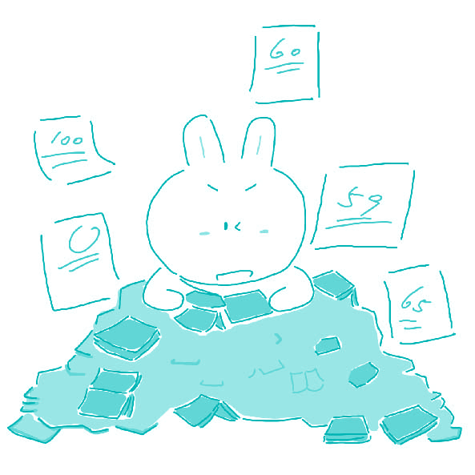

> ###  译文

> **72. 分数能激励学生学习吗？**

> 分数真的会鼓励学生学习和保证良好的教育吗？这几乎不可能。如果给学生们机会，他们会花费时间来运用他们的智慧去决定怎样不用做作业、动脑筋就能获取高分，而不是花时间思考和研究学习，他们不会去管思考和研究会带来一个什么样的分数。并不是学生没有动力，而是他们学习的动力不如想取得高分的动力大。一旦获取高分成为学生学习的目标，那么他们就不能停止想办法取得高分的念头。

> 从某种角度来说，取得高分的人是这个体制中的胜利者。但是，这些看起来胜利了的人却往往输掉了更重要的比赛。在高中阶段，为了在分数的竞争中取胜，大多数“胜利者”仅仅学会了去询问别人期待自己做什么，然后就照着这些目标和要求去做。他们通过没完没了地背诵单词、做1001道勾股定理的练习题来确保自己在学业能力测试中取得好成绩。他们会考虑从老师那里得知的某一天所讲授的知识是否会出现在考试里，因为他们很早就认识到考试才是最重要的。

> 当这种体制的“胜利者”考上大学之后，他们当然不会变换学习态度。他们害怕没有对错的作业。他们对于没有任何导向而仅凭兴趣进行的讨论也会感到很不耐烦，因为他们觉得这是在浪费时间，他们认为还不如花这些时间来准备考试。这些学生从学校里学到的就是：世界是由权威主宰的，任何观点都是由权威决定的。这种体制教给他们在社会上的生存之道就是：理解并迎合教育权威所持有的观点。迎合则获利，不合则无。而这样的学生逐渐会变成“只会说‘是’的人”。

> 从另一方面说，那些在高中时期学习不是很好的学生经常会反对学习那些与生活无关的课程。这种学生根据课程是否与自己的日常所关心的问题相关来判断其合理与否。如果代数看起来与他面临的问题毫不相干，他们就会认为不用在代数上花过多的心思。在这种情况下，学校就应该把代数题与他们关心的事情联系起来，使他们想学代数，让他们认为代数可以帮助他们解决自己想做的事情。但是学校往往并不这么想，所以很多学生得出的结论就是：既然毫不相关，那就不用学了。这些学生尽自己所能在这个分数体制下过活，与那些喜欢分数体制的孩子形成了鲜明对比。

###  Word List

 * grade ［greid］ n. 成绩，考分
 * discussant［diˈskʌsənt］ n.讨论者，谈论者
 * explore ［iksˈplɔ:］ v. 探险，探测，探究
 * definite ［ˈdefənit］ adj. 明确的，一定的
 * regardless［ri ˈga:dlis］adj.不管，不顾，不注意
 * espouse ［iˈspauz］ v. 支持，赞成
 * oriented ［ˈɔ:rientid］ ad. 以…为导向的
 * rebel against 反抗
 * Pythagorean Theorem 勾股定理
 * algebra ［ˈældʒəbrə］ n. 代数学
 * vocabulary［vəu ˈkæbjuˌleri］n.词汇，词汇量
 * embed ［əmˈbed］ v. 使插入，使嵌入
 * open-ended［ ˌəupənˈendid］adj.自由回答的
 * draw conclusion 下结论
 * impatient［im ˈpeiʃənt］ adj.不耐烦的，急躁的
 * tune out 关掉

## 73. Computers and human life

For every individual who praises the advent of the computer age there seems to be a computer phobic person. Truly, many people are having a difficult time warming up to this machine and its ubiquity. The computer appears to have made life more complex because it can be difficult to understand and it has quickened our pace of life and thus caused stress, but once people learn how to use it they will be able to appreciate the conveniences it has to offer.

Many people, especially older generations, are not familiar with computers and therefore uncomfortable with them. They find the machine's workings too complex and difficult to understand. Even the terminology seems like a completely different language, because twenty years ago nobody knew what words like software, hardware, or network connection meant. When people heard the word mouse they thought of a rodent. This has changed today, and few teenagers would make the same mistake as their grandparents.

It is also true that computers have quickened the pace of life by allowing us to communicate and do business more efficiently, and this can certainly result in stress. After all, time saved is usually spent on accomplishing more tasks, and thus personal and professional schedules have become more crowded. The stress factor increases yet again when the technology on which we rely breaks down.

Few people understand their computers well enough to fix them, and as entire companies depend on this technology to handle all of their business needs, a single broken computer can wreck a lot of havoc.

Nevertheless, computers and the Internet have become an integral part of everyday life. Computers are here to stay, because they facilitate many of our everyday processes and we have already grown dependent on them. Today computer owners use their machines not only to communicate and do business but also for entertainment. As people learn more about computers they will become more comfortable with them, and technological progress will fix many of the small annoyances that cause stress to their owners.

> ###  译文

> **73. 电脑与人类生活**

> 对于那些称赞电脑时代到来的人来说，也有患上电脑恐惧症的人。确实如此，很多人是非常艰难地熟悉了电脑，适应了电脑的无处不在。电脑好像把生活变得更为复杂了，因为电脑很难让人搞懂，电脑把我们生活的节奏变快、给我们带来压力，但是人们一旦知道怎样使用电脑，就开始夸赞它给生活带来的方便了。

> 有很多人，特别是老年人，不熟悉电脑，因而他们觉得电脑让人很不舒服。他们觉得电脑操作过于复杂、又很难懂。他们甚至认为电脑术语也是一种完全不同的语言，因为在二十年前没有人知道“软件”、“硬件”、“联网”是什么意思。当人们听到“鼠”的时候，脑中会浮现出一种啮齿动物。而现在这种情况变了，没有几个青少年会再犯他们祖父母所犯的错误。

> 电脑使我们的交流和做生意更加方便、生活更加快捷，但是与此同时也给人们带来了压力。毕竟，人们可以用节省出来的时间去做更多的工作了，私人时间的安排和工作的安排也更为紧密。当我们所依赖的技术不能正常工作时，我们的压力就加大了。没有多少人会修理电脑，当整个公司的业务都要通过电脑处理时，一台电脑出现毛病就可能导致混乱。

> 然而，电脑和互联网已经成为人们生活中不可分割的一部分。电脑注定要生存下去，因为它们使我们的日常生活便利化，我们已经变得依赖电脑了。今天，拥有电脑的人不仅用机器与人交流、做生意，还能用以娱乐。随着人们对电脑的日益了解，电脑将会使人们生活得更加舒适，而且技术的进步必将使那些给人们带来压力的琐碎烦心事不再出现。

###  Word List

 * praise ［preiz］ v. 赞扬，称赞
 * advent ［ˈædˌvent］ n. (尤指不寻常的人或事) 出现，到来
 * phobic ［ˈfəubik］ adj. 恐惧症的
 * ubiquity ［ju:ˈbikwiti］ n. 到处存在
 * be familiar with 熟悉
 * terminology ［ˌtə:məˈna:lədʒi］ n. 术语，专门名词
 * rodent ［ˈrəudnt］ n. 啮齿动物
 * pace ［peis］ n. (一) 步；速度
 * havoc ［ˈhævək］ n. 大破坏，浩劫
 * integral ［ˈintigrəl］ adj. 完整的，整体的
 * facilitate ［fəˈsiliteit］ n. 使容易；推动，促进
 * annoyance ［əˈnɔiəns］ n. 烦恼，可厌之事

## 74. Is traveling in a group led by a tour guide the best way to travel?

Those lucky enough to travel, particularly those fortunate enough to visit foreign countries, face the decision of traveling in a group with an experienced tour guide or traveling by themselves. The choice is a difficult one as both ways of travel have advantages. Personally, I believe that, although traveling in a group with a tour guide is obviously convenient, the benefits are often not significant enough and in many ways traveling in this kind of way can limit one's travel experience.

The conveniences of group travel with a tour guide include the fact that one easily meets other people and thus has a more enjoyable and comfortable travel experience. This is particularly important when traveling in a foreign country where a language barrier prevents interaction with the locals and isolation can become a problem. The tour guide is often experienced in generating a jovial atmosphere within the group, and his/her knowledge of the foreign culture and places of interest provide travelers with a greater appreciation of their trip. Also, and maybe most importantly, when traveling with a guide the individual traveler normally does not have to worry about hotel reservations and transportation. Those aspects are taken care of.

On the other hand, convenience might not be important to a traveler, and traveling alone allows far more personal freedoms. For example, one can easily make changes to the travel itinerary. The traveler can choose to stay in certain places or move on more quickly than otherwise possible, because he does not follow a set schedule. Learning about culture and places of interest is also easy as that information is readily available in books. Furthermore, travelers tend to congregate, and it is very easy to meet fellow vacationers who might have insightful tips as far as where to go and what to do. Generally, basic command of the English language suffices to have such informative exchanges with other travelers and locals, who are often eager to share their customs and culture.

Therefore, traveling outside a large tour group can result in a richer and more genuine experience, and I believe this experience to be more exciting to me.

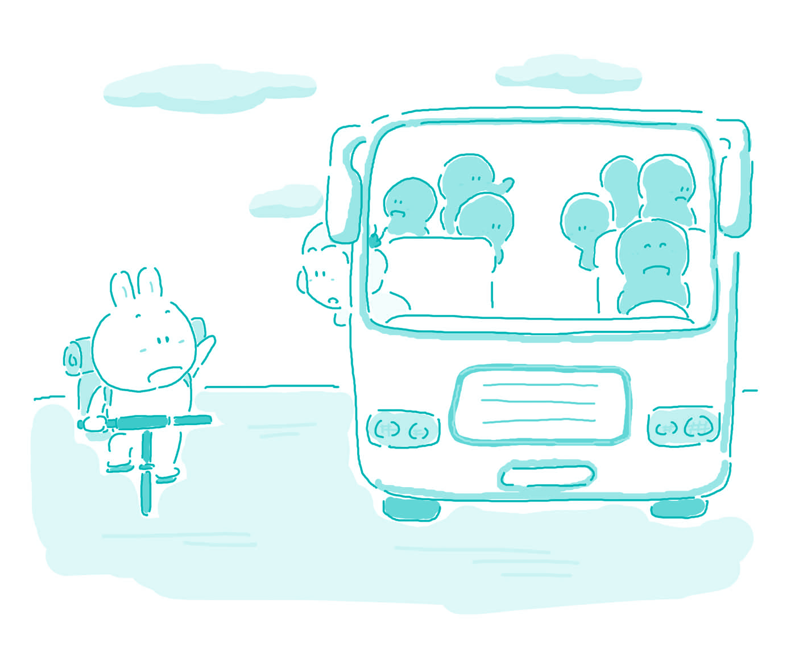

> ###  译文

> **74. 跟团旅行是最好的旅行方式吗？**

> 那些能有幸到处旅游，特别是能够到国外旅游的人，面临着跟团旅游还是自己独自行动的选择。两种方式各有好处，所以在这二者之间做出选择也不是件容易的事。我个人认为，虽然跟团旅游非常方便，但其好处并不特别显著，而且在很多时候跟团旅行会限制你的旅行体验。

> 跟着有导游的旅行团一起出游非常方便。你可以很容易地找到一起出行的人，由此获得更加快乐和舒适的旅行体验。这一点在出国旅行中尤其重要。这是因为由于你可能存在语言障碍，所以不能和当地人进行交流，好像是被社会隔离了一样。导游往往善于在旅行团中制造快乐的气氛，他对异域文化和名胜古迹的了解能使旅行的人更好地享受旅行。同时，可能也是最重要的一点，随团旅行时不用自己考虑交通和住宿的问题。因为这些早有人替你安排妥当。

> 另一方面，对有些旅行者来说，个人的自由比方便更为重要，例如，自己就能够很容易地决定改变旅行的路线。由于并没有固定的日程安排，自助旅行者可以选择待在某个地方或是立刻离开。学习当地文化、参观名胜古迹也非常简单，因为这些信息在书上都有。此外，自助的旅行者们喜欢在一起交流信息，这样他们就能很容易地从有经验的度假者中得知要去哪里、做些什么等信息。总的来说，只要掌握基本的英语就能和其他旅行者或是当地人进行交流，而他们也很希望把自己的文化和风俗习惯介绍给其他人。

> 因此，不随一个很大的旅行团旅行可以使你获得更加丰富和真实的旅行体验，而且就是这种体验更能使我兴奋。 

###  Word List

 * tour guide 导游
 * itinerary ［aiˈtinəˌreri］ n. 路线，旅行计划
 * barrier ［ˈbæriə］ n. 障碍物，屏障
 * congregate ［ˈka:ŋgriˌgeit］ n. 隔绝，隔离，绝缘
 * isolation ［ˌaisəˈleiʃən］ v. 使集合；聚集
 * insightful ［ˈinˌsaitfuəl］ adj. 富有洞察力的
 * jovial ［ˈdʒəuviəl］ adj. 快活的，高兴的
 * exchange ［iksˈtʃeindʒ］ n.&v. 交换，兑换；交流
 * atmosphere ［ˈætməsˌfiə］ n. 大气；气氛
 * reservation ［ˌrezəˈveiʃən］ n. 保留，预定
 * custom ［ˈkʌstəm］ n. 习惯，风俗
 * freedom ［ˈfri:dəm］ n. 自由，自主，直率
 * genuine ［ˈdʒenjuin］ adj. 真实的，真正的

## 75. Should students be required to take classes in many subjects or to specialize in one subject?

Universities that require their students to take classes in many subjects offer a very different educational experience from the universities that encourage specialization. As higher education becomes a more accessible commodity students will be able to choose between these two different forms of instruction. The answer to the question of which system is better depends on the student's interests and the goals of their studies.

Students who complete a degree at a university which requires them to take classes in many different subjects will receive a well rounded education. Here they will be able to develop their knowledge in different areas, and they will also have the opportunity to find out what their interests really are as they will be exposed to a variety of fields of study. Therefore, this kind of university is ideal for students who have many interests or don't know what their interests are. Also, students who have an interest in education and consider the possibility of graduate school will be able to gain a broader knowledge base before specializing later on in their academic careers. They will be able to pursue education for education's sake and not just to learn a trade. When they try to find work after graduation their versatility will allow them to apply for a wide range of jobs. On the other hand, students who specialize will have a great advantage over students who don't when it comes to finding a job in their specific field of study.

Naturally, companies will be most interested in job applicants who have superior knowledge and can thus make the greatest contributions. At the same time, the specialization system allows students to focus on their interests and the subjects relevant to them. Students majoring in physics or chemistry would feel very out of place in a course on ancient poetry or Western literature. They might consider it a waste of their time and energy. This might then have a negative effect on their educational progress in general.

> ###  译文

> **75. 学生应该学习多门课程还是应该术业有专攻？**

> 要求学生学很多门课程的大学和鼓励学生选择专攻专业的大学会给学生带来不同的教育经历。随着大学越来越普及，学生可以在这两种教育模式中进行选择。究竟是哪种体制更好将取决于学生的兴趣和他们学习的目的。

> 在要求学生上很多门课程的大学里，到毕业的时候学生能得到全面的教育。他们在学校可以学习不同领域的知识，因为他们能接触更多的课程，以此来找出自己的兴趣点在哪里。因此，对于那些有着很多兴趣或者不知道自己对什么感兴趣的学生来说，这类学校是最适合他们的。同样，对知识感兴趣并且打算报考研究生的学生，可以在大学里学到更加广阔的知识，而打下良好的基础，然后在继续深造学业的时候确定自己的专攻方向。他们可以因为喜爱知识而学习知识，而不仅仅是为了学习一门专业知识。当他们毕业后找工作时，他们的多才多艺使他们能有更多的选择。

> 另一方面，在找工作的时候，有专业的学生比没有专业的学生更有优势。这很自然，因为公司会对那些具有专业知识，而能用其专业知识为公司做出最大贡献的求职者更感兴趣。同时，分专业的体制可以使学生更加专心于自己的兴趣和与自己兴趣相关的课程。专修物理或化学的学生可能对古诗词和西方文学不感兴趣，他们可能认为学习古诗词和西方文学是在浪费自己的时间和精力，但与此同时，这也可能对他们的整体教育产生消极影响。 

###  Word List

 * specialization ［ˌspeʃəliˈzeiʃən］ n. 特殊化；专门化
 * rounded ［ˈraundid］ adj. 全面的；圆形的
 * for sth.’ s sake 为了…的缘故
 * versatility ［ˌvə:səˈtiləti］ n. 多功能性
 * apply for 请求，申请
 * superior ［səˈpiəriə］ adj. 较高的；出众的
 * ancient ［ˈeinʃənt］ adj. 远古的，旧的
 * poetry ［ˈpəuitri］ n. 诗；诗意，诗情

## 76. Should children begin learning a foreign language as soon as they start school?

More and more international corporations build their business in my country, China. At the same time, more parents tell their children that English is one of necessities to be successful in the future. Students work so hard to master English that English learning related publications have always been on the top of the best-seller list.

It seems clear that one will be better off if he/she is a bilingual, and if the second language is English, even better! However, learning a foreign language must have been painful, since people are continuously creating all sorts of methods and suggestions on how to learn it more easily, more quickly, and more effectively. Some people propose that children should begin learning English as soon as they start school. But would it really work? Hardly.

It seems true that children have natural amazing ability to develop their language skills. Statistic figures show that a 6-year-old boy can virtually memorize nearly as many as 150 words a day! But things become different when the child is learning a foreign language. When children are learning their mother tongue, they are not alone, and they are learning with numerous handy aids around. Parents, friends, and all the people around them are talking the same language, without any grammar error and nearly uniform intonation and pronunciation. However, when they are learning a foreign language, all of those natural aids disappeared. And words become really foreign and abstract after they leave classes. And even worse, their teacher might have a bad accent or even wrong pronunciation. Some may adduce children in Luxembourg as evidence, but the point is that almost all parents in that place are trilingual!

Learning a foreign language well involves much more than merely memorizing handful vocabulary or several grammar rules. If a girl is able to say hello in a standard American accent, does that really mean she has learned a second language well, or she will go so far as to be a linguist? In fact, learning a foreign language in some sense is beyond the capacity of children, especially as little as first grade pupil, for language is used to express thoughts and ideas, both of which are naturally cultural and historical, and are sometimes too complex for children to comprehend. After all, learning earlier doesn't automatically guarantee learning quicker or better.

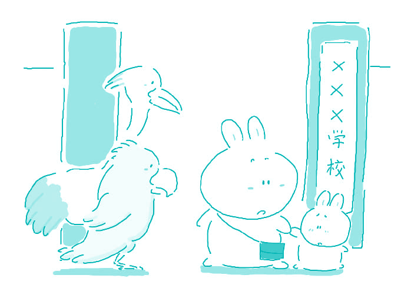

> ###  译文

> **76. 孩子是否应该一开始上学就学习外语？**

> 越来越多的跨国公司在我的祖国——中国，建立工厂。与此同时，越来越多的家长告诉自己的孩子，要想将来成功，必须要学好英语。学生努力学习以使自己能够掌握英语。这一切使得与英语相关的出版物在中国销量最好。

> 这种情况好像很明显：如果一个人掌握了两种语言，他的景况会比较好；而如果他的第二语言是英语，那么他的景况将会更好！但是，学习外语肯定是件痛苦的事情，要不人们为什么总是不断地研究出各种各样使人更容易、更迅速、更有效掌握英语的方法和建议等诸如此类的东西呢？有些人建议，孩子应该从上小学一年级开始就学习英语。但是这有用吗？其实几乎没有。

> 看起来孩子确实是在语言的学习方面有着惊人的能力。统计数字显示，一个六岁的男孩一天可以记住将近150个字。但是如果是在学习外语，情况就变得不同。孩子在学习母语的时候，不仅仅是他们自己在说，而且他们能从周围众多的“助手”身上学习。父母、朋友，还有他们周围所有的人都在用同一种腔调讲着同一种语言，而没有任何语法错误。可是，在学习外语的时候，所有的这些身边的自然的助手都消失了。并且在他们下课后单词就变得陌生而抽象。更糟的是，他们的老师可能会在发音中存有蹩脚的口音，有时甚至会有发音错误。有些人可能会拿卢森堡儿童来做例子，但是要知道，他们的父母几乎都是会说三种语言的！

> 学习一门外语并不仅仅意味着记住一些词汇和几条语法规则就行了。如果一个小姑娘会用标准的美音打招呼，这是否意味着她已经掌握了第二种语言，或者她已经成为了语言学家了呢？实际上，学习外语从某种角度来说超出了孩子的学习能力，特别是对于只上小学一年级的孩子来说。因为语言是用来表达思想的，而思想是从文化和历史中来的，但是这么小的孩子有时用母语还不能总结自己的思想，更不用说学习外语了。总之，过早的学习并不能保证学得既快又好。 

###  Word List

 * corporation ［ˌkɔ:pəˈreiʃən］ n. 公司，企业
 * intonation ［ˌintəˈneiʃən］ n. 语调，声调
 * as to 关于，至于
 * pronunciation ［prəˌnʌnsiˈeiʃən］ n. 发音，读法
 * best-seller ［ˌbestˈselə］ n. 最畅销的（书）
 * better off 变好，受益
 * abstract ［æbˈstrækt］ adj.抽象的，理论的
 * bilingual ［baiˈliŋgwəl］ adj. 能说双语的；双语的
 * obsolete ［ˈa:bsəli:t］ adj. 荒废的，陈旧的
 * accent ［ˈækˌsənt］ n. 重音，口音；重音符
 * statistic ［stəˈtistik］ adj. 统计的，统计学的
 * adduce ［əˈdu:s］ adj. 引证
 * mother tongue 母语，本国语
 * Luxembourg［ˈluksəmˌbə:g］ n.卢森堡公国
 * numerous［ˈnu:mərəs］ adj. 众多的，无数的
 * trilingual ［traiˈliŋgwəl］ adj. 能讲三种语言的
 * handy［ ˈhændi］ adj.手边的，唾手可得的
 * linguist ［ˈliŋgwist］ n. 语言学家

## 77. Should boys and girls attend separate schools?

In my country, China, many people in a sense live in a ridiculous culture where young boys and girls should never say"love" to each other. Moreover, it is absolutely a shame that such affairs happen in campus. To avoid alleged shame or danger of it, some people assert that boys and girls should attend separate schools.

The point is, is there anything wrong when a little boy says"I love you" to a little girl? Gone are the days when"love" was a forbidden word in our culture, it has now, nevertheless, actually quite different connotations from that of the word in western society. It can be seen that people in Hollywood movies often say "I love you" to almost everyone naturally, readily and easily, including friends, family members, partners in work, even an unknown taxi driver! But in China, not surprisingly, many people have never said"I love you" to their parents, even seldom to their mates or children."Love", in Chinese word, does in fact carry subtle connotations related to immoral affairs. It seems not a problem of is there anything wrong, but one of there must be something wrong if a teenager dares to say anything about "love!"

Even if there must be something wrong when a teenager falls into love, is it something so appalling even evil that adults have to take action to prevent or even fight? Did we ever discover any prudent evidence which clearly prove it is really something bad? Hardly. It is in fact quite natural that a little boy admire a beautiful girl or a little girl feels a smart boy appealing. And such emotions do not harm anything. Alleged"puppy love" simply is a nonsense concept invented by ignorance. Girls and boys actually do not even know what love is! Perhaps they merely imitate behaviors of adults around them. What we adults should do is not to make them believe"love" is evil, but to teach them what true love really means. Regrettably, those adults never realize that they actually fail to assume their responsibility, but presumptuously believe they are capable of eliminating love among boys and girls by separating them into different school. It will never work.

Separate school once was one of evil signs of discrimination of women, but today reemerges to prevent"love affairs" among teenagers—a high school in Beijing recently announced that it has already separated girls from boys into different classes. I can hardly imagine any benefit that such a scheme could produce except for further distortions of teenagers' natures.

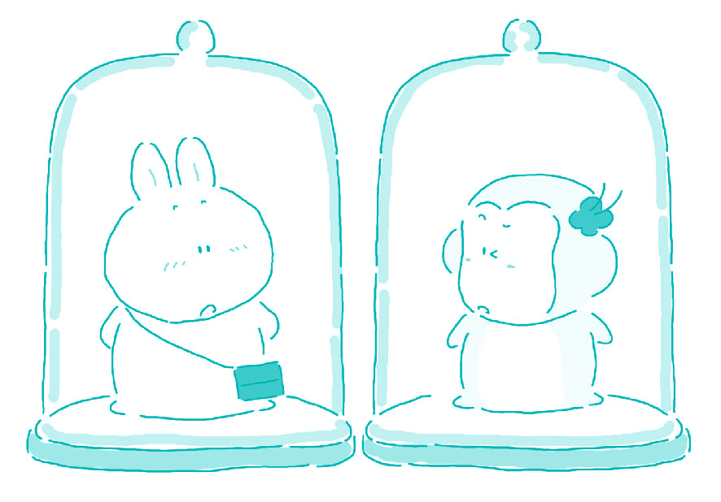

> ###  译文

> **77. 男生与女生是否应该分校上学？**

> 在中国，很多人生活在一个古怪的文化中——男孩和女孩之间永远不能说“爱”字。并且，如果此类事情发生在校园中，将被认为是可耻的。为了避免所谓的羞耻和危险，有些人声称男孩和女孩应该分开读书。

> 问题是，一个小男孩对一个小女孩说“我爱你”有什么错呢？“爱”作为一个被禁止的词汇的时代早就过去了，可是这个词即便在今天也确实与西方的同一个词有着相当不同的意味。我们可以看到在好莱坞电影里人们很自然、轻松地对他人说“我爱你”，包括对朋友、家人、同事，甚至对一个陌生的计程车司机！但是在中国，毫不奇怪，大多数人从来都不曾对同事说“我爱你”，甚至对爱人或孩子都不曾说过。在某种程度上“爱”在中文中实际有些与不道德相关的意味。看起来这并不是有没有错的问题，而是如果一个孩子居然敢说“爱”那就一定有错。

> 就算是小孩子爱上什么人真的有问题，难道就那么骇人甚至罪恶，乃至成年人必须采取行动去制止吗？我们有什么证据表明这样的事情确实是坏的吗？没有吧。一个小男生喜欢一个漂亮小女生，或者一个小女生被一个帅气小男生吸引是非常自然的，这样的情感没有任何害处。所谓的“早恋”只不过是一个无知导致的没意义概念。男孩女孩实际上并不知道“爱”是什么！也许他们只不过是在模仿身边成年人的行为而已。我们成年人应该做的并不是让他们相信“爱”是罪恶的，而应该教他们真爱意味着什么。遗憾的是，那些成年人从来都没有意识到他们实际上并没有承担他们的责任，而是自以为是地通过让男孩和女孩在不同的学校读书以消除男孩女孩之间的爱。这是永远不会成功的。

> 男女分校曾经是歧视女性的罪恶标志之一，但今天却因为要阻止早恋而重新出现——北京的一所高中最近宣布男生女生将在不同的班级上课。我很难想象这样的一个计划除了进一步扭曲青少年的天性之外会有什么样的好处。

###  Word List

 * ridiculous［ri ˈdikjələs］ adj.荒谬的，可笑的
 * take action to 对…采取行动
 * affair ［əˈfεə］ n. 事务；私事，恋爱事件
 * prudent ［ˈpru:dnt］ adj. 慎重的；谨慎的
 * alleged ［əˈledʒd］ adj. 所谓的
 * admire ［ədˈmaiə］ v. 赞美，钦佩，羡慕
 * assert ［əˈsə:t］ v. 断言，声称
 * puppy love 早恋
 * attend ［əˈtend］ v. 出席；注意
 * nonsense ［ˈna:nˌsəns］ n. 胡说，废话
 * forbidden ［fəˈbidn］ adj. 禁止的，严禁的
 * presumptuously ［priˈzʌmptʃuəsli］ adv. 自以为是地
 * connotation［ˌka:nəˈteiʃən］n.（词的），内涵
 * mate ［meit］ n. 配偶
 * eliminate ［iˈliməˌneit］ v. 排除，消除
 * subtle ［ˈsʌtl］ adj. 微妙的
 * regrettably［riˈgretəbli］ adv. 遗憾地，可悲地
 * appalling ［əˈpɔ:liŋ］ adj. 惊人的，骇人的
 * reemerge ［ˈri:iˈmə:dʒ］ v. 再度出现
 * evil ［ˈi:vəl］ adj. 邪恶的，有害的
 * distortion ［diˈstɔ:ʃən］ n. 扭曲，变形

## 78. Work with a group of people or work independently?

While some people emphasize great importance of cooperation, others argue that the significance of individual competition should not be rejected or neglected. To examine whether one is more important than the other, we have to look carefully into further details.

There are circumstances where the ability to work with group is much more important than that to work independently. More often than not, in most fields, a team can achieve much more extensive scope than an individual can, because one has less strength than many have. In team-played sports, such as football, basketball, volleyball, etc. , teamwork is often highly valued and is of essence. To get a goal or make a point, team members have to cooperate with each other, nobody could achieve without others' help. Although individual competence is a must, too much accent on his personal ability will lead him even the whole team to a disaster.

On the other hand, there also are inverse circumstances. In vital decisionmaking, for example, one has to make a final choice with his/her own judgment. Let's consider the same situation mentioned above, on the very same sports ground, each opposite team has only one and should have only one coach, who must work independently to make important decisions, including which player should be replaced, which player should present on what kind of special circumstances, and so many other critical choices. The coach, like the commander in the war, stands on a position where he/she has to be competitive, and his/her only rival is the coach of the other side. Even if he/she at the same time has to consult with others, it is him/her who takes the final step, and he/she essentially has no choice but to have an excellent ability to work independently.

There seldom exists a circumstance where cooperation and competition do not coexist. The point is that emphasis on cooperation doesn't mean competition should be neglected or rejected, and vice versa. Therefore, it hasn't gone too far to say that both the ability of working with group and that of working independently are equally important.

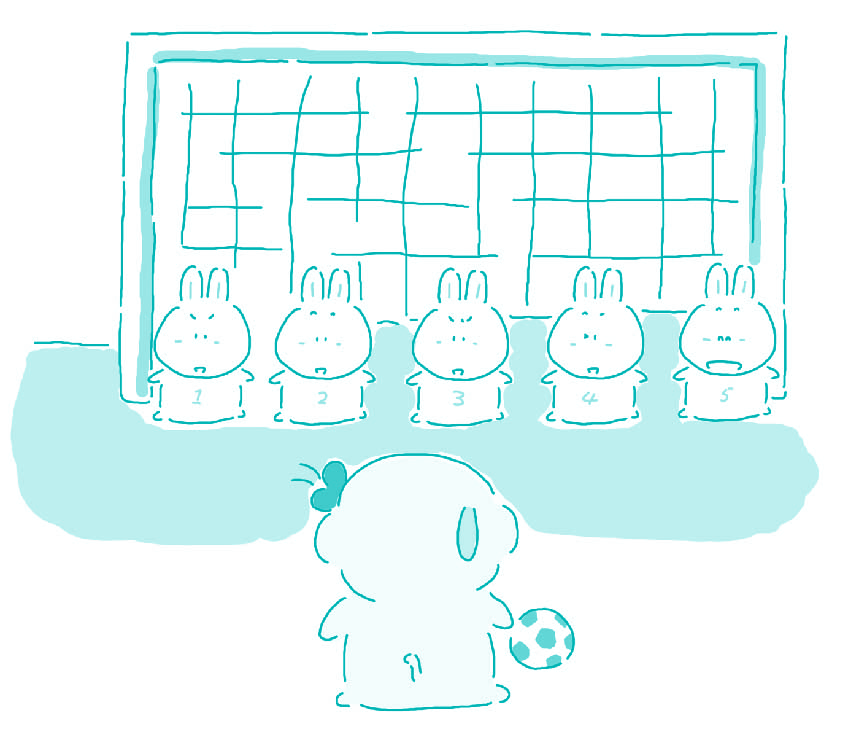

> ###  译文

> **78. 与人协作还是单枪匹马？**

> 有些人强调合作的重要性，而有些人认为不应该忘记或忽视竞争的重要性。要想知道到底是哪一个更重要，我们必须要深入研究一下。

> 有时候与团队合作的能力比单独工作的能力更为重要。在许多领域中，团队常常比个人取得更多的成果，这是因为团队比个人拥有更多的力量。在足球、篮球、排球等团队运动中，团队协作被高度重视是非常必要的。为了进一个球或得一分，队员们必须相互协作，没有他人的帮助，任何个人都不可能成功。虽然个人的表现也很重要，但是太多的个人表现只能把他自己或者整个团队带向灾难。

> 从另一方面来说，情况并不往往总是这样，而是会有对立面的。例如：在做重大决定的时候，你必须要根据自己的判断做最后的决定。让我们以上面的情况为例，在同一个赛场上，每个队都只有一个教练。教练必须独自工作并做出重要的决定，如：哪一名队员该被换下，在什么情况下该用哪一名队员等其他许多也很重要的决定。教练就像战场上的指挥官，他所在的位置是具有竞争性的，他惟一的竞争对手就是赛场上对方的教练。即使他还同时咨询其他人，但是还得由他自己做出最终的决定。他别无选择，只能具备良好的独立工作的能力。

> 很少有合作和竞争不共存的情况。关键是强调合作的重要性并不是要忽略竞争的存在，反之亦然，所以说与团队合作的能力与独立工作的能力同样重要并不为过。

###  Word List

 * emphasize ［ˈemfəˌsaiz］ v. 强调，着重
 * inverse ［inˈvə:s］ adj. 倒转的，反转的
 * cooperation ［kəuˌa:pəˈreiʃən］ n. 合作，协作
 * vital ［ˈvaitl］adj. 生死攸关的，至关重要的
 * neglect ［niˈglekt］ v. 忽视，疏忽
 * mention ［ˈmenʃən］ v. 提及，说起
 * reject ［riˈdʒekt］ v. 拒绝，抵制
 * coach ［kəutʃ］ n. 训练，指导；教练
 * achieve ［əˈtʃi:v］ v. 完成，达到，获得
 * replace ［riˈpleis］ v. 取代，替换
 * extensive ［ik ˈstensiv］ adj.广大的，广泛的
 * commander ［kəˈmændə］ n. 司令官，指挥官
 * scope ［skəup］ n.（活动）范围；机会；余地
 * consult ［kənˈsʌlt］ v. 商量，考虑
 * teamwork ［ˈti:mˌwə:k］ n. 联合作业，协力
 * coexist ［ˌkəuigˈzist］ v. 共存
 * disaster ［diˈzæstə］ n. 灾难，天灾，灾祸
 * vice versa 反之亦然 

## 79. Whom in your country would you choose to build a statue for?

If my city has decided to build a statue to honor a famous person in my country, I would choose a late singer, Teresa Teng. She was born in 1950s, and died of a severe asthma attack at age 41 in May 1995 while holidaying in Chiang Mai, Thailand, triggering an outpouring of grief among her legions of fans in Asia and elsewhere. During her brilliant stage career, favored by fans all over Asia, she moved millions of people. Her famous songs include "sweet","story of small town", and "the moon represents my heart", etc.

It was said that it was her who introduced several generations in China to a certain field of popular music. Her songs have accompanied the growth and development of many people in China. In the home of these generations' soul, her sweet voice has become immortal beauty and memory. Although she's gone, her sound of singing has never vanished. She is constantly commemorated; from Beijing to Taipei, Hong Kong to Singapore, her ubiquitous fans observe her commemoration from time to time, cherishing her incredible beauty, and her voice that sounds to come from heaven. Her sweet songs made her a legend, and are still regularly heard on radio, and continue to have a following in Chinese communities all over the world.

She should be remembered not only because of her beauty and voice, but also because of her great charity. She founded"Teresa Teng Foundation" during her lifetime. The purpose of the foundation is to cultivate and support gifted artists, and at the same time the foundation includes a trust to distribute scholarship to make sure that art students have opportunities to accomplish what they actually can. Every year, The Teresa Teng Foundation also send a great amount of money as a charity to help homeless children. And these activities are supported by her fans all over the world.

> ###  译文

> **79. 你会选择为你国家的哪个人塑像？**

> 如果我的城市决定塑一座雕像纪念我国一个名人的话，我会选择已故歌手邓丽君。她生于20世纪50年代，于1995年5月因严重气喘于泰国响买过世，享年41岁。她的死引起了无数亚洲以及其他地区的歌迷的悲痛。在她辉煌的舞台生涯里，她在整个亚洲都有歌迷，感动了成千上万的人。她的著名歌曲包括“甜蜜蜜”、“小城故事”，以及“月亮代表我的心”。

> 对几代中国人来说，流行音乐的启蒙是从邓丽君开始的。她的歌伴随很多中国人成长成熟。在他们的心灵之家里，那甜美动人的歌声是永不磨灭的美丽和回忆。尽管她已经去了，她的歌声从未消失。人们不停地纪念她，北京到台北，从香港到新加坡，她无所不在的歌迷不停地举办她的纪念活动，怀念她惊人的美丽，还有天籁般的歌声。她那甜蜜的歌曲使她成为一个传奇，也仍然可以不时地在收音机里听到，并在全世界的华人圈里有着许多的追随者。

> 她之所以值得人们纪念不仅是因为她的美貌和声音，更因为她的高尚的慈善行为。她生前建立了“邓丽君文教基金会”。基金会的目标是培养并支持有天赋的艺术家，并且基金会同时包括一个奖学金基金用来确保学艺术的人确实能实现他们原本可以实现的成就。每年，“邓丽君文教基金会”也发送大量金钱作为慈善基金去帮助无家可归的孩子们。这些活动也获得来自全世界的她的歌迷的支持。 

###  Word List

 * late ［leit］ adj. 已去世的，已故的
 * asthma ［ˈæzmə］ n. 气喘（病）
 * legions of 大批的
 * immortal ［iˈmɔ:tl］ adj. 永生的；不朽的
 * vanish ［ˈvæniʃ］ v. 消失不见
 * commemorate ［kəˈmeməˌreit］ vt. 纪念，庆祝
 * ubiquitous ［juˈbikwətəs］ adj. 无所不在的
 * cherish ［ˈtʃeriʃ］ vt. 怀念
 * trust ［trʌst］ n. 奖学金基金会

## 80. A custom from your country that you would like people from other countries to adopt

My favorite custom from Chinese culture that I wish that other countries would adopt is "Respect the Old, Love the Young." These two ideas have been part of traditional Chinese culture for thousands of years, but they are more important than ever in contemporary Chinese culture. If adopted by Western countries, these two traditional attitudes could help them solve some of their social problems.

One major problem in many Western countries is what to do with old people when they can no longer take care of themselves. A Chinese family will often have three generations of one family living under the same roof. They love and respect the older generation, and consider them wise. Western people believe that living with one's own parents is inconvenient and embarrassing. Instead of respecting old people, some think that they are stupid and ugly. When Western families' parents get old, they would rather send them into nursing homes and retirement homes than live together with them. Only old and sick people live in these places and they are considered depressing, in the worst cases they might seem like a prison to their inhabitants. Old people in the West would be much happier if they adopted these traditional Chinese attitudes.

Juvenile delinquency is another serious social problem in Western cultures. Its causes can also be traced back to a lack of respect for old people and love for young people. Children are not taught to respect the wishes of their parents and instead value their relationships with their friends more. Because in many Western families both parents have jobs outside of the home, children often lack adequate supervision. Chinese families, by contrast, often have at least one parent, or a grandparent at home to take care of and love the children. Children without proper guidance and love from a young age might start to smoke, drink, use drugs, and commit crimes. This occurs much less frequently in China because people pay more attention to their children and have the children's grandparents nearby to help raise them.

The West puts the "Individual" before the "Family". Traditional Chinese culture puts the interests of the Family first, and the Individual second.

Chinese mothers and fathers place higher value on their child's development, than on their child's independence. Children place a higher value on their parents' happiness than on their own convenience. While there are many excellent lessonsthat Chinese people can learn from the West, Western people would do well to learn from these essential Chinese traditions.

> ###  译文

> **80. 一种你希望被其他国家的人采纳的本国习俗**

> 我最喜欢的、希望其他国家采纳的我国风俗是 “尊老爱幼”。这是中国文化中几千年传统的一部分，然而在中国当代社会更加重要。西方国家如果能采纳这个风俗，也许会解决一些它们的社会问题。

> 西方国家的一个主要问题是如何对待不能够照顾自己的老人。中国家庭通常三代同堂。他们爱戴、尊敬老一辈，并且认为老一辈是睿智的。西方人认为与父母同住不方便并且尴尬。他们中的一些人不尊敬他们，反而认为老人丑陋愚蠢。在西方国家，父母老了之后，子女宁愿送他们去养老院而不是与他们住在一起。只有老弱病残才会生活在那里，人们认为那里很压抑，最糟的是他们认为那里相对于自己的家就像监狱一样。如果尊老爱幼的风俗被采纳，西方的老人会更幸福。

> 青少年行为不良是西方文化中存在的另一个严重社会问题。其起因同样可以归咎于缺乏“尊老爱幼”的精神。青少年学会的不是尊重父母的愿望而是更加重视与朋友之间的关系。在西方国家，大多数父母同时上班，孩子缺乏充足的看管。在中国，恰恰相反，通常至少有一个家长，或者祖父母在家照顾孩子。缺乏恰当看管以及爱护的孩子可能会开始抽烟、喝酒、吸毒、甚至犯罪。中国相对发生的很少是因为人们更关注他们的孩子，并且有祖父祖母帮助养育子女。

> 西方人认为“个体”重于“家庭”。而传统的中国文化却把家庭的利益放在首位，个人利益次之。父母关注孩子的发展多于关注孩子的独立性；孩子认为父母的快乐要比他们自己的方便更重要。中国可以从西方学到很多东西的同时，西方也可通过学习这些重要的中国传统而受益。 

###  Word List

 * Respect the Old, Love the Young 尊老爱幼
 * juvenile ［ˈdʒu:vəˌnail］adj. 青少年的；幼稚的
 * roof ［ru:f］ n. 屋顶，房顶
 * delinquency ［diˈliŋkwənsi］n. 行为不良；错失
 * under the same roof 同堂
 * embarrassing ［emˈbærəsiŋ］ adj. 令人难堪的
 * supervision ［ˌsu:pəˈviʒən］ n. 监督，管理
 * drug ［drʌg］ n. 麻醉药；毒品
 * retirement ［riˈtaiəmənt］ n. 退休
 * commit ［kəˈmit］ v. 犯（错误）
 * depress ［diˈpres］ v. 使沮丧；压低
 * nearby ［ˈniəˈbai］ adv. 在附近；附近地

## 81. Has technology made the world a better place to live?

Technology is a tool for humanity. As such it merely supports human actions, good and bad, and does not contribute in and of itself to the progression of the world. Nevertheless, while people have utilized technology to improve their living conditions and also as a means to control and harm others, I believe that technology has allowed and will continue to allow mankind to solve our most serious problems and thus make the world a better place to live.

Technology has aided us in the fight against the two most serious threats to human life, hunger and disease. With the help of technology we have been able to save millions of lives by developing vaccinations, cures, and treatments for diseases that used to be considered fatal. Similarly, technology has figured prominently in the area of food production and may one day allow us to stamp out hunger all over the world. The development of telecommunication and information technologies has encouraged communication between countries and their peoples and thus prevented political conflict.

Of course, technology has also helped mankind to become more destructive and exploitative. The ever-growing arms industry has been able to build bigger bombs and more efficient killing machines. As a result, armed conflicts have become more and more devastating and cost more human lives than ever before. In addition, governments have used technology to limit information and suppress opposition, and businesses continue to use it to maximize profits by replacing workers with machines. None of these practices can be considered beneficial to humanity.

However, while the development of technology might have contributed to some of these contemporary problems, it offers the most likely solutions to many of them. People in many parts of the world still die of starvation, and further developments in food science will hopefully end this unfortunate situation. Also, the global energy shortage presents a problem only technology can solve, and the further development of existing technology is necessary to reduce and stop environmental pollution and degradation.

> ###  译文

> **81. 科技使世界变得更美好了吗？**

> 科技是人类的工具，在这个意义上它仅仅支持人类的行动，不管是正确的还是错误的，它本身并不在社会的进步中做出贡献。然而，当人们利用科技来提高自己的生活水平，或将科技作为控制和危害别人的一种手段时，我相信，科技已经并将继续使我们能够去解决那些最为严重的问题，而世界将因此变成一个更加适合人类居住的地方。

> 科技正在帮助我们与威胁人类生存的最严重的两个问题——饥饿和疾病做斗争。在科技的帮助下，我们已经能够通过发展接种疫苗、治疗手段和治疗方法等治愈那些从前被人们认为是绝症的疾病，而挽救了上百万人的生命。同样地，科技也已经在食品制造领域占有重要的地位，而且可能有一天也将帮助我们在全世界范围内消除贫困。通讯和信息产品的发展鼓励国家与国家和人民之间进行更多的交流，这也会因此进一步阻止政治上的冲突。

> 当然，科技也已经帮助人类变得更具有破坏性和剥削性。一直在持续增长的武器制造工业使人们已经能够建造更为巨大的炮弹和更加有效的杀人机器。因此，武装冲突已经变得越来越具有毁灭性，而且在战争中死亡的人数也比以前增加了。除此之外，政府已经利用科技来限制信息和镇压反抗，而且商业也继续通过用机械取代工人来最大限度地获得利润。所有这一切对人类都是没有益处的。

> 但是，在科技的发展可能会给当今社会带来部分问题的同时，科技也为人们提供了可能解决其中大部分问题的办法。世界上仍然有许多地方的人们因为饥饿而死亡，而食品科学的进一步发展将有希望结束这种不幸的境况。并且，因为全球能源的短缺带来的问题也只有通过科技才能解决，现有科技的进一步发展对降低与停止环境污染和防止环境的进一步恶化也是必须的。

###  Word List

 * humanity ［hju:ˈmæniti］ n. 人类
 * conflict ［ˈka:nˌflikt］ n. 斗争，冲突
 * utilize ［ˈju:tlˌaiz］ v. 利用
 * destructive ［diˈstrʌktiv］ adj. 破坏性的；毁坏的
 * harm ［ha:m］ v. 伤害，损害
 * threat ［θret］ n. 恐吓，威胁
 * exploitative ［iksˈplɔitətiv］ adj. 开发资源的
 * vaccination ［ˌvæksəˈneiʃən］ n. 接种疫苗，种痘
 * armed conflict 武装冲突
 * cure ［kjuə］ n. 治愈，痊愈
 * starvation ［sta:ˈveiʃən］ n. 饥饿，饿死
 * fatal ［ˈfeitl］ n. 致命的，重大的
 * degradation ［ˌdegrəˈdeiʃən］ n.堕落，退化
 * prominent ［ˈpra:mənənt］ adj. 卓越的，显著的

## 82. Can advertising tell you a lot about a country?

Advertising does not mean to educate or illustrate. Primarily it is a vehicle for business and it aims to sell products. As a result, the information we can gather from looking at advertisings is quite limited. However, the cultural ideas used to sell commodities reveal a society's value system, and from the nature of the advertising and the product it aims to sell we can draw conclusions as to which social demography might be the most affluent.

In order to be most effective an advertising campaign will make use of the cultural values of a country. Obviously, companies will be able to sell more products if a great many people relate to the goods and the images used to sell them. For example, in a country like the United States where a great percentage of the population is religious, advertisers use expressions such as heavenly, divine, or revelation, because these have connotations that prospective customers will likely identify with. Similarly, advertisers will try to employ fashion models who embody a culture's ideals of personal beauty, because attractive men and women will sell more products than unattractive ones.

Companies identify social demographics or parts of society that are most likely to buy their products and design their advertisings accordingly. For example, teenage girls are more likely to buy mobile phones than retired factory workers. Thus companies will make use of fashion trends in their ads and probably pay a famous pop singer a big chunk of money to endorse their product. If the majority of all advertisings in a country are geared towards a specific target market or audience, then this part of the population probably has the most financial resources at their disposal.

Although we can learn some things about a country by looking at its advertising we have to remember that this knowledge is limited. After all, advertising is only directed at people who have the means to buy consumer goods. Thus advertising does not tell us anything about the overall prosperity or likes and dislikes of a country. Also, advertising not only reflects but also tries to shape and change cultural values. Therefore, it does not accurately reflect the exact state of a country's culture.

> ###  译文

> **82. 广告能使你了解一个国家吗？**

> 广告并不意味着说教或是说明，基本上广告仅是商业运作的一个工具，而且它的目的是销售商品。因此我们仅从观看广告上收集的信息是非常有限的。然而，用于销售商品的文化理念揭示了一个社会的价值系统，而且从广告和其所要推销的目标产品的本质来说，我们可以推断出社会的哪部分人群最富有。

> 为了使宣传更加有效，一场广告大战将会利用到一个国家的文化价值。很显然，如果有很多人与卖给他们的商品及其商品形象之间有关系，那么各公司将能够卖出更多的产品。例如，在一个像美国一样，人口中具有宗教信仰的占有很大比重的国家来说，广告商将会更多地使用诸如“天堂般的”、“神圣的”或“启示”等字眼，因为这些词汇的涵义可以使潜在顾客有可能购买商品。相似地，广告商们将竭尽全力邀请被某一文化视为有魅力的时尚模特来出演广告。这是因为启用具有吸引力的男士或女士将能比启用没有吸引力的人卖出更多的产品。

> 公司会确定最有可能购买他们产品的人群，并以此来设计制作他们的广告。例如，十几岁的少女会比退休在家的工厂工人更有可能购买移动电话。因此，公司将把流行趋势用于他们的产品之中，而且，很有可能会支付给一位大牌的人气歌星一大笔钱来代言他们的产品。如果一个国家的全部广告中的大部分都是针对某一特定目标市场或观众的，那么这部分人群可能是其在广告策划中瞄准的最具有金钱实力的一部分人。

> 虽然我们能够通过观看广告而获悉某一国家的一些事情，但这些信息是相当有限的。毕竟，广告仅是针对那些有意购买消费品的人群的。因此，广告不能告诉我们关于社会整体发展的进程和整个国家好恶的任何信息。除此之外，广告不仅能够反映、而且努力塑造和改变人们的价值取向。所以，广告并不尽能准确地反映一个国家文化的确切状态。

###  Word List

 * illustrate ［ˈiləˌstreit］ v. 图解；阐明
 * heavenly ［ˈhevənli］ adj. 神圣的
 * vehicle ［ˈvi:ikəl］ n. 交通工具，车辆
 * divine［diˈvain］ adj. 神的，神圣的
 * advertising ［ˈædvəˌtaiziŋ］ n. 广告业，广告
 * revelation ［ˌrevəˈleiʃən］ n. 显示，揭露；启示
 * demographic ［ˌdeməˈgræfik］ adj. 人口的；人口统计学的
 * employ ［emˈplɔi］ v. 雇用，用，使用
 * fashion ［ˈfæʃən］ n. 流行，风尚；时样
 * make use of 使用，利用
 * embody ［emˈba:di］ v. 具体表达；包含
 * percentage ［pəˈsentidʒ］ n. 百分数，百分率，百分比
 * chunk ［tʃʌŋk］ n. 大块；相当大的数量
 * endorse ［enˈdɔ:s］ v. 认可；签署 

## 83. Is modern technology creating a single world culture?

Through modern technology such as TV, telephone, and the Internet, it has become easier for people from different cultures to communicate. In a sense the world has become a smaller place. However, it is questionable if technology is creating a single world culture, because, even though a cultural exchange is taking place, accessibility of this technology is still very limited, and, more importantly, people have come to value the differences inherent in their cultures.

People around the world are taking advantage of the opportunities, presented by modern technology, to learn about other cultures. Not only foreign movies, music, and books communicate with the locals, but the different cultural values do, which are readily available on DVD, CD and via the Internet. Similarly, TV broadcasts fashions across the world and a new style of dress will likely catch on quickly in different parts of the globe. People adopt foreign things they like and make them their own. In this sense cultural assimilation is taking place.

However, while some societies and their cultures are technologically advanced and thus connected with other parts of the world, the majority of the world's population lives largely isolated. Such isolation is the result of limited technological resources, which in turn is, generally, related to poverty. For example, nearly the entire continent of Africa is impoverished. Its people have few means to learn about other cultures, and even if they did they would have little use for Western culture, which to a great extent is a consumer culture. They are also extremely limited in the ways they can educate people from other parts of the world about their cultures.

Finally, people who are learning about foreign cultures generally come to appreciate and accept the differences between other cultures and their own. They recognize the value of variety. The enjoyment they derive from experiencing foreign languages, dances, songs, visual and culinary arts, also allows them to see the value in their own cultures' achievements. Therefore, cultural exchange does not necessarily result in the melting of many cultures into one.

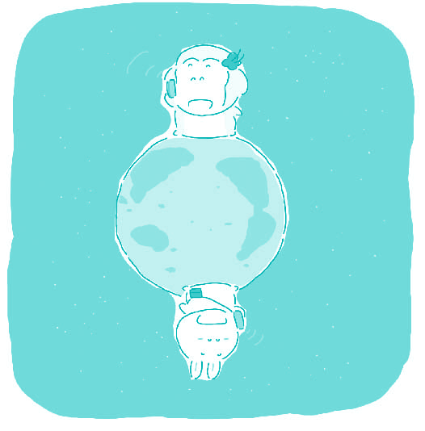

> ###  译文

> **83. 科技正在促成一种单一的世界文化？**

> 通过诸如电视、电话和互联网等现代科技手段，来自不同文化背景的人们之间的交流已经变得更加容易了。从某种意义上来说，世界已经变得比以前小了。然而，科技是否正在创造着一种单一的世界文化，这一点值得我们提出疑问。因为，即使文化交流正在发生，这种科技的普及性仍然很有局限性。而且更为重要的是，人们已经开始懂得去珍惜他们自己文化中传承下来的那些特异之处了。

> 世界上的人们正在利用由现代科技提供的各种机会来学习其他国家的文化。不仅来自外国的电影、音乐和书籍等和本土的进行交流，而且不同的文化价值观也在相互交流，这是通过DVD、CD，或是国际互联网来实现的。同样地，电视节目中也在播放着流行于世界各地的时尚信息，一款新式样的衣服可能会很快就在世界各地流行起来。人们会吸收那些他们喜欢的外来事物，并将它们转化成自己的东西。文化同化就是这样发生的。

> 但是，虽然一些社会及其文化的科技很进步，也因此与世界上其他的部份联系在一起，世界人口的大多数却仍然生存在与世隔绝的状态之中，这源自其有限的科技资源，而这有限的科技资源反过来又与贫穷相关。例如，基本上整个非洲国家处于贫困之中，它们的人民几乎没有途径来了解其他国家的文化，而且即使他们了解了，也几乎用不到这些西方文化，这种西方文化在很大程度上来说是一种消费者文化。除此之外，他们将他们自己的文化传输给世界其他各国人民的方式也非常有限。

> 最后，那些正在学习外国文化的人们将逐步学会欣赏并接受其他文化与自己的文化之间的差异。他们认识到了文化多样性的价值。他们从外国语言、舞蹈、歌曲、视觉和烹饪艺术等经历中获得的快乐也使他们看到了自己国家文化的成就的价值。因此，文化交流并不必然导致多种文化融合成为一种文化。

###  Word List

 * accessibility ［ˌækəsesiˈbiləti］ n. 易接近性，可达性
 * majority ［məˈdʒɔriti］ n. 多数，大半
 * population ［ˌpa:pjəˈleiʃən］ n. 人口
 * inherent ［inˈhiərənt］ adj. 内在的，与生俱来的
 * poverty ［ˈpa:vəti］ n. 贫穷，贫困
 * impoverish ［imˈpa:vəriʃ］ v. 使贫穷，使枯竭
 * present ［prəˈzənt］ v. 介绍，引见
 * via ［ˈvaiə］ prep. 经，通过，经由
 * culinary ［ˈkju:ləˌneri］ adj. 厨房的，厨房用的
 * broadcast ［ˈbrɔ:dˌkæst］ v. 广播，播送
 * globe ［gləub］ n. 球体，地球仪，地球，世界
 * melt ［melt］v. （使）融化，（使）熔化
 * assimilation ［əˌsiməˈleiʃən］ n. 同化（作用）

## 84. Internet information: valuable or problematic?

The Internet is a great invention because it disseminates information freely. Freedom of information is in the interest of a country and its citizens, but, in light of the information anarchy on the Internet, people need to learn and understand how to evaluate and use the information they find at their fingertips.

The Internet promotes freedom of information and freedom of speech, which are integral part of a successful modern democratic society. With innumerable news sources at their disposal citizens have the opportunity to educate themselves, and this knowledge will allow them to contribute to the progression of their society. Similarly, the ability to consult different viewpoints, especially those diverging from their own, will allow people engage in meaningful dialogue with other citizens. The result of this continued discourse will be a more open minded and also tolerant society. As a vehicle of communication the Internet will connect people of the same interests and the same concerns. Thus connected citizens will be encouraged to work together and they will become active participants of society rather than passive subjects.

Critics of the Internet's free flow of information are concerned that people will fall victim to bad or rather incorrect information and act on it. This concern is warranted in so far that the Internet is intrinsically anarchic, and anybody with a computer can create Website and post information thereon. As a result, it can be very difficult to determine what information is correct or reliable and which is not. However, difficult as it may seem, there are ways that one can navigate the information jungle of the Internet and arrive at conclusions. In order to do so one has to learn to evaluate sources of information. For example, the Website of a research scientist at a major university or that of a well-known non-profit organization is a more reliable source of information than the personal Website of a senior school student.

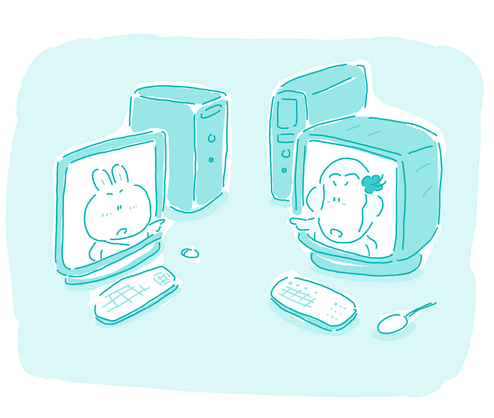

> ###  译文

> **84. 网络信息：有价值还是带来问题？**

> 互联网是一项伟大的发明，因为它可以自由地传播信息。信息的自由有益于国家和其人民。但是，由于在互联网上信息的混乱性，人们需要学习和理解如何去评价和利用通过指尖的点击找到的信息。

> 互联网促进了信息自由和言论自由，二者是一个自由、现代、民主的社会的有机组成部分。拥有无数可供支配的信息资源，人们就有机会自学。与此同时，这些知识将会使人们为社会的进步做出贡献。同样，能够考虑不同的，尤其是与本身观点大相径庭的观点，会使人们致力于与他人进行有意义的沟通与对话。这些持续对话的结果必将使当今社会变得更加开放和包容。作为交流的工具，互联网将会使具有相同兴趣和爱好的人们相互建立联系，从而促进这些相互联系的人一起工作，而他们也会成为社会活动的主动参与者而不是被动的客体。

> 对于互联网自由信息流，批评家们认为，人们会沉溺于不好的或者是非常不正确的信息之中并且模仿之。这种忧虑是有道理的，因为当今的互联网在本质上来说是无政府主义的，任何一个拥有计算机并能连到互联网上的人都可以建立网站并在上面发布信息，而使辨别信息的正确与否变得很困难。然而，虽然看起来困难，人们总会有方法穿越互联网的信息丛林而到达彼岸。为此，人们必须学会如何辨识信息的来源。例如，相对一个高中学生的个人网站来说，一个主流大学科学家的网站或者一个著名的非营利组织的网站就是更可靠的信息来源。

###  Word List

 * disseminate ［diˈseməˌneit］ v. 散布；传播
 * viewpoint ［ˈvju:ˌpɔint］ n. 观点，看法
 * diverge from 与…
 * （意见等）有分歧
 * in light of 按照，根据
 * tolerant ［ˈta:lərənt］ adj. 容忍的，宽恕的
 * anarchy ［ˈænəki］ n. 无政府状态；政治混乱
 * critics ［ˈkritik］ n. 批评
 * victim ［ˈviktim］ n. 受害人，牺牲者
 * fingertip ［ˈfiŋgəˌtip］ n. 指尖；指套
 * warrant ［ˈwɔ:rənt］ v. 授权；证明
 * democratic ［ˌdeməˈkrætik］ adj. 民主的；民主主义的
 * intrinsic ［inˈtrinzik］ adj. 内在的，本质的
 * anarchic ［ænˈa:kik］ adj. 无政府主义的
 * innumerable ［iˈnu:mərəbəl］ adj. 无数的，数不清的
 * Website ［ˈwebˌsait］ n. 网站
 * navigate ［ˈnæviˌgeit］ v. 航行，航海
 * disposal ［diˈspəuzəl］ n. 布置，安排 

## 85. Where would you recommend a foreign visitor to go in your country for one day?

China is an enormous country with an intensely varied landscape. If a foreign visitor were coming just for one day to see our country, it would be difficult to choose just one place to spend the day. However, I posit that the best place in China to visit would be Beijing. As the capital city, Beijing offers a diverse look at China. I would suggest that the main sites to see would be the Forbidden City, the Great Wall, and Tiananmen Square.

The Forbidden City offers the visitor a look at what it was like to live in historical China. The Forbidden City is located in the heart of Beijing, and is the biggest palace complex in the world. This particular site would be of interest to a tourist because it was once the home of many emperors. One can see the actual rooms from whence the ancient China was ruled by the emperors. When the visitor walks through the palace confines, he/she will see many examples of classic Chinese architecture. A walk through the gardens is particularly peaceful with jasmine trees abound.

The Great Wall is also a must-see in China. The people of China hold the Great Wall as having particular significance to their culture because of its long history. The wall, built of dirt, stone and brick, was used as a defense barrier against invading nomads and wandering tribes. This is the largest engineering andbuilding project ever carried out by humans. Its historic and strategic importance is matched only by its architectural significance.

Finally, Tiananmen Square should be on the list of things to see while visiting Beijing. This square is one of the largest in China, and possibly in Asia. At this square, one can visit the Chairman Mao Memorial Hall, one of the greatest leaders ever in China. The Chinese Revolutionary Museum and the Chinese History Museum stand to the east of the square, the Great Hall of the People to the west and the magnificent Tiananmen Tower to the north. As the visitor will see, there are numerous interesting exhibits at Tiananmen Square that offer up a variety of Chinese heritage.

Of course, it is very difficult to name one city in China over all others as"the place" to visit. China is the host to such a wide variety of beautiful places, and a visitor really should spend much more time exploring them all. However, with only one day, I believe that Beijing is the best place to visit.

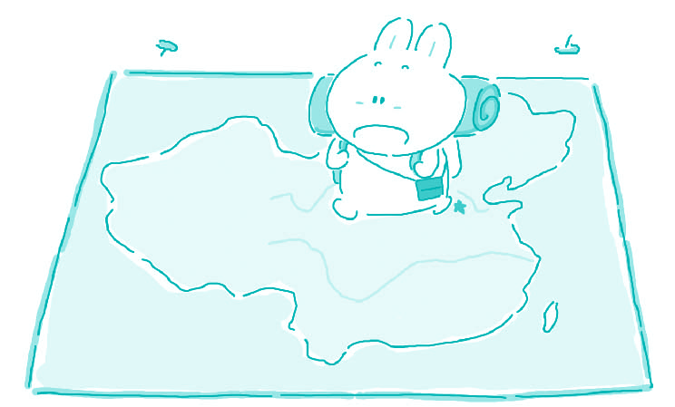

> ###  译文

> **85. 你会推荐一个外国游客去你国家的什么地方游览一天？**

> 中国是一个具有千变万化的地形地貌的大国。如果一个外国游客仅有一天的时间来游览我们的国家，那么仅能选择一个地方来游览将是件困难的事情。但是，我认为中国最值得游览的地方是北京。北京是中国的首都，拥有着万种风情。我建议参观的主要景点是紫禁城、长城和天安门广场。

> 紫禁城可以让游客感受到在古代中国帝王居住地的情形。紫禁城位于北京的中心地带，它是世界上最大的宫殿群。由于它过去是许多帝王的家，所以对游客来说，这个地方尤其吸引人。人们可以参观那些真实的房间，皇帝们在那里统治着古代中国。当游客沿着宫殿边的线路参观时，将会看到许多经典古代中国建筑的典范。步行穿过茉莉花环绕的花园也是一件很惬意的事情。

> 来中国游玩，长城也是必去的地方。由于长城历史悠久，中国人认为其对于他们的文化具有特别的意义。由泥土、石头和砖建造的城墙曾被用于抵御外来游牧民族的入侵。长城是迄今为止人类所建造的最大的工程和建筑项目，它的历史和战略意义也同样巨大。

> 最后，天安门广场也是你游览北京必去的地方。它是中国乃至全亚洲最大的广场之一。在广场上，你可以参观毛泽东纪念堂，毛泽东是中国历史上最伟大的领袖之一。中国革命历史博物馆矗立于广场的东侧，人民大会堂坐落于西测，而宏伟的天安门城楼则位于广场的北侧。正如游客们所见，天安门广场上有许多有趣的展览，展示着多种多样的中国传统文化遗产。

> 当然，在中国，很难说一个城市比其他的城市更值得游览。中国地大物博，拥有许多美丽的地方，游客真是应该花更多一些的时间将它们全都游览遍。然而，既然只有一天时间，我相信北京是你最好的选择。 

###  Word List

 * enormous ［iˈnɔ:məs］ adj.巨大的，庞大的
 * wander ［ˈwa:ndə］ v. 漫步，徘徊
 * intensely［inˈtensli］ adv.激烈地；热情地
 * tribe ［traib］ n. 部落，部族
 * posit［ ˈpa:zit］ v.提出以供考虑或研究；建议
 * nomad ［ˈnəumæd］ n. 游牧民
 * the forbidden city 紫禁城，故宫
 * the Chairman Mao Memorial Hall Tiananmen Square 天安门广场
 * 毛主席纪念堂
 * locate ［ˈləuˌkeit］ v. 使…坐落于；位于
 * the Chinese Revolutionary Museum and the Chinese History Museum 中国革命历史博物馆
 * in the heart of 在…中心
 * emperor ［ˈempərə］ n. 皇帝，君主
 * whence ［hwens］ adv. & conj. 从那里
 * the Great Hall of the People人民大会堂
 * confine ［kɔnfain］ n. 界限，边界
 * magnificent ［mægˈnifisənt］ adj. 华丽的，宏伟的
 * architecture ［ ˈa:kiˌtektʃə］ n.建筑；建筑物
 * jasmine［ ˈdʒæzmin］ n.茉莉；素馨；淡黄色
 * the Tiananmen Tower 天安门城楼
 * must-see ［ˈmʌstˈsi:］ adj. 必看的
 * heritage［ ˈheritidʒ］ n.遗产；继承权；传统

## 86. When and where in the past do you want to go?

If I could go back to a certain time and place in the past, I would choose to go to ancient Egypt, to the time when they were building the great pyramids. This time period and place is greatly interesting to me for the following reasons: first, how were the great pyramids built? Second, Egypt is one of the few places in the world that has as rich a culture as China's. How did ancient life in Egypt compare to the existence of the ancient Chinese person? Finally, I find this time and place interesting because I am curious about the myths and legends that ancient Egyptians believed in.

There is much speculation as to exactly how the great pyramids were built. The pyramids are an architectural feat, even by today's standards. They are massive in size, with almost perfect angles leading up to the point at the top of the pyramid. How did the men manage to carry those enormous stones up the side of the pyramid? How was it possible to cut the stones so precisely, to allow for this even, mathematical design? Current science has analyzed these problems, and has decided that with today's technology, this would not be a problem. I am very interested, however, to learn how such technology was possible in ancient Egypt.

I am also very interested in how ancient Egyptian life compared to that of the ancient Chinese. Did they experience similar toils, or were their lives very different? Did the ancient Egyptians know about the ancient Chinese? All of these questions would be answered for me if I could travel back to the abovementioned time period.

China has some very interesting myths, legends and religions that were formed thousands of years ago. Ancient Egyptians were spiritual people also. I am curious to know more about these ancient religions. Were the beliefs held by the majority, or were there only a few who believed in such ideas?

There are so many unanswered questions about ancient periods, particularly ancient Egypt. By traveling back in time, I would learn a great amount about topics that have remained unanswered for thousands of years.

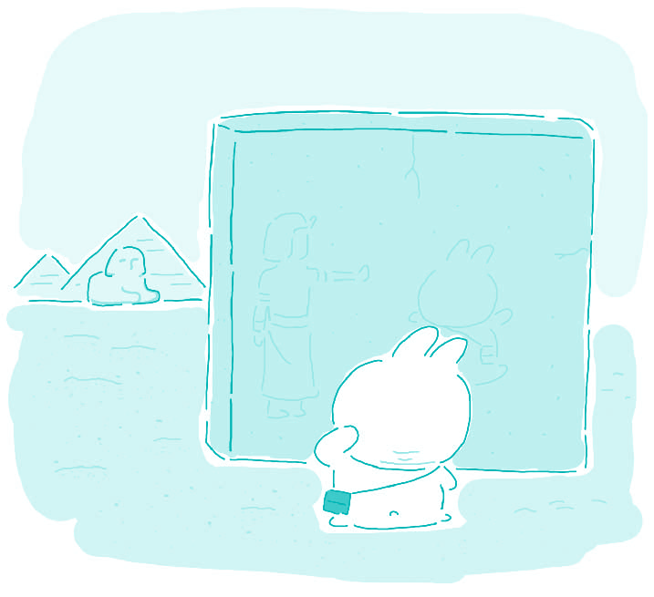

> ###  译文

> **86. 你想去从前的何时何地？**

> 如果可以回到从前的某个时间的某个地点，我会选择去古埃及，回到他们建造伟大金字塔的时期。这个时间和地点对我来说特别有吸引力，原因如下：首先，这些金字塔是怎样建造的？其次，埃及是很少几个和中国一样具有悠久历史的国家之一，和古代中国人相比，古埃及人的生活是怎样的？最后，我认为这个时间和地点有趣是因为我对埃及人信仰的神话传说感兴趣。

> 对于金字塔到底是怎么建造的这个问题有着诸多的猜测。即使以现代人的标准来说，金字塔也是建筑上的一个壮举。这些金字塔如此巨大，却直到顶端都有那么完美的棱角。当时的人们是如何设法运送这些巨大的石块到金字塔旁的？怎么可能如此恰好地将这些石块切割成形来完成平滑精确的设计？当今的科学已经分析了这些问题，利用今天的技术达到这些也不是问题。然而，我非常感兴趣的是这些技术在古埃及是怎么成为可能的。

> 我对古埃及人的生活同当时中国人生活的比较也很感兴趣。他们是生活的相似、还是大相径庭？古埃及人是否了解古代中国人？如果我可以回到上面提到的时间阶段，所有的问题都会得到答案。

> 中国有着许多非常有趣的神话、传说和信仰，它们都形成于几千年前。古埃及人同样是有宗教信仰的。我想了解关于这些古代信仰更多的事情。这些信仰是被大多数人接受，还是只是很少人信奉这些思想？

> 关于古代，尤其是关于古代埃及，有着许许多多的还没有得到解答的问题。通过穿梭时空回到过去，我将可以了解更多的关于那些几千年来尚未解答的问题。

###  Word List

 * ancient ［ˈeinʃənt］ adj. 远古的，古老的
 * angle ［ˈæŋgəl］ n. 角；角落
 * pyramid ［ˈpirəmid］ n. 金字塔
 * precise ［priˈsais］ adj. 精确的，准确的
 * myth ［miθ］ n. 神话
 * toil ［tɔil］ n. 辛苦；苦工
 * legend ［ˈledʒənd］ n. 传说
 * above-mentioned ［əˌbʌvˈmenʃənd］ adj. 上述的
 * speculation ［ˌspekjəˈleiʃən］ n. 思索
 * feat ［fi:t］ n. 技艺；功绩
 * spiritual ［ˈspiritʃuəl］ adj. 精神的；灵魂的
 * massive ［ˈmæsiv］ adj. 厚重的，大块的

## 87. What discovery in the last century has been most beneficial for your compatriot?

In the last hundred years man has set a new mind-blowing rate for the development of new technologies. New products are being conceived every minute of every day, all of which will impact man in some respect. However I believe that the most beneficial invention, over the last hundred years is the Internet.

Internet allows us to access any information our hearts desire. With the power of the World Wide Web, one can receive information from any country in the world allowing individuals the ability to locate and acquire anything imaginable. Locally, computers via the Internet allow us to search out a variety of services that are necessary for day to day living. This can make living in one of China's many big cities a much more comfortable experience.

From net games to online chatting to viewing movies or Websites, Internet has the ability to entertain us in a wide variety of ways. For example, many people join forums where they can chat with their peers about any variety of topics. Many movie trailers are first released on the Internet where enthusiastic fans can be the first to catch a glimpse of the latest and greatest blockbusters. Computers also bring us the world of instant messaging, allowing people with a computer and an Internet connection to chat for free with their friends and colleagues anywhere in the world.

Internet has changed the very way businesses operate, bringing efficiency and convenience to the work place. The most obvious development is the use of emails instead of surface mail. Emails allow businesses to communicate large amounts of information almost instantly, saving time, paper and postage fees. Instead of making long distance telephone calls, some businesses have started using Web conferencing. Web conferencing not only eliminates long distance fees, but also allows two parties to see each other in real time and simultaneously work on projects through program sharing.

> ###  译文

> **87. 过去100年中的何种发明使你的同胞受益最大？**

> 在过去的一百年中，人类发明新技术的速度非常快。每分每秒人们都在构思新产品，而所有这些产品都将在某些方面影响人类。但是，我认为在过去的一百年中最有用的发明是互联网。

> 电脑使我们可以获得任何想要的信息。通过互联网，人们可以很方便地获得世界各地的信息，使人很容易找到并获得任何想要的东西。在本地，我们可以通过互联网寻找到日常生活中所需要的各种服务，这可以使你在中国的许多大城市中生活得更加舒服。

> 不管是网上游戏、网上聊天、在网上看电影，还是浏览网页，互联网总会有很多让人娱乐的方式。例如，很多人加入论坛，在那里他们可以和网友们畅所欲言。很多电影就是在网上首先发布的，电影爱好者可以在网上看到最新、最轰动的电影大片的预告片。电脑还给我们带来世界各地的即时信息，人们可以通过上网和异地的朋友、同事聊天。

> 互联网改变了做生意的方式，给工作带来了效率和便利。最大的变化就是电子邮件代替了书面信函。电子邮件使人们可以在很短的时间内交换大量的信息，节省了时间、纸张和邮寄费。有些公司开始在网上召开会议，进而取代了以前的电话会议。网上会议不仅可以省掉长途电话费，还可以让开会的双方实时看到对方，同时在共享的文件中就某个项目进行工作。 

###  Word List

 * conceive ［kənˈsi:v］ v. 构思，以为
 * glimpse ［glimps］ n. 一瞥
 * online chatting 在线聊天
 * blockbuster ［ˈbla:kˌbʌstə］ n. 一鸣惊人者
 * forum ［ˈfɔ:rəm］ n. 论坛，讨论会
 * instant messaging 快讯
 * trailer ［ˈtreilə］ n. 追踪者
 * postage ［ˈpəustidʒ］ n. 邮资；邮费
 * release ［riˈli:s］ v. 释放；解放；放弃
 * fee ［fi:］ n. 费（会费、学费等），酬金
 * enthusiastic ［enˌθu:ziˈæstik］adj. 热心的，热情的
 * web conferencing 网络会议

## 88. Have telephone and e-mail made communication between people less personal?

Some people argue that telephones and e-mail have made communication between people less personal. I both agree and disagree with this statement.

Truely, Telephones and email are less personal than meeting someone face-to

face. However, They on any account can't impair the intimacy between people.

As mentioned above, using the telephone or email to communicate with others is definitely less personal than speaking with someone in person. There are many advantages of communicating with someone face to face. For example, you can read their body language. Body language, which includes facial expressions, is a key indicator of how a person is reacting to the conversation. If we are not present to be able to see these clues, there is much more room for misinterpretation. This can cause annoying misunderstandings between people, especially when having a serious discussion about an important matter.

This, however, does not mean that communication is less personal between people because of these technologies. I believe that when people need to have a serious conversation, they will use the telephone or email to set up a meeting time to discuss a topic in person. For the most part, individuals will not have an important conversation utilizing one of these methods. When viewed from this perspective, it becomes clear that the telephone and email actually enhance our ability to communicate effectively with others. Because of these technologies, we can easily access others when necessary.

In conclusion, I think that if a person is going to solely use the telephone or email as his primary method of communication, his communication with others will definitely be less personal. However, if the person uses these technologies to contact others, but saves important conversations for face-to-face meetings, there is no loss of connection.

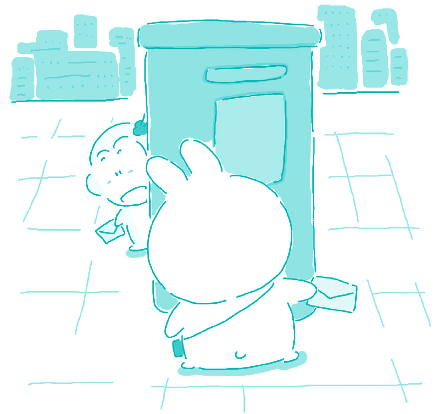

> ###  译文

> **88. 电话和电子邮件使得人们的交往不那么亲密？**

> 有些人说电话和电子邮件使人们在进行交流的时候不那么亲密了。我对这种看法既同意也不同意。和面对面的交流相比，电话和电子邮件确实缺少亲密的因素。但是，这些交流方式并没有削弱人们之间的亲密。

> 正如上面我已经提到过的，用电话或者电子邮件交流比面对面交流缺少亲密的因素。面对面交流有很多好处，例如，你能看到对方的身体语言。身体语言包括面部表情等，是人对谈话做出反应的一个重要指标。如果我们看不到这些线索，很可能就会产生“解码错误”。而这能引起人们之间令人苦恼的误解，特别是就重要问题需要进行严肃谈话的时候。

> 但是这并不意味着因为有了新技术人们之间的交流就不亲密了。我相信当人们需要认真谈谈的时候，他们将会通过电话或电子邮件商定一个面对面交流的时间。最重要的是，没有人会通过电话或者电子邮件进行重要的谈话。从这方面来看，很清楚地表明的是电话和电子邮件实际上是提高了我们有效交流的能力。因为有了这些技术，在需要的时候我们就可以很容易地找到要找的人。

> 总的说来，我认为如果一个人把电话和电子邮件作为他与他人交流的惟一方式，那么他的交流就不是亲密的。但是，如果一个人只是运用这些技术与他人进行联系，而重要的谈话还是通过面对面地进行的话，就没有什么联系上的损失了。 

###  Word List

 * statement ［ˈsteitmənt］ n. 声明，陈述
 * face-to-face ［ˌfeistəˈfeis］ adv. 面对面地
 * in person 亲自；外貌上
 * indicator ［ˈindikeitə］ n. 指示器；指示针；指标
 * clue ［klu:］ n. 线索；暗示
 * misinterpretation ［ˈmisinˌtə:priˈteiʃən］ n. 误译，曲解
 * set up 设立，竖立，建立
 * perspective ［pəˈspektiv］ n. 观点，看法
 * solely ［ˈsəulli］ adv. 独自地，单独地

## 89. What famous person from history would you like to meet?

Throughout history, there have been thousands and thousands of inventors, prophets and visionaries who have dramatically affected the way we live today. If I could meet one of these people, I would choose to meet Tomas Edison, one of the greatest inventors that I respect.

This great man invented thousands of useful products that we still use today, the most famous of which is the electric light bulb. In addition to the light bulb, Edison created the phonograph, the storage batteries, telegraph systems, and a wide variety of other products. To have invented such a diverse range of items, Tomas must have been a brilliant man. I would greatly enjoy meeting him and discussing some of his ideas with him. I am sure that such a meeting would be a great inspiration, and perhaps lead me to create new inventions of my own.

One of Tomas Edison's projects was a working version of the electric car. If he had continued to work on this invention instead of moving on to something new, and if the project was successful, perhaps the world would not have the pollution problems that are so widely present today. It is unfortunate that he did not focus more on this invention. If I could meet him, perhaps I could convince him, that for the sake of future generations, he should not give up on his idea.

Furthermore, what makes me believe that Tomas Edison would be an excellent person to meet from history is because I would love to find out what the keys to his inspirations were. He had so many brilliant ideas; there must have been a secret to his success that I'm dying to know. Perhaps it was just that he was such a hardworking man. He was constantly working on inventions until his late 60's, when finally, he took a rest from inventions. Tomas Edison had a profound effect on all modern societies around the world. His inventions were a catalyst to modernization; in fact, the world would not be where it is today if it were not for this great man and his great mind.

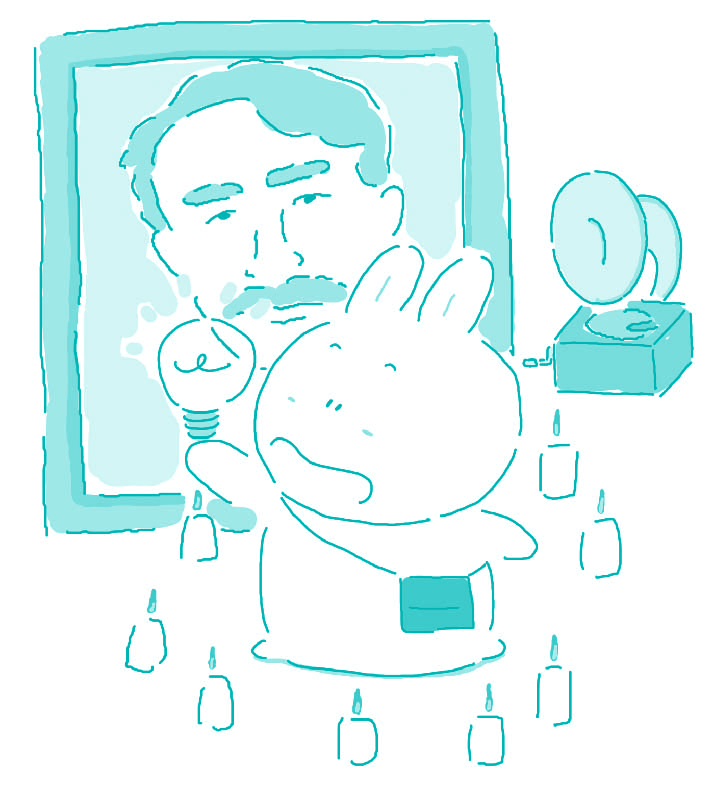

> ###  译文

> **89. 你希望遇到历史上的哪位名人？**

> 旷古至今，历史上有无数的发明家、先知、空想家等在很大程度上影响了我们的生活。如果我能够遇到他们其中的一位的话，我将会选择托马斯·爱迪生，因为他是我所尊敬的最伟大的发明家之一。

> 这位伟人发明了上千种我们至今仍然在使用的东西，其中最有名的就是电灯泡的发明。除了电灯泡，他还发明了留声机、蓄电池、电报，以及其他很多东西。爱迪生发明了这么多东西，那么他肯定是一位很杰出的人，因此，遇见他我将会很高兴，而且要同他讨论一些他的思想。我相信，对我来说这样的一次会面将可以激发我很大的灵感，说不定我也能够发明些新东西。

> 爱迪生的一个项目就是电车的工作模型。如果他一直致力于该产品的研究而不是转向了其他产品，并且如果这个产品成功了，也许世界上就不会有今天这样严重的污染问题了。但不幸的是，他没有继续研究电车。如果我能够见到他，可能我会说服他为了子孙后代而继续他在此方面的研究。

> 此外，我之所以认为爱迪生是我愿意遇到的历史上的杰出人物，是因为我想知道他灵感从何而来。他有那么多好主意，他一定有不为人所知的走向成功的秘密。这是我非常想知道的。秘密也许就在于他工作非常认真努力。他一直致力于新东西的发明创造，直到60多岁才停止。爱迪生对现代社会产生了深远的影响，他的发明是现代化的催化剂。实际上，如果没有爱迪生和他那伟大的思想，世界就不可能是今天这个样子。

###  Word List

 * prophet ［ˈpra:fit］ n. 先知，预言者
 * visionary ［ˈviʒəˌneri］ n. 空想家，梦想者
 * bulb ［bʌlb］ n. 电灯泡
 * phonograph ［ˈfəunəgræf］ n. 留声机，电唱机
 * storage battery n. 蓄电池
 * brilliant ［ˈbriljənt］ adj. 闪耀的，有才气的
 * inspiration ［ˌinspəˈreiʃən］ n. 灵感
 * move on to sth. 继续做某事
 * convince ［kənˈvins］ v. 使确信，使信服
 * catalyst ［ˈkætəlist］ n. 催化剂；接触剂

## 90. What famous entertainer or athlete would you like to meet?

Famous entertainers and athletes have a vast amount of influence over there. It is up to the entertainer to choose how they wield their power over the general public; some try their best to set a good example, while others exhibit depravity and malevolent behavior. Yao Ming, the famous basketball star, is an excellent example of the type of star who tries at time to look after his fans. If I could meet one famous athlete, I would choose to meet Yao Ming.

Yao Ming is very young to be a member of the esteemed National Basketball Association in North America. In his rookie year he has surpassed all expectations of those knowledgeable with the sport. His skill is attested to by the vast number of people interested in his abilities; in fact his popularity is so great that he has replaced O'Neal as starting center in the American All Star Game, which is no small feat. Yao Ming was also the number one rookie pick last year in the NBA. It would be inspiring to meet someone with such great abilities. He must have worked on his talent from a very young age to achieve such greatness.

Another reason why I would love to meet this great man is because he is an excellent ambassador for China. Yao Ming epitomizes Chinese spirit of hard working to achieve greatness. He in a sense brings China to the world. Although China has become an increasingly important part of international culture, our fair country is still relatively unknown to a large portion of the North American population. Yao Ming has titillated the interest of millions of young people around the world, with the unavoidable effect of bringing a focus to China and Chinese culture.

Finally, why I would like to meet Yao Ming is because he is a genuinely kind person. In spite of his fame and notoriety, in interviews you can see that he has remained a gracious and humble person. As an example of his kindness one must only look at his recent efforts in China to help raise money for SARS research. Therefore, I think that Yao Ming would be an excellent role model for all young people today, both in China and the rest of the world. He is a hard working, dedicated man, with a strong, noble character.

> ###  译文

> **90. 你希望遇到哪位娱乐明星或运动员？**

> 著名的娱乐人士、体育明星有很大的影响力，怎样运用对公众的影响力取决于他们自己。有些人竭力树立一个良好的榜样，而有的人却表现出堕落和道德缺失。其中，著名的篮球明星姚明在照顾自己的球迷方面就树立了很好的榜样。如果能让我见到一个体育名星，我会选择姚明。

> 作为一名北美NBA队员，姚明非常年轻。他刚加入NBA就颠覆了人们对篮球的所有认识。他的技术经过了所有对他的能力感兴趣的人们的考验。事实上，他的名声越来越大，他能取代奥尼尔而成为美国全明星赛的首发中锋，可不是件容易的事。在去年的新手选秀大赛上姚明位列第一。能与如此有能力的人相遇该是件多么令人鼓舞的事情呀。他肯定是从很小的时候就开始努力，并发挥自己的天分，所以才能如此成功。

> 我希望能与姚明相遇的另外一个原因是他是一个优秀的大使。姚明是中国人敬业精神的缩影。从某种意义上来说，姚明把中国带给了世界。虽然中国在世界上的地位日益重要，但是还有很多北美人对我们美丽的国家不是很熟悉。是姚明激起了全世界青少年的兴趣，这也不可避免地使他们也对中国和中国的文化倍感兴趣。

> 最后，我想见到姚明是因为他是一个很善良的人。虽然他名气很大，但是在采访中你可以发现他是一个非常有礼貌，也非常谦虚的人。你只需看一看他在中国为非典研究工作而筹钱的事情，就能知道他的善良。因此，我认为不论对国内还是国外的青少年来说，姚明都是他们学习的榜样。他是一个努力工作、具有奉献精神、有着坚强意志和高贵品格的人。

###  Word List

 * athlete ［ˈæθˌli:t］ n. 运动员
 * epitomize ［iˈpitəˌmaiz］ v. 摘要；成为…缩影
 * vast ［væst］ adj. 巨大的；大量的
 * up to 由…决定
 * dedication ［ˌdediˈkeiʃən］ n. 献身；奉献
 * wield ［wi:ld］ v. 支配；掌握
 * portion ［ˈpɔ:ʃən］ n. 一部分；一份
 * depravity ［diˈpræviti］ n. 堕落，腐败
 * titillate ［ˈtitilˌeit］ v. 搔痒；使愉快
 * malevolent ［məˈlevələnt］ adj. 有恶意的，坏心肠的
 * notoriety ［ˌnəutəˈraiiti］n. 恶名，声名狼藉；名声远扬
 * rookie ［ˈruki］ n. 新兵；新手
 * fame ［feim］ n. 名气，名望
 * surpass ［sə:ˈpæs］ v. 超越，胜过
 * gracious ［ˈgreiʃəs］ adj. 亲切的；高尚的
 * attest ［əˈtest］ v. 证明；表明
 * humble ［ˈhʌmbl］ adj. 卑下的；微贱的
 * ambassador［æm ˈbæsədə］ n.大使，使者
 * noble character 高尚的品格

## 91. If you could ask a famous person one question, what would you ask?

In today's society, there is a great amount of pressure on famous people. They must constantly be aware of their appearance, and how they will look in the public's eyes. If I had to pick one question to ask a famous person, I would ask them if they are glad that they achieved fame. I think this question is very interesting because it gives insight into what it would be like to be famous, it tells us about the individual's personality, and it would give the famous people a chance to explain what their life would have been like if they had never been famous.

By asking the above-mentioned question, the famous person would reflect on whether or not they enjoyed their fame. If the person answered that he/she would rather not be famous, it implies that the life of a famous person is not as wonderful as many people expect it would be. However, if the answer was positive, it shows that despite all the negative aspects that come with fame, it is still worth the trouble.

When answering this question, the famous person would give us insight into his/her personality. Perhaps the person would rather be more introverted, and therefore, does not appreciate all of the constant attention. On the other hand, it is possible that the person thrives in admiration and attention, and would not have it any other way. Is the famous person the type of people who does not like having to worry about everything he/she says? Do these types of issues bother him/her? I would find all of this information very interesting. Finally, when answering this question, the person would have to reflect on what his/her life would have been like if he/she had never been famous. Perhaps there were dreams or aspirations that he/she never got to realize because he/ she is now constantly in the public eye. Would life as a regular person have been more enjoyable? By asking the above-mentioned question, all of these queries would be answered.

> ###  译文

> **91. 如果你有机会问某个名人一个问题，你会问什么？**

> 当今社会，名人往往背负着巨大的压力，他们必须时时注重仪表，注意公众形象。如果有机会向名人问一个问题，我会问他们是否为出名而高兴？我认为这个问题很有趣，因为这会让大家明白出名意味着什么，会体现出一个人的个性，会给这位名人一个机会来解释一下如果没有出名，他的生活会是什么样子。

> 通过问这个问题，名人们会反思一下，他们究竟是否喜欢出名。如果有人回答说他或她宁愿没有什么名气，这意味着名人的生活并不像大多数人所预料的那样精彩。然而，如果有人对这个问题做出了肯定的答复，这就表明尽管会招致种种负面效应，出名仍然是值得的。

> 在回答这个问题的时候，我们可以窥探到名人的性格特点。或许这个人性格比较内向，因而不喜欢时时受公众关注；也有可能这个人渴望受到赞美和关注，离开这些便无法生存。名人不得不为自己说的每一句话而担心，被我提问的这位名人是那种不喜欢这种生活的人吗？他或她会经常为此类问题而烦恼吗？我觉得这些信息都非常有趣。

> 最后，在回答问题的时候，这个名人将不得不思考一下如果没有出名，他或她的生活会怎样。也许有很多梦想或愿望会因为他或她总是众人瞩目的焦点而永远也无法实现；如果是一个普通人，生活得会更愉快吗？只要回答了我所提出的那个问题，所有这些质疑就都会得到解决了。 

###  Word List

 * give insight into 洞悉，深刻理解
 * reflect ［riˈflekt］ v. 反省；细想
 * positive ［ˈpa:zitiv］ adj. 肯定的，绝对的
 * introverted ［ˈintrəˌvə:tid］ adj. 格性内向的；含蓄的
 * thrive ［θraiv］ v. 兴旺，繁荣
 * issue ［ˈisu:］ n. 论点；问题
 * regular ［ˈregjələ］ adj. 规则的；有秩序的
 * query ［ˈkwiəri］ n. 质问；询问

## 92. Living in places that have the same weather all year long, or in areas where the weather changes

Because China is such a vast country, the weather and climate changes dramatically from one part of the country to another. Some parts have a mild, warm temperature all year long, whereas other regions of the country have weather patterns that shift dramatically from hot to cold over the year.

Given the choice to live in one type of climate or the other, I would choose to live in a region where the weather is constantly changing throughout the year. The reasons for this are varied. First, I enjoy the different seasons. Second, I take pleasure in many different sports, some of which require warm weather, and others require the cold. Finally, I enjoy living in a region with constantly changing weather because I think that change is good for one's health.

As mentioned above, one aspect I love about living in a region with changing climates is the shift in seasons. I really enjoy walking through a city and being able to see the trees turn from bright green in the summer, to brown in the fall, to bare in the winter, and then come back to life again in the spring. I find the process of nature very beautiful, and appreciate living in a city where I can observe these changes.

In addition to enjoying the seasons, I also get pleasure from playing a wide variety of sports. Some of these sports require summer weather, like swimming, but others require winter weather, like skiing or ice-skating. By living in a region with extreme changes in seasons, I am able to enjoy all of my favorite activities.

Finally, I enjoy living in an area with changing temperatures because I believe that the extreme temperatures are good for one's health. By allowing one's body to adjust to the extremes, one builds their immune system and is healthier overall.

Overall, I find that living in a changing environment is more interesting than living in one where the climate is always constant. I find that if I am sick of the cold in the winter, I can always take a short plane ride to somewhere that is warmer.

> ###  译文

> **92. 住在气候终年不变的地方，还是住在气候一年数变的地方？**

> 中国是一个幅员辽阔的国家，因此各地气候差异较大。有的地方终年气候温和，温度适宜，而有的地方的气候则要在一年中经历从炎热到寒冷的巨大变化。

> 如果要在两种气候条件中做出选择，我会选择居住在气候不断变化的地区。原因有很多：第一，我喜欢季节分明；第二，我热衷于从事不同的运动，这些运动有的需要在温暖的气候中进行，有的则只适宜于寒冷的条件；第三，我认为气候变化有利于人的身体健康，所以，我喜欢居住在气候不断变化的地区。

> 如上所述，我喜欢住在有气候变化的城市中的原因之一是因为有季节的更替。我喜欢漫步在一个城市里，能够看到树叶从夏天的深绿，到秋天的褐黄，到冬天的凋零，再到春天的复苏。我觉得，大自然的这种过程非常美，我非常喜欢住在一个能够观察到这些自然变化的城市里。

> 除了喜欢不同的季节，我还从各种运动中得到了很多乐趣。有的运动适合在夏天进行，比如游泳，而有的运动则只能在冬天进行，比如滑雪或滑冰。居住在一个季节分明的地区，我就能够尽情享受所有我所喜欢的运动了。

> 我喜欢住在有气候变化的地方的最后一个原因是，我认为温度的极限变化对健康有利。通过身体调节来适应这种温差变化，人们可以完善自身的免疫系统，变得更加健康。

> 总得来说，我认为住在气候变化的环境里比住在气候总是一成不变的环境里要有趣得多。如果受不了冬天的寒冷，我还可以乘飞机去温暖的地方做短途旅行。 

###  Word List

 * dramatically ［drəˈmætikəli］ adv. 戏剧性地；剧烈地
 * mild ［maild］ adj. 温和的；适度的
 * shift ［ʃift］ n. & v. 移动，移位；变化
 * bare ［bεə］ v. 无遮蔽的；赤裸的；秃的
 * skiing ［ˈski:iŋ］ n. 滑雪
 * ice-skating ［ˈaisˌskeitiŋ］ n. 滑冰，溜冰
 * immune ［iˈmju:n］ adj. 免疫的

## 93. What makes a good roommate?

While studying at university, many students find that sharing an apartment with roommates is the best living situation available. These arrangements can work out quite well, as long as one chooses the right roommate. There are a number of important qualities that one should look for in a potential roommate. These qualities include friendliness, cleanliness, and a good work ethic.

Choosing a friendly roommate is very important if one wants to create a healthy living environment. If one's roommate is unfriendly, many annoying situations can occur. For example, if one's roommate is unfriendly, it is difficult to hold a conversation with him/her. Being able to have a pleasant conversation is vital, as everyone needs to have a short break from studying from time to time. Conversations can help us to relax a little bit, and can even be a stimulus to continue our work.

Having a clean roommate is also very important. If one's roommate is messy, it can lead to many arguments over whose turn it is to do the cleaning. If one constantly has to clean up after his/her roommate, he/she will have less time to concentrate on his/her studies. Also, living in a clean environment allows one to be much more successful in all endeavors.

Finally, a roommate should have a good work ethic. If one's roommate is constantly procrastinating and waiting until the last minute to do assignments, it can ruin one's ability to do his/her own work. If a roommate is always coming home late or playing music loudly instead of doing work, it will be very difficult for a studious person to get anything done.

In conclusion, I believe that having a clean friendly roommate with a good work ethic is most enjoyable. It allows one to get on with his/her own work, and to concentrate on what matters most: getting good grades.

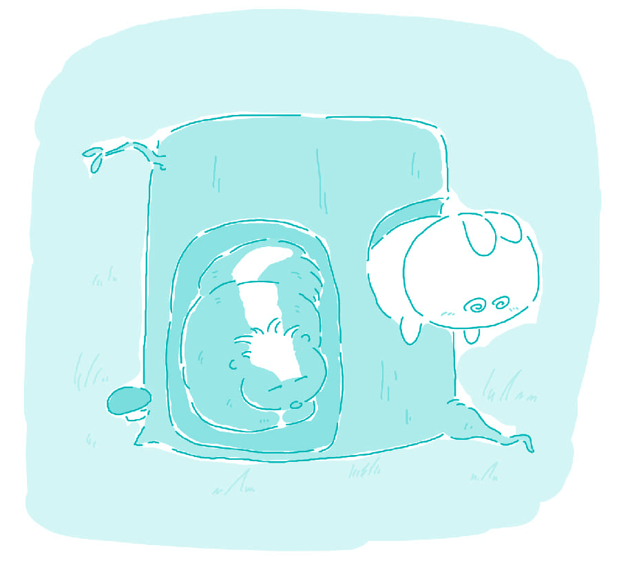

> ###  译文

> **93.好室友需具备的重要品质是什么？**

> 读大学的时候，很多学生会发现与室友同住一套公寓是切实可行的最佳居住环境。只要选择对了合适的室友，这种分配方式会带来很好的效果。在找寻室友时，应该注意对方是否具有这样一些重要品质：待人友好，讲究卫生和有良好的学习习惯。

> 如果想创造一个良好的生活环境，选择友善的室友非常重要。如果室友不友好，会发生许多令人苦恼的事情。比如说，如果室友不友好，就很难与其交谈。能够进行愉快的谈话是非常重要的事情，毕竟每个人都需要不时地从学习中解脱出来稍事休息。交谈会帮助我们放松一下，甚至会激励我们继续投入学习。

> 有一个爱干净的室友也非常重要。如果室友很邋遢，就会在谁该值日打扫卫生这一问题上产生很多争论。如果一个人不得不不停地跟在室友后面打扫卫生，收拾室友留下来的烂摊子，他或她的学习时间必然就会减少。而且，居住在干净的环境里也会让一个人全力以赴，取得更大的成功。

> 一个好的室友所应具备的最后一个品质是应该有良好的学习习惯。如果室友总是拖延到最后一刻才开始做功课，这也会破坏别人完成功课的积极性。如果室友总是晚归或者大声地播放音乐而不是做作业，再勤奋的人也会受其影响，难以做任何事情。

> 总而言之，我认为有一个友善的、爱干净并有良好学习习惯的室友最令人高兴。这样会让人专心于自己的学业，把精力集中于最重要的事情：取得好的学习成绩。 

###  Word List

 * arrangement ［əˈreindʒmənt］ n. 整理；安排
 * as long as 只要，在…的时候
 * potential ［pəˈtenʃəl］ adj. 潜在的，可能的
 * ethic ［ˈeθik］ n. 道德规范，伦理
 * messy ［ˈmesi］ adj. 凌乱的，杂乱的
 * endeavor ［enˈdevə］ n. 努力，尽力
 * procrastinate ［prəuˈkræstəˌneit］ v. 延迟，耽搁
 * ruin ［ruin］ v. 毁坏，毁灭
 * studious ［ˈstu:djəs］ adj. 勤学的；认真的

## 94. Does dancing play an important role in a culture?

There are a number of qualities that have always been present in cultures, recent or ancient. These qualities can be anything from art forms to culturally gained knowledge. These qualities make the culture unique, and allow the culture to offer something interesting to the world. Throughout history, dancing has always played such a role in cultures. This is because dance allows us to express emotion, preserve heritage, and entertain.

Dancing has always held a high position in culture, as it is an excellent way of expressing emotion. Much like the painter using color to convey emotion, dancers can use their body as a tool to show the onlooker their happiness, sadness, pain, etc.

Dancing is also an excellent method of retaining and preserving culture. Many cultures have dance as part of their ceremonies, whether the ceremony is religious or patriotic in form. For example, it is a widely practiced norm to have people dance out a glorious moment in battle. In religion, it is common for people to dance to appease the God or Gods. Because of this, dancing is an excellent way to maintain culture, and ensure that important moments of the past are not forgotten.

In modern days, it is much more common for dancing to be seen as a form of entertainment. Dancing has become somewhat of a sport in some countries, for example, ballroom dancing is very popular in the United States. There are hundreds of bars and disco clubs all over China which focus on dancing. They provide disc jockeys, more commonly referred to as "D.J.s", and play loud, repetitive music which encourages the young people to dance. There are many different styles of dance, but all bring the dancer to have fun, and get a good workout at the same time.

> ###  译文

> **94. 舞蹈是一种文化的重要组成部分吗？**

> 文化，无论是近代的还是古代的，总是包罗万象。文化可以表现为从艺术形式到所学知识的任何形式。是这些形式使得文化有其特殊性，使得文化能够向世界提供一些有趣的事情。纵观历史长河，舞蹈始终在文化中扮演着这样的角色。这是因为舞蹈使人们能够表达情感、保留传统以及娱乐身心。

> 舞蹈总是在文化中居于很高的地位，因为它是宣泄情绪的绝妙方式。就像画家用色彩来表达情感，舞蹈家能够用身体作为工具来向观众表达他们的愉悦、难过、悲伤等各种感情。

> 舞蹈也是维护和保留文化传统的有效方式。宗教仪式也好，爱国庆典也罢，许多文化都把舞蹈作为庆典仪式的一部分。比如说，人们会在战争进行的神圣时刻跳舞，这种做法广为流传。在宗教上，人们通常用跳舞来告慰上帝或众神。正因为如此，舞蹈是保留文化传统的绝佳途径，并能确保过去那些重要的时刻不被人们所遗忘。

> 现代社会，跳舞更多地被视为一种娱乐方式。在有些国家，跳舞还是一种运动，比如说，交际舞在美国就非常流行。中国也遍布了很多可供人们跳舞的酒吧和迪斯科舞厅。那里有DJ，那里有高分贝、反复播放着的音乐，吸引着年轻人来跳舞。舞蹈有很多种不同的风格，但所有的舞蹈都可以给跳舞者带来乐趣，同时也是很好的体育锻炼方式。

###  Word List

 * convey ［kənˈvei］ v. 通知，通报，传达
 * onlooker ［ˈa:nlukə］ n. 旁观者，观众
 * etcetera ［itˈsetrə］ n. （etc. ）
 * 附加的人；附加物；等等
 * retain ［riˈtein］ v. 保持，保留
 * ceremony ［ˈserəˌməuni］ n. 典礼，仪式，礼节
 * patriotic ［ˌpeitriˈa:tik］ adj. 爱国的，有爱国心的
 * norm ［nɔ:m］ n. 标准，规范
 * glorious ［ˈglɔ:riəs］ adj. 光荣的，显赫的
 * appease ［əˈpi:z］ v. 平息，安抚，缓和，使满足
 * disco ［ˈdiskəu］ n. 迪斯科舞；以唱片伴奏的小舞厅
 * disc jockey n. 电台的音乐节目主持人
 * （= D.J.）
 * repetitive ［riˈpetitiv］ adj. 重复的；反复性的
 * workout ［ˈwə:kˌaut］ n. (体育) 锻炼；测验

## 95. Spend money exploring outer space, or for basic needs on Earth?

In the last one hundred years, space exploration has become more and more common: a number of countries have reportedly sent spaceships to the moon, there are dozens of satellites orbiting the earth, and there are massive telescopes floating in space whose purpose is to find out what else could be out there. However, I tend to agree that governments should spend money for basic needs.

Throughout the world, there are millions and millions of people who are homeless, and even cannot afford to eat. These people need help from the government. If the government has so much money to spend on space exploration, they should easily be able to have enough money to help these people gain entry to the working world. The government could set up programs which allow homeless people to train for jobs. This would be a much better way to spend money than exploring space.

Pollution is another major problem which plagues all of the industrial nations. Instead of spending money on other planets, we should be focusing on how to fix the one we live on. The ozone layer is getting thinner and thinner every year, which means that the sun's radiation is causing more damage to people and the environment. The governments need to design a method to drastically reduce pollution, or else we might need to move to one of those other planets they are exploring!

In addition to the problems of pollution and homelessness, the general population could use the money as well. In many countries, including our own, the health care and education system leave so many things to be desired. I think that more money should be put towards making citizens healthier and wiser.

In conclusion, while the study of space is fascinating, I believe that governments spend too much money exploring the great unknown, when they should be focusing on the needs of people on earth.

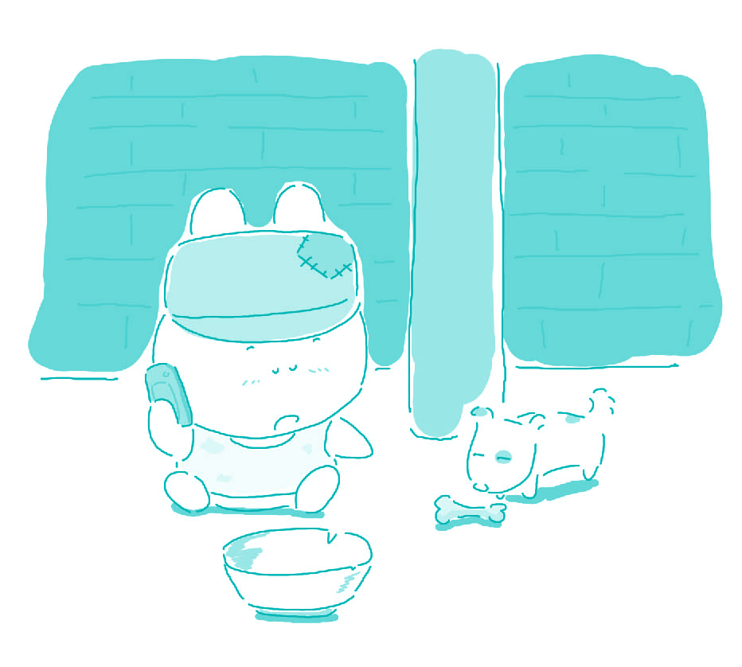

> ###  译文

> **95. 把钱用于外太空探索还是满足人们的基本需求？**

> 近一百年来，空间探索变得越来越普遍：据说很多国家已经把宇宙飞船发射到了月球上，许多卫星正在绕地球轨道而行，大型望远镜被放置在太空中，在寻找那里可能还会有些什么。然而，我认为，政府还是应该把钱花在满足人们的基本需求上。

> 全世界还有千千万万的人无家可归，无以果腹。这些人需要政府的帮助。如果政府有那么多钱用来进行空间探索，那么就更应该有足够的钱来帮助这些人找到工作融入社会，这对政府来说是件很容易的事情。政府应该拟订计划来帮助这些无家可归的人接受培训，使他们找到工作。相比探索太空而言，这是一种更好的花钱方式。

> 污染是折磨着所有工业化国家的另一个主要问题。我们应该关注如何“修复”这个我们赖以生存的星球，而不是把钱花在其他星球上。年复一年，臭氧层正在日益稀薄，这意味着太阳的辐射正在给人类和环境带来更严重的危害。政府需要设计方案来大幅度减轻污染，否则我们只能搬到某一个正在被探索的星球上去居住了。

> 除了那些无家可归的人和污染问题，我们普通人也需要用钱。在许多国家，包括我们自己的国家，卫生保健和教育体系遗留下大量问题亟待解决。我认为，应该把更多的钱用在使公民更加健康和接受更多教育上。

> 总而言之，尽管太空探索非常令人着迷，我仍然坚持认为政府在探索这些未知世界上花费了太多的金钱，政府应该集中精力满足生活在地球上的人类的需求。

###  Word List

 * satellite ［ˈsætlˌait］ n. 卫星；人造卫星
 * orbit ［ˈɔ:bit］ v. 绕…轨道而行
 * space exploration 太空探索
 * telescope ［ˈteliskəup］ n. 望远镜
 * entry ［ˈentri］ n. 进入；入口
 * plague ［pleig］ v. 折磨，使苦恼
 * ozone ［ˈəuˌzəun］ n. 臭氧
 * layer ［ˈleiə］ n. 层，阶层
 * radiation ［ˌreidiˈeiʃən］ n. 辐射，放射；放射线
 * fascinate ［ˈfæsəneit］ v. 使着迷；入迷

## 96. What are the best ways of reducing stress?

With today's hectic schedules, it is necessary to spend some time each day to relax, and let the stress dissipate from our bodies and minds. Most people find that the working world is quite difficult at times, and need a method to relax. I find that the best way to relax is to read a good book, because it allows me to escape from real life, it gives me a new perspective on the world, and reading a book is very peaceful.

I find that reading a good fiction novel is the best way to forget about my troubles during the day. Many of the books I read have fascinating plot lines, which allow me to be absorbed into the drama and action. When you are completely captivated with your book, nothing in the outside world seems to exist anymore. Of course, one cannot stay in this dreamland forever, but for an hour or so a day, it is very calming.

Reading books can also have the added benefit of increasing my knowledge and giving me a new perspective of the outside world. Even a fictional book can have this effect. When an author writes a book, it is full of his nuances and feelings about how the world works. By reading these works, I find that I understand more about other people, and how people think. This allows me to be more accepting of others on a daily basis, and also stops me from building up stress in the first place.

Finally, the most important reason as to why reading a book is good for taking care of stress and relaxing, is that it is a very peaceful activity. You do not need to go anywhere to read a book. You can stay at home, perhaps sit in your favorite chair, and have the house be completely quiet. Reading does not involve anything but you and your book. Also, if there does happen to be noise around you, it is possible to block out that noise once you become engrossed in the plot line.

> ###  译文

> **96. 缓解压力的最好方式是什么？**

> 在忙忙碌碌的现代社会中，我们有必要每天都抽出一些时间来放松一下，缓解身心的压力。大多数人会感觉到工作压力很大，需要找到一种放松的方式。我认为最好的放松就是读一本好书。阅读会让人放松，因为它可以让我逃离现实生活，对世界产生新的认知，而且使人平心静气。

> 我认为，读一本好的科幻小说是使我忘记一天烦恼的最好方式。我读过的很多书都有着引人入胜的情节，可以使我全神贯注投入到书中的事件和情节中。当你完全沉迷于书中时，外界的一切似乎都不复存在了。当然，人不能永远待在这种梦境中，但一天当中抽出一个小时左右的时间来这样做，还是会让人心境平和。

> 读书还可以有更多的好处，那就是可以增长知识，使我对外部世界有新的了解。即使是科幻小说都可以有这种功效。作家写书的时候，书中充满了他对这个世界的微妙感觉和情感。通过阅读这些作品，我发现我更多地了解了别人，了解了人是如何思考的。这使我在现实生活中更容易接纳别人，也使我能够尽快地卸下压力。

> 最后，关于为什么读书有助于减轻压力、放松情绪的最重要的原因是：阅读是一项非常安静的行为。你不需要到其他地方去读书。你可以待在家里，或许是坐在你最喜欢的椅子上，使房子处于绝对安静的状态。除了你本人和书，读书再不需要与任何其他东西有关。而且，如果周围碰巧有噪音，只要你完全投入到故事情节中，噪音也有可能与你隔绝。

###  Word List

 * hectic ［ˈhektik］ adj. 发热的；兴奋的
 * dissipate ［ˈdisəˌpeit］ v. 驱散
 * at times 有时，不时
 * plot line 情节，故事主线
 * drama ［ˈdra:mə］ n. 戏剧，戏剧艺术
 * captivate ［ˈkæptəˌveit］ v. 迷住，迷惑
 * nuance ［ˈnu:ˌa:ns］ n. （颜色、意义等的）细微差别
 * block out 封闭；拟大纲；设计
 * engross ［enˈgrəus］ v. 用大字体书写；吸引
 * take care of 照顾，照料

## 97. Should teachers be paid according to how much their students learn?

People usually believe that teachers have the most important job in all of society. They raise our children to be forward-thinking, bright individuals. They ensure that children get along with each other, and learn to work together as a team. As such, being a teacher typically means a stable paycheck. However, when some people propose that teachers should be paid according to how much their students learn, I can hardly agree.

First of all, students may not be interested in learning. When students are not interested in learning, the teacher can hardly be held responsible. The teacher can grade them harshly, keep them in after class, and discipline them severely, but the students will still not learn if they do not want to. If the teacher is trying his/her best to teach the students, and the information is presented clearly and succinctly, he/she can do no better job.

Moreover, there is a limit on how much a child can learn. If a teacher was to be paid according to how much his/her students learned, there would be a certain point where he/she could teach them no more. I remember when I was in high school, there would be moments in the year when I didn't think I could fit any more information into my head. This was not my teacher's fault, and the point is that I just was not absorbing the material. I think many teachers would find this problem if they were paid by how much their students learnt.

Most importantly, teachers should not be paid according to how much their students learn because some of the lessons that a student learns cannot be measured by a test. We cannot simply give children a test to discover how much they have learnt in a class. Tests rarely measure one's social skills, one's ability to communicate, or one's ability to integrate successfully into the world. However, it is the teachers who help students to manifest these qualities.

> ###  译文

> **97. 应该按学生所学多少来为教师付酬吗？**

> 人们通常认为教师是社会上各行各业中最重要的一种职业。教师把我们的孩子培养成有理想、有知识的人。教师教会孩子们彼此融洽相处，在集体中协同合作。正因为如此，成为一名教师显然就意味着能够得到稳定的薪水。然而，当有人提议按照学生所学多少来支付教师酬劳时，我还是不敢苟同。

> 首先，学生可能对学习不感兴趣。当学生对学习不感兴趣时，教师很难对其负责。教师可能会给那些学生很苛刻的分数，放学后把他们留在学校，严厉地处罚他们，但是如果这个学生自己不愿意，他们还是不会努力学习。如果教师尽了自己的全力来教学生，所讲解的知识表达得简单明了，他或她就是一个合格的教师。

> 其次，一个孩子能学多少是有限的。如果教师获取多少报酬取决于他或她的学生学到了多少，那么就会出现一个分界点，到了这个点他或她就不能再教学生更多东西了。我记得在读高中时，一年当中会有一段时间我觉得自己脑子里再也不能装进任何知识了。这不是我的老师的过错，问题在于我当时消化不了所学的知识了。我想，如果要根据学生学了多少来支付教师工资，许多老师会遇到这样的问题。

> 教师的酬劳不应该由学生学了多少来决定的最重要的原因是，一个学生所学的功课，有一些是无法通过一次测验来衡量的。我们不能简单地给孩子们一张试卷来检验他们在课堂上学了多少知识。考试很难衡量出一个人的社会技能、交际能力，或者是成功地融入社会的能力。然而，正是教师在帮助学生们显现这些品质。 

###  Word List

 * stable ［ˈsteibl］ adj. 固定的；稳定的；可靠的
 * paycheck ［ˈpeiˌtʃek］ n. 付薪水的支票，薪水
 * harshly ［ha:ʃli］ adv. 严厉的，苛刻的
 * severely ［səˈviəli］ adv. 严格地；激烈地
 * succinctly ［səkˈsiŋktli］ adv. 简洁地，简便地
 * fit into 适合
 * integrate into 使与…结合
 * manifest ［ˈmænəˌfest］ v. 出现；表明，证明

## 98. The thing representing your country

If I were to send one thing to an international exhibition that represented my culture, it would be rice. Chinese culture, boasting a lengthy history, is composed of numerous sub-cultures. The agricultural way of life, centered around rice, has played a vastly important part in the country's history.

For thousands of years, the Chinese have been diligently cultivating their land. Blood, sweat and tears have been shed over their soil in the pursuit of favorable harvests. This reliance on the land for so many thousands of years accounts for China's strong rural essence. The need for rice production has led the Chinese to pay particular attention to irrigation technologies and improving cultivation. The agricultural way of life, centered on rice, has had a strong influence on the social, economic, political and ideological developments of ancient China. In this sense, traditional Chinese culture may be considered a"rice culture."

"A meal without rice," the Chinese say,"is like a beautiful woman with only one eye." In China, where the word for rice is also the word for food, young girls are warned that every grain of rice they leave in their bowls will be a pockmark on the face of their future husbands. Instead of saying,"How are you?" as a typical greeting, the Chinese ask"Have you had your rice today?" Quitting or losing a job is called "breaking the rice bowl" and it is bad luck to upset a bowl of rice.

Rice is also a very important commodity in today's society. It is one of the major exports in China, allowing people all over the world to take part in something that emanates Chinese culture. Rice remains a staple food for both the rich and the poor, and there is hardly a meal had in our country that does not involve this fine grain. As you can see from the above-mentioned text, rice is an integral part of Chinese culture and tradition. While Chinese culture is spread over a vast number of arts and crafts, I believe that it is the humble, but profound rice that speaks to us all, and most poignantly represents the essence of our culture.

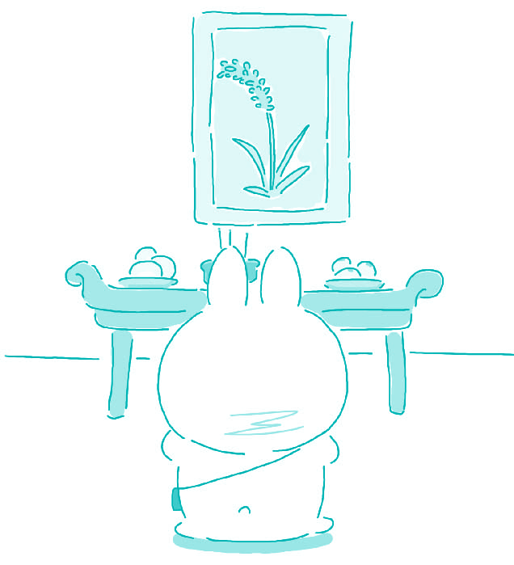

> ###  译文

> **98. 代表你国家的一样东西**

> 如果让我送一样代表中国文化的东西去参加国际展览，那就是稻米。中国文化，源远流长，包含着大量的文化分支。围绕稻米而展开的农业生活在中国历史上扮演着非常重要的角色。

> 几千年来，中国人民一直在勤勤恳恳地耕耘着他们的土地。血水、汗水、泪水，伴着对好收成的追求一起挥洒到了他们的土壤里。这种几千年来对土地的依赖诠释了中国作为农业大国的本质。对稻米产量的需求使中国人特别关注灌溉技术，改善耕作。以稻米为中心的农业生活对古代中国的社会、经济、政治和意识形态发展产生了极大的影响。从这个意义上来说，传统的中国文化可以被视为“稻米文化”。

> 俗话说，“吃饭没有米，就像漂亮姑娘只有一只眼”。在中国，与米有关的词也都与食物有关。小女孩们会被告诫饭碗里每剩下一粒米，未来丈夫脸上就会多一颗麻子。中国人典型的问候语是“你今天吃了吗？”而不是“你好吗？”。中国人把辞职或失业称为“打破饭碗了”，而打翻了一碗米会被认为是要倒霉的先兆。

> 稻米在当今社会也是一种重要的商品。作为中国的主要出口商品之一，稻米使世界各国人民体味到了中国文化的博大精深。稻米一直是人们的主食，没有贫富之分。在我们国家，没有一顿饭不与稻米这种细粮有关。

> 综上所述，稻米是中国文化和传统不可分割的一部分。虽然中国文化遍布于大量的艺术品和手工艺品中，我仍然坚信，是这谦卑而又有深邃内涵的稻米在向我们传达，它才最能代表我们的文化。

###  Word List

 * boast ［bəust］ v. 自夸；以拥有…而自豪
 * be composed of 由…组成
 * sub-culture ［ˈsʌbˌkʌltʃə］ n. 亚文化，次文化
 * agricultural ［ˌægriˈkʌltʃərəl］ adj. 农业的，农艺的
 * cultivate ［ˈkʌltəveit］ v. 培养，耕作
 * shed ［ʃed］ v. 流下；流出，发散
 * irrigation ［ˌiriˈgeiʃən］ n. 灌溉；冲洗
 * ideological ［ˌaidiəˈla:dʒikəl］ adj. 意识形态的；思想的
 * pockmark ［ˈpa:kma:k］ n. 痘痕，麻子
 * take part in 参与，参加
 * emanate ［ˈeməˌneit］ v. 散发，发出；发源
 * poignantly ［ˈpɔinjəntli］ adv. （味觉、嗅觉方面）刺激地 

## 99. Be assigned a roommate, or choose your own roommate?

Going to university is an exciting time in a young person's life. Part of the experience is living in the campus dormitory, and it is the first time for person away from his/her parents, in many cases. If one has to share a room with another student, I believe that it is better that the university picks the prospective roommate.

When a young person first goes to university, he/she often moves straight to the school from his/her bedroom at his/her parents' house. This usually means that the person has no idea of the qualities necessary to be a good roommate. Perhaps the young person would choose to live with a good friend. While this situation could be a very happy one, it could also be disastrous. Getting along with a friend as a roommate, if not properly handled, could quickly ruin the relationship. If the school picks one's roommate, this is less likely to happen.

In many cases, young people travel out of the city they grew up in to go to university. For many of these students, picking a potential roommate would be difficult. They know very few people in the new city, let alone at the university. This can lead to very stressful situations. If one is trying to settle into a new environment, but also must find a roommate to live with, he/she might find the whole experience overwhelming.

Finally, I think having the school choose roommates rather than the individuals is a good idea because living with a person you do not know can be a rewarding experience. A stranger can quickly turn into one's best friend, as memories are forged while living together in a confined space.

> ###  译文

> **99. 被分配室友，还是自己选择室友？**

> 上大学是一个青年人生活中一段令人兴奋的时光，其中一部分经历是在校园的住宿生活。在很多情况下，这是一个人第一次离开父母。如果一定要与另一个同学合住一个房间，我想更好的办法是由学校来选择未来的室友。

> 青年人第一次上大学时，通常是从自己在父母家中的卧室直接来到校园的。这意味着此时的学生还对一个好的室友应该具备什么素质没有概念。也许这个学生会选择与一个好朋友住在一起。这样做有可能是一件令人愉快的事情，但同时也有可能产生不好的结局。与好朋友住在一起，如果处理得不好，可能很快就会损坏你们之间的关系。而如果是由学校来安排室友，就不太可能会发生这样的事情了。

> 在多数情况下，青年人会远离他们原来生活的城市到异地求学。对这些学生中的许多人来说，选择室友将是一件困难的事情。他们在整个新城市中都没几个认识的人，更不用提在学校里了。这会让他们感觉很压抑。如果一个人既要努力适应新的环境，又必须自己寻找同住的室友，很可能会被这样的经历而弄得筋疲力尽。

> 最后，我之所以认为最好由学校，而不是个人，来选择室友是因为：与不了解的人同住在一起将是一种有益的经历。随着同住在狭窄空间里的回忆不断累积，这个陌生人可能会很快成为你最好的朋友。

###  Word List

 * disastrous ［diˈzæstrəs］ adj. 灾难性的；极坏的
 * ruin ［ru:in］ v. 毁坏，毁灭
 * properly ［ˈpra:pəli］ adv. 适当地；完全地
 * let alone 不管；不打扰
 * settle in 迁入
 * overwhelming ［ˌəuvəˈhwelmiŋ］ adj. 压倒性的
 * rewarding ［riˈwɔ:diŋ］ adj. 报答的，值得的
 * turn into 进入；（使）变成
 * forge ［fɔ:dʒ］ v. 铸造
 * confine ［ˈkənfain］ v. 限制，禁闭

## 100. Spend money on developing or buying computer technology, or on more basic needs?

I believe that governments spend too much money on new computer technologies, when they should be focusing on the needs or people in their countries. There are a number of reasons why I think this would be a better usage of a country's money.

Throughout the world, there are millions and millions of people who are homeless, and cannot afford to eat. These people need help from the government. If the government has so much money to spend on computer technology, they should easily be able to have enough money to help these people gain entry to the working world. The government could set up programs which allow homeless people to train for jobs. This would be a much better way to spend money than building computers.

Pollution is another major problem which plagues all of the industrial nations. Instead of spending money frivolously, we should be focusing on how to fix the one we live on. The ozone layer is getting thinner and thinner every year, which means that the sun's radiation is causing more damage to people and the environment. The governments need to design a method to drastically reduce pollution.

In addition to the problems of pollution and homelessness, the general population could use the money as well. In many countries, including our own, the health care and education systems leave something to be desired. I think that more money should be put towards making citizens healthier and wiser.

With that said, many of the above disagreements need the help of the computer industry. Computers can help governments to keep track of all of the people they need to take care of, and programs can be designed which help isolate problems with the environment. Computers are important, as long as a government does not forget to take care of its people.

> ###  译文

> **100.把钱用在发展或购买计算机技术上，还是用在基本需求上？**

> 我认为，政府把太多的钱用在了计算机新技术方面，而他们应该关注的是满足国民的需求。之所以持这种观点，原因如下：

> 全世界还有数以万记的人无家可归，无以果腹。这些人需要政府的帮助。如果政府有那么多钱用在研发计算机技术上，那么就应该很容易有足够的钱来帮助这些人找到工作。政府应该拟订计划来帮助这些无家可归的人进行职业培训。相比研究计算机而言，这是一种更好的花钱方式。

> 污染是折磨着所有工业化国家的另一个主要问题。我们应该关注如何“修理”这个我们赖以生存的星球，而不是盲目地花钱。年复一年，臭氧层正在日益稀薄，这意味着太阳的辐射正在给人类和环境带来更严重的危害。政府需要设计方案来大幅度减轻污染。

> 除了那些污染问题和无家可归的人，我们普通人也需要用钱。在许多国家，包括我们自己的国家，卫生保健和教育体系遗留下大量问题亟待解决。在我看来，应该用更多的钱来使公民更加健康、接受更多的教育。

> 诚然，上述争论需要计算机技术来帮助解决。计算机可以帮助政府记录下所有需要照顾的人的名单，可以设计程序使污染问题与人类隔离。只要政府没有忘记照顾好国民，计算机同样也是重要的。 

###  Word List

 * usage ［ˈju:sidʒ］ n. 使用；用法
 * frivolously ［ˈfrivələsli］ adv. 轻浮地，愚昧地
 * gain ［gein］ v. 得到；增进；赚到
 * put forward 放出，拿出，提出
 * keep track of 明了

## 101. Doing work: by hand or using machines?

Some people like doing work by hand. Others prefer to use machines. I definitely fall into the latter category. I use a machine for almost all of the work I do. The reasons why I prefer to use machines are that most hand work is tedious, machines are faster and more efficient, and I am more proficient with most machines.

Two things that I spend a copious amount of time doing are writing and sewing. Both of these endeavors border on pain if I do not have a computer or a sewing machine, respectively. What was once a fun task becomes very monotonous, and no longer enjoyable. Using a machine can turn ordinary tasks into exciting ones.

Using machines to do work is also much faster and more efficient than using your hands to do it. For example, if I wrote this essay by hand, rather than using the computer, it would probably take me at least five times as long. Hand sewing a shirt would take ten times longer than using a machine to do the same work.

Not only are machines faster and more efficient, I am much more proficient using machines than I am doing the same work by hand. I find that when I am sewing by hand, all of my seams are very uneven and crooked. However, when I sew on a machine, my seams are perfect. The machine helps to keep my hand in line, therefore I can turn out a much better product. It is the same for writing essays. My handwriting is messy at times. If I had write a paper, I cannot correct it as easily as if I had written it on the computer. My writing blurs together, and sometimes I cannot even read what I have written down. Machines are definitely a better way for me to work efficiently, proficiently, and enjoyably.

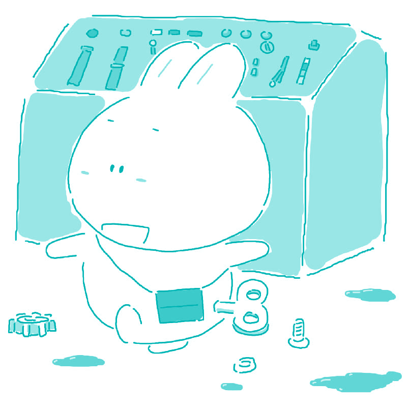

> ###  译文

> **101. 手工劳动，还是机械作业？**

> 有的人喜欢手工劳动，有的人喜欢机器作业。我更倾向于后者。几乎所有我所做过的工作都是使用机器的。我之所以更愿意使用机器是因为大多数手工劳动都很单调，用机器可以更快捷、更高效，而且，大部分机器的使用方法我都很精通。

> 我的大部分时间都用在两件事情上：写作和缝纫。如果不分别使用电脑和缝纫机，做这两件事情就会处于痛苦的边缘。这项过去曾经有趣的工作变得单调乏味，不再是一种享受。使用机器可以让普通的工作变得令人兴奋。

> 机器作业比手工劳动要快得多，也更有效。比如说，如果这篇文章我用手写，而不是用电脑，那将可能多花费我至少5倍的时间。手工缝制一件衬衫会比机器缝纫多花费10倍的时间。

> 不仅仅是因为机器作业更快、更有效，相比手工劳动来说，我对使用机器要精通得多。我发现当我手工缝制时，我的接缝既不平又扭曲，而当我使用机器缝纫时，我的接缝处总是做得无可挑剔。机器使我的手总是能成直线工作，因此我可以做出好得多的产品。写文章也是一样的。我书写的笔迹有时会一团糟。如果手写文章，我无法像在电脑写作那样容易地改动字迹。我写的字会模糊一片，有时甚至连我自己都看不懂我写了什么。毫无疑问，使用机器会使我的工作更有效、更熟练、更愉悦。

###  Word List

 * definitely ［ˈdefənitli］ adv. 确切地；无疑地
 * category ［ˈkætigɔ:ri:］ n. 种类
 * tedious ［ˈti:diəs］ adj. 单调乏味的
 * proficient ［prəˈfiʃənt］ adj. 熟练的；精通的
 * copious ［ˈkəupjəs］ adj. 很多的，丰富的
 * sewing machine 缝纫机
 * monotonous ［məˈna:tnəs］ adj. 单调的，无变化的
 * uneven ［ʌnˈi:vən］ adj. 不平坦的；不均匀的
 * crook ［kruk］ v. 使弯曲；诈骗

## 102. Should schools ask students to evaluate their teachers?

Teachers have a very difficult job in society. They not only have to learn how to teach material effectively, but also must learn how to deal with a wide variety of personalities. While teaching is a difficult job, I think it is important for schools to ask students to evaluate their teachers. I think this is the right thing to do because it encourages teachers to try their best, it gives students the opportunity to choose effective teachers, and it allows the schools to have the best teachers possible teaching.

If a teacher knows that at the end of the term, the students will be evaluating his/her work, then the teacher will be driven to do a very good job. If there is no pressure from evaluation, a teacher might be prone to doing a less than perfect job. I believe that everyone needs an occasional evaluation to ensure they are doing their job correctly. In the case of a teacher, the students will give the most important evaluations.

If there was a public summary of which teacher scored the highest on his/ her evaluations, then students would be able to take courses based on which teacher was the best at the job. This would allow students to excel in their studies, and achieve better grades.

Finally, if schools ask students to evaluate their teachers, the schools themselves would be able to have the best teachers working on campus. If a teacher scored too low on an evaluation, a replacement could be found. This is a much better method than waiting for students to complain about a teacher.

Teachers do have a difficult job, but regardless of this, they must excel at it. If a person is a particularly poor teacher, the students will not learn the required material, and suffer for it.

> ###  译文

> **102. 学校应该要求学生对教师进行评估吗？**

> 在社会上，教师的工作很难做。不仅要学会如何有效地授课，教师还必须学会如何应对种种个性。尽管教师的工作有其困难性，我仍然认为学校应该让学生来对他们的教师进行评估，这对学校来说很重要。这种做法是正确的，因为这可以激励教师尽全力工作，可以赋予学生选择优秀教师的机会，也可以使学校有可能在教学上拥有最好的教师。

> 如果一位老师知道他或她的学生将在期末时评估他的工作，这会推动他或她把工作做得非常好。如果没有评估的压力，老师有可能表现得稍逊一筹。我认为，每个人都需要时不时地接受评估，以确保他/她在准确地做着工作。对教师而言，学生的评估是最重要的。

> 如果对哪一位教师在评估中获得最高分有一个公开总结，那么学生们就可以根据哪名教师教得最好来选择课程。这有利于学生学习优秀，取得更好的成绩。

> 我想说的最后一点是：如果学校让学生评估老师，学校本身就能够招揽最好的教师来工作。如果某位老师在评估中取得的分数太低，就该考虑找代替者了。与其等待学生来抱怨哪位老师不好，采用这种评估的做法会好得多。

> 老师的工作的确难做，尽管如此，他们必须做得出色。如果老师不好，学生们就学不到所需知识，并为此而付出代价。

###  Word List

 * deal with 安排；处理
 * pressure ［ˈpreʃə］ n. 压，压力
 * be prone to 有…的倾向；易于
 * score ［skɔ:］ v. 给…评分
 * excel ［ikˈsel］ v. 优秀，胜过他人
 * suffer ［ˈsʌfə］ v. 遭受，经历，忍受

## 103. The most important characteristic that a person can have to be successful in life

To be successful in life, one should have the characteristic of independence, that is, he/she has the ability to think critically. By critical thinking, one is capable of analyzing insightfully, concentrating on the right target, thereby making a wise decision.

Thinking critically can enable one to analyze problems insightfully. We live in a world where controversial issues are often simply taken for granted. For example, most people are reluctant to think carefully about issues like whether boys and girls should take separate classes. Recently a high school in Beijing announced that their students from then on take separate classes. Many parents support such ridiculous decision without careful consideration. They are poor thinkers. Critical thinking is but to ask some simple yet essential questions, which always brings amazing sometimes appalling outcomes. Is such a scheme capable of eliminating underage sexual behaviors among adolescents? Is such a scheme guarantee boys and girls free of negative effects? Sadly, the decision had been made but the question left unanswered.

Thinking critically can help one concentrate on right targets. We all have only and exactly 24 hours a day, but we often have mountainous work to do in hands, along with which many personal affairs seem equally urgent. Concentrating on right targets is probably the only way to overcome such dilemmas. For example, ETS has recently announced that GRE examination will be transformed back to paper based test. Grumbles are all around, and complains are posted almost on every BBS on the Internet. But if students think critically, however, they will find out the simple fact that even if ETS had made an awkward decision, test preparers should concentrate on the right target—preparing test as prudently as possible, and at the same time, grumbling never helps.

Only by thinking critically can one make decisions wise and prudent. Sound decision making is essential to success. Decisions such as which movie theater we should go tonight are simple enough to make by tossing a coin, but decisions such as which university or which major we should choose are complicated enough so that we need careful comparisons. A comparison sheet will help a lot, simply by listing several relevant questions such as "Am I really interested in this major?" or "Are there more opportunities in the city where the university locates?" By analyzing insightfully and concentrating on the right targets, wise decisions are not hard to reach at all.

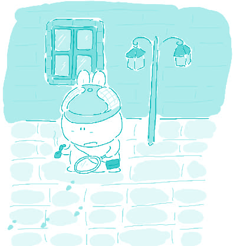

> ###  译文

> **103. 取得成功最重要的品质**

> 要想取得成功，一个人应该具有独立性，即拥有批判性思考的能力。批判性思考可以帮助你具备深刻分析问题，集中精力向正确的目标努力的能力，从而做出明智的决策。

> 批判性思考能够使你在分析问题时富有洞察力。在我们所生活的世界上，很多矛盾的问题经常被简单地认为是理所当然的。比如，大多数人不愿意去仔细考虑类似男生女生是否应该分班上课的问题。最近，北京的一所中学宣布从现在开始，学校的学生开始分班上课。许多家长没过多考虑就表示支持这个荒唐的决定。这是他们缺乏深入思考的表现。但批判性思考则会提出简单明了、切中要害的质疑，这些质疑常带来令人惊异、有时甚至是震惊的后果。这样的计划能否减少青少年间的未成年性行为？这样的计划能否保护少男少女，避免遭受消极的影响？可悲的是，这样的计划实施了，可问题依然存在。

> 批判性思考也可以帮助人们集中精力向正确的目标努力。我们每个人每天都只有24个小时，但我们手中的工作经常会堆积如山，同时，许多私人事务也似乎具有同样的重要性。而集中精力向正确的目标努力，是迈出这个两难境地的惟一办法。比如，ETS最近宣布GRE考试将重新采用笔试的形式。到处都是报怨，互联网的各个论坛里也都贴着报怨的帖子。但是只要学生们批判性地思考，就会发现很简单的事实：即使ETS的决定是愚蠢的，准备考试的人也应该把精力集中在正确的目标上——尽可能把考前准备做细致。同时明白抱怨是不能解决任何问题的。

###  Word List

 * critical thinking 批判性思考
 * dilemma ［diˈlemə］ n. 进退两难的局面
 * controversial ［ˌka:ntrəˈvə:ʃəl］ adj. 争论的，争议的
 * announce ［əˈnauns］ v. 宣布，通告
 * grumble ［ˈgrʌmbl］ n. 怨言
 * v. 抱怨
 * take it for granted 想当然
 * awkward ［ˈɔ:kwəd］ adj. 笨拙的；不方便的
 * outcome ［ˈautˌkʌm］ n. 结果，成果
 * underage ［ˈʌndəridʒ］ adj. 未成年的，未到法定年龄的
 * prudent ［ˈpru:dənt］ adj. 慎重的；谨慎的
 * toss ［tɔs］ v. 投，掷
 * mountainous ［ˈmauntənəs］ adj. 山一般的；巨大的
 * complicated ［ˈka:mpliˌkeitid］ adj. 复杂的，难解的
 * urgent ［ˈə:dʒənt］ adj. 急迫的，紧急的
 * sheet ［ʃi:t］ n. （一）片，（一）张，单

## 104. Artists' contribution or scientists' contribution,which is more valuable?

Art and science are essentially a strange coupling. Yet more often than not, they are considered as divergent rather than consistent with each other. The artistemploys image and metaphor; the scientist uses number and equation. By casual juxtaposition, these two fields seem to have little in common: there are few, if any, references to art in any standard textbook of science; art historians rarely interpret an artist's work in light of the conceptual framework of science. Despite what appear to be irreconcilable differences, however, they do have at least one thing in common—both of them have significant contribution to the society, but through probably distinctive way.

The development of science and technology has always accompanied the progress of the society. The invention of the steam engine brought a new era of thrift of world economy; the employment of electricity has multiplied the productivity and virtually reproduced limited resources on the Earth; the innovation of computer technologies has made the Earth a little village and connected distant countries as a single market. While sometimes the progress of science and technology, such as that of human cloning, cause troubles or originate dilemmas, it seems always undeniable that in a broad sense, the development of science has provided people a much higher standard of living than that of their counterparts in any phrase of the history.

Visualization and fascination have been the major power of any form of art. For example, any religion in this world cannot exist without music, which helps realize the faith of the church to an astonishing extent. Each and every revolution on this earth was accompanied by numerous corresponding art productions, because the artists sense the circumstances, and then reflect their sensations with sophisticated techniques in their production, which can be easily perceived by thepublic through powerful empathy. Nobody could evaluate art as correct or not standard, needless to say the public, they simply feel it is good or not, therefore art has always had magic influence on the public and society in general.

However, it's been said that there is no science without fancy and no art without facts. Science fictions have long been functioning as a major vehicle for the public dissemination of science; scientists share parallel view of space, time and light, etc. with artists. Not only are art and science interrelated with each other but they also contribute to each other in various way. Therefore, it is hard to compare the contributions of art and science, it is simply partial to say that either one contributes more to the society than another does.

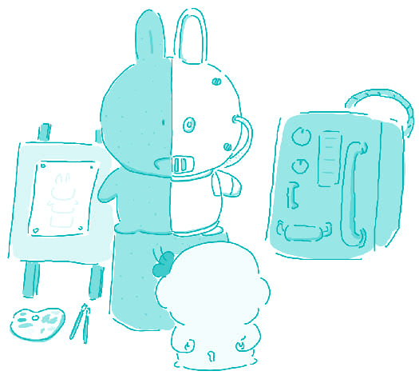

> ###  译文

> **104. 艺术家与科学家，谁做的贡献大？**

> 艺术与科学本质上是一种很奇怪的组合。然而，在更通常的情况下，它们被认为是互相排斥的，而不是相容的。艺术家一般使用形象和比喻，而科学家则使用数字和公式。简单地并列在一起，这两个领域似乎很少有共同点。在标准的科学类教科书中，很少会提及艺术；艺术史学家在分析艺术家的作品时，也几乎不会使用科学上的概念框架。尽管看起来有这些不可调节的差别，但它们至少有一个共同点——都对社会做出了重大的贡献，只是通过不同的方式而己。

> 科学技术的发展与社会进步总是息息相关。蒸气机的发明开创了世界经济节约成本的新时代；电的使用大幅度提高了生产力，事实上，还使地球上有限的资源得到再生；计算机技术的革新，使世界成为一个地球村，使遥远的国家连接起来形成全球市场。然而科学技术的进步也会带来麻烦或者引起灾难，比如克隆人技术。从广义上来讲，科学的发展使人类的生活水平达到前所未有的高度，这一点似乎是永远也不能否认的。

> 想象力和感染力支撑着所有艺术表现形式。比如说，世界上任何一种宗教的存在都离不开音乐，它有利于把人们对宗教的信仰表达到一种令人震撼的程度。每一次革命，都会产生大量相关的艺术作品，因为艺术家感觉到了社会环境的变化，并把这种感觉用高超的手法在作品中表达出来，公众很容易就心领神会。没有人能够用正确或者不规范来评价艺术，更不用说公众了，他们仅仅是感觉艺术作品好还是不好。所以艺术总是对公众和社会有着神奇的影响力。

###  Word List

 * coupling ［ˈkʌpliŋ］ n. 联结，接合，耦合
 * divergent［di ˈvə:dʒənt］adj.有分歧的；不同的
 * consistent ［kənˈsistənt］adj.一致的；调和的；坚固的
 * metaphor ［ˈmetəˌfɔ:］n. ［修辞］隐喻，暗喻，比喻说话
 * equation ［iˈkweiʒən］ n.相等；平衡；综合体
 * juxtaposition ［ˌdʒʌkstəpəˈziʃən］n. 毗邻，并置，并列
 * have...in common 有…共同点
 * historian ［hiˈstɔ:riən］ n. 历史学家，史家
 * interpret ［inˈtə:prit］ v. 解释，说明；口译
 * conceptual ［kənˈseptʃuəl］ adj. 概念上的
 * framework［ ˈfreimˌwə:k］ n.构架，框架，结构
 * irreconcilable［iˌrekənˈsailəbl］adj. 不协调的，矛盾的
 * distinctive［diˈstiŋktiv］adj.与众不同的，有特色的
 * steam ［sti:m］ n. 蒸汽，水汽
 * thrift ［θrift］ n. 节俭，节约
 * multiply ［ˈmʌltəˌplai］ v. 繁殖；乘；增加
 * productivity［ˌprəudʌkˈtiviti］n.生产力；生产率
 * reproduce ［ˌri:prəˈdu:s］n.繁殖，再生，复制
 * innovation ［ˌinəˈveiʃən］ n. 改革，创新
 * clone ［kləun］ n. & v. 无性繁殖，克隆
 * undeniable ［ˌʌndiˈnaiəbl］ adj.不可否认的
 * counterpart ［ˈkaunˌtəpa:t］ n. 副本；极相似的人或物
 * corresponding［ˌkɔriˈspa:ndiŋ］adj.相应的；通讯的
 * sensation［sen ˈseiʃən］n.感情；耸人听闻的
 * empathy ［ˈempəθi］ n. 通感
 * dissemination［di ˌseməˈneiʃən］n.分发，传播
 * parallel［ˈpærəˌlel］ n. 平行线，平行面</li>

## 105. Living in university housing or in an apartment in the community?

Being a new student at a university is an excitment. Choosing where to live, whether on campus in a dormitory, or off campus in an apartment, is in fact quite a big decision. Both of these options have their relative benefits.

Living in a dormitory has many advantages over living off campus. For example, one has the opportunity to meet dozens of new students. One is usually placed in a room with a roommate, who can help with homework, and give much needed support during difficult times. Another advantage of living in a dormitory is not having to cook food. Most students coming to a university have lived their whole lives with their parents, and inexpert at preparing food, for they were not in charge of the cooking in home. Many students who first learn to cook their own food while going to school eat a very unhealthy diet. On top of this, many students are so preoccupied with their studies that they do not have time to cook a nutritious meal. Therefore, the fact that the dormitories include a cafeteria is very beneficial.

However, living off campus has its advantages as well. In most situations, one has much more freedom to do what they want in these living conditions. For instance, one can stay up late studying or come home late without disturbing a roommate. Also, one is not limited to the cafeteria food if he/she is a particular eater. Living by oneself also has its benefits. One never has to deal with rude or messy roommates. Overall, I think that both of these options are good choices. However, I recommend that first or second year students live in a dormitory, and perhaps wait until they are older and more accustomed to university life before venturing out on their own. This way, one gets the best of both worlds: the camaraderie of living with many people and the independence of living by oneself.

> ###  译文

> **105. 住在大学宿舍还是社区公寓？**

> 成为一名大学新生是令人兴奋的。究竟是选择住在学校的宿舍里，还是住在校外的公寓中，事实上是一个很大的决定。两种选择都有其相对的好处。

> 住在校内宿舍里比住在校外有一些优势。比如，一个人可以有机会见到好多新同学。宿舍里通常会有一个室友，他可以在学习上帮助你，还可以在你遇到困难的时候给你支持。另一个好处就是可以不用自己做饭。许多大学生以前都是跟父母生活在一起，不怎么会做饭，因为他们在家里不负责做饭。他们开始学会自己做饭，是因为进入学校后，发现在学校里吃得并不好。另外，许多学生功课特别多，他们根本没有时间自己做可口的饭菜。因此，有自助餐厅的学校宿舍对学生来说会是非常方便的。

> 但是，住在校外也有好处。大多数情况下，住在校外可以有更多的自由空间做自己想做的事情。例如，一个人可以学习到深夜，或者很晚才回家，而不用担心打扰了室友。而且，如果他或她是个吃饭挑剔的人，可以不受学校自助餐厅的限制。自己一个人住的好处还有：不用担心碰到粗鲁或邋遢的室友。

###  Word List

 * dormitory ［ˈdɔ:miˌtɔri］ n. 宿舍
 * live off 住在…外
 * dozen ［ˈdʌzən］ n. 一打，十二个
 * inexpert ［inˈekˌspə:t］ adj. 不熟练的
 * diet ［ˈdaiit］ n. 饮食；食物
 * preoccupy ［pri:ˈa:kjəpai］ v. 使全神贯注；迷住
 * nutritious ［nu:ˈtriʃəs］ adj. 有营养成分，营养的
 * cafeteria ［ˌkæfiˈtiəriə］ n. 自助餐厅；咖啡店
 * disturb ［disˈtə:b］ v. 弄乱，打乱
 * venture ［ˈventʃə］ v. 冒险

## 106. What kind of transportation you would choose?

If I need to travel to a place 40 miles away from my home, there are a number of different modes of transport I could utilize, namely, I could take the bus, a car, or the train.

The bus is a good choice as the bus system in Beijing has been welldeveloped. It is possible for me to travel almost anywhere within 40 miles of my house by bus. While on the bus, I can read a book, or relax, assuming it is not too full. The problem with taking the bus, however, is that it is often crowded. It is often uncomfortable, especially during hot summer days.

Taking a car is an excellent option, assuming one can afford a car. Cars are notoriously expensive in China, and most people do not have this luxury. However, if it is available, a car is very convenient. You can travel to the exact desired location in record time. A car, especially a personal car, is never crowded. You never have to share space with anyone. However, one cannot relax while driving a car. There is no opportunity to just take in the sights, or read a book. One must always be focused on the road.

The train, or the subway, is another option. If the location I am traveling to is on the subway line, then this option is by far the best. While trains can be congested, they are the fastest method of traveling. Subway trains are never subject to traffic jams, as they usually run underground. However, the subway system in Beijing does not go everywhere that I need to. Often, if I take the subway, I then have to either walk for 20 minutes, or take a bus.

Overall, I think that the car is the best option, if it is available. The car is convenient and comfortable. However, the bus and the train are both good options if a car is not available.

> ###  译文

> **106. 你会选择何种交通方式？**

> 如果需要去一个离家40英里的地方，我可以选择多种交通工具，比如我可以乘公共汽车，坐私人汽车或搭乘火车。

> 北京的公共交通很发达，对我来说，公共汽车是个不错的选择，我可以乘坐公共汽车去离家40英里的任何地方。在汽车上，我还可以看看书或休息一下，当然这是以车上的人不多为前提的。然而，公共汽车的问题在于车上乘客总是很拥挤，这非常不舒服，尤其是在夏天很热的时候。

> 如果自己拥有一辆汽车的话，那乘汽车也是个不错的选择。在中国，汽车非常昂贵，很少人拥有这样的奢侈品。但是，如果拥有一辆汽车，是非常方便的。你可以用最快的时间去任何你想要去的地方。乘坐汽车，特别是私家汽车，从来不会感到拥挤。你永远不必担心跟其他人争夺空间。然而，一个人在开车的时候不可能放松、休息，不可能欣赏景色或看书，只能把精力集中在道路上。

> 火车或是地铁是另外一个选择。如果我要去的地方在地铁沿线，那么乘坐地铁就是目前为止最好的选择。尽管火车很可能会拥挤，但它是最快速的出行方式。地铁永远不会遇到交通堵塞，因为它总是在地下。然而，在北京，地铁系统不会载我们到任何想去的地方。我经常坐完地铁后还不得不步行20分钟或坐公交车。

###  Word List

 * mode ［məud］ n. 方式，样式
 * utilize ［ˈju:tlˌaiz］ v. 利用
 * namely ［ˈneimli］ adv. 即，也就是
 * crowded ［ˈkraudid］ adj. 拥挤的，塞满的
 * notorious ［nəuˈtɔ:riəs］ adj. 声名狼籍的
 * luxury ［ˈlʌgʒəri］ n. 奢侈，华贵，奢侈品
 * subway ［ˈsʌbˌwei］ n. 地铁
 * congest ［kənˈdʒest］ v. 使充满，使拥塞
 * traffic jams 塞车，交通拥塞

## 107. Should higher education be available to all students or only to good students?

Some people believe that only good students should have access to a university education. Others posit that higher education should be open to everyone, regardless of their academic abilities. I agree with the former opinion. Universities should only allow good students into their programs because these students value the importance of a good education and are interested in furthering their education. Furthermore, if all students were allowed into universities, the schools would quickly become saturated, and the quality of education received would diminish.

A university education is very important to a good student. This type of student has set his/her sights on a university education from early on, and has put in the necessary work to earn a place in a good university. Poor students who did not try to achieve good grades in high school obviously do not care about their education, and therefore, do not deserve to go to university. However, if these poor students go back to school and improve their grades, they should also be allowed to go to university.

Good students are very interested in furthering their education. They have put copious amounts of work into their education, and are interested in learning more. Poor students are usually not as interested in furthering their education. If they were interested in this, they would have tried harder to begin with.

With that said, let us suppose for a moment that universities did allow all students, regardless of their grades, into university. The school would quickly become overfull, and good students, who really care about their education, would suffer because of it. They might not be able to get into the classes they want, and if they do get in, there might be so many students in the class that it is impossible to learn.

In conclusion, I think that it is important to save a university education for those who really want it—good students. If a poor student wishes to go to university, then he/she will have to return to high school and improve his/her grades.

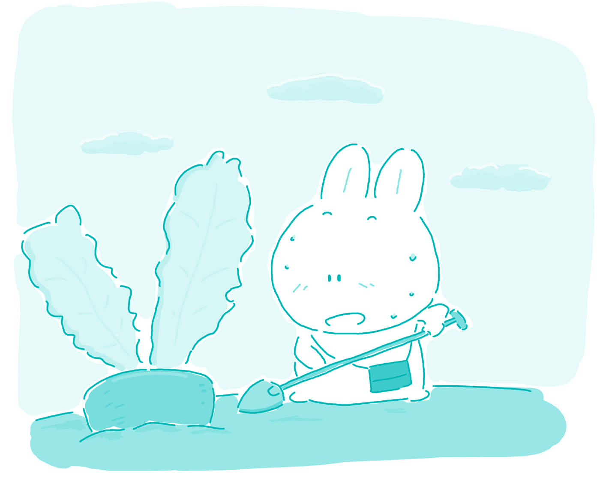

> ###  译文

> **107. 高等教育应该面向全体学生，还是仅面向好学生？**

> 有些人认为只有好学生才有权利接受高等教育。另外有人主张高等教育应该向每个学生敞开大门，不管他或她水平高低。我同意前一种观点。大学教育只应该向好学生敞开大门，因为只有这些学生才重视质量教育的重要性，并有兴趣进一步深造。而且，如果每人都涌入大学，那大学很快就会变得饱和，教育质量也会不断下降。

> 对一个好学生来说，大学教育是非常重要的。这类学生往往很早就已经把目标锁定在上大学，并为进入好大学而不断努力。而那些在高中时学习成绩差的学生显然并不在乎自己的学业，因此，这样的学生不应该上大学。但是，如果这些差学生返回学校，努力学习提高成绩，他们也应该有机会进入高等院校学习。

> 好学生非常乐意继续深造，他们往往接受广泛的教育，并有兴趣学习更多的知识。差学生往往对继续深造没有多少兴趣。如果对此感兴趣的话，他们应该一开始就会多付出一些努力。

> 因此让我们设想一下如果大学不管学生学习成绩的高低，对所有人敞开大门会是什么情景。大学会很快变得人满为患，那些珍惜教育机会的好学生会因此而遭受损失。他们可能无法进入他们想去的教室，既便他们能进入教室，也往往因为人太多而根本没有办法学习。

> 总之，我认为应该把高等教育资源留给那些真正需要它的人——好学生，这点非常重要。如果一个差生希望进入大学，那他或她应该返回中学，努力学习提高成绩。 

###  Word List

 * posit ［ˈpa: zit］ n. 假设，假定；安置，安排
 * former ［ˈfɔ:mə］ adj. 从前的，以前的
 * saturate ［ˈsætʃəreit］ v. 使饱和，浸透，使充满
 * diminish ［diˈminiʃ］ v. （使）减少
 * copious ［ˈkəupiəs］ adj. 很多的，丰富的
 * overfull ［ˌəuvəˈful］ adj. 太满的，过多的

## 108. Learning about life: by listening to the advice of others or through personal experience?

Some people believe that the best way to learn about life is to listen to the advice of friends and family. Others argue that the most beneficial way to learn about life is through personal experience. I want to maintain that learning about life through personal experience is the best way. I believe this because one usually does not learn well unless he/she experiences something on his/her own, because one can have different opinions and views on life than his/her family and friends, and because it is simply a more interesting way to learn.

There have been many times in my life where a family member told me that life was a certain way, but I still wanted to see for myself. After having the experience, I agreed with what my family member had told me. However, I never regretted trying the experience for myself. I think one can learn something more completely if he/she experiences it for himself/herself.

When a family member or a friend tells me to do something, I value his/her opinion. However, there are some occasions when I do not fully agree with their opinions. In these cases, I want to try out the experience. There is a possibility that I will disagree with their conclusions on the topic. For example, if a friend tells me that a movie is terrible, I might still go to see the movie. It is more than possible that we will have differing opinions on whether the movie was good or not.

Finally, I think it is important to learn about life through personal experience because it is a much more interesting way to learn. If one never experienced anything for oneself, life would be very boring. For example, a friend told me that Urumchi was a city that I would not enjoy visiting. He said there were not many attractions there, and there were many other beautiful places in China that I should go instead. In spite of this warning, I went to see Urumchi for myself. I did not think the city was spectacular, but I did have a good time on my trip, and was glad that I went. Having the experience of going to the place was worthwhile enough for me.

> ###  译文

> **108. 了解生活：听取他人的建议还是亲身经历？**

> 有些人认为了解生活最好的方法是听取家人和朋友们的建议，有些人觉得通过个人经历来了解生活是最有效的办法。我赞同后者，因为人只有通过自己的亲身经历才能有更好的认识；因为一个人在一些生活问题上可能跟家人和朋友们有不一样的看法和观点；因为这是一种更有意思的了解生活的方式。

> 有很多次，我的家人告诉我生活是一条怎样的道路，但我依然想亲自看一看。经过了亲身体验，我同意了家里人的看法。然而，我从不后悔亲自经历的那些体验。我认为一个人有了亲身体验后会学得更深刻。

> 当家人或朋友告诉我应该做什么事情时，我会考虑他们的看法。然而，有些时候我不完全同意他们的观点。在这种情况下，我就想去亲自体验一下。很可能我将不同意他们关于某个问题的结论。例如，如果一个朋友告诉我某部电影非常糟糕，我仍旧会亲自去看一看。极有可能的结果是，这部电影究竟是好是坏，我们的观点不尽相同。

###  Word List

 * spectacular ［spekˈtækjulə］ adj. 壮观的
 * terrible ［ˈterəbl］ adj. 很糟的，极坏的
 * Urumchi n. 乌鲁木齐
 * attraction ［əˈtrækʃən］ n. 吸引（力），吸引人的事物

## 109. Follow the customs of the new country you are in, or keep your own customs?

When one is settling in a new country, one has a choice of whether to assimilate into the new culture, or keep the customs of one's home. I think that the wisest decision is to try to integrate some of the new culture into one's own existing customs and beliefs. To understand this reasoning, we must first look at the advantages of both methods.

If one moves to a new country, there are many advantages of following the set customs of the new place. By assimilating into the culture, one can break the cultural barriers much quicker. For example, if one were to move to Canada from China, one could easily live in one of the "Little China" areas, and to all intents and purposes, ignore the Canadian culture. This, however, would be a mistake, as it would close off all of the positive things that Canada has to offer. If one does not assimilate into the new culture, one cannot get a Western job. The person would also be missing out on a multitude of experiences, such as different food.

Nevertheless, there are also many advantages of keeping one's own customs if one moves to a new country. Some people find it very difficult to leave their home and go to a new country. Keeping up old, familiar customs is very comforting. In addition to this, when one keeps their own customs, one finds it easier to meet others of the same nationality, which can also be a relief. When everything around you has changed, keeping your culture intact can be a very soothing way.

By and large, I think it is best to assimilate to the new culture while retaining key elements of one's own culture. For example, one can make an effort to learn the language of the new country, while still speaking one's own language at home. This can actually be an excellent strategy, as speaking two languages is better than speaking one, no matter where you are in the world. When one takes on some of the new culture while keeping some of his/her own, one gets the excitement and opportunity of the new culture, while keeping the familiarity and ease of his/her own culture.

> ###  译文

> **109. 入乡随俗还是保留自己国家的习俗？**

> 当一个人在新的国家定居下来，他面临着一个选择：是吸收新的文化，还是保留自己国家的习俗。我认为，最明智的抉择是尽量将新的文化因素与自己原有的习俗和信仰整合在一起。为了更好的理解这一点，我们必须首先看看这两种方法各自的优点。

> 如果一个人移民到一个新的国家，遵从这个国家的习俗会有许多优势。他或她可以通过吸收新的文化而尽快打破文化屏障。比如，一个人要从中国移民到加拿大，他或她可以很容易地生活在一个中国人自己的小圈子里，完全忽视加拿大文化的存在。但这样是个错误，因为这样的话就与加拿大提供的一些先进事物产生了隔离。如果一个人没有吸收新的文化，那他将不会找到西方国家的工作，这个人也就会错过很多经历，包括错过尝试不同的食物。

> 然而，对于一个移民到新的国家的人来说，保留自己的风俗习惯也会有很多优势。许多人觉得离开家乡，移民到新的国家非常困难，而保持原来熟悉的风俗会令人感到安慰。除此之外，当一个人保留着他或她原有的风俗，就会发现更容易与本国的老乡相处，这也算是一种慰藉。当你周围的一切事情都发生改变时，保留你原有的文化，这也是一件令人宽心的事情。

> 基本看来，我认为最好的方法是吸收新文化的同时，也不忘保留自己文化中的关键因素。比如，人们可以在新的国家学习新的语言，但在家里就用本国的语言。这实际上是一种不错的方法，因为不管在世界的哪个国家，掌握两种语言总比一种要好得多。如果一个人保留了一部分自己的文化习俗，同时又吸收了一些新东西，那他或她就既能获得新文化所带来的兴奋和机遇，又能保持自己文化所固有的熟悉和安逸。 

###  Word List

 * assimilate ［əˈsiməˌleit］ v. 吸收；彻底了解
 * barrier ［ˈbæriə］ n. 障碍物，屏障
 * close off 隔离，封锁
 * multitude ［ˈmʌltiˌtu:d］ n. 大量，众多
 * intact ［inˈtækt］ adj. 完整无缺的
 * soothe ［su:ð］ v. 使平静，安慰，使缓和
 * retain ［riˈtein］ v. 保持，保留
 * by and large 大体上，基本上

## 110. Spend time alone or with friends?

Some people enjoy spending most of their time with friends, while others prefer to be alone for the majority of the time. I prefer to spend most of my time with friends, because friends offer excitement and new ideas, they can console me when something bad happens, and spending too much time by myself can be boring.

Friends can offer excitement and fresh ideas to a situation. No matter what I am doing, if a friend is there, it is more interesting. For example, if I am shopping, a friend makes the experience more fun. We can look at things together, and explore our likes and dislikes. Having a friend around also allows me to do some things that I would not be able to do otherwise. For instance, I can go with a friend to a park and play badminton. Some things are just impossible to do by myself.

Friends can also console you if something bad happens. If I get bad news, and a friend is around, I do not have to feel badly by myself. A friend will try and cheer me up, and attempt to take my mind off whatever negative things happened. For example, last year I broke my leg and was in a cast all summer. I had friends around me to cheer me up and distract me from the misfortune.

In addition to these reasons, I find that if I spend too much time by myself, I get lonesome and bored. As mentioned above, there are some things you just cannot do without friends around. Some of these things, such as sports, are my favorite activities. I do enjoy some activities that do not involve other people, such as reading. However, I find that I can do these things before bed, or when I wake up. Overall, I think having friends around me is the best way for me to spend my time.

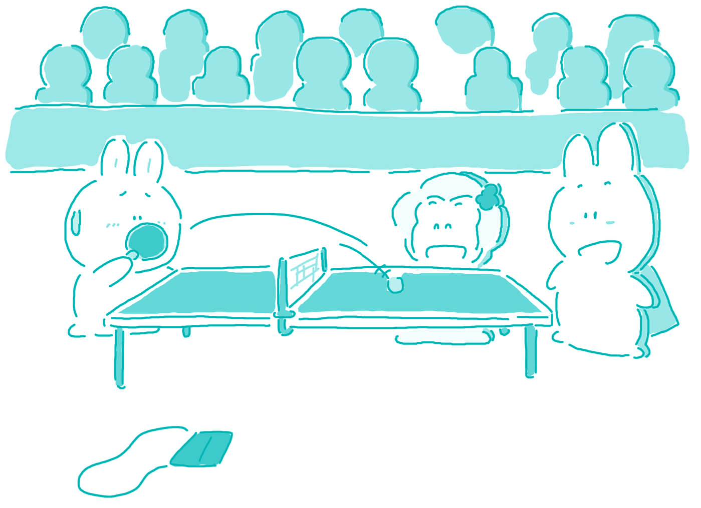

> ###  译文

> **110. 独处还是与朋友相伴？**

> 有些人喜欢与朋友们在一起，而有些人大多数时间都喜欢独处。对我而言，我更喜欢与朋友们在一起度过我的大部分时间。因为朋友们那里有令人兴奋的事情，有新主意，当我碰到糟糕的事情时，他们可以安慰我，而且，让我自己一个人独处很长时间是件令人讨厌的事情。

> 朋友们那里总会有兴奋点和新鲜的主意。如果有朋友在，不论在做什么，我总会觉得很有意思。比如，在购物时，有一个朋友在，我会觉得购物过程更有意思。我们可以一起欣赏商品，探讨我们的好恶。有朋友在周围还能使我能够做那些一个人不能做的事情。比如，我可以和朋友一起去公园里打羽毛球。有些事情是一个人不可能做到的。

> 在你遇到糟糕的事情时，朋友们总会安慰你。如果有不幸的消息，而朋友们在身边的话，我自己就不会感到太悲伤。朋友会尽力鼓励我，让我尽快摆脱这些糟糕的事情。例如，我的腿去年骨折了，整个夏天都打着石膏。朋友们在周围鼓励我，让我从不幸的事件中摆脱出来。

> 除了上述原因之外，我还发现如果我自己一个人呆了很长时间，我会感到寂寞和无聊。正如前面提及的，有许多事情你自己一个人是不可能完成的。这些事情，比如运动，都是我特别喜欢的。我确实也喜欢一些没有其他人参与的活动，像阅读等。但是，我发现这些事情可以晚上睡觉前或是刚刚醒来时做。总之，对我来说，跟朋友们在一起是消磨时间的最好方式。

###  Word List

 * console ［ka:nˈsəul］ v. 安慰，慰藉
 * fresh ［freʃ］ adj. 新鲜的，无经验的
 * badminton ［ˈbædˌmintən］ n. 羽毛球
 * cast ［kæst］ n. 投，抛，投射
 * cheer up 使振奋，感到振奋
 * misfortune ［misˈfɔ:tʃən］ n. 不幸，灾祸
 * lonesome ［ˈləunsəm］ adj. 感到寂寞的

## 111. Spend time with one or two close friends, or with a large number of friends?

Of the two possibilities, I prefer the first, that is, to spend my time with one or two close friends, because I enjoy close friendship with one or two people and the cozy atmosphere of spending time with close friends.

When spending time with a large number of friends, it tends to be difficult to form solid, meaningful friendships with any of the people, since cultivating friendship needs time to communicate. On the other hand, when spending time with only one or two close friends, it is more likely to get to know these people on a very close level. I think this closeness is very important in a friendship. In fact, if I share no closeness with a person, then I do not consider him a friend; I consider him an acquaintance.

Moreover, it is not only closeness but also the cozy atmosphere that makes me prefer spending time with only one or two friends. In this cozy atmosphere, I always feel there is nothing that I could not or would not tell my friends, as they feel the same. This means we can trust each other completely. Although this doesn't at all mean there's no cozy atmosphere or complete trust when spending time with many friends, it is my observation that everyone tends to be more open in private. This is why I enjoy the intimate friendship.

In addition, spending time with few friends can save much time, since the relationship among a few people is more likely to be simpler. I'm not proficient at dealing with relationship among people, and often get frustrated communicating with a crowd. However, when I am spending time with one or two close friends, this doesn't matter at all. In fact, my close friends, notwithstanding few in number, always tell me I'm their best friend who can truly care about them and handle the relationship smoothly. I think it is my personality that has made me such a choice.

> ###  译文

> **111. 与一两个亲密朋友在一起，还是与许多朋友在一起？**

> 以上两者，我偏爱前者，也就是说，我更爱和一两个亲密朋友在一起。因为我更看重与一两个人建立的亲密友谊，更沉醉于和一两知己在一起时的那份温馨。

> 当和一大帮朋友在一起时，很难同其中的任何一位建立牢固而深挚的友谊，因为情谊的培养需要时间的投入。另一方面，当仅和一两亲密友人在一起，更易深入了解他们。这对友谊至关重要。事实上，那些和我不够亲密的人，我不把他们当作朋友，而是视为熟人。

> 另外，不仅是那份亲密使我更喜与一两朋友在一起，更是因为那种温馨。在温馨的氛围里，我和朋友互吐衷心，无所不言。我们彼此全然信任。虽然这并不意味着和一大帮朋友在一起时失之亲密、疏于温馨，但据我观察，在私下里人更易吐露心声。这就是为何我更看重深切的友谊。

> 再者，因为两三个人之间的人际关系更简单，所以与一两知己在一起更省时间。我并不擅长处理人际关系，常惴栗于大庭广众。而与一两知己在一起时就不会这样。事实上，我的知己虽少，但他们总是告诉我我是他们最好的朋友、我真心关心他们、我和他们关系融洽。我想大抵是我的性格使我做出这一选择吧。 

###  Word List

 * solid ［ˈsa:lid］ adj. 牢固的，坚固的
 * meaningful ［ˈmi:niŋfəl］ adj. 有意义的
 * closeness ［ˈkləusnis］ n. 亲密
 * acquaintance ［əˈkweintəns］ n. 相识的人，熟人
 * honor ［ˈa:nə］ v. 尊重
 * appreciate ［əˈpri:ʃi:ˌeit］ v. 珍视
 * catch up 赶做
 * errand ［ˈerənd］ n. 差事

## 112. Should young children spend most of their time on school studies or playing?

Some people believe that it is important for children to begin their education at a very early age, and spend most of their time on academic studies. Others believe that children should spend their time playing instead of studying. To understand the logic behind these two views, we must compare their advantages and disadvantages.

If a child spends all of his/her time studying, he/she will advance quickly in school. He/she will learn things early in life that other children, who spent their time playing, will not learn until they are at least a few years older. This child will learn the value of education early on, and will be able to impress his/her parents with his/her knowledge, therefore gaining self-confidence and motivation.

If a child spends most of his time playing, he/she will not learn about mathematics and science, but he/she will learn another important skill: socialization. When children spend their time playing together, they learn how to interact with others. They learn how to share things, and how to settle a disagreement amicably. Children can also increase their motor skills if they spend their time playing games that involve hand-eye coordination.

Both of these perspectives have valid points. However, I think it is best to try and combine playing with learning. If children can learn about the basics of academics in a fun and playful environment, they are likely to become more interested in it. A very young child has no interest in studying, and I believe that adults must allow children to have fun. Otherwise, the children will grow up to be uncaring, antisocial adults. This does not mean, however, that education is not important. I feel that there is a right time to introduce studying and academia to children, and this time is not when they are very young. It is better to wait until the children are at least five or six year old before trying to get them to study.

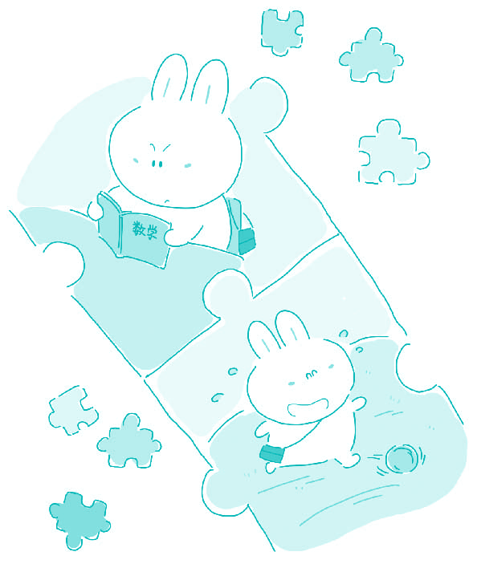

> ###  译文

> **112. 儿童应将大部分时间用于学习还是玩耍？**

> 有些人认为，让儿童在很早的年纪就开始受教育，并且把他们大部分的时间用在学业上，这是很重要的。其他人则认为，儿童应该把他们的时间用于玩耍，而不是用来学习。要明白这两种观点背后的逻辑，我们必须比较它们的优势和劣势。

> 如果一个儿童把他或她所有的时间都用在学习上，他或她在学业上将会迅速进步。他或她将在生命的早期学会一些事情，而这些事情是其他把时间用于玩耍的儿童年长好几岁之后才会学到的。这名儿童将很早就知道教育的价值，将能够凭借他或她的知识给父母留下深刻印象，从而获得自信和动力。

> 如果一个儿童把大部分的时间用于玩耍，他或她将学不到数学和自然科学，但是他或她将会掌握另一种重要的技能：交际。当孩子们把他们的时间用于一起玩耍的时候，他们学习如何与他人互相交往。他们学习如何分享事物，以及如何友好地解决分歧。如果孩子们把时间用来做一些涉及手眼协调的游戏，还可以增进他们的动手能力。

> 这两种观点都有合理的成分。然而，我认为最好尝试把玩与学结合起来。如果一个儿童能够在有趣活泼的环境中学习学术的基础知识，他们可能会对此变得更加有兴趣。年纪很小的孩子对学习是没有兴趣的，所以我觉得大人应该让孩子们开心地玩耍。否则，孩子们将会成长为冷漠孤僻的成年人。但是这并不意味着受教育不重要。我觉得让孩子开始学习和接触学术有一个恰当的时间，而这个时间并不在他们年纪很小的时候。最好是等孩子到了至少五六岁的时候，再试着让他们开始学习。 

###  Word List

 * academic ［ˌækəˈdemik］adj. 学术的，教学的
 * coordination ［kəuˌɔ:dnˈeiʃən］ n. 协调
 * perspective ［pəˈspektiv］ n. 观点，看法
 * logic ［ˈla:dʒik］ n. 逻辑
 * valid ［ˈvælid］ adj. 合理的
 * self-confidence ［ˈselfˈka:nfidəns］ n. 自信
 * playful ［ˈpleifəl］ adj. 活泼的，有趣的
 * motivation ［ˌməutiˈveiʃən］ n. 动力
 * uncaring ［ʌnˈkεəriŋ］ adj. 冷漠的，漠不关心的
 * socialization ［ˌsəuʃəliˈzeiʃən］ n. 交际
 * interact ［ˌintərˈækt］ v. 互相交往
 * antisocial ［ˌæntiˈsəuʃəl］ adj. 孤僻的，不擅社交的
 * amicably ［ˈæmikəbli］ adv. 友好地

## 113. Compare the advantages and disadvantages of establishing a new university in your community

The building of a new university is exciting in any city. Picking the right community is very important, and there are a number of things to consider when making such a decision. I currently live in the Dongzhimen area of Beijing, so I will be discussing the advantages and disadvantages of building a university in this community.

There many advantages of building a university in the Dongzhimen(DZM) area. First, DZM is located in the center of the Beijing metropolis. Students will have no trouble finding anything they need to further their studies, for example, food, stationary supplies, and other basic daily necessities. This is very important, because any time one spends hunting for needed items or traveling to get them is time spent away from study. Second, there are also a number of excellent restaurants in the area, offering good, hearty meals for a nominal price. As many students do not have the time to make their own meals, this is an excellent reason to build a university in this area.

There are also negative points of building a university in the DZM area. First, it is important to note that the infamous Sanlitun "Bar Street" is within walking distance from DZM. While one would like to believe that students would be able to resist the urge of going to the bars every night, it could be a draw for some. This would, of course, lower grade point averages and be a major hindrance. Second, the housing situation in this area is more expensive than many other communities in the city. As many students are living on limited budgets, it might be difficult to find adequate housing. Finally, the last drawback of building a university in the DZM area is the traffic. As the community is right downtown, there is a constant flow of cars and trucks. With all of the street noise, the students could be distracted from their studies.

Overall, I think that DZM would not be a good choice for a university. There are too many distractions close by. While it is an excellent area to live in, there are too many negatives of having the university in this area.

> ###  译文

> **113. 比较在你的社区内建一所新大学的利与弊**

> 修建一所新大学在任何城市都是令人兴奋的。选择恰当的社区非常重要，而当做出这样一个决定的时候有很多事情要考虑。我目前住在北京的东直门地区，因此我将讨论一下在这一社区修建大学的优势和劣势。

> 在东直门地区修建大学有许多优势。首先，东直门位于北京首都的中心地段。学生们轻而易举就能找到他们学习所需的任何东西，比如，食物、固定生活用品和其他基本日常必需品。这一点很重要，因为一个人搜寻必需用品或者为此而长途跋涉所花费的任何时间，都是占用的学习时间。其次，在这一区域还有许多很好的餐馆，可以以低廉的价格提供美味丰盛的饭菜。由于许多学生没有时间自己做饭，这就是在本地区修建大学的极佳理由。

> 在东直门地区修建大学也有不利的方面。首先，有必要提到声名狼藉的三里屯“酒吧一条街”离东直门只有步行之距。尽管人们愿意相信学生们将会有能力抵抗每晚去酒吧的冲动，但这对某些人来说可能会很有吸引力。当然，这会降低平均学习成绩，因而成为一个主要的障碍。其次，这一地区的住房比城市中其他社区要更加昂贵。由于学生们生活的经济状况有限，因此找到合适的住处也许会很困难。最后，在东直门地区修建大学的最后一个障碍就是交通。因为地处城市中心地段，这里总是有源源不断的汽车和卡车。在这些街道躁声中学习，学生们很容易注意力不集中。

> 总的来说，我认为东直门不是修建大学的理想选择。附近有太多的干扰。虽然这是很好的居住区，但是在这片区域修建大学有太多的不利因素。 

###  Word List

 * currently ［ˈkʌrəntli］ adv. 目前，现在
 * metropolis ［miˈtra:pəlis］ n. 首都，大都会
 * stationary ［ˈsteiʃəˌneri］ adj. 固定的
 * hearty ［ˈha:ti］ adj. （饭菜）
 * 丰盛的
 * nominal ［ˈna:mənəl］ adj. 金额极小的
 * infamous ［ˈinfəməs］ adj. 声名狼藉的
 * grade point average 成绩平均分
 * hindrance ［ˈhindrəns］ n. 障碍
 * drawback ［ˈdrɔ:ˌbæk］ n. 障碍，缺点
 * distract ［diˈstrækt］ v. 分散…的注意力

## 114. Which is the most important influence on young adults, family or friends?

While some people believe that family have the biggest influence on a young adult's life, I maintain that it is friends, and not the family, that hold this influence to a larger extent. First of all, young adults usually spend more time with their friends. When a person graduates from being a teenager and becomes a young adult, many things change in his/her life. This person will likely leave his/her family home and go to university. University life is very different than home life. One will no longer be spending a lot of time with family, and instead, will usually fill his free time visiting with friends. These friends are therefore, in a much better position to influence the young adult.

Moreover, friends will usually have a better perspective on one's life than family. Because the young adult is spending so much time with friends, it is likely that the two friends will have similar perspectives on life, as they are going through the same situations together. Because of this, a friend can have a better understanding of one's life than a family member. A young adult will probably hold his/her friend's influence as more important than his family's, because the two friends think alike. Finally, friends usually have a better sense of how the world works based on today's standards. Therefore, young adults is more likely to allow themselves to be influenced by their friends than their family because they see their friends as having a more modern view of how the world works. Many young people in today's society see their parents as too traditional and stuck in their ways. A person's friends, on the other hand, are much savvier to contemporary issues.

Because of this, young adults will likely think their friend's advice or influence has more value than their parent's.

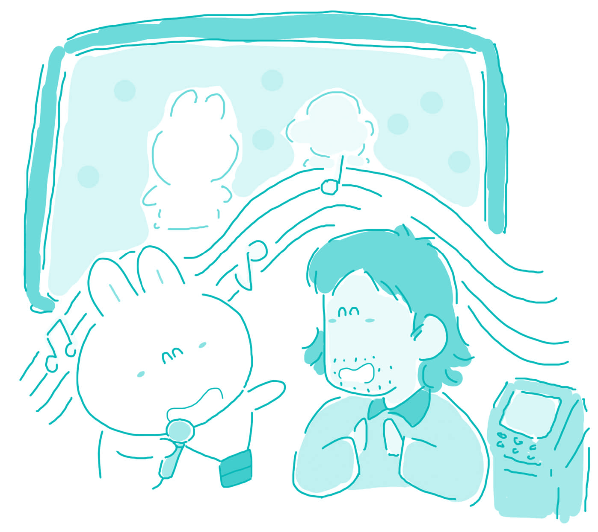

> ###  译文

> **114. 家庭和朋友，谁对年轻人的影响最大？**

> 虽然有些人觉得家庭对一个年轻人的生活影响最重大，但我坚持认为在更大程度上产生这种影响的是朋友而非家庭。

> 首先，年轻人通常和朋友们待在一起的时间更多。当一个人不再是十几岁的孩子而是初为成年人的时候，在他或她的生活中许多事情都发生了改变。这个人将可能离开养育他或她的家庭去上大学。大学生活与家庭生活是大相径庭的。一个人将不再把大部分的时间用来和家人待在一起，取而代之的是，他或她通常会把闲暇的时间用于和朋友们聊天。因此，这些朋友更有能力对这位年轻人产生影响。

> 再者，朋友们对于一个人生活的洞察通常会比家庭更好。因为这个年轻人和朋友在一起的时间很多，他们在一起经历了同样的境况，所以很可能两者会有相似的人生观。正因为如此，对于一个人的生活，一位朋友可以比家庭成员有着更好的了解。年轻人很可能会把朋友的影响看得比家人更重要，因为两个朋友之间有着近似的思维。

> 最后，朋友们通常可以更好地理解基于现在标准的世界是如何运转的。因此，相比家庭而言，年轻人更可能让自己受到朋友们的影响，因为他们认为朋友们对于世界如何运转有着更现代的看法。当今社会的许多年轻人都认为他们的父母很传统，而且总是固守自己的行事作风。而另一方面，一个人的朋友则对当前事务更有见识。正因如此，一个年轻人可能会认为朋友的建议或影响比自己家人的更有价值。 

###  Word List

 * influence ［ˈinflu:əns］ n. 影响
 * maintain ［menˈtein］ v. 坚持认为
 * to a large extent 在很大程度上
 * visit with 与…聊天
 * perspective ［pəˈspektiv］ n. 见解，洞察
 * go through 经历
 * have a sense of 理解，懂得
 * savvy ［ˈsævi］ adj. 有见识的

## 115. Planning or not planning for your leisure time?

Some people find it to be a better use of their free time if they plan out all of their activities very carefully. Others enjoy their free time more if they do not make any plans at all. I agree with those in the latter group, and would prefer to not be restricted to a schedule.

Above most things, I enjoy living my life spontaneously. If I decide that I want to go away for the weekend, assuming I have money and can take time off work, I will go. I am able to live my life in this manner because I never bind myself to carefully planned schedules. I make the most out of every situation I come across and always enjoy myself. Because of this, there is no need for a schedule. It is much more fun to just wait and see what will happen next, after all, it's a free time.

I always enjoy the freedom of an unplanned afternoon. If I need to get errands done, I will find time for them. If I have free time, I want to enjoy it. I do not want to be trying to finish things quickly just because there is somewhere else that might be interesting on my list of things to do. If I am at a park and am really enjoying myself, there is no reason why I should leave, even if there is something else to do on my list that sounds interesting. I believe in living in the moment. What I am doing at the present moment is more important than anything I might do in the future.

If, on a rare occasion, I do make a schedule, I find that it quickly runs off track. Perhaps I am just particularly bad at keeping to a schedule, but I find that some things take longer to do than I expected they would, and other things are finished in much shorter a time than expected. This quickly makes even the best schedule go awry.

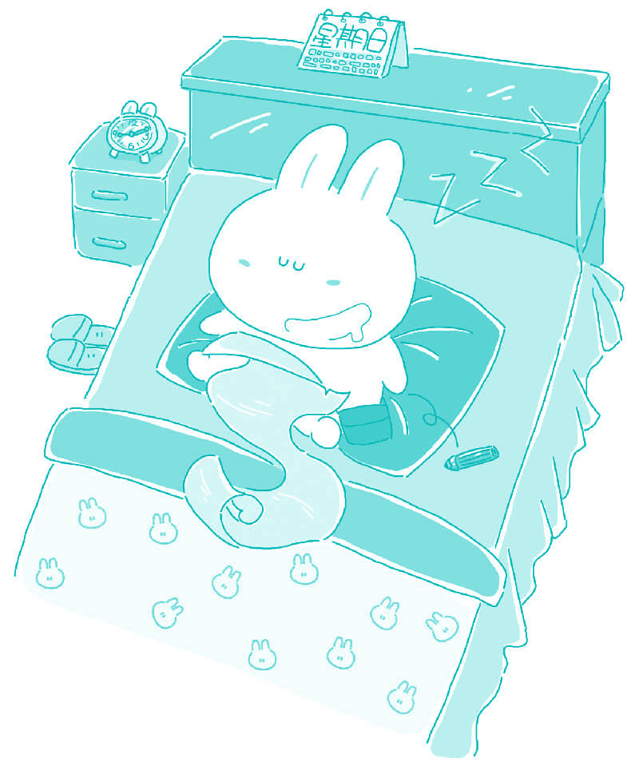

> ###  译文

> **115. 对闲暇时间计划与否**

> 有些人发现，如果他们非常精心地把所有活动都计划好，他们的空闲时间会利用得更好。其他人则是在完全不做任何计划的情况下可以更好地享受自己的闲暇时间。我赞同后面一种人，而且也更愿意不被一个日程表所局限。

> 最重要的是，我喜欢顺其自然地生活。如果我决定要出去度周末，假如我有钱并且不用工作，我就会去。我能够用这种方式生活，是因为我从来不用一个精心计划好的日程来约束自己。我尽可能地享受自己碰到的每一种境遇，并且过得很愉快。正因如此，没有必要做一个日程计划。只是等着看接下来会发生什么事情是非常有趣的，毕竟，这是一段空闲的时间。

> 我总是喜欢享受一个下午毫无计划，自由自在。如果我需要把差事做完，我会找到时间把它们完成。如果我有空闲，我想享受这段时间。我不想拼命把事情赶完，只因为在我所列举的要做的事情当中也许还有其他什么有趣的事情。如果我在一个公园，过得非常愉快，我设有任何理由离开，即使在我的节目单上有其他什么事情听起来很有意思。我相信活在此刻。我此刻在做的事情比我将来可能要做的任何事情都更重要。

> 如果偶尔我的确做了一个日程安排，我发现它很快就被打乱了。也许我特别不善于遵循计划，但是我觉得有些事情需要的时间比我预期的要长，而其他一些事情需要的时间则比预期的要短很多。这使得最好的日程安排也很快就出了乱子。

###  Word List

 * plan out 订计划，部署
 * spontaneously ［spa:nˈteinjəsli］ adv. 自然地
 * assume ［əˈsu:m］ v. 假如，假定
 * bind...to 把…约束在
 * schedule ［ˈskedʒjul］ n. 计划表，日程表
 * come across 碰到，遇到
 * rare ［rεə］ adj. 罕见的，很少的
 * keep to 局限于
 * awry ［əˈrai］ adj. 错误的

## 116. What method of learning is best for you?

There are many different methods that people use for learning. Some people learn with hands-on experience, others learn by reading, and still others learn by listening to discussion of other people. It is generally believed that learning is a subjective process, and it is important to discover the ways in which one learns best. I find that personally, learning by doing things is the best way. First, I find that the hands-on method is right for me because I am a very visual learner. If I can see what is happening, I have a much easier time understanding it. Reading a book does not give me this ease. When I read a book in order to gain knowledge, particularly technical one, I sometimes have trouble visualizing exactly what is being explained. However, when I actually see the process happening, it is much easier for me to understand.

I also use a visual method when I am studying English. For example, if I am working on new vocabulary, I will write the words down, and then draw pictures of the words to remind myself of the meaning. Going through the process of drawing the pictures greatly increases my ability to memorize any type of information. When a picture is too simple to be enough or is hard to draw, I will close my eye and draw a mental picture that serves more helpful.

It seems as though most businesses prefer people to have this hands-on experience as well. It is rare to find a good job that does not require applicants to have spent a certain amount of time doing a similar type of work in the past. By having this past experience, it shows that they have learnt to do a particular task well, and that they have practical knowledge of the job.

In conclusion, I think that hands-on learning is best for me, and beneficial for my future. As stated above, however, everyone learns in a different style, and it is important to find the most efficient method for themselves.

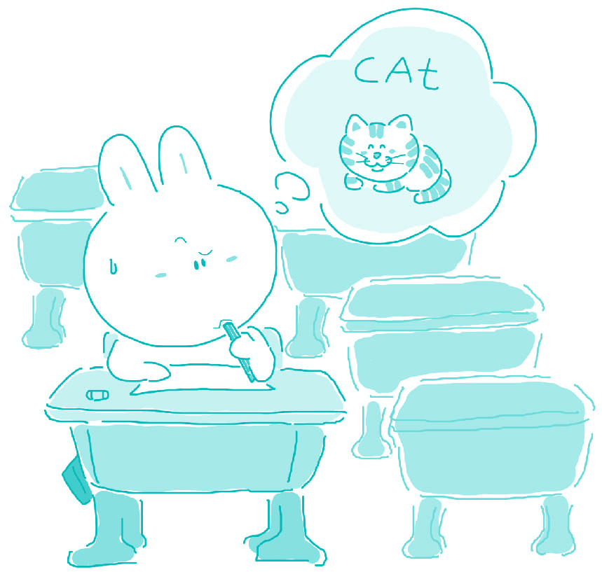

> ###  译文

> **116. 何种学习方式最适合你？**

> 人们学习有许多不同的方式。有些人通过亲身经历来学习，有些人通过阅读来学习，还有人通过倾听别人的讨论来学习。大多数人普遍认为，学习是一个主观的过程，因此重要的是发掘最有助于一个人学习的方式。我个人认为，通过做事情来学习是最好的方法。

> 首先，我发现亲身实践的方式适合我，因为我是一个非常形象化的学习者。如果我能看到事情发生的经过，要理解它会容易得多。阅读书籍就给不了我这种轻松的感觉。当我读书学习，尤其是读专业性书籍的时候，我有时会觉得很难确切地想像出所讲解的是什么。然而，当我真正看到发生的过程，理解对我来说就容易许多。

> 我学习英语的时候也使用形象化的方式。例如，如果我在学习新单词，我会把单词写下来，然后描绘出关于单词的图画来让自己记住单词的意思。经过画图这一过程极大地增强了我记忆任何种类信息的能力。当图画太简单不足以表达含义，或者是太难描绘的时候，我就会闭上眼睛，在脑子里想像一幅图，这样可以更好地帮助自己。

> 似乎大多数公司希望人们拥有这种实践的经历。不需要应聘者有相似工作经验的好工作已经很难找了。拥有这种过去的经历，可以表明他们已经学会很好地完成某种工作，而且他们对该工作有实际操作的知识。

> 总之，我认为通过亲身实践的学习最适合我，并且对我的将来会非常有益。然而，如上所述，每个人学习都有不同的风格，重要的是为自己找到最有效的方式。

###  Word List

 * hands-on ［ˈhændzˈa:n］ adj. 亲身实践的
 * subjective ［səbˈdʒektiv］ adj. 主观的
 * applicant ［ˈæplikənt］ n. 应聘者，申请者
 * beneficial ［ˌbenəˈfiʃəl］ adj. 有益的，受益的

## 117. Choose friends who are different from you or similar to you?

In general, my friends are quite similar to me. There are a number of reasons as to why this is the case. When two people are similar to each other, they have a wide basis of topics available to them for conversation, and are also able to bond over many types of experiences. For example, one of my major interests is music. I frequently enjoy going to see musical acts perform. If a potential friend is not interested in the same type of music as me, we will not be able to share these experiences together. Without being able to have these bonding experiences, it is difficult for an acquaintanceship to evolve into a friendship.

Another reason why we usually choose friends who are quite similar to us is because having similar friends who have common interests can help us come up with new ideas regarding things we are interested in. If I am particularly interested in a project, but cannot seem to advance the thought to my satisfaction, it is quite likely that one of my friends will be able to offer insight on the subject that I hadn't previously thought of.

Nonetheless, it is important to consider exactly how similar one must be to me for me to form a friendship with them. I have many friends who, on the surface, are quite different from me. However, we share one or two common interests that allow us to communicate on a clear, meaningful level. To explain, I will give an example of a particular friend who fits into this category. I met this friend at the opening of a new Italian restaurant in town. We have very different interests, and very different occupations. However, we are both connoisseurs of fine cuisine. Based on this one small connection, we formed a very good friendship.

In conclusion, I find that it is possible to have friends who appear similar to or different from myself. The key to a strong, lasting friendship is finding one or two areas that both parties find interesting.

> ###  译文

> **117. 选择与自己不同还是与自己相似的朋友？**

> 通常，我的朋友都和我非常相似。为什么会这样存在很多原因。当两个人相似的时候，他们有广泛的话题可谈，同时还能凭借许多种经历联系在一起。比如，我的主要爱好之一就是音乐。我喜欢经常去欣赏音乐剧表演。如果一个有可能成为朋友的人对同类音乐不感兴趣的话，我们将不能一起分享这些经历。要是不能拥有这些起维系作用的经历，就很难从相识逐步发展成为友谊。

> 我们通常选择与自己类似的人作为朋友的另外一个原因就是，与自己有共同兴趣的朋友能够帮助我们发展出关于我们感兴趣事物的新观点。如果我对一个计划特别有兴趣，但却似乎无法提出令自己满意的想法，我的其中一位朋友将非常有可能就此主题提供我自己从未想到过的见解。

> 尽管如此，考虑好一个人必须和我有多么近似才能让我与其建立友谊是很重要的。我有许多朋友，他们外表上看起来和我非常不同。然而我们分享一两个共同的爱好，这样可以让我们在清晰而有意义的层面上进行沟通。为了解释这一点，我会以某位符合这种类型的的朋友作为例子。我是在城里一家新意大利餐厅的开张典礼上遇见这位朋友的。我们的兴趣差别很大，职业也非常不同。但是，我们都是美食鉴赏家。基于这小小的共同点，我们成了非常好的朋友。

> 总而言之，我发觉，拥有看似与自己相近或是不同的朋友都是有可能的。维持坚固而持久的友谊，关键在于寻找到一两处双方都觉得感兴趣的领域。

###  Word List

 * bond ［ba:nd］ v. 维系，联结
 * acquaintanceship ［əˈkweintənsʃip］ n. 相识
 * evolve ［iˈva:lv］ v. 逐步发展
 * come up with 想出
 * advance ［ædˈvæns］ v. 提出
 * insight ［ˈinˌsait］ n. 见解，见识
 * on the surface 外表上
 * fit into 符合
 * connoisseur ［ˌka:nəˈsə:］ n. 鉴赏家
 * cuisine ［kwiˈzi:n］ n. 烹饪

## 118. Which approach to life do you prefer, life with change or without?

Some people enjoy change, and look forward to new experiences while others enjoy a steady paced, habitual existence. Both of these life styles have their own merits, but one thing is for certain: change is unavoidable, and we had best be prepared for all situations that come our way.

For my day-to-day activities, I enjoy a comparatively stable lifestyle. I get up in the morning, shower, eat breakfast and get ready for work. I have a stable, somewhat long-term job, which I enjoy. After work, I come home, eat dinner, and relax before going to bed. I take pleasure in all of these activities, and appreciate the stability.

However, sometimes change happens, and I look forward to that as well. For example, a few months ago, I held a position in a company that did not treat its employees very well. The job was monotonous, and I did not enjoy it very much. The work was not difficult, but I felt that something was lacking. Out of the blue, I received a job offer that was much more in tune with my current interests from another company. I jumped at the opportunity to try something new. The idea of change was very exciting, and I welcomed it.

Change can also be negative, however. Sometimes, terrible things happen unexpectedly and leave you feeling lost. For example, one could lose his/her job, or much worse, a family member or a friend could die. This type of change, of course, is unwelcome. We all must do our best to deal with these adjustments, and make the best of any situation that comes our way.

In conclusion, for the most part, I enjoy a stable, routine life. At the same time, however, I am always ready to change if it is advantageous to my position in life. I believe it is important to always be ready for change, because it is unavoidable.

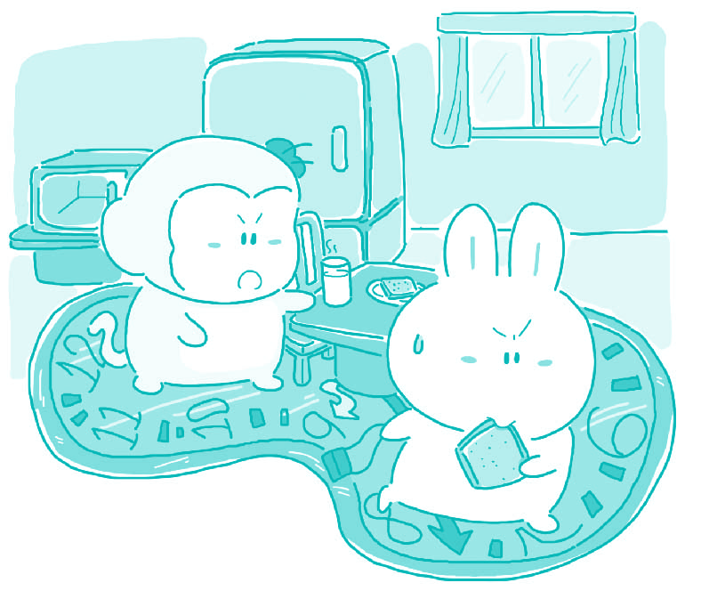

> ###  译文

> **118. 你喜欢何种生活方式，经常变动的还是一成不变的？**

> 有些人喜欢改变，而且盼望着新的经历，而其他一些人则喜欢速度平稳、习惯性的生活方式。这两种生活方式都有它们各自的优点，但有一点可以肯定：变化是不可避免的，所以我们最好为自己遇到的所有境况都做好准备。

> 对于我的日常活动，我喜欢一个比较稳定的生活方式。我早晨起床，淋浴，吃早餐，接着准备上班。我有一个稳定、比较长久的工作，我很喜欢。下班之后，我回到家，吃晚餐，并且在上床之前放松一下。所有这些活动让我感到愉快，而且我也喜欢这种稳定。

> 然而，有时候会发生变化，而且我也对此颇为期待。比如，几个月前，我在一家不太善待雇员的公司里有一个职位。那份工作很单调，我不是非常喜欢。工作并不困难，但我感觉缺少点什么。突然，我得到了另外一家公司提供的一份工作，而且这更加符合我当前的兴趣。我抓住了尝试新事物的机会。改变的想法非常令人兴奋，而且对此我非常乐于接受。

> 但是，改变也可能是负面的。有时候，可怕的事情会不期而至，使你感到迷失。例如，一个人可能会丢掉工作，或是更糟糕的，失去一位家人或朋友。这种改变当然是不受欢迎的。我们都必须竭尽所能地去应对这些改变，尽力对我们所处的任何状况泰然处之。

> 总之，在多数情况下，我喜欢一种稳定有序的生活。然而同时，如果改变对我的生活有利，我随时准备着做出改变。我相信随时准备改变是重要的，因为它不可避免。 

###  Word List

 * steady ［ˈstedi］ adj. 平稳的，稳定的
 * comparatively ［kəmˈpærətivli］adv. 比较地
 * habitual ［həˈbitʃuəl］ adj. 习惯性的
 * existence ［igˈzistəns］ n. 生活方式
 * stable ［ˈsteibəl］ adj. 稳定的
 * merit ［ˈmerit］ n. 优点
 * monotonous ［məˈna:tnəs］ adj. 单调的
 * for certain 肯定的
 * out of the blue 意外地，突如其来地
 * unavoidable ［ˌʌnəˈvɔidəbəl］adj. 不可避免的
 * adjustment ［əˈdʒʌstmənt］n. 调整
 * for the most part 在多数情况下
 * day-to-day ［ˈdeitəˈdei］adj. 日常的，例行的
 * routine ［ru:ˈti:n］ adj. 惯常的

## 119. Does different clothes influence the way people behave?

It seems that people do sometimes behave differently when they wear different clothes. For example, a well-dressed man seldom spits at random, a woman in glorious dresses is more likely to talk in a gentle tone, and a clean dressed child seems quiet than others. It might be explained that different dresses give people different self-images, and most people subconsciously behave according to their own self-images. Equally sensible is another factor, that is, all too often people regard a person differently according to his/her dresses. Therefore, people might behave differently when they wear different clothes because they are treated differently.

Also, appropriate dresses do help a lot in certain circumstances. It is not difficult to imagine that a doctor with a casual suit instead of his/her formal one will certainly make his/her patients nervous, for doctors in working hours are always supposed to be in white suits. An applicant in his/her first interview will be naturally accompanied with great mental tension. If he/she was well-dressed, by "well" we do not mean expensively or gloriously, we mean "neatly", he/ she would appear more self-confident and or even be self-confident in deed.

However, merely a suit in itself can contribute little. In fact, people's behaviors inevitably reflect their nature. A poor gentleman dressed in rags is still a gentleman. He knows the essential principles that a civilized individual must observe, he knows fundamental moral disciplines which an educated individual must follow. A parvenu on the other hand, will finally find out the fact that his exorbitantly dear dresses is of no use to make himself a gentleman, and he even eventually fail to make him look like a gentleman. Maybe those are right who said it takes at least three generations to cultivate a gentleman.

In a word, I do not believe that clothes can essentially make people different, even though they might sometimes seemingly do.

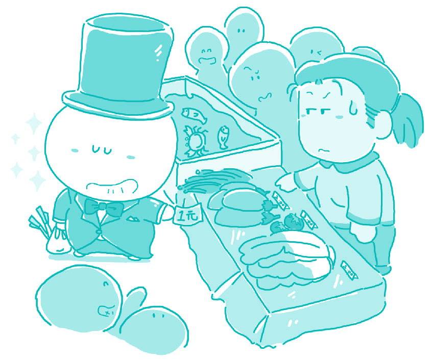

> ###  译文

> **119. 不同的着装对人们的行为有影响吗？**

> 看起来人们有时候确实因为着装不同而有不同的举止。例如，一个穿着体面的男士很少会随意吐痰，一位衣着华丽的女士更有可能以温和的语气说话，而一名穿得干净的儿童好象也比其他孩子安静。也许可以这样解释：不同的着装给予人们不同的自我形象，而大多数人潜意识里都是按照他们的自我形象来行事。同样合理的有另外一个因素，那就是，大多数时候，人们对一个人的看法随着他或她的衣着而有所不同。因此，人们身着不同服装的时候可能表现不同，是因为他们受到的待遇不同。

> 除此以外，得体的着装在某些情况下确实帮助很大。不难想象，一位身穿休闲装而非正式着装的医生肯定会让他的病人感觉紧张不安，因为在工作时间的医生总是理应穿着白色套装。一位参加首次面试的应聘者很自然地会伴随着巨大的精神紧张。如果他或她穿着得体，所谓“得体”，我们不是说很昂贵或是很华丽，我们的意思是“整洁”，他或她将表现得更为自信，或者甚至是确实很自信。

> 但是，仅仅一套衣服本身并不能起太大作用。事实上，人们的行为不可避免地反映出他们特定的本性。衣衫褴褛的穷苦绅士依旧是一位绅士。他了解一个文明人必须遵守的基本原则，他知道一个有教养人士必须遵循的根本的道德修养。而另一方面，一个暴发户终究将发现这样一个事实，他过分昂贵的衣着并不能使他成为一位绅士，而且最后他甚至不能使自己看起来像个绅士。也许那些说三代培养一位绅士的人是正确的。

> 总之，我不相信衣服能从本质上使人不同，即使有时候也许看似如此。

###  Word List

 * at random 随意地
 * moral ［ˈmɔrəl］ adj. 道德的
 * glorious ［ˈglɔ:riəs］ adj. 华丽的
 * discipline ［ˈdisiplin］ n. 修养
 * self-image ［ˌselfˈimidʒ］ n. 自我形象
 * parvenu ［ˈpa:vəˌnu:］ n. 暴发户
 * sensible ［ˈsensəbl］ adj. 合理的
 * exorbitantly ［igˈzɔ:bitəntli］ adv. 过分地
 * all too 极，非常
 * cultivate ［ˈkʌltəˌveit］ v. 培养
 * accompany ［əˈkʌmpəni］ v. 伴随
 * seemingly ［ˈsi:miŋli］adv. 表面上，看似地
 * contribute ［kənˈtribju:t］ v. 起作用

## 120. Are decisions that people make quickly always wrong?

If the question asked was whether or not a decision that is quickly made is always wrong, and required an absolute yes-no answer, I think the answer had to be a resounding "no". While carefully thinking out decisions can be important, there are many decisions that are best suited to impulsive, spontaneous outcomes.

Consider I am sitting home alone one morning, contemplating what to do with my day. There are a number of things I should get done during the day: I have to clean my apartment, as well as do some grocery shopping. A friend calls, and invites me to see an art exhibition that sounds very interesting. This situation does not require a carefully thought out decision. I can easily put off my small errands for later in the day, or even until the next day. The decision was made very quickly, and, in my opinion, was definitely not wrong.

A second example can be seen at the workplace. I am employed at a busy real estate office. I have a number of responsibilities that I have to contend with during the day. If I took the time to carefully think out each decision I made during the day, my company would quickly lose many important deals. In some situations, one must act on instinct in order to get the job done as quickly and efficiently as possible.

With that said, there are, of course, situations which do require careful thought and consideration before reaching a decision. For example, buying an apartment or a house is a very big decision to make. In this circumstance, I would not make a choice without careful evaluation of all of the information available.

While some decisions require very careful thought, others can easily be made quickly and still be correct. If I had to carefully consider all of the decisions I have to make in a day, I would never get anything accomplished.

> ###  译文

> **120. 匆忙做出的决定总是错误的吗？**

> 如果所问的问题是，迅速做出的决定是否总是错误的，而且需要一个绝对的答案的话，我想回答肯定是一个响亮的“不是”。虽然谨慎思考做出的决定可能很重要，但是有许多适宜的决定也是靠直觉瞬间做出的。

> 假设我一天早晨独自坐在家里，沉思着我的一天要做些什么。这一天里有许多事情应该完成：我必须清扫我的公寓，还要购买一些食品。这时一个朋友打来电话，邀请我去观赏一个美术展，听起来非常有趣。这种状况不需要一个深思熟虑的决定。我可以轻易地把自己的一些小件杂事推迟到当天的晚些时候，或者甚至是直到第二天再做。这个决定做得非常迅速，而且在我看来，肯定不是错误的。

> 第二个例子可以发生在工作的地方。我受雇于一家忙碌的房地产事务所。白天我有很多事务必须处理。如果我花时间仔细思考我白天做的每一个决定，我的公司就会很快丢掉许多重要的生意。在有些情况下，一个人必须凭直觉来行事，以便尽可能快速而有效地将工作完成。

> 尽管如此，当然也存在做出决定之前确实需要深思熟虑的情况。比如，购买公寓或房屋就是一个非常重大的决定。在这种情况下，我不会未经仔细评估所有手头信息而做出决定。

> 虽然有些决定需要非常谨慎的思考，但是其他的决定可以轻而易举地迅速做出，而且依然是正确的。如果我必须仔细地考虑自己一天中需要做出的所有决定，那我将永远一事无成。

###  Word List

 * resounding ［riˈzaundiŋ］ adj. 响亮的
 * impulsive ［imˈpʌlsiv］ adj. 冲动的
 * spontaneous ［spa:nˈteiniəs］ adj. 自然的
 * contemplate ［ˈka:ntəmˌpleit］ v. 沉思
 * apartment ［əˈpa:tmənt］ n. 公寓
 * grocery ［ˈgrəusəri］ n. 食品
 * real estate 房地产
 * contend with 处理，应对
 * on instinct 凭直觉
 * evaluation ［iˌvæljuˈeiʃən］ n. 评估
 * accomplish ［əˈka:mpliʃ］ v. 完成

## 121. Judge people by first impressions: right or wrong?

Some people judge a person's character by first impressions simply because they believe these judgments are, for the most part, correct. Other people are warier about making judgments quickly because they believe their original impressions could be faulty. However, it's a common pattern: if someone makes a good first impression, people will be inclined to believe it, and make a judgment based on that; if the person makes a poor first impression, people will usually hold off judgment until a second or third meeting, to ensure that the original assessment was correct.

My personal philosophy for meeting new people is to give them the benefit of the doubt. If someone makes a very good first impression, I am likely to believe that that is his/her character unless, on future encounters, he/she proves it to be otherwise. I believe that this is a fair, beneficial way of making judgments. I do not think there is any reason to be suspicious of someone's character unless he/she has given me a reason to think so. It is even possible that I will make a bad first impression on someone if I am too suspicious of his/her character.

However, I also believe it is important to hold off judgment if someone makes a bad first impression. There are a multitude of reasons why someone might be in a bad mood, and therefore make a poor impression. For example, perhaps I am meeting a man who just had something bad happen to him. Perhaps his bag was stolen, and it had some important documents in it. If this happened to me, I would surely be in a bad mood, and not make a good impression on any new people I met. Therefore, I think it is important to wait until a second, or even third meeting before passing judgment.

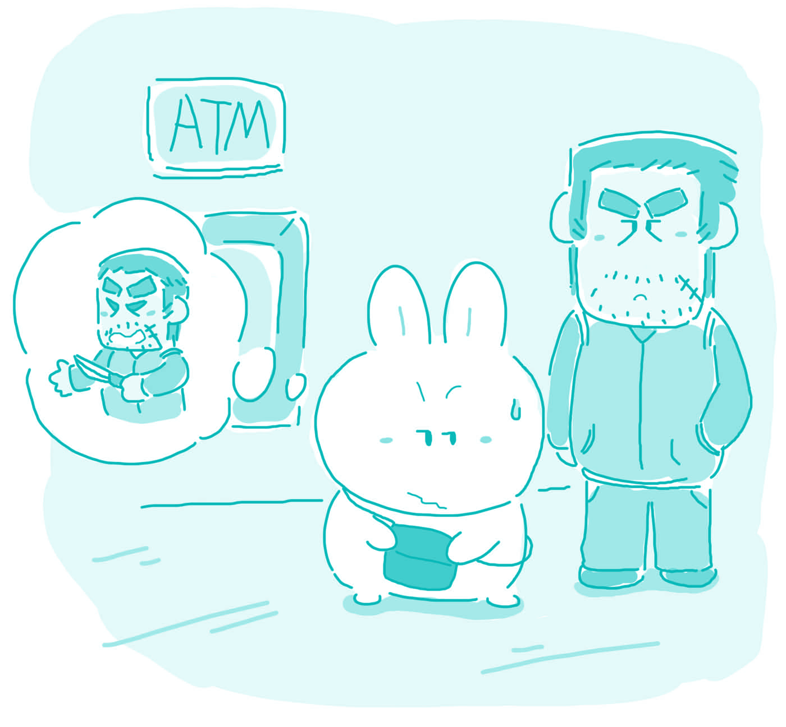

> ###  译文

> **121. 凭第一印象判断人：正确还是错误？**

> 有些人凭借第一印象判断一个人的品质，仅仅因为他们相信这些判断大多是正确的。其他一些人对迅速做出判断则表现得更加谨慎，因为他们觉得他们最初的印象有可能是错误的。然而，这是一个普遍的模式：如果某个人留下的第一印象很好，人们将倾向于相信这种印象，并据此做出判断；而如果这个人留下的第一印象很糟，人们通常会延缓这种判断，直至第二次或第三次的见面，以确保最初的评价是正确的。

> 我与人初次见面的个人哲学是，在确定其好坏之前先假定是好的。如果留下的第一印象非常好，我可能会认为那是他们的品质，除非在以后的邂逅中证明他们并非如此。我相信这是做出判断的一种公平而有利的方式。我认为没有任何理由去怀疑某个人的品质，除非他或她提供了一个让我这样想的原因。如果我过分猜忌别人的品质，甚至有可能我自己会给别人留下糟糕的第一印象。

> 不过，我还相信，如果某个人留下的第一印象很糟，推迟做出判断也非常重要。有很多原因可以导致某个人心情糟糕，因而给人留下不好的印象。比如，我正会面的一位男士，可能在他身上刚刚发生了不好的事情。或许他的包被偷了，而里面有一些重要的文件。如果这发生在我的身上，我肯定会心情很坏，接着给我遇见的人留下不好的印象。因此，我觉得等到第二次，或者甚至是第三次见面的时候再做出判断，这也很重要。

###  Word List

 * impression ［imˈpreʃən］ n. 印象
 * assessment ［əˈsesmənt］ n. 评价
 * judgment ［ˈdʒʌdʒmənt］ n. 判断
 * philosophy ［fiˈla:səfi］ n. 哲学
 * original ［əˈridʒənəl］ adj. 最初的
 * encounter ［enˈkauntə］ n. 邂逅，碰面
 * faulty ［ˈfɔ:lti］ adj. 错误的
 * suspicious ［səˈspiʃəs］adj. 怀疑的，猜忌的
 * be inclined to... 倾向于
 * hold off 推迟，延缓
 * a multitude of 大量
 * ensure ［enˈʃuə］ v. 确保

## 122. Are people never satisfied with what they have?

It is said that people are never satisfied with what they have; they always want something more or something different. Unfortunately, this statement has quite a bit of truth to it in today's society. Individuals today are constantly driven to have the best, the brightest, and the newest. With the increase of westernization, almost every country has become a consumer culture, including China.

There is not a street you can walk down in Downtown Beijing that does not have an advertisement, trying to sell you something. Wherever you go, there is a new product calling to you. Individuals in society today believe that others will not appreciate them if they do not spend exorbitant amounts of money on all types of luxuries, from cars, to fancy mobile telephones, to expensive, name brand clothing.

This idea does not only relate to consumer goods, however. I find that if I start a new job, for the first period of time, maybe the first month, the first year, or even the first five years are very exciting. Eventually, the appeal wears off, and I am no longer enchanted with my work. I crave something different, something more exciting. Anything, as long as it is better than what I am currently doing.

I think people, including myself, need to become more comfortable with their current positions. There is no reason why we should cater to the advertising industry, and constantly buy new and better products, when the ones we currently have work fine. This is not to say that we should never have new, nice things. In the past decade, consumer spending has reached new heights around the world. This is hardly necessary, especially when you consider that people have been living happily for thousands of years without such goods. I think that if people could learn to live without such frivolities, they would live a much happier life overall.

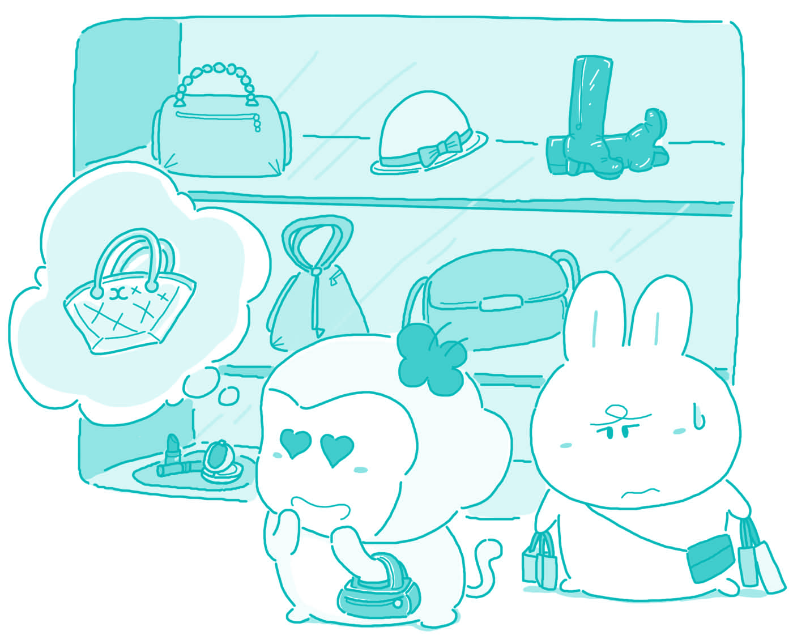

> ###  译文

> **122. 人们永不满足于自己所拥有的吗？**

> 有人说人们永远不会满足于自己所拥有的；他们总是想要更多的或是不同的东西。不幸的是，这种说法在当今的社会多少有一些真实性。现在的人受到不断的驱使去拥有最好的、最炫的和最新的。随着西化的推进，几乎每个国家都成为了一种消费文化，包括中国。

> 沿着北京市中心走下去，没有哪条街道上没有试图向你兜售物品的广告。无论你走到哪里，都会有一种新产品向你打招呼。现今社会的人们相信，如果他们不在各种奢侈品，从汽车，到花哨的移动电话，到昂贵的名牌服装上花费大把的钱，别人就不会欣赏他们。

> 然而，这种想法并不仅仅适合于消费品。我发现如果我开始一份新的工作，起初的一段时间，或者第一个月，第一年，或者甚至是开头的五年，新工作会非常令人兴奋。但最终吸引力逐渐减退，我不再对自己的工作感到着迷。我渴望不同的事情，更加令人兴奋的事情。任何事，只要它比我现在做的更好就行。

> 我想人们，包括我自己，需要对他们目前的状况更加知足。当我们现在所拥有的运转良好时，我们没有理由一定要去迎合广告业的需要，不断地购买新的更好的产品。这并不是说我们永远也不应该拥有新的好东西。在过去的十年中，消费支出在世界范围内已经创下了新高。这几乎是没有什么必要的，尤其当你考虑一下，人们在没有这些物品的情况下已经快乐地生活了数千年。我想如果人们能够学会在没有这些无聊东西的条件下生活，总的说来他们会生活得愉快许多。

###  Word List

 * westernization ［ˌwestəniˈzeiʃən］ n. 西化
 * luxury ［ˈlʌgʒəri］ n. 奢侈品
 * fancy ［ˈfænsi］ adj. 花哨的
 * appeal ［əˈpi:l］ n. 吸引力
 * wear off 减退
 * enchant ［enˈtʃænt］ v. 使入迷
 * crave ［kreiv］ v. 渴望
 * cater to 迎合
 * frivolity ［friˈva:liti］ n. 无聊的东西

## 123. Should people read only those books that deal with real matters?

I do not believe that people should only read books that are about real events, real people, or established facts. Personally, I do not see any logic in this statement whatsoever. There are a multitude of reasons why a person should read a wide range of books.

First, if an author was to write solely about real events and established facts, there would be little room for imagination. Without imagination, it would be difficult to come up with any new ideas, or to progress our thinking. Second, most of history is subjective. If an author takes a certain viewpoint on a "real" event, he/she is bound to miss some of the facts, and there is even a possibility that he/she will get some of the facts wrong. The author must indulge the story, in order to fill in the details that are missing. Most books about real events and real people are part fiction.

If we look at the situation from the perspective of the reader, it is just as grim. If an audience was to only make reference to non-fictional books, there would be little room for the expansion of the mind. Many authors who write fiction do so in order to introduce new thoughts and ideas to the reader. These new ideas allow us to come up with innovative views of our own, and through this process, we grow.

As mentioned above, fictional works are an important outlet, allowing us to forget about all of the negative things happening in the world for a little while. There are people who might disagree that this escape is a positive thing. However, I posit that by escaping from the "real world" for a few hours, we are able to deal with it more efficiently and happily when we return. Because of this, reading fiction is a great way to relax.

Fictional works are very important to society, and the individual. They allow us to think of new, exciting ideas, as well as give us an excellent, peaceful way to relax. There is nothing I would rather do on a free evening than unwind and read a good, fictional novel.

> ###  译文

> **123. 人们应该只读那些描写真人真事的书籍吗？**

> 我不认为人们只应该阅读关于真事、真人或已得到验证事实的书籍。就本人而言，我觉得这种说法没有任何逻辑。有很多理由可以说明为什么一个人阅读书籍应该范围广泛。

> 如果一位作者仅仅就真事和已得到验证的事实进行写作，就没有留下多少想象的空间。没有想象的话，就很难得出任何新的观点，或者是推进我们的思维。其次，大部分的历史都是主观的。如果作者对真实的事件带有某种看法，他必定会遗漏事实的某些部分，甚至还有可能会曲解事实的某些部分。为了填补所有遗漏的细节，这位作者就必须编些故事。大多数关于真人真事的书籍都是部分虚构的。

> 如果我们从读者的角度来看待这种情况，问题同样很严峻。如果一个读者仅仅阅读非虚构的图书，思维扩展的空间就会很小。许多写虚构小说的作者这样做，就是为了把新的想法和观点带给读者。这些新的观点使我们能够获得我们自己创新的见解，而通过这一过程，我们得到了成长。

> 如上所述，虚构作品是一种让我们暂时忘记世界上发生的所有不好事情的重要途径。有人或许不同意这种逃避是积极的。然而，我认为，借助这几个小时从“现实世界”的逃离，当我们回来的时候，就能够更加有效、更加愉快地去应对它。因此，读虚构作品是一种放松的好方法。

> 虚构作品对社会、对个人来说都是非常重要的。它们让我们的想法新奇又令人振奋，而且给我们提供了一种极佳的平和的方式去放松。在一个闲暇的夜晚松弛一下，阅读一本好的虚构小说，没有什么比这更让我惬意的了。

###  Word List

 * whatsoever ［hwa:tsəuˈevə］ adv. 任何地
 * expansion ［ikˈspænʃən］ n. 扩展
 * solely ［ˈsəuli］ adv. 仅仅
 * innovative ［ˈinəˌveitiv］ adj. 创新的
 * imagination ［iˌmædʒəˈneiʃən］ n. 想象
 * outlet ［ˈautˌlet］ n. 途径
 * viewpoint ［ˈvju:ˌpɔint］ n. 观点
 * posit ［ˈpa:zit］ v. 认为，假定
 * indulge ［inˈdʌldʒ］ v. 迁就
 * peaceful ［ˈpi:sfəl］ adj. 平和的
 * grim ［grim］ adj. 严峻的
 * unwind ［ʌnˈwaind］ v. 松弛，放松

## 124. Is it more important for students to study history and literature than to study science and mat

I think that these academic subjects are equal to each other; one is not better or more important than the other. First of all, it is important for students to take the classes which they will excel at. If all students were to take history and literature, half of them would do terribly. Not all students have a literary mind; in fact, only about half of them do. Having a scientifically based mind is no better or worse than the alternative.

It's hard to imagine that all the students are learning history and literature while no one study science and mathematics. If this was the case, a major portion of the world's knowledge would be lost. Science and mathematics students are constantly making important breakthroughs in their fields of research. If the number of students taking these subjects dramatically dropped because they were told it was less important than other subjects, this research would come to a grinding halt. Science and mathematics students come up with much of the theories behind how the world works, which are vastly important to society.

In fact, students should be encouraged to take all subjects because there is no way of measuring which courses are"better" than others. Everything a person can study has its own unique value. Whether this value is based on personal beliefs or the beliefs of society at large, everything is important in some way or another. Moreover, most academic disciplines are in fact interrelated. For example, historians sometimes have to employ some statistical knowledge while they are doing their research. At the same time, computer programmers will have a better understanding of their field if they are familiar about the history of computer science.

One must take the courses one finds interesting, and not base his/her decisions on what others say are important. History and literature can be seen as a link to the past, whereas science and mathematics can be viewed as a link to the future. In this sense, no one is more relevant than the other because each field produces insights that the other has no way of grasping.

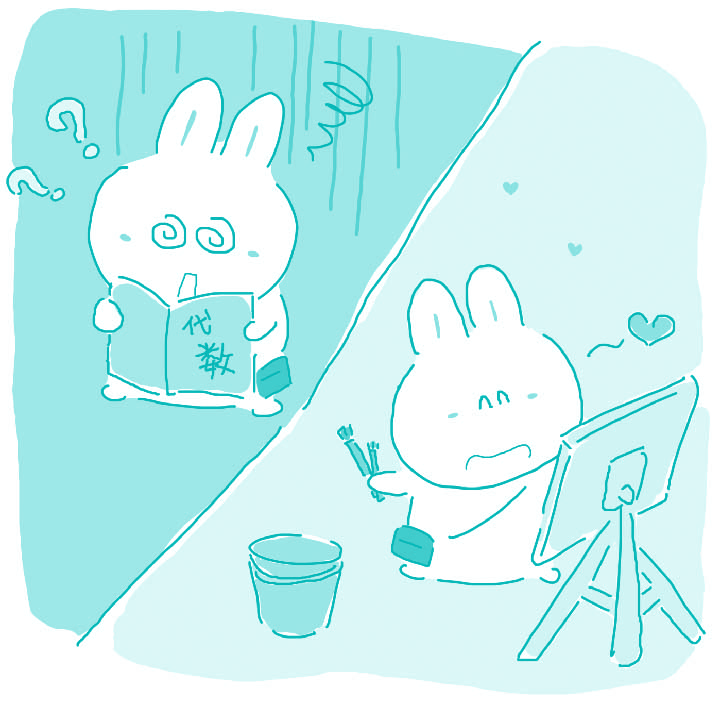

> ###  译文

> **124. 学习历史和文学比学习科学和数学更重要吗？**

> 我认为这些学科的地位是平等的，每一科都不会比另外一科更加优越或是更加重要。首先，重要的是让学生们去选择自己擅长的课程。如果所有的学生都去学习历史和文学，他们中间有一半会学得很糟。并非所有的学生都具备文学头脑；事实上，其中只有一半人是如此。拥有一副侧重科学的头脑并不比另外一种更好或是更差。

> 难以想象所有的学生都在学习历史和文学，而没有人学习自然科学和数学。如果是这样，世界上的知识有很大一部分就会丢失。学习自然科学和数学的学生不断地在他们的研究领域实现重大的突破。如果由于被告知这些科目没有其他科目重要将导致选择它们的学生数量急剧下降，这些研究便会嘎然而止。另外，学习自然科学和数学的学生提出关于世界运转背后隐藏的许多理论，而这些对社会来说是极其重要的。

> 事实上，应该鼓励学生们去选择所有的科目，因为没有办法衡量哪些课程比其他的更“优越”。一个人能学习的一切都有其独特的价值。无论这种价值是基于个人信念，还是基于全社会的信仰，所有的一切都有这种或那种的重要性。而且，大多数的学科事实上都是相互关联的。比如，历史学家在做研究的时候，有时必须运用一些统计学的知识。同时，计算机程序员如果对计算机科学的历史非常熟悉的话，将会对自己的领域有更好的理解。

> 一个人应该选择自己发觉有意思的课程，而不是把他或她的决定建立在别人说什么东西重要的基础之上。历史和文学可以看作是连接着过去，而自然科学和数学则可以被看作是连接着未来。从这种意义上说，不能断定哪个比对方更重要，因为每个领域都会产生其他领域所无法获得的见解。 

###  Word List

 * excel at 擅长
 * interrelate ［ˌintəriˈleit］ v. 互相关联
 * alternative ［ɔ:lˈtə:nətiv］ n. 另外一种选择
 * employ ［emˈplɔi］ v. 运用
 * portion ［ˈpɔ:ʃən］ n. 部分
 * statistical ［stəˈtistikəl］ adj. 统计学的
 * programmer ［ˈprəuˌgræmə］ n. 程序员
 * breakthrough ［ˈbreikˌθru:］ n. 突破
 * relevant ［ˈreləvənt］ adj. 有实际重要性的
 * unique ［ju:ˈni:k］ adj. 独特的

## 125. Should all students be required to study art and music in secondary school?

The authorities at secondary schools must make very important decisions regarding what will be considered to be the required curriculum for their students. I believe that art and music should be part of this required curriculum.

Studying art and music makes a person more diverse and thoughtful. When one studies art and music, one is exposed to many different cultures and points of view. It allows the audience to perceive the world through a different set of eyes. It is also an excellent way to spark interest in other cultures and diverse ways of life. This promotes understanding and tolerance of others. It is also a porthole to peer into areas of many cultures, including one's own, that one would not readily have access to. This includes everything from social life to metaphysics to philosophy, etc.

Furthermore, these subjects give the students an outlet for expressing their turbulent emotions during puberty. Art and music are also an excellent way to express emotions. In ancient times, many a troubled man turned to brush work or Chinese classical music to work out difficulties with life. Students of today'modern world have similar issues with life, and need an outlet to express these. Art and music, in any form, can assist one in dealing with personal issues.

In addition, viewing art and listening to music are excellent ways to relax. When I am stressed because of life, one of my favorite activities is painting while listening to my preferred music. I find this activity to be very soothing and calming. Looking at works of art can have a similar effect, and when one understands the philosophy behind the work, it is that much more beneficial.

Therefore, I believe that studying art and music in secondary school can be nothing but beneficial for the students. I would encourage all school districts to make these subjects part of their required curriculums.

> ###  译文

> **125. 中学生必须学习艺术与音乐吗？**

> 在考虑关于要把什么作为学生必修课程的时候，中学的负责人必须做出非常重要的决定。我认为艺术和音乐应该是这种必修课程的一部分。

> 学习艺术和音乐使得一个人更加多元化，也更加善于思考。当一个人学习艺术和音乐的时候，可以接触到许多不同的文化和见解。艺术和音乐让观众或听众得以从不同的角度去领悟世界。这还可以很好地激发对其他文化和各种各样生活方式的兴趣，从而增进对他人的了解和宽容。艺术和音乐还可以成为透视多种文化的通道，包括一个人自己的文化，它涵盖了从社会生活到玄学到哲学等等所有的一切。而这些是一个人本不会那么容易地接触到的。

> 另外，这些科目给学生们提供了表达他们青春期骚动情绪的一种途径。艺术和音乐也是宣泄情感的极佳方式。在古代，许多困惑不安的人就借助绘画或者中国古典音乐来应对生活的艰难。当今的学生，生活中有着类似的问题，也就需要一种将其表达出来的途径。艺术和音乐，无论以何种形式，都能帮助一个人处理自己所遇到的问题。

> 除此以外，欣赏艺术以及聆听音乐都是让自己得到放松的绝佳方式。当我感到生活的重压时，我最喜欢的活动之一就是一边画画一边听着自己钟爱的音乐。我发现这非常有助于让自己平静和镇定。欣赏艺术作品也可以有类似的功效，而且当一个人理解了作品背后的哲理，那会更加有益。

###  Word List

 * authority ［əˈθɔ:riti］ n. 负责人
 * tolerance ［ˈta:lərəns］ n. 宽容
 * regarding ［riˈga:diŋ］ prep. 关于
 * porthole ［ˈpɔ:tˌhəul］ n. 通道
 * curriculum ［kəˈrikjələm］ n. 课程
 * peer into 透视，窥视
 * diverse ［daiˈvə:s］ adj. 多元化的，各种各样的
 * readily ［ˈredili］ adv. 无困难地
 * metaphysics ［ˌmetəˈfiziks］ n. 玄学
 * perceive ［pəˈsi:v］ v. 理解，领悟
 * assist ［əˈsist］ v. 帮助
 * spark ［spa:k］ v. 激发
 * sooth ［su:θ］ v. 使平静
 * promote ［prəˈməut］ v. 增进，促进

## 126. Is there anything that young people can teach older people?

It has been a common conception that young people have nothing of value to teach their elders. I firmly disagree with this statement, and posit that in fact, the opposite is true. Young people have a plethora of information to teach old people. One of the advantages of being young is having a different perspective on life than one's seniors. Young people have not been influenced by nearly as many people as an old person, and therefore, their thoughts and ideas are more their own. An older person can learn from these new ideas, and once again, see the world with the freshness and fascination of a young person.

Also, young people tend to embark on all of their projects with a kind of intensity and perseverance. This quality can sometimes be lost as one gets older. After spending time with a young person, an old person tends to gain back some of this vitality. For example, I have seen many older people who did not live their lives to the fullest. However, with the addition of a granddaughter or a grandson, they regained much of their youthfulness. In my opinion, this was fully due to their seeing the vitality in the young, and learning from it.

Finally, young people tend to enjoy experimenting when they are working on a project. Older people are usually set in their ways, and will continue doing a chore one way, even if it is not the best way. Young people can offer insight into new methods of doing even the simplest tasks and often will think up new systems that do not occur to the elderly.

In conclusion, I think older people can learn much from the future generations. Of course, this is not to say that young people cannot learn from their elders. The educational process does not only work one way through generation gaps.

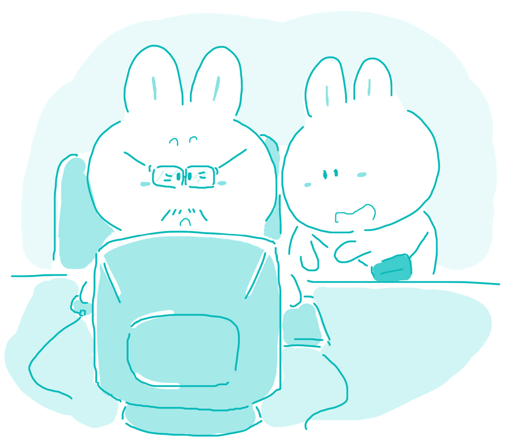

> ###  译文

> **126. 年轻人有没有什么可以教给老年人的？**

> 一直以来人们普遍认为，年轻人没有任何有价值的东西可以教他们的长者。我坚决不同意这种说法，而且我认为，事实上情况恰好相反。年轻人有一大堆的信息可以传授给老年人。

> 年轻的其中一个优势就是，对生活有着与年长者不同的看法。年轻人并未像老年人那样受到多方面的影响，因此，他们的想法和观点更多地是来自于他们自己。而一位年长者就能从这些新观点中受益，同时再一次地用年轻人的生气和入迷来领略这个世界。

> 此外，年轻人倾向于用一种热情和执着去开展所有计划。当一个人年纪大些的时候，有时可能会失去这种品质。与年轻人相处之后，老年人往往会重新获得一些这样的活力。比如，我见过许多曾经没有尽情享受生活的年长者。然而，当他们有了一个孙女或是孙子，他们就重新获得了许多年轻时的朝气。在我看来，这完全是由于他们看到了年轻人身上的活力而从中受益的。

> 最后，年轻人在做事的时候往往喜欢进行试验。年长者则通常会固守自己的方式，会持续用一种方式做一件事情，即便这并非最佳方法。即便是在进行最简单的任务，年轻人也可以提供关于新方式的见解，而且通常会设计出年长者从未想到过的新的方法。

> 总而言之，我认为年长者能够从未来的几代人身上获益良多。当然，这并不是说年轻人就不能从他们的长者身上学到东西。教育过程并不仅仅是通过一种方式来穿越代沟的。

###  Word List

 * conception ［kənˈsepʃən］ n. 观念
 * a plethora of 一大堆
 * freshness ［freʃnəs］ n. 生气
 * embark on 从事，着手
 * intensity ［inˈtensiti］ n. 热情
 * perseverance ［ˌpə:səˈviərəns］ n. 执着，毅力
 * vitality ［vaiˈtæliti］ n. 活力
 * regain ［riˈgein］ v. 重新获得
 * youthfulness ［ˈju:θfəlnəs］ n. 朝气
 * think up 想出，设计出

## 127. Is reading fiction more enjoyable than watching movies?

Billions of dollars are spent on entertainment every year, in every country in the world. Much of this money is spent on either movies or fictional books, as these two types of entertainment are found to be most enjoyable by the masses. Which, however, is more enjoyable? I posit that these mediums cannot be compared so easily, as they both have their strong points in regards to entertainment.

When one reads a fictional book, one is able to let his/her imagination run wild. Everything from the setting to the character descriptions is left up to the reader's mind, and therefore can be quite enjoyable. Depending on the novel, of course, one can imagine far away places just by the description read in the novel. Books are also an excellent form of entertainment as they are portable. If one is on a long commute to work, which is common in Beijing, one can bring along a favorite novel, effectively taking his/her entertainment with him/her. Books can be enjoyed in any setting. They can be picked up on a whim, and put down again to return to at a later time.

Movies, of course, also have their own benefits. Movies allow the viewer to be completely engrossed in the plot. There is no need for thinking, as everything is presented to you in a straightforward form. One never has to ponder what a place or a person looks like; the information is all accessible to the viewer. This can be an advantage or a disadvantage, depending on what one is looking for in his/her entertainment.

In a society where we want everything faster, better and more exciting, perhaps movies are a more relevant medium. However, movies demand at least an hour and a half of one's time. Books are available to their consumers whenever there is time, which is also an important feature. In conclusion, I believe that neither books nor movies are a more enjoyable form of entertainment. In some cases, I prefer to read a book. In others, a movie is vastly more enjoyable. It is up to the consumer to decide.

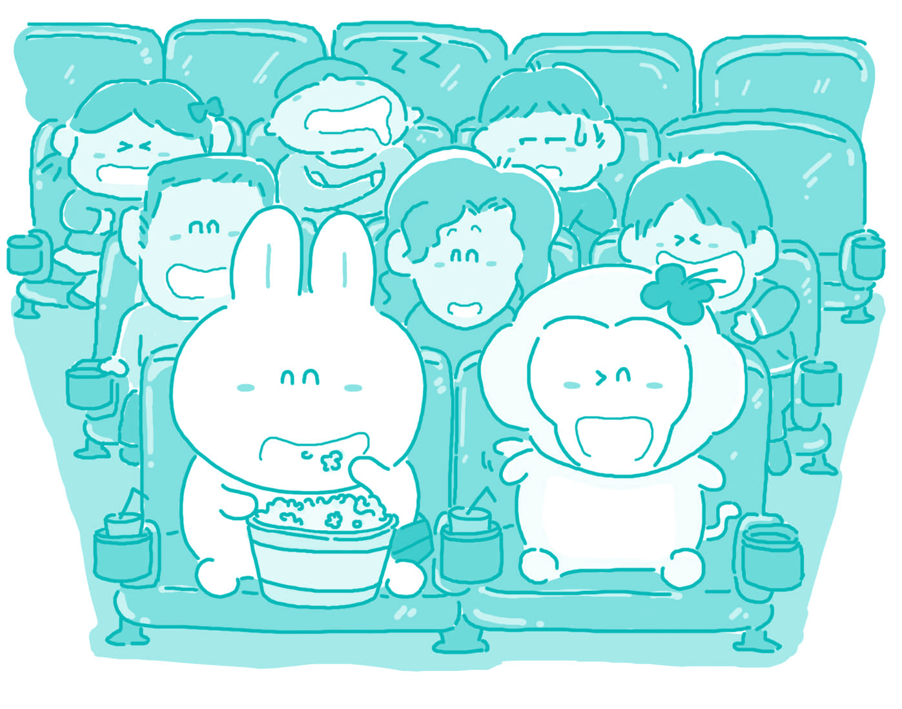

> ###  译文

> **127. 读小说是否比看电影更有趣？**

> 每年在世界上的各个国家有上亿美元花费在娱乐活动上。这些钱有许多是用于电影或者小说，因为大多数人都认为这两种娱乐方式是最有乐趣的。然而，哪种更有意思一些呢？我认为这些形式比较起来并不是太容易，因为它们两种作为娱乐消遣都有其各自的优势。

> 当一个人阅读小说的时候，他可以无限放飞自己的想象。从背景到人物性格描绘的所有一切都可以出现在读者的脑海中，因而可以非常有趣。当然，依靠小说，一个人能够仅仅通过在小说中读到的描绘想象出遥远的地方。书本是一种娱乐消遣的绝佳形式，也是由于它便于携带。如果一个人上下班路途漫长，这种情况在北京很常见，他可以随身带上一本自己喜爱的小说，实际上就是将娱乐消遣随身携带。书本能够在任何环境里欣赏。可以一时兴起拿起书本，然后再放下，等到以后回头再看。

> 当然，电影也有自己的好处。电影使观众完全沉浸于情节之中。没有必要思考，因为一切都以简单明了的方式呈现在你面前。人们永远不需要考虑某个地方或某个人是什么样子；所有信息观众都能获得。这可能是一个优势，也可能是一个劣势，取决于人想通过娱乐寻求什么。

> 在我们希望一切事物更快、更好而且更刺激的这样一个社会里，也许电影是一种更有实际价值的形式。但是，电影至少需要花费人们一个半小时的时间。而读者就可以一有时间就读书，这也是一个重要的特色。总而言之，我不认为读书和看电影哪一个比对方更有趣。在有些情况下，我更愿意读书，而在其他一些情况下，一部电影要更有意思。这要依靠当事者自己来决定。

###  Word List

 * setting ［ˈsetiŋ］ n. 背景
 * portable ［ˈpɔ:təbl］ adj. 便携式的
 * effectively ［iˈfektivli］ adv. 实际上
 * on a whim 一时兴起
 * engross ［enˈgrəus］ v. 使沉浸，使全神贯注
 * straightforward ［streitˈfɔ:wəd］ adj. 直截了当的
 * ponder ［ˈpa:ndə］ v. 考虑，思考
 * accessible ［ækˈsesəbl］ adj. 可获得的，可理解的

## 128. Should we spend all school day studying or set aside some time for exercising?

Some people believe that it is important to have physical activities as part of a child's everyday curriculum at school. Others disagree, and argue that students should spend all of their time on academic studies. Personally, I believe that physical education is a vital part of an education as it teaches children to take care of their bodies, how to work as a team, and gives them a method of releasing tension and aggression.

Humans have always known about the importance of taking care of our bodies, but it seems that in recent years, we have gradually forgotten this important fact. It is absolutely necessary to get some physical activity at least a few times a week, and engraining this idea into children when they are young is the best way to ensure their health for life.

Physical exercise usually involves teamwork of some sort. Much of the exercise that young people get involves games such as basketball, volleyball, or football. All of these sports teach children how to work together to achieve a common goal, in this case, winning. I also believe that allowing the children to work together in a fun environment, rather than only on academic projects, brings a stronger sense of camaraderie, which helps the children to have healthy relationships with others.

Finally, physical exercise is an excellent way to release tension and aggression. If one is particularly stressed about school or life, getting exercise can help the person to relax. As for letting out aggression, it is much healthier to kick a football than it is to hit someone who has made you angry.

Exercise should definitely be a part of a student's education. Exercise has much more to offer than simply getting"a break" from academics. Physical exercise can balance out a student's hectic life, and make it much more pleasurable.

> ###  译文

> **128. 学习日是全用来学习还是留出部分时间来运动？**

> 有些人认为，把体育运动作为孩子每天学校课程的一部分是很重要的。其他一些人则对此持有异议，他们认为学生应该把所有的时间都放在学习上。就我而言，我相信体育教育是整个教育至关重要的一部分，因为它教会孩子们如何照顾自己的身体，如何进行团队协作，以及给他们提供一种释放压力和发泄敌对情绪的方式。

> 人类一直以来都了解照顾自己身体的重要性，但是近几年我们似乎逐渐忘记了这一重要的事实。每个星期至少进行几次体育锻炼是绝对必要的，而且当孩子们年轻的时候就把这种思想灌输到他们的头脑中去，这是保证他们生命健康的最佳方式。

> 体育锻炼通常涉及到某种形式的集体协作。年轻人进行的很多锻炼中包括了像篮球、排球或者足球这样的比赛。所有这些体育运动教会孩子们如何一起合作来完成一个共同的目标，在这种情况下，目标就是获胜。我还相信让孩子们在一种嬉戏的环境中合作，而非仅仅在学术项目上进行协作，会让他们对友情的感觉更加强烈，这可以帮助孩子们与他人建立健康有益的关系。

> 最后，体育锻炼是释放压力和发泄敌对情绪很好的途径。如果一个人感觉到学业或生活的重压时，进行锻炼能帮助这个人进行放松。至于发泄敌对情绪，去踢一个足球总比去打一个让你生气的人要健康得多。

> 体育锻炼绝对应该成为学生教育的一部分。锻炼能够给予我们的，可远远不只是从学习中获得一种“休息”。体育锻炼能够平衡学生紧张忙碌的生活，使它更加愉快。 

###  Word List

 * physical ［ˈfizikəl］ adj. 身体的
 * camaraderie ［ˌka:məˈra:dəri:］ n. 友情，友爱
 * release ［riˈli:s］ v. 释放
 * aggression ［əˈgreʃən］ n. 敌对情绪
 * let out 发泄；释放
 * engrain ［enˈgrein］ v. 使根深蒂固
 * as for 至于
 * ensure ［enˈʃuə］ v. 确保，保证
 * balance out 平衡
 * teamwork ［ˈti:mˌwə:k］ n. 集体协作
 * hectic ［ˈhektik］ adj. 紧张忙碌的

## 129. A center for business research or for research in agriculture?

China is currently one of the fastest growing economies in the world. A new research center, whether business or agriculturally based, would be beneficial for both our country and the rest of the world. When considering if it would be more valuable to build a business center or an agricultural center, one must realize that both fields of research work hand in hand with each other to develop and expand a country's economy. In a bustling economy like China's, either research center would have great value.

There is no doubt that a country's economy is strongly influenced by its ability to not only feed its own people, but also to export agricultural products to other countries. In this sense, an agricultural research center would help further development in China's sustainability and further the country on a global scale. An agricultural research center would also be a great idea in China, as our country already has excellent agricultural techniques. By having this type of research center in China, the world's knowledge on this important field would grow exponentially. Agriculture also has the ability to employ a large percentage of the population, and through agricultural research, these people's efforts could be used in a more efficient manner.

A business research center would also be an excellent idea in China. As China becomes more and more prone to the power of globalization, a business research center would allow China to not only keep up with the business-minded West, but also, this type of center could possibly allow our country to surpass the West in new business ideas. China has the largest population in the world, and therefore, the business industry is bound to grow at an alarmingly fast rate.

In conclusion, I believe that either of these centers would be beneficial to our country. Perhaps the best solution would be to raise funds for both of the centers, and allow the two centers to work together to build a better China.

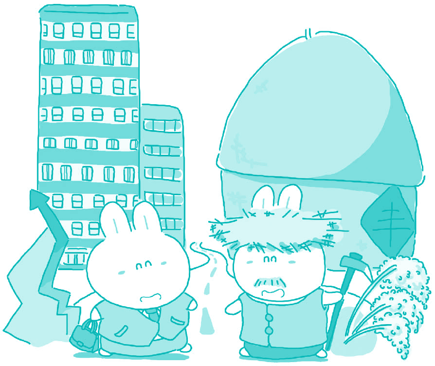

> ###  译文

> **129. 商业研究中心还是农业研究中心？**

> 中国现在是世界上经济发展最快的国家之一。一个新的研究中心，不管是以商业还是以农业为基础，不仅会给我们的国家带来好处，也将有益于世界上其他国家。人们在考虑是建立一个商业中心还是一个农业中心更有价值的时候，必须意识到，两个研究领域是共同发挥作用来促进和发展一个国家经济的。对于一个像中国经济这样的活跃经济，任何一种研究中心都会存在着巨大的价值。

> 毋庸质疑，一个国家除了要满足自身人民的温饱之外还要向其他国家出口农产品。这种能力会在很大程度上影响该国的经济。从这种意义上来说，一个农业研究中心将帮助推动中国的可持续发展，并促进国家在全球范围的发展。我们国家已经拥有先进的农业技术，所以一个农业研究中心对于中国会是一个很好的想法。通过在中国建立这种研究中心，全世界关于这一重要领域的知识了解将会越来越多。农业还可以给很大一部分人口提供就业机会，并且通过农业研究，这些人的辛勤劳动可以获得更加有效的利用。

> 在中国建立一个商业研究中心也会是一个很好的想法。随着中国越来越多地受到全球化的影响，一个商业研究中心不仅能让中国赶上有商业头脑的西方人，而且这种中心还可能使得我们国家在新的商业观念上超越西方。中国拥有世界上最多的人口，因此，商业必定会以快得惊人的速度增长。

> 总之，我认为建立两种中心的任何一种对我们国家来说都会是有益的。也许最好的解决办法是筹资修建这两种中心，从而让两个中心共同作用来建设一个更加美好的中国。

###  Word List

 * expand ［ikˈspænd］ v. 发展；使膨胀
 * sustainability ［səˌsteinəˈbliləti］ n. 可持续性
 * global ［ˈgləubəl］ adj. 全球的
 * exponentially ［ˌekspəˈnenʃəli］ adv. 成指数地；越来越快地
 * keep up with 赶上，跟上
 * surpass ［sə:ˈpæs］ v. 超越
 * alarmingly ［əˈla:miŋli］ adv. 惊人地

## 130. The advantages and disadvantages of young children spending much time practicing sports

It is a common activity not only in China, but across the world, for young children to spend copious amounts of time playing and practicing sports. There is much discussion as to whether this is a beneficial way for young people to spend their time. In order to decide, we must consider the advantages and disadvantages.

There are many advantages to children spending their time playing sports. First, children will be stronger and healthier because they are getting exercise. This not only has the immediate effects of being healthy children, but also affects their health later in life, as they will develop good habits for taking care of their physical shape and their health. Second, exercise is known to be an excellent appetite and weight controller. In recent years, with the further development of China, many young people are becoming overweight. Playing sports in one's childhood could definitely help this situation. Finally, sports are excellent social activities. If one plays sports early in life, he will learn about teamwork, perseverance, and goal setting. All of these lessons will help one to become a happier, better adjusted adult.

There are also a few disadvantages to children spending time playing sports.

For example, playing sports detracts from study time, which is very important. If children are playing sports so often that they cannot concentrate on their studies, they should definitely stop. Another disadvantage is that sports can sometimes be dangerous, causing life-long injuries to a person that is not careful. Finally, some people believe that sports are overly competitive, and push children too hard at a young age. It is possible that children would lose self-confidence and self

esteem if they constantly lost at sports. Sometimes, it is the parents that push the children too hard at sports, causing an unwillingness to participate due to a lack of enjoyment.

Overall, I think that sports are beneficial to a young person's life. They offer valuable skills that will be useful throughout one's entire life. As long as one is careful and does not overdo it, sports are an excellent idea for all young children.

> ###  译文

> **130. 儿童把大量时间用于体育运动的利与弊**

> 孩子们把大量的时间用于进行体育运动和训练，这不仅在中国，而且在全世界都是一个普遍的现象。关于年轻人这样度过自己的时间是否对他们有益，存在着许多讨论。为了做出判断，我们必须考虑一下有利之处和不利之处。

> 孩子们把时间用于体育运动对他们来说有很多好处。首先，孩子们由于参加锻炼，将会更加强壮和健康。这不仅能让儿童保持目前的健康，而且还会影响孩子们日后的健康，因为他们将通过锻炼培养出注意自己身形和健康的良好习惯。其次，锻炼身体被公认为能保持食欲和控制体重。近年来，随着中国的进一步发展，许多年轻人开始变得肥胖。如果在童年时期就参加体育运动，肯定能帮助缓解这种状况。最后，体育运动是非常好的社交活动。如果一个人早年就参加体育运动，他会学到集体协作、毅力和目标定位。所有这些心得将帮一个人成长为更加愉快、适应性更强的成年人。

> 孩子们把时间花在体育锻炼上也有一些不利之处。比如，体育运动占去了学习时间，而后者是非常重要的。如果孩子参加体育运动的频率过高，他们就无法集中精力在学习上，这时他们肯定必须停止体育活动。另外一个劣势是，体育运动有时候可能会有危险，对一个不太小心的人可能会造成终生的伤害。最后，有些人认为体育运动竞争性太强，在孩子们年纪很小的时候把他们逼迫得太厉害。如果孩子不断地在体育运动上落败，他们有可能会失去自信和自尊。而有时候，是父母过分地逼迫孩子去进行体育运动，结果导致孩子由于缺乏乐趣而不愿意参与。

###  Word List

 * copious ［ˈkəupiəs］ adj. 大量的
 * concentrate on 集中于，全神贯注于
 * immediate ［iˈmi:di:it］ adj. 即时的，立刻的
 * overly ［ˈəuvəli］ adv. 过度地
 * appetite ［ˈæpitait］ n. 食欲
 * competitive ［kəmˈpetitiv］ adj. 竞争的
 * overweight ［ˌəuvəˈweit］ adj. 超重的，肥胖的
 * unwillingness ［ʌnˈwiliŋnəs］ n. 不愿意
 * participate ［pa:ˈtisəˌpeit］ v. 参加
 * childhood ［ˈtʃaildˌhud］ n. 儿童时期
 * overdo ［ˌəuvəˈdu:］ v. 过度
 * detract ［diˈtrækt］ v. 转移</li>

## 131. Only people who earn a lot of money are successful?

China is host to over one billion people. While the majority of China's population is not rich; in fact, it is a very small percentage of people who hold the status of being wealthy. Does this mean that the vast majority of Chinese people are unsuccessful? The answer to this is irrefutably "no".

There are many measures of success, and money is one of them. However, money is far from the main measure of success. To prove this point, one need only consider the possibility that a man could be wealthy beyond belief, but not consider himself successful. Perhaps he inherited his money, and has done nothing of value in his life. Perhaps he earned the money through ill means. Whatever the situation, it is more than possible that a rich man could be considered unsuccessful, either by himself, or by others.

Many people believe that the main measure of success is happiness, rather than material goods. Without happiness, even a person with money, status and children would not be successful. However, a low paid schoolteacher might think he/she was very successful if he/she succeeded in getting children to learn their material well. Or perhaps a housewife, who makes no money of her own, would feel successful if she raised a healthy, well-adjusted child and kept her home looking wonderful.

It is also important to look at the difference between self-perceived success and one's success in the eyes of another person. Perhaps the outside world views a man as unsuccessful if he does not have a lot of money, but he views himself as very successful because of his achievements in life. Whose opinion is more important? I believe that if one thinks he/she is successful, then he/she is, no matter what other people say.

In conclusion, money is not the only measure of success. Anyone can be successful, whether they are rich or poor. What matters is how one views himself/herself; if one is proud of one's achievements in life, and feels that he/ she has lived a fulfilling life, then he/she is successful.

> ###  译文

> **131. 只有有钱人才算是成功人士？**

> 中国拥有十亿多的人口。然而大部分中国人都不富裕；事实上，只有很少一部分人称得上富裕。这是否就意味着，绝大部分的中国人就不成功呢？对此的回答是无可争议的“不是”。

> 对于成功有很多衡量标准，而金钱是其中之一。但是，金钱远不是成功的主要量度。为了证明这一点，人们只需要考虑一下这种可能性，一个人也许富裕得无法想象，但他并不认为自己是成功的。或许他的钱是继承得来的，一生中并未做任何有价值的事情。或许他的钱是通过卑劣的手段挣来的。不管是哪种情形，一个有钱人也许要么自己觉得要么被别人认为是不成功的，这非常有可能。

> 许多人相信成功的主要衡量标准并非物质，而是幸福。如若没有幸福，即使一个有钱、有地位、有儿女的人也不会是成功人士。然而，一个低收入的中小学教师如果成功地让孩子们学好了他们的教材，也许就会认为自己是有成就的。或者一个自己并不赚钱的家庭主妇，也可能会觉得很有成就感，因为她抚养了一个健康、有教养的孩子，而且把家里收拾得非常漂亮。

> 自己认为的成功和他人眼中一个人的成功，比较它们之间的差别也很重要。如果一个人没有很多钱，可能外部世界会认为他不成功，但是他却因为自己在生活上的成就认为自己非常成功。谁的意见更重要呢？我相信，无论别人怎么说，如果一个人认为自己成功，他或她就是成功的。

###  Word List

 * status ［ˈsteitəs］ n. 身份，地位
 * majority ［məˈdʒɔ:riti］ n. 大多数
 * irrefutably ［iˈrefjətəbli］ adv. 无可辩驳地
 * measure ［ˈmeʒə］ n. 衡量标准，量度
 * ill ［il］ adj. 卑劣的；恶劣的
 * self-perceived ［ˌselfpəˈsi:vd］ adj. 自认为的
 * fulfilling ［fulˈfiliŋ］ adj. 有成就的

## 132. If you could invent something new, what product would you develop?

The world today is moving at a faster and faster pace. An invention that would be exceptionally useful for the human race would be an intelligent humanoid robot.

On a daily basis, millions of people in China perform tasks which are exceedingly tedious, and are a tragic waste of the abilities of these people. Tasks such as house cleaning, street cleaning, some types of farming, some factory work, toll booths and a multitude of other jobs would be performed just as easily by a robot as by a man. In some cases, robots could potentially outperform man because they would not need to rest. They could perform these simple tasks at a rapid speed, and therefore would be a significant advantage in some manual labor jobs.

Other tasks that people perform are incredibly dangerous, and often cause life long injuries, or much worse as to kill people. If these types of jobs were performed by machines, there would be far fewer work-related injuries and deaths. A prime example is deep sea welding on oil platforms. Every year there are many deaths of workers who hold this dangerous position. In addition, because it is such a high-stress job, the worker's lives are often shortened because of inability to cope. As machines obviously do not feel emotional stress, they would perform hundreds of times better than men do in these types of situations.

Humanoid robots would also more efficiently perform complex jobs such as surgeries and manufacturing high-tech materials. For example, eye surgeries and brain surgeries require a very steady, careful hand, and an intensely varied knowledge of the human anatomy. A robot could be programmed to complete such surgeries flawlessly. Manufacturing high-tech materials is very complex, as it involves many intricate mathematical problems. A robot could be programmed to perform calculations in seconds that would take a man hours or days to perform.

Therefore, I think an intelligent humanoid robot would be incredibly beneficial to the human race, although many of the tasks it performs would need to be supervised by a person, and some tasks would be impossible to perform for a robot.

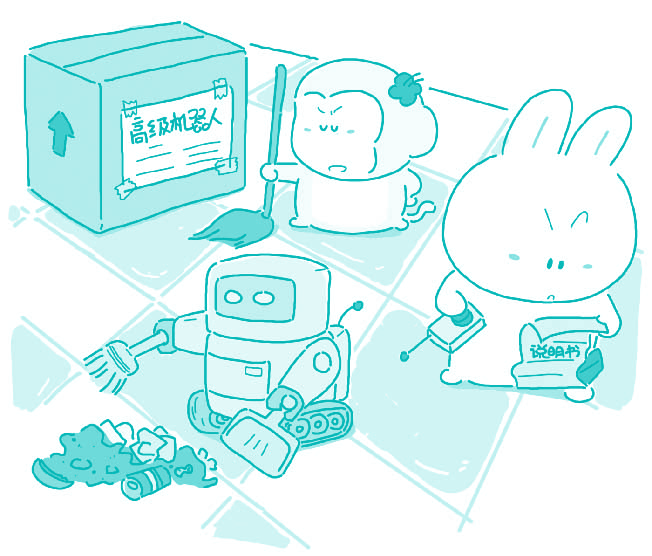

> ###  译文

> **132. 如果你能发明一件新事物，你会发明什么？**

> 当今世界正以越来越快的速度向前发展。智能人形机器人将是一个对人类格外有用的发明。

> 在中国，每天都有上百万的人从事着极其枯燥的工作，它们是对这些人才能的一种非常不幸的浪费。像收拾房间、清扫街道、某些形式的耕作、某些工厂的工作、收费站等许多工作，用机器人来做会和人类一样轻松。在有些情况下，机器人有可能完成得比人类更好，因为它们不需要休息。它们能够快速地完成这些简单的工作，因此在一些体力劳动的工作上将会有很明显的优势。

> 人们从事的有些工作是非常危险的，经常会导致终生的伤害，或者更糟的，会导致死亡。而这种工作要是由机器来完成的话，工伤和工伤致死将少得多。一个很典型的例子就是油井的深海焊接。每年死于这一危险职业的工人很多。另外，由于这种工作需要高度的精神紧张，所以工人经常会因为无力应付而寿命缩短。显而易见，机器感觉不到精神紧张，它们在这种情形下可以比人类好上千百倍地进行工作。

> 人形机器人还可以更加有效地完成像外科手术和制造高科技材料之类的复杂工作。比如，眼睛手术和脑部手术需要一只不颤抖而且谨慎的手，以及对人类解剖学有极其广泛的了解。一个机器人可以按程序准确无误地完成这样的手术。制造高科技材料是非常复杂的，因为它涉及到许多错综复杂的数学问题。机器人可以按照程序在数秒之内完成人类需要几个小时或是几天时间才能完成的计算。

###  Word List

 * exceptionally ［ikˈsepʃənəli］adv. 格外地，特别地
 * incredibly ［inˈkredəbli］ adv. 非常
 * weld ［weld］ v. 焊接
 * intelligent ［inˈtelədʒənt］ adj. 智能的
 * shorten ［ˈʃɔ:tn］ v. 缩短，使变短
 * humanoid ［ˈhju:məˌnɔid］ adj. 人形的
 * steady ［ˈstedi］ adj. 不颤抖的
 * exceedingly ［ikˈsi:diŋli］ adv. 极其，非常
 * anatomy ［əˈnætəmi］ n. 解剖学
 * tedious ［ˈti:diəs］ adj. 枯燥的
 * flawlessly ［ˈflɔ:lisli］ adv. 无误地
 * tragic ［ˈtrædʒik］ adj. 不幸的，悲惨的
 * intricate ［ˈintrikit］ adj. 错综复杂的
 * toll booth 收费站
 * supervise ［ˈsu:pəvaiz］ v. 监督
 * outperform ［autpəˈfɔ:m］ v. 比…做得好

## 133. Are a person's childhood years the most important years of a person's life?

It is generally accepted that a person's childhood years are very important years of a person's life, but it is hardly appropriate to say those years are the most important.

We do not reject the importance of childhood years. Actually it is rather important for later part of a person's life. Our lives, to a large extent are subject to our recognition of our surroundings. Our world views have been structured from very early stage of our childhood, mainly through our daily experiences. Everyone therefore actually has his or her own world different from those of others, because even though we all live in a single world, each and every one of us in fact lives in distinctive worlds which are determined by distinctive perceptions that vary widely from individual to individual. Hence, we should not be surprised by the extent to which a person's life is influenced by one's childhood.

Childhood, however, is only part of one's life, and it is merely one of several determinatives that shape one's adult life. Among various determinatives is one's learning ability. Human beings are superior to any other animals on the Earth simply because of their vigorous ability to learn. Psychology teaches us that training and self-training can dramatically alter one's characteristics and even the ability to learn, which may eventually alter his/her life. Furthermore, learning is a life long process, which means every part of one's life could be an essentially crucial period, and could play an indispensable role in one's life. Examples are available everywhere. Einstein was taken for an idiot by his teacher when he was a child. Even though every thankful man would have known exactly that that doesn't necessarily mean he was really an idiot, the awkward attitude of his stupid teacher absolutely made Einstein's childhood an awful one. Nevertheless, Einstein led a wonderful life.

Most parents nowadays seem to believe the statement that childhood is the most important phase of one's life, and therefore often force their children to learn those alleged essential skills for the sake of the future. The fact is, such behavior is rather presumptuous, because there still are many other important factors that affect one's life.

> ###  译文

> **133. 一个人的童年时代是否是人生中最重要的阶段？**

> 人们普遍认为，人的童年时代是人的一生中非常重要的阶段，但是要说那些岁月是最重要的并不恰当。

> 我们并不否认童年时代的重要性。事实上，这对一个人以后的生活是非常重要的。我们的生活在很大程度上会受到我们对周围环境认识的制约。我们的世界观是从自己儿童时代最初始的阶段开始构筑的，主要通过我们的日常体验。因此每个人实际上都有着与他人不同的自己的世界，原因是，即便我们全都生活在同一个星球，可我们每个人事实上还是生活在各自与众不同的世界里，而人们各不相同的感知就支配着这些不同的世界。因此，儿童时代对人的一生所造成的影响程度巨大，我们对此并不应该感到吃惊。

> 然而，儿童时代只是人一生的一部分，它也只是影响人们成年阶段的几个决定性因素之一。在各种决定性因素之中，包括了一个人的学习能力。人类比地球上任何其他动物都要高级，原因就在于他们强大的学习能力。心理学教会我们，接受训练和自我训练能够极大地改变一个的性格，甚至还有学习能力，而这最终可能会改变人的一生。此外，学习是一个终生的过程，这意味着人一生的每个阶段都可能是一个至关重要的时期，都可能在人的一生中扮演着不可缺少的角色。例子随处可见。爱因斯坦还是个孩子的时候，被他的老师当作一个白痴。虽然每个心存感激的人都确切地知道，那并不一定就意味着他真的是一个白痴，可他愚昧的老师的这种令人尴尬的态度还是绝对会让爱因斯坦的童年变得很糟糕。尽管如此，爱因斯坦的一生还是非常了不起。

###  Word List

 * reject ［riˈdʒekt］ v. 否认
 * self-training ［ˌselfˈtreiniŋ］ n. 自我训练
 * distinctive ［diˈstiŋktiv］ adj. 与众不同的
 * dramatically ［drəˈmætikəli］ adv. 极大地
 * perception ［pəˈsepʃən］ n. 感知
 * alter ［ˈɔ:ltə］ v. 改变
 * determinative ［diˈtə:məˌnetiv］ n. 起决定性作用的事
 * crucial［ˈkru:ʃəl］ adj. 决定性的
 * indispensable ［ˌindiˈspensəbl］ adj. 不可缺少的
 * shape ［ʃeip］ v. 影响，决定
 * vigorous ［ˈvigərəs］ adj. 强大的
 * presumptuous ［priˈzʌmptu:əs］ adj. 自以为是的
 * psychology ［saiˈka:lədʒi］ n. 心理学 

## 134. Should children be required to help with household tasks as soon as they are able to do so?

Helping out with household tasks is the first job that most people usually partake. From an early age, children are encouraged to help around the house, doing little tasks that help out their parents and grandparents. I believe that this is an important feature of society, and should be continued.

It is very important for children to learn how to be responsible for their environment. This is a skill that they will take with them throughout their lives, and it should be fostered at an early age. If people are able to keep a clean house or workplace, they will be able to achieve tasks much more easily. For example, if children learn early in life that everything has its place, then this lesson will not only teach them to keep things tidy, but also instruct them on how to stay organized.

Another reason why this is important is because it promotes a strong work ethic in children at an early age. If a child is given responsibilities around the house, and it is made sure that the child completes these tasks, the child will learn how important it is to follow through on instructions. Many parents go so far as to punish their children for not doing chores, which I think will ultimately be beneficial for the children. It will help them in all of their later endeavors in life.

Finally, encouraging children to do work around the house as soon as they are able to gives them an appreciation of what their parents do for them to keep them safe, clean and warm. Many young children have no idea how difficult it is to keep a house in good condition. It is important that children learn from an early age how much their parents do for them, and learn to respect their parents more based on this.

Overall, I agree with putting children to work early in life around the house. Of course, there are limits on this. Children should not become the maids of the household. They should be given enough work to encourage a strong work ethic and an appreciation of their parents, but not so much that they have no time to do anything else.

> ###  译文

> **134. 是否应该要求儿童在其力所能及时就做家务？**

> 帮忙做家务通常是大多数人第一次参与的工作。从很小年纪开始，孩子们就被鼓励在家里帮忙，做些小事情来帮助自己的父母和祖父母。我认为这是社会的一个重要特色，应该保持下去。

> 让孩子们学习如何对自己的环境负责是非常重要的。这是一种他们将会受用终生的技能，而且这种技能应该在早期培养。如果人们能够维持干净的房间或工作地点，他们就能够更加轻松地完成自己的工作。比如，如果孩子早年学会一切事物都有自己的位置，那么这不仅将教会他们维护东西的整洁，而且还将指导他们如何保持条理。

> 帮忙做家务很重要的另外一个理由就是，它可以在孩子们很小的时候激发一种很强的职业道德。如果让孩子负责家务，并确保孩子将其完成，孩子就会了解执行指令坚持到底是多么重要。许多父母甚至会因为孩子们不做家务而惩罚他们，我认为这对孩子们来说最终将是有益的。它会有助于他们在今后生活中所做的一切事情。

> 最后，只要孩子们一有能力就鼓励他们帮忙做家务，会让他们懂得父母都为自己做了些什么，来使自己安全、干净和温暖。许多小孩完全不知道把家里收拾好有多么困难。让孩子们很早就了解父母为他们付出了多少，并因此而学会更加尊敬父母，这是很重要的。

###  Word List

 * help out 帮助
 * partake ［pa:ˈteik］ v. 参加，参与
 * foster ［ˈfɔstə］ v. 培养
 * ethic ［ˈeθik］ n. 道德，伦理
 * follow through 执行，坚持到底
 * endeavor ［enˈdevə］ n. 努力，尽力
 * appreciation［ə ˌpri:ʃiˈeiʃən］ n.了解，感激
 * maid ［meid］ n. 仆人

## 135. Should high schools require students to wear school uniforms or permit them to decide what to w

While in most present day high schools it is controversial that whether students should wear uniforms, most elementary schools have adopted uniform policy with wide support. Uniforms serve students benefits in several ways. First of all, uniforms act as social equalizers. Children often feel less social pressure when everyone in the school dresses the same way. Students who can not be fashionable due to limited family finances are made to feel more comfortable among their peers. Moreover, the wearing of uniforms influences students' perceptions of school climate. Students are made to feel as if they are a part of a team by wearing a uniform. School climate is improved considerably because kids perceive that they fit in because they look like everybody else. In addition, school uniforms would assist students and parents in other ways. Students would learn to appreciate the elimination of so many choices when getting dressed for a school day. Students would not be tardy for school as often because of the indecision about what to wear in the mornings.

However, when the issue comes to high school situation, further details should be carefully examined. Students in high schools are in a much different situation from students in elementary schools. High school students are sometimes called young adults, by which people are expecting their maturity, at least to some extent. It's moderate that schools are expected to operate a welldisciplined, structured environment that is conducive to learning. But uniform is not the right answer to various difficulties and problems that the high school education is confronting. For example, while proponents address the safety that uniform policy would bring, opponents are aware of the fact that campus violence would not be reduced because of uniforms. Having grown up already, most students no longer feel that uniforms help them become a part of the school. Furthermore, uniforms may not save parents as much money as many people would like to believe. Uniforms do not eliminate the need for clothing needed for outside school. Students many times don't wear their school clothing the rest of the day once they are out of school. Sneakers, jackets, boots, casual clothing, and more will still be needed. What may first appear to be economical may not be accurate in reality.

It has been said that a controversy can not exist without a fundamental dispute, and it seems that the answer to the school uniform debate is not a simple yes or no. There is no clear consensus as to the benefits of school uniforms. However, as to high schools, uniform policy should eventually be reconsidered as many other regulations which have already been eliminated including"Boys' hair should not touch collar," or "Girls' skirts must be longer than knees. "

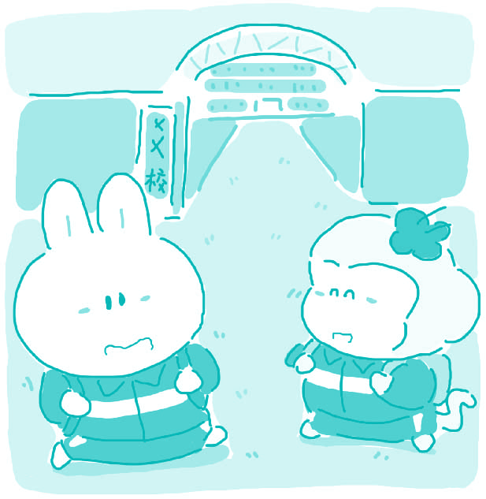

> ###  译文

> **135. 中学应该要求学生穿制服，还是允许学生自行决定着装？**

> 如今，关于中学是否应该让学生穿校服的问题尚有争议，但大多数的小学已经在得到广泛支持的情况下采取了校服制度。学校制服可以在几方面给学生们带来好处。首先，校服可以扮演社会均衡器的角色。当学校的每个人穿相同的衣服时，孩子们经常会感觉社会压力更小。这会让那些由于家庭经济状况有限而不能穿着时髦的学生在同伴中感觉更舒服自在。而且，制服的穿着影响到学生们对学校气氛的感知。穿校服让学生们觉得他们是团队中的一部分。学校气氛可以得到相当大的改善，因为孩子们看到自己与其他人都相似而感觉很适应。另外，学校制服还会在其他方面有助于学生及其家长。学生会学会喜欢前去上课时不用再考虑繁多的着装选择。学生们还可以不再因为早晨无法决定穿什么而经常上课迟到。

> 然而，当问题转到中学的时候，就必须仔细考虑进一步的细节了。中学生的情况与小学生大相径庭。中学生有时被称作年轻的成年人，这种称呼体现了人们正期待着他们的成熟，至少是一定程度上的。学校应该营造一种有利于学习的有纪律、有组织的环境，这是很正常的。但是，校服并不是中学教育所面临的各种困难和问题的最佳解决方式。比如，一方面，支持者提出校服制度将会带来安全，另一方面，反对者则意识到学校暴力不会因为校服而减少的事实。大多数学生已经长大了，他们不再感觉校服可以帮助他们成为学校的一部分。而且，制服也不会像许多人愿意认为的那样，为父母节约许多钱。校服并未减少校外的衣物需求。许多时候，学生们一旦走出校门就不穿校服了。运动鞋、夹克衫、长统靴、休闲服装以及其他衣物仍然还是需要的。起初看似经济的在现实中并非如此。

> 有人说，如果没有根本分歧的话，争议就无法存在，而且看起来对学校制服的争论的解决办法并不是一个简单的是或不是。关于学校制服的益处没有明显的共识。然而，对于中学来说，校服制度应该像其他很多规则一样被重新考虑，这些规则包括“男孩子的头发不应长到衣领”，或者“女孩子的裙子必须长过膝盖”，他们已被废除。

###  Word List

 * controversial［ˌka:ntrəˈvə:ʃəl］ adj. 有争议的
 * well-disciplined［ ˌwelˈdisiplind］adj.有纪律的
 * uniform ［ˈju:nəˌfɔ:m］ n. 制服
 * conducive ［kənˈdu:siv］ adj. 有助于…的
 * equalizer ［ˈi:kwəˌlaizə］ n. 平衡器
 * confront ［kənˈfrʌnt］ v. 面临
 * fashionable ［ˈfæʃənəbl］ adj. 时髦的
 * proponent ［prəˈpəunənt］ n. 支持者
 * peer ［piə］ n. 同伴，同辈
 * opponent ［əˈpəunənt］ n. 反对者
 * considerably［kən ˈsidərəbəli］adv.相当大地
 * sneaker ［ˈsni:kə］ n. 运动鞋
 * fit in 适应
 * economical ［ˌekəˈna:mikəl］ adj. 经济的
 * elimination ［iˌliməˈneiʃən］ n. 消除
 * consensus ［kənˈsensəs］ n. 共识，意见一致
 * tardy ［ˈta:di］ adj. 迟到的

## 136. Is playing a game fun only when you win?

Playing games is one of the most popular forms of entertainment in the world. Every country has a number of popular games that are played all the time. For example, in China, Mahjong and Chinese Chess are both very popular. I think playing game in itself is full of fun, winning a game is just a pleasure extra.

It would be impossible to think that one could win a game all the time when they first start playing it. This is especially true for strategy games such as the above-mentioned. In many cases, playing against the top players of a game and losing is an honor, not a disappointment. The age-old adage says that practice makes perfect. This is as true in games as it is in any other endeavor. In order to win a game all of the time, you need to practice it over and over and learn the strategies of the game.

Practice is necessary to win a game. If this was really an annoying process, no one would ever play games. However, it is the journey of the game, not the destination that is important. Going through the actual game is the fun part; if one wins a game, that is an added bonus. People truly enjoy the process of playing a game. If winning was the only thing that was important, we would all play "Rock-Paper-Scissors" all of the time.

People enjoy the process of playing a game because of the social aspects. Playing a game, especially a long, enduring game like Mahjong is a bonding experience. Many of these games can last for days, being picked up and left off time and time again. Games are great for bonding with other people, which makes them excellent for improving one's social skills, in addition to having fun.

In conclusion, I strongly believe that games can be fun even if I am not the winner. Games must be played a multitude of times if one hopes to get good at them, and this is a fun process to go through. Games bring us closer to our friends, as we have fun experiences with them. There are many excellent reasons to play a game besides winning.

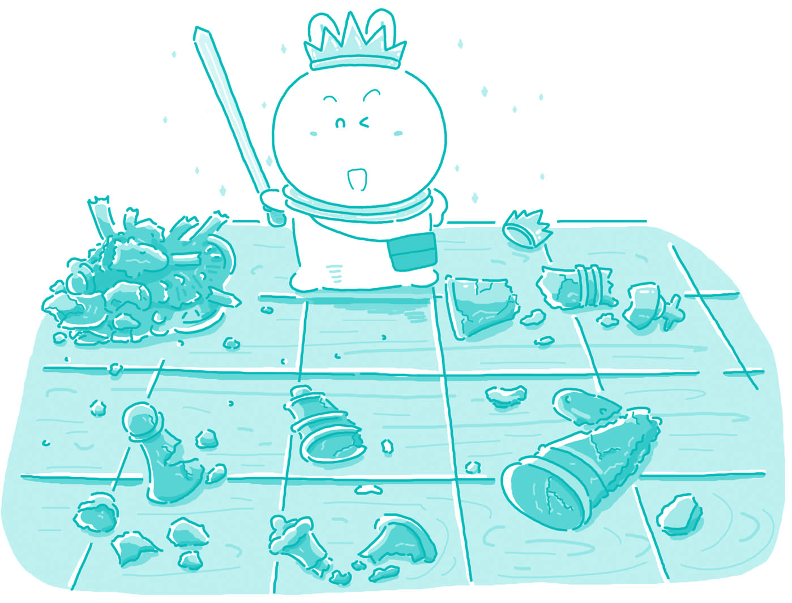

> ###  译文

> **136. 只有获胜，游戏才好玩吗？**

> 玩游戏是世界上最受欢迎的娱乐方式之一。每个国家都有许多一直在玩的流行的游戏。比如，在中国，麻将和中国象棋都是非常受欢迎的。我认为玩游戏本身就充满乐趣，而游戏获胜只是一个额外的惊喜。

> 当人们刚开始玩一个游戏的时候，他们不可能总赢。这尤其适用于像上面所述的讲究策略的游戏。在许多情况下，与一种游戏的顶尖玩家之间进行较量，输掉也是一种光荣，而不是失望。那句古老的格言说得好，熟能生巧。这对于游戏和任何其他事情都是同样正确的。为了保证游戏的胜利，你必须反复地加以练习，学习游戏的各种计策。

> 练习对游戏获胜是必需的。如果这真的是一个让人厌烦的过程，没有人会去玩游戏。然而，正是游戏的过程而非目的才是重要的。经历实际的游戏过程才是有趣的部分；如果一个人获得了胜利，那就是一个额外的奖赏。人们真的喜欢玩游戏的这个过程。如果获胜才是惟一重要的东西，那还不如一直玩“剪刀石头布”。

> 人们喜欢玩游戏的过程，还因为社交方面的原因。玩游戏，尤其是像麻将那样漫长而持久的游戏，是一种联络感情的经历。许多这种游戏可能会起起停停，持续好几天。游戏非常有助于和他人进行感情联络，这使得它们除了提供乐趣，还成为改善人们社交技巧的很好的方法。

> 总之，我坚信，即使我不是胜者，游戏也能很有意思。人们如果希望对游戏精通，必须进行大量地练习，而这个经历正是一个很有乐趣的过程。游戏使我们与朋友更加亲近，因为我们共同经历了乐趣。玩游戏除了为了获胜之外还有许多很好的理由。

###  Word List

 * strategy ［ˈstrætədʒi］ n. 策略，计策
 * age-old ［ˈeidʒˈəuld］ adj. 古老的
 * above-mentioned ［əˌbʌvˈmenʃənd］adj. 上述的
 * adage ［ˈædidʒ］ n. 格言
 * annoying ［əˈnɔiiŋ］ adj. 让人厌烦的
 * top ［ta:p］ adj. 顶尖的
 * bonus ［ˈbəunəs］ n. 奖赏
 * honor ［ˈa:nə］ n. 光荣
 * enduring ［enˈdu:əriŋ］ adj. 持久的
 * disappointment［ ˌdisəˈpɔintmənt］ n.失望

## 137. Should high schools allow students to study the courses that students want to study?

High school is a very important time in a person's educational career. During this period, they will learn many of the skills necessary to be successful in university and the work world. There are both advantages and disadvantages of students picking their own courses in high school. The disadvantages are that high school students are too young to have good judgment about what they really require and also, it's very important for a young person to get a rounded education. The advantage of adolescents picking their own courses is that people should be able to start exploring their aptitudes at a young age.

If children are able to pick all of their own courses in high school, it is more than likely that they will pick all"easy" courses, such as arts or music courses. Children do not necessarily know what is best for them, and therefore, could end up lacking later in life because of the poor, uninformed decisions they made as adolescents.

Young people need a well-rounded, balanced education. A good education should include everything from languages to mathematics to science, etc. Many children would avoid their most disliked courses if given the opportunity. A well-rounded education leads to well-balanced people, which in turn leads to a tolerant, knowledgeable society. It is important to have a wide basis of knowledge concerning how the world works.

As mentioned above, there is also an advantage of allowing children to pick their own courses in high school. Picking one's own courses means that one will be able to focus on subject areas that are particularly interesting to the individual. Adolescents should be able to hone in on their likes and dislikes at a young age, as this will give them a better understanding of where their aptitude lies.

In conclusion, I think that students in high school should be able to choose some of their own courses. There should definitely be a required curriculum, but it should leave room for students to take selectives that they are truly interested in.

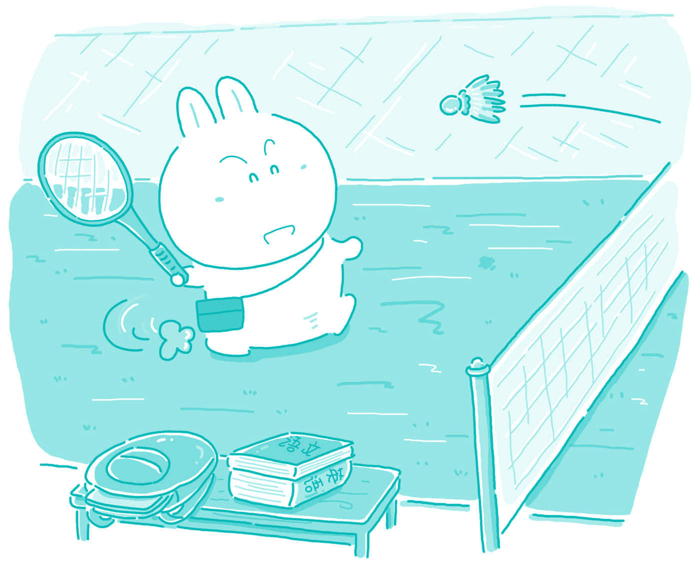

> ###  译文

> **137. 中学是否应该让学生自行决定所学课程？**

> 中学是一个人受教育过程中非常重要的一段时间。在此期间，学生将学习在大学和工作中取得成功所必需的许多技能。让学生们自行选择他们在中学阶段的课程既有利也有弊。不利的是，中学生还太年轻，对自己真正需要什么东西还没有很好的判断，而且，让一个年轻人接受到全面的教育也是非常重要的。对十几岁的青少年来说，自行挑选课程的优势就是，人们将在早年开始发掘自己的才能。

> 如果一个孩子能够自行挑选中学的所有课程，那很有可能他会选择所有那些“轻松的”科目，像艺术或音乐课。孩子们并不一定了解什么对自己是最好的，因此，可能会由于他们十几岁时做出的糟糕而莽撞的决定最终导致日后成年时知识的匮乏。

> 年轻人需要获得全面而平衡的教育。一种良好的教育应该包括从语言到数学到科学等所有的一切。许多孩子只要一有机会就会逃避他们非常讨厌的课程。一个全面的教育会造就能力均衡的人，继而创造一个包容而博学的社会。对世界如何运转拥有广泛的基本了解是很重要的。

> 如上所述，允许孩子们在中学自行挑选课程也是有益处的。自行选择课程意味着，一个人将能够把精力集中在自己特别感兴趣的学科领域。这将使得年轻人更好地了解自己的才华所在，因此可以在早年发现自己的喜好。

> 总之，我认为中学生应该能够自己选择一些课程。肯定要有必修课，但也应该留出余地让学生们参加他们真正感兴趣的选修课。 

###  Word List

 * rounded ［ˈraundid］ adj. 全面的
 * balanced ［ˈbælənst］ adj. 平衡的
 * adolescent ［ˌædlˈesnt］ n. 十几岁的孩子，青少年
 * tolerant ［ˈta:lərənt］ adj. 包容的
 * knowledgeable ［ˈna:lidʒəbəl］ adj. 博学的
 * explore ［ikˈsplɔ:］v. 发掘
 * aptitude ［ˈæptiˌtu:d］n. 才能，才华
 * concerning ［kənˈsə:niŋ］ prep. 关于
 * uninformed ［ˌʌninˈfɔ:md］ adj. 对情况未充分了解的，莽撞的
 * selective ［siˈlektiv］ n. 选修课

## 138. Is it better to be a member of a group than to be the leader of a group?

When working in a group, there are many different positions, but basically, one can think of a group as having two job types: member and leader. Some people believe that it is better to be a member of a group than it is to be the leader. However, I think it is better to be a leader in a group because as the leader, one's ideas are more likely to be heard, he/she is more likely to receive accolades for complete work, and he/she is able to make important decisions for the group.

The leader of a group has the strongest voice of all. If someone enjoys coming up with new, exciting concepts and making a difference in a project, then he/she should be the leader. It can be a frustrating experience at time to be a member of a group. At times, a member's ideas are not taken seriously, because he/she does not have respect that the leader has. If one leads a group, his/her ideas will always be heard and respected, and usually followed through with.

When a project is complete, it is the leader that receives accolades for doing a good job. While the entire team gets some respect and appreciation upon completion, it is the leader who receives the most admiration. This is an advantage for building one's resume, and generally gaining respect in society. People always respect the leader of a group more than the members.

Moreover, it is better to be the leader of a group than a member because the leader is able to wield the power. Being the leader means getting a say in all decisions, and often, is allowed to follow through with any ideas that he/ she thinks up. This can mean that things that a person finds important will be completed quickly and efficiently.

Overall, I believe that it is better to be the leader of a group than to be a member. A leader can make decisions, follow through with them, and receive recognition for a job well done. However, there are of course some negatives of being a leader. The leader has much more responsibility for the project than anyone else, and if there is a failure, it is the leader's fault. If a person is willing to take on this added responsibility, then being a leader is by far the best position.

> ###  译文

> **138. 当团队的成员是否比当团队的领导好？**

> 在一个团队工作可以有许多不同的位置，但是大致说来，人们可以认为一个团队有两种职位：成员和领导。有些人认为，做团队的普通一员比当领导要更好。但是，我认为，做团队的领导要好些，因为当一个人做领导时，他的想法更可能被倾听，他更可能由于完成工作而受到称赞，他还能够为团队做出重要的决定。

> 一个团队的领导在所有人中是最有发言权的。如果某个人喜欢提出新的令人振奋的想法，并且对一个项目产生影响，他就应该当领导。团队普通成员有时的经历可能让人沮丧。有时，成员的意见不被认真考虑，因为他们不像领导那样受到敬重。如果一个人领导一个团队，他或她的意见总是会被倾听、被尊重，而且通常会得以执行。

> 当一个项目完成之后，因为工作优异获得称道的便是领导。虽然一项工作完成之后整个团队会获得尊敬和感激，但是领导赢得最多的钦佩。这对抬高一个人的资历是非常有利的，通常还会有助于在社会上赢得威信。相比团队的普通成员，人们总是更多地尊重他们的领导。

> 另外，在一个团队中当领导比做成员要好，因为领导可以拥有权力。做领导意味着在所有的决定中获得了发言权，而且只要是他或她想到的任何意见经常可以得以执行。这就代表着，一个人认为重要的事情将可以迅速而有效地得以完成。

> 总的说来，我认为做团队的领导比当成员要更好。一个领导能够做决定，将它们付诸执行，还可以由于工作出色获得认可。但是，做领导当然也有不利之处。领导对项目负有的责任比其他任何人都要多得多，而且，如果失败，那就是领导的过错。如果一个人愿意承担这种额外的责任，那当领导显然是最好的位置。 

###  Word List

 * accolade ［ˈækəleid］ n. 称赞
 * voice ［vɔis］ n. 发言权
 * frustrating ［ˈfrʌsˌtreitiŋ］ adj. 令人沮丧的
 * completion ［kəmˈpli:ʃən］ n. 完成
 * admiration ［ˌædməˈreiʃən］ n. 钦佩
 * resume ［riˈzu:m］ n. 个人简历，资历
 * wield ［wi:ld］ v. 拥有
 * recognition ［ˌrekəgˈniʃən］ n. 认可

## 139. What do you think is the most important room in a house?

Whereas others might feel ridiculous, I reckon the bathroom as the most important room in my house, even though other rooms such as the reading room or the sitting room are probably equally important.

First of all, the bathroom is the most important because it is highly visible to guests. We may be able to close off the bedroom to indicate that the room is"off-limits," but we cannot deny our visitors access to the bathroom. The most overlooked in general though it might be, the bathroom is a room which demands attention as much as possible. For example, it is absolutely an ugly design if the toilet is placed directly opposite the door, all too often the embarrassment happens when the door is accidentally unlocked. And it is the host to blame if the bathroom is dirty, smelly, or even scattered about in a mess.

The bathroom is very important because every family member will inevitably use that room, in which the most important part of family sanitations is located. Personal health of family member is no doubt superior to any other concerns. It should be spacious, bright, tidy, and above all, hygienic, and deserve frequent cleaning—in fact, the room we cannot clean too much, specifically, the toilet seat. Moreover, more than one bathroom are virtually needed, if possible. It is not only embarrassing or inconvenient but would also be absurd and irritating if someone knocks at the door when we are using the lavatory.

Another reason I put special emphasis upon bathroom came from my experiences. According to my conception, bathroom is not only for toileting, washing, and showering, but for reading as well. Don't be surprised, I have a very spacious and bright bathroom in my house, in which, an arm away from the stool is a small bookshelf, a little bit highly located on the wall to prevent books and newspapers from getting wet. I have already discovered that I have to spend more than 30 minutes a day in the bathroom, and that moment is so ideally quiet and easy to concentrate. Believe it or not, I learnt a computer programming language—Delphi—while I was sitting on the stool!

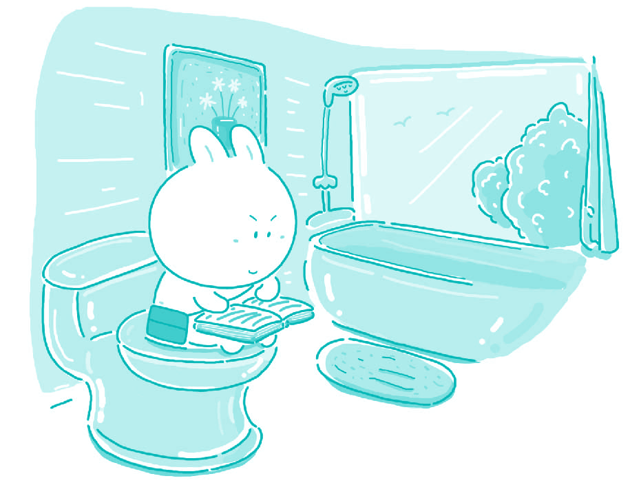

> ###  译文

> **139. 你认为房子里哪间房最重要？**

> 尽管其他人也许觉得可笑，但我认为卫生间是我家里最重要的房间，虽然其他房间，像书房或起居室，可能也同样重要。

> 首先，卫生间最重要，因为它非常有可能被客人看到。我们或许能够把卧室的门关上，以示这个房间禁止进入，但我们不能拒绝让来访的客人使用卫生间。通常卫生间最易被遗忘，但它是一个需要特别注意的房间。比如，如果卫生间被安排在正对着门口的地方，那绝对是一个很丑陋的设计。当门恰好没有锁的时候，经常会出现尴尬。如果卫生间不干净，有臭味，或者甚至是乱七八糟，那就应该责怪主人了。

> 卫生间非常重要，因为每个家庭成员都不可避免地要使用那个房间，所以它是家庭卫生最重要部分之所在。家人的个人健康毫无疑问比其他事情更重要。所以卫生间应该宽敞、明亮、整洁，最重要的是卫生。卫生间应该经常清扫，事实上，这个房间怎么清扫都不过分，特别是马桶座圈。而且，实际上如果可能的话，需要一个以上的卫生间。如果我们在用卫生间的时候，有人敲门，那不仅让人尴尬或者不方便，而且还很可笑，使人不愉快。

> 我特别强调卫生间的另外一个原因来自于本人的经历。按照我的想法，卫生间不仅用来上厕所、盥洗、淋浴，还可以用于阅读。不要吃惊，我自己家里有一个非常宽敞明亮的卫生间，而在离马桶一臂之距的地方是一个小书橱，在墙上放得比较高，可以避免书报被弄湿。我已经发现我每天必须在卫生间待上半个多小时，而那个时候是如此完美地寂静，很容易集中精神。不管你信不信，计算机编程语言Delphi，就是我在上厕所时学会的。

###  Word List

 * ridiculous ［riˈdikjələs］adj. 可笑的，荒唐的
 * hygienic ［haiˈdʒi:nik］ adj. 卫生的
 * specifically ［spiˈsifikəli］adv. 特定地，特别地
 * visible ［ˈvizəbəl］ adj. 可以看见的
 * indicate ［ˈindiˌkeit］ v. 表示
 * inconvenient ［ˌinkənˈvi:njənt］adj. 不方便的
 * off-limits ［ɔ:fˈlimits］ adj. 禁止进入的
 * smelly ［ˈsmeli］ adj. 有臭味的
 * absurd ［əbˈsə:d］ adj. 可笑的
 * sanitation ［ˌsæniˈteiʃən］ n. 卫生
 * irritating ［ˈiriˌteitiŋ］ adj. 令人不愉快的
 * superior ［səˈpiəriə］ adj. 高于…的
 * bookshelf ［ˈbukʃelf］ n. 书橱
 * spacious ［ˈspeiʃəs］ adj. 宽敞的

## 140. Items made by hand or items made by machine, which do you prefer?

There are a wide variety of products, such as clothes or furniture, which can be made either by hand or by machine. Both of these methods of manufacturing products have their advantages, and both hold an important place in society. To decide which is best, one should compare the advantages of each method.

There are many advantages of making products with the aid of machines.

First, machine-made products tend to be cheaper than their handcrafted counterparts. As machines are very steady and do the exact same thing every time they recreate a product, these type of products tend to have consistent quality. Frequently, handmade products have extremes in their product quality; it can either be extremely good or extremely poor. Finally, machine-made products have the advantage of being able to use some finishes and materials that cannot be used when creating something by hand. These include some types of steel, laminates, and enamel finishes.

There are also many advantages of buying handcrafted products. When people purchase handcrafted products, they are supporting the arts and crafts communities. Buying these types of products keeps many people employed, as it takes much more time to create an object by hand. Handcrafted objects tend to have much more diversity, as it is almost impossible to create an exact duplicate of an object if you are making it by hand.

Overall, I think that there are advantages of using both machine-made products and hand-made products. I think that if one can afford to buy high quality handmade clothing and furniture, that would be the best situation. These types of products tend to last much longer than their machine-made counterparts, and one can be satisfied knowing that they are supporting an artist. However, if one cannot afford to buy high quality handmade products, it is probably better to buy things that are machine-made. Machine-made products tend to be of higher quality than poorly made handcrafted products.

> ###  译文

> **140. 你喜欢手工制品还是机器产品？**

> 有很多种类的产品，比如衣服或家具，可以手工制作，也可以机器制作。这两种制造产品的方式都有其自身的优势，都在社会上占据着重要的地位。要确定哪个最好，人们必须比较这两种方式各自的优势。

> 在机器的帮助下制造产品有很多优势。首先，机器制造的产品往往比手工制作的同类产品要便宜。因为机器非常稳定，加工每个产品时都重复着完全相同的动作，所以这种产品往往拥有着始终如一的品质。而手工制作的产品经常会在他们的产品品质上出现两个极端：可能会非常好，也可能会非常糟。最后，机器制造的产品还有这样的优势，那就是能够利用一些手工制作时无法用到的涂漆和材料。这包括某些种类的包钢、层压和抛光。

> 购买手工产品也有许多好处。如果一个人购买手工制作的产品，他就是在支持手工艺术品的事业。购买这些种类的产品保证了许多人的就业，因为手工制作产品要花费更多的时间。手工物品通常更加多样化，因为要手工制作完全相同的物品几乎是不可能的。

> 总而言之，我认为，机器制造和手工制作的产品各有优势。我觉得，如果人们有足够多的钱购买优质的手工衣物和家具，那是最好的。这种产品往往会比机器制造的同类产品更加耐用，而且，人们了解到自己是在支持一位艺术家也会感到非常满足。然而，如果人们没有足够多的钱购买优质的手工制品，购买机器制造的物品可能更好一些。机器制品通常会比那些做工粗糙的手工产品的品质要好些。 

###  Word List

 * variety ［vəˈraiiti］ n. 种类
 * furniture ［ˈfə:nitʃə］ n. 家具
 * handcrafted ［ˈhændˌkræftid］ adj. 手工的
 * counterpart ［ˈkauntəpa:t］ n. 对应物
 * consistent ［kənˈsistənt］ adj. 始终如一的
 * handmade ［hændˈmeid］ adj. 手工制作的
 * laminate ［ˈlæməˌneit］ n. 层压板
 * employ ［emˈplɔi］ v. 雇用
 * duplicate ［ˈdu:plikit］ n. 完全相同的东西

## 141. What change do you want to make in a school you attended?

While the school system in China is generally quite good, there is one problem that I have found prevalent through all of my years of education. The problem is that the teacher to student ratio is too small. This situation was of no benefit to anyone: the teachers, or the students. If there were more teachers in each school, class sizes would be smaller, there would be a greater diversity of knowledge and information, and teachers would be less tired, and would therefore give better classes.

Class sizes are overwhelmingly large in China. In many of the courses offered in elementary school and high school, there are over forty students in a class. It is very difficult to learn in this type of situation. The teacher has no time to spend with individual students who need extra help, and students are often embarrassed to ask questions in front of so many other students. If class sizes could be shrunk, the learning curve in most courses would rise dramatically.

With more teachers at every school, the collective mass of knowledge and information would rise. Everyone in the world has his/her own very particular set of information. People are like snowflakes; each person is different and has varied experiences from the next person. With more people at a school, there is a wider knowledge base to draw from. This would obviously be an advantage to students, as schools could offer a wider range of courses in a variety of fields of study.

Therefore, if I was given the opportunity to change one thing in the high school that I once attended, I would like to try to recruit more qualified teachers and give them more decent pays. This would benefit everyone. It is an unfortunate fact that most school districts cannot afford to make this happen.

> ###  译文

> **141. 你希望你曾上过的学校有哪项改变？**

> 虽然中国的学校体制大体上是相当不错的，但是我从多年的教育经历中还是发现一个普遍存在的问题。这个问题就是，相对学生来说老师的比例太小。这种状况对任何人都没有好处，不管是老师，还是学生。如果每所学校有更多的老师，班级规模就会缩小，就会有更加多样化的知识和信息，老师们不会那么疲惫，讲课的质量也会改善。

> 在中国，班级规模过大。在小学和中学开设的许多课程上，每个班级都有超过40名的学生。在这种状况下学习是非常困难的。老师没有时间专门花费在需要额外帮助的个别学生身上，学生也经常羞于在这么多其他同学的面前提出问题。如果班级规模能够缩小，大多数课程的学习曲线将会显著提高。

> 每所学校要是有更多的老师，知识和信息的总量就会增加。世界上的每个人都有自己非常独特的一套知识。人们就像雪花：每个人都是不同的，拥有与别人不同的经历。如果学校有更多的人，就会存在一个更加广泛的知识库可供汲取。这对学生们来说显然是非常有利的，因为学校可以在各种学习领域提供范围更为广泛的课程。

###  Word List

 * prevalent ［ˈprevələnt］ adj. 普遍的
 * ratio ［ˈreiʃəu］ n. 比例，比率
 * overwhelmingly ［ˌəuvəˈhwelmiŋli］ adv. 极其
 * shrink ［ʃriŋk］ v. 缩小
 * collective ［kəˈlektiv］ adj. 集合的，共同的
 * snowflake ［ˈsnəuˌfleik］ n. 雪花
 * draw from 汲取
 * recruit ［riˈkru:t］ v. 聘用
 * qualified ［ˈkwa:ləˌfaid］ adj. 合格的
 * decent ［ˈdi:snt］ adj. 不错的，相当好的

## 142. What gift would you give to help a child develop?

Child's development is often supplemented by the gifts they receive from important adults in their life. It is important to choose these gifts carefully, and foster growth in the right areas. If I were to give a gift to a child, it would be the game of chess. Chess offers a number of advantages to a child. Chess builds social skills, it encourages the child to develop the higher functions of the brain, and it is a good hobby.

As with most games, chess encourages a child to be social with others.

As chess is a two-person game, any time childrem play the game they will be interacting with others. As chess is a competitive game with a winner and a loser, children will have to learn how to lose gracefully if they hope to keep their chess partners. Building social skills when one is young is very important for future successes throughout one's life.

Playing chess is also an excellent way to increase one's thinking abilities. Chess is a game of strategy. When playing chess, a child will build important skills such as pattern recognition, strategic thinking, and analytical thinking. All of these skills are very important, especially when going through school. Many subjects a young person must take in school utilize all of these skills, and working on them early in life can be nothing but beneficial.

Finally, chess is an excellent hobby for a young person. Playing chess, or any other time-intensive game, keeps children out of trouble. If they are spending their time working on building their chess strategies, they are not out on the streets causing trouble. Many children develop behavioral problems because of simple boredom. Chess is an excellent remedy for this, as it is fun to spend one's free time.

Thus, I think chess is an excellent present to give to a young child. Chess encourages both personality and mental development, which are very important in a child's early years. While many gifts will encourage the maturity of one of these types of development, there are few gifts that foster the development of both.

> ###  译文

> **142. 你会给儿童什么玩具以助其成长？**

> 小孩子从对他们生命至关重要的成年人那里得到的礼物经常可以辅助他们成长。精心挑选这些礼物，并鼓励在恰当领域的发展，这是非常重要的。如果我要送一份礼物给一个孩子的话，它会是国际象棋。国际象棋对孩子来说有很多益处，它能培养社交能力，鼓励孩子发展更高水平的思维，而且它还是一个很不错的业余爱好。

> 就像大多数游戏一样，国际象棋鼓励孩子与其他人交往。因为国际象棋是一个双人游戏，因此只要一玩游戏，他们就会与其他人互相影响。而且国际象棋是一个有胜者和败者的竞赛性游戏，如果孩子们希望维系与他们的国际象棋玩伴的友谊，他们就不得不学习如何优雅地失败。一个人年轻的时候培养社交能力对他未来一生中的成功是极其重要的。

> 玩国际象棋还是增强人思维能力的一种很好的方式。国际象棋是一种策略游戏。下国际象棋的时候，一个孩子将会培养重要的技能，比如套路识别，策略思考和分析思维。所有这些技能都是很重要的，尤其是对上学来说。一个年轻人在学校必须参与的许多学科都要使用到所有这些技能，而早年培养它们是有利无弊的。

> 最后，国际象棋是年轻人一种非常不错的业余爱好。下国际象棋，或者其他任何时间密集型的游戏，都可以让孩子们远离麻烦。如果他们把时间花费在培养国际象棋策略上，他们就不会在外面的街道上制造麻烦。许多孩子只是由于无聊而产生行为问题。对此，国际象棋是一种很好的补救方法，因为它是一个人度过闲暇的非常有意思的方式。

> 因此，我认为国际象棋是送给孩子的一份绝佳的礼物。国际象棋既鼓励个性的发展，也促进思维的发展，而这在孩子的早年是极其重要的。虽然许多礼物都会促进某一方面的发展，但很少有礼物可以同时帮助两者的发展。

###  Word List

 * supplement ［ˈsʌpləmənt］ v. 辅助
 * behavioral ［biˈheivjərəl］ adj. 行为的
 * foster ［ˈfɔ:stə］ v. 培养
 * boredom ［ˈbɔ:dəm］ n. 无聊
 * hobby ［ˈha:bi］ n. 业余爱好
 * remedy ［ˈremidi］ n. 补救法
 * gracefully ［ˈgreisfəli］ adv. 优雅地
 * personality ［ˌpə:səˈnæliti］ n. 个性
 * utilize ［ˈju:tlˌaiz］ v. 使用
 * maturity ［məˈtjuəriti］ n. 成熟
 * intensive ［inˈtensiv］ adj. 密集的

## 143. Should students be given a long vacation or several short vacations?

Vacation is a very important part of student life. I would agree that it is best for the students to have many short vacations.

School can be a very tiring, tedious experience at times. If students get regular breaks in between intensive periods of studies, they will be more relaxed and ready to learn new material upon returning to school. In addition to this, a change in environment, even if only for a week, gives one the opportunity to relax while reflecting on one's studies. Many students find that even a short break allows them to refresh enough to continue with school.

Having many breaks throughout the year is also good for one's social life. If people have the opportunity to catch up with friends and family on a regular basis throughout the year, they will never feel as though they were losing touch with loved ones. Socializing with friends and family is also an excellent way to relax. If students frequently have this kind of opportunity, they will be more at ease and ready for the next semester of school.

Moreover, if the school year is broken down into many short semesters, the schools will be able to put a greater amount of focus into the curriculum of the courses. Many students find that by the end of a long semester, they have forgotten the information that they learned at the beginning of the term. By having short, intensive study sessions, students will quickly learn a small amount of information, and thus be able to keep it locked in their minds for a long time to come.

Consequently, I think that it is vastly preferable to have numerous short vacations throughout the year. Students will find that they are more relaxed, and can better focus on their studies all year round.

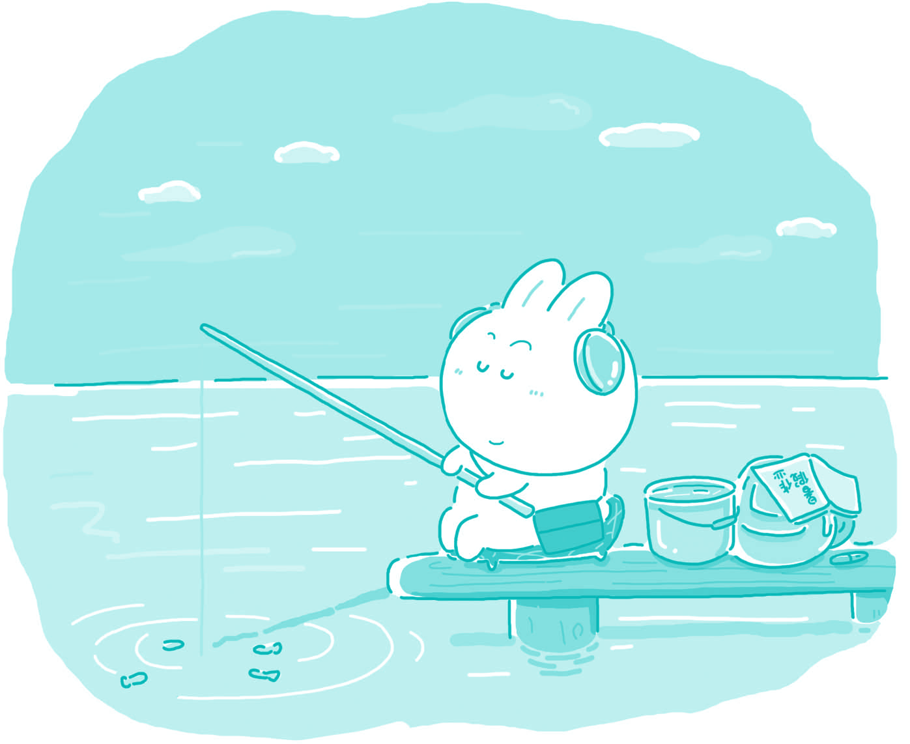

> ###  译文

> **143. 应该给学生一个长假还是几个短假？**

> 上学有时候可以是一种非常令人疲惫、枯燥乏味的经历。如果一个学生在集中的学习时段之间获得定期的休息，他将会更加放松，更加愿意在回到学校时学习新的内容。除此以外，环境的改变，哪怕只有一个星期，也会给一个人提供在学习之余的放松机会。许多学生发现，即便是一个短暂的休息也让他们足以恢复精神继续学习。

> 全年中有许多休息还有助于一个人的社交生活。如果人们在一年中有机会定期和朋友和家人团聚的话，那将永远不会感觉自己好象在失去与至亲好友们的接触。与朋友和家人来往也是很好的放松手段。如果学生经常有这种机会，他们将更加放松，更好地为下个学期的学习做好准备。

> 而且，如果学年被分成许多个短的学期，学校就能够把更多的注意力分散在各个科目的课程里面。许多学生发现，在一个很长的学期结束之际，他们已经忘记了自己在学期初所学到的东西。有了短暂集中的学期，学生们将会迅速地学习少量的知识，因而能够在将来很长一段时间内将其牢记在脑海中。

> 所以，我认为在全年中设置许多短暂的假期是非常可取的。学生们将发现，他们更加放松，而且全年都能够更好地集中精力在学习上。 

###  Word List

 * vacation ［veˈkeiʃən］ n. 假期
 * tiring ［ˈtaiəiŋ］ adj. 令人疲惫的
 * tedious ［ˈti:diəs］ adj. 枯燥乏味的
 * intensive ［inˈtensiv］ adj. 集中的
 * refresh ［riˈfreʃ］ v. 使恢复精神
 * on a regular basis 定期
 * socialize ［ˈsəuʃəˌlaiz］ v. 交往
 * break down into 把…分解成
 * preferable ［ˈprefərəbəl］ adj. 可取的

## 144. Live in a traditional house or in a modern apartment building?

Choosing a home is a very personal decision to make. Some people prefer to live in traditional houses, while others would rather live in modern apartment buildings. Personally, I would prefer to live in a modern building over a traditional house. Modern buildings provide better services, they are stronger and safer, and they are more conveniently located.

When people move into a modern apartment building, they are immediately surrounded by all of the comforts they could possibly want. Modern buildings typically have new plumbing and hardware. Because of this there are usually very few problems with new apartment buildings. In addition to this, they also come supplied with refrigerators, washing machines, air conditioning, and the Internet. Many new buildings have the added bonus of having a workout facility or a swimming pool. All of these advantages make an apartment a much more attractive option than a traditional house.

Modern buildings are also stronger and safer than traditional houses. They are made completely of concrete, which is a very durable material. These buildings are always designed by important architects who have a detailed knowledge of building materials, and methods that ensure that natural disasters will not affect the stability of the complex. In addition to this, all modern buildings have to be inspected by engineers, who carefully evaluate the structure to ensure that it is sound and can withstand natural or unnatural disasters. Many older structures were built using the experience of the builder rather than any empirical understanding of building materials and the forces they can withstand.

Traditional houses are also usually built in quiet areas outside the city. Most modern apartment buildings are constructed in the core of the city, offering the residents a wide range of services right outside their door. Detailed analyses are made by civic engineers and city planners to ensure that all necessary services are readily available. This includes transportation, shopping, employment and recreational facilities. Living too far outside the city can be a hindrance to one's business and social life.

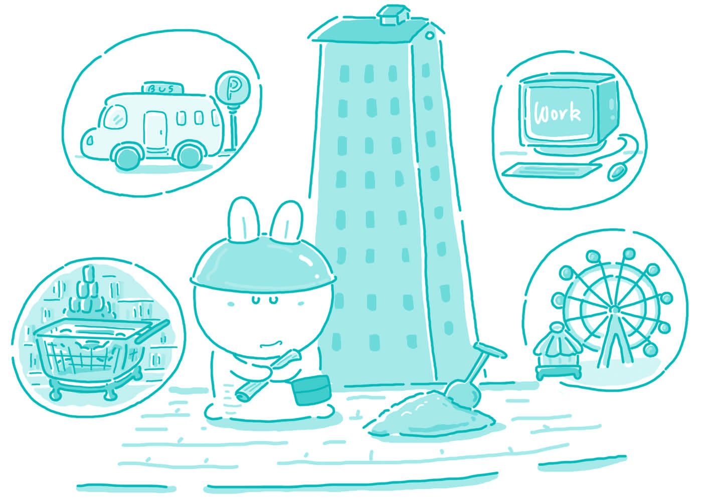

> ###  译文

> **144. 住传统房屋还是现代公寓？**

> 选择住房是一个个人决定。有些人更愿意住在传统的房屋里，而有些人则愿意居住在现代化的公寓大楼里。就我而言，我更愿意住在一座现代化的建筑物里，而不是传统的房屋里。现代化的建筑提供更完善的服务，它们更坚固、更安全，而且它们的位置更加优越。

> 当人们搬进一处现代化的公寓大楼时，他们就会处于可能需要的各种舒适的条件之中。现代化建筑往往拥有新型管道装置和硬件设施，因此，新建的公寓建筑通常问题很少。除此以外，公寓还配有冰箱、洗衣机、空调和互联网。另外许多新建筑还拥有户外运动设备或者游泳池。所有这些优势都使得公寓成为比传统房屋更具吸引力的选择。

> 现代建筑还比传统房屋更加坚固和安全。它们完全是用混凝土制成的，这是一种非常耐用的材料。这些建筑物往往是由重要的设计师设计的，他们对建筑材料和确保建筑整体的稳定性不受自然灾害影响的方法都有详尽的了解。此外，所有的现代化大楼必须经过工程师的审查，他们对建筑仔细做出评估，以确保建筑坚固，能够抵御自然或非自然的灾害。许多老式的建筑物是凭借建筑者的经验建造而成的，而没有利用对建筑材料及其所承受能力的任何实用知识。

> 传统房屋还通常建在城外安静的区域。大多数现代公寓建筑都建造在城市的中心地带，因此可以给住户提供近在咫尺的各种各样的服务。市政工程师和城市规划者都做了详细的分析，以确保所有必需的服务设施都可以轻松获得。这包括交通、购物、就业和娱乐设施。住在城外太远的地方可能成为一个人事业和社交生活的一个障碍。

###  Word List

 * conveniently ［kənˈvi:njəntli］ adv. 方便地
 * withstand ［wiðˈstænd］ v. 抵御，承受
 * plumbing ［ˈplʌmiŋ］ n. 管道装置
 * empirical ［emˈpirikəl］ adj. 根据经验的，实用的
 * hardware ［ˈha:dwεə］ n. 硬件设施
 * stability ［stəˈbiliti］ n. 稳定性
 * core ［kɔ:］ n. 中心
 * complex ［kɔmˈpleks］ n. 综合性建筑
 * readily ［ˈredəli］ adv. 容易地
 * evaluate ［iˈvæljuˌeit］ v. 评估
 * hindrance ［ˈhindrəns］ n. 障碍

## 145. Do advertisements promote things we do not need or products that may improve our lives?

Over the last twenty years the amount of adverting we are subjected to in our daily lives has increased dramatically. It has got to the point where one can hardly turn his/her head without seeing a wide array of media images. I tend to agree the fact that advertisements more often than not persuade us into buying things that we do not need.

Often it is difficult to discern what a product is from an advertisement. Advertisers prey on our basal emotions, conjuring strong relationships between our primary drives and their product names or logos. A prime example of this is perfume ads. In many of these types of advertisements there are women in compromising positions, but there is no mention of the actual product for sale. These ads draw us in and make us think that we can be better and more beautiful if we have the product.

In addition to being manipulative, advertisements also fill our environments and our consciousness. There is no taboo venue for advertisements; they fill our televisions, radios, streets and elevators. Some advertisers have even taken to placing images of their products in our urinals or on boxers' bodies. It is impossible to get away from them. To illustrate this point, all one has to do is to pick up a popular magazine. While flipping through the pages, one will most likely find that for every page of content there are at least two pages of advertisements. It should also be noted that a significant portion of this so called "content" is actually advertising in disguise.

Finally, advertisements feed on our insecurities and often successfully convince us that we have no value to society without their products. Advertising was originally designed to showcase products and inform us as to how they can improve our lives. This harmless form has been replaced by a medium that viciously attacks our self-confidence and self-esteem.

In conclusion, I posit that the main goal of advertisements is to convince us to buy things that we do not need. As globalization continues to shrink the world, advertising coerces all countries to become consumer nations.

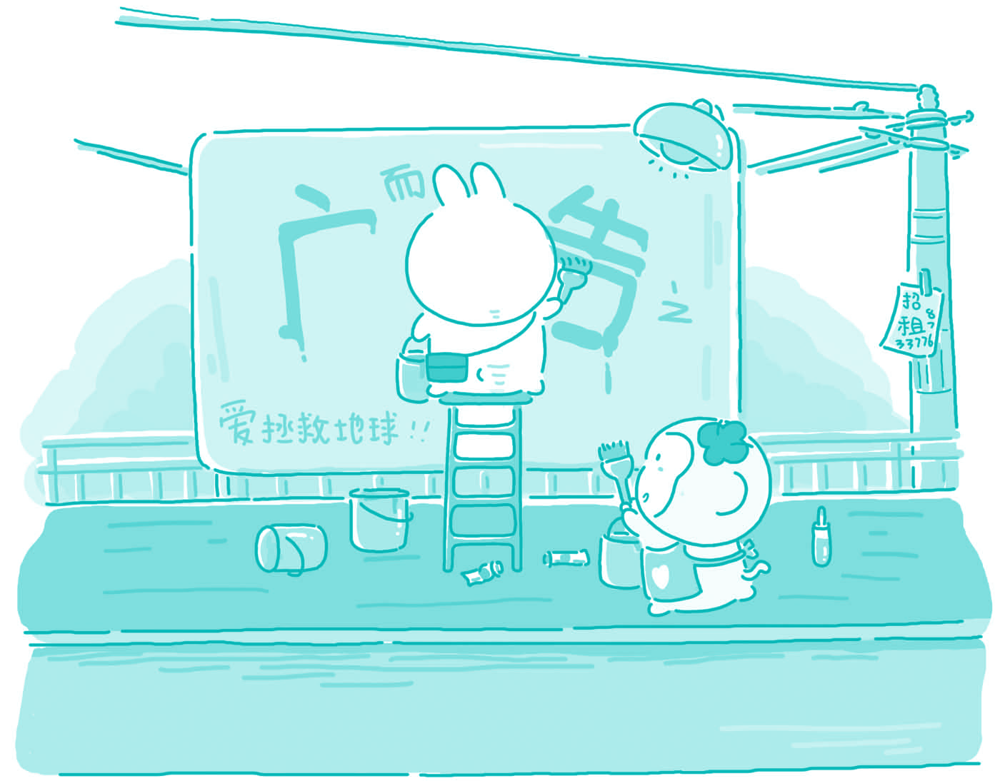

> ###  译文

> **145. 广告是宣传无用之物还是宣传改善生活之物？**

> 在过去的20年里，我们在日常生活中所触及的广告数量急剧增长，发展到一个人很难在四周看不到媒体存在的地步。我赞同的观点是广告商更多地是促使我们买一些我们不需要的东西。

> 经常很难从广告里判断这个产品是什么，广告商侵蚀我们的基本情感，在我们的原始动机和他们的产品名和商标之间构筑很强的联系。一个最具代表性的例子是香水广告，在很多类型的广告中美女置身暖昧的场景，但是却没有涉及商品本身。这些广告吸引我们并且使我们相信如果拥有这个产品会变得更好，更漂亮。 

> 广告除了具有控制力之外，还充斥着我们周围的环境和我们的思想，广告还没有任何禁忌的地方。他们充满了我们的电视、广播、街道和电梯。一些广告商甚至已经把他们的产品标记印在我们的便池和拳击手的身上。我们已经不可能把这些现象清除，随便拿起一本流行杂志，就能说明这一点。人们翻弄书页时，基本上能发现每看到一页内容就最少能看到两页广告，并且往往所谓的内容中的一个重要部分实际上就是伪装的广告。

> 最后，广告利用我们的不安全感经常成功地使我们相信：没有他们的产品我们难以立足于这个社会。广告最初用于宣传产品并告诉人们这些产品怎样改善我们的生活，这种无害的方式已经被恶意攻击我们自信和自尊的媒体所取代了。

> 总而言之，我认为广告的主要目的是说服我们买一些并不需要的东西。全球化继续令世界缩小，广告也强行把所有的国家变成了消费团体。 

###  Word List

 * discern ［diˈsə:n］ v. 洞悉，辨别
 * illustrate ［ˈiləˌstreit］ v. 举例说明，阐明
 * prey on 捕食，掠夺
 * disguise ［disˈgaiz］ n. 伪装
 * manipulative ［məˈnipjələtiv］ adj. 操纵的，控制的
 * vicious ［ˈviʃəs］ adj. 恶意的
 * esteem ［iˈsti:m］ n. 尊敬，尊重
 * consciousness ［ˈka:nʃəsnis］ n. 意识
 * coerce ［kəuˈə:s］ v. 强制，强迫
 * taboo ［təˈbu:］ adj. 禁忌的，忌讳的

## 146. Leisure activities: outdoors or indoors?

When one lives in a seasonal environment it is difficult to deny that both outdoor and indoor activities have their place. As the seasons change, so does one's mood. Certain activities become more or less appealing, depending on the weather and the length of the day.

Spring is a time of the year when the world starts to awaken from its winter slumber. The trees and flowers bloom, birds return from their migrations and there is a general sense of gaiety in the air. During this season, I enjoy going on long walks through parks and watching the world come alive.

Many consider summer to be the apex of the year. The city comes into full swing as the weather becomes warmer and warmer. During the summer, I prefer to spend the daytime anywhere that is air-conditioned. This can include the library, a shopping center or a movie theater. I often enjoy spending the warm evenings sitting on the wide balcony of my house and having drinks with my friends.

Fall, with the turning of the leaves and the intense heat of the summer dissipating, is another excellent time to go on long walks during the day. I love to be outside during fall and see the life of the city returning to its hibernation. Another reason to go outside during autumn is to savor the last days of warmth until the next year.

Winter brings the shortening of days and cooler weather. Outdoor activities tend to become less attractive and curling up on the couch with a good book becomes my favorite activity. It is not enjoyable to spend time outside if it is too cold. The only exception to this is the rare time I go skiing.

So, my decision to spend time indoors or outdoors is vastly dependent on the season. Different seasons call for different activities and therefore it is impossible to choose whether I would spend all of my leisure time indoors or outdoors.

> ###  译文

> **146. 喜欢户外还是室内的休闲活动？**

> 当一个人居住在季节分明的环境中时，很难否认户外和室内运动都是可行的。随着季节的变换，人的心情也会改变。根据天气和白天的长度，特定的活动会变得有更多或者更少的吸引力。

> 春天是一年里整个世界都开始从冬眠中苏醒过来的时候。树木发芽，鲜花盛开，候鸟从南方归来，空气中弥漫着欢乐的气氛。在这个季节里，我喜欢在公园里长时间散步，欣赏这万物复苏的世界。

> 很多人认为夏天是一年中的顶点。随着天气越来越热，整个城市逐渐进入了兴旺时期。在夏季，白天我喜欢呆在任何有空调的地方，包括图书馆、购物中心和电影院。在温暖的夜晚，我经常和朋友们坐在家里宽阔的阳台上喝酒。

> 秋季，随着树叶颜色的改变和夏季酷热的逐渐消散，成为了另一个在白天长时间散步的最佳时间。秋季我喜欢呆在户外，看着城市的生命力渐渐进入冬眠。另一个在秋季到室外的原因，是尽情享受来年之前最后的温暖时光。

> 冬季的白天更短，天气更冷。户外活动变得不再那么有吸引力，拿着一本好书蜷缩在睡椅上成了我最喜欢的活动。如果天气太冷，呆在户外就不是那么令人愉快了。惟一的例外是我偶尔出去滑雪。

> 所以，我呆在室内或者室外相当程度上是随着季节而定的。不同的季节需要不同的活动，因此让我选择在室内或是室外度过全部空闲时间是不可能的。

###  Word List

 * deny ［diˈnai］ v. 否认
 * dissipate ［ˈdisəˌpeit］ v. 消散
 * slumber ［ˈslʌmbə］ n. 睡眠
 * hibernation ［ˌhaibəˈneiʃən］ n. 冬眠
 * migration ［maiˈgreiʃən］ n. 迁徙
 * savor ［ˈseivə］ v. 尽情享受
 * gaiety ［ˈgeiti］ n. 欢乐的气氛
 * curl ［kə:l］ v. 蜷缩
 * apex ［ˈeipeks］ n. 顶点；高潮
 * exception ［ikˈsepʃən］ n. 例外
 * full swing 全力进行中；达到活动的高潮
 * skiing ［ˈʃi:iŋ］ n. 滑雪
 * balcony ［ˈbælkəni］ n. 阳台

## 147. The best way the school spends a gift of money

It is a very fortunate occurrence when a school receives a sizable grant.

School officials must make the difficult decision of where to allocate the funds, and I want to propose that spending the money on computers would be the most utilitarian decision.

Computers are rapidly growing in popularity, to such an extent that they affect all aspects of modern life. It is rare that one finds stimulating employment that does not require at least basic computer skills. If children are to become successful in today's society, they must have understanding in this field. As computers are the future, it is important for students to become adept users early in life.

Not all children have equal opportunities to learn the important skills of using a computer. Many low-income families cannot afford to purchase such an expensive item, thus continuing a cycle of social immobility. Purchasing computers for public schools gives children from low-income families the opportunity to break out of this cycle. Finally computers allow students to access a wealth of information that could not possibly be stored in a library, or efficiently be kept up to date. One of the most common activities on a computer is"surfing" the Internet. The Internet is updated by literally billions of people every day, and therefore offers up any information that one could dream of. The Internet is also an excellent source of inspiration, as so many people that update it have incredible ideas.

In conclusion, I think that spending the grant money to buy new computers would be most beneficial for the entire school. With the addition of new computers, students will be able to get an edge on their peers at different schools, and be ready for university and the workforce. This is especially true for lowincome students. Computers allow students to expand their minds and think in a new, exciting way.

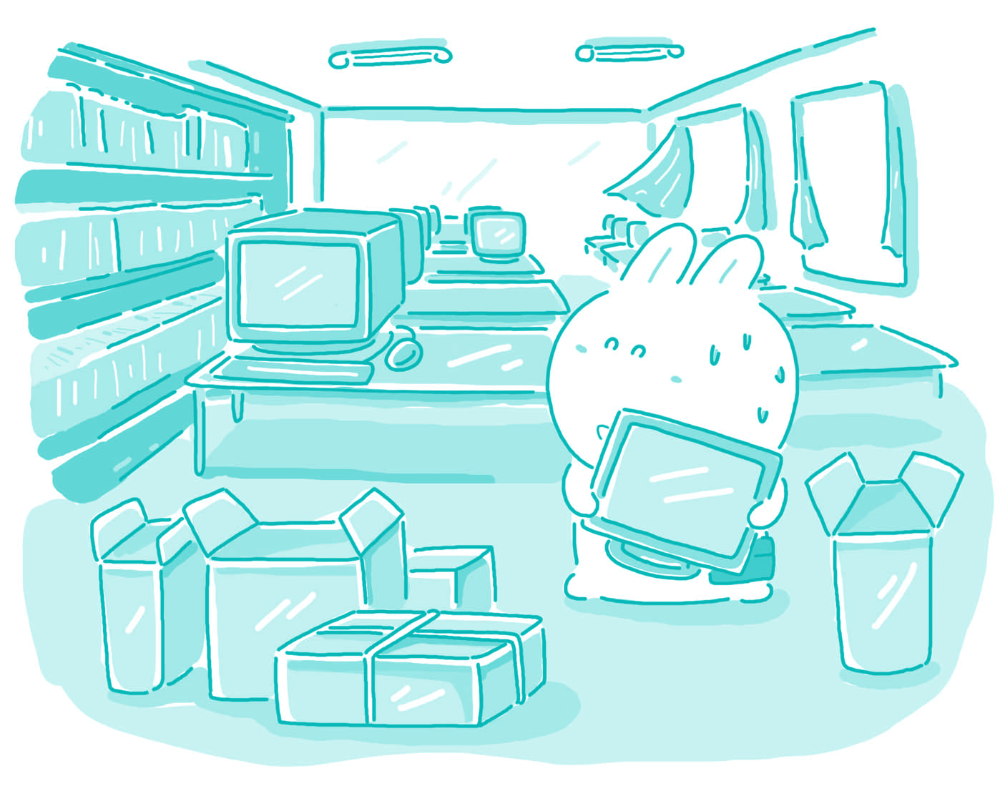

> ###  译文

> **147. 学校利用捐款的最佳方式**

> 学校收到一大笔捐款是一件非常幸运的事情。校方也要做出如何支配这笔资金这一困难决定，而我认为用这笔钱购买电脑将会是最实际的选择。

> 电脑正在迅速普及，已经到了能够影响现代生活各个方面的程度。一个人很难找到不要求最基本电脑技术的好工作。如果孩子们要在今天的社会中取得成功，他们必须对这一领域有所了解。因为电脑就是未来，学生们能够尽早熟练掌握电脑非常重要。

> 并不是所有的孩子都能有平等的机会去学习使用电脑这门重要的技术，很多低收入家庭负担不起购买这样一件昂贵的物品，这就造成了社会阶层难以变化的循环。为公立学校添置电脑给来自低收入家庭的孩子们一个打破这种循环的机会。

> 最后，电脑能使学生们接触到不可能存储在图书馆里的，而且是能够有效更新的丰富的信息。在电脑上进行的最普通的一项活动就是“网上冲浪”。因特网每天被数十亿的人更新，因此能提供一个人想得到的任何信息。因特网也是一个产生灵感的极好来源，这是由于很多更新它的人有着奇妙的想法。

> 总之，我认为用捐款购买新的电脑对整个学校是最有利的。有了新增的电脑，学生们会拥有比其他学校的同龄人更大的优势，并为考大学和找工作做好准备。对于家庭收入低的学生们来说更是如此。电脑能开阔学生们的眼界，并让他们用一种全新的、令人兴奋的方式思考。

###  Word List

 * occurrence ［əˈkə:rəns］ n. 事件
 * employment ［emˈplɔimənt］ n. 工作；职业
 * sizable ［ˈsaizəbəl］ adj. 相当大的
 * grant ［grænt］ n. 赠款
 * adept ［əˈdept］ adj. 熟练的
 * allocate ［ˈæləˌkeit］ v. 分配
 * immobility ［iˌməuˈbiləti］ n. 牢固
 * propose ［prəˈpəuz］ v. 建议；向…提议
 * access ［ˈækses］ v. 获得
 * utilitarian ［ˌju:tiliˈtεəriən］ adj. 实际的
 * up to date 最新的
 * aspect ［ˈæspekt］ n. 方面
 * inspiration ［ˌinspəˈreiʃən］ n. 灵感
 * stimulating ［ˌstimjuˈleitiŋ］adj. 有刺激性的
 * get an edge on ［俚］ 胜过某人
 * peer ［piə］ n. 同等的人

## 148. Does playing games teach us about life?

Across the world many cultures have their own favored games. While most of these cultures created the games themselves, many of these games have similar attributes. One reason for this is that people everywhere find games entertaining. More importantly, however, games teach us about life, socialization, and how to work as a team, and how to win and lose gracefully.

One of the most important developments one can make in his personality is the ability to socialize well with others. Having a charismatic personality will take a person far in any field. Almost all games have socialization aspect deeply ingrained in them. Football and basketball both encourage a person to treat others with respect. This is known as having good sportsmanship. Of course respecting others is a social skill that we all must learn if we are to succeed in life.

Many popular sports involve a group of people, ranging from two people to twenty people working together as a team. In these situations it is always of utmost importance to be a team player. Of course in the business world being a "team player" has become a buzzword in most offices. Being a team player means that one should work well with others in the face of adversity. Team sports are full of challenges and obstacles that a team must overcome together.

Finally most sports teach a person the value of winning and loosing gracefully. In sports etiquette it would be incredibly uncouth to start crying or throw a tantrum if one were to lose a game. Likewise if one wins a game and gloats excessively in the face of their adversary, it is equally looked down upon. The same goes in "real life." One must learn the subtleties of defeat and victory and learn to minimize their outward emotions.

In conclusion, I posit that games have much to teach us about life. To sum up they teach us how to work well with others. On a lighter note they also teach us how to have fun, which is an important life lesson in and of itself.

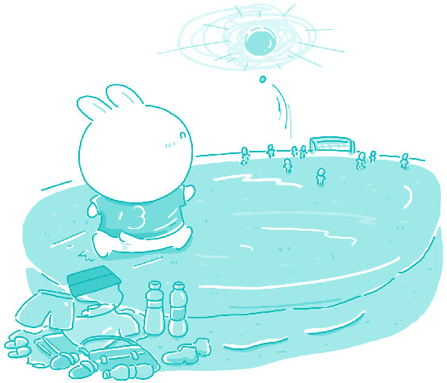

> ###  译文

> **148. 体育运动教会我们如何生活吗？**

> 世界上的很多种文化都有它们自己喜爱的体育运动。虽然绝大多数文化都是自己创造体育运动，但很多体育运动又有着相似的特征。产生这种现象的一个原因就是世界各地的人都觉得体育运动很有趣。然而更重要的是，体育运动教会我们生活、社交、如何作为一个团队工作、如何优雅地面对胜利和失败。

> 能够和别人很好地相处的能力，是一个人个性最重要的发展。拥有超凡魅力的个性会让一个人在任何领域取得长远的发展。几乎所有的体育运动中都深深嵌入了社会化的方面，足球和篮球都鼓励尊重他人，这被称作有良好的运动家精神。当然，如果我们想在生活中成功，尊重他人是必须学习的一项社会技能。

> 很多受人欢迎的体育运动都要求一群人参加，从两人到二十人不等，组成一队共同作战。在这种情况下成为一个团队合作者就极其重要。当然，在商业领域中，成为一个“团队合作者”也已经成为绝大多数办公室里的时髦口号。成为一个团队合作者，意味着在面对困难时应该很好地与别人合作。团队体育运动项目中充满了各种挑战和困难，一个团队必须共同克服。

> 最后，绝大多数体育运动都在教人优雅地面对胜利和失败。在体育礼节中，失败之后哭泣或者发脾气都是极其粗俗的。同样，赢得比赛之后在对手面前过分得意，也是会被人瞧不起的。在“现实生活”中也是如此，人们必须学习失败和成功的微妙之处，并学习尽可能减少外露的情绪。

> 总之，我认为体育运动教会了我们如何生活，如何跟别人合作。从比较轻松的方面来看，体育运动也教会我们如何寻找乐趣，这本身也是生活中重要的一课。

###  Word List

 * attribute ［əˈtribju:t］ n. 特征
 * adversity ［ædˈvə:siti］ n. 逆境
 * entertaining ［ˌentəˈteiniŋ］ adj. 有趣的
 * obstacle ［ˈa:bstəkəl］ n. 障碍
 * socialization ［ˌsəuʃəliˈzeiʃən］ n. 社会化
 * etiquette ［ˈetiˌket］ n. 礼节
 * charismatic ［ˌkærizˈmætik］adj. 有超凡魅力的
 * uncouth ［ʌnˈku:θ］ adj. 粗俗的
 * tantrum ［ˈtæntrəm］ n. 发怒
 * ingrained ［inˈgreind］ adj. 根深蒂固的
 * gloat ［gləut］ v. 心满意足
 * sportsmanship ［ˈspɔ:tsmənˌʃip］ n. 运动家精神
 * in the face of 当面
 * adversary ［ˈædvəˌseri］ n. 对手
 * utmost ［ˈʌtˌməust］ adj. 极度的
 * subtlety ［ˈsʌtlti］ n. 微妙
 * buzzword ［ˈbʌzˌwə:d］ n. 时髦词语；漂亮口号
 * posit ［ˈpa:zit］ v. 断定
 * to sum up 总之 

## 149. How would you use some land given to you?

Living in a bustling city is very convenient at times. However, there is usually one thing lacking from these urban landscapes: trees, flowers, and greenery in general. If I received a portion of land in the city, I would transform it into a park. There are many reasons for doing this, as detailed below.

Firstly, a park would offer a much-needed relaxing place, which is usually few and far between in cities. Many people commute to the city for work, and find that the stress of their jobs, combined with the intensity of urban life, is very tiring. If one could walk through a park on one's lunch break, she/he would go back to work feeling refreshed and rejuvenated. A park can also contain many plant species that are not prevalent in the surrounding environment. The calm, The second reason why I would build a park is for environmental reasons. Trees' main function in the ecological cycle is to convert carbon dioxide into oxygen during a process known as photosynthesis. Almost all major cities have a problem with pollution, and every tree helps. In addition to cleaning the air, parks offer a habitat for many species of animals that would regularly not survive in an urban environment. Offering animals a place to live is a very noble thing to do.

Lastly, I believe that building a park would be making the best use of my property because it would create a community focal point. People from all over my neighborhood could wander through the beautiful landscape, conversing with each other and getting to know one another better. In my park I would also include benches and tables where people could have barbeques and picnics, or play social games such as chess or mahjong. I would also be inclined to include badminton nets, table tennis facilities and a football field for the more athletically inclined.

Thus, I believe that the most appropriate use of a piece of land in an urban environment would be to develop it into a green space. By doing this, one creates a location where community, serenity, and the interests of the environment are all taken care of.

> ###  译文

> **149. 你将如何使用给你的土地？**

> 住在熙熙攘攘的城市里面有时非常方便。然而，城市中的风景通常都会缺乏这些：树木、花朵以及绿色植物。如果我得到了城市中的一块土地，我会把它建成一座公园。我这样做有很多原因，详述如下。

> 首先，公园能够提供一个城市必需的休息场所，这种场所通常非常稀少并远在两座城市之间。很多人每天乘火车来到城市里上班，发现工作压力以及高强度的城市生活让他们非常疲倦。如果能在午餐休息的时候在公园里走一走，在他回去工作的时候就会觉得精神振作、恢复了活力。公园中还可以种植很多周围环境中不常见的植物品种。公园中安静和未受到污染的空气让那里成为这些植物生长的绝佳场所。

> 我想建造公园的第二个原因是为了环境。树木在生态环境中的主要功能是把二氧化碳转化为氧气，这个过程被称为光合作用。几乎所有的大城市都存在污染问题，而每一棵树都能减轻污染。除了净化空气，公园还为很多通常在城市环境中不能生存的动物提供了栖息地。给这些动物提供栖息地是一件非常高尚的事。

> 最后，我相信建造一座公园将会最好地利用这块土地，是因为它将成为一个社区的焦点。我们整个社区的人们都能够在优美的景色中漫步，彼此相识并且更好地相互了解。在我的公园中还会安放供人们进行烧烤和野餐的长椅和桌子，人们也可以用它们玩国际象棋或者麻将。我还想修建诸如羽毛球网、乒乓球台等设施，以及一个更具有运动性的足球场。

> 因此，我相信在城市环境中使用一块土地最适当的方法就是把它建成一块绿色空间。这样，我们就能建造一个兼顾到社会、宁静以及环境利益的场所。

###  Word List

 *  bustling ［ˈbʌsəliŋ］ adj. 熙熙攘攘的
 * species ［ˈspi:ʃiz］ n. 种类
 * at times 有时
 * prevalent ［ˈprevələnt］ adj. 普遍的
 * urban ［ˈə:bən］ adj. 城市的
 * atmosphere ［ˈætməˌsfiə］ n. 空气
 * landscape ［ˈlændskeip］ n. 风景
 * flora ［ˈflɔ:rə］ n. 植物
 * greenery ［ˈgri:nəri］ n. 草木
 * ecological cycle 生态环境
 * a portion of 一块；一部分
 * photosynthesis ［ˌfəutəuˈsinθisis］n. 光合作用
 * commute ［kəˈmju:t］v. 每天
 * （乘火车）
 * 往返上班；focal point 焦点定期往返于两地间
 * barbeque ［ˈba:bikju:］ n. 烧烤；烤肉野餐
 * intensity ［inˈtensiti］ n. 强度
 * serenity ［siˈreniti］ n. 平静
 * rejuvenate ［riˈdʒu:vəˌneit］ v. 使恢复活力

## 150. Is watching television bad for children?

There is much conjecture over whether television is a positive or negative influence on a young child's development. There is a good case to be made for either of these opinions; I believe that both could be true depending on the programming the children are absorbing.

Nature programs, documentaries and educational programming can expose children to a wide variety of useful information. When children watch these types of programs, they are more likely to become concerned about the world around them, whether in terms of environmental issues, political issues, or cultural issues. Watching educational television is an excellent method of helping young people discover where their interests lie. For example, if a child sees a documentary on space exploration, they might develop a passion for it and continue studying it later in life. A show that a person watched when they were a child could possibly have been a catalyst for choosing a career.

On the other hand, most cartoons, soap operas, or violent crime television shows are detrimental to a child's development. Cartoons offer no useful information to a young person, and usually do not succeed in getting the child interested in anything except fantasy. Adult television, such as soap operas, can introduce children to subject matter that is not appropriate for their innocent minds, and can often cause children to grow up too fast. Violent television is perhaps most damaging for a young child to watch. It has been proven that if children watch violence on television when they are young, they become desensitized to it, and sometimes end up becoming violent adults.

In conclusion, I believe that the argument over whether watching TV is bad for children should definitely be swayed by what the children are viewing.

Educational television can be very beneficial to a young person. When this medium is used in such a way, new thoughts and ideas can be opened up to the young person. However, watching the wrong television shows can be very dangerous. Children can desensitize themselves to the world around them, and become antisocial, violent adults. I think the best situation is to ensure that parents monitor their children's television shows very carefully. By using this method, children will receive all of the benefits of good television, while avoiding all of its negative aspects.

> ###  译文

> **150. 看电视对儿童有害吗？**

> 关于电视对儿童的成长有好的影响还是不良影响有很多推测。双方的观点都有很恰当的例子。我认为根据儿童收看的不同节目，两种推测都有可能成为现实。

> 自然节目、记录片和教育类节目能给儿童带来大量有用的信息。当儿童观看这些类型的电视节目时，他们很有可能变得更加关注他们周围的世界，无论是关于环境问题、政治问题还是文化问题。观看教育类电视节目是帮助年轻人发现他们兴趣所在的极佳方法。例如，如果儿童观看了一部关于太空探索的记录片，他们可能会对此产生热情，并在以后的生活中不断地对这方面进行学习。一个人在童年时看过的一场表演可能会成为他或她选择某种职业的催化剂。

> 另一方面，绝大多数动画片、肥皂剧或者表现暴力犯罪的电视节目对儿童的发展是有害的。动画片给年轻人提供无用的信息，而且通常除了让儿童对幻想很感兴趣之外没有任何益处。成人类电视节目，例如肥皂剧，会向儿童介绍一些不适宜他们纯真心灵的内容，而且经常会导致儿童过早地成熟。暴力节目可能会是对幼小的儿童最具有破坏性的电视节目。事实证明如果儿童在小时候观看电视上的暴力节目，他们就会变得对此不敏感，而且有些人长大后会成为有暴力倾向的成年人。

> 因此，我认为关于看电视是否对儿童有不良影响的争论，应该由儿童观看什么样的电视节目决定。教育类电视节目对年轻人非常有益。当电视这种媒体被这样使用时，能把新的想法和观点展示给年轻人。然而，观看有害的电视节目是会非常危险的。儿童会对他们周围的世界变得不敏感，并且成为反社会的有暴力倾向的成年人。我认为最好的情况就是确保父母能够非常认真地监控他们孩子所观看的电视节目。靠这种方式，儿童将通过好的电视节目获益，同时避免各种不良影响。

###  Word List

 * conjecture ［kənˈdʒektʃə］ n. 推测
 * catalyst ［ˈkætlist］ n. 催化剂
 * positive ［ˈpa:zitiv］ adj. 积极的
 * soap opera 肥皂剧
 * negative ［ˈnegətiv］ adj. 消极的
 * detrimental ［ˌdetrəˈmentl］ adj. 有害的
 * absorb ［əbˈsɔ:b］ v. 吸收
 * fantasy ［ˈfæntəsi］ n. 幻想
 * documentary ［ˌda:kjəˈmentəri］ n. 记录片
 * innocent ［ˈinəsənt］ adj. 纯真的
 * issue ［ˈisu:］ n. 问题
 * desensitize ［ˌdi:ˈsensitaiz］ v. 使不敏感
 * method ［ˈmeθəd］ n. 方式
 * medium ［ˈmi:diəm］ n. 媒体
 * exploration ［ˌekspləˈreiʃən］ n. 探险
 * antisocial ［ˌæntiˈsəuʃəl］ adj. 反社会的
 * passion ［ˈpæʃən］ n. 激情

## 151. What is the most important animal in your country?

Animals have the power to be iconic symbols for a country. Every country has its own symbolic animal, which is supposed to represent the values and ethics of that country. For example, Americans have enlisted the eagle as their national animal. The Germans represent themselves with the Black Bear. In China, however, our national animal is the Panda.

The Panda is a great source of pride in China. It is an animal that is on the verge of extinction; however, it has had a long and great history. Scientists have traced this curious creature's roots back to the time of the dinosaurs, hundreds of thousands of years ago. Because of this long history, the Panda has lovingly been termed the "living fossil." Today, scientists can study the panda and discover many interesting facts about the history of our planet and its habitats.

Another reason why the Panda is the animal ambassador for China is that it represents peace and friendship. In ancient times, a flag with a panda on it would be raised at the border between two countries to represent peace, love, unity and respect between the two neighbors. In modern society, China often offers a panda to a friendly country as a sign of kinship. For example, China has presented both the United States and Japan with pandas.

Finally, the history of pandas is profoundly intertwined with the history of China. In ancient times, emperors used to keep pandas as pets. These animals were seen as magical and mystical by all who knew them. Some emperors kept pandas to ward off evil spirits and also believed that they prevented natural disasters.

Thus, the giant, black and white panda is the national symbol of China. These graceful animals are a joy to all who see them, and are a source of pride for the Chinese. The government is so concerned about keeping these animals in existence that it is spending millions of dollars trying to determine how to artificially inseminate the giant panda. Hopefully, they will succeed and this animal will be on earth for another million years.

> ###  译文

> **151. 贵国最重要的动物是什么？**

> 动物有权成为一个国家的图标象征。每个国家都有自己的象征动物，它代表着该国的价值和道德规范。例如，美国人把鹰作为他们国家的标志，德国人用黑熊来代表自己，而我们国家的象征动物是熊猫。

> 在中国，熊猫能给人带来极大的自豪。这是一种濒临灭绝的动物，然而它有着悠久而辉煌的历史。科学家已经把这种稀有动物的根源追溯到了数十万年前的恐龙时代。因为有着如此悠久的历史，熊猫的爱称是“活化石”。今天，科学家通过研究熊猫，发现了关于我们这颗星球的历史及其栖息者的很多有趣情况。

> 另一个为什么把熊猫作为中国动物大使的原因，是它代表着和平与友谊。在古代，两个国家的边境会升起一面画有熊猫的旗帜，代表着两国之间的和平、友爱、团结以及对彼此的尊重。在现代社会，中国经常把熊猫送给友好国家，作为亲密关系的标志。例如，中国就曾把熊猫赠给美国和日本。

> 最后，熊猫的历史和中国的历史紧紧缠绕在一起。在古代，皇帝曾经把熊猫作为宠物来饲养。所有见过它们的人都会觉得它们是不可思议的神秘动物。有些皇帝饲养熊猫来避邪，而且还相信它们能防止自然灾害。

> 因此，我国把黑白相间的大熊猫作为中国的标志。这些优雅的动物能给所有见到它们的人们带来欢乐，它们也是中国的骄傲。政府非常重视保护这种动物的生存，花费了数百万美元进行大熊猫人工受精的研究。希望这些研究能够成功，也希望这种动物能够在地球上继续生存一百万年。

###  Word List

 * iconic ［aiˈka:nik］ adj. 图标的
 * ambassador ［æmˈbæsədə］ n. 大使
 * symbol ［ˈsimbəl］ n. 象征
 * kinship ［ˈkinˌʃip］ n. 亲密关系
 * ethics ［ˈeθiks］ n. 道德规范
 * intertwine ［ˌintəˈtwain］ v. （使）缠绕
 * on the verge of 在…的边缘
 * magical ［ˈmædʒikəl］ adj. 不可思议的
 * extinction ［iksˈtiŋkʃən］ n. 灭绝
 * mystical ［ˈmistikəl］ adj. 神秘的
 * trace ［treis］ v. 追溯
 * ward off 挡住；防止
 * fossil ［ˈfa:səl］ n. 化石
 * artificially ［ˌa:təˈfiʃəli］ adv. 人工
 * habitat ［ˈhæbitæt］ n. 栖息地
 * inseminate ［inˈseməˌneit］ v. 向…授精

## 152. What natural resource that is disappearing needs to be saved?

The world's resources are incredibly important, and as the world's population grows higher and faster, it is difficult to hold on to these precious assets. While all resources have their own important uses, I believe that forests are the resource that we should be most concerned about preserving.

Trees provide three important functions in the ecosystem. First, they transpire water into the air, creating clouds, and therefore, rain. Without trees, this cycle is interrupted, and rainfall is drastically reduced to minimal levels. Second, trees hold topsoil in place and soften the impact of water on the ground. This is of utmost importance in rain forests, where decomposition is rapid and because of this, the layer of topsoil might only be five to ten centimeters deep. Finally, trees are important to the ecosystem because they protect streams from debris and silt. If the trees were all removed, there would be nothing holding back this dirt from our rivers, destroying the aquatic environment.

Trees also, of course, provide natural beauty to a country. This is very important for tourism, as many visitors enjoy going on long hikes through wooded areas, and taking in the beautiful scenery. If a country has no natural beauty, there will be little draw for tourists to come and visit. While cities can be exciting, most people are drawn to these natural jewels.

Forested area is also the main habitat for a plethora of animal species. In fact, most of the extinction and endangerment of animals today can be attributed to habitat destruction. If we continue our trend in deforesting the world, we will soon find ourselves living in a barren wasteland, with no wildlife to keep us company. The effects of the extinction of even one species of animal is yet unknown. Breaking the food chain on even one level might have profound ripples through all life on earth.

> ###  译文

> **152. 哪种正在消失的自然资源需要保护?**

> 世界上的各种资源都非常重要，而且随着世界人口的快速增长，要想保存这些珍贵的资源非常困难。虽然所有的资源都有各自不同的重要用途，我认为森林是我们最应该注意保护的资源。

> 树木对生态系统提供了三种重要的功能。首先，它们把水分蒸发到空气中形成了云，因此才会形成降雨。没有树木，这个循环就会被打断，而降水量也会急剧降低到最低水平。其次，树木能够保持地表土并且减轻雨水对土地的撞击。这在热带雨林中是极其重要的，那里的腐烂分解很迅速，因此地表土层可能只有5~10厘米厚。最后，树木对生态系统很重要还因为它们防止了碎石和泥沙对河流的破坏。如果把树木全部移走，那么就没有什么能够防止碎石进入我们的河流，破坏水生环境。

> 当然，树木还能给一个国家提供自然美景。这对旅游业非常重要，因为很多旅行者喜欢在树林中远足并融入优美的景色之中。如果一个国家没有自然美景，那么对旅游者前来游览就没有多少吸引力。尽管城市可能会令人兴奋，但大多数人更会被这些自然美景吸引。

> 森林也是众多动物的主要栖息地。实际上，现在绝大多数动物品种的灭绝和濒临灭绝都是因为栖息地被破坏。如果人类继续砍伐森林，我们很快就会发现自己居住在一片荒芜的废墟上，身边没有任何野生动植物的陪伴。虽然现在还不知道每灭绝一种动物会产生什么样的后果，但是哪怕在一个环节上打破食物链，都有可能对地球上的全部生命产生深远的影响。

###  Word List

 * assets ［ˈæsets］ n. 资源
 * debris ［dəˈbri:］ n. 碎石
 * ecosystem ［ˈekəuˌsistəm］ n. 生态系统
 * silt ［silt］ n. 泥沙
 * transpire ［trænsˈpaiə］ v. 蒸发
 * aquatic ［əˈkwætik］ adj. 水的；水生的
 * interrupted ［ˌintəˈrʌptid］ adj. 被中断的
 * hike ［haik］ n. 远足
 * drastically ［ˈdræstikəli］ adv. 激烈的
 * plethora ［ˈpleθərə］ n. 过多；过剩
 * topsoil ［ˈta:pˌsɔil］ n. 地表土
 * attribute ［əˈtribju:t］ v. 归因于
 * decomposition ［di:ˌka:mpəˈziʃən］ n. 分解；腐烂
 * barren ［ˈbærən］ adj. 荒芜的
 * ripple ［ˈripəl］ n. 波动；起伏

## 153. Does a zoo have no useful purpose?

Perhaps one of the most blameworthy factors that make some people raise the eyebrow to zoos and criticize that "A zoo has no useful purpose" is its exorbitant price to maintain. However, it is too hasty to say so, since most zoos have their significance, both educational and scientific.

Modern zoos act as centers of education and are designed to make learning about animals an interesting and enjoyable experience. They provide visitors with the chance to see rare creatures, such as tigers, zebras, penguins, and giant pandas, which come from many different parts of the globe. Zoos also introduce people to their own local wildlife, offering a valuable learning experience in an increasingly urban world. At the same time, most zoos provide educational programs aimed at a wide range of ages. A visit to a zoo provides children an opportunity to see and touch animals other than household pets. For older schoolchildren, many zoos conduct classes or day trips that focus on different aspects of animal biology and the impact of humans on animal life.

Modern zoos also have their scientific imports and can function as a sanctuary for endangered animals and therefore help maintaining ecosystems. In zoos scientists can create an animal population that can become self-sustaining in the wild. An example of a successful reintroduction to the wild is the Père David's deer. This Asian deer was native to marshlands in northeast China before its habitat was destroyed more than 800 years ago and it became extinct in the wild. Since that time the species has been bred in zoos in China and later in Europe. In 1985 four Père David' s deer were released to the wild in a protected animal reserve in China, where they are now breeding successfully.

On the other hand, some experts warn against placing too much reliance on zoos as biological "arks," where species can be protected regardless of environmental changes outside. Critics warn that zoos, like all human institutions, are vulnerable to unforeseen events, such as disease, fires, and financial or social upheaval. More significantly, the number of species that zoos can protect is strictly limited. Today's zoos are home to no more than a few thousand species— only a fraction of the world's animal life. Zoos already have to perform a delicate balancing act between large, crowd-attracting animals and threatened animals that have less visitor appeal. During the 21st century, zoo experts will face even harder decisions about which species they can afford to save.

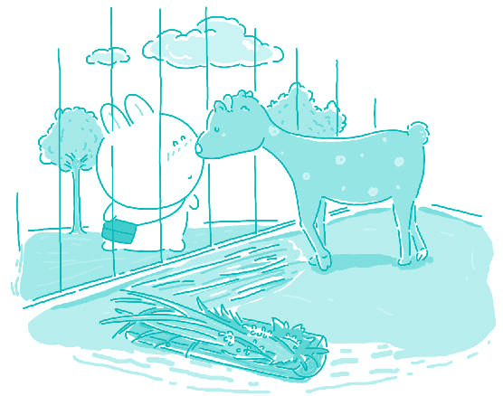

> ###  译文

> **153. 动物园毫无用处吗？**

> 有些人对动物园竖起眉毛表示怀疑并批评“动物园没有用”，也许最应该为此受到责备的原因就是维持它的昂贵费用。然而，这样说太草率了，因为绝大多数动物园都在教育和科研方面有着重要性。

> 现代动物园作为教育中心，在这里学习和动物有关的知识被设计成有趣而又令人愉快的体验。它们给参观者提供了一个看到诸如老虎、斑马、企鹅和大熊猫等来自世界各地的稀有动物的机会。动物园也会向人们介绍他们本地的野生动物，提供了在一个不断城市化的世界中的珍贵的学习经验。同时，绝大多数动物园都提供针对各个年龄阶段的教育节目。去参观动物园给孩子们提供了一个观看和接触除了家养宠物之外的各种动物的机会。对于年龄大一些的学龄儿童，很多动物园安排了关于生物学的不同方面和人类对动物生活影响的课程或者全天行程。

> 现代动物园还有他们在科学方面的重要性，而且可以作为各种濒危动物的避难所，从而有助于维持生态系统。在动物园里科学家可以增加一种动物的数量直到它们可以自己在野外繁衍。麋鹿就是一个成功回到野生环境的例子。这个亚洲鹿种在800多年前它们的栖息地被破坏之前，曾经生活在中国东北的沼泽之中；后来它们在野外灭绝了。从那时起在中国、以及后来在欧洲，动物园里都饲养着这个物种。在1985年，四头麋鹿被放回了中国的一个动物保护区的野生环境中，如今它们在那里繁殖得很成功。

###  Word List

 * blameworthy ［ˈbleimˌwə:ði］ adj. 该受到责备的
 * self-sustaining ［ˌselfsəsˈteiniŋ］adj. 自给的
 * exorbitant ［igˈzɔ:bitənt］ adj. 昂贵的
 * Père David's deer 麋鹿
 * penguin ［ˈpeŋgwin］ n. 企鹅
 * marshland ［ˈma:ʃˌlænd］ n. 沼泽
 * globe ［gləub］ n. 地球；世界
 * ark ［a:k］ n. 方舟
 * impact ［ˈimˌpækt］ n. 冲击；影响
 * vulnerable ［ˈvʌlnərəbəl］ adj. 脆弱的
 * sanctuary ［ˈsæŋktjuˌeri］ n. 避难所
 * upheaval ［ʌpˈhi:vəl］ n. 剧变

## 154. Is banning smoking in public places a good rule or a bad rule?

In spite of all of the known dangers of smoking, people all over the world continue to indulge in this terrible habit. By allowing people to partake in a cigarette whenever they please, the government is encouraging the smokers' early death. Smoking should be made illegal in all public places as it is very dangerous to one's health, it endangers the life of people who must work in smoky environments, and it makes it difficult for smokers to cut down on their nicotine intake, as they can smoke everywhere.

As mentioned above, there are a vast number of illnesses caused by cigarette smoke. The major disease caused by smoking is lung cancer. This particular type of cancer alone kills more people each year than any other illness. Not only is it associated with lung cancer, it is also associated with heart disease, birth defects and a host of other disorders. On a more aesthetic level, smoking yellows one's teeth and hands, which makes him unattractive. Most people also find the smell of a smoker to be undesirable.

It is not only the smoker himself who is injured by his habit. People who must work in smoky environments, such as barmaids and waiters, are susceptible to all of the above-mentioned ailments. Also, the children and spouse of a smoker will be affected by the constant smoke in their environment, and will also be adversely affected. It is unfair for people to suffer for other's bad habits. If one could only smoke in the privacy of one's home, many lives would be saved.

Finally, it is important to disallow smokers to smoke in public because doing so increases their likelihood of smoking often. If a person must go into a private area to smoke, they would be less likely to do so. It is an inconvenience, and the smoker would therefore partake in a cigarette less often. In many places in the world, it is very cold in the winter. If a person had to smoke outside in these conditions, they would be far less likely to do so. This would eventually make it easier for the smoker to quit the habit.

Therefore, I believe that it would be beneficial for everyone if smokers were only allowed to have a cigarette while in private smoking areas. Enforcing this rule would save thousands of lives, and would also decrease the amount spent on health care dramatically.

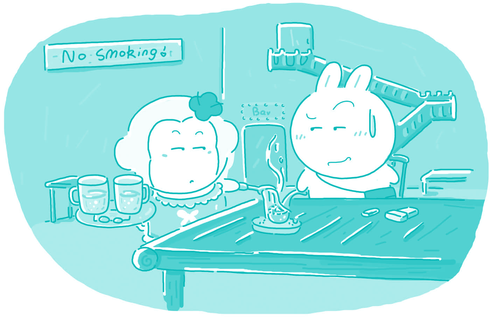

> ###  译文

> **154. 公共场合禁烟是好还是坏？**

> 尽管大家都知道吸烟的危险性，世界各地的人们还是继续沉湎于这个可怕的习惯。政府允许人们随心所欲地吸烟，其实就是在鼓励他们过早死亡。在公共场合吸烟应该是非法的，因为这对人们的健康极其有害，它会把那些必须在烟雾缭绕环境里工作的人们的生命置于危险之中；而且因为可以随时随地吸烟，对于吸烟者来说减少尼古丁的摄入量就更为困难。

> 如上所述，吸烟会引起多种疾病。由吸烟引起的主要疾病就是肺癌。每年因为这种癌症的致死人数，比因为患其他所有的疾病致死的人数还要多。除了肺癌之外，吸烟还会导致心脏病、先天缺陷和其他的紊乱。从审美层次上来说，吸烟会把牙齿和手熏黄，从而使人不受欢迎。而且绝大多数人都发现吸烟者身上有令人不快的气味。

> 不仅吸烟者本人，就连不得不在烟雾缭绕的环境中工作的人们——比如酒吧女招待和服务员，都会患上各种各样刚才提到的疾病。而且吸烟者的孩子们和配偶也会因为生活环境中持续不断的烟雾而得病。让人们因为别人的恶习而遭受痛苦是不公平的。如果人们只有在家中独处时才能吸烟，就能挽救很多人的生命。

> 最后，禁止吸烟者在公共场合吸烟很重要，是因为这样会降低他们吸烟的频率。如果只有在独处的时候才能吸烟，人们就不会经常吸烟。吸烟者会因为嫌麻烦而少抽烟。世界上很多地方的冬天都很寒冷，在这种情况下如果只有在室外才能吸烟，很多人就不会这样做了。这会逐渐让戒烟变得更容易。

###  Word List

 * indulge in 沉湎于
 * susceptible ［səˈseptəbəl］ adj. 易得病的
 * partake ［pa:ˈteik］ v. 享受
 * ailment ［ˈeilmənt］ n. 疾病
 * nicotine ［ˈnikəˌti:n］ n. 尼古丁
 * inconvenience ［ˌinkənˈvi:njəns］ n. 麻烦
 * aesthetic ［esˈθetik］ adj. 审美的
 * dramatically ［drəˈmætikəli］ adv. 引人瞩目地
 * barmaid ［ˈba:ˌmeid］ n. 酒吧女招待

## 155. A plant that is important in your country

China's culture has always had an intimate relationship with nature. This can be seen in many aspects of Chinese culture, from herbal medicines to intricate Chinese gardens. I believe that the most important plant in my culture is bamboo. Bamboo can be a source of nutrition, it can be used to build many things, from baskets to houses, and it has a large influence on history and arts in China. First and foremost, bamboo is a popular food in our country. Many people will add bamboo to their meals for its delicious flavor and nutritional value. Many animals also enjoy bamboo, the most famous being the Giant Panda. This bear is nearing extinction, and if the natural sources of bamboo were to disappear, the Panda would surely disappear from the world. In addition to being a source of food, bamboo has healing qualities as well. It has been used in traditional Chinese medicine to relieve asthma, coughs, and gall bladder disorders.

Bamboo is a very versatile material that can be used to make numerous different items. It has been used in China for thousands of years to make baskets for carrying items, and for constructing buildings. Bamboo grows very, very quickly, and therefore, there is always a steady supply available for our consumption. It has also been used to make fans, furniture, and clothing.

Finally, bamboo is very important in the literary and artistic arenas in China, and has been since the first writings were recorded. Bamboo has been used in many Chinese arts: it has been used as a metaphor in literature, it has been used in the making of instruments and artistic implements, such as the bamboo flute or Chinese brushes. It is a prevalent theme in both visual and literary arts. In conclusion I posit that bamboo plays a significant role in the life and culture of Chinese people. It provides food and shelter, and is also a prominent symbol in the artistic world. The Chinese believe that bamboo brings good luck, which proves their admiration and fondness of this particular plant.

> ###  译文

> **155. 贵国的一种重要植物**

> 中国文化一直和自然有着亲密的关系。这表现在中国文化的很多方面，从中草药到错综复杂的中式花园。我认为我国最重要的植物是竹子。竹子可以食用、可以制造从篮子到房屋的各种东西，它还对中国的历史和艺术有着重大影响。

> 首先，竹笋在我国是一种很受欢迎的食品。很多人喜欢吃竹笋是因为它味道鲜美以及丰富的营养价值。很多动物也喜欢吃竹子，最著名的就是大熊猫。这种动物已经濒临灭绝了，如果自然界中的竹子消失了，那么大熊猫就一定会从世界上消失。除了作为一种食物来源，竹子还有药用价值。在传统中药里，竹子被用来治疗哮喘、咳嗽以及胆囊疾病。

> 竹子是一种用途非常广泛的材料，可以用来制造很多不同的物品。中国数千年来用竹子编制盛放物品的篮子，还用竹子来建筑房屋。竹子长得非常非常快，因此对于我们的消费量总是有充足的供应。竹子也被用来制造扇子、家具和衣服。

> 最后，自从有最早的文字记载开始，竹子对于中国的文学界和艺术界就非常重要。竹子被使用于多种中国的艺术形式：它在文学作品中被用作一种隐喻，它也被用来制造乐器和艺术用品，诸如竹笛和毛笔。它在书画作品和文学作品中都是流行的主题。

> 总之，我认为竹子在中国人民的文化和生活中扮演着非常重要的角色。它不仅提供了食物和房屋的原料，还是艺术世界中突出的象征。中国人认为竹子会带来好运，这也证明了他们对于这种植物的赞美和喜爱。

###  Word List

 * shelter ［ʃeltə］ n. 房屋
 * consumption ［kənˈsʌmpʃən］ n. 消费；消费量
 * intimate ［ˈintəmit］ adj. 亲密的
 * herbal medicine 中草药
 * arena ［əˈri:nə］ n. 舞台；领域
 * intricate ［ˈintrikit］ adj. 错综复杂的
 * metaphor ［ˈmetəˌfɔ:］ n. 隐喻
 * nutrition ［nu:ˈtriʃən］ n. 营养；营养学
 * literature ［ˈlitərəˌtʃə］ n. 文学（作品）
 * first and foremost 首先；首要的
 * implement ［ˈimpləmənt］ n. 工具；器具
 * flavor ［ˈfleivə］ n. 滋味
 * prevalent ［ˈprevələnt］ adj. 流行的；普遍的
 * healing ［ˈhi:liŋ］ adj. 有治疗功用的
 * asthma ［ˈæzmə］ n. 哮喘
 * prominent ［ˈpra:mənənt］ adj. 突出的；显著的
 * gall bladder 胆囊
 * versatile ［ˈvə:sətəl］ adj. 多方面的

## 156. A foreign country you would like to visit

The world is a vast and varied place. One could travel for a decade without seeing all of the sights the world has to offer. However, if I could travel anywhere in the world for two weeks, it would be Canada. Canada is a very beautiful country and it has a varied culture. Also, I am considering going to university in Canada, so it would be good for me to see what it is like before application.

Canada boasts that it is one of the most beautiful countries in the world. In particular, Vancouver is very beautiful. The city is located right on the ocean, and there are enormous snow-tipped mountains surrounding the entire city. There are a multitude of beautiful parks to walk through, and very nice beaches. Vancouver, however, is not the only beautiful city in Canada. All across the country there are small, picturesque towns located on mountains and valleys. In general, Canada is an incredibly clean country, which also helps its beauty.

Canada also has a widely varied culture. Most people say the cultural apex of the country is in Montreal. This is one of the oldest cities in Canada, first colonized by the French. As such, the French influence is still quite prevalent in this city, and over half of the people living there speak both English and French. The architecture in Montreal is also quite beautiful.

The final reason why I would love to spend a two-week vacation in Canada is because I am considering attending one of the universities there for my bachelor's degree. I think that it would be an excellent idea to go see the school, and perhaps even meet some of the professors that teach the courses I am interested in. It would also be beneficial for me to meet other students. By doing this, I could find out how good the programs at the school are, and if it is worthwhile to move across the world for.

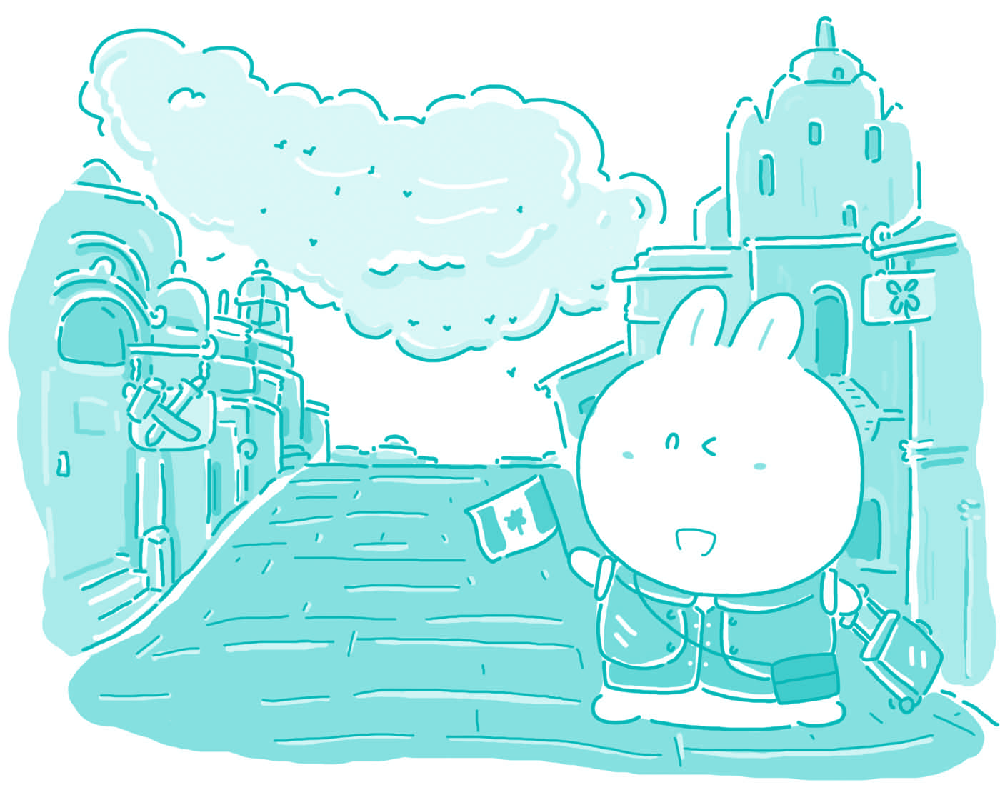

> ###  译文

> **156. 你想去游览的一个国家**

> 世界是辽阔的，而且有着各式各样的地方。一个人即使旅行十年，也看不完世界上的各种名胜。然而，如果可以在世界上任选一个地方旅行两个星期，我会选择加拿大。加拿大是一个有着多元文化的非常美丽的国家。而且，我正在考虑去加拿大上大学，因此在提交申请之前去看一看对我是很有好处的。

> 加拿大以其为世界上最美丽的国家之一而自豪，而温哥华尤其美丽。这座城市就坐落在海边，白雪盖顶的群山环绕着整个城市。这里有很多美丽的公园可以散步，还有很美的海滩。然而，温哥华并不是加拿大惟一的美丽城市。全国范围之内，到处都有坐落在山上或者山谷中独特的小镇。总的来说，加拿大是一个非常干净的国家，这也使它更加美丽。

> 加拿大也有着差异很大的多元文化。绝大多数人都认为该国的文化中心是蒙特利尔。这是加拿大历史最为悠久的城市之一，它最早是法国的殖民地。因此，在这座城市里，法国的影响直到现在仍然相当普遍，而且一大半住在这里的居民都使用英语和法语两种语言。蒙特利尔的建筑也相当优美。

> 想去加拿大度过为期两周假期的最后一个原因，是我在考虑去一所加拿大的大学完成我的学士学位。我认为去学校看一看是个很好的想法，甚至可能见到教我所感兴趣的课程的教授。能够见到其他的学生也会对我很有帮助。这样，我就能够发现学校提供的课程到底有多好，是否值得我去世界的另一端求学。

###  Word List

 * decade ［ˈdeˌkeid］ n. 十年
 * apex ［ˈeipeks］ n. 最高点
 * boast ［bəust］ v. 以…而自豪
 * Montreal ［ˌma:ntriˈɔ:l］ n. 蒙特利尔
 * in particular 特别
 * colonize ［ˈka:ləˌnaiz］ v. 殖民；拓殖
 * vancouver ［vænˈku:və］ n. 温哥华
 * prevalent ［ˈprevələnt］ adj. 普遍的
 * multitude ［ˈmʌltiˌtu:d］ n. 大量；众多
 * architecture ［ˈa:kiˌtektʃə］ n. 建筑
 * picturesque ［ˌpiktʃəˈresk］ adj. 独特的

## 157. Studying at home by using technology or at traditional schools?

The technology industry is growing at a faster rate as each year passes by. With a relatively inexpensive computer and a web camera, it is now possible for one to have a videoconference with one's friends and colleagues. Students will soon be presented with the opportunity to study from home. However, I believe that attending a traditional school is greatly preferable to learning in a virtual classroom. Traditional schools allow the student to socialize, they give the student direct access to the teacher, and they prepare the student for the environment of the working world.

Many people say that they met their best friends while attending high school. These friendships were solidified over spending hours and hours in the same classrooms together, and working together on group projects. While it is conceivable that students studying from home would meet each other over the Internet, the bonds that are formed in classrooms cannot be replaced.

Forming personal relationships with one's teachers is also an excellent idea that would be difficult to realize if one did not attend classes. Most of our relationships with our teachers are formed by interaction both in the classroom, and outside it. For example, if a student was constantly at school, either working in the library, or perhaps eating lunch in the cafeteria, it is more than possible that he/she would converse with his/her teachers on many occasions. Developing a relationship with one's teacher is important as it helps one to build his/her business network.

Traditional schools also have the advantage of training students for "the real world." If a student never has to work with others on a project, or report to his/her teachers, he/she will not have a very good grasp as to what it means to work in a team environment or respect authority. The way that school operates forces students to develop these important skills.

In conclusion, I think it would be much more beneficial for all students to attend traditional schools rather than study at home. Attending a school helps students to develop the necessary social skills needed to survive in today's fast

pace world.

> ###  译文

> **157. 在家通过高科技学习还是去学校学习？**

> 每一年科技工业都在以更快的速度发展，用一台相对而言并不昂贵的电脑和一个网络摄像机，现在人们已经有可能和朋友以及同事们召开视频会议。学生们也很快就能有机会在家里上学了。然而，我认为去传统学校上学远比在一间虚拟教室里学习更为可取。传统学校能使学生社会化，在那里学生能直接和老师接触，而这些都是在为将来的工作环境做准备。

> 很多人都说在上高中时交到了他们最好的朋友。这种友谊随着一起在同一间教室里度过一个又一个小时、共同完成小组项目而逐渐深厚。虽然我们可以想象在家学习的学生们可以通过互联网见到彼此，但是在教室里建立起来的亲密的人际关系是无法替代的。

> 和自己的老师建立起私人关系是个很好的想法，但是如果不去上学这就很难实现。我们和老师们的关系绝大部分是通过在教室内外的各种相互影响而形成的。例如，如果学生一直呆在学校里，无论是在图书馆里学习，还是在自助餐厅里吃午餐，都可能会有很多机会和老师交谈。和自己的老师建立关系是很重要的，因为这有助于他或她将来建立自己的商业网络。

> 传统学校还有训练学生适应“真实世界”的优势。如果学生从来都不需要和他人一起为一个项目工作，或者向老师们报告情况，他或她就不能很好地了解如何在团队中工作以及尊重权威人士的意义。学校的运行方式强迫学生们发展这些重要的技巧。

###  Word List

 * videoconference ［ˈvidiəuˌka:nfərəns］ n. 视频会议
 * conceivable ［kənˈsi:vəbəl］adj. 可想象的；可能的
 * colleague ［ˈka:lˌi:g］ n. 同事
 * interaction ［ˌintərˈækʃən］ n. 相互作用
 * preferable ［ˈprefərəbəl］ adj. 更可取的
 * cafeteria ［ˈkæfiˈtiəriə］ n. 自助餐厅
 * virtual ［ˈvə:tjuəl］ adj. 虚拟的
 * converse with 谈话；交谈
 * socialize ［ˈsəuʃəˌlaiz］ v. 使社会化
 * grasp ［græsp］ n. 了解
 * solidify ［səˈlidəˌfai］ v. 巩固
 * authority ［ɔ:ˈθɔ:riti］ n. 权威人士

## 158. Should we pay attention to the opinions of famous people?

It is only in the last hundred years that the"star" phenomenon was born. Prior to 1900, there were no famous entertainers in today's sense. Fame was held for political officers. However, today, the people who appear before us either on a court, a stage, a field or a screen, are in fact more famous than many political officers. Many people listen to these famous people and act as if their word was gospel. However, I do not think this is correct behavior.

Stars should be treated with respect, but their opinions should not count for any more than a regular person's opinion. Becoming a star does not automatically endow a person with limitless knowledge. Stars must do research to form their opinions, just like the rest of us. It is no more or less likely that a star will have a valid opinion on a subject than a friend from school.

In many cases, when stars state their opinions, they are not telling the world how they truly feel. Many famous people will only make announcements that their publicists have approved. Therefore, in many cases, it is not the stars' opinions that we are hearing at all, but in fact, that of the corporations that they work for.

I believe that the only time that we should really value the opinion of what a star has to say more than we value others' opinions is when the star is talking about a subject that he/she specializes in. For example, if a basketball player is giving his/her opinion on how his/her team will do in the play-offs, then one should probably take the opinion to heart. Everyone has his/her own field of expertise. If stars, or regular persons for that matter, are talking about their professions, they are bound to have extensive knowledge on the subject.

In conclusion, I do not think that we should listen to the opinions of stars unless they are speaking on a matter that they specialize in."Regular people" have just as well thought out knowledgeable opinions as the stars, sometimes even more so. Unfortunately, many young adults idolize these stars and believe everything they say. Because of this, it is important for stars to be careful about passing on inaccurate information.

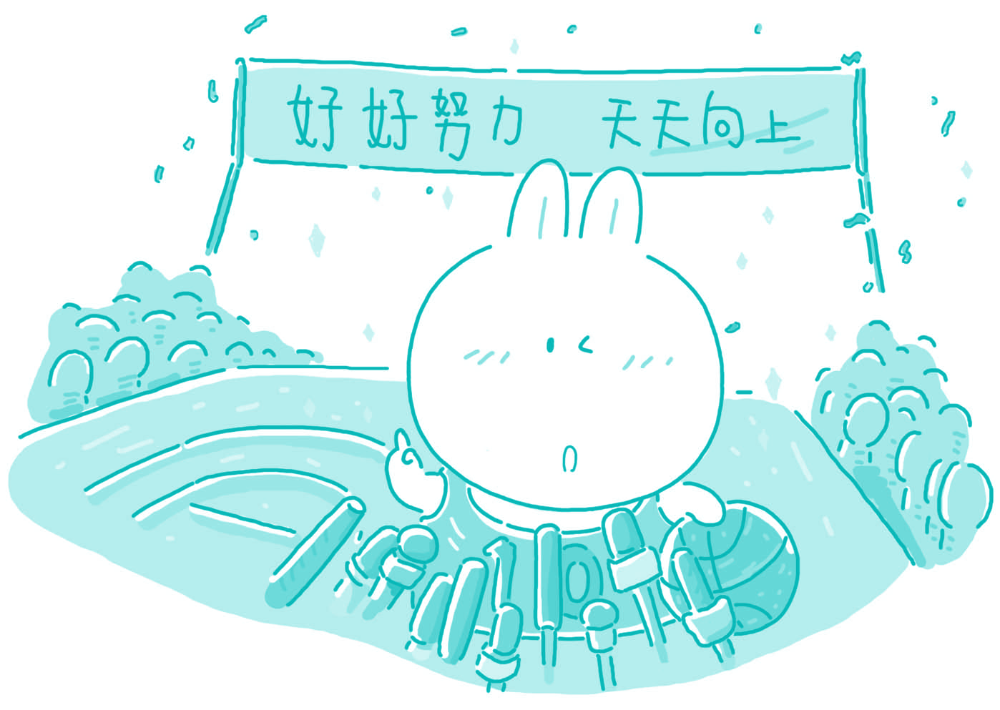

> ###  译文

> **158. 我们应该在意名人的观点吗？**

> “明星”现象仅仅是在过去一百年中产生的。在1900年之前，并没有今天意义上的著名演艺人员，只有政治官员才有名望。然而今天，那些无论是出现在球场、舞台、运动场还是银幕上的人们，实际上比很多政治家都更为有名。很多人都会听取这些著名人士的观点，就好像他们的话是真理一样。然而，我并不认为这样的行为是正确的。

> 明星们应该得到尊重，但是不能认为他们的观点比普通人的意见更有价值。成为明星并不会自动赋予一个人无穷无尽的知识。明星们就像我们一样，也要为他们的观点进行调查研究。对于一个问题，明星的观点并不一定比学校里的朋友提出的更好或更坏。

> 在很多情况下，当明星陈述他们的观点时，并不会向世界宣布他们真实的感受。很多著名人士只会做出经过他们的公共关系顾问同意的声明。因此在很多情况下，我们听到的根本不是明星的观点，而实际上是他们所服务的公司的观点。

> 我认为我们惟一应该重视明星观点的时刻，就是他们在谈论自己所专门从事的职业时。例如，当一个篮球运动员就他或她的球队在加时赛中将会如何表现发表意见的时候，我们可能应该把它记在心里。每个人都有专长的领域，当明星或者普通人谈论他们的专业时，他们肯定会拥有关于那个专业广泛的知识。

###  Word List

 * phenomenon ［fiˈna:məˌnən］ n. 现象
 * publicist ［ˈpʌblisist］ n. 公共关系顾问
 * prior to 在…之前
 * expertise ［ˌekspə:ˈti:z］ n. 专门技能；专门知识
 * entertainer ［entəˈteinə］ n. 演艺人员
 * fame ［feim］ n. 名声；名望
 * knowledgeable ［ˈna:lidʒəbəl］ adj. 知识渊博的
 * gospel ［ˈga:spəl］ n. 真理
 * endow ［enˈdau］ v. 赋予
 * idolize ［ˈaidlˌaiz］ v. 极度崇拜
 * valid ［ˈvælid］ adj. 正确的

## 159. What is the change that should be remembered about the twentieth century?

In the last century, the speed at which technology is developing has increased at a phenomenal rate. If someone living one hundred years ago could see the world today, they would think they were peering onto the set of a science fiction movie. Of all of the inventions created in this time period, I believe that the computer and the Internet should be remembered above all others.

The first reason why I believe that the computer and the Internet are so important to history is because they allows, for the first time ever, all of the people in the world to share their information. If I can speak Italian, I can access all of the websites from Italy. If I have a working knowledge of Japanese, the wealth of Japan's information is at my fingertips. The Internet connects people and ideas, therefore allowing everyone to increase his/her knowledge.

The computer also allows us to make complex calculations with the greatest of ease. A century ago, it would have taken an experts ten months to work out some of the more intricate problems that math and science provide us with. However, with computers, these problems are solved within seconds. Computers also speed up other aspects of our lives. Most young people living in developed nations can type faster than they can handwrite. This, of course, speeds up the education process as well as the business world.

Finally, the computer and the Internet are very important to the twentieth century because of its effect on the entertainment industry. Computers have allowed for complex video games to be created, which are the current craze in most cultures. Teenagers everywhere spend countless hours playing these games, and gain great enjoyment from them. For those not interested in video games, the computer has also allowed for great advances in the movie industry. Special effects are now commonplace in every modern movie we watch. They make movies more realistic and exciting.

In brief, I believe that when future generations look back on the twentieth century's inventions, they will be most impressed with the computer and the Internet, as it has changed the way we view the world and interact with each other.

> ###  译文

> **159. 20世纪中哪项转变应该被铭记?**

> 在上一个世纪，科学技术以非常快的速度发展。如果生活在一百年前的人能够看到今天的世界，他们会以为自己在观看一部科幻电影。在这段时间的所有发明之中，我认为电脑和互联网比其他发明更应该被记住。

> 我认为电脑和互联网对于历史如此重要的第一个原因是，它们有史以来第一次允许全世界的人们分享他们的信息。如果我会说意大利语，我可以访问所有的意大利网站。如果我懂日语，大量关于日本的信息可被我轻易获得。互联网连接人们和各种想法，因此能让每个人增长自己的知识。

> 电脑还能让我们极其方便地进行最为复杂的计算。一个世纪之前，一个专家可能得花费几个月的时间，才能计算出数学和其他自然科学给我们提出的复杂难题。然而，有了电脑，这些问题可以在几秒钟之内得到解决。电脑还提高了我们生活中其他方面的速度。绝大多数生活在发达国家的年轻人打字的速度比写字要快。当然，这也像加快商业过程一样加快了教育的过程。

> 最后，电脑和互联网对20世纪特别重要，还因为它们对于娱乐产业的影响。电脑使设计复杂的电脑游戏成为可能，这些游戏现在在绝大多数文化中都是很盛行。世界各地的青少年都在这些游戏上面花费了无数的时间，并且从中得到了极大的乐趣。对于那些不喜欢电脑游戏的人来说，电脑也使电影工业有了极大的进步。现在我们观看的每一部现代电影中，特技效果都很常见。它们使电影更加真实，更加令人兴奋。

> 简而言之，我认为将来的人们在回顾20世纪的发明时，给他们留下最深刻印象的会是电脑和互联网，因为它改变了我们观察世界以及彼此相互影响的方式。 

###  Word List

 * phenomenal ［fiˈna:mənəl］ adj. 出众的；非常的
 * intricate ［ˈintrikit］ adj. 复杂的；难以理解的
 * peer ［piə］ v. 凝视；盯着看
 * craze ［kreiz］ n. 狂热
 * science fiction movie 科幻电影
 * provide with 给…提供
 * access ［ˈækses］ v. 访问
 * realistic ［riəˈlistik］ adj. 现实的
 * website ［ˈwebˌsait］ n. 网站

## 160. Complain in writing or in person?

When we finally find out a service or a product that failed to satisfy us, we have to complain. Occasionally, we can choose whether to make an argument face-to-face or in writing, but usually we have no choice. We have to make our case in person if we need a personal touch or have no time to write; we have to write if we can't meet the right person to complain.

Writing has its advantages: when we write, we can better control the flow of our ideas, explain complex issues patiently, and convey our feeling of troubles that the poor products have brought explicitly and accurately. On the other hand, writing also has disadvantages: we may lack of a sense of what the readers are like—amiable or prickly, generous or difficult—and we can't respond immediately to their doubts, questions, or misunderstandings. When we write, we also lose one way to get the reader to take our argument seriously: face-to-face, we can draw others into it with our body language, the passion in our voice, even the look in our eyes. If, for example, I ran into a dean after a bad experience at the student health service, I could visibly communicate my frustration right there, and the dean would probably respond more intently than if he/she were in his/her office reading an angry letter.

For common trivial problems, I'd prefer to complain in person, which is more direct than in writing. To a large extent, to complain in a right way is a pure skill, if properly handled, problems can be solved without any quarrel, because appropriate courtesy is always appreciated. On the contrary, if the problem or issue is fairly critical, I'd prefer to write a specific piece to complain, for complex issues often deserve careful thinking.

> ###  译文

> **160. 书面投诉还是当面投诉？**

> 当最终发现一项服务或者一个产品不能让我们满意时，我们就不得不投诉。有时候，我们可以选择当面争辩或写信投诉，但是通常我们别无选择。在我们需要亲自去联系或者没有时间写信的时候，就不得不当面解决问题；如果我们找不到投诉的合适人选，就得写信投诉。

> 写信有它的优势：在我们写信时，可以更好地控制自己的思绪，耐心地解释复杂的问题，并且明白准确地传达劣质产品给我们带来的麻烦。另一方面，写信也有劣势：我们可能不知道读信人会是些什么样的人——和蔼的还是易怒的，有雅量的还是难以相处的——而且我们不能对他们的怀疑、质问或者误解立刻做出反应。

> 在写信时，我们还失去了让读信人认真对待我们争论的一种方式：面对面的交流时，我们可以用肢体语言、声音中蕴含的情绪甚至眼神将对方带入争论。例如，假设我在学生医疗卫生服务机构有了不愉快的经历之后去找院长，我在那里就可以明显地表达我的失望，比起在办公室里读一封愤怒的来信，院长可能会做出更为专注的反映。

###  Word List

 * satisfy ［ˈsætisˌfai］ v. 使满意
 * dean ［di:n］ n. 院长
 * convey ［kənˈvei］ v. 传达
 * visibly ［ˈvizibəli］ adv. 显然
 * explicitly ［ikˈsplisitli］ adv. 明白地
 * frustration ［frʌˈstreiʃən］ n. 失望
 * accurately ［ˈækjəritli］ adv. 准确地
 * intently ［inˈtentli］ adv. 专注地；专心地
 * amiable ［ˈeimjəbəl］ adj. 和蔼的
 * courtesy ［ˈkə:tisi］ n. 礼貌
 * prickly ［ˈprikli］ adj. 易怒的
 * critical ［ˈkritikəl］ adj. 严重的

## 161. Why people remember special gifts they have received?

One custom that is prevalent in all societies around the globe is that of giftgiving. This is a time-honored tradition in all countries, and evokes different feelings or emotions in all of us. Gift-giving has many different functions in Chinese culture. One can receive a gift as a token of affection, or one can receive or give a gift to stimulate business opportunities. In both of these cases, the gifts are always well received, and serve the function of a memento.

Perhaps the most common situation in which a gift is given is on a special day, for example, one's birthday or an anniversary. These gifts come to a person from loved ones, and usually symbolize affection or admiration. These gifts can be large or small. For example, my father bought me a digital camera for my last birthday. This was a great present, and was quite expensive. I did not appreciate the gift because of its monetary value, however. I valued it because it was a very thoughtful gift, as my father knew I was interested in photography. Other gifts have less monetary value, but are still just as meaningful. An example of this is when a boyfriend buys flowers for his girlfriend. The flowers do not cost a lot of money, but they evoke feelings of happiness and love.

Gifts can also be given to stimulate business. For example, many businessmen in China will take their most important clients on a special vacation to see the sights of another city. This trip does not relate directly to business, as in many cases, the business at hand is not discussed. Instead, the businessman will offer such a trip as a token of trust and respect. The client appreciates this gesture, as it shows him/her that the businessman is serious about work, and values him/her as a customer.

In both of these cases, the gifts signify to the receiver that he/she is cared about and is important. It is always a treat to receive a gift, and most people view this as a sign of friendship. Gifts serve as mementos of the people who give them, which is why we hold them in special places in our hearts.

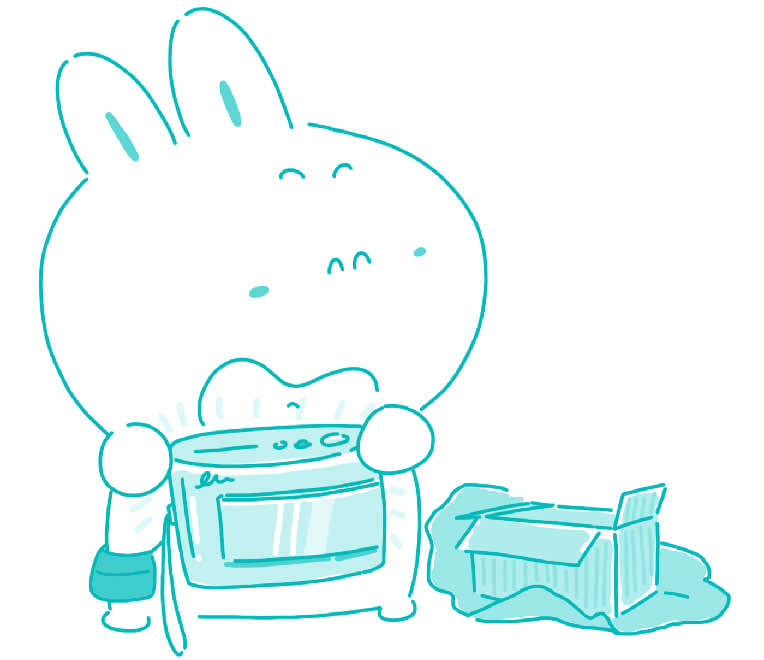

> ###  译文

> **161. 人们为什么会对特殊的礼物记忆犹新？**

> 在世界上各种不同类型的社会中,赠送礼物都是一种让人快乐的习俗。在各个国家中这都是一种历史悠久的传统，而且会唤起我们的不同感觉或情感。在中国文化中，送礼有很多不同的作用。收礼物可能是接受别人友爱的表示，或者人们会接受或赠送礼物来促进商业机会。在这些情况下，礼物总是会得到认可，并且起到纪念品的作用。

> 也许最普通的情况是在一个特殊的日子赠送礼物，例如生日或者周年纪念日。一个人会从爱他的人们那里得到礼物，这些礼物通常是代表友爱或者钦佩。这些礼物可以很大或者很小。例如，我上次过生日的时候，爸爸送给我一台数码相机。这是一件很棒的礼物，而且相当昂贵。不过，我并不是因为它的货币价值而喜欢这件礼物，我珍惜它是因为这是一件非常体贴的礼物，因为爸爸知道我对摄影很感兴趣。其他礼物的价格稍低，但是也一样有意义。一个男孩送给他女朋友鲜花就是这样的一个例子。鲜花的价格并不高，但是它们传递了幸福和爱情。

> 礼物也会被用来促进商业关系。例如，中国的很多商人会邀请他们最重要的客户去其他城市游览度假。这种旅游和做生意并没有直接联系，在很多情况下，并不会讨论手头的生意，而是为了表达商人对客户的信任和尊重。客户很喜欢这种表示，因为这表明这个商人对这项工作很认真，并且把他作为客户来尊重。

> 在这两种情况下，礼物对于接受者来说意味着他们很重要而且受到了关注。收到礼物永远是一件乐事，而且绝大多数人会把这看成一种友谊的标志。礼物还能让人记住赠送礼物的人，这也是为什么礼物在我们心中占据特殊位置的原因。

###  Word List

 * prevalent ［ˈprevələnt］ adj. 普遍的
 * anniversary ［ˌænəˈvə:səri］ n. 周年纪念
 * time-honored ［ˈtaimˌa:nəd］ adj. 历史悠久的
 * admiration ［ˌædməˈreiʃən］ n. 钦佩
 * digital camera 数码相机
 * evoke ［iˈvəuk］ v. 唤起；引起
 * monetary ［ˈma:niˌteri］ adj. 货币的；金钱的
 * affection ［əˈfekʃən］ n. 友爱；爱情
 * stimulate ［ˈstimjəˌleit］ v. 促进
 * photography ［fəˈta:grəfi］ n. 摄影；摄影术
 * memento ［meˈmentəu］ n. 纪念品
 * symbolize ［ˈsimbəˌlaiz］ v. 作为…的象征
 * gesture ［ˈdʒestʃə］ n. 表示

## 162. Do famous athletes and entertainers deserve high salaries?

There are many famous entertainers and athletes who gross millions of dollars every year. I tend to believe that they in a sense do deserve such high paying salaries. Being a famous entertainer or athlete requires copious amounts of hard work. This job also forces one to give up all of their privacy. Moreover, working in these fields means that one must be the very best.

To become famous, whether in the sports industry or the movie industry, takes a lot of hard work. One must train for years and years to make it to the level of a professional. Not only is this tiring, it also costs a lot of money. If one hopes to reach the level of a superstar, he/she must spend money on training and bettering himself/herself. This is not an easy lifestyle, and requires dedication, which many people do not have.

Second, these stars deserve to make a lot of money because they must give up their privacy to serve the public. As soon as stars leave their homes, they are subjected to constantly being pestered by people who want their autograph or want to take pictures of them. Famous people must undergo the intense scrutiny of the media; television and newspaper reporters take note of every action these people do, and publicize it. Again, this is a difficult lifestyle to lead, as one must constantly be careful of what one says in public.

Finally, working in these industries means that one was born with natural talent. They have harnessed a skill that very few others can call upon. If there were no people in society who could play such a role, the entertainment industry would quickly fall into oblivion. We need these people's skills to entertain us.

In conclusion, I think that famous athletes and movie stars deserve their pay.

While it seems like too much money when we first hear how much they make, after careful consideration, we realize that they must put a lot of work into their careers, much more than ordinary people do in many cases.

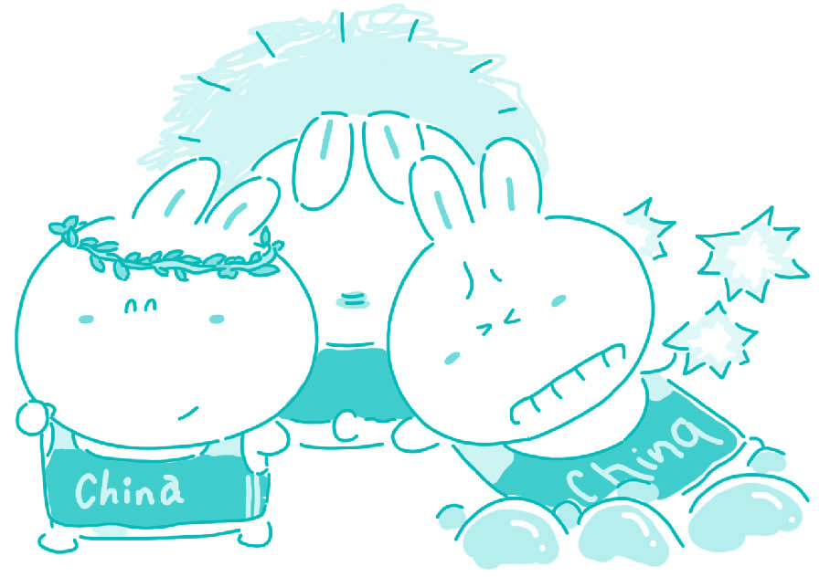

> ###  译文

> **162. 有名的运动员和艺人应该拿高薪吗？**

> 很多著名演艺明星和运动员每年都能有上百万美元的收入。我倾向于认为他们从某种意义上说应该得到这样的高收入。成为一个著名的演艺明星或者运动员必须付出大量的辛勤工作。这种职业也迫使他们放弃了自己的隐私。此外，在这些领域工作意味着他们必须非常出色。

> 无论是在体育界还是文艺界，为了成名都要进行大量的艰苦工作。一个人必须要经过多年的训练才能达到专业水平，而且不仅仅是训练，还要付出大量的金钱。如果一个人想要达到超级明星的水平，他必须付出金钱来训练和完善自己。这并不是一种轻松的生活方式，而且需要奉献精神，这是很多人所不具备的。

> 第二，这些明星应该得到很多金钱，因为他们必须放弃自己的隐私来为大众服务。明星一出家门，就会不断被那些想要得到他们亲笔签名或者给他们拍照的人们纠缠。名人必须忍受媒体极为细致的审查；电视和报纸的记者们会记录下来这些名人的一举一动，并将其公开。我要再次重申，这是一种艰难的生活方式，而且他们必须一直都对自己向公众所说的话非常谨慎。

> 最后，在这些领域工作意味着一个人有着与生俱来的天赋。他们掌握了很少有人能够企及的技巧。如果社会上没有人能够扮演这样的角色，娱乐业很快就会被人们遗忘。我们需要这些人的技巧来娱乐。

> 总之，我认为著名运动员和电影明星应该得到他们的高额报酬。当我们最初听到他们收入的数量时，似乎会觉得太多，但是经过认真思考，我们意识到他们要在职业生涯中付出很多，比普通人在很多情况下要多得多。

###  Word List

 * athlete ［ˈæθˌli:t］ n. 运动员
 * dedication ［ˌdediˈkeiʃən］ n. 奉献
 * entertainer ［entəˈteinə］ n. 演艺人员
 * pester ［ˈpestə］ v. 纠缠
 * salary ［ˈsæləri］ n. 薪水
 * autograph ［ˈɔ:təgræf］ n. 亲笔签名
 * gross ［grəus］ v. 总共赚得
 * intense ［inˈtens］ adj. 极端的
 * in a sense 在某种意义上
 * scrutiny ［ˈskru:tni］ v. 详细审查
 * copious ［ˈkəupiəs］ adj. 丰富的
 * media ［ˈmi:diə］ n. 媒体
 * privacy ［ˈpraivəsi］ n. 隐私
 * oblivion ［əˈbliviən］ n. 遗忘

## 163. Is literacy more important today than in the past?

As the world becomes smaller and smaller due to the process of globalization, it becomes more and more important that everyone learns how to read and write. If one is to keep up with the fast pace of the world, literacy skills are of utmost importance.

Technology is expanding at an ever-increasing rate. Computers, and the Internet, have become common terms in almost all nations in the world. If one wants to be able to communicate with others using this efficient method, one must learn the basics of reading and writing. The objects we have in our home are also becoming increasingly more complicated. For example, if one wants to use a DVD player with their television, one must be able to read the manual to learn how to work it. Even the most basic technologies come with an instruction guide: if one is unable to read, they will constantly be struggling to figure out how to work these technologies. As mentioned above, the world is becoming much smaller. More people are finding it necessary to leave their homes in small towns and villages, moving to the big cities where there is more opportunity. Some of these people find it quite difficult to navigate around the city, as one must know how to read in order to understand the street signs. If one cannot find the place where one has to report for work, it would be very difficult to make a living.

Finally and perhaps most importantly, being able to read and write gives us the opportunity to think for ourselves. Wherever we are, people in authority positions tell us what we should believe. However, in many cases, it is not in our best interest to follow the leader's ideas. People must learn to read and then examine the information for themselves. This is the only way that culture can evolve.

Therefore, I think the skills of reading and writing are of vast importance, no matter where one lives in the world. The world population will continue to grow, and the only way to keep ahead is to learn to read and write.

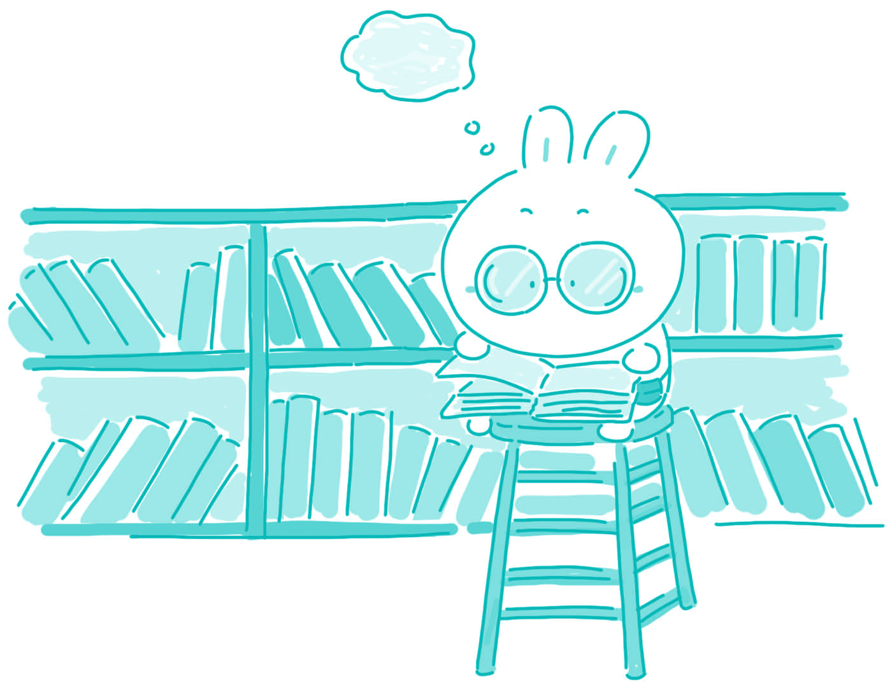

> ###  译文

> **163. 读写能力今天比过去更重要吗？**

> 随着全球化的进程，世界变得越来越小，因此对每个人来说学会阅读和写作都变得越来越重要。如果想要跟上世界的快节奏，读写能力是极其重要的。

> 科学技术正在以不断加快的速度发展。电脑和互联网已经成为世界上几乎所有国家中的普及术语。如果一个人想和别人用这种高效率的方式交流，他就必须学习基本的阅读和写作。我们在家中使用的物品也变得越来越复杂了。例如，如果一个人想在电视机上连接使用DVD播放机，他就必须能够读懂使用指南，学会如何操作。即使是最基本的科技产品也有使用说明：如果一个人不会阅读，他就得经常去努力弄懂如何使用这些科技产品。

> 如上所述，世界变得越来越小。越来越多的人发现必须离开他们居住的小镇或者村庄，搬到有着更多机会的大城市里去。他们中的有些人发现在城市里认路相当困难，因为要读懂街道标识必须具备阅读能力。如果一个人找不到他工作应该前去报道的地点，那么就很难谋生。

> 最后，而且可能也是最重要的，能够阅读和写作给了我们反思自己的机会。无论我们身处何种层次，权威人士都会告诉我们应该相信什么。然而，在很多情况下，遵循领导的想法对于我们自己并不一定是最有利的。人们必须学会阅读，并且自己去调查信息。这也是文明能够发展的惟一方式。

> 因此，我认为一个人无论生活在世界的哪个角落，掌握阅读和写作能力都非常重要。世界人口还在不断地增长，让自己保持领先的惟一方法就是学会阅读和写作。

###  Word List

 * due to 因为
 * instruction ［inˈstrʌkʃən］ n. 指示；用法说明
 * process ［prəˈses］ n. 过程
 * globalization ［ˌgləubəlaiˈzeiʃən］ n. 全球化
 * navigate ［ˈnæviˌgeit］v. 驾驶
 * make a living 谋生
 * literary ［ˈlitəˌreri］ adj. 文化的；文学的
 * authority ［əˈθɔriti］ n. 权威
 * complicated ［ˈka:mpliˌkeitid］ adj. 复杂的
 * evolve ［iˈva:lv］ v. （使）
 * 发展
 * manual ［ˈmænjuəl］ n. 手册；指南
 * population ［ˌpa:pjəˈleiʃən］ n. 人口

## 164. What do you do for good health?

Scientists have discovered that one of the main methods of prolonging a person's life is to keep healthy. There are many different methods to keep in good shape, and one must choose those that are most appropriate for their own lifestyle. Personally, in order to keep healthy, I eat well, exercise, and get lots of rest.

Eating well is an excellent way to keep healthy. If one is constantly drinking pop or eating fried foods, they will not be able to keep a healthy weight. One must eat lots of vegetables and fruit, and stay away from all foods that are high in cholesterol. In order to maintain a low level of cholesterol in my diet, I tend to eat more fish rather than heavier meats. Fish is much healthier than red meat, and I find it much tastier as well.

Exercising is also very important to leading a healthy lifestyle. One should exercise for at least half an hour, three to four times a week. Exercise can include anything from going to the gym to "work out", to going on a long walk around the city. If I am particularly busy, I will walk up the stairs to my apartment rather than taking the elevator. This provides me with the minimum amount of exercise necessary to stay fit.

The third thing I do to keep healthy is sleep well and often. I typically sleep for approximately eight and a half hours every night. Sleep is very important, as your body uses this rest time to heal itself. If one tries to live for long periods of time without sleep, they will quickly become haggard and disheveled. Sleep is absolutely necessary for a healthy life.

In conclusion, I find that eating well, exercising and sleeping often is the best way for me to keep healthy. If a person can change their lifestyle and incorporate these three ideas, they will be much better off for it. A person who leads a healthy lifestyle will be less likely to get sick, and they will live longer.

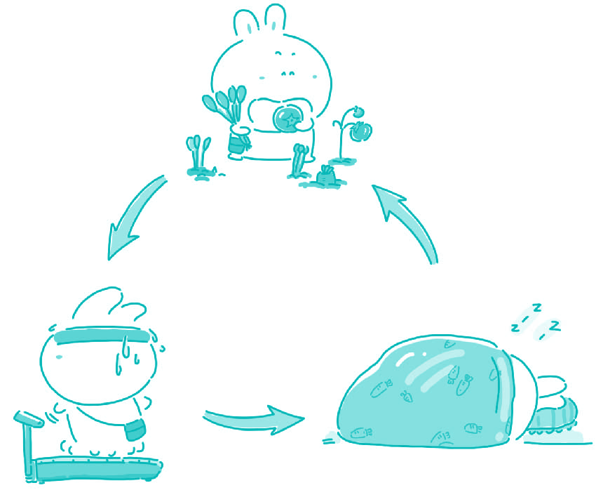

> ###  译文

> **164. 为了健康，你做些什么？**

> 科学家已经发现延长一个人生命的主要方式之一就是保持健康。保持健康的方法很多，一个人必须选择最适合自己生活方式的那些方法。就我个人而言，为了保持健康，我注意饮食、运动并且保持充足的睡眠。

> 注意饮食是保持健康的一个绝佳方法。如果一个人不停地喝汽水或者吃油炸食品，就很难保持健康的体重。一个人必须吃大量的蔬菜和水果，并且远离各种胆固醇含量高的食品。为了把我饮食中的胆固醇含量保持在较低的水平，我倾向于更多地吃鱼，而不是油腻的肉类。鱼类比肉类更为健康，而且我发现鱼的口感也更好。

> 运动对于健康的生活方式也非常重要。一个人每周应该运动三到四次，每次至少半个小时。运动可以包括任何方式，可以去健身房里“锻炼”，也可以在城市里长时间散步。如果我非常忙碌，回家的时候我会走楼梯而不是坐电梯。这样会给我提供保持健康所需要的最低运动量。

> 为了保持健康，我做的第三件事就是保持良好的睡眠。我通常每个晚上睡大约八个半小时。睡眠非常重要，因为你的身体会使用这段时间进行自我修复。如果一个人长时间不睡觉的话，很快就会变得憔悴而不整洁。睡眠对于健康的生活是绝对必须的。

> 总之，我认为注意饮食、运动并且保持充足的睡眠对我来说是保持健康的最佳方式。如果人们能够改变自己的生活方式，并且结合使用这三种方法，他们的状态会更好。一个有着健康生活方式的人不会那么容易生病，而且寿命会更长。

###  Word List

 * prolong ［prəˈlɔ:ŋ］ v. 延长
 * minimum ［ˈminəməm］ adj. 最小的；最少的
 * pop ［pa:p］ n. 汽水
 * fried ［fraid］ adj. 油炸的
 * approximately ［əˈpra:ksimətli］ adv. 大约
 * cholesterol ［kəˈlestərɔ:l］ n. 胆固醇
 * haggard ［ˈhægəd］ adj. 憔悴的
 * work out 锻炼；运动
 * disheveled ［diˈʃevəld］ adj. 不整洁的
 * elevator ［ˈeləˌveitə］ n. 电梯
 * incorporate ［inˈkɔ:pəreit］ v. 结合；合并

## 165. What is one thing you will do to improve your community?

Fostering a sense of community in one's neighborhood is an excellent idea. When one knows one's neighbors, one can easily ask for favors or opinions on community issues. I think that if I were to spend a number of hours each week helping out my community, I would offer free computer lessons.

If one hopes to succeed in business, it is of utmost importance that they learn how to use a computer. Most decent jobs require at least a basic amount of computer skills. By helping members of my community to get well-paying jobs, I would be helping out the community at large. If my neighbors have more disposable income, it is likely that they will give some money back to the community to improve all of our living situations.

Second, offering free computer lessons to neighbors would increase friendly dispositions between all members in the community. If neighbors meet each other during lesson times, it is more than possible that they will become friends. Many people meet their best friends during the educational process. This socialization could continue during my computer course, thus increasing the friendly atmosphere of the community.

Finally, helping members of the community learn to use a computer would allow them to have more fun. There are many entertaining activities one can occupy one's time with on the computer. The computer also offers the user the opportunity to "surf the Internet", which can be a great way to spend one's time. For example, a person can download movies from the Internet, which can be watched on lazy summer evenings, or cold winter nights.

Thus, I think that offering computer lessons to those in my community would be an excellent way to volunteer my time. Computers improve people's living situations in so many ways, and I would love to be a part of this process.

> ###  译文

> **165. 你会做什么事来改善社区？**

> 在邻居之间培养一种社区的感觉是一个极好的想法。在认识自己的邻居之后，就能很容易地请求帮助或者交流有关社区的问题。我认为如果自己要每周用几个小时来帮助我的社区，我会选择提供免费的电脑课程。

> 如果一个人想在商业方面取得成功，那么学会如何使用电脑对他来说是非常重要的。绝大多数体面的工作至少都要求一些基本的电脑技巧。通过帮助我们社区的成员们找到收入丰厚的工作，我将能够帮助我的整个社区。如果我的邻居们有了更多可以自由支配的收入，他们很有可能愿意给社区捐一些钱，来改善我们大家的生活状况。

> 第二，给邻居们提供免费的电脑课程将会增进社区成员之间的友谊。如果邻居们在上课的时候遇见对方，那么他们就很有可能成为朋友，很多人都是在接受教育的过程中遇到了他们最好的朋友。这种社会化现象在我的电脑课程中也可能继续，这就增加了社区中的友好气氛。

> 最后，帮助社区成员们学习使用电脑能帮助他们得到更多的乐趣。一个人在电脑的陪伴之下可以进行很多有趣的活动来打发时间。电脑还给了使用者进行“网上冲浪”的机会，这也是一种很好的休闲方式。例如，一个人可以从互联网下载电影，在慵懒的夏夜或者寒冷的冬夜里观看。

> 因此，我认为给社区成员提供电脑课程是我自愿去做的事情。电脑能够从很多方面改善人们的生活状况，而且我很乐于参与这个过程。

###  Word List

 * foster ［ˈfɔ:stə］ v. 培养
 * disposition ［ˌdispəˈziʃən］ n. 意向；倾向
 * utmost ［ˈʌtˌməust］ adj. 极度的
 * socialization ［ˌsəuʃəlaiˈzeiʃən］ n. 社会化
 * decent ［ˈdi:sənt］ adj. 体面的
 * atmosphere ［ˈætməˌsfiə］ n. 气氛
 * at large 整个的；全部的
 * entertaining ［ˌentəˈteiniŋ］ adj. 有趣的
 * disposable ［diˈspəuzəbəl］ adj. 可任意使用的
 * volunteer ［ˌva:lənˈtiə］ v. 自愿提供

## 166. What events make a person an adult?

People have many different ways expressing, celebrating and legislating our passage from childhood into adulthood. I believe that there is no single moment that defines when a child becomes an adult . Becoming an adult is based on a variety of events, namely, when one's body changes, when one's mind expands, and when one accumulates experiences.

Small children are usually referred to as cherub like. They are all beautiful with rosy cheeks, bright eyes, and tender skin. As a child grows into an adolescent, they grow taller, but their frames remain quite small. Once a youth grows from an adolescent to an adult, frames develop substantially. Their shoulders broaden and they are able to form defined muscles. This physical change is the most obvious sign of a child becoming an adult.

The second modification that occurs is the expansion of one's mind. When one is an adult, they are able to comprehend much more advanced thought processes. They start to be able to think for themselves, and make decisions that are best for them. Children are not capable of making complex decisions regarding their lives or their future. They do not have a mind capable of carefully weighing all of the options and deducing the right choice.

This expansion of the mind is a result of the numerous experience a person has on his/her way to becoming an adult. As one moves through the world, they gather important information about how the world works. This information becomes one's personal database of knowledge: such a database is absolutely necessary if one is to grow past childhood. The experiences of which I speak are the happenings in our day-to-day lives. We are constantly placed in situations where we must choose one path or another. Of course, one will make mistakes along the way. These mistakes are an important learning tool, which help us become wise adults.

In conclusion, children become adults when they have sufficiently matured. Their bodies, their minds, and the number of experiences they have had must grow. Once this process is complete, they can rightfully claim to be adults.

> ###  译文

> **166. 什么事标志一个人成为成年人？**

> 人们有很多不同方式来表达、庆祝或通过法律界定我们从孩童时期到成人期的过渡。我认为没有哪个孤立的时期能被定义为一个儿童变为成年人的时间。成为一个成年人是建立在许多事件之上的，也就是：一个人的身体什么时候发生变化，他的思想什么时候发展成熟，什么时候开始积累经验。

> 小孩子们通常会被认为和天使一样。他们都非常美丽，有着玫瑰色的脸颊，明亮的眼睛和柔软的皮肤。当儿童成长为青少年的时候，他们会长高但是体格仍然相当单薄。当青少年成长为成年人的时候，他们的体格会得到充分的发展。他们的肩膀会变宽，而且会长出明显的肌肉。这种身体上的变化是一个儿童成为成年人最显而易见的标志。

> 发生的第二种改变是一个人思想的扩展。当儿童成为成年人的时候，他们有能力理解更为复杂的思维过程。他们开始能够为自己着想，并且做出对自己最为有利的各种决定。儿童没有能力做出与他们的生活以及未来相关的复杂决定。他们的头脑还没有能力仔细权衡各种选择，并由此推断出正确的选择。

> 这种心灵的发展是一个人在成长为成年人的过程中众多经验积累的结果。一个人生活在世界上，就会收集关于这个世界如何运转的重要信息。这些信息会成为个人学识的资料库：这一资料库对一个人从孩童到成年的转变是极为重要的。我所说的经验就是在我们日常生活中发生的事情，我们经常处在必须做出选择的情况下。当然，在这个过程中每个人都会犯错误，这些错误也是一种帮助我们成为聪明的成年人的重要学习工具。

> 总而言之，孩子们在他们充分成熟的时候才会成为成年人。他们的身体、他们的思想和他们所拥有经验都必须成长。当这一过程完成之后，他们就真正成为成年人了。

###  Word List

 * ceremony ［ˈserəˌməuni］ n. 典礼；仪式
 * expansion ［ikˈspænʃən］ n. 扩展
 * legislate ［ˈledʒisˌleit］ v. 通过立法
 * comprehend ［ˌka:mpriˈhend］ v. 领会；理解
 * a variety of 许多
 * accumulate ［əˈkju:mjəˌleit］ v. 积累
 * weigh ［wei］ v. 权衡
 * cherub ［ˈtʃerəb］ n. 小天使
 * deduce ［diˈdu:s］ v. 推论；演绎出
 * adolescent ［ˌædlˈesənt］ n. 青少年
 * sufficiently ［səˈfiʃəntli］ adv. 十分地；充分地
 * frame ［freim］ n. 体格
 * substantially ［səbˈstænʃəli］ adv. 充分地
 * mature ［məˈtjuə］ v. 使成熟
 * modification ［ˌma:dəfiˈkeiʃən］n. 更改；改变

## 167. Should school buy computers or books?

There are many difficult decisions that school supervisors must make in order to ensure the success of their students. One of these decisions is how to spend money when it is available. Quite often, extra funds are spent on either computers or books. Given the choice, I believe that money is best spent on computers.

New technology is being created faster and faster. Each year, IBM develops a new"super computer" that is hundreds of times faster than the previous model. With this constantly changing technology, it is easy for schools to be left behind because they cannot afford new gear. Students deserve to learn on the best technology available, so schools should always upgrade their computers whenever possible.

Computers also offer students a wealth of information, perhaps more than books can provide. It is now possible to buy e-books, dictionaries and encyclopedias for a computer. These computer versions of popular research tools are much better than their hardcover predecessors. For example, a computer encyclopedia takes up no space in the library, it allows students to access the information instantly, and it is much more cost effective than buying the entire series on paper. Also, the Internet allows students to find information on anything their hearts desire.

Finally, spending school funds on computers is more beneficial than spending money on books because computers prepare the students for the working world. In today's society, to attain a high paying position in a company it is necessary to have basic computer skills. If students do not have the ability to learn such skills, they will be left behind while others succeed in their place.

Accordingly, I feel it is better for schools to spend money on computers rather than books. In addition to the reasons listed above, it is important to note that most major cities have extensive libraries that a local school would be hardpressed to match. However, libraries frequently do not house computers, and if they do, they are constantly in use by other patrons. In many cases, the only chance a young person has to use a computer is at his/her school.

> ###  译文

> **167. 学校应该买电脑还是书籍？**

> 学校管理人员们必须做出很多让他们为难的决定，来确保他们的学生们能够成功。这些决定之一就是在拥有资金的时候如何支配。通常，额外的资金会用来购买电脑或者图书。如果可以选择的话，我认为那笔资金最好用来购买电脑。

> 新技术正在越来越快地不断出现。每年IBM都会推出一款比以前的型号运行要快几百倍的新型“超级电脑”。因为科学技术如此持续不断地发展，学校很容易就会因为无力购买新的设备而落后。学生们应该学习现有的最好的技术，因此学校一旦有可能就应该更新他们的电脑。

> 电脑还能够给学生提供丰富的信息，可能比书本提供的还要多。现在为电脑购买电子书、电子词典和电子百科全书已经成为可能。这些常用研究工具的电脑版本比它们的精装本前辈要好得多。例如，电脑上的百科全书不会占用图书馆里的任何空间，它能让学生们立即得到信息，并且比购买一整套纸质书要划算得多。而且，学生们通过互联网能够找到他们想要的任何信息。

> 最后，把学校的资金用于购买电脑比用于购买书籍更为有利，是因为电脑能够让学生们为将来的工作环境做准备。在如今的社会中，要在公司里找到一个高收入的职位就必须掌握基本的电脑技巧。如果学生们不能学习这些技巧，他们就会在别人成功的同时，落在人家后面。

> 从而，我认为学校花钱购买电脑比购买书籍更好。除了上面列出的原因之外，值得注意的是绝大多数主要城市里，都有不少让学校难以企及的大型图书馆。然而，这些图书馆里并不总是配有电脑，即使有电脑，也总是被别的顾客使用着。在很多情况下，年轻人使用电脑的惟一机会就是在他或她的学校里。

###  Word List

 * supervisor ［ˈsju:pəˌvaizə］ n. 管理人
 * hardcover ［ˈha:dˌkʌvə］ adj. 精装的
 * extra ［ˈekstrə］ adj. 额外的
 * predecessor ［ˈprediˌsesə］ n. 前辈；前任
 * gear ［giə］ n. 设备
 * access ［ˈækses］ v. 访问；存取
 * accordingly ［əˈkɔ:diŋli］ adv. 从而；因此
 * upgrade ［ˈʌpˌgreid］ v. 使升级；提升
 * patron ［ˈpeitrən］ n. 顾客
 * encyclopedia ［enˌsaikləˈpi:diə］ n. 百科全书

## 168. Why do some students study abroad?

Choosing which university to attend is a big decision for a young person to make. Some students prefer to stay near their homes, and live with their parents while at school. Others choose to move far away to a different country for their education. I believe that latter students choose to move away to experience a new culture, to learn a new language, or to go to a specific university that specializes in their field of study.

Moving to a new country is an eye-opening experience. The way society works in other cultures is very different from one's own. For example, I had a friend who went to school in Canada. She constantly told me stories about the differences in the food, the architecture, and the way people treat each other. One cannot fully understand his/her own culture until he/her has compared it with another that is vastly different. For this reason, moving to a new country to go to school can be of great importance for students who wish to study international relations.

When one moves to a new country, it is much easier to learn the language of that country. For example, my friend who moved to Canada studied English for years before her departure. While she could express herself, she never fully mastered the language. However, upon her return, I was shocked and amazed at her new level of English. She was completely fluent, and thus gained a great new skill because she studied abroad.

The last reason why students choose to study abroad is because in some cases, doing so is the only way to enter the program one is interested in. For example, if one wants to study marine biology, it would be best if he/she went to a university that was located near the ocean. Also, some schools are known to be the best in a particular field. For instance, in America, Harvard is known to be the best school for law. So, I believe that students study away because they are interested in learning about new cultures, learning new languages, or studying specific programs. While there are many excellent reasons to study in one's home country, studying abroad can offer many new and exciting experiences.

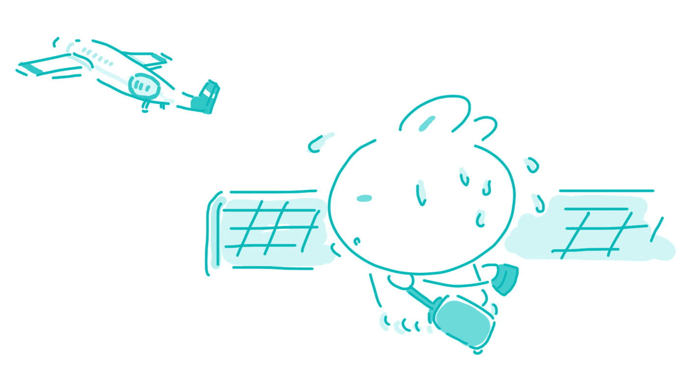

> ###  译文

> **168. 为什么一些学生出国留学？**

> 去上哪一所大学对于一个年轻人来说是一个重大的决定。有些学生喜欢在家附近，这样上学的时候也能和父母在一起。另一些人则选择去遥远的另一个国度接受教育。我认为后一种学生，是选择离开故乡去经历一种全新文化、学习一种新的语言、或者去一所在某些领域有专门研究的大学。

> 去一个新的国家是一种大开眼界的经历。另一种文化中社会运转的方式会和你自己的文化完全不同。例如，我有一个去加拿大上学的朋友。她不断告诉我各种关于不同的食物、建筑以及人们交往方式的故事。如果没有和另一种完全不同的文化做过比较，一个人很难完全理解自己的文化。因此，去另一个国家上学对于那些想要学习国际关系的学生们来说可能会是非常重要的。

> 当一个人来到一个新的国家，学习那个国家的语言就会容易得多。例如，我的朋友在去加拿大之前已经学习英语很多年。虽然她可以表达自己的想法，但她从来没有真正掌握这门语言。然而，当她回国的时候，我为她全新的英语水平感到震撼和惊奇。因为在国外学习，她英语说得非常流利，掌握了这门全新的技巧。

> 最后，有些学生选择去国外学习的原因，是因为在某些情况下，这样做是能够进入他们真正感兴趣的领域的惟一方式。例如，如果一个人想学海洋生物学，那么最好就是去上一所位于海洋附近的大学。而且，有些学校在某些特定领域被公认是最好的。例如，在美国，哈佛法学院就被公认为最好的法学院。

> 因此，我认为学生们去国外学习是因为他们对学习新的文化、新的语言、或者学习特定的课程感兴趣。虽然在一个人的祖国上大学有很多极好的理由，但是去国外学习能够提供很多新的令人兴奋的经历。

###  Word List

 * specific ［spiˈsifik］ adj. 特定的
 * departure ［diˈpa:tʃə］ n. 启程；出发
 * specialize ［ˈspeʃəˌlaiz］ v. 专门研究
 * be amazed at 吃惊于…
 * architecture ［ˈa:kiˌtektʃə］ n. 建筑
 * fluent ［ˈflu:ənt］ adj. 流利的
 * compared with 与…比较
 * marine ［məˈri:n］ adj. 海洋的
 * international ［ˌintəˈnæʃənəl］ adj. 国际的
 * biology ［baiˈa:lədʒi］ n. 生物学

## 169. Why is music important to many people?

Music exists all around the world in thousands of forms and manifestations.

It spans time and geography as an ever-present theme in the lives of all people.

There is no culture without some form of music; from primitive man to the modern urban inhabitants, and from Tibet to New York City. Musicians come from all walks of life and express their emotions and their experiences, so that they may be shared with their community or even the world.

Different emotions call for different music. This idea is well illustrated by theatrical scoring and movie soundtracks. There is music that we listen to when we are sad, when we are happy, when we are angry, etc.. Music works with our emotions, and helps us to deal with the highs and lows of life. I believe that if there was no music, that man would live a much more stressful, embittered existence.

At different ages we develop tastes for different types of music. Some people feel that as one matures they appreciate more complicated themes, styles and emotions in their music. For example, many young people today enjoy pop music, while their parents prefer to listen to classical music. Perhaps this is because young people are full of energy and therefore enjoy faster music. Their parents, on the other hand, have enough excitement during the day, and would therefore prefer to listen to music that is more soothing.

As our world changes, different styles of music become more appropriate and more relevant. For example, as we become more and more technologically inclined, the music we listen to has followed the same trend. Young people today are currently experimenting with electronic music because of this. Musical instruments also advance technologically as time passes. In the last few decades, man has invented both the electric guitar and the synthesizer, which has revolutionized music around the world.

A person's choice in music is highly individualistic. Even family members can sometimes not agree on what the best type of music is. Through thousands of years of evolution, music has become one of man's greatest companions. It can help people to celebrate their joy, and it consoles people when they are depressed.

> ###  译文

> **169. 音乐何以对人们非常重要？**

> 音乐以数千种形式和表现方法存在于整个世界上。它跨越了时间和空间，成为全人类生活中一个永恒的主题。从原始人到现代城市居民，从西藏到纽约；任何文明都不会缺少某种形式的音乐。来自各行各业的音乐家们表现着他们自己的感情和经历，这样他们就能将其与他们的社会乃至世界分享。

> 不同的情感召唤着不同的音乐。这个概念被戏剧和电影的配乐表达得淋漓尽致。我们在悲伤、幸福、愤怒等时候都会听不同的音乐。音乐对我们的情绪起作用，并且帮助我们度过生活中的起起落落。我认为如果没有音乐，人类世界的生活会变得更加沉重和痛苦。

> 在不同的年龄阶段我们会喜欢不同类型的音乐，有些人认为随着一个人变得成熟，他们欣赏的音乐中会有更为复杂的主题、风格和情感。例如，现在的很多年轻人喜欢流行音乐，而他们的父母则喜欢听古典音乐。也许这是因为年轻人精力旺盛，所以会喜欢节奏更快的音乐，相反，他们的父母在一天之中已经够兴奋了，因此会喜欢听更舒缓的音乐。

> 随着我们的世界不断变化，不同风格的音乐变得更加适宜而且更加相互联系。例如，随着我们越来越倾向于使用科学技术，我们所听的音乐也跟随着同样的趋势。现在的年轻人正在进行电子音乐的试验也是因为这个原因。随着时间的推移，乐器在科学技术上也更为先进。在过去的几十年里，人们发明了电吉他和电子合成器，这在世界范围内彻底改革了音乐。

> 一个人对于音乐的选择是非常个性化的。即使家庭成员之间有时也很难就什么才是最好的音乐类型达成一致。经过上千年的发展，音乐已经成为了人类最好的伴侣之一；既可以帮助人们庆祝喜悦，也可以在人们沮丧的时候给予安慰。

###  Word List

 * manifestation ［ˌmænəfeˈsteiʃən］ n. 表现形式
 * embitter ［emˈbitə］ v. 使痛苦
 * soothing ［ˈsu:ðiŋ］ adj. 起安慰镇静作用的
 * span ［spæn］ v. 跨越
 * primitive ［ˈprimitiv］ adj. 原始的；远古的
 * inclined ［inˈklaind］ adj. 倾向…的
 * inhabitant ［inˈhæbitənt］ n. 居民
 * synthesizer ［ˈsinθiˌsaizə］ n. 电子合成器
 * Tibet ［təˈbet］ n. 西藏
 * individualistic ［ˌindiˌvidʒuəˈlistik］ adj. 个人主义的
 * walk of life 行业；职业
 * illustrate ［ˈiləˌstreit］ v. 阐明
 * evolution ［ˌevəˈlu:ʃen］ n. 发展；演变
 * theatrical ［θiˈætrikəl］ adj. 戏剧的
 * console ［ˈka:nˌsəul］ v. 安慰；籍慰
 * work with 对. . . 起作用

## 170. Why are groups or organizations important to people?

It was said that human beings are social animals. Some might argue human beings should be not called animals, but it's true that human beings are social. Therefore, it's of no surprise that groups or organizations are almost an indispensable part of most people's lives.

Most people are afraid of being alone, and for them, being with others is one of the most natural needs. Being a member of a group is comfortable. If an individual has gone so far as to being considered isolated, rumors arise. Others might ponder: what is the matter with that solitary individual? No one would like to be wondered about that way. Being a member of a group is also interesting. Every one has his/her own special means to pursue happiness, for example, he/ she might be keen on music concerts, or be fond of stamps collecting. By joining a special interest group on his/her pet topic, he/she can easily find many people whose interests are similar to his/her, and can share his/her pleasure with those who can really appreciate it in a proper way.

Many people find group or organizations are essential because they know a simple and neverchanged fact that every single individual on this Earth has only limited resources. Groups or organizations are always the best choice for an individual to emancipate himself/herself from limitation. By joining a group, an individual is able to share his/her limited resource with others, and share others' resources in turn, therefore is virtually able to reach a much larger amount of resources. The most popular resource-sharing activities exist in the Internet. There are numerous BBS on almost every particular topic on various websites, which always makes copious valuable materials readily reachable. No matter what a person is interested in, for example, music, movie, books, or whatever, he/she will find a right group to join on the internet.

In fact, any individual in a sense exists in a certain group: either he/she is a member of some groups, or he/she is a leader of a group. Either way, the group is critical to him/her. People cannot achieve greatness solely by themselves, regardless of their status in the group; they need others, for help, for support, and many other things, since nobody is entirely independent and omnipotent.

> ###  译文

> **170. 为什么团体和组织对人们是重要的？**

> 有人说人类是一种社会性的动物。也许有人会争辩说人类不应该被称作动物，但是人类的确是具有社会性的。因此，团体和组织成为绝大多数人生活中几乎必不可少的部分就不奇怪了。

> 绝大多数人害怕孤独，对他们来说，和其他人在一起是最自然的需求之一，成为一个团体中的一员是舒适的。如果一个人过于脱离团体以至于被认为与世隔绝，谣言就会产生了。其他人可能会想：那个孤独的家伙有什么问题？没有人愿意被别人这样怀疑。成为一个团体的一员也很有意思。每个人都有自己独特的追寻快乐的方法，例如，他或她可能会热衷于音乐会，或者喜欢集邮。通过参加一个关于他或她喜欢的话题的特别兴趣小组，就能够很容易地找到很多和他用正当的形式拥有同样兴趣爱好的人，而且能和那些真正志同道合的人用正当的方式来分享他或她的快乐。

> 很多人发现团体或者组织很重要是因为他们知道一个简单而且永远不会改变的事实：那就是地球上的每一个人都只能掌握有限的资源。团体或者组织总是一个人从个人局限的束缚中解放出来的最佳选择。通过加入一个团体，一个人能够和别人分享自己有限的资源，而且由此分享别人的资源，这样实际上就能够得到非常大量的资源。最流行的资源共享行为存在于互联网上。关于几乎任何话题的无数的电子布告栏系统存在于各种各样的网站上，这样就有很多有价值的材料可供查询。无论一个人对什么感兴趣，例如音乐、电影、书籍或者其他任何事情，他或她在互联网上都能找到可以加入的团体。

> 实际上，任何人从一定意义上说都存在于一个特定的团体之中：不管是某些团体的成员，还是某个团体的领导。无论是哪种方式，团体对一个人来说都是很重要的。无论在组织中的地位如何，人们都不可能独自一人取得巨大的成就；个人都需要别人的帮助、支持和很多其他事情，因为没有人是完全独立并且无所不能的。

###  Word List

 * indispensable ［ˌindiˈspensəbl］ adj. 不可缺少的
 * essential ［iˈsenʃəl］ adj. 基本的
 * emancipate ［iˈmænsəˌpeit］ v. 释放；解放
 * isolated ［ˈaisəˌleitid］ adj. 孤立的
 * rumor ［ˈru:mə］ n. 谣言
 * virtually ［ˈvə:tjuəli］ adv. 事实上
 * ponder ［ˈpa:ndə］ v. 考虑；沉思
 * copious ［ˈkəupjəs］ adj. 很多的；丰富的
 * solitary ［ˈsa:liˌteri］ adj. 孤独的
 * solely ［ˈsəulli］ adv. 独自地；单独地
 * pursue ［pəˈsu:］ v. 追寻
 * omnipotent ［a:mˈnipətənt］ adj. 无所不能的
 * be keen on 喜爱

## 171. What would you take when preparing for a one-year trip in addition to personal necessities?

During the planning of an extended trip away from home, we have to decide what items to carry with us. While considering this problem I pondered many possibilities, such as a family photo album, my journal, my music collection and many others. Finally I realized that the best thing for me to bring on an extended journey would be my laptop.

A laptop computer can act as a journal. In fact it can outperform a journal in its abilities to catalogue experiences. With this added functionality, I could add pictures, captured with the web cam and sounds, captured with the builtin microphone, to the text. As there is a diverse range of software available for computers, there is an added possibility of loading my experiences on to a web page and publishing them on the Internet.

While traveling or living abroad, it is often necessary to communicate with loved ones or business colleagues. In spite of the ever-decreasing cost of international calls, long distance telephone bills can quickly add up. Once again a laptop computer has the ability of solving this problem. With a relatively inexpensive Internet connection, a person can harness one of the most powerful attributes of a computer: communication. This form of communication adds the extra abilities of being able to see the person you are contacting and allow people to share files, information and even programs. A new city can be a lonely place and it can take a significant amount of time to adjust to a new environment and make friend. During such a transitional period, it can be very helpful for one to have access to entertainment: reading a book as an e-book, playing a video game, or watching a DVD, all of which can be done on a laptop. Entertaining oneself can also be a marvelous way to pass the time on a long bus ride or flight.

Hence, I posit that a laptop is the ultimate travel companion, whether for a short journey or an extended voyage. Personal computer seems to solve many of the problems that arise from travel.

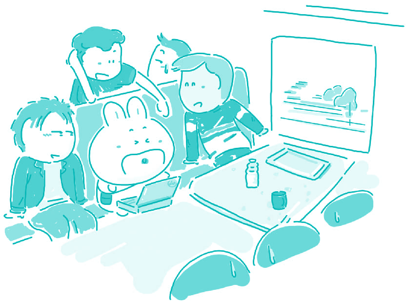

> ###  译文

> **171. 外出一年，除生活必须品外你会带上一件什么东西随行？**

> 在计划一次离家很久的旅行时，我们必须决定随身携带哪些物品。在考虑这个问题时我做过很多设想，诸如一本家庭影集、我的日记、我收藏的音乐以及很多其他东西。最终，我意识到在长期旅行时最应该带的东西是我的手提电脑。

> 手提电脑可以起到日记本的作用。实际上，因为能够分类记录我们的经历，它能够比日记本更好地完成任务。运用这种附加功能，我能够在文字中加入用网络摄像头拍摄的图片和通过内置麦克风录制的声音。因为有各种各样可供电脑使用的软件，还增加了把我的经历传上网页并把它们发表在互联网上的可能性。

> 在旅行或者居住在国外的时候，会经常需要和爱人或者同事联系。尽管国际长途的通话费用在不断下降，但长途电话单上的费用还是会很快增长。而手提电脑又能够解决这个问题。通过相对而言并不昂贵的上网费用，一个人能够拥有电脑最为强大的功能之一：通讯。这种通讯方式还附加了可以看见交流对象的功能，而且还能让人分享文件、信息甚至程序。

> 来到一个新的城市可能会让人感到孤单，而且可能需要相当长的时间去适应一个新的环境并且交到朋友。在这个过渡时期里，手提电脑可以在娱乐方面给我提供帮助：读一本电子书、玩一个电脑游戏或者看DVD都可以在手提电脑上完成。自娱自乐也可以是在坐长途汽车或者乘飞机时消磨时间的绝佳方式。

> 因此，无论是短程还是长途旅行，我都会把手提电脑作为最终的旅行伴侣。个人电脑似乎能够解决由旅行引起的很多问题。 

###  Word List

 * laptop ［ˈlæpˌta:p］ n. 便携式电脑；手提电脑
 * in spite of 尽管
 * harness ［ˈha:nis］ v. 控制
 * album ［ˈælbəm］ n. 影集；相册
 * attribute ［əˈtribju:t］ n. 特征
 * journal ［ˈdʒə:nəl］ n. 日记
 * transitional ［trænˈziʃənəl］ adj. 过渡期的
 * catalogue ［ˈkætəlɔ:g］ v. 编目录
 * posit ［ˈpa:zit］ v. 断定；论断；假定
 * functionality ［ˌfʌŋkəʃəˈnæləti］ n. 功能性
 * ultimate ［ˈʌltəmit］ adj. 最后的；最终的
 * voyage ［ˈvɔiidʒ］ n. 长途旅行
 * built in 内置的
 * microphone ［ˈmaikrəˌfəun］ n. 麦克风；扩音器 

## 172. How can schools help new students with their problems?

Moving to a new school is often a traumatizing experience. The student must go through the sometimes arduous process of making new friends, while attempting to keep up with school and keep in touch with old friends. There are many ways in which the school could help ease this process.

In order to make new students feel less anxious about their new surroundings, it would be beneficial for the school to start a welcoming committee. Such a committee would include students from all age levels, who are particularly friendly. The committee would organize small events during lunch hours and after school to help the new student feel at home. For example, the committee could organize a lunch followed by a tour of the playground. This would allow the new student to make new friends.

Schools should also train teachers on how to properly deal with new students. The first thing the teachers should do is to attempt to seat the new student around others who will be a good influence on him/her. This is of utmost importance, as a young student must be encouraged to socialize with smart, friendly students who have a strong work ethic.

Furthermore, a teacher must ensure that the student has a firm grasp of all the topics being taught. It is possible that the student's previous school taught different subject matter, or worked at a slower pace. The student might need extra help to catch up with the rest of the students. Conversely, a new student might be more advanced than the other students at his/her new school. If this is the case, the teacher must organize activities for the student so he/she does not become disinterested in learning.

In sum, schools can greatly facilitate a student's arrival to their premises. By enlisting the help of the students and properly instructing the teachers on how to deal with such situations, the student will feel welcome and at home in his new environment.

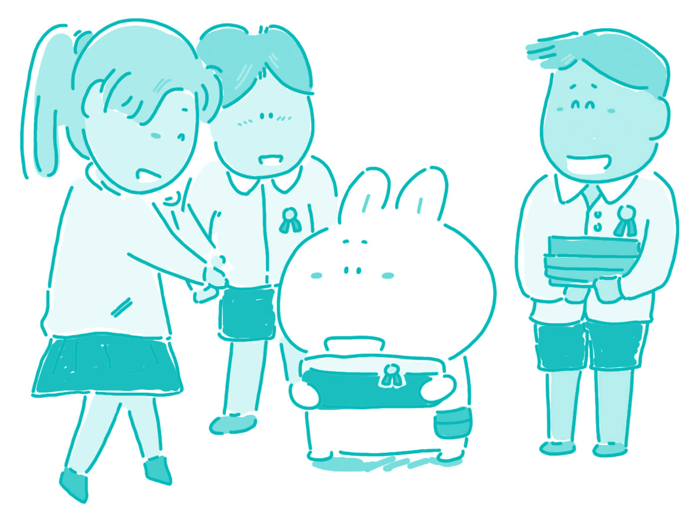

> ###  译文

> **172. 学校如何帮助新生面对困难？**

> 换到一所新的学校经常会是一种精神受到创伤的经历。有时候学生必须经历艰辛的结交新朋友的过程，同时还要努力赶上学校的课程并且和老朋友保持联系。学校可以采取很多方式来帮助学生减轻这个过程中的痛苦。

> 为了让新来的学生对新的环境感到不那么紧张，学校应该成立一个欢迎委员会。这样一个委员会应该包括各个年龄阶段的待人特别友好的学生。委员会可以在午餐时间或者放学之后组织一些小型的活动，来帮助新来的学生感觉自在。比如，委员会可以组织一次午餐，随后去参观操场。这样就能让新来的学生们结交新的朋友。

> 学校也应该就如何妥善安排新来的学生对教师们进行培训。教师们首先应该尽量把新学生的座位安排在那些可能对他或她产生良好影响的同学旁边。这是非常重要的，因为必须鼓励一个新来的学生和聪明、友好而且有很好道德规范的那些学生打成一片。

> 此外，教师还应该确保新来的学生能够很好地掌握正在教授的全部内容。新学生以前的学校里很可能会教授不同的科目内容，或者学习的进度比较慢。他们会需要额外的帮助以便能够赶上其他学生。相反，新学生也可能比新学校里的同学们水平更高。如果是这样，教师必须给新学生组织活动，防止他产生厌学情绪。

> 总而言之，学校能够极大地帮助学生达到他们的目标。通过学生的帮助以及合理指导教师如何处理这种情况，学校能让新学生在新的环境中觉得受欢迎和舒适。

###  Word List

 * traumatizing ［ˈtrauməˌtaiziŋ］ adj. 受到心理创伤的
 * utmost ［ˈʌtˌməust］ adj. 极度的
 * socialize ［ˈsəuʃəˌlaiz］ v. 使社会化
 * arduous ［ˈa:dʒuəs］ adj. 费劲的；艰辛的
 * ethic ［ˈeθik］ n. 道德规范
 * attempt ［əˈtempt］ v. 尝试；企图
 * catch up with 赶上
 * keep in touch with 与…保持联络
 * conversely ［ˈkənvə:sli］ adv. 相反地
 * feel at home 感觉自在
 * facilitate ［fəˈsiliˌteit］ v. 帮助；促进
 * influence ［ˈinfluəns］ n. 影响
 * premise ［ˈpremis］ n. 前提

## 173. Can borrowing money from a friend harm the friendship?

There is a popular saying that if you lend a book to a friend, you lose the book and the friend. Truer words have never been spoken. Borrowing anything, especially money, can put a high level of stress on one's friendship, and is usually not worth the pain.

The first reason why borrowing money from a friend is not a good idea is because if one forgets or does not pay back the friend, the friendship could be lost. Everyone has a busy life, and it is easy to forget details. If one borrows 100 yuan from a friend, he/she can easily forget about the situation, or perhaps even think he/she has already paid back his/her friend when he/she didn't. This, of course, leads to trouble in the relationship. The friend does not know whether to ask for the money or not, as doing so could be conceived as rude.

The lender can only wait so long before he/she believes that the borrower has forgotten about the debt. At this point, the lender will begin to ask the borrower for the money, which, as mentioned above, is an uncomfortable situation. The lender does not want to have to ask for the money back, and the borrower does not want to be reminded that he/she is indebted to someone.

Finally, asking a friend for money is a bad idea because it is possible he/she will refuse your request. For example, if a poor person befriend a rich person, the poor man might ask his/her friend for money. If the rich person would rather not lend out his/her money, he/she is put in the awkward situation of having to refuse his/her friend, which could harm the friendship.

Overall, I think it is a terrible idea to borrow money from friends, or lend money if it is requested. While we would like to think that our friendships are strong and true, in many cases, they are not. If you do lend money to a friend, perhaps it is best not to expect to be repaid. By treating the situation like this, one will not be upset if a friend does not return the money, and will have a pleasant surprise if the money is repaid.

> ###  译文

> **173. 向朋友借钱会伤害友情吗？**

> 有一种说法非常流行：如果你把一本书借给一个朋友，你会连书带朋友都丢了。这话真是太正确了。借任何东西，特别是钱，会给一个人的友谊带来很大的压力，而且还常常不值得这样的痛苦。

> 从朋友那借钱不是个好主意，第一个理由是，如果一个人忘记还钱或者根本就不还，那么友情便可能丧失。每个人的生活都很忙，因此也容易忘记一些细节。要是一个人从朋友那借了一百元钱，他或她便很容易把这件事给忘记，或者会以为已经把钱还给了朋友，而实际上他没有这么做，这当然会给友情带来麻烦，而且朋友会不确定到底该不该要他或她还钱，因为要别人还钱可能会被认为是粗鲁的表现。

> 借出钱的人会一直等到他或她认为借用人已经把借钱的事忘记时，才会开口问借用人要钱，而这种情况就像上面说到的那样会令人不舒服。借出钱的人不想被迫去要人还钱，而借用人也不想被人提醒说自己还欠着债。

> 最后，问人借钱很不好是因为对方有可能会拒绝你的要求。例如，一个穷人和一个有钱人是朋友，穷人可能会问有钱人借钱，如果那个有钱人不想借的话，他或她便会因为要拒绝对方而陷入很为难的境地，这样就可能会对友情造成伤害。

> 总的来说，我认为问朋友借钱或借给朋友钱是个很不好的想法。虽然我们总认为我们的友情坚实而真诚，但在很多情况下事实并非如此。如果你确实要借钱给朋友，最好是不要期待他会还。如此对待这种情况，一个人才不会因为朋友借钱不还而感到沮丧，也才会因为对方还钱而感到惊喜。

###  Word List

 * uncomfortable ［ʌnˈkʌmfətəbəl］adj. 不舒服的
 * put stress on 施加压力
 * worth ［wə:θ］ v. 值得
 * detail ［diˈteil］ n. 细节
 * indebted ［inˈdetid］ adj. 负债的
 * pay back 归还
 * request ［riˈkwest］ v. 要求
 * conceive ［kənˈsi:v］ v. 认为
 * awkward ［ˈɔ:kwəd］ adj. 窘迫的
 * treat ［tri:t］ v. 对待

## 174. How is your generation different from your parents' generation?

The world is changing and developing at a faster and faster rate all the time. Because of this, the difference between children and their parents is becoming more pronounced with each new generation. In today's society, there are many differences between the age groups.

When our parents were growing up, the world was filled with turmoil. They were born into a time of war, and generally, lived through a very difficult era. Therefore, our parents are very careful to prevent accidents before they happen, and never act spontaneously. Our parents are very careful with how they spend their money, and do not spend much time relaxing. On the other hand, the current generation has grown up in a very safe, peaceful environment. We do not spend our time worrying about the future; instead, our time is spent enjoying the present.

Second, our methods of entertainment are very different from our parents. Television, computers and the Internet are relatively new inventions. Our parents did not have such luxuries when they were growing up. Instead, they spent their free time outside, going on hikes around the city, or on bike rides. Today, most young people spend their free time inside, either watching television or playing computer games. Outdoor activities are usually saved for special occasions, such as trips outside the city.

The final way that today's generation is different from the previous one is seen in how we view change and progress. As mentioned above, our parents do not enjoy living spontaneously. They like to have a set schedule, and follow it every day. Young people, however, like their lives to be full of adventure. They enjoy searching out the unknown. For example, many students spend copious amounts of time learning English so they can go abroad to a foreign university. Many of our parents will not even get on an airplane to travel across China, not to mention traveling to another continent!

In conclusion, I believe that children are vastly different from their parents in today's society. Young people do not have to struggle to live; everything comes easily to them. The older generation, however, had a much more difficult life. Such large differences in lifestyle have created a very wide generation gap.

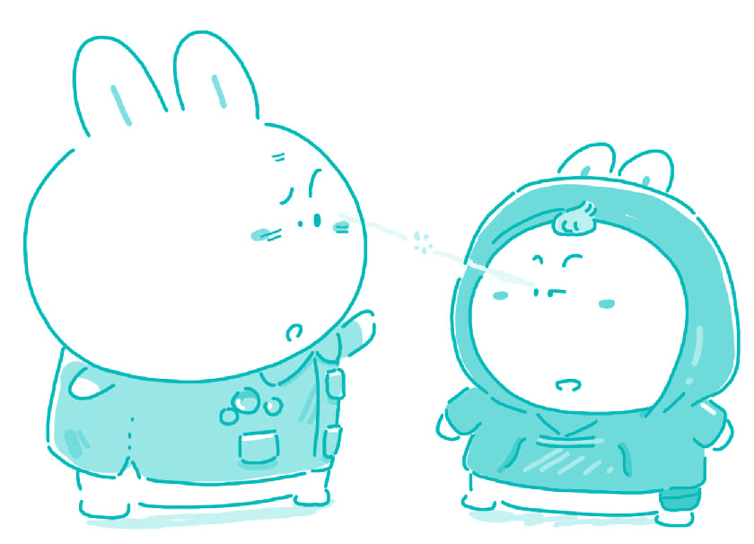

> ###  译文

> **174. 你们这一代与父辈们有何不同？**

> 世界正以越来越快的速度不断变化发展着。因此，每一年代的孩子和父母之间的差异变得越来越明显。在今日的社会，各个年龄群之间存在着很多差异。

> 我们父母在成长的时候，这个世界充满了动荡。他们生在战争年代，而且大多人都经历了艰苦的时期。因此我们的父母都非常谨慎小心，在事故发生之前杜绝它们，他们从不会贸然行动。我们的父母对怎样花钱的事非常仔细，并且很少把时间花在休闲上面。相比之下，我们这代人却是成长在和平安定的环境之中，不会花时间为未来担忧；相反，还会把时间花在享受现在上面。

> 其次，我们这代人的娱乐方式同我们的父辈有了很大的差异。电视、电脑和网络相对来说都是些新发明。我们父母在成长时没有这些奢侈品，他们会在室外度过闲暇时光：在城市中远足或者骑车。而今天，大多数年轻人都在家里修闲，要么看电视要么玩电脑游戏。户外活动常常留到了特殊的场合，比如离开城市去旅行。

> 今天的这代人与上一代人的最后一个不同是各自对待变化和进步的看法观点不同。就像上面说到的，我们的父母不会随时享受生活，他们喜欢做一个安排，并且每天都跟着安排走。而年轻人却喜欢生活中充满冒险。他们喜欢去追寻未知事物，例如，有很多学生花非常多的时间来学习英语，这样他们能去一所外国的大学念书。而我们父母中有很多甚至连坐飞机在国内旅行都不愿意，更别说去其他大洲了。

> 总之，我认为在今天这个社会孩子们和父母有着相当大的差异。年轻人不需要为生活去努力奋斗，一切都得到得很容易。而老一辈的人却经历过比这艰苦很多的生活。两代人生活方式有着如此大的差异，也就造成了很深的代沟。

###  Word List

 * rate ［reit］ n. 速度
 * relatively ［ˈrelətivli］ adv. 相关地
 * pronounced ［prəˈnaunst］ adj. 显著的
 * luxury ［ˈlʌgʒəri］ n. 奢侈品
 * generation ［ˌdʒenəˈreiʃən］ n. 一代人
 * hike ［haik］ n. 远足
 * be filled with 充满
 * occasion ［əˈkeiʒən］ n. 场合
 * turmoil ［ˈtə:ˌmɔil］ n. 动乱
 * copious ［ˈkəupjəs］ adj. 很多的
 * era ［ˈiərə］ n. 时代
 * spontaneously ［spa:nˈteiniəsli］ adv. 即兴地

## 175. Classes: teachers lecture or students do some of the talking?

There are basically two types of classes in university, classes, i.e., where teachers lecture and where the students do some of the talking. Both teaching and learning approaches are valuable and have their own relative merits.

Classes that are dominated by teachers' lectures may benefits students in several ways. First of all, lectures can communicate the intrinsic interest of the subject matter. The speaker can convey personal enthusiasm in a way that no book or other media can. Enthusiasm stimulates interest, and it is an undeniable fact that interested, stimulated people tend to learn more. Moreover, lectures in university settings can provide students with role models of scholars in action. The professor's way of approaching knowledge can be demonstrated for students to emulate. Furthermore, lectures can organize material in a special way. They may provide a faster, simpler method of presenting information to an audience with its own special needs. Lectures are particularly useful for students who read poorly or who are unable to organize print material.

On the other hand, lecture approaches also have some relevant weaknesses. For example, the lecture often puts students in a passive rather than an active role. As is often the case, passivity can hinder learning. At the same time, most lectures assume that all students are learning at the same pace and at the same level of understanding, which is hardly ever true. Especially, Lectures place the burden of organizing and synthesizing content solely on the lecturer. They are not well suited to higher levels of learning such as application, analysis, and synthesis. Lectures require an effective speaker who can vary tone, pitch, and pace of delivery. Lecturers must be verbally fluent, a skill that is not stressed nor learned in many Ph.D. programs and is usually distributed unevenly among people. Lectures are therefore sometimes not well suited to complex, detailed, or abstract material.

In summary, Lecturing is probably the oldest teaching method and remains the most common form of instruction, despite the fact that some research has shown that lecturing is ineffective, especially if not combined with some alternative style of teaching. In fact, Lecturing is very appropriate for some goals and very inappropriate for others. And at the same time, the counterpart —the approach that allows students to participate discussions is equally non-universal. Therefore, I can hardly simply say that I prefer either approach. I think the choice should depend on circumstances including factors such as the subject that is to learn, the depth that needs to explore, the quality that the lecturer or the discussing group have.

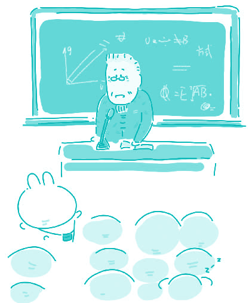

> ###  译文

> **175. 课堂授课：全由老师讲授，还是学生参与部分讨论？**

> 大学里主要有两种基本的授课方式：教师讲授和学生参与讨论。这两种教学方式都是很有价值的，并且各有长处。

> 以教师讲授为主的上课方式对学生有几个方面的好处。首先，演讲的形式可以传达出所涉及主题的内在的乐趣。演讲者能够激发出听众的热情，而这是书本和其他媒体所做不到的。热情又能进一步激发兴趣。不能否认，人在有兴趣又有热情的时候最能学到东西。此外，大学里进行演讲的形式可以给学生们树立一个如何做好一名学者的榜样。教授是如何传授知识的，学生们便能以此为范例进行效仿。说得更远一些，演讲的形式有其特殊的组织材料的方式。它能根据听众的自身需要更快速、更简洁地向他们提供和呈现信息。对阅读能力较差和不善于组织印刷品的学生而言，演讲的形式就更显出其优越性。

> 另一方面，演讲的形式也有其相对的不足之处。比如，学生在其中扮演相对被动的而不是积极的角色。而通常来说被动的状态对学习知识是不利的。而且，大多数讲座都是以学生们具有同样的学习进度和同等的理解水平为前提的，而事实却从来都并非如此。尤其是，演讲的形式把组织和综合讲课内容的任务都交给了讲课者。而对于那些较高程度的学习，例如应用、分析或者综合能力,也是不太适合的。演讲必须有一个好的演讲者，能够随时变换语调、讨论的对象和讲授的进度。演讲者必须要口齿流利，这样的技能在博士生的教学中不被重视也不教授，而每个人在这方面也是天生有长有短。因此，演讲有时并不很适合那些复杂的、详细的或者抽象的内容。

> 总之，演讲大概是最古老的教学方式，并且一直是最常运用的教学方式，尽管研究事实表明演讲的方式效率不高，特别是当其没有别的教学方式相配合的时候。实际上，演讲的方式非常适合一些目标，而要达到另一些目的，演讲就不适合了。相应的，让学生参与讨论的方式也并非处处适用。因此，我很难说我更喜欢哪种方式。我认为应该根据不同情况做出不同选择，要考虑各种各样的因素，比如学习主题、探讨深度以及讲师或讨论者的水平等等。

###  Word List

 * approach ［əˈprəutʃ］ n. 方法
 * passive ［ˈpæsiv］ adj. 被动的
 * merit ［ˈmerit］ n. 优点
 * hinder ［ˈhində］ v. 干扰
 * intrinsic ［inˈtrinzik］ adj. 内在的
 * synthesize ［ˈsinθiˌsaiz］ v. 综合
 * convey ［kənˈvei］ v. 传达
 * be suited to 适合于
 * enthusiasm ［enˈθu:ziæzəm］ n. 热情
 * application ［ˌæpliˈkeiʃən］ n. 应用
 * stimulate ［ˈstimjəˌleit］ v. 激发
 * analysis ［əˈnælisis］ n. 分析
 * undeniable ［ˌʌndiˈnaiəbəl］ adj. 不可否认的
 * alternative ［ɔ:lˈtə:nətiv］ n. 选择
 * appropriate ［əˈprəuprieit］ adj. 适当的
 * emulate ［ˈemjəˌleit］ v. 仿效
 * counterpart ［ˈkauntəˌpa:t］ n. 对应
 * audience ［ˈɔ:diəns］ n. 听众
 * participate ［pa:ˈtisəˌpeit］ v. 参与
 * relevant ［ˈreləvənt］ adj. 有关的
 * explore ［iksˈplɔ:］ v. 探究

## 176. If you could create a new holiday, what person or event would it honor and how would you want p

Holidays are an excellent way to allow societies to honor people or events that have helped their country or the world. There are many things that deserve to be recognized in our culture, but there is one group of people that is underappreciated in society today: inventors. If I were to create a new holiday, it would be to pay respect to these important people and their creations.

Inventors are members of the most unappreciated profession in society today. Without inventors, all civilizations would still be living in the stone age, with no running water, no electricity, and more generally, no comforts. Many inventors create simple objects that do not seem that amazing, but upon closer inspection, one realizes that all inventions contribute greatly to convenience. All societies should pay homage to these great people by honoring them with a holiday.

The first way we could honor inventors is by opening exhibitions in galleries and museums dedicated to the inventions of current and past inventors. Many people have no idea where the greatest inventions came from. By displaying the life work of inventors, people will gain a new appreciation for them. This would also be a learning experience for the public, as they could see what current inventors are working on, and get excited about the upcoming progresses in society.

We could also honor inventors by having a school day dedicated to inventions. It is important to encourage school-aged children to use their imagination to come up with inventions of their own. The school system is excellent in China, but it does not promote free thinking. Children need to be given the opportunity to discover new creations on their own. By having a day dedicated to this, young people would become more interested in the manufacturing of new products and ideas.

So, I believe that inventors deserve their own holiday. They have provided society with so much comfort and convenience. By honoring inventors, we will show them how much we appreciate their efforts, as well as encourage our children to come up with new ideas of their own.

> ###  译文

> **176. 如果你能创立一个节日，你会以此来纪念何人或何事？你想要人们如何来过这个节日？**

> 节日是一种用来纪念那些对国家或世界做出贡献者的非常好的方式。在我们的文化中有很多人和事值得我们称道，可是在今天的社会，有一类人却没有得到人们足够的欣赏，他们就是发明家。如果让我来创立一个新的节日，我会用这个节日来向这些重要人物和他们的发明表示敬重。

> 在今天的社会中，发明家是最得不到人们足够赏识的职业之一。如果没有发明家，所有的社会文明都将停留在石器时代，没有自来水、没有电、更没有舒适的生活。许多发明家发明的物品很简单，而且看起来也不是那么了不起，但是只要你更仔细地观察，便会发现所有的发明其实都给我们带来了极大的便利。所以，每个社会都应该用创立节日的方式，来表达对这些了不起的发明家们的敬意。

> 纪念发明家的第一种方式，是通过在美术馆和博物馆举办展览，来展现过去和当今的发明家及他们的成就。很多人对一些伟大的发明是如何诞生这一问题知之甚少。通过展现发明家们的生平成就，人们能从一个新的角度来欣赏他们。而对公众来说，这也将是一次学习的经历，从中他们能了解到当今的发明家们正在致力的研究，并为社会即将迎来的进步而感到欣喜。

> 我们也可以通过举行校园发明日的方式来纪念发明家。鼓励学龄儿童用自己的想象力去寻找属于他们自己的新发明创造，这是很重要的。中国的教育系统很出色，只是缺少对自由思考的提倡。儿童需要得到依靠自己去发现新发明新创造的机会。通过举办这样的发明日，年轻人会对开发新产品和新点子更加感兴趣。

> 因此，我认为应当为发明家们设立节日。他们为社会提供了那么多的舒适和便利。通过纪念发明家，我们将向他们传达我们的欣赏之情，并能借此鼓励我们的孩子去寻找他们自己的新想法。 

###  Word List

 * deserve ［diˈzə:v］ v. 值得
 * contribute ［kənˈtribju:t］ v. 贡献
 * underappreciated［ ˌʌndərəˈpri:ʃieitid］ adj. 未受到充分赏识（欣赏）的
 * homage ［ˈha:midʒ］ n. 敬意
 * gallery ［ˈgæləri］ n. 美术馆
 * pay respect to 表达敬意
 * dedicate to 用于
 * creation ［kriˈeiʃən］ n. 创造
 * progress ［ˈprəu:ˌgres］ n. 进展
 * profession ［prəˈfeʃən］ n. 职业
 * promote ［prəˈməut］ v. 提倡
 * stone age 石器时代
 * manufacturing ［ˌmænjəˈfæktʃəriŋ］n.制造
 * inspection ［inˈspekʃən］ n. 观察

## 177. The advice you would give your friend on how to use his or her money

Receiving money is always an unexpected delight. Making the decision of how to spend this money is always a difficult choice. What it comes down to, however, is the individual's personal preferences, lifestyle, and priorities. If one of my friends has to choose between buying a car and going on vacation, I would carefully consider their lifestyle and advise them based on their wants and needs.

Living in a city can be a very high-paced, stressful way to live. Having a car would bring many conveniences that would make the experience much more enjoyable. First and foremost, a car can get you around the city very quickly and directly. This would be an important factor if my friend goes to school or works far away from home. Second, a car offers privacy. If my friend does not enjoy public places, then a car would be an excellent option. Cars also have their disadvantages. A car has many additional costs beyond the initial expense of buying one. One must pay for insurance, gasoline, and any incidental fees such as repairs. If my friend does not have a lot of extra money besides his/her inheritance, a car may not be the best option.

A vacation is also an excellent decision. If my friend works at a high-stress job, then a vacation is sometimes the only way to relax and forget about one's worries in the work world. Vacations to faraway lands can give a person more perspective on the world, and can also provide excellent memories. However, vacations always have to end, and one must return to his/her everyday life.

Therefore, I think that if my friend lives far away from his/her work or school and has a little bit of extra money, then a car would be the best option. However, if he/she lives near his/her work and holds a high-stress position, I would suggest that a vacation would be a better option. As mentioned above, how we spend our money is a very personal decision, based on one's own priorities. In the end, only my friend can decide what is best for him/her.

> ###  译文

> **177. 向朋友建议如何使用一笔钱**

> 得到钱财常常会带来意外之喜，而如何去花这些钱又总是个很难做出的决定。但是花钱所体现出来的却是一个人的喜好、生活方式和优先考虑的事。如果我的一个朋友要在购买轿车和外出度假之间做一个选择的话，我会仔细考虑他们的生活方式，并会根据他们的需求来提供建议。

> 生活在城市中可能会觉得节奏快、压力大。拥有一辆轿车能为工作生活带来诸多便利，从而也使人们的生活更值得享受。首先也最重要的，是拥有一辆车能使你在城市中的行动便利快捷。如果我的朋友要到离家很远的地方去读书或者工作，这便是选择买车的一个重要的因素。其次，拥有车能提供独处而不受干扰的机会。如果我的朋友不太喜欢公共场合，那么拥有一辆轿车便是一个上乘的选择。当然，买了车也会有诸多不好的方面。比如，用于一辆车的额外开销要远远超过买车的钱。你得购买保险和汽油，还得为诸如维修之类的事情额外花钱。如果我的朋友除了遗产之外的额外资金并不多，那么购买一辆车就不是最好的选择了。

> 去度假也是一个很好的决定。如果我的朋友所承受的工作压力很大，那么选择度假有时便成了惟一能让人放松和忘记工作世界里烦恼的方式了。到遥远的地方度假能让一个人开阔眼界，并能留下美好的回忆。但是，度假总有结束的时候，人也总得重新回到日常生活当中。

> 因此，我认为如果我的朋友住的地方离工作或学校很远，并且手里有一些额外资金的话，那么买一辆车便是最好的选择。但是，如果朋友住的地方离工作的地方近，而且有一份压力很大的工作，那么我建议选择度假会更好。如上所述，如何花销我们的钱是一个非常私人的决定，要基于个人的优先考虑。最终，还是我的朋友自己才能决定什么对他或她才是最好的选择。 

###  Word List

 * unexpected delight 意外之喜
 * insurance ［inˈʃuərəns］ n. 保险
 * come down to 涉及到
 * gasoline ［ˈgæsəˌli:n］ n. 汽油
 * priority ［praiˈɔriti］ n. 优先考虑的事
 * incidental ［ˌinsiˈdentl］ adj. 附带的
 * privacy ［ˈpraivəsi］ n. 独处而不受干扰
 * extra ［ˈekstrə］ adj. 额外的
 * disadvantage ［ˌdisədˈvæntidʒ］ n. 不利之处
 * high-stress ［ˌhaiˈstres］ adj. 压力大的
 * perspective ［pəˈspektiv］ n. 看法
 * additional ［əˈdiʃənl］ adj. 另外的
 * position ［pəˈziʃən］ n. 职位
 * initial ［iˈniʃəl］ adj. 最初的

## 178. What changes the 21st century will bring?

Technology is being developed at an unprecedented speed. The 21st century is bound to be very different from the previous one, as we can expect that the speed at which new technologies are invented and expanded upon will continue to increase. I believe that the major changes that we will see in the century will be found in environmental issues, health issues and knowledge access.

The situation of the environment in today's society is precarious at best. The world is continuing to build new and more wasteful production plants, filling the atmosphere with poisonous gases. There are many environmental scientists working to create new ways of cleaning our air. I believe that these technologies will apex in the 21st century, thus solving the world's pollution problem. In addition to this, I also believe that we will come up with new, less dangerous methods of producing the goods we have come to depend on.

Many new diseases have been discovered in the last fifty years. AIDS and SARS are excellent examples of this terrible fact, and alone, these two viruses have killed a large number of people. Cancer and heart disease have also become much more widespread in the last hundred years, shortening the lifespan of millions of people. Doctors are working all over the world in hopes of eradicating these diseases. Every day they come one step closer to finding cures to all of the above-mentioned ailments, and many others.

Moreover, our ability to access knowledge will become much more advanced in this century. More and more countries are getting"plugged in" to the Internet, and are adding their information to the vast collection of knowledge already found on this medium. The sharing of knowledge will also help to increase literacy around the world. People will be more interested in having this skill if it means they can have better, more efficient means of communicating.

In conclusion, I am very optimistic about the changes that will come during this century. Environmental issues will cease to be a problem, people will be able to live longer, richer lives with the eradication of diseases, and more people will be able to share knowledge due to the advancement of the Internet. Everyone has good reason to be excited in this fast-paced, evolving time.

> ###  译文

> **178. 21世纪会带来什么变化？**

> 科技正以前所未有的速度发展着。二十一世纪必定与上一个世纪有很大的不同，因此我们可以期待新技术的开发和传播速度会继续加快。我认为这个世纪主要的变化会集中在环境问题、健康问题和对知识的获取上。

> 在今天的社会，环境的状况正处于最不稳定的时期。全世界正不断建造更多的产生废物的工厂，它们向大气中排放有毒气体。许多环境科学家正在努力研究新途径以净化我们的空气。我相信这些科技会成为二十一世纪的先锋，并因此解决全世界的环境污染问题。除此之外，我也相信我们会寻找到新的、危害性更小的方法来生产我们赖以生存的产品。

> 在过去的五十年中出现了许多种新的疾病。艾滋病和非典型性肺炎就是两个能反映这种不良情况的极好例子，而且仅仅是这两种病毒就已经造成了很多人的死亡。在过去的百余年中，癌症和心脏疾病也变得越来越普遍，它们缩短了数百万人的寿命。为了铲除这些疾病，世界各地的医生都在为之努力。每一天，他们都在寻求治疗以上提到的以及许多其他疾病的征途上一步一步地前进。

> 更重要的是，在这个世纪我们获取知识的途径将变得更加先进。越来越多的国家都将自己“连接”到了互联网上，并在这个已经拥有巨大知识信息储存的媒介中添加自己的信息。知识的共享将有助于在世界范围内提高人们的文化素养。只要这种技能可以提供更完善、更有效率的沟通，人们便会更有兴趣掌握它。

> 总得来说，我对这个世纪中即将到来的变化持非常乐观的态度。环境问题将不再成为一个问题，人们会因为疾病的消灭而活得更长久更富足，更多人会因为互联网的进步而能够共享知识。每个人都有美好的理由为高速前进的时代感到欣喜。

###  Word List

 * unprecedented ［ʌnˈpresiˌdəntid］ adj. 前所未有的
 * lifespan ［ˈlaifspæn］ n. 寿命
 * eradicate ［iˈrædiˌkeit］ v. 根除
 * be bound to 必然要
 * ailment ［ˈeilmənt］ n. 疾病
 * expand ［ikˈspænd］ v. 扩张
 * advanced ［ædˈvænst］ adj. 高级的
 * precarious ［priˈkεəriəs］ adj. 不稳定的
 * plug in 插入
 * apex ［ˈeipeks］ n. 顶点
 * literacy ［ˈlitərəsi］ n. 文化教养，识字
 * AIDS ［eidz］ n. 艾滋病
 * medium ［ˈmi:diəm］ n. 媒介
 * SARS ［sa:s］ n. 非典型性肺炎
 * optimistic ［ˌa:ptəˈmistik］ adj. 乐观的
 * widespread ［ˈwaidˈspred］ adj. 普遍的

## 179. What makes a good parent?

Being a parent is the oldest job in existence. Even in the time of the cavemen, it was important to be a good parent. What it means to be a good parent has evolved greatly over the years. In today's society, however, I believe that there are three important characteristics that indicate whether a person is a good parent or not.

The first of these traits is the capacity for love. Children must feel loved by their parents if they are going to grow into well-developed, stable adults. Children who grow up in a house filled with love are relaxed and peaceful, and do not cause trouble. These children demonstrate good social skills, and are usually wellliked by others. In contrast, it has been shown that children who grow up in unloving families are anxious and mean-spirited.

Trust is also very important for a child's development. If a parent is always prying into a child's privacy, the child will think he/she is doing something wrong to deserve such mistrust. This leads to the child hiding things from the parent, which therefore leads to dishonesty. Also, trust leads to independence. When children are trusted, they feel more pressure to keep that trust, and therefore act honestly. They will make wise decisions, which will allow them to grow into independent adults.

It is also of utmost importance for a parent to have a well-developed sense of responsibility. A parent must be able to be present for the child twenty-four hours a day, seven days a week. The parent must organize everything for a child, especially one under the age of ten. This requires careful planning and multitasking. If a person is ready to become a parent, they must be ready for all of these added responsibilities.

In conclusion, a good parent has a large capacity for love, is trusting, and must be very responsible. Without these key attributes, the child will suffer and grow into a dysfunctional adult. One must take the job of parenting very seriously to ensure the child's healthy development. By harnessing the abovementioned qualities, parents will ensure that their child will be the best they can be.

> ###  译文

> **179. 好父母的品质是什么？**

> 为人父母是人类存在以来最古老的工作。即使是在人类穴居的时代，做一个好的家长也是很重要的。随着时间的推移，对于怎样才称得上是一个好家长已经有了很多变化发展。但是在今天这个社会，我认为有三方面的重要特征能体现出一个人是否算得上一个好家长。

> 这些特征中的第一个是付出爱的能力。孩子们要想茁壮成长为正常的成人，他们必须从父母那里得到爱。在一个充满爱的家庭中成长的孩子会表现得轻松安静，并且不会制造麻烦。事实证明这些孩子拥有良好的社交技能，并且通常会受到他人的喜欢。相比之下，那些在缺少爱的家庭中长大的孩子会焦虑不安并且品质卑劣。

> 信任对一个孩子的成长也尤为重要。如果一个家长总是打听孩子的隐私，孩子便会认为是因为自己做错了事才被如此地不信任。这会导致孩子对父母隐瞒自己的事情，从而变得不诚实。此外，信任能让孩子变得独立。当孩子受到信任时，他们会感到有压力去维持那份信任，因此也会表现得诚实，在做决定时也会更加明智。这种信任将有助于孩子成长为独立的成人。

> 父母还应该具备良好的责任感，这点至关重要。一周七天、一天二十四小时父母都应该陪伴着孩子，父母应该为孩子筹备一切，特别是对十岁以下的孩子，这需要细致的计划和多方面的工作。如果一个人准备为人父母，那么他们必须对所有这些伴随而来的责任做好准备。

> 总的说来，好的父母要有很强的爱心，要信任孩子，还要非常负责。没有这些关键的品质，孩子将会生活得很不好，而且长大后会品行不良。一个人必须认真严肃地对待为人父母的任务，以保障孩子的健康成长。只要拥有了上面提到的素质，父母便可以确保他们的孩子将会做到最好。

###  Word List

 * existence ［igˈzistəns］ n. 存在
 * in contrast 相反的
 * caveman ［ˈkevˌmæn］ n. 穴居人
 * mean spirited 品质卑劣的
 * evolve ［iˈva:lv］ v. 进展
 * utmost ［ˈʌtˌməust］ adj. 极度的
 * characteristic ［ˌkærəktəˈristik］ n. 特性
 * multi-tasking ［ˈmʌltiˌtæskiŋ］ adj. 任务繁多的
 * indicate ［ˈindiˌkeit］ v. 显示
 * trait ［treit］ n. 特性
 * attribute ［əˈtribju:t］ n. 品质
 * capacity ［kəˈpæsiti］ n. 能力
 * dysfunctional ［disˈfʌŋkʃənəl］ adj. 行为不端的
 * stable ［ˈsteibəl］ adj. 稳定的
 * demonstrate ［ˈdemənˌstreit］ v. 证明
 * harness ［ˈha:nis］ v. 具备

## 180. Why movies are so popular all over the world?

One of the most popular pastimes today is movie-going. With what started as moving-picture shows has dramatically developed into an industry that spends millions upon millions of dollars while still turning a gigantic profit.

Movies are so popular because they are the most fascinating and easiest escape means from increasing pressure, which comes from family, school, working place, society, and so many other directions. Combined with acoustic and visual effect, movies are definitely more appealing for audiences who have exhausted themselves in the real world than are those printed novels. It must have been much easier to see a movie than to read a novel, since all the audience should do is simply to sit there in a soft chair in the dark about 150 minutes. Captured, involved, the audience in a movie theater will forget everything but the story in action on the screen.

Movies have magic power to let people immerse themselves in fiction. The point is that almost everyone long for the power of snapping his/her fingers and seeing his/her wishes and dreams instantly granted. Everyone long for eternity of love, many idealize about it but now in the theater it's time to"feel" it. Every move the character makes, every breath the character takes, all seem to happen around, and clearly sensible. On the screen, no entire life needed, movies illustrate all aspects of love we can imagine: all aspects of love, from the mushy warm and fuzzy feelings we feel with our children and companion animals, to platonic love we have with friends and acquaintances, to the romantic soul mate kind of love, to the agape kind of unconditional love, it's the full gamut. Dramas are created in order for us to play out different sides of ourselves.

In short, movies are so popular because many can escape into the world of fantasy and live vicariously through the characters and in doing so, work out different feelings and emotions that they may not have the opportunity to do in their "normal" lives.

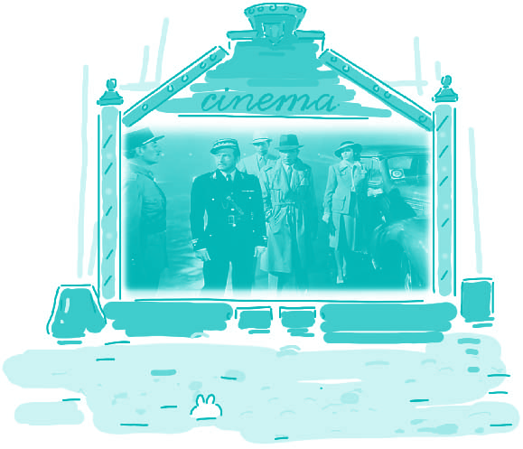

> ###  译文

> **180. 电影缘何在全球如此受欢迎？**

> 当今最受欢迎的消遣方式之一是看电影。以移动画面表演起步的电影已经极大程度地发展为一种工业，这种工业耗费美金无数，并能转变为巨大的收益。

> 电影之所以如此受欢迎，是因为它是一种供人们逃避不断增加的压力的最富娱乐性而又最简便的方式，这些压力来自家庭、学校、工作单位、社会和其他许多方面。对于那些在现实世界中精疲力尽的观众来说，集合了声音和视觉效果的电影比起印刷的小说确实具有更大的魅力。看一部电影绝对要比读一本小说容易，因为观众所要做的只是简单地坐在软软的椅子上，在黑暗里看上150分钟。在电影院中，观众被电影吸引并融入其中，除了屏幕上闪动的故事，他们会忘记一切。

> 电影拥有能让人沉浸于虚构的故事中的魔力。几乎每个人都渴望拥有一种力量，这力量能让你在弹指之间看到自己的愿望和梦想得到实现。每个人都渴望永恒的爱情，而很多人都只是将其做为理想，可是只要是在电影院，就可以切身“体验”这理想了。角色的一举一动和每一次呼吸，这一切看起来都正在我们周围发生着，并且还能够清晰地感觉到。屏幕上并不需要整个生命过程，电影诠释着我们所能想象的爱情的方方面面：这方方面面有我们从孩子们和动物伴侣那里感受到的温存和烦扰，有我们与朋友和熟人之间的柏拉图式的精神爱恋，有与心灵伴侣浪漫的爱恋，也有教友之间无私的情感，所有一切都在其中。戏剧被创造出来的目的就是要让我们去演绎出我们自身的不同方面。

###  Word List

 * pastime ［ˈpæstaim］ n. 娱乐消遣方式
 * immerse ［iˈmə:s］ v. 沉浸于
 * dramatically ［drəˈmætikəli］ adv. 极度地
 * long for 渴望
 * gigantic ［dʒaiˈgæntik］ adj. 巨大的
 * eternity ［iˈtə:niti］ n. 永恒
 * fascinating ［ˈfæsəˌneitiŋ］ adj. 令人着迷的
 * sensible ［ˈsensəbəl］ adj. 能感觉的
 * illustrate ［ˈiləˌstreit］ v. 诠释说明
 * acoustic ［əˈku:stik］ adj. 声音的
 * mushy ［ˈmʌʃi］ adj. 多情的
 * appealing ［əˈpi:liŋ］ adj. 吸引人的
 * fuzzy ［ˈfʌzi］ adj. 烦乱的
 * exhaust ［igˈzɔ:st］ v. （使）精疲力竭
 * acquaintance ［əˈkweintəns］ n. 相识的人
 * capture ［ˈkæptʃə］ v. 俘获
 * agape ［ˈægəpi:］ n. 兄弟情谊
 * involve ［inˈva:lv］ v. 陷入
 * work out 产生出

## 181. Land in your country: needs to be left in its natural condition or needs to be developed?

With a population accounting nearly for one quarter of the world population, my country, China, has been suffering from serious loss of arable land, which now hardly accounts for 7% of overall arable land of the world. Yet some people simply do not realize that land loss is so crucial that we one day might incapable of averting that catastrophe if we now close our eyes to it.

Industrial development without careful consideration regarding land preservation has caused problems more serious than people can ever imagine. Take the great Three Gorges dam for example, which will be put into operation next year. While the country benefits from gargantuan potential of electricity generation, we have to face up to various environmental conservation issues concerning geological and ecological environment along both river sides and whole upper reaches. The professional designers of the great dam now have to work out a practical way to prevent and remedy pollution effectively, which has already been the focus of world attention.

After the entrance of the WTO, industry development is more and more important for our country, yet we should be careful about the pollution which is inevitably caused by industry. Recent surveys have shown that refuse treatment engineering is not well financed in China, while attentions are drawn to those much more obvious achievements. Industrial pollution accidents occur far more frequently in our still developing country than in other more advanced countries. Urban population also produce astoundingly large amount of pollution. Today the alleged white pollution is creeping all over the country—people throw plastic bags, films everywhere, never feeling anything wrong.

We no doubt need land either for natural condition or for industry, and it seems we need more if possible. Nevertheless, we live in a world where everything has its cost, and some day in the future, I believe, we will inescapably pay for what we have ignored.

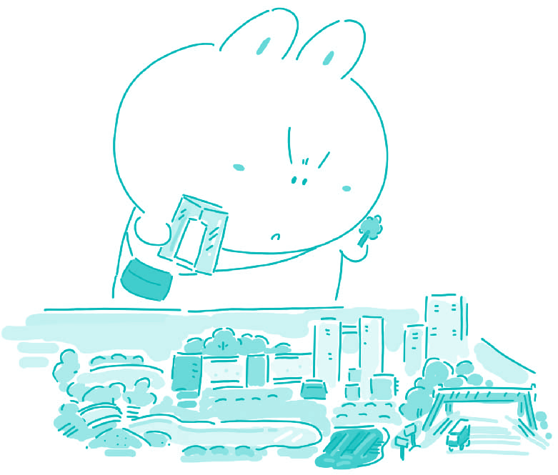

> ###  译文

> **181. 贵国的土地：保持原貌还是加以开发？**

> 我的祖国——中国的人口占世界总人口近四分之一，耕地面积却刚刚占到全世界耕地面积的百分之七，因此长期遭受到严重缺乏耕地的影响。但是，有些人却并没有意识到水土流失情形的严峻，如果我们现在对此视而不见，那么有一天我们可能会无法逆转这个灾难性的局面。

> 工业的发展忽视了对水土的保持，因此造成了严峻的水土问题，严峻程度甚至让人难以想象。拿明年将投入运行的三峡大坝为例，尽管国家将从水坝巨大的发电能力中获得利益，但是我们将不得不去面对可能出现在沿河和整个上游地区的各种各样的地质和生态环境问题。大坝的设计专家目前不得不设计出一个实际可行的方案，来有效阻止和补救环境破坏，这已经成为了全世界关注的焦点。

> 加入世界贸易组织之后，工业的发展对我们国家越来越重要，但同时我们应当警惕工业发展势必造成的污染。最近的调查显示，国家对废物处理工程的投入资金不够，而把更多的注意力都放在了那些容易获得明显成果的项目中去了。比起那些更为发达的国家，工业污染在我们这样的发展中国家发生得更为频繁。此外城市人口也造成了大量的污染。今天，人们所说的白色污染正在全国蔓延开来——人们随处丢弃塑料袋和胶卷，并且一点不觉得自己做错了。

> 无论是为了自然环境还是为了工业发展，毫无疑问我们都需要土地，而且如果可能的话应该需要更多。但是，我们生存的世界中一切都有其代价，将来的某一天，我想我们会无可回避地为我们所忽视过的问题付出代价。 

###  Word List

 * arable ［ˈærəbəl］ adj. 适合耕种的
 * geological ［dʒiəˈla:dʒikəl］ adj. 地质的
 * account for 占
 * ecological ［ˌekəˈla:dʒikəl］ adj. 生态的
 * crucial ［ˈkru:ʃəl］ adj. 至关紧要的
 * remedy ［ˈremidi］ v. 补救
 * incapable ［inˈkeipəbəl］ adj. 无能力的
 * WTO 世界贸易组织
 * avert ［əˈvə:t］ v. 转变
 * inevitably［ ˌinˈevitəbəli］ adv.不可避免地
 * catastrophe ［kəˈtæstrəfi］ n. 大祸
 * refuse treatment 垃圾处理
 * preservation ［ˌprezə:ˈveiʃən］ n. 保存
 * creep ［kri:p］ v. 蔓延
 * gargantuan ［ga:ˈgæntuən］ adj. 巨大的
 * inescapably ［ˌiniˈskeipəbəli］ adv. 无法逃避地
 * potential ［pəˈtenʃəl］ adj. 潜在的
 * electricity generation 发电

## 182. Should pets be treated as family members?

Throughout history, animals have always been great companions to man. In today's society, we frequently treat our pets as members of family, nursing them when they are sick, and playing with them when they are well. I believe that the relationships that people have with their pets are healthy for many reasons.

Firstly, animals provide companionship for people who are too old to maintain regular friendships. It is most common for one spouse to outlive the other. Frequently, the surviving spouse does not remarry, and eventually, all his or her friends die. When one is elderly, it is difficult to make new friends. In this type of situation, having a pet as a companion is greatly preferable to spending all of one's time alone. While a pet cannot speak, it can understand its master's emotions, and usually responds accordingly.

Secondly, animals have been proven to reduce their master's stress. This is probably because an animal is always happy to see its master, and gives the master unconditional love. As long as the master is kind to his/her pet, the pet will be devoted and faithful. A pet also provides a friendly face after a stressful day. For example, I have a pet dog. After taking an exam, the only thing I want to do is go home and play with my dog. He always brings me much needed cheer and happiness.

Lastly, having an animal can prepare a young couple for having children. A young animal is very difficult to take care of. Let us take the example of a puppy.

One can never leave a puppy by itself. A puppy must be constantly taken care of; he must be toilet-trained and disciplined. Raising an animal to be happy and sociable is very much like raising a child to possess the same attributes. While a puppy is obviously easier to take care of than a child, it can show the prospective parents where some of the difficulties will lie when raising a baby.

In conclusion, I think having a very close relationship with a pet is healthy. Having a pet can reduce loneliness, stress, and prepare one for the huge experience of having a child. Pets are often referred to as man's best friend, and for good reason.

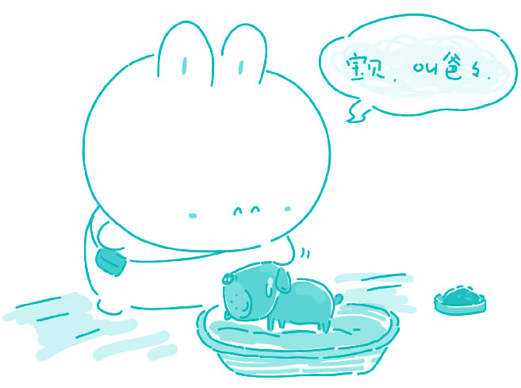

> ###  译文

> **182. 宠物应该被视为家庭成员吗？**

> 纵贯历史，动物一直是人类非常好的伙伴。在今天的社会，我们常常把宠物看成我们家庭中的成员。他们生病时我们会护理照料他们，他们身体好时我们会陪他们玩耍。我认为有诸多的理由可以表明人类和他们的宠物所建立的关系是健康的。

> 首先，动物能像朋友一样陪伴那些因为过于年迈而无法维系正常友谊的老人们。由于夫妻中的一方的寿命通常会比另一方长，而且很多时候健在的一方不会再婚，最终老人的朋友也会相继去世。一个人老了以后，便很难再交到新的朋友。在这样的情况下，有一只宠物陪伴老人度过孤单的时光便是非常不错的选择。虽然宠物不会说话，但它能明白主人的情感，并且能据此做出反应。

> 其次，事实证明动物能够减轻它们主人的压抑情绪。这大概是因为动物见到主人时总会表现得很开心，还能带给主人无私的爱。只要主人对他的宠物好，宠物便会很爱主人并很忠诚。在经过了充满压力的一天之后，宠物还能带给我们欢乐。比如我的那只宠物狗，每次考完试，我唯一想做的事情便是回到家里和我的狗玩耍。他总给我带来很多我所需要的快乐和幸福。

> 最后，拥有一只动物能帮助一对年轻夫妇为拥有孩子做准备。照顾一只小动物是件很麻烦的事情。让我们拿一只小狗来做例子，主人绝对不能把小狗独自丢在一边，因为小狗必须不断得到照料。主人得教它怎样上厕所和守规矩。把一只动物培养得开心和友善，同培养一个孩子的过程非常相似。虽然照顾小狗明显要比照顾小孩容易，但它却能提示未来的父母在养育小孩时可能存在的一些困难。

> 总而言之，我认为和宠物建立亲密的关系是健康的。有了宠物可以减轻孤独和压抑，并能为养育小孩准备许多的经验。动物常被称为人类最好的朋友，这种说法是合情合理的。

###  Word List

 * nurse ［nə:s］ v. 护理
 * as long as 只要
 * maintain ［menˈtein］ v. 维持
 * stressful ［ˈstresfəl］ adj. 有压力的
 * spouse ［spaus］ n. 配偶
 * puppy ［ˈpʌpi］ n. 小狗
 * outlive ［autˈliv］ v. 比. . . 长命
 * disciplined ［ˈdisiplind］ adj. 受过训练的
 * preferable ［ˈprefərəbəl］ adj. 更可取的
 * sociable ［ˈsəuʃəbəl］ adj. 友善的
 * respond ［risˈpa:nd］ v. 回应
 * raise ［reiz］ v. 养育
 * accordingly ［əˈkɔ:diŋli］ adv. 据此
 * attribute ［əˈtribju:t］ n. 性质
 * unconditional ［ˌʌnkənˈdiʃənəl］ adj. 无论何种情况的</li>

## 183. What have you learned about a country from watching its movies?

One of the favorite pastimes of people today is watching movies. Movies can teach us a great amount about the world, especially if we watch movies from another culture. When watching a foreign movie, we can learn about the landscape and scenery of the country, the country's ethics and customs, and its historical events.

The world is a great and varied place, from the immense mountains of the Himalayas to the deserts of America. By watching movies, one can gain insight as to what these beautiful places are like. For example, I recently watched a number of movies filmed in America. I learned about the beautiful beaches of California, national parks such as Yellowstone and Niagara Falls, as well as man-made wonders such as the Statue of Liberty, Mount Rushmore, and the Golden Gate Bridge. Watching foreign movies is an excellent way to deduce where one wants to travel, if he/she has such an opportunity.

Watching movies also teaches us about a country's ethics and customs. For example, while watching American movies, I learned that children do not show as much respect to their parents as we do here in China. In some cases, children were very disrespectful of their elders, and ignored their wishes outright. I was shocked by this behavior. To give another example, I also learned about table manners in America, which are quite different from the rules we follow in China.

Furthermore, one can learn about a country's history by watching films. For instance, there are many movies that have been made about the wars in America, such as Gone With the Wind. Movies such as this show foreign viewers why America is the free and independent society that it is today.

Hence, watching foreign movies is an excellent way to learn about faraway lands. One can learn about the landscape of a place, about its culture, as well as its history. Perhaps schools should consider watching foreign movies in classes to provoke interest from the students about such lands.

> ###  译文

> **183. 通过看某个国家的电影，你了解到了这个国家的什么情况？**

> 今天，电影已成为了最受人们欢迎的娱乐方式之一。电影能告诉我们这个世界的很多方面，特别是观看来自另一种文化的电影。当我们观看一部外国电影时，我们可以了解到这个国家的风景名胜、人情风俗和历史事件。

> 从绵延的喜玛拉雅山到美洲大沙漠，我们的世界广大辽阔，而且处处都有不同。看电影能让人见识到这些美丽的地方。比如，我最近看了一些美国的电影，从中我了解到的地方有美丽的加尼福尼亚海岸、黄石公园和尼亚加拉瀑布这样的国家公园，还有诸如自由女神像、总统山和金门大桥这样的人造奇迹。若是一个人有机会出去旅游，看电影会是选择路线很好的参考。

> 看电影还能告诉我们一个国家的人情风俗。例如，通过观看美国电影，我了解到美国的孩子不用像中国孩子这样对父母非常尊敬。在有些情况下，孩子会非常不尊重长辈，并且毫不在意长辈的期望，看到这些时我觉得很吃惊。还有一个例子，美国人吃饭时的礼仪和我们中国人所遵守的礼仪有很大不同。

> 此外，一个人还能够通过看电影了解一个国家的历史。例如，有很多电影的内容都与美国的战争有关系，比如《乱世佳人》。这样一部电影向外国观众展现出美国社会之所以有今天的自由和独立的原因。

> 因此，看外国电影是了解其他国家的一个很好的途径。一个人能从中了解到一个地方的风景、文化和历史。也许，学校应该考虑安排在课堂中看看外国电影，从而唤起学生对这些国家的兴趣。 

###  Word List

 * favorite ［ˈfeivərit］ adj. 喜爱的
 * Niagara falls 尼亚加拉瀑布
 * pastime ［ˈpæstaim］ n. 消遣
 * Statue of Liberty 自由女神
 * a great amount 大量的
 * Mount Rushmore 总统山
 * landscape ［ˈlændˌskeip］ n. 风景
 * Golden Gate Bridge 金门大桥
 * scenery ［ˈsi:nəri］ n. 景致
 * show respect to 尊敬
 * ethic ［ˈeθik］ n. 伦理
 * disrespectful［ ˌdisriˈspektfəl］ adj.无礼的
 * immense ［iˈmens］ adj. 无边的
 * outright ［ˈautˈrait］ adv. 率直的
 * Himalayas ［ˌhiməˈleiəz］ n. 喜马拉雅山脉
 * Gone With the Wind 《乱世佳人》insight ［ˈinˌsait］ n. 见识
 * provoke ［prəˈvəuk］ v. 唤起
 * Yellowstone ［ˈjeləustəun］ n. 黄石国家公园</li>

## 184. Study alone or with a group of students?

Each and every student has his/her own preference for study. Some prefer to study alone, while others prefer to study with a group of students. Both methods have their own relative merits.

While alone, the focus of study can be easily kept, with little distraction which always accompanies a group of students. And at the same time, while references are adequate, to study alone is not only possible but it is also helpful to cultivate the ability to solve problems, and furthermore enhance one'independence. Moreover, by keeping focus and developing independence,students become more and more competitive, which is often deemed as a necessary quality.

When learning with a group, discussing and debating become possible, which usually develop a perfect environment to develop critical thinking skills, and where many problems can even be solved unconsciously. While references are not easily accessible, and students' knowledge varies from one to another, they can complement each other, and therefore save much time and energy. Furthermore, learning with a group simultaneously cultivates students' good sense of cooperation, which is usually considered as an essential virtue.

As of me, my preference depends on what subject I am learning or the phase in which I am. Different subjects may bring different choices. For example, if I was practicing piano, I'd better practice alone. If I was doing physical experiments, team work is always needed. Different phases also make choices different. Suppose I was learning a foreign language. If I was practicing my basic pronunciation, I'd better learn by myself. For an adult learner, a tape recorder is fairly adequate. But if I were to practice my spoken skills, to study alone would be a poor choice. I should look for or create an opportunity to learn with a group, therefore learn more effectively.

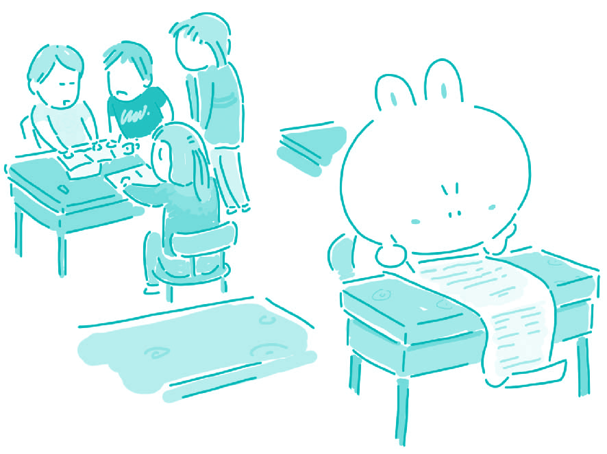

> ###  译文

> **184. 独自学习，还是与其他学生一起学习？**

> 每个学生都有自己偏爱的学习方式。有些喜欢独自学习，而有些则喜欢和一群学生一起学习。这两种学习方式相对而言都有着各自的优点。

> 独自学习时，比较容易集中学习的注意力，一群学生聚在一起时经常会产生的分心事也会比较少。同时，参考书充足，独自学习不仅有可能而且有助于培养解决问题的能力，并且加强一个人的独立性。此外，通过注意力的集中和独立性的发展，学生们会变得越来越具有竞争性，这也经常是一种必要的素质。

> 在一个小组中学习时，就有可能进行讨论和辩论，那么这样就为发展批判性的思维技巧创造了很好的环境，而且有些问题会在不知不觉中解决。尽管由于人多参考书相对不那么容易得到，而且学生们的知识结构彼此各不相同，但他们可以相互补充，并且由此节约大量的时间和精力。此外，在小组中学习同时能够培养学生们很好的合作意识，这通常也被认为是一种基本的美德。

###  Word List

 * preference ［ˈprefərəns］ n. 偏爱；优先的选择
 * deem ［di:m］ n. 认为；相信
 * debate ［diˈbeit］ n. 辩论；争论
 * merit ［ˈmerit］ n. 优点
 * accessible ［əkˈsesəbəl］ adj. 易接近的；可得到的
 * distraction ［diˈstrækʃən］ n. 分心；分心的事物
 * simultaneously ［saiməlˈteiniəsly］ adv. 同时地
 * reference ［ˈrefrəns］ n. 参考
 * adequate ［ˈædikwit］ adj. 适当的；足够的
 * essential ［iˈsenʃəl］ adj. 基本的；本质的
 * virtue ［ˈvə:tju:］ n. 美德；德行
 * cultivate ［ˈkʌltəˌveit］ v. 培养
 * experiment ［ikˈsperəmənt］ n. 试验
 * independence ［ˌindiˈpendəns］ n. 独立；自主
 * pronunciation ［prəˌnʌnsiˈeiʃən］ n. 发音
 * competitive ［kəmˈpetitiv］ adj. 有竞争性的 

## 185. Buy a house or a business?

Choosing whether to buy a house or a business with saved money is a huge decision to make. There are many benefits to both of choices; however, I think that if I had enough money to buy one or the other, I would choose to buy a house.

When one buys a business, he/she is required to spend long, hard hours to ensure that the business is a success. Starting a business is no easy task, and statistics state that half of new businesses fail within the first year. If one buys a house instead of a business, there is nothing that can fail. A house sometimes requires repairs, but usually such repairs can be done on one's own schedule.

A house is also an excellent investment. With the world population rising as quickly as it is, it is a very good idea to become a property owner. In the coming years, land will become more and more expensive, and therefore less attainable. Also, if one buys a house, it is likely that he/she will be able to sell it at a reasonable profit in the future. Providing for one's family is very important, and a house is a stable investment for a family.

Finally, owning a house is a good idea because it saves you from giving someone else money every month for your rent. Usually, when one buys a house, he/she has a mortgage that he/she must pay off in the coming years. In most cases, the mortgage costs approximately the same amount of money as renting an apartment. It makes much more sense to pay for your own home, rather than adding to the wealth of someone else.

In conclusion, I think it is a far better idea to buy a house rather than a business. A house requires less work, it is an excellent investment, and it allows you to keep your money by spending it on your own assets, rather than someone else's. In addition to these reasons, you can also rent out your house to someone else, thus creating an extra source of income for yourself.

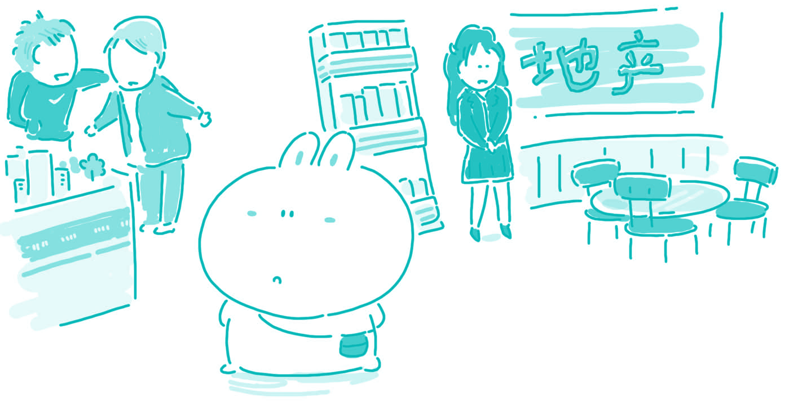

> ###  译文

> **185. 买房子，还是买企业？**

> 用积攒的钱来买房子还是买企业是一个重大的决定。做出这两种选择都有不少好处，然而，我认为如果能有足够的钱来购买其中之一，我会选择购买房子。

> 当一个人购买了一个企业，他就得花很多时间来努力工作，以确保企业能够成功。开始经营一个企业并不容易，数据显示一半的新企业都在第一年就倒闭了。如果一个人购买了房子而不是企业，就没有什么可担心的。房子有时可能需要维修，但是这种维修可以按照你自己的时间来进行。

> 房子还是一种很好的投资。随着世界人口如此快速地增长，拥有不动产是非常好的选择。将来，土地会变得越来越贵，并因此越来越难以得到。而且，如果一个人买了房子，那么将来他或她就有可能在利润可观的时候出售房子。支持家庭对于一个人很重要，而房子对于一个家庭来说是一种稳定的投资。

> 最后，拥有房子是个好主意，还因为这样你就不用每月给别人支付房租，从而节约开支。通常，当一个人买了房子，他或她就要每年分期付款偿还抵押借款。在绝大多数情况下，还贷款的金额和租房子的价格差不多。而给自己的家支付金钱比增加别人的财富更加有意义。

> 总之，我认为买房子比买企业要好的多。房子需要更少的工作，是一项极好的投资，而且还能保证你的钱都能花在自己而不是别人的产业上。除了这些原因，你还可以把房子出租给别人，这样你就有增加收入的来源了。

###  Word List

 * purchase ［ˈpə:tʃis］ v. 买；购买
 * attainable ［əˈteinəbl］ adj. 可得到的
 * statistics ［stəˈtistiks］ n. 统计
 * mortgage ［ˈmɔ:gidʒ］ n. 抵押
 * schedule ［ˈskedʒu:l］ n. 时间表；进度表
 * approximately ［əpra:ksəˈmətli］ adv. 近似的；大约
 * investment ［inˈvestmənt］ n. 投资
 * population ［ˌpa:pjəˈleiʃən］ n. 人口
 * asset ［ˈæsˌet］ n. 资产
 * property ［ˈpra:pəti］ n. 财产
