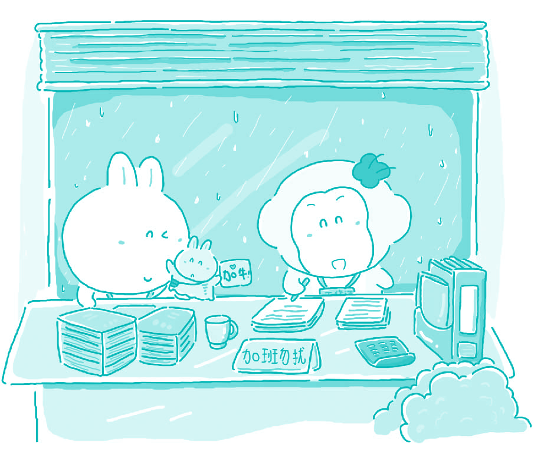

#22. What makes a good co-worker?

Healthy co-workers relations are crucial for the success of business. Since average workers spend at least 8 hours a day with their co-workers, their relationships with their co-workers are among the most important relationships in their lives. The best kinds of co-workers will possess team spirit, be hard working, and have a sense of humor.

Co-workers with team spirit will put the needs of the company and their co-workers before their own needs. For instance, an employee with team spirit might put in uncompensated overtime to help a co-worker finish a project before a big deadline. If the worker who needs help does not meet the deadline, the whole company might lose an important client. If co-workers help each other, even though the rewards might not be immediately apparent, each individual will gain more than if they worked separately.

A good co-worker needs to be hard working. This is the responsibility of every worker in any company. Just as the failure of employees to cooperate will hurt each member of a company, failure of each worker to perform to the best of his/her ability will hurt the company. It will not only lower that particular worker's productivity, it will also damage the co-workers' morale. If I see a coworker of mine slacking off, I might begin to think to myself, "Why should I work hard? I can slack off like my co-worker and still make the same amount of money!" Hard work is not only important for productivity; it is also a crucial prerequisite of team spirit.

Finally, good co-workers need to have a sense of humor. Working at any company can be very stressful. Even though it is necessary for everyone to work hard, that does not mean that work cannot be fun. Since co-workers spend so much time together, being able to joke and laugh each other is also important.

If an employee is perceived by his/her co-workers as a humorless workaholic, then they might not want to go along with him/her. His/her lack of humor hurts team spirit, and not only irritates the people around him/her, but also damages the whole company.

> ### 译文

> **22. 好同事需具备哪些品质？**

> 同事之间的健康关系对商业的成功是至关紧要的。因为一般上班的人每天都要花至少8小时与同事呆在一起，他们与同事之间的关系就属于生活中最重要的关系之一。最好的同事要具备团队精神，工作努力并且有幽默感。

> 有团队精神的同事会把公司和其他同事的需要放在自己的需要之前。比如有团队精神的雇员会无偿地加班帮助同事在最后的期限前完成项目。如果需要帮助的雇员没有按期限完成，那整个公司就可能会失去一位重要客户。如果同事们互相帮助，虽然可能不会马上得到回报，但肯定要比每个人单独工作得到更多的东西。

> 好的同事需要有努力工作的精神。这是任何公司里每个职员的责任。就像员工之间不能合作会伤害公司里的每个员工一样，任何员工无法最大限度地发挥他或她的能力都会给整个公司造成损失。那不仅会降低那个员工的生产能力，还会破坏同事们的士气。如果我看到一位同事闲闲散散，那我自己就会想：“我为什么要努力工作？我也可以闲闲散散而挣同样多的钱。”努力工作不仅对生产能力来说十分重要，对团队精神来说也是至关重要的先决条件。

> 最后，好的同事需要有幽默感。在任何公司工作都可能会很有压力。即使每个人都必须努力工作，也不意味着工作就不会有乐趣。因为同事们每天花那么多时间在一起，能互相开玩笑取乐也是很重要的。如果一位雇员被同事看作是毫无幽默感的工作狂，那他们就不会愿意和他或她在一起。他的缺少幽默感伤害了团队精神，不仅惹恼了周围的人，而且破坏了整个公司。

### Word List

 * co-worker ［ˈkəuˌwə:kə］ n. 同事
 * slack ［slæk］ vi. 松懈，松驰
 * uncompensated ［ʌnˈka:mpenseitid］adj. 未得补偿的
 * productivity ［ˌprəudʌkˈtiviti］ n. 生产力
 * crucial ［ˈkru:ʃəl］ adj. 至关紧要的
 * deadline ［ˈdedˌlain］ n. 最终期限
 * prerequisite ［pri:ˈrekwizit］ n. 先决条件
 * client ［ˈklaiənt］ n. 顾客，客户，委托人
 * workaholic ［ˌwə:kəˈhɔlik］ n. 工作第一的人，工作狂
 * reward ［riˈwɔ:d］ n. 报酬，奖金
 * cooperate ［kəuˈa:pəˌreit］ vi. 合作，协作
 * irritate ［ˈiriteit］ vt. 激怒
 * morale ［ma:ˈræl］ n. 士气
