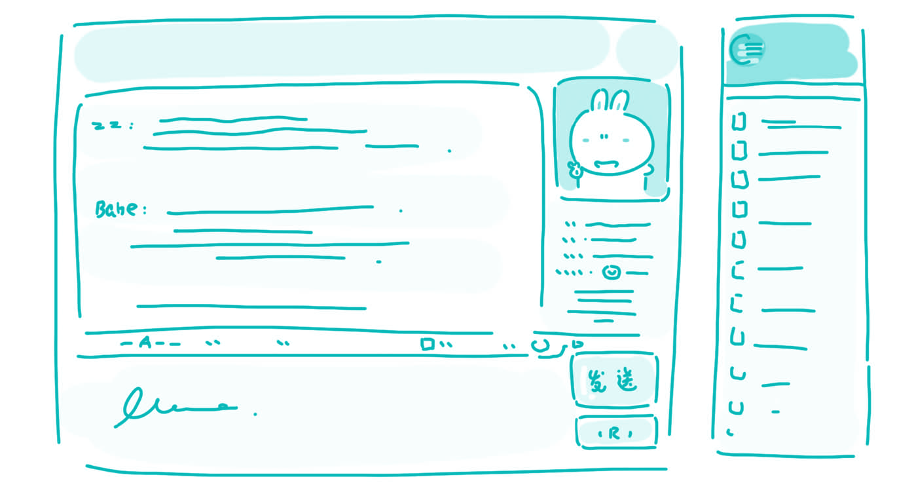

#49. Is face-to-face communication better than other types of communication?

While many modern forms of communication like phone calls, email, and letters, are extremely convenient, in my opinion, nothing beats speaking to another person face-to-face. Face-to-face conversation is the ultimate form of human communication because it is interactive, and allows a broader range of possibilities for communication in the intricacies of tone of voice, body language, and can add the intimacy of touch.

The first and most obvious advantage that face-to-face communication has over a letter and email is that there is the ability for an interactive conversation. If the sender of a letter or an email does not write clearly, or the recipient does not understand part of the correspondence, then much time must be spent to clear up the misunderstanding. In a face-to-face conversation, misunderstandings are easily dealt with because of the immediate and interactive nature of a face-to-face conversation.

The argument might be made that telephones and instant messaging services like MSN and ICQ are equally viable formats for interactive conversation, with the added benefit of being available over long distances. I would still argue that face-to-face conversation is better because you can see the other person. Not all communication is verbal; the meaning of much of what we say depends on our body language and tone of voice. Joking and irony are particularly difficult to express, identify, and enjoy without seeing the expression on someone's face, or watching the movements of their body.

Finally, if the goal of communication is to maintain or deepen a relationship with someone, business partners, friends, husbands and wives, or parents and children, face-to-face communication offers the option of communication by touch that is unavailable even if we could communicate by video. Trust and respect between businesses partners can be established with a firm handshake. No amount of body language can convey the excitement of a high-five between friends, and no number of words can communicate the comforting embrace of a loved one. Touch is the first foundation of our human relationships, before spoken language, and it is only available when people communicate face to face.

> ### 译文

> **49. 面对面的交流比其他交流方式都好吗？**

> 虽然像打电话、发电子邮件和写信这样的现代沟通方式非常方便，但在我看来，什么也比不上与别人面对面的交谈。面对面交谈是人类沟通的最终形式，因为它是互动的，在语音语调和肢体语言的错综复杂的细节中给沟通提供了更大范围的可能性，并且能增加接触的亲密感。

> 面对面沟通强于电子邮件与信件的第一点并且也是最明显的一点优势是能够互动交谈。如果信件与电子邮件的发送者写得不清楚，或者收信者不明白部分通信内容，就得花很多时间澄清误解。在面对面的沟通中，因为当面交谈的及时互动的特性，误解很容易解决。

> 可能有人会争论，电话和诸如MSN、ICQ的特快信息服务同样能够实现互动交谈，还有适用于长距离沟通的额外好处。我还是认为面对面的交谈是更好的，因为你能看到对方。不是所有的沟通都是文字形式的；很多我们说出的话的含义取决于我们的肢体语言与音调。看不到对方的面部表情或者肢体动作，开玩笑与讽刺就会格外难以表达、辨别和欣赏。

> 最后， 如果沟通的目的是要维持或加深与他人之间的联系，如工作伙伴、朋友、夫妻或父母与孩子，那么面对面的沟通会提供触摸交流的选择，即使我们能够视频沟通，这一点也是做不到的。一个有力的握手能够在工作伙伴中建立起信任与尊重。多少语言都不能表达朋友间高高击掌的兴奋，多少词句也传达不了爱人拥抱的欣慰。触摸是人类在有语言以前联系的第一基础，并且只有在人们面对面沟通时才能实现。 

### Word List

 * beat ［bi:t］ v. 击败，打败
 * format ［ˈfɔ:ˌmæt］ n. 形式
 * ultimate ［ˈʌltəmit］ adj. 最终的，根本的
 * correspondence ［ˌkɔrisˈpa:ndəns］n. 通信，信件
 * interactive ［ˌintərˈæktiv］adj. 相互作用、影响的
 * recipient ［riˈsipiənt］ n. 接受者，领受者
 * intricacy ［ˈintrikəsi］ n. 复杂，错综
 * irony ［ˈaiərəni］n. 反话，讽刺，讽刺之事
 * intimacy ［ˈintəməsi］ n. 亲密
 * viable ［ˈvaiəbəl］ adj. 切实可行的
 * embrace ［emˈbreis］ n. 拥抱
