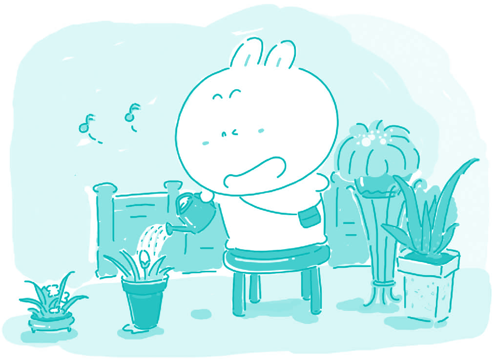

#59. Live life in a hurry or at a slower pace?

I used to live at a frantic pace. My wristwatch dictated my life, and the hands of the clock pushed me forward to my next appointment, my next assignment, and my next social engagement. However, I have managed to relax. Now that I live my life at a slower pace I have become a better student, a more reliable friend, and a person who enjoys life much more than before.

Living life at a slower pace has allowed me to pay much more attention to detail and to work through my assignments at school more thoroughly. Before I was always rushing through my reading and my writing, and my concentration was not very strong. The clubs and sports teams I belonged to demanded a lot of attention. After I decided to get rid of some of the more involved activities I had more time to focus on my studies and the results have shown in my marks.

While I am still busy with school and extra curricular activities, I also make a point of slowing down and taking a step back in order to prioritize the things in my life. This allows me to evaluate how much time I should spend on one thing or another. For example, while I was hurrying through my schedule I often lost track of my friends. I forgot about dates that we made and things that I agreed to do for them. This will not happen now. By slowing down the tempo and realizing how important my pals are to me, I have once again become a reliable friend.

Lastly, living life at a slower pace allows me to appreciate the good things in my life. In the past I would only think about the things I would have to get accomplished next. This anticipation did not allow me to concentrate on the moment, but now I am able to enjoy a family dinner or an afternoon at the movies with my friends without worrying about what I am supposed to do next.

> ### 译文

> **59. 慢节奏生活还是快节奏生活？**

> 我过去经常快节奏地生活。手表指挥着我，时钟的指针催促我赶赴下一个约会、赶做下一个任务、赶往下一个场所。但是，我需要放松。现在我以较慢的节奏生活，而变成了一名好学生，一个更可靠的朋友，和一个比以前更会享受生活的人。

> 以更慢的速度生活使我开始注意细节，在学校里完成作业时更认真。以前我总是急着读、急着写，不能完全集中注意力。我所在的俱乐部和体育队需要我更多的参与。在我决定从活动很多的几个俱乐部中退出后，我有了更多的时间集中注意力学习，这样做的好处已经在我的分数上显现出来了。

> 虽然我的学业还是很忙，我开始慢下节奏来审视自己的生活中到底哪些应是优先考虑的。这使我考虑自己应该在一件事情上花多长时间。例如，当我忙于按照制定的日程表前行的时候，我往往就把朋友忘记了。我会忘掉我们的约会或者忘记自己曾许诺要为他们做的事。但是现在这种情况不会再出现了。我放慢生活的节奏、意识到朋友对我来说有多重要后，我重新成为一个可信赖的朋友。

> 最后，慢节奏生活使我有时间欣赏生命中的美好事物。在过去，我总是在想下一步要完成什么任务。这种想法使我不能把注意力集中在手头上的事情。但是现在，我可以享受家庭聚餐，或者一整个下午和朋友们一起看电影，而不再担心下一步要干什么。

### Word List

 * frantic ［ˈfræntik］ adj. 狂乱的，疯狂的
 * wristwatch ［ˈristˌwa:tʃ］ n. 腕表，手表
 * dictate ［ˈdikˌteit］ v. 口述，口授；指令，指示
 * appointment ［əˈpɔintmənt］ n. 约会；指定
 * assignment ［əˈsainmənt］ n. 分配；任务
 * reliable ［riˈlaiəbəl］ adj. 可靠的，可信赖的
 * concentration ［ˌka:nsenˈtreiʃən］ n. 集中；集合；专心
 * extra ［ˈekstrə］ adj. 额外的
 * curricular ［kəˈrikjələ］ adj. 课程的
 * prioritize ［praiˈɔriˌtaiz］ v. 把…区分优先次序
 * evaluate ［iˈvæljuˌeit］ v. 评价，评估
 * schedule ［ˈskedʒu:l］ n. 时间表，进度表
 * tempo ［ˈtempəu］ n.（音乐的）速度，拍子
 * appreciate ［əˈpri:ʃiˌeit］ v. 欣赏；感激
 * anticipation ［ænˌtisəˈpeiʃən］ n. 预期，期待
