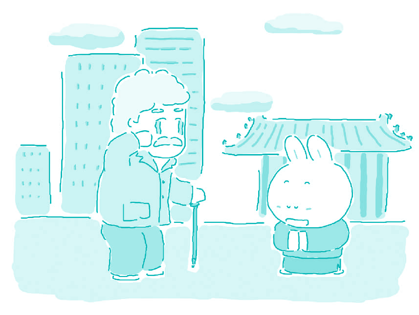

#80. A custom from your country that you would like people from other countries to adopt

My favorite custom from Chinese culture that I wish that other countries would adopt is "Respect the Old, Love the Young." These two ideas have been part of traditional Chinese culture for thousands of years, but they are more important than ever in contemporary Chinese culture. If adopted by Western countries, these two traditional attitudes could help them solve some of their social problems.

One major problem in many Western countries is what to do with old people when they can no longer take care of themselves. A Chinese family will often have three generations of one family living under the same roof. They love and respect the older generation, and consider them wise. Western people believe that living with one's own parents is inconvenient and embarrassing. Instead of respecting old people, some think that they are stupid and ugly. When Western families' parents get old, they would rather send them into nursing homes and retirement homes than live together with them. Only old and sick people live in these places and they are considered depressing, in the worst cases they might seem like a prison to their inhabitants. Old people in the West would be much happier if they adopted these traditional Chinese attitudes.

Juvenile delinquency is another serious social problem in Western cultures. Its causes can also be traced back to a lack of respect for old people and love for young people. Children are not taught to respect the wishes of their parents and instead value their relationships with their friends more. Because in many Western families both parents have jobs outside of the home, children often lack adequate supervision. Chinese families, by contrast, often have at least one parent, or a grandparent at home to take care of and love the children. Children without proper guidance and love from a young age might start to smoke, drink, use drugs, and commit crimes. This occurs much less frequently in China because people pay more attention to their children and have the children's grandparents nearby to help raise them.

The West puts the "Individual" before the "Family". Traditional Chinese culture puts the interests of the Family first, and the Individual second.

Chinese mothers and fathers place higher value on their child's development, than on their child's independence. Children place a higher value on their parents' happiness than on their own convenience. While there are many excellent lessonsthat Chinese people can learn from the West, Western people would do well to learn from these essential Chinese traditions.

> ### 译文

> **80. 一种你希望被其他国家的人采纳的本国习俗**

> 我最喜欢的、希望其他国家采纳的我国风俗是 “尊老爱幼”。这是中国文化中几千年传统的一部分，然而在中国当代社会更加重要。西方国家如果能采纳这个风俗，也许会解决一些它们的社会问题。

> 西方国家的一个主要问题是如何对待不能够照顾自己的老人。中国家庭通常三代同堂。他们爱戴、尊敬老一辈，并且认为老一辈是睿智的。西方人认为与父母同住不方便并且尴尬。他们中的一些人不尊敬他们，反而认为老人丑陋愚蠢。在西方国家，父母老了之后，子女宁愿送他们去养老院而不是与他们住在一起。只有老弱病残才会生活在那里，人们认为那里很压抑，最糟的是他们认为那里相对于自己的家就像监狱一样。如果尊老爱幼的风俗被采纳，西方的老人会更幸福。

> 青少年行为不良是西方文化中存在的另一个严重社会问题。其起因同样可以归咎于缺乏“尊老爱幼”的精神。青少年学会的不是尊重父母的愿望而是更加重视与朋友之间的关系。在西方国家，大多数父母同时上班，孩子缺乏充足的看管。在中国，恰恰相反，通常至少有一个家长，或者祖父母在家照顾孩子。缺乏恰当看管以及爱护的孩子可能会开始抽烟、喝酒、吸毒、甚至犯罪。中国相对发生的很少是因为人们更关注他们的孩子，并且有祖父祖母帮助养育子女。

> 西方人认为“个体”重于“家庭”。而传统的中国文化却把家庭的利益放在首位，个人利益次之。父母关注孩子的发展多于关注孩子的独立性；孩子认为父母的快乐要比他们自己的方便更重要。中国可以从西方学到很多东西的同时，西方也可通过学习这些重要的中国传统而受益。 

### Word List

 * Respect the Old, Love the Young 尊老爱幼
 * juvenile ［ˈdʒu:vəˌnail］adj. 青少年的；幼稚的
 * roof ［ru:f］ n. 屋顶，房顶
 * delinquency ［diˈliŋkwənsi］n. 行为不良；错失
 * under the same roof 同堂
 * embarrassing ［emˈbærəsiŋ］ adj. 令人难堪的
 * supervision ［ˌsu:pəˈviʒən］ n. 监督，管理
 * drug ［drʌg］ n. 麻醉药；毒品
 * retirement ［riˈtaiəmənt］ n. 退休
 * commit ［kəˈmit］ v. 犯（错误）
 * depress ［diˈpres］ v. 使沮丧；压低
 * nearby ［ˈniəˈbai］ adv. 在附近；附近地
