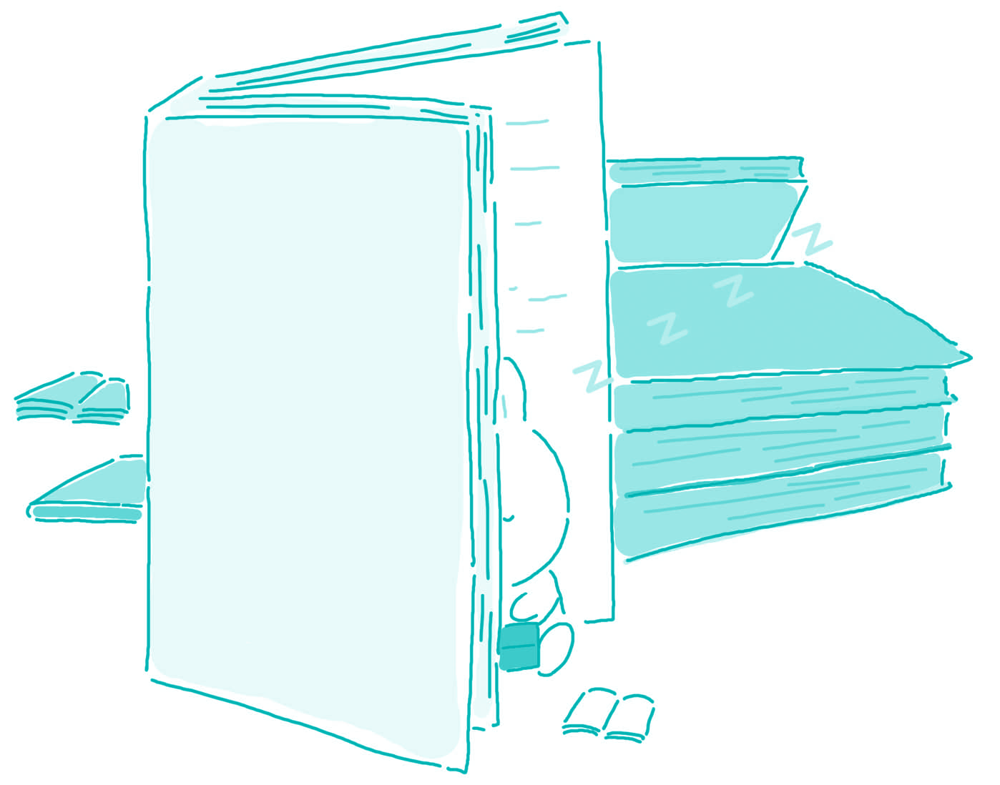

#96. What are the best ways of reducing stress?

With today's hectic schedules, it is necessary to spend some time each day to relax, and let the stress dissipate from our bodies and minds. Most people find that the working world is quite difficult at times, and need a method to relax. I find that the best way to relax is to read a good book, because it allows me to escape from real life, it gives me a new perspective on the world, and reading a book is very peaceful.

I find that reading a good fiction novel is the best way to forget about my troubles during the day. Many of the books I read have fascinating plot lines, which allow me to be absorbed into the drama and action. When you are completely captivated with your book, nothing in the outside world seems to exist anymore. Of course, one cannot stay in this dreamland forever, but for an hour or so a day, it is very calming.

Reading books can also have the added benefit of increasing my knowledge and giving me a new perspective of the outside world. Even a fictional book can have this effect. When an author writes a book, it is full of his nuances and feelings about how the world works. By reading these works, I find that I understand more about other people, and how people think. This allows me to be more accepting of others on a daily basis, and also stops me from building up stress in the first place.

Finally, the most important reason as to why reading a book is good for taking care of stress and relaxing, is that it is a very peaceful activity. You do not need to go anywhere to read a book. You can stay at home, perhaps sit in your favorite chair, and have the house be completely quiet. Reading does not involve anything but you and your book. Also, if there does happen to be noise around you, it is possible to block out that noise once you become engrossed in the plot line.

> ### 译文

> **96. 缓解压力的最好方式是什么？**

> 在忙忙碌碌的现代社会中，我们有必要每天都抽出一些时间来放松一下，缓解身心的压力。大多数人会感觉到工作压力很大，需要找到一种放松的方式。我认为最好的放松就是读一本好书。阅读会让人放松，因为它可以让我逃离现实生活，对世界产生新的认知，而且使人平心静气。

> 我认为，读一本好的科幻小说是使我忘记一天烦恼的最好方式。我读过的很多书都有着引人入胜的情节，可以使我全神贯注投入到书中的事件和情节中。当你完全沉迷于书中时，外界的一切似乎都不复存在了。当然，人不能永远待在这种梦境中，但一天当中抽出一个小时左右的时间来这样做，还是会让人心境平和。

> 读书还可以有更多的好处，那就是可以增长知识，使我对外部世界有新的了解。即使是科幻小说都可以有这种功效。作家写书的时候，书中充满了他对这个世界的微妙感觉和情感。通过阅读这些作品，我发现我更多地了解了别人，了解了人是如何思考的。这使我在现实生活中更容易接纳别人，也使我能够尽快地卸下压力。

> 最后，关于为什么读书有助于减轻压力、放松情绪的最重要的原因是：阅读是一项非常安静的行为。你不需要到其他地方去读书。你可以待在家里，或许是坐在你最喜欢的椅子上，使房子处于绝对安静的状态。除了你本人和书，读书再不需要与任何其他东西有关。而且，如果周围碰巧有噪音，只要你完全投入到故事情节中，噪音也有可能与你隔绝。

### Word List

 * hectic ［ˈhektik］ adj. 发热的；兴奋的
 * dissipate ［ˈdisəˌpeit］ v. 驱散
 * at times 有时，不时
 * plot line 情节，故事主线
 * drama ［ˈdra:mə］ n. 戏剧，戏剧艺术
 * captivate ［ˈkæptəˌveit］ v. 迷住，迷惑
 * nuance ［ˈnu:ˌa:ns］ n. （颜色、意义等的）细微差别
 * block out 封闭；拟大纲；设计
 * engross ［enˈgrəus］ v. 用大字体书写；吸引
 * take care of 照顾，照料
