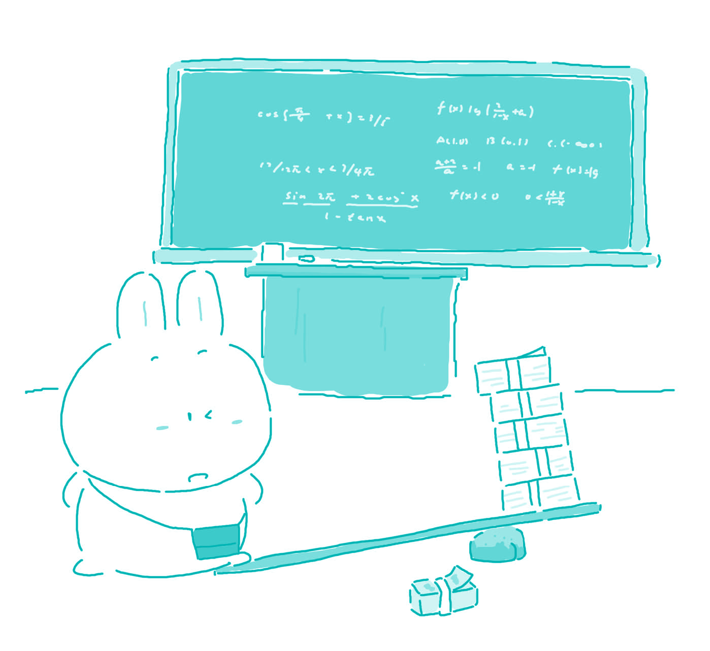

#97. Should teachers be paid according to how much their students learn?

People usually believe that teachers have the most important job in all of society. They raise our children to be forward-thinking, bright individuals. They ensure that children get along with each other, and learn to work together as a team. As such, being a teacher typically means a stable paycheck. However, when some people propose that teachers should be paid according to how much their students learn, I can hardly agree.

First of all, students may not be interested in learning. When students are not interested in learning, the teacher can hardly be held responsible. The teacher can grade them harshly, keep them in after class, and discipline them severely, but the students will still not learn if they do not want to. If the teacher is trying his/her best to teach the students, and the information is presented clearly and succinctly, he/she can do no better job.

Moreover, there is a limit on how much a child can learn. If a teacher was to be paid according to how much his/her students learned, there would be a certain point where he/she could teach them no more. I remember when I was in high school, there would be moments in the year when I didn't think I could fit any more information into my head. This was not my teacher's fault, and the point is that I just was not absorbing the material. I think many teachers would find this problem if they were paid by how much their students learnt.

Most importantly, teachers should not be paid according to how much their students learn because some of the lessons that a student learns cannot be measured by a test. We cannot simply give children a test to discover how much they have learnt in a class. Tests rarely measure one's social skills, one's ability to communicate, or one's ability to integrate successfully into the world. However, it is the teachers who help students to manifest these qualities.

> ### 译文

> **97. 应该按学生所学多少来为教师付酬吗？**

> 人们通常认为教师是社会上各行各业中最重要的一种职业。教师把我们的孩子培养成有理想、有知识的人。教师教会孩子们彼此融洽相处，在集体中协同合作。正因为如此，成为一名教师显然就意味着能够得到稳定的薪水。然而，当有人提议按照学生所学多少来支付教师酬劳时，我还是不敢苟同。

> 首先，学生可能对学习不感兴趣。当学生对学习不感兴趣时，教师很难对其负责。教师可能会给那些学生很苛刻的分数，放学后把他们留在学校，严厉地处罚他们，但是如果这个学生自己不愿意，他们还是不会努力学习。如果教师尽了自己的全力来教学生，所讲解的知识表达得简单明了，他或她就是一个合格的教师。

> 其次，一个孩子能学多少是有限的。如果教师获取多少报酬取决于他或她的学生学到了多少，那么就会出现一个分界点，到了这个点他或她就不能再教学生更多东西了。我记得在读高中时，一年当中会有一段时间我觉得自己脑子里再也不能装进任何知识了。这不是我的老师的过错，问题在于我当时消化不了所学的知识了。我想，如果要根据学生学了多少来支付教师工资，许多老师会遇到这样的问题。

> 教师的酬劳不应该由学生学了多少来决定的最重要的原因是，一个学生所学的功课，有一些是无法通过一次测验来衡量的。我们不能简单地给孩子们一张试卷来检验他们在课堂上学了多少知识。考试很难衡量出一个人的社会技能、交际能力，或者是成功地融入社会的能力。然而，正是教师在帮助学生们显现这些品质。 

### Word List

 * stable ［ˈsteibl］ adj. 固定的；稳定的；可靠的
 * paycheck ［ˈpeiˌtʃek］ n. 付薪水的支票，薪水
 * harshly ［ha:ʃli］ adv. 严厉的，苛刻的
 * severely ［səˈviəli］ adv. 严格地；激烈地
 * succinctly ［səkˈsiŋktli］ adv. 简洁地，简便地
 * fit into 适合
 * integrate into 使与…结合
 * manifest ［ˈmænəˌfest］ v. 出现；表明，证明
