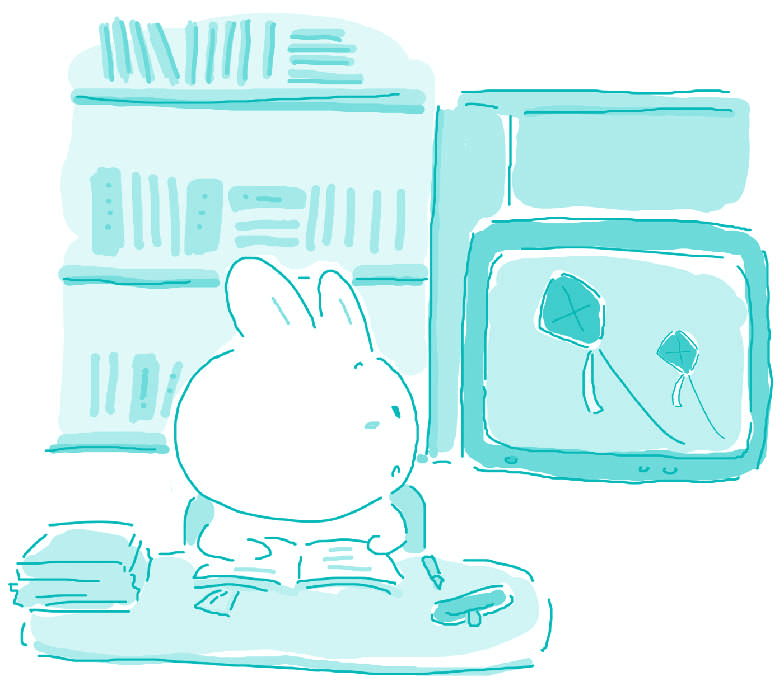

#128. Should we spend all school day studying or set aside some time for exercising?

Some people believe that it is important to have physical activities as part of a child's everyday curriculum at school. Others disagree, and argue that students should spend all of their time on academic studies. Personally, I believe that physical education is a vital part of an education as it teaches children to take care of their bodies, how to work as a team, and gives them a method of releasing tension and aggression.

Humans have always known about the importance of taking care of our bodies, but it seems that in recent years, we have gradually forgotten this important fact. It is absolutely necessary to get some physical activity at least a few times a week, and engraining this idea into children when they are young is the best way to ensure their health for life.

Physical exercise usually involves teamwork of some sort. Much of the exercise that young people get involves games such as basketball, volleyball, or football. All of these sports teach children how to work together to achieve a common goal, in this case, winning. I also believe that allowing the children to work together in a fun environment, rather than only on academic projects, brings a stronger sense of camaraderie, which helps the children to have healthy relationships with others.

Finally, physical exercise is an excellent way to release tension and aggression. If one is particularly stressed about school or life, getting exercise can help the person to relax. As for letting out aggression, it is much healthier to kick a football than it is to hit someone who has made you angry.

Exercise should definitely be a part of a student's education. Exercise has much more to offer than simply getting"a break" from academics. Physical exercise can balance out a student's hectic life, and make it much more pleasurable.

> ### 译文

> **128. 学习日是全用来学习还是留出部分时间来运动？**

> 有些人认为，把体育运动作为孩子每天学校课程的一部分是很重要的。其他一些人则对此持有异议，他们认为学生应该把所有的时间都放在学习上。就我而言，我相信体育教育是整个教育至关重要的一部分，因为它教会孩子们如何照顾自己的身体，如何进行团队协作，以及给他们提供一种释放压力和发泄敌对情绪的方式。

> 人类一直以来都了解照顾自己身体的重要性，但是近几年我们似乎逐渐忘记了这一重要的事实。每个星期至少进行几次体育锻炼是绝对必要的，而且当孩子们年轻的时候就把这种思想灌输到他们的头脑中去，这是保证他们生命健康的最佳方式。

> 体育锻炼通常涉及到某种形式的集体协作。年轻人进行的很多锻炼中包括了像篮球、排球或者足球这样的比赛。所有这些体育运动教会孩子们如何一起合作来完成一个共同的目标，在这种情况下，目标就是获胜。我还相信让孩子们在一种嬉戏的环境中合作，而非仅仅在学术项目上进行协作，会让他们对友情的感觉更加强烈，这可以帮助孩子们与他人建立健康有益的关系。

> 最后，体育锻炼是释放压力和发泄敌对情绪很好的途径。如果一个人感觉到学业或生活的重压时，进行锻炼能帮助这个人进行放松。至于发泄敌对情绪，去踢一个足球总比去打一个让你生气的人要健康得多。

> 体育锻炼绝对应该成为学生教育的一部分。锻炼能够给予我们的，可远远不只是从学习中获得一种“休息”。体育锻炼能够平衡学生紧张忙碌的生活，使它更加愉快。 

### Word List

 * physical ［ˈfizikəl］ adj. 身体的
 * camaraderie ［ˌka:məˈra:dəri:］ n. 友情，友爱
 * release ［riˈli:s］ v. 释放
 * aggression ［əˈgreʃən］ n. 敌对情绪
 * let out 发泄；释放
 * engrain ［enˈgrein］ v. 使根深蒂固
 * as for 至于
 * ensure ［enˈʃuə］ v. 确保，保证
 * balance out 平衡
 * teamwork ［ˈti:mˌwə:k］ n. 集体协作
 * hectic ［ˈhektik］ adj. 紧张忙碌的
