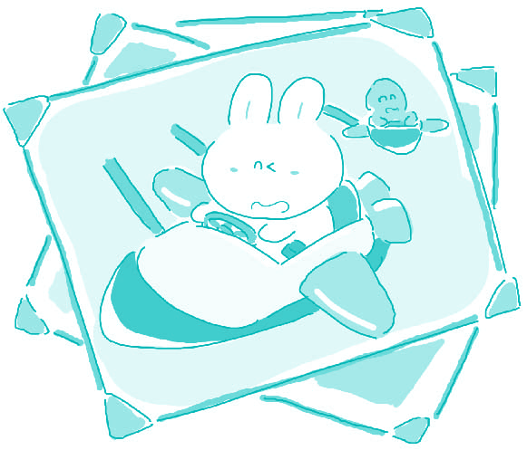

#133. Are a person's childhood years the most important years of a person's life?

It is generally accepted that a person's childhood years are very important years of a person's life, but it is hardly appropriate to say those years are the most important.

We do not reject the importance of childhood years. Actually it is rather important for later part of a person's life. Our lives, to a large extent are subject to our recognition of our surroundings. Our world views have been structured from very early stage of our childhood, mainly through our daily experiences. Everyone therefore actually has his or her own world different from those of others, because even though we all live in a single world, each and every one of us in fact lives in distinctive worlds which are determined by distinctive perceptions that vary widely from individual to individual. Hence, we should not be surprised by the extent to which a person's life is influenced by one's childhood.

Childhood, however, is only part of one's life, and it is merely one of several determinatives that shape one's adult life. Among various determinatives is one's learning ability. Human beings are superior to any other animals on the Earth simply because of their vigorous ability to learn. Psychology teaches us that training and self-training can dramatically alter one's characteristics and even the ability to learn, which may eventually alter his/her life. Furthermore, learning is a life long process, which means every part of one's life could be an essentially crucial period, and could play an indispensable role in one's life. Examples are available everywhere. Einstein was taken for an idiot by his teacher when he was a child. Even though every thankful man would have known exactly that that doesn't necessarily mean he was really an idiot, the awkward attitude of his stupid teacher absolutely made Einstein's childhood an awful one. Nevertheless, Einstein led a wonderful life.

Most parents nowadays seem to believe the statement that childhood is the most important phase of one's life, and therefore often force their children to learn those alleged essential skills for the sake of the future. The fact is, such behavior is rather presumptuous, because there still are many other important factors that affect one's life.

> ### 译文

> **133. 一个人的童年时代是否是人生中最重要的阶段？**

> 人们普遍认为，人的童年时代是人的一生中非常重要的阶段，但是要说那些岁月是最重要的并不恰当。

> 我们并不否认童年时代的重要性。事实上，这对一个人以后的生活是非常重要的。我们的生活在很大程度上会受到我们对周围环境认识的制约。我们的世界观是从自己儿童时代最初始的阶段开始构筑的，主要通过我们的日常体验。因此每个人实际上都有着与他人不同的自己的世界，原因是，即便我们全都生活在同一个星球，可我们每个人事实上还是生活在各自与众不同的世界里，而人们各不相同的感知就支配着这些不同的世界。因此，儿童时代对人的一生所造成的影响程度巨大，我们对此并不应该感到吃惊。

> 然而，儿童时代只是人一生的一部分，它也只是影响人们成年阶段的几个决定性因素之一。在各种决定性因素之中，包括了一个人的学习能力。人类比地球上任何其他动物都要高级，原因就在于他们强大的学习能力。心理学教会我们，接受训练和自我训练能够极大地改变一个的性格，甚至还有学习能力，而这最终可能会改变人的一生。此外，学习是一个终生的过程，这意味着人一生的每个阶段都可能是一个至关重要的时期，都可能在人的一生中扮演着不可缺少的角色。例子随处可见。爱因斯坦还是个孩子的时候，被他的老师当作一个白痴。虽然每个心存感激的人都确切地知道，那并不一定就意味着他真的是一个白痴，可他愚昧的老师的这种令人尴尬的态度还是绝对会让爱因斯坦的童年变得很糟糕。尽管如此，爱因斯坦的一生还是非常了不起。

### Word List

 * reject ［riˈdʒekt］ v. 否认
 * self-training ［ˌselfˈtreiniŋ］ n. 自我训练
 * distinctive ［diˈstiŋktiv］ adj. 与众不同的
 * dramatically ［drəˈmætikəli］ adv. 极大地
 * perception ［pəˈsepʃən］ n. 感知
 * alter ［ˈɔ:ltə］ v. 改变
 * determinative ［diˈtə:məˌnetiv］ n. 起决定性作用的事
 * crucial［ˈkru:ʃəl］ adj. 决定性的
 * indispensable ［ˌindiˈspensəbl］ adj. 不可缺少的
 * shape ［ʃeip］ v. 影响，决定
 * vigorous ［ˈvigərəs］ adj. 强大的
 * presumptuous ［priˈzʌmptu:əs］ adj. 自以为是的
 * psychology ［saiˈka:lədʒi］ n. 心理学 
