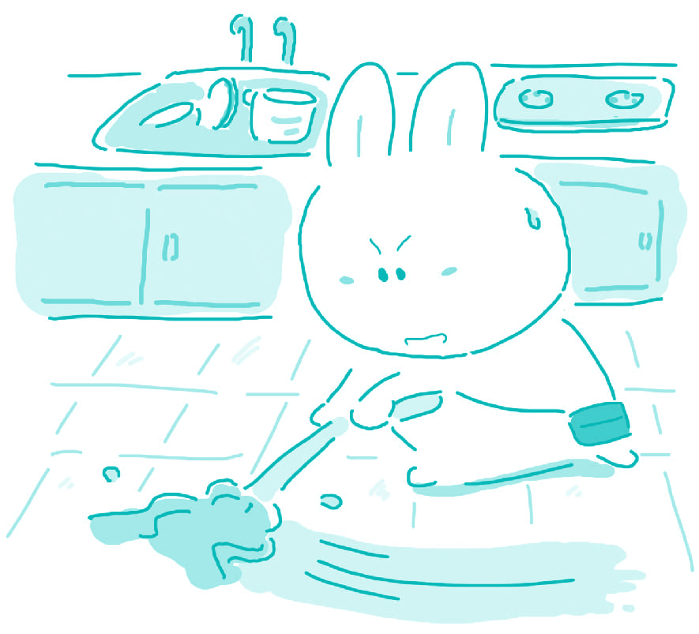

#134. Should children be required to help with household tasks as soon as they are able to do so?

Helping out with household tasks is the first job that most people usually partake. From an early age, children are encouraged to help around the house, doing little tasks that help out their parents and grandparents. I believe that this is an important feature of society, and should be continued.

It is very important for children to learn how to be responsible for their environment. This is a skill that they will take with them throughout their lives, and it should be fostered at an early age. If people are able to keep a clean house or workplace, they will be able to achieve tasks much more easily. For example, if children learn early in life that everything has its place, then this lesson will not only teach them to keep things tidy, but also instruct them on how to stay organized.

Another reason why this is important is because it promotes a strong work ethic in children at an early age. If a child is given responsibilities around the house, and it is made sure that the child completes these tasks, the child will learn how important it is to follow through on instructions. Many parents go so far as to punish their children for not doing chores, which I think will ultimately be beneficial for the children. It will help them in all of their later endeavors in life.

Finally, encouraging children to do work around the house as soon as they are able to gives them an appreciation of what their parents do for them to keep them safe, clean and warm. Many young children have no idea how difficult it is to keep a house in good condition. It is important that children learn from an early age how much their parents do for them, and learn to respect their parents more based on this.

Overall, I agree with putting children to work early in life around the house. Of course, there are limits on this. Children should not become the maids of the household. They should be given enough work to encourage a strong work ethic and an appreciation of their parents, but not so much that they have no time to do anything else.

> ### 译文

> **134. 是否应该要求儿童在其力所能及时就做家务？**

> 帮忙做家务通常是大多数人第一次参与的工作。从很小年纪开始，孩子们就被鼓励在家里帮忙，做些小事情来帮助自己的父母和祖父母。我认为这是社会的一个重要特色，应该保持下去。

> 让孩子们学习如何对自己的环境负责是非常重要的。这是一种他们将会受用终生的技能，而且这种技能应该在早期培养。如果人们能够维持干净的房间或工作地点，他们就能够更加轻松地完成自己的工作。比如，如果孩子早年学会一切事物都有自己的位置，那么这不仅将教会他们维护东西的整洁，而且还将指导他们如何保持条理。

> 帮忙做家务很重要的另外一个理由就是，它可以在孩子们很小的时候激发一种很强的职业道德。如果让孩子负责家务，并确保孩子将其完成，孩子就会了解执行指令坚持到底是多么重要。许多父母甚至会因为孩子们不做家务而惩罚他们，我认为这对孩子们来说最终将是有益的。它会有助于他们在今后生活中所做的一切事情。

> 最后，只要孩子们一有能力就鼓励他们帮忙做家务，会让他们懂得父母都为自己做了些什么，来使自己安全、干净和温暖。许多小孩完全不知道把家里收拾好有多么困难。让孩子们很早就了解父母为他们付出了多少，并因此而学会更加尊敬父母，这是很重要的。

### Word List

 * help out 帮助
 * partake ［pa:ˈteik］ v. 参加，参与
 * foster ［ˈfɔstə］ v. 培养
 * ethic ［ˈeθik］ n. 道德，伦理
 * follow through 执行，坚持到底
 * endeavor ［enˈdevə］ n. 努力，尽力
 * appreciation［ə ˌpri:ʃiˈeiʃən］ n.了解，感激
 * maid ［meid］ n. 仆人
