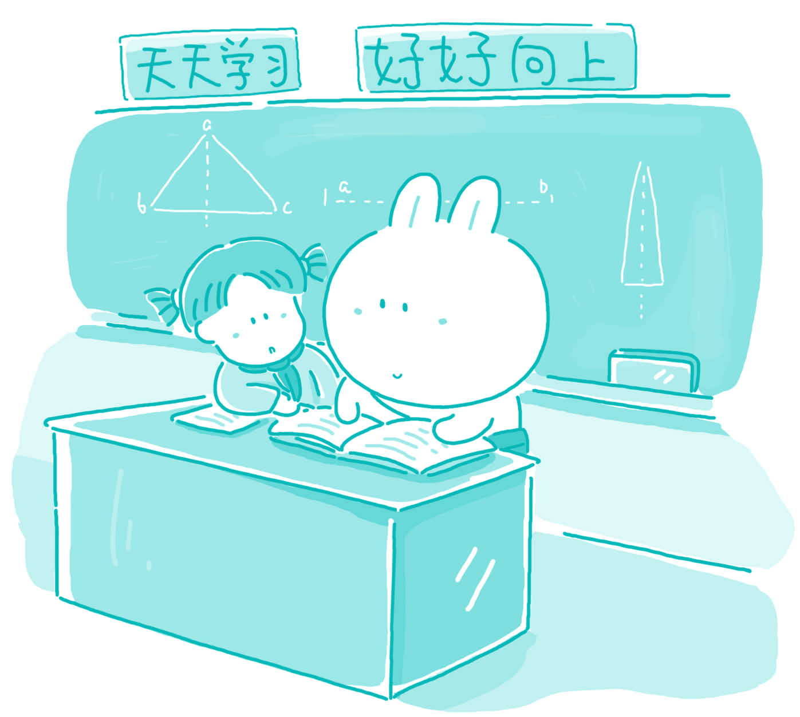

#141. What change do you want to make in a school you attended?

While the school system in China is generally quite good, there is one problem that I have found prevalent through all of my years of education. The problem is that the teacher to student ratio is too small. This situation was of no benefit to anyone: the teachers, or the students. If there were more teachers in each school, class sizes would be smaller, there would be a greater diversity of knowledge and information, and teachers would be less tired, and would therefore give better classes.

Class sizes are overwhelmingly large in China. In many of the courses offered in elementary school and high school, there are over forty students in a class. It is very difficult to learn in this type of situation. The teacher has no time to spend with individual students who need extra help, and students are often embarrassed to ask questions in front of so many other students. If class sizes could be shrunk, the learning curve in most courses would rise dramatically.

With more teachers at every school, the collective mass of knowledge and information would rise. Everyone in the world has his/her own very particular set of information. People are like snowflakes; each person is different and has varied experiences from the next person. With more people at a school, there is a wider knowledge base to draw from. This would obviously be an advantage to students, as schools could offer a wider range of courses in a variety of fields of study.

Therefore, if I was given the opportunity to change one thing in the high school that I once attended, I would like to try to recruit more qualified teachers and give them more decent pays. This would benefit everyone. It is an unfortunate fact that most school districts cannot afford to make this happen.

> ### 译文

> **141. 你希望你曾上过的学校有哪项改变？**

> 虽然中国的学校体制大体上是相当不错的，但是我从多年的教育经历中还是发现一个普遍存在的问题。这个问题就是，相对学生来说老师的比例太小。这种状况对任何人都没有好处，不管是老师，还是学生。如果每所学校有更多的老师，班级规模就会缩小，就会有更加多样化的知识和信息，老师们不会那么疲惫，讲课的质量也会改善。

> 在中国，班级规模过大。在小学和中学开设的许多课程上，每个班级都有超过40名的学生。在这种状况下学习是非常困难的。老师没有时间专门花费在需要额外帮助的个别学生身上，学生也经常羞于在这么多其他同学的面前提出问题。如果班级规模能够缩小，大多数课程的学习曲线将会显著提高。

> 每所学校要是有更多的老师，知识和信息的总量就会增加。世界上的每个人都有自己非常独特的一套知识。人们就像雪花：每个人都是不同的，拥有与别人不同的经历。如果学校有更多的人，就会存在一个更加广泛的知识库可供汲取。这对学生们来说显然是非常有利的，因为学校可以在各种学习领域提供范围更为广泛的课程。

### Word List

 * prevalent ［ˈprevələnt］ adj. 普遍的
 * ratio ［ˈreiʃəu］ n. 比例，比率
 * overwhelmingly ［ˌəuvəˈhwelmiŋli］ adv. 极其
 * shrink ［ʃriŋk］ v. 缩小
 * collective ［kəˈlektiv］ adj. 集合的，共同的
 * snowflake ［ˈsnəuˌfleik］ n. 雪花
 * draw from 汲取
 * recruit ［riˈkru:t］ v. 聘用
 * qualified ［ˈkwa:ləˌfaid］ adj. 合格的
 * decent ［ˈdi:snt］ adj. 不错的，相当好的
