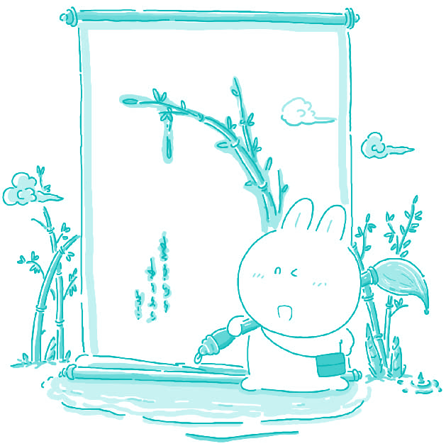

#155. A plant that is important in your country

China's culture has always had an intimate relationship with nature. This can be seen in many aspects of Chinese culture, from herbal medicines to intricate Chinese gardens. I believe that the most important plant in my culture is bamboo. Bamboo can be a source of nutrition, it can be used to build many things, from baskets to houses, and it has a large influence on history and arts in China. First and foremost, bamboo is a popular food in our country. Many people will add bamboo to their meals for its delicious flavor and nutritional value. Many animals also enjoy bamboo, the most famous being the Giant Panda. This bear is nearing extinction, and if the natural sources of bamboo were to disappear, the Panda would surely disappear from the world. In addition to being a source of food, bamboo has healing qualities as well. It has been used in traditional Chinese medicine to relieve asthma, coughs, and gall bladder disorders.

Bamboo is a very versatile material that can be used to make numerous different items. It has been used in China for thousands of years to make baskets for carrying items, and for constructing buildings. Bamboo grows very, very quickly, and therefore, there is always a steady supply available for our consumption. It has also been used to make fans, furniture, and clothing.

Finally, bamboo is very important in the literary and artistic arenas in China, and has been since the first writings were recorded. Bamboo has been used in many Chinese arts: it has been used as a metaphor in literature, it has been used in the making of instruments and artistic implements, such as the bamboo flute or Chinese brushes. It is a prevalent theme in both visual and literary arts. In conclusion I posit that bamboo plays a significant role in the life and culture of Chinese people. It provides food and shelter, and is also a prominent symbol in the artistic world. The Chinese believe that bamboo brings good luck, which proves their admiration and fondness of this particular plant.

> ### 译文

> **155. 贵国的一种重要植物**

> 中国文化一直和自然有着亲密的关系。这表现在中国文化的很多方面，从中草药到错综复杂的中式花园。我认为我国最重要的植物是竹子。竹子可以食用、可以制造从篮子到房屋的各种东西，它还对中国的历史和艺术有着重大影响。

> 首先，竹笋在我国是一种很受欢迎的食品。很多人喜欢吃竹笋是因为它味道鲜美以及丰富的营养价值。很多动物也喜欢吃竹子，最著名的就是大熊猫。这种动物已经濒临灭绝了，如果自然界中的竹子消失了，那么大熊猫就一定会从世界上消失。除了作为一种食物来源，竹子还有药用价值。在传统中药里，竹子被用来治疗哮喘、咳嗽以及胆囊疾病。

> 竹子是一种用途非常广泛的材料，可以用来制造很多不同的物品。中国数千年来用竹子编制盛放物品的篮子，还用竹子来建筑房屋。竹子长得非常非常快，因此对于我们的消费量总是有充足的供应。竹子也被用来制造扇子、家具和衣服。

> 最后，自从有最早的文字记载开始，竹子对于中国的文学界和艺术界就非常重要。竹子被使用于多种中国的艺术形式：它在文学作品中被用作一种隐喻，它也被用来制造乐器和艺术用品，诸如竹笛和毛笔。它在书画作品和文学作品中都是流行的主题。

> 总之，我认为竹子在中国人民的文化和生活中扮演着非常重要的角色。它不仅提供了食物和房屋的原料，还是艺术世界中突出的象征。中国人认为竹子会带来好运，这也证明了他们对于这种植物的赞美和喜爱。

### Word List

 * shelter ［ʃeltə］ n. 房屋
 * consumption ［kənˈsʌmpʃən］ n. 消费；消费量
 * intimate ［ˈintəmit］ adj. 亲密的
 * herbal medicine 中草药
 * arena ［əˈri:nə］ n. 舞台；领域
 * intricate ［ˈintrikit］ adj. 错综复杂的
 * metaphor ［ˈmetəˌfɔ:］ n. 隐喻
 * nutrition ［nu:ˈtriʃən］ n. 营养；营养学
 * literature ［ˈlitərəˌtʃə］ n. 文学（作品）
 * first and foremost 首先；首要的
 * implement ［ˈimpləmənt］ n. 工具；器具
 * flavor ［ˈfleivə］ n. 滋味
 * prevalent ［ˈprevələnt］ adj. 流行的；普遍的
 * healing ［ˈhi:liŋ］ adj. 有治疗功用的
 * asthma ［ˈæzmə］ n. 哮喘
 * prominent ［ˈpra:mənənt］ adj. 突出的；显著的
 * gall bladder 胆囊
 * versatile ［ˈvə:sətəl］ adj. 多方面的
